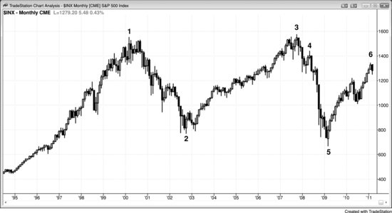
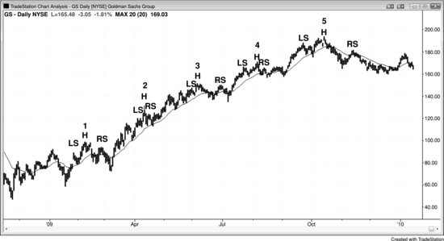
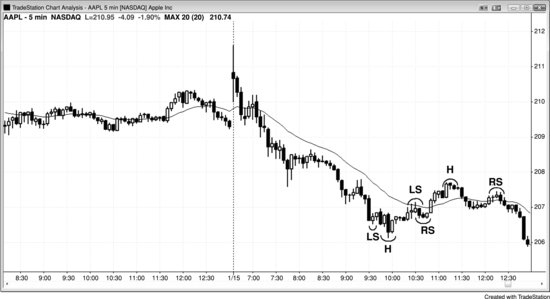

趋势运行过程中会不断产生反转形态，但除了最后一个以外，其余全部失败。因此，把这些常见形态称为"反转形态"其实很容易产生误导。更准确的理解是：它们本质上属于延续形态，绝大多数时候不会失败；然而一旦失败，就有较大概率（60%以上）引发真正的反转。每看到一个顶或底就将其视为理想的反转建仓形态，这种做法是错误的——如果每次都逆势入场，大多数交易会亏损，偶尔的盈利也不足以覆盖这些亏损。但如果能有选择性地操作，结合其他证据判断趋势有较大概率（60%以上）反转，那么这些形态就能成为有效的建仓形态。

所有的头肩顶和头肩底，本质上都是头肩延续形态（旗形），因为它们属于交易区间。与所有交易区间一样，价格更有可能（60%以上）朝趋势方向突破，只有少数情况下才会反转趋势。双顶和双底也是同样的道理。举个例子，如果多头趋势中出现一个头肩顶，跌破颈线的突破通常（60%以上）会失败，市场大概率（60%以上）随后向上反转，完成一个顺势突破，涨过右肩上方。如果这个形态基本水平，它就构成了一个三角形；如果略微向下倾斜，就是一个楔形牛旗。三次向下的推动分别对应左肩、头部和右肩之后的下跌腿。右肩是在头部下跌打破多头趋势线之后，试图形成的一个更低高点。由于从头部的下跌通常（60%以上）会跌破多头趋势线，右肩就变成了一个更低高点的突破回调。此外，如果空头趋势中出现一个交易区间，而这个交易区间呈头肩顶形状，那么跌破颈线就是熊旗的顺势突破，有较大概率（60%以上）带来更低的价格。

同样，头肩底也是顺势建仓形态。空头趋势中的头肩底通常（60%以上）是三角形或楔形熊旗，应该向下突破，跌破右肩下方。多头趋势中的头肩底则是牛旗，应该向上突破，涨过颈线上方。

**图 20.1** 标普现金指数月线图上的12年交易区间

如图 20.1 所示，标普（S&P）现金指数月线图上出现了一个大型双顶。2007年夏天市场测试2000年高点时，所有在K线1附近买入的交易员都想拿回本金。他们经历了一路暴跌到K线2的惨痛亏损。到了K线3，亏损终于回本，但他们不愿再冒险经历又一次大跌，于是平仓离场，在出现一次大幅回调之前不愿再买入。一大批买方退出市场后，空头取得控制权，推动市场下跌。常见的情况是：交易员想等回调再买入，但回调来得又深又猛，猛到他们改变主意不敢买了；这种买方缺位有时会加速下跌。当然，真实原因远比这复杂得多，市场上无数参与者各有各的理由，但这是其中一个重要因素。

市场常常在前低附近找到支撑。这里，在K线2附近做空的交易员回到了接近盈亏平衡点的位置，他们的平仓带来了一波反弹。此时市场进入了交易区间，持续时间可能很短也可能很长。一旦突破到来，方向可能向上也可能向下。双顶的标准入场方式是在两个顶之间的低点下方挂卖出突破单，但这种做法很少成功，因为80%的突破都会失败。那个低点就是K线2，六年后才出现跌破K线2低点的突破，结果也失败了。随着从K线5开始的上涨，可以明确看出这个双顶正在演变成交易区间，而非空头突破。极少有看到这个大型双顶的交易员会等着在K线2下方做空。大多数人会在K线3附近做空，或者在七个月后形成的K线4更低高点和低点2处做空。

未来几年内，市场可能在双顶回调做空建仓形态之后回落到K线5附近测试，甚至形成一个左肩仅略低于头部的头肩顶。由于大多数顶部都会失败，之后可能跟随一波上涨，使得整个形态演变为一个大型楔形牛旗。接下来就是突破形态顶部，并在未来十到二十年内完成大致的测量移动向上。

顺便提一下，图中有几个成功的小型双顶。K线1楔形之后形成的更低高点与K线1构成了一个双顶。此外，K线3楔形的第二次上推与K线3也构成了双顶，尽管略低于K线3的高点。

**图 20.2** 大多数头肩顶实际上是牛旗

图 20.2 中高盛（GS）日线图上出现了多个头肩顶形态。头肩形态大概是让新手亏钱最多的形态之一，多半是因为太多市场评论员把它叫做反转形态，但实际上它几乎总是延续形态。头肩顶本质上就是三角形或楔形牛旗，是可靠的做多建仓形态。说它是楔形，是因为它有三次向下推动——左肩之后一次、头部之后一次、右肩之后一次。既然它是多头趋势中的横向交易区间，表现理应和多头趋势中其他交易区间一样，最终走出多头突破。当然，跟所有延续形态一样，它偶尔也会突破失败、演变为反转，所以给它贴上"**顶**""**底**"或"**反转**"这类标签其实很误导人。这些叫法会让交易员做出跟正确方向相反的操作，最好别用。在多头趋势中看到这种形态正在形成时，把它当成楔形牛旗来看待、来命名会更好，因为这样你才会在多头趋势的暂停中找买入机会——这才是能赚钱的策略。不要把它叫做头肩顶，因为它几乎可以肯定不是顶部。同理，如果你在空头趋势中看到头肩底正在形成，不如直接把它叫做三角形或楔形熊旗，这样你才会去找做空机会，而做空才是在空头趋势中赚钱的正确方式。

市场无时无刻不在尝试反转，而这些反转尝试通常在即将扭转 Always-in 的方向时就结束了。上面那些头肩顶就是最好的例子。其中不少确实向下突破了，但光突破还不够，交易员还需要看到跟随。经验丰富的交易员知道，大多数向下突破不会有跟随，所以他们把这些空头突破当作绝佳的买入机会。就在那些过于急切的弱势空头追着颈线下方的强空头趋势K线做空、触发了头肩顶"反转"的时候，强势多头果断进场大举买入——他们判断正确：这波空头反转大概率会失败，不过是又一个多头旗形罢了。

**图 20.3** 头肩顶与头肩底熊旗

图 20.3 展示了苹果（AAPL）中一个失败的头肩底和一个头肩顶熊旗。当天市场处于始于开盘的空头趋势中，尝试搭出一个头肩底（左肩、头部、右肩），但不出意外，这个头肩底没能扭转市场，反而演变为更大的熊旗。楔形熊旗的第三次上推成了头肩顶熊旗的头部。这个头肩顶的头部是一轮两段式反弹的终点，在太平洋时间上午 11:15 的第一根均线缺口K线处结束。之后市场试图在头部之后形成 HL，但失败了，那波小反弹变成了右肩，也就是从通道上升到头部这段走势的突破回调。强空头趋势中出现第一根均线缺口K线之后，价格往往会测试空头低点，这次突破正是如此。
