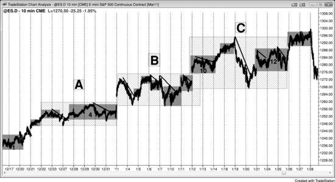
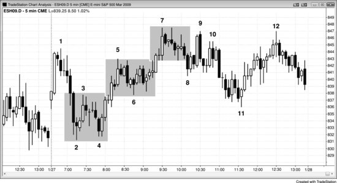
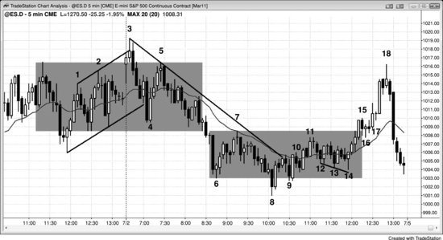
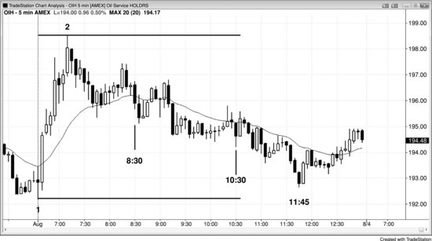
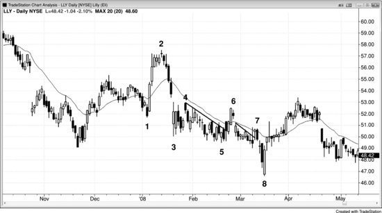
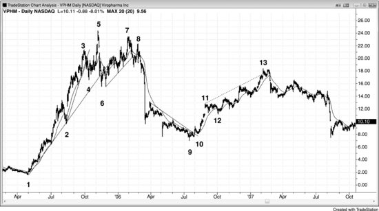
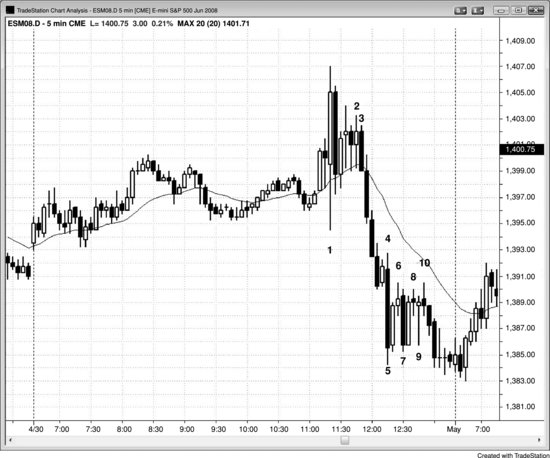
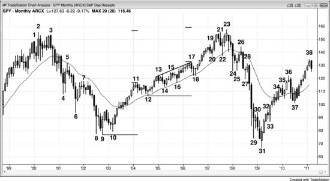

交易区间最宽泛也最实用的定义是：双向交易的区域。它小到可以只有一根K线（一根十字星），大到可以覆盖屏幕上所有的K线。它可以大致水平，说明多头和空头势均力敌；也可以略微倾斜——向上倾斜说明多头更积极，向下倾斜说明空头更强。如果倾斜幅度过大，就应该归类为趋势通道而非交易区间。区间内的波段可以很大、持续很多根K线，也可以非常紧凑，每个波段只有一两根K线，形成一个窄幅通道。当区间水平运行时，上下边界线就构成支撑和阻力——下方是支撑，上方是阻力。

"交易区间"一词通常指图表上没有趋势、大体水平的那一段，但更宽泛的定义对交易员更实用——一旦识别出双向交易正在发生，就可以同时在两个方向上寻找交易机会。很多新手过于急切地寻找反转，在市场还不太可能从趋势转入交易区间时就忍不住下单。然而，一旦有足够的证据表明这种转换正在发生，往往就会出现高概率的逆势刮头皮甚至波段交易的入场形态。关键在于入场之前等到足够的证据。有些形态通常不被视为交易区间，但它们确实符合更宽泛的定义——图表上存在双向交易的任何区域都算，而这种情况占了大部分时间。趋势中会有短暂的急速运动阶段，此时几乎没有双向交易，但趋势中的大部分价格行为都伴随着一定程度的双向交易，因此本质上都属于某种类型的交易区间。

回调是交易员认为趋势即将恢复时出现的交易区间。传统意义上的交易区间则是一个方向不确定的区域，趋势既可能恢复也可能反转，而大多数突破尝试都会失败。多头趋势中的上升通道和空头趋势中的下降通道属于倾斜的交易区间，因为两者都存在双向交易，只不过顺势方的力度强于逆势方。它们同时也是一个尚未完全展开的交易区间的第一条腿。举个例子：市场先以一连串大阳线急速上涨——影线很短、K线之间几乎没有重叠——随后很快进入另一个阶段：K线重叠增多、影线变长、开始出现阴线实体、斜率变缓、回调开始显现（哪怕只有一根K线的回调）。这就是多头通道。所有通道本质上都是交易区间，因为它们代表双向交易。如果通道陡峭向上且回调很小，空头虽然参与其中，但正被多头压制。通道由一系列小型交易区间组成，每个小区间之后紧跟一个小突破，再接下一个小交易区间。随着通道的发展，波段逐渐变大——多头不再那么激进，空头越来越积极。最终价格会跌破通道下沿，随后通常回测通道底部。到这时，市场已经走出了一条上升腿（多头通道）和一条下降腿（回测通道底部），大多数交易员会把整个结构视为一个交易区间。它可能形成一个双底多头旗形，也可能在某个时刻被空头夺取控制权，走出一波急速下跌，使整个走势发生反转。

以下是交易区间中常见的一些特征：

- 即将到来的突破方向让人捉摸不定。事实上，不确定性正是交易区间的核心特征——只要大多数交易员感到不确定，市场就处于交易区间之中（趋势则带有确定性和紧迫感）。不过，交易区间最终通常是趋势延续形态，也就是说，它只是更高时间周期图表上的一段回调。
- 几乎所有交易看起来确定性都不超过 55%。
- 多头和空头的建仓形态同时出现。
- 屏幕上出现了多次方向转换。
- 整体价格行为基本呈水平运动，屏幕左右两端的K线在纵向上位于屏幕中间三分之一的区域。
- 大部分K线集中在屏幕中间区域，顶部和底部附近出现剧烈反转。
- 市场反复扫止损，往往借助强趋势K线完成，但紧接着下一根K线就反向运动。比如，两根空头趋势K线跌破一个明显的波段低点，但下一根K线市场就掉头上涨。
- 多头和空头趋势K线虽然都不少，但很少出现连续三四根同向趋势K线的情况。
- 很多K线带有明显的影线。
- 很多K线与前一根K线重叠 50% 以上。
- 常常出现连续三根或更多K线彼此重叠 50% 以上的区域。
- 十字星频繁出现，大小不一。
- 均线相对走平。
- 屏幕左侧之外的价格行为同样处于交易区间。
- 刚刚出现了一波令人印象深刻的买入高潮或卖出高潮。
- 真空效应存在，导致顶部出现强烈的多头急速上冲、底部出现强烈的空头急速下杀，但都未能成功突破，反而回落到区间之内。
- 很多波段可以细分为两段较小的腿，然后反向走出方向相反的两段式运动。
- 底部的低 1 和低 2 做空建仓形态、顶部的高 1 和高 2 做多建仓形态通常会失败。
- 信号K线往往看起来很弱，即便是二次入场信号也是如此。

只要存在双向交易，哪怕只持续一根K线，那个区域都算交易区间。当你把一个交易区间称为回调时，说明你认为趋势大概率很快会恢复，因此你可能只做顺势方向的交易。每个交易员的判断标准不同，但一般来说，如果你有大约 60% 以上的把握认为趋势即将恢复，就可以把当前形态看作回调。反过来，如果你对趋势恢复没那么有把握，那当前形态就是交易区间。交易区间本质上就是持续时间过久、已经失去短期预测能力的回调——向上或向下的突破尝试大约有 80% 会失败。如果你在底部附近买入，市场大概率会涨到顶部，但不会突破，而是出现一个做空建仓形态，价格回到你做多入场的位置附近。如果你在顶部附近做空，市场大概率会跌出足够刮头皮获利的幅度，但随后又反弹到你的入场价附近。从更长的时间尺度看，交易区间之前的趋势最终大概率会恢复，因为交易区间本质上只是更高时间周期图表上的一段回调。但如果这个区间在你所交易的图表上持续了好几天，而你只做一笔顺势交易然后干等突破，就会错过很多交易机会。虽然你可以在更高时间周期图表上把它当作回调来交易，但大多数交易员发现，只看一张图、只做一个时间周期的交易更容易赚到钱——尽管他们也清楚更高时间周期和更低时间周期上都有建仓形态存在。

遇到回调时，你通常应该只做顺势交易，除非回调幅度大到足以做一笔逆势刮头皮。即便如此，大多数交易员还是应该等待顺势建仓形态出现再入场，因为逆势刮头皮对除最有经验的交易员之外的所有人来说都是亏钱的策略。如果你要做逆势交易，前提是你认为市场将进入交易区间，而不仅仅是回调。在交易区间里，你可以双向交易，因为向上和向下的突破尝试大多会失败。不过，如果在多头趋势中的交易区间底部出现了一个特别强的建仓形态，你可以考虑把全部或部分仓位做成波段交易。同样，如果在强空头趋势之后的交易区间顶部出现了一个强做空建仓形态，你也应该把部分或全部空头仓位做成波段交易。

在多头趋势中，大部分交易区间的最后一段下跌都是空头通道——这是空头的最后一搏，试图构筑顶部并开启新的空头趋势。空头通道本质上就是一面牛旗。多头既可以在交易区间底部出现向上反转时买入，也可以等到突破之后的回调再入场。当交易区间处于多头趋势中时，上涨的力度往往强于回调，在区间接近尾声时尤为明显。而且每一次回调都充当一面旗形，下一波上涨就是对这面牛旗的突破，随后的回调则构成一个突破回调买入形态，同时也是又一面牛旗。其中某一面牛旗终将成为最后一面，它的突破将演变为多头趋势恢复后的新一段上涨。由于所有交易区间在更高时间周期图表上都是回调，因此这个突破同时也是更高时间周期牛旗的突破。空头趋势中的交易区间则恰好相反，最后一段通常是多头通道，也就是一面熊旗。

通道最终通常会演变为交易区间，交易员始终在关注这一转变的最早迹象。由于通道本身是一种趋势，交易员不太愿意逆势操作；但一旦进入交易区间，双向交易就随之展开。一旦交易员认定市场已转入交易区间，反方向的急速运动和通道形态就会出现。有时趋势会发生反转（多数反转形态本质上就是交易区间），但更大的可能是市场至少还要在交易区间里再停留10到20根K线。

每一个通道中都存在双向交易，而且通道通常是交易区间的起点。不过，只要高点和低点还在沿趋势方向推进，通道就仍在延续，市场尚未转化为交易区间。以上升通道为例，当价格靠近最近一个更高低点时，多头会积极买入所有回调，因为他们想让所有人认为市场仍处于通道之中——通道是多头趋势的一种形式——而非身处交易区间。这样一来，其他交易员更可能跟随买入，上涨更可能延续，他们的利润也会随之增长。有时市场会先跌破一个较小的更高低点，然后才找到买盘支撑。这个新低点便形成了一条新的、更平缓的趋势线（从通道底部画起），构成一个坡度更缓、范围更宽的通道。这说明价格行为正变得越来越双向化，越来越接近交易区间的特征，但整体仍处于通道之中。一旦市场明确进入交易区间，交易员就会在上涨中卖出，这将削弱多头继续推高市场的能力，压缩他们的盈利空间。只要能让市场保持向上的趋势，多头就知道大多数交易员只会寻找做多机会。市场常常会回落到最近一个更高低点附近，形成双底牛旗买入形态。多头可以接受这种局面，因为他们清楚这是一个多头买入形态，一旦触发——即价格突破信号K线的高点——市场应该会有大约一个测量移动的上涨空间。至少他们由此能估算出上涨还能走多远，从而获得一个止盈目标。

当市场处于趋势的急速阶段时，走势极为单边，回调是由机构止盈引发的，而非机构在做反向交易。随着回调幅度加深，逆势交易者开始进行剥头皮操作。一旦回调扩展为交易区间，更多逆势交易者加入剥头皮行列，有些还开始分批建立反向仓位。顺势交易者对趋势还能延续多远越来越缺乏信心，于是从波段交易转向更多的剥头皮操作。这就是交易区间中多空双方的剥头皮都占主导地位的原因。双方都在低买高卖：底部的买入来自多头建仓做多和空头止盈平仓，顶部的卖出来自空头建仓做空和多头止盈平仓。交易员的职责是跟随机构的步伐，因此也应当采取剥头皮策略，在区间底部附近买入、顶部附近卖出。只要市场处于交易区间，交易员就应该立刻想到："低买高卖，做剥头皮。"

交易区间中存在双向交易，多头在底部附近更强势，空头在顶部附近更强势。区间中的每一波上涨本质上都是一面熊旗，每一波下跌实际上都是一面牛旗。正因如此，交易员在区间顶部的操作方式与在空头趋势中交易熊旗相同。他们在K线上方和下方卖出，在阻力位上方和支撑位下方卖出。之所以在K线上方卖出——包括强多头趋势K线上方——以及在各种阻力位上方卖出，是因为他们把每一次上涨都视为向区间顶部突破的尝试，而他们深知大多数突破尝试都会失败。之所以在K线下方和各种支撑位下方卖出，是因为他们把每一次下跌都等同于空头趋势中熊旗底部的突破。他们预期向上突破交易区间的尝试会失败，而熊旗突破会成功，市场很快便会反转下行并测试区间底部。

他们像在多头趋势中交易牛旗一样交易区间底部。他们在K线上方买入，也在K线下方买入；在阻力上方买入，也在支撑下方买入。之所以在K线下方买入——哪怕是强空头趋势K线下方——以及在各种支撑下方买入，是因为他们把每一次下跌都看作从区间底部突破的尝试，而他们知道大多数突破尝试都会失败。之所以在K线上方和各种阻力上方买入，是因为他们把每一次上涨都当成多头趋势中牛旗顶部被突破。他们预期向下突破交易区间的尝试会失败，而牛旗突破会成功，市场很快反转上行并测试区间顶部。

图表处于趋势中时，交易区间相对较小，更准确地说应该叫回调，因为它们只是趋势中的短暂停顿，之后市场会去测试趋势的极端价位。如果测试没有出现、市场直接反转了，那么起初看起来像回调的走势实际上已经演变成了反转形态。如果图表上布满了贯穿整个屏幕的上下波段，说明多空双方都没有占据主导，轮流控制着市场，图表就处于交易区间中。每个波段都是一小段趋势，都有交易机会，在较低时间级别上尤其如此。在更高时间周期上，这个交易区间会是某个趋势中的回调。比如，5分钟图上的大型交易区间，在60分钟图上可能（60%+）只是趋势中的一次回调；60分钟图上的交易区间，在日线或周线图上则会是一次回调。

很多交易员喜欢用旗形、三角旗、三角形这样的描述性名称，但叫什么名字并不重要，关键是双向交易正在发生。市场处于突破模式中，某个时刻会朝某个方向突破进入新一轮趋势。多空双方都认为当前价格区域是合理价值区，都在主动建仓。价值体现在极端位置：支撑处市场太便宜，阻力处市场太贵。交易区间的中间位置对多空双方来说同样是价值区，因为双方都把它当成极端位置——多头认为市场正在筑底，所以是低点；空头认为市场正在筑顶，所以是高点。如果市场稍微往下跌一点，空头会减少卖出，多头则会在这个更好、更极端的价格上更积极地买入，把市场推回区间中部附近。如果价格涨到接近区间顶部，多头会减少买入，因为觉得市场有点贵了；空头则会更积极地在这些更好的价格上卖出。

即使是陡峭的通道也属于突破模式。比如在一个陡峭的多头通道中，市场可以从通道顶部突破，趋势向上加速。这种情况发生时，突破通常（60%+）在一两次尝试后就失败，一般在大约5根K线以内。如果市场反转回到通道内，通常（60%+）会刺穿通道的另一侧，之后往往跟随更大幅度的回调或反转。即使突破急速持续了好几根K线，通常（60%+）很快也会出现回调去测试通道，而且常常会重新进入通道、从另一侧突破出去，然后至少跟随一次两段式回调，有时甚至是趋势反转。

在5分钟 Emini 图表上，当市场处于相对窄的交易区间中、每个波段只有2到4根K线就朝区间另一侧反转时，实际发生的事情往往比表面看到的多得多。很容易把这种价格行为简单归结为轻量交易下的随机漂移，但如果去看成交量，会经常发现每根K线平均有1万手以上的合约，这绝不是轻量交易。真实情况可能（60%+）是：很多机构在区间内同时运行买入程序和卖出程序。市场接近区间顶部时，卖出程序卖得更凶；接近底部时，买入程序压过卖出程序。哪一方都赢不了。到某个时刻，要么买入程序在区间顶部压过卖出程序，市场向上突破进入上涨；要么卖出程序在区间底部压过买入程序，市场形成空头突破。不过在那之前，交易区间可能（60%+）会出现十几次甚至更多的上下波段，而由于那十几次突破尝试在最终有一次成功之前全都失败了，押注突破失败远比每次尝试突破时跟进入场要好得多。必须理解的一点是：每张图表上突破都很常见，但大多数都会失败——这在第一部分关于突破的章节中已经讨论过了。

交易区间始终在尝试突破，正因如此，价格向顶部和底部的波段运动往往带有很强的动能，经常出现一两根甚至三四根影线很短的大趋势K线。当价格测试区间底部时，空头试图制造足够的动能来吓住多头、吸引更多卖家加入，从而实现有跟随的突破。但下跌这一腿刚启动时，多头就已经在观察逐渐增强的下行动能，盘算着在什么价位可以再次大举买入。空头同样在寻找合适的价位来获利了结。还有什么比出现几根大阴线、跌破一个波段低点更好的机会呢？尤其是当那个位置恰好还在趋势线或测量移动目标等支撑区附近。多头和空头都在等待市场测试区间底部，不管是未及还是过冲都无所谓。价格向区间底部下跌时，多头和空头都预期它还会继续走低、完成一次清晰的测试，所以没有理由现在就买——既然再等一下就能买到更便宜的价格。当这些机构交易者选择观望时，市场中就出现了相对的失衡，下跌动能往往因此加速。这就是真空效应，它会迅速将价格吸向区间底部。一些大型程序化交易者专做动能交易，在动能强劲时积极卖出，一直卖到下行动能停止为止。这就产生了大阴线，随后紧接着向上反转。价格测试区间低点时出现一两根大阴线是很常见的。一旦价格到达支撑位——通常是一个小型测量移动目标——买方就会涌入并大举买进。空头回补获利平仓，多头建立新的多头仓位。动能随之停下来，那些做动能交易的人也停止卖出、开始回补空头。当这么多大型交易者持续而积极地买入时，市场就开启了一波向上的波段。

如果你是机构多头或空头，这正是理想状态。你想在价格处于区间底部时买入，而一根过度延伸的大阴线就是最好的买入信号——还有什么比这更好的？你坚信市场会涨上去，而眼前价格却在急速下跌、展现出极端的空头力量。这是绝佳的买入机会，因为你认为当前的价值非常好，而且你知道如果判断正确，价格只会短暂停留在这个低位。机构交易者会突然大量涌现，积极买入。有些人会在最后那根大阴线收盘时就买入，另一些人则会等着看下一根K线是不是暂停K线。如果下一根K线收阳，他们会更有信心。如果确实是暂停K线，他们会将其视为空头无力跟随卖出的进一步证据，说明空头很弱。他们也可能等到价格突破前一根K线的高点、走势真正反转时再入场。各个时间周期上都会有大批多头和空头在所有这些信号出现时买入，每一种能想到的信号都在告诉他们该入场了。

一些获利了结的空头在价格下跌过程中逐步加仓。这使得他们的平均入场价随之降低，从而能够在价格向上反转到平均入场价之前就积极回补全部空头仓位，确保退出时仍有利润。既然空头在买入回补而非继续卖出，多头又在积极做多，市场就出现了相对的买方失衡，价格再次向区间顶部运动。在交易区间顶部则会发生相反的情况——强阳线往往引发多头获利了结和空头建立新空头仓位的卖出。

这就解释了为什么交易区间总是快速冲向顶部和底部，看起来总像是即将突破、结果却反转。这也解释了为什么大多数交易区间的突破都会失败，以及为什么会出现突破顶部的大阳线和突破底部的大阴线。价格越接近区间顶部或底部，就有越多交易者相信它会超过前一个极端，哪怕只是一两个Tick。交易区间的顶部和底部具有磁力吸引效应，价格越接近，这种吸力就越强——因为那些预期市场会反转的大型交易者只是在等待最佳价格，一旦到位就突然大举入场，推动市场反转。所有交易区间都是这样，包括多头和空头通道、三角形，以及多头和空头旗形。

不要被交易区间顶部或底部那些强劲的动能冲击所套住。你要跟着机构的动作走——恰恰是在市场看起来最有力量要突破的时候，机构反而在区间顶部卖出那些强多头趋势K线，在区间底部买入那些强空头趋势K线。只有图表阅读经验非常丰富的交易员，才适合在突破K线收盘时就押注突破失败。绝大多数交易员更应该等市场反转回到区间内部后，再用突破单入场。而且，只有在信号K线不太大的情况下才应该做这笔交易，因为入场点必须靠近区间的极端位置，而不是在区间中间。

突破最终会成功，但在此之前的五到十次尝试，看起来都会很强，却全部以失败告终。鉴于这样的概率，预期突破失败是更明智的选择。当成功的突破出现时，可以在回调时入场加入新趋势；如果突破本身足够强、整体背景也支持突破成功，甚至可以在突破过程中就入场。但在那之前，要跟着机构走：一旦机构在区间顶部或底部制造出反转——也就是一次失败的突破——就抓住这个反转入场机会。第一部分关于突破的章节讨论了成功的突破通常具有什么特征。

既然多头趋势中的交易区间就是一面牛旗，在高时间周期图表上不过是一段回调，交易员就可以用买入突破单做多，保护性止损放在交易区间底部下方较远的位置。任何一次突破成功的概率大约只有20%，但市场最终向上突破的概率大约是60%。不过，在多头趋势恢复之前，市场可能会多次向上和向下假突破，所以如果交易员做多突破又不想被止损出场，保护性止损就必须放在交易区间下方足够远的地方，确保反复出现的向下假突破不会将他们打出局。很少有交易员愿意承受这么大的风险、等这么长的时间，所以大多数交易员不应该买入大部分交易区间的突破。有时候，多头趋势中交易区间的向上突破确实是一个好的买入突破单入场机会，但前提是突破之前多头趋势就已经明显开始恢复。即便如此，通常更好的做法是在交易区间内部、多头趋势恢复的过程中入场，或者等突破发生后确认突破确实很强再买入，要不然就等突破回调形成时再入场。

媒体总把交易员描绘成在恐惧和贪婪之间摇摆。对新手来说可能确实如此（概率60%以上），但对有经验的交易员来说，这两种情绪都很少出现。还有一对情绪在他们身上更常见，也更有用：不确定感和紧迫感。趋势是一个相对确定的区域。你的直觉能告诉你，市场更可能处于趋势中（概率60%以上），还是只是交易区间内的一段强势推动。如果你感到不确定，市场更可能处于交易区间（概率60%以上）；如果你反而感到紧迫、一直盼着回调好入场，那市场更可能处于趋势中（概率60%以上）。每一段趋势都由一系列急速段和交易区间组成，而急速段持续时间很短。急速段存在时，概率带有方向性偏向。也就是说，在多头趋势的急速段中，市场先涨X个Tick的概率大于先跌X个Tick的概率，超过50%，如果趋势很强的话可以达到70%甚至更高。此时多头和空头都认同市场需要移动到一个新的价位，在那个价位不确定感会重新出现。交易区间就是这个不确定的区域——当你对市场方向感到不确定时，市场很可能就处于交易区间中（概率60%以上）。在交易区间中部，市场先涨或先跌X个Tick的概率大多数时候大约是50%。这个概率会有短暂的波动，但大部分波动持续的Tick数太少，无法从中获利。这种对不确定状态的寻找，就是测量移动的基础。市场会沿着高概率方向持续运动，直到概率降到50对50以下——这意味着反转可能发生（概率60%以上），即市场向反方向运动的概率更大。大多数时候，这会发生在某个支撑或阻力区域附近，比如之前的波段高低点、趋势线或趋势通道线，而且大多数时候会在某个测量移动目标区域附近。反转就是市场向未来交易区间中部运动的过程，在那里市场先涨或先跌X个Tick的概率回到50%。

当你对一个交易区间完全没有方向偏好时，等距运动的方向概率为50%，市场大致处于该区间最终中间位置附近。随着市场靠近区间上沿，下跌概率开始占优，市场先跌X个tick再涨X个tick的方向概率可达60%甚至更高。靠近区间下沿时情况则相反，方向概率偏向上涨。如果此前有一轮强劲的多头趋势将市场推升至这个区间，且尚未出现明确的顶部，那么即便市场处于交易区间的中间位置，方向偏好仍然有利于多头。如果趋势非常强，区间中间位置的方向概率可能在53%到55%之间，尽管没有人能确切知道。只需记住一点：交易区间在高时间周期图表上属于延续形态，如果之前有一轮强劲的多头趋势且没有明确见顶，那么向上突破的概率更大。在一轮强劲的多头趋势之后，当市场回落到区间底部时，等距运动的方向概率要高于空头趋势之后形成的交易区间底部——因此不是60%看涨，而可能是70%到80%。实际上，在跌X个tick之前先涨2倍甚至3倍X个tick的概率可能也有70%甚至更高。举个例子：假设交易区间高度为50个tick，你在一轮两段式回调触及区间底部后，在一根多头反转K线上方买入，这根K线高度为8个tick，那么市场在触及你入场价下方10个tick的止损之前，先上涨20或30个tick的概率可能有70%。同样，在区间顶部附近，等距运动的方向概率也不同于空头趋势后形成的交易区间——并非70%到80%的概率先跌X个tick再涨X个tick，可能只有60%左右。再次强调，没有人能确切知道具体概率，但意识到这种偏好是有帮助的，因为它会影响你对是否入场的判断。在大级别多头市场中，你应该更倾向于在交易区间底部买入，而非在顶部做空。

多头和空头都不知道突破会朝哪个方向发展，但双方都愿意在区间内交易。由于多头倾向于在区间顶部减少买入，空头倾向于在顶部加大卖出，而在底部则相反，因此市场大部分时间都停留在中间区域附近。这片舒适区域具有一种磁力效应——每当市场偏离它，就会被拉回来。即便出现一个持续数根K线的有效突破，市场通常也会被拉回区间内，这就是最终旗形的基础，第三册会详细讨论。还有一种常见情况：市场先朝一个方向突破并走出几根K线，然后反转，接着朝相反方向突破，最后又被拉回区间内。交易区间的磁力效应可以持续好几天。经常可以看到市场从一个强交易区间（比如一个持续了10根K线以上的较窄区间）以趋势的方式走出去，两三天后又回到区间内。

是什么让交易区间中的多头或空头改变了看法，最终使突破得以成功？极少数情况下，会有一个预期中的新闻事件，比如盘中特定时间公布的联邦公开市场委员会（FOMC）报告，但大多数时候突破是出乎意料的。电视上总会给出一个与新闻相关的理由来解释突破，但多数情况下这与实际发生的事情可能毫无关系。一旦市场突破，CNBC就会请来某个专家，自信满满地把突破解释为某条新闻的直接结果。如果市场朝相反方向突破，同一个专家会用同一条新闻给出截然相反的解读。比如，市场在FOMC降息后向上突破，专家就会说利率下调利好市场。如果同样的降息导致市场向下突破，专家就会说降息证明美联储认为经济疲软，市场估值偏高。这两种解释都站不住脚，与实际发生的事情毫无关系。事情从来没那么简单，对交易员来说也毫无意义。每天大部分交易量来自程序化交易；在突破前后有数十个大型程序在运行，它们由不同公司独立开发，每家都在设法从其他公司手中赚钱。这些程序背后的逻辑是不可知的，因此也无关紧要。对交易员来说，唯一重要的是最终结果。作为交易员，你应该跟随机构的方向——如果他们在推动市场上涨，你就跟着买入；如果他们在推动市场下跌，你就跟着卖出。

几乎每次突破在最终成功之前，都会在 10 根或更多K线的过程中逐步展开，也就是说，市场可能在新闻发布前一个小时就已经选好了突破方向。不管新闻内容是什么，市场已经做出了决定。如果你能读懂价格行为，往往可以在突破发生之前就提前布局。

举个例子，如果多头觉得市场早该向上突破却迟迟未动，开始失去耐心，他们就会平掉多头仓位。这些卖出会增加空头一侧的抛压。与此同时，这些多头可能要等价格跌到明显更低的位置才愿意重新买入——他们不再在区间底部买入，买压因此减弱。结果就是价格以空头趋势的方式下跌，直到多头重新认为有价值的水平，然后形成新的交易区间。向上突破时情况相反：空头不再愿意在区间内做空，开始回补空头仓位，这会增加多头一侧的买压。空头只有在价格明显更高时才会重新做空，于是形成了一个稀薄区域，多头在这里快速推升价格，形成多头突破。市场会以多头趋势的方式继续快速上涨，直到空头重新认为做空有价值、多头开始止盈为止。这时双边交易恢复，又一个交易区间形成。

如果横盘走势持续了大约 5 到 20 根K线而且非常紧凑，交易者就要格外小心，因为多空双方处于非常紧的平衡之中。在这种情况下做突破交易代价可能很高——每次短暂的上冲都会被空头强力卖出，新进的多头也很快退出，导致区间顶部附近的K线上方出现影线。同样，每次急跌也很快被反转，区间底部附近的K线下方出现影线。不过，这种市场仍然有盈利的方法。一些机构和很多交易员会每隔几个 Tick 就逐步加仓做多、平掉空头，然后每隔几个 Tick 向上又反向操作。但对个人交易者来说，这种做法既乏味又几乎赚不到什么钱，而且等真正的突破终于出现时，他们往往已经筋疲力尽，没法好好交易了。

总体来说，所有交易区间都是延续形态，意思是大多数情况下会沿着之前趋势的方向突破。交易区间还倾向于朝远离均线的方向突破：如果在均线下方，通常向下突破；如果在均线上方，通常向上突破。当交易区间紧贴均线时，这个规律尤其明显。如果交易区间距离均线很远，那它可能是在构建一次回测均线的走势。如果一波多头波段在交易区间中暂停，最终向上突破的概率更大。不过，在最终突破之前，可能先出现好几次顶部和底部的假突破，有时市场甚至会逆势突破。另外，交易区间持续的时间越长，演变为反转形态的概率就越大（空头交易区间中的吸筹，多头交易区间中的派发），因为顺势交易者会担心自己推不动趋势继续，于是开始平仓，也不再加仓。正因为这些不确定性，交易者需要谨慎行事，寻找低风险的价格行为建仓形态。5 分钟图上持续数小时、包含很多大幅且难以判读的波段的交易区间，在 15 分钟或 60 分钟图上可能只是小型、干净、容易判读的交易区间，所以有时候切换到更高时间周期会有帮助。事实上，很多交易者就是在更高时间周期的图表上交易的。

大多数时候，你屏幕上的图表都处于交易区间中，多空双方对价值有大致共识。交易区间内部有小趋势，小趋势内部又有更小的交易区间。当市场处于趋势中时，多空双方对价值同样有共识，只不过他们的共识是：价值区域在别的地方。市场快速移动到一个多空双方都认为有价值的区域，在那里展开拉锯，直到一方被证明是对的、另一方被证明是错的，然后市场再次进入趋势。

有些交易区间日由两三波大的趋势性波段组成；波段进行的过程中，市场表现得像一个强趋势。但第一次反转通常要等到开盘大约一个小时之后才出现，而趋势日在此之前通常已经启动了。当趋势启动得太晚，当天很可能是交易区间日，而且至少还会出现第二次反转，测试区间中部。

当你对一个交易区间完全保持中性时，等距离运动的方向概率是 50%，市场大约处于最终成为区间中部的位置。当市场向区间顶部靠近时，向下的概率更大——市场先跌 X 个 Tick 再涨 X 个 Tick 的方向概率达到 60% 或更高。在区间底部附近则相反，方向概率有利于上涨。如果之前有一轮强多头趋势推升到这个区间，而且没有出现明确的顶部，那么即使市场处于区间中部，也存在有利于多头的方向偏差。如果趋势非常强，区间中部的方向概率可能是 53% 到 55%，虽然永远无法精确知道具体数值。你只需要意识到：交易区间在更高时间周期图表上是延续形态，如果之前的多头趋势很强而且没有明确的顶部，向上突破的概率更大。在一轮强多头趋势之后，当市场跌到区间底部时，等距离运动有利于上涨的方向概率，比空头趋势后形成的交易区间底部更高——可能不是 60% 有利于上涨，而是 70% 到 80%。实际上，市场先涨 2 倍或 3 倍 X 个 Tick 再跌 X 个 Tick 的概率甚至可能达到 70% 或更高。比如，如果交易区间高 50 个 Tick，你在区间底部一个两段式回调处的多头反转K线上方买入，这根K线高 8 个 Tick，那么市场先涨 20 到 30 个 Tick、再触及你入场价下方 10 个 Tick 止损位的概率可能有 70%。同样，在区间顶部附近，等距离运动的方向概率比空头趋势后的交易区间要低——不是 70% 到 80% 先跌 X 个 Tick 再涨 X 个 Tick，而可能更接近 60%。没有人能确切知道具体概率，但意识到这种偏差很有用，因为它会影响你的交易决策。在大的多头市场中，你应该更倾向于在区间底部买入，而不是在顶部做空。

多空双方都不知道突破方向，但双方都能安心在区间内交易。因为多头倾向于在区间顶部减少买入、空头在顶部加大卖出，而在底部双方做法相反，所以市场大部分时间停留在中间区域。这个舒适区有一种磁性引力——每当市场偏离它，就会被拉回来。即使发生了一次持续好几根K线的成功突破，通常也会被拉回区间，这就是最终旗形的基础，书三中会详细讨论。还有一种常见情况：一个方向突破跑了好几根K线，然后反转，接着向相反方向突破，随后又回调到区间里。交易区间的磁性效应可以持续好几天，经常可以看到市场从一个强交易区间（比如持续 10 根或更多K线的相对窄幅区间）趋势性地离开，两三天后又回到该区间。

是什么让交易区间中的多头或空头改变了看法，最终让突破得以成功？极少数情况下，是像联邦公开市场委员会（FOMC）报告这样的新闻事件，预定在盘中某个特定时间发布。但大多数时候，突破是出乎意料的。电视上总会给出一个跟新闻相关的突破理由，但多半跟实际发生的事情无关。一旦市场突破，CNBC 就会找一位专家来自信地解释，说这次突破是某条新闻的直接结果。如果市场向相反方向突破了，同一位专家会对同一条新闻给出完全相反的解读。比如，如果市场在 FOMC 降息时向上突破，专家会说降息利好市场；如果同样的降息导致市场向下突破，专家就会说降息证明美联储认为经济疲弱，所以市场定价过高。这两种解释都无关紧要，跟实际发生的事情毫无关系。事情永远不会那么简单，而且对交易者来说这些都不重要。每天大部分成交量来自程序化交易，突破前后有几十个大型程序在运行，它们由不同公司独立设计，每家都试图从其他公司手里赚钱。这些程序背后的逻辑是不可知的，所以也无关紧要。对交易者来说，唯一重要的是最终的合力结果。作为交易者，你应该跟着机构走——如果他们在推升市场，你就跟着买入；如果他们在打压市场，你就跟着卖出。

盘中时段——大约太平洋时间上午 8:30 到 10:30——对交易员来说可能很难操作，尤其是在没有明确趋势的日子里（也就是大多数日子）。如果市场价格大致处于当天区间的中间位置（或者仅仅是日内某个交易区间的中间位置），同时又处于交易时段的中间阶段，那么出现窄幅交易区间、K线大量重叠、长影线频现、多次小幅反转的概率就很高，大多数交易员最好少做。这种时候，与其在不够理想的位置入场，不如放弃交易，等市场去测试当天的高点或低点时再出手。尚未实现稳定盈利的交易员，在市场既处于日内时间中段、又处于当天区间中段时，根本不应该下单。仅仅做到这一点，就有可能让你从亏损转为盈利。

有时候，Emini 盘中会出现一个看起来极其漂亮的形态，你用突破单入场时还被滑了一个 tick。如果市场没有在几秒内迅速奔向你的目标价位，那你很可能已经被套住了。遇到这种情况，几乎总是应该挂一张限价单，在盈亏平衡点出场。任何时候，一个形态看起来好到不真实、明显到所有人都想入场时，它大概率就和表面一样——不是真的。

每当市场先向上急速运动、再向下急速运动（或反过来），就形成了一个高潮反转，这在第三本书中有详细讨论。急速运动之后通常会走出一段通道；但既然两个方向都出现了急速运动，多头和空头就会继续积极交易，都试图压倒对方，把通道推向自己有利的方向。这种高潮之后通常出现的双向博弈就是交易区间，短的可能只有一根K线，长的可以持续几十根K线。最终的突破通常会产生一个测量移动目标，幅度大致等于急速阶段的高度。

交易区间有时看上去像是反转建仓形态，但实际上只是趋势中的一次暂停。比如，60 分钟图上是一段强多头趋势，而 5 分钟图上先出现了持续几根K线的急速下跌，然后反弹几根K线，接着又是第二轮持续几根K线的急速下跌。这个形态在 5 分钟图上看起来空头意味很浓，但放到 60 分钟图上，可能只是一个简单的高 2 或双底做多建仓形态。如果这个 ABC 回调恰好落在 60 分钟均线附近，就更是如此。你不一定非要去看 60 分钟图，但必须时刻清楚交易区间出现之前的趋势方向。明确这一点，能让你更有信心去交易——这里实际上是一个大级别的高 2 做多形态，而不是新一轮空头趋势的起点。

有时候，空头趋势日的低点——尤其是高潮式抛售的那种——会出现在一个由大K线组成的小型交易区间中，这些K线往往带有长影线或大实体反转。这种反转在顶部不太常见，因为顶部的走势通常不像底部那么剧烈。这类交易区间同时也常常构成其他信号，比如双底回调或双顶熊旗。

尽管交易区间在更高时间周期图表上属于旗形，通常会顺着趋势方向突破，但也有一些会反向突破。实际上，大多数反转形态本质上都是某种交易区间。头肩形态就是一个典型的例子；双顶和双底也是交易区间。这些内容在第三本书关于趋势反转的章节中会进一步讨论，但有一点很重要：趋势中的大多数交易区间最终会顺势突破，而不会导致反转。因此，所有反转形态其实都是延续形态——只不过偶尔没能延续，反而转向了。正因如此，当你看到一个反转形态时，寻找顺势入场机会远比寻找反转入场机会更好。也就是说，如果当前处于多头趋势中，市场正在形成一个头肩顶，那么在市场试图向下突破时寻找做多信号，远好过直接做空那个突破。

所有趋势中都包含大小不一的交易区间，有些趋势主要由交易区间构成，比如趋势性交易区间日，这在第一本书第 22 章中已经讨论过。你需要注意的是，市场经常会在最后一两个小时尝试反转当天最后一段交易区间。因此，如果当天是一个空头趋势性交易区间日，就在最后一两个小时、当天低点附近寻找做多建仓形态。

有些经验丰富的交易员很擅长判断趋势正在演变为交易区间，一旦确认这种情况正在发生，就会逆势分批建仓。举个例子，假设当天是多头趋势性交易区间日，突破已经达到了基于下方交易区间高度的测量移动目标位，而且上涨走的是一个相对偏弱的多头通道，那么空头就会在前一个波段高点上方开始做空。他们还会留意相对较大的多头趋势K线，在其收盘价或高点上方做空，因为这根K线可能是买入高潮，意味着多头通道即将结束或接近结束，也就是说价格已接近交易区间的顶部。只有经验非常丰富的交易员才应该尝试这种操作，而且他们中的大多数会把仓位控制得很小，以便市场继续走高时还能加仓。如果市场确实继续上涨并且他们加了仓，有些人会在市场回调到第一次入场价附近时将全部仓位获利了结；另一些人则会在第一笔入场单回到盈亏平衡点后平掉该笔仓位，剩余仓位继续持有，等待市场测试通道底部。在多头通道运行的过程中，新手只会看到一个多头趋势，而有经验的交易员看到的却是一个正在形成中的交易区间的第一段。等到这一天结束后，新手回头看会发现交易区间的存在，也会认同它从多头通道的底部就已经开始了。然而在多头通道运行的过程中，新手并没有意识到市场同时处于多头通道和交易区间之中。作为新手，不应该在多头趋势中做空，在交易区间里也只在出现强信号时才考虑交易，最好等到第二次信号出现。那些做空的老手其实是在剥头皮，因为他们判断市场正在进入交易区间，而非反转为空头趋势。当市场处于交易区间中时，交易员通常应该只做剥头皮，等到下一轮趋势启动时，再把部分或全部仓位转为波段交易。

交易区间中最棘手的问题就是交易区间困境。由于大多数突破都会失败，你的利润目标是有限的，这意味着你实际上是在剥头皮。然而，当你压低回报而风险不变时，就需要更高的成功概率才能满足交易者方程的要求。否则，你就是在用一个注定迟早让你爆仓的策略在交易——所谓爆仓，就是账户余额跌破经纪商允许你下单的最低保证金要求。困境在于：你不得不剥头皮，但剥头皮要求非常高的成功概率，而这种高确定性在交易区间里不可能长期存在，因为交易区间的本质就是不确定性。如果区间特别窄，成功的概率就更低了。提高成功率的一个办法是：在市场朝你的反方向运行时，用限价单入场。比如，有些交易员会在看起来偏弱的高1或高2上方做空，或者在交易区间顶部的波段高点或多头趋势K线上方做空；也可能在看起来偏弱的低1或低2下方做多，或者在交易区间底部的波段低点或空头趋势K线下方做多。另一种方法是先建小仓位，如果市场反向运行再加仓。

如果区间足够大，大多数交易员会在区间顶部出现小空头反转K线时做空，在区间底部出现小多头反转K线时做多，尤其是出现二次入场点的时候。例如，在区间顶部做空低2，在区间底部做多高2。需要注意的是，虽然高2和低2建仓形态在交易区间中都有效，但交易员使用它们的方式与在趋势中不同。在多头趋势中，交易员会在一段上涨的顶部附近做多高2；但在交易区间中，只有当高2出现在区间底部时才会做多。同样，空头会在空头趋势的一段下跌底部做空低2，但在交易区间中，只有当低2出现在区间顶部时才会做空。

交易区间本质上就是一个水平通道，交易方式与其他通道相同。如果波段幅度小，就做剥头皮；如果波段幅度大，既可以剥头皮，也可以把部分仓位波段持有到区间的另一端。如果交易区间非常大，持续了好几天，那么其中某一整天的走势可以是强趋势，但仍然处于交易区间内部。遇到这种情况，按正常的趋势日来交易即可。如果波段幅度非常小，那就是窄交易区间，将在第22章讨论。区间越窄，你应该做的交易就越少。当区间属于窄交易区间时，你几乎不应该做任何交易。

市场处于交易区间时，应该在区间底部附近寻找做多机会，在区间顶部附近寻找做空机会。大致原则是：如果市场已经连续下跌了大约 5 到 10 根K线，就只找做多机会，尤其是价格接近区间底部的时候；如果市场已经连续上涨了 5 到 10 根K线，就只找做空机会，尤其是价格接近区间顶部的时候。只有当波段幅度大到足以获利时，才考虑在区间中部交易。比如，交易区间只有 10 个 tick 高，你就不该在距离区间低点 6 个 tick 的地方做多，因为价格再往上走 6 个 tick 的概率并不大，而你需要这 6 个 tick 才能拿到 4 个 tick 的利润。但如果交易区间有 6 个点高，你可以在区间中部做多一个更高低点，因为上方还有足够的空间，价格触及区间顶部阻力之前就能拿到剥头皮利润。第一本书中关于通道的章节讨论了通道的交易方法，而交易区间不过是一个水平通道，方法完全一样。

大多数K线都出现在区间中部，市场在极端位置停留的时间很短。到达极端位置时，通常是靠一根强趋势K线冲上去或冲下来，这让很多交易员误以为突破会成功且力度很强。极端位置附近经常会出现三根或更多大幅重叠的K线，信号K线迫使多头在接近最高价的位置买入，而这通常是个陷阱。举个例子，假设市场刚刚以几根强空头趋势K线急速跌到区间底部，然后横盘了几根K线，停在均线下方；此时出现一根强空头反转K线，但它与前面的K线大幅重叠，入场价差不多就在这个空头旗形的底部。这种情况下不要做这笔交易。这通常是空头陷阱，用限价单在那根空头反转K线的低点买入，远比用止损单在其低点下方一个 tick 做空要好。只有在盘面解读经验丰富的情况下，才去做这种押注失败的交易。

最好的入场是在区间顶部或底部的二次入场点，信号K线是一根朝交易方向的反转K线，既不会太大，也不会跟前一根K线过度重叠。不过，对于交易区间反转来说，信号K线的形态不像趋势反转那么重要。区间顶部的做空建仓形态，信号K线经常带多头实体；区间底部的做多建仓形态，信号K线经常带空头实体。除非交易员是想在一段强趋势中做反转交易，否则强反转K线通常不是必须的。

大多数交易员做剥头皮会亏钱，即使胜率达到 60% 也是如此，当风险大约是潜在回报的 2 倍时尤其明显。这意味着交易员在交易区间中交易时必须非常谨慎。鉴于 80% 的突破尝试都会失败，交易区间交易者必须把目标设得有限，很多最好的交易其实是大号剥头皮或小波段交易。例如，如果 Emini 近期平均日波幅大约是 10 到 15 个点，那么平均保护性止损大约是 2 个点。如果交易员在区间顶部一根强空头信号K线下方做空，而且交易区间至少有 6 个点高，尤其是在第二次信号时入场，那么他们冒 2 个点风险去赚 2 个点，成功概率至少有 60%。这就满足了交易者方程的最低要求，因此是一个可行的策略。如果这一波看起来可能下跌 4 个点，交易员可以在赚到 2 个点时平掉四分之一到一半的仓位，然后尝试让剩余仓位波段持有，目标大约 4 个点。获取 2 个点的部分利润后，他们可以把止损移到盈亏平衡点，或者从 2 个点收窄到大约 1 个点（4 个 tick）或 5 个 tick。此时他们冒 5 个 tick 的风险去博 4 个点，即使成功概率只有 40%，交易者方程仍然是正期望的。一些已经部分或全部止盈 2 个点的交易员会挂限价单在原始入场价再次做空，但这次只冒大约 5 个 tick 的风险。根据整体市场情况，他们的目标可能是 2 到 4 个点。如果入场K线或下一根K线变成了一根强空头K线，他们会倾向于持有更大的波段仓位。

如果交易区间只有 3 个点高，有时甚至是 4 个点高，用止损单入场通常是亏钱的策略。这时交易区间属于相对窄的交易区间（后面会详细讨论），只有非常有经验的交易员才应该参与。大部分交易需要用限价单入场，新手绝对不应该在市场下跌时买入或在市场上涨时卖出，因为他们总是会选到那些走势过头、令他们恐慌、最终亏损出场的情况。

不管交易区间有多高，只要正在测试区间顶部或底部的那一段走势呈现窄通道形态，最好等突破回调出现再入场，也就是等二次入场点。举个例子，市场已经连涨了 10 根K线，接近交易区间顶部，但这 10 根K线形成了一个微型通道——这时不要在前一根K线低点下方做空，因为向上的动量太强。应该等这个微型通道被突破后出现回调再说。回调可以是对通道顶部的任何形式的测试，包括较低高点、双顶或更高高点。然后在前一根K线低点下方做空，保护性止损放在信号K线高点上方。如果信号K线是一根质量不错的空头反转K线，建仓形态就更可靠，尤其是当它的幅度不会太大的时候。信号K线太大的话，它很可能（60%以上）与前面一根或多根K线有过多重叠，你做空的位置就离交易区间顶部太远了。遇到这种情况，通常（60%以上）最好等回调之后再做空。

任何做空建仓形态，如果在前面 10 根K线里还有其他证据显示强势空头正在进场，可靠性都会更高。比如这个价位附近有两三根K线顶部带长上影线，或者最近几根K线有较强的空头实体。这代表抛压正在积聚，交易成功的概率也就更大。同样的道理，如果你想在交易区间底部做多，而这个价位附近有几根K线底部带长下影线，或者有几根K线带多头实体，说明多头正在变得积极，这种买压会提高做多盈利的概率。如果入场位附近还有类似对抗线形态所提供的支撑或阻力，交易成功的胜算会更大。

交易区间总是看起来好像要突破，但大多数突破尝试最终都会失败。区间的极端位置经常被大趋势K线测试，如果你是有经验的交易员，可以在这种K线收盘时押注突破失败。虽然更安全的做法是等突破失败确认后再入场（突破和失败在第一部分讨论过），但如果你有把握判断这根趋势K线只是在扫波段高点或低点上方的止损单，就可以在该K线收盘时入场，尤其是当市场走势不利时你还能加仓的话。比如，过去三个小时市场一直在一个安静的交易区间内运行，刚刚形成了一个两段式下跌，跌破了前一个波段低点，收盘收在K线最低点，这时你可以考虑在该K线收盘时市价买入。如果之前上涨腿的动量普遍比下跌腿更强，胜算就更高；如果这根趋势K线正好测试到趋势线、趋势通道线、测量移动目标位或其他支撑位，胜算还会进一步提高。

由于并非每次波段都会触及交易区间的极端位置，可以考虑分批建仓。比如，市场已经上涨了 8 根K线，在交易区间顶部下方形成了一个低 3 建仓形态，你可以考虑在这个低 3 处做空，在 Emini 上用大约 4 个点的宽止损（前提是当天平均波幅大约 10 个点）。如果低 3 成功了，你就带着盈利出场。如果低 3 失败了，很可能（60%以上）很快会出现低 4，而且低 4 成功的概率更大。这种情况下，你可以在入场价上方固定 tick 数处加仓做空，也可以在前一根K线高点或波段高点上方加仓，或者用低 4 信号的突破单加仓。之后你可以在交易区间底部附近将两个空头仓位一起平掉，也可以在第一笔做空的入场价附近平掉。这样第一笔交易盈亏平衡，而第二笔在更高位入场的交易就是盈利的。分批进出场的内容在第 31 章讨论。

交易区间是双向的，回调很常见。如果你在交易区间里做了一笔交易，就必须愿意承受回调。但如果交易区间可能正在转变为趋势，一旦市场走势不利就应该出场，等待第二次信号。如果你有能力在市场走势不利时加仓，成功的胜算会更大。

如果市场处于交易区间底部，下跌动能又比较弱，反弹了一两根K线，看起来可能在形成一个低 1 做空建仓形态。但低 1 做空只有在空头趋势的急速阶段才值得做，在交易区间里做低 1 不太可能盈利。这时你应该这样判断：如果在前一根K线低点下方做空，市场更可能先向上走 8 个 tick，而不是先向下走 6 个 tick。也就是说，在前一根K线低点处或稍低几个 tick 的位置挂限价单买入是合理的——你押注的是低 1 做空会失败，从而形成一个更高低点。同理，如果你认为市场正在形成一个多头通道，低 2 也很可能失败，那就可以在低 2 信号K线的低点处或下方挂限价单买入。在交易区间顶部附近也可以反过来操作：当市场正在回落，形成低概率的高 1 和高 2 做多建仓形态时，可以在高 1 或高 2 信号K线的高点处或上方挂限价单做空。

交易区间内的每一腿经常会细分成两段小腿，因此你可以在前一腿突破时反向操作。在强多头趋势中，买入突破波段高点通常才能赚到钱；在强空头趋势中，做空突破波段低点通常才能赚到钱。如果市场只是从交易区间内第一腿下跌后稍微回调了一下，那么在第一腿底部突破处做空，成功的概率很小。相反，可以考虑在那个低点下方几个 tick 的位置挂限价单买入，做一笔向上的剥头皮交易。

绝大多数突破尝试都会失败，所以千万不要因为指望突破成功而死扛任何一笔交易。做多时，要在剥头皮目标利润处或交易区间顶部附近止盈；做空时，要在能拿到剥头皮利润的限价单处止盈，或者在交易区间底部附近出场。永远不要用马丁格尔策略。第 25 章会详细讨论这个问题——马丁格尔本质上是一种赌博手法：上一笔亏了就把下一笔的仓位翻倍甚至翻三倍，一直亏就一直加倍，直到赢一把为止。几乎每次你动了这种念头的时候，市场都处于窄幅交易区间中，很可能连亏四笔甚至更多；你迟早会放弃这种做法，因为仓位大到情绪上根本扛不住，最后只会留下一笔巨额亏损。突破或盈利的交易永远不会"该来了"——市场维持那种看似不可持续的走势的时间，远远超出你账户所能承受的极限。要挑剔一点，只做合理的入场，永远不要因为觉得"市场该给一笔好交易了"就贸然入场。

**图 PIV.1** 任何图表上的大部分K线都处于交易区间内

市场由交易区间和中间穿插的短暂趋势组成，而每一个交易区间内部又包含更小级别的趋势和交易区间。图 PIV.1 是 Emini 的 10 分钟图，展示了大约 6 周的价格行为。如果交易员只看 5 分钟图上大约一天半的数据，很容易忽略大格局。有些交易日是小型交易区间日，但放在大的多头市场背景下看就是另一回事了。图中大的交易区间用字母标注，小的交易区间用数字标注（数字指的是交易区间，不是K线编号）。交易区间反复尝试向上和向下突破，其中 80% 的突破尝试都会失败；但一旦真正突破，方向通常与之前的趋势一致。大多数反转形态本身就是交易区间，比如最右侧的交易区间（13），但大多数反转尝试最终会变成旗形，沿着趋势方向突破。

市场处于交易区间中时，交易员可以双向操作，每笔交易赚一小段利润。但如果在多头趋势中的交易区间底部出现了一个强的做多建仓形态，可以把一部分或全部仓位做成波段交易。比如在大的 B 交易区间内，出现了三次下推，形成了一个三角形，每次下推都测试了大的 A 交易区间的顶部。小的 8 交易区间还形成了一个双底，同时也是从 6 交易区间下来的一个牛旗。日内交易员可能会把多头仓位波段持有到收盘，而愿意隔夜持仓的交易员会看到，这是一个很好的做多建仓形态，这笔交易可以持续好几天。

注意观察，大多数交易区间最后一腿下跌都是空头通道——这是空方最后的挣扎，试图构筑顶部并启动新的空头趋势。空头通道就是牛旗。多方可以在交易区间底部反转向上时买入，也可以在随后通常很快出现的突破回调时买入。在空头趋势中的交易区间里情况正好相反：最后一腿上涨通常是多头通道，也就是熊旗。

**图 PIV.2** 早期多次反转往往导致交易区间日

开盘后头一两个小时内反复出现反转，通常意味着当天会走成交易区间日。很多大资金交易员从开盘起就预判当天是交易区间日，一旦持有这种预期的人足够多，他们的剥头皮和反手操作往往就真的促成了交易区间的形成。如图 PIV.2 所示，当天一开始向上突破，但在 bar 1 反转下跌，又在 bar 2 反转上涨。bar 3 处的反转失败了，但空头试图构建的空头通道在 bar 4 也未能成功，市场再次反转向上。涨到 bar 5 的这段多头急速走势中间有两次暂停，说明多头并不坚决。急速上涨之后，市场横盘了大约 10 根 K 线，期间多次出现小幅反转，还有 5 根空头实体 K 线——这再次表明多空双方力量非常均衡，而这恰恰是交易区间的典型特征。bar 7 是一根多头趋势 K 线，创出了日内新高，但紧接着出现的是一根空头内包 K 线，而非两三根多头趋势 K 线的延续。随后市场走出了几根大十字星，其中两根上影线很长，说明交易者在 K 线收盘前积极卖出（抛压明显）。这说明空头在日内高位非常强势，而这正是交易区间中常见的现象。等距移动的方向概率开始偏向空头——具体来说，先向上走 2 个点之前就向下走 2 个点的概率大约为 60%。虽然无法精确计算，但交易者们相信做空一方占有优势。到这时候，大多数交易者已经判断当天是交易区间日，价格跌到区间中部以下的概率很大。如果交易者在 bar 7 之后的任何位置做空，止损设在大约 2 到 3 个点，那么市场测试日内中点的概率大约有 60%，而中点比做空位置低大约 5 到 8 个点，具体取决于入场位。冒 2 个点的风险去赚 5 个点，且有 60% 的把握——这是一笔非常好的交易。

交易区间日的中部区域像磁铁一样，通常会在日内被反复测试，即便价格已经突破并创出新高之后也不例外。另外，交易区间日的收盘价通常落在日内区间的中部，因此应该在价格测试区间极端位置时押注其失败，比如 bar 7、9、10 和 12 处。交易者会在波段高点上方做空，比如在 bar 1、3、5 的上方，并在更高 1 到 2 个点的位置加仓。如果已经加了仓，很多交易者会在市场回到最初入场价时平掉部分或全部仓位。这笔交易本身是盈亏平衡的，但高位加仓的部分是盈利的。如果市场立刻朝有利方向运动，他们会对大部分或全部仓位做剥头皮了结，因为在交易区间日里剥头皮是更好的策略——除非你是在日内最高点或最低点附近做空或做多，那样可以把一部分仓位做成波段交易，目标是测试日内中部甚至对侧极端位置。多头在 bar 6 和 bar 8 下方买入，很多人愿意在更低的价位加仓。

总体来说，在交易区间日里，把趋势日的操作反过来做就很有效，尤其是在可以加仓的情况下。一旦交易者确认当天是交易区间日，就会据此下单。与其在高位附近看到高 1 或高 2 就买入，不如在那些信号 K 线的上方做空；与其在区间底部附近看到低 1 或低 2 就做空，不如在那些 K 线的下方买入。交易者用限价单和市价单入场，有些人会切到更低时间周期的图表，等出现反转 K 线后再用突破单入场。交易者整天都在剥头皮，预期几乎每一波走势都走不远就会反转。他们在前一根 K 线高点上方做空，并在更高处加仓；在前一根 K 线低点下方买入，并在更低处加仓。他们还会在正在形成的区间顶部和底部附近，对大趋势 K 线做反向交易。多头看到 bar 1 前两根 K 线形成的大阳线，把它当作一个短暂的高位获利机会；空头也不看好后续会有多头跟随买盘，选择做空。多空双方都在这根大阳线收盘时卖出、在其高点上方卖出、在随后两根阴线收盘时卖出、在阴线低点下方卖出。

K线2之前，市场形成了一根大的空头趋势K线，测试到当天低点下方、接近前一天低点的位置，多空双方都开始买入。空头在回补空单，多头在建立新的多仓。双方都在这根K线的收盘价买入，也在其低点下方买入。K线2底部留有很长的影线，说明交易员迫不及待地想要买入。下一根K线收阳后，他们又在收盘价和高点上方继续买入。K线7突破至新高时，交易员却在收盘价卖出——尽管它是一根多头趋势K线。他们确信当天是交易区间日，因此等到市场涨破开盘高点才做空。在市场上涨过程中，他们判断新高很可能出现，既然认为价格还会再涨一点，就没必要在当前位置做空，等几分钟后还能拿到更好的价格。最强卖方的缺席产生了真空效应，将市场迅速吸了上去。因为他们确信新高会失败，所以非常乐意在一根强多头趋势K线的收盘价卖出。多头在平掉多仓止盈，空头在开立新的空仓。双方都想趁市场最强的时候卖出，因为他们相信接下来市场该往下走了。交易员在K线7之后的空头内包K线收盘价卖出，也在其低点下方卖出。下一根K线是小十字星，构成了一个弱的高1做多建仓形态，很多交易员在它的高点上方卖出，预期该形态会失败。他们还在高1入场K线的低点下方卖出，因为那已经构成了一个单K线的较低高点。两根K线之后，他们将高2做多建仓形态的十字星信号K线判断为弱信号，在其高点上方卖出。高2入场K线收盘价接近低点后，他们在其低点下方继续卖出，因为这是一个失败的高2信号。

这根强多头趋势K线是高4入场K线，但同时也是交易区间日高点附近的一根大阳线。做多的剥头皮交易者平掉了多仓，空头则在这根K线的收盘价做空，也在K线9所形成的较低高点两K线反转下方做空（这使得下跌到K线8的那段运动成为了最终旗形）。

市场跌到区间中部，尤其是跌破K线6的波段低点之后，多头认为这次突破会失败。大部分突破本来就会失败，在交易区间日、午盘时段以及区间中部更是如此。交易员开始在空头收盘价以及前一根K线低点下方的下推中买入。到K线11时，市场共识已经明确，形成了一根多头反转K线，显示出向上的紧迫感。在那个价位已经没人愿意再做空了，市场必须上涨去寻找一个让空头重新认为值得做空的价格。这个价格就是当天早些时候他们积极做空的位置，他们的再次卖出在K线12处形成了双顶。

K线12有阳线实体，作为反转交易的信号K线来说并不理想，但在交易区间中（或者在空头趋势反弹的末尾），信号K线往往不够强势，但仍然可以接受。至少它顶部有影线、阳线实体较小、收盘价位于中间位置。

**图 PIV.3** 交易区间中的波段交易

图 PIV.3 中有两个交易区间，交易员可以在其中持有部分仓位做波段，等待可能的突破进入趋势。在上方的交易区间中，交易员可以在K线3的低点下方做空，K线3是前一天高点处楔形反转的信号K线。由于下跌到K线4的走势跌破了多头趋势线，市场接下来可能形成一个较低高点，然后反转进入空头趋势。这使得交易员可以在K线5的低点下方再次做空，远在跌破交易区间底部之前就建好了仓位。

市场随后形成了一个更低的交易区间。K线11的反弹到达区间顶部，突破了空头趋势线，因此交易员应该关注是否会形成更低低点或更高低点，进而可能出现向上的趋势反转。市场在K线14处形成了更高低点的楔形牛旗，K线14本身是一根强多头反转K线。这使得多头可以在实际突破发生之前好几根K线就提前买入。K线16和K线17分别提供了高1突破回调做多建仓形态。

总的来说，趋势越强，信号K线对反转交易就越重要。交易区间中的信号K线往往不够完美。可以接受的做空建仓形态可能有阳线实体的信号K线，同样，可以接受的做多建仓形态也可能有阴线实体的信号K线。例子包括K线3、K线5、K线7、K线11之后那根K线，以及K线18。

有经验的交易员看到价格向下突破至K线6时，就意识到这一天很可能（60%以上的概率）正从交易区间日演变为趋势性交易区间日。激进的多头在K线8收盘时买入，因为这根大阴线已经落入测量移动目标区域附近，他们判断市场很可能（60%以上的概率）正在形成一个较低的交易区间。另一些多头在K线8跌破K线6低点时买入，还有人在K线6下方固定tick数处挂单。有人在K线6下方1个点买入，然后尝试分别在下方2个点、3个点甚至4个点处逐步加仓。有人认为这次突破可能是一个5 tick的失败突破，于是以此为依据在K线6下方4个tick处买入。少数交易员在价格跌破K线6时做空，待价格达到剥头皮者的利润目标（入场价下方1个点）后反手做多。还有人在K线8跌穿趋势通道线（图上未画出，由昨日低点和K线6连线构成）时买入，或者在价格跌破趋势通道线后、从K线8低点反弹几个tick时买入。这些多头相信市场正在演变为趋势性交易区间日，正在形成较低的交易区间，因此他们处于剥头皮模式——大多数交易员在交易区间中都会这样操作。当天的波段幅度比较大，所以很多多头不是只做1到2个点的剥头皮，而是做3到4个点。他们需要足够的回报来弥补这类相对高风险（低概率）交易的成本——那些逐步加仓的多头大约承担着4到6个点的风险。既然有经验的交易员判定市场处于交易区间之中，空头剥头皮者就会在正在形成的交易区间顶部附近做空反弹，比如在K线7或K线11附近入场。K线14可能是价格回测上方交易区间的起点，而且后面跟了几根多头趋势K线，大多数空头到这里就不再寻找做空机会了。

**图 PIV.4** 区间中间三分之一与日内中间三分之一

当市场不是明显的趋势日时，如果价格处在当日区间中间三分之一的位置，而且时间又落在日内中间三分之一的时段里，交易员应该格外谨慎。在图 PIV.4 中，K线大量重叠，十字星很小，到处都是微小的失败突破，价格行为很难判读。这是一种铁丝网形态的窄幅交易区间，第22章会进一步讨论。有经验的交易员在这种环境下仍然能赚钱，但绝大多数交易员很可能（60%以上的概率）会把前几个小时赚到的利润大部分甚至全部吐回去。交易的目标是赚钱，有时候不下单、等待强建仓形态出现，对你的账户反而更有利。图中的横盘一直持续到太平洋时间上午11:45，在一天当中算是比较晚了。时间参数只是参考，最终的决定因素还是价格行为本身。在交易区间日里，最好的交易机会是在当日高点和低点附近押注突破失败，但这需要耐心。

**图 PIV.5** 先急涨再急跌通常（60%以上的概率）会进入交易区间

如果市场先出现一波急涨、接着一波急跌（反过来也一样），往往会进入交易区间，因为多空双方都在争夺各自方向的跟随力量。在图 PIV.5 中，礼来公司（LLY）的日线图显示了一波凌厉的上涨，在K线2结束后紧接着出现一波急跌。市场没有明确的买入形态，而是在K线4出现了一个低2突破回调做多入场点。K线6和K线7是空头趋势线短暂被突破后的做空信号K线（K线6同时也是第一根均线缺口K线）。K线8是这段急速与通道空头趋势的低点，距测量移动目标位仅差一点，随后价格回测了空头通道起点K线4的位置。

先急涨后急跌——就像涨到K线2再跌下来——本质上是一个高潮反转，在更高时间周期图表上表现为一个两K线反转形态。在再更高的时间周期上，它就是一根反转K线。K线8是一个卖出高潮，也是一个两K线反转，在更高时间周期上同样呈现为一根反转K线。之后市场进入交易区间，这个交易区间逐渐演变成了一个多头通道。

**图 PIV.6** 回调可以演变为交易区间

强趋势之后会出现回调，回调可以演变为交易区间，有时甚至演变为反转，如图 PIV.6 所示。ViroPharma Inc.（VPHM）的日线图上，一段强多头趋势后紧跟一段强空头趋势，整张图最终演变成了一个大交易区间。一波大涨后紧跟一波大跌，就是一个买入高潮，后面通常（60%以上的概率）会跟着一段交易区间——多空双方继续博弈，各自试图推动价格朝自己的方向延续。

K线1底部出现后，某个时刻动量交易者掌控了市场，将价格推到远超基本面所能支撑的高度。随后价格急跌至K线9，那里出现了一个三连推形态（楔形的变体），引发了一段急速与通道上涨至K线13，实际上构成了一个大交易区间。K线13过冲了趋势通道线，向上突破通道的尝试失败了。急速与通道多头趋势不论看起来多强，后面通常（60%以上的概率）都会回测通道起点，也就是K线12的低点。

K线10是一个突破回调的更高低点二次入场做多机会。

K线4趋势线突破后的上涨过程中，许多追动量的交易者抛掉了多头仓位，但多方仍然将价格推至K线5的新高。然而，这个区域出现了激进的卖方，将价格压至K线6的低点，跌破了主要多头趋势线，从而形成了从K线7（对K线5趋势高点的更低高点测试）大幅向下反转的格局。这次向下反转源自上推至K线7的三连推。此时，动量交易者已经离场，转而寻找其他股票。上涨到K线7的过程中出现了几个波段，说明存在双向交易，动量不如之前几波上涨以及下跌到K线6那波卖压强。这段上涨成为一个回调，引出了紧随K线6急速下跌之后的空头通道。

市场持续下跌，直到价值型交易者认为基本面足够强劲，在K线9附近觉得该股已经便宜了。K线9同时也是三连推下跌的买入点。它可能也接近某个斐波那契回撤位，但那并不重要。你只需要看到：回调幅度很深，但还不至于完全抹掉从K线1开始的那波上涨力量。多方仍保留了足够的力量来推动反弹，尤其是在价值型交易者重新入场之后。他们根据基本面判断股价偏低，打算在股价继续下跌时持续买入（除非跌幅过深）。

在多头市场的交易区间中，最后一段下跌通常是空头通道，这里正是如此。有些交易者把K线3到K线9的整段走势视为楔形牛旗，即一个空头通道。另一些交易者认为空头通道从K线5开始，或从K线7开始，或从K线8之后那根大阴线开始。那根大阴线引出了三连推下跌和一个楔形空头通道。交易者在K线9上方买入，并在K线10和K线12的突破回调处加仓。

**图 PIV.7** 交易区间可以是反转建仓形态

交易区间可以充当反转建仓形态，尤其是当K线底部出现影线以及两K线反转时——两K线反转在高时间周期图表上就是反转K线。如图 PIV.7 所示，昨天出现了空头急速走势，随后当天剩余时间是低动量的多头通道。所有多头通道本质上都是熊旗，这个也不例外——今天开盘就向下突破了。但市场三次尝试跌破昨天的低点（K线8、K线9和K线12），每次都遇到了买方而非卖方。K线9到K线12的小交易区间最终引发了向上反转，而非向下突破。K线12处失败的低点2就是今天强多头趋势的建仓形态。

虽然只看一张图就能成功交易，但了解大局通常很有帮助。如插图中的15分钟图所示，市场在4天时间里处于一个大的交易区间内。编号与5分钟图一致，但15分钟图的起止时间更宽，多了一些额外编号。既然交易区间形成之前是多头趋势，交易者就会期待向上突破。多头市场中交易区间的最后一段通常是空头通道，这是空头试图反转市场的最后一搏。大多数反转形态本质上是交易区间，而且大多数会失败，就像这次一样。通道起点有好几种画法（K线6、K线7和K线8），不同交易者各有偏好。但他们都认同K线10和K线12是合理的买入建仓形态。K线10是跌破昨日低点后的第二次向上反转尝试，K线12则是K线11突破空头趋势线后的突破回调，同时也是一个更高低点。强多头趋势K线是买压的信号，做多时看到这样的K线总是好事。

### 对该图表的深入讨论
如图 PIV.7 所示，昨天从K线5到K线6的多头通道突破了空头趋势线，因此今天的更低低点就构成了一个潜在的趋势反转。

昨天的熊旗成为空头趋势中的最终旗形（但这段空头趋势本身处于一个4天的大交易区间中，而大趋势是多头市场）。只要出现相对水平的熊旗，或者斜率不大、处于窄通道中的熊旗，它就会对价格产生磁吸效应，通常会阻止突破走得太远。窄交易区间是多空双方都感到舒适的区域，双方都认为那个价位代表合理的价值。交易者意识到了这一点，所以在突破之后就开始寻找向上反转的信号。K线12处失败的低点2同时也是双底回调的买入建仓形态。也有交易者把它看作三重底或三角形反转。大多数反转形态可以有多种解读，不同交易者喜欢用自己的方式来描述。叫什么名字并不重要，重要的是你意识到可能出现反转，并找到了某个理由去做多。

**图 PIV.8** 买入高潮之后进入交易区间

FOMC 报告在太平洋标准时间上午 11:15 发布，5 分钟 Emini 在图 PIV.8 的K线 1 处形成了一根大型多头外包K线，但高点始终没有被超越。随后出现了一根大型空头趋势K线，构成了一个买入高潮。买入高潮之后通常（60%+）会跟着一段交易区间，短则只有一根K线，长则持续几十根K线。空头很快压倒了多头，打出一个四根K线的空头急速段。虽然报告发布时波动可能很剧烈，但价格行为依然可靠——不要被情绪裹挟，专注寻找合理的入场机会就好。

K线 5 开始形成一个交易区间，其中包含大型两K线反转和高大的十字星。当交易区间在当日极端位置反复出现大型反转时，通常（60%+）找反转入场比找顺势建仓形态更好。那些大幅重叠的K线和影线说明多空双方都在积极交易；双向交易如此强烈的情况下，在当日最高点买入或在最低点卖出都不明智。从K线 5 开始的窄交易区间由大型K线、底部带影线的K线以及两K线反转组成，都表明多头愿意变得积极。这个区域多空博弈激烈，双方都认为这里是价值区。因此，如果价格在向下突破时走低，买方会把更低的价格视为更好的机会，进而积极买入。空头在这个区间内认可价值，不太愿意在区间下方做空。空头的相对缺席加上多头买盘的增加，通常（60%+）会导致突破失败——市场一般会回升到这个磁吸区域内，有时甚至会反转。

所有急速段同时也是突破和高潮。从K线 3 开始的四根K线空头急速段实体逐渐缩小，说明动能在衰减。卖出高潮之后出现了一根暂停K线，接着在K线 4 处又是一根大型空头趋势K线，形成了连续卖出高潮。当情绪化的卖方在短时间内连续卖出两次后，通常（60%+）愿意在低价继续卖出的交易者所剩无几，底部往往就不远了。收盘前出现了第三次卖出高潮，第二天开盘后市场随即上涨。

### 这张图的深入讨论

图 PIV.8 中的K线 2 是一根高 2 做多入场K线，但这个建仓形态有问题。每当出现三根或更多几乎完全重叠的K线、它们正好在均线上方、且买入信号的入场点接近这个交易区间的顶部时，大概率是一个空头陷阱。如果要交易的话，在前一根K线高点上方做空反而更合理，因为这是一个窄交易区间，而大多数交易区间突破都会失败。没错，它是一个高 2，但绝对不该买入。

K线 3 是一个失败的高 2，在当日高点套住了一批多头。它同时也是一根强空头趋势K线，构成了很好的做空入场。由于市场此时处于交易区间，那两个小的上推使K线 3 成为一个低 2 做空建仓形态。它接近当日高点，正是寻找做空机会的好位置。最后，它还是大型空头趋势K线之后的双顶熊旗，也是一个高潮反转。

K线 6 是一个低 1 做空建仓形态，但出现在连续卖出高潮之后，市场形成两段式横盘到上涨回调的风险很大。概率上更倾向于出现一个 HL 和第二段回调腿，但K线足够大，即便可能（60%+）出现 HL，仍有空间做一笔做空剥头皮。

K线 7 是两K线反转的第一根K线，最好在两根K线中较高那根的上方买入，而不是简单地在多头趋势K线上方买入。这就是过于急切的多头被套住的例子。由于市场此时已经出现了几根大型横向K线，处于交易区间中，应该在区间顶部附近找做空机会，而不是买入。低买高卖是交易区间里最好的策略。

K线 8 把多头套进了一个糟糕的高 2 做多交易，他们会在K线 8 下方的低 2 做空时出场。信号K线足够小，有做空剥头皮的空间，但在一对两K线反转之后、加上信号K线是十字星，这笔做空风险很高。

K线 10 又是一个多头陷阱，弱势多头在一根大型、诱人的十字星顶部买入。聪明的空头会寻找一根小型建仓K线做空入场，因为多头会被迫卖出，场上也不会有买家了，市场会很快到达做空剥头皮的利润目标。这是第三次上推，预期它会像楔形顶部一样起作用，随后果然跟着一段空头腿跌入收盘。由于这是交易区间，反转形态并没有什么趋势可以反转，在区间顶部附近高大K线上方买入很可能（60%+）套住多头。聪明的空头仍然会在前一根K线高点上方做空，或者在区间顶部附近小型K线的低点下方做空。

这个交易区间变成了一个最终旗形，在第二天开盘时以第三根K线的高 2 入场点向上反转。实际上，当天从开盘到报告发布前的整段走势都可以看作一个最终旗形。报告发布前市场刚刚向上突破，报告一出来，K线 1 马上被卖下来，随后又一次尝试向上突破交易区间。同一方向连续两次尝试都失败了，通常接下来市场就会尝试反方向突破。因此，在K线 1 的买入高潮之后，向下突破的概率随之增大。

K线 10 之后出现的几根大阴线构成了第三次连续卖出高潮，这种情况大概率至少会迎来一波两段式反弹，但有时只是横盘形式的两段式回调。

**图 PIV.9** 交易区间引导反转

交易区间有时候会引发趋势反转而非延续，图 PIV.9 中 SPY 的月线图就出现了四次这种情况。反转形态在第三本书中有更详细的讨论。这张图的目的是说明交易区间可以充当反转形态。

K线 4、6 和 8（或 9）构成了三推下跌，K线 9 之后两根K线形成的低 2 做空入场形态并没有创出新低，反而形成了一个更高低点。K线 4、6 和 8 都是大阴线，因此构成了三次连续的卖出高潮。换句话说，交易者在这三根K线上不顾价格地激进卖出，而不是等回调再卖。这些人急于抛售，其中大部分是终于放弃的多头，也有一些是迟到且意志不坚定的空头——他们觉得不会再有像样的回调，懊悔错过了这么大一段空头趋势行情，决心不再错过，于是直接市价做空或在小幅回调时做空。等这些情绪化的空头建仓完毕、情绪化的多头认赔出场之后，愿意在空头趋势底部继续卖出的人已经所剩无几。三次卖出高潮之后，交易者只有在出现一波有力反弹且形成良好的做空入场形态时才会做空。反弹确实来了，但迟迟没有出现做空入场形态；等到终于出现的时候，这波上涨已经演变成了一轮持续五年的新多头趋势。

K线 8 和紧随其后那根K线的低点都带有很长的下影线。K线 9 是一根多头反转K线，也是两K线反转形态的第二根K线；在高时间周期图上，这相当于一根底部带下影线的反转K线。K线 10 和它前面那根K线的低点也都有明显的下影线。这说明多头在这几根K线收盘前持续买入，在这个价位上压制住了空头。多头认为这个区域是很好的做多价值区，空头则觉得价格太低，不值得在这里激进做空。有些交易者把K线 8、9 和 10 看作三重底，也有人看作头肩底。还有人认为K线 8 和 9 形成了双底，K线 10 则是对低点的一次成功测试；也有人把突破K线 9 高点的那段上涨视为突破，随后回落到K线 10 则是形成更高低点的突破回调。用什么名称来描述并不重要，关键是你能看出市场正在传递的信号：多头正在夺取控制权。经过三次卖出高潮和如此漫长的空头趋势之后，价格至少回调两段到均线附近的概率很大，甚至可能回到K线 5 和 7 处通道起点的位置。从K线 2 开始的整段下跌都运行在通道之中，而空头通道就是多头旗形。通道往往在第三次下推之后发生反转，因此聪明的交易者知道，K线 8 到 10 这个交易区间可能是一个反转形态，而不仅仅是一个空头旗形。

K线 20 开始的上推和随后跌到K线 22 的走势构成了一个买入高潮，尽管K线 22 是以阳线收盘。市场从K线 23 的双顶处回落之后，空头希望K线 23 是空头急速下跌到K线 22 之后形成的一个更高高点回调，于是持续做空，试图推动形成一个通道或急速下跌。多头则持续买入，期待先走出一个交易区间，然后再迎来新一波上涨。K线 24 的空头急速下跌力度足够强，大多数交易者认为接下来几根K线里价格更可能走低而非走高。

多头在K线24、25和27处再次尝试构筑底部，但此时市场刚刚从急速与通道顶部反转下跌，这种形态通常（60%+）会走出两段下跌，测试K线12的通道底部。而且K线24本身就是一根急速下跌的空头趋势K线，将市场转入了可能（60%+）的空头波段。K线24向下突破K线22双顶颈线的力度非常强，后续很可能（60%+）以某种空头通道的形式出现跟随走势。K线25相对于前面的阴线偏小，且收出空头实体。之后市场又急速下跌到K线27，下跌动量太强，不适合在K线27上方做多——尤其是K线27只是一根小十字星，并非强多头反转K线。在如此强劲的下跌动量下，买方不愿在一个更低的低点上方买入，但如果形成了一个强的更高低点，他们可能愿意在其上方买入。两根K线后买方彻底放弃，市场以卖出高潮的方式崩跌到K线29和K线31。

K线29的前一根K线，以及K线29和K线31，底部都有很长的影线，再次说明买方在每根K线收盘时都在积极买入。这是一个小型的三推下跌形态（在日线图上更清晰），从K线30开始的急速下跌是继K线29那波巨大卖出高潮之后又出现的一次卖出高潮。连续的卖出高潮通常会带来一波回调，至少回到均线附近，至少持续10根K线并包含两段以上，有时甚至可能引发趋势反转。这些买盘出现在K线8、9、10底部多头曾积极买入的价格水平略下方。市场正试图从跌破那个波段低点后反转上涨——这在交易区间中很常见。事实上，整张图表就是一个大型交易区间，尽管其中出现过几段长达5年的强趋势。既然大多数突破尝试都会失败，那么当市场跌破K线9的低点时，出现买盘就在意料之中。

### 这张图表的深入讨论

如图PIV.9所示，当市场跌破K线1、2、3组成的头肩顶时，交易员开始逐步转为始终持仓做空。有些人在K线3那根空头趋势K线形成两K线反转并确认更低高点之后就开始做空；其他人则在急速下跌延伸到K线4的过程中，出于各种原因陆续做空。虽然K线5是一根多头反转K线，也突破了两K线反转的上沿，但这只是第一次尝试突破从K线3开始的窄空头通道，所以很可能（60%+）失败。多头需要看到更多力量——比如连续几根多头趋势K线——才会积极参与。空头将K线5视为微型通道低1做空机会，期望出现一波测量移动下跌。K线8、9、10的底部恰好略低于测量移动目标——即从K线3急速起点的开盘价到K线4（急速阶段最后一根空头趋势K线）收盘价的等距幅度。这也促使空头在该区域止盈，同时吸引多头买入。

K线10是一个双底回调做多建仓形态。

在上涨到K线11的反弹中，随着涨势推进，越来越多的交易员将始终持仓方向翻转为做多。到市场在K线12处暂停时，几乎所有人都认为多头动量太强，后续很可能（60%+）继续上涨。一旦始终持仓方向翻转，交易员就应该设法入场。如果没有回调，就先至少建一个小仓位，用宽止损——比如设在急速底部下方。机构就是这么做的，它们一路分批买入，因为不确定回调什么时候来，但确信短期内价格会更高，想确保能从这波强趋势中获利。如果等回调再入场，回调可能要等到又出现好多根多头趋势K线之后才来，届时回调入场的价格可能已经远高于当前水平。

一般来说，一旦交易员判断当前已进入多头趋势，就应该立刻以市价单买入至少一小部分仓位，或者在当前K线内的微小回调处、低时间周期图表上的回调处买入，因为等距测量移动的方向性概率至少有 60%。举个例子，如果交易员认为 Always-in 方向在K线 10 之后的第二根多头趋势K线处翻多，那就应该假设市场至少有 60% 的概率完成一段向上的测量移动。交易员测量从K线 9 底部到K线 11 顶部的多头急速高度，再把这个高度加到K线 11 急速的顶部。SPY 交易员还会测量从急速第一根K线（K线 10 之后那根）的开盘价到急速第二根K线的收盘价。如果 SPY 交易员在第二根多头趋势K线的收盘价买入，他们会把止损设在前一根多头趋势K线（即再往前一根）的低点下方，风险大约是 12 个点。随着急速继续延伸，测量移动目标不断上移，但风险始终固定在 12 个点，到某个时候便可以把止损移到盈亏平衡点。如果一直持有到K线 17 市场反转下跌时才出场，利润大约是 50 个点，初始风险只有 12 个点，而且入场后头几根K线过后，风险就已经降到盈亏平衡点了。随着趋势不断创新高，可以把跟踪止损移到最近的波段低点下方。比如市场涨破K线 11 之后，止损就可以移到K线 12 下方，那时已经锁定了大约 9 个点的利润。

急速又延续了两三根K线之后，交易员可以先止盈一部分，把止损移到盈亏平衡点，同时假设急速完成等于其高度的测量移动的方向性概率大约有 60% 或更高——在市场跌破急速低点之前，都可以维持这个预期。

上涨到K线 11 的这段走势是多头急速，之后到K线 17 的通道有三次推动，呈楔形。这本来可能是通道的终点，但市场并没有向下突破，反而向上突破了。通常，多头通道的向上突破会在大约 5 根K线内回落，但这一次延续了大约 10 根K线。楔形顶部如果向上突破，市场走出一段向上的测量移动是很常见的。K线 13、15、17 构成了一个楔形顶，K线 23 的高点刚好略低于从K线 12 低点到K线 17 高点的测量移动目标。此外，多头急速经常产生测量移动——从第一根K线的开盘价或低点量到最后一根K线的收盘价或高点。K线 23 这段多头腿的顶部就是一个向上的测量移动：把K线 9 低点到K线 11 高点之间的点数加到K线 11 高点上。多头通常会在测量移动目标位置部分或全部止盈，而激进的空头也会在该位置开始做空。

K线 23 与K线 19、21 构成了一个扩张三角形顶。

K线 20、24、27 构成了一个楔形牛旗，但由于空头趋势K线的数量和幅度较大，这个牛旗很弱。当市场跌破K线 27（楔形底部）时，下跌幅度超过了一个测量移动。

从K线 10 到K线 23 的整段上涨是一个多头通道，因此也是一面熊旗。也有交易员认为通道从K线 12 开始。不管哪种算法，交易员都预期市场至少应该下探到K线 12 低点附近。K线 24、25、27 的影线说明有一些买盘，但下跌动能太强，多头无法扭转局面。从K线 23 到K线 27 的下跌中，多头实体很少而且相对较小，走势处于一个比较窄的空头通道中。多头不会在空头通道第一次被突破时就买入，而是会等突破回调形成更高低点之后再入场，而且他们还想看到几根强多头趋势K线，才愿意积极进场。拿这个底部和K线 23 的顶部做个对比：市场直到K线 24 那根强劲的空头突破K线出现后才变成 Always-in 做空，很多空头甚至等到形成更低高点之后才做空。市场在K线 26 处形成了对均线的低 2 更低高点测试，之后的下跌非常剧烈。

K线 29 卖出高潮之后的内包K线是一个很好的最终旗形候选，尤其因为这次突破本身也是另一个卖出高潮。这也是促成K线 31 反转的一个因素。
