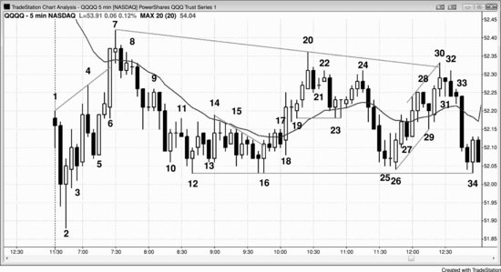

市场处于交易区间时，交易员应遵循一条基本原则："低买高卖。"同时，把每笔交易当作剥头皮来做，不要当成波段交易。计划拿小利润就走，不要抱着期望等突破。价格涨到区间顶部时，往往看起来要成功突破、进入多头趋势，但其中 80% 都会失败；同样，跌到区间底部的强力抛售，也有 80% 不会真正突破形成空头趋势。尽量让潜在回报至少等于风险，这样胜率就不需要达到 70% 或更高。由于市场是双向的，入场后、出场前经常会出现回调，所以不愿意忍受回调就不要进场。如果市场在交易区间里已经连涨了 5 到 10 根K线，通常更好的做法是只找做空机会，多头仓位则考虑止盈。如果已经连跌了一段时间，就找做多机会，或者给空头仓位止盈。在区间中部，很少用突破单入场，但有时候用限价单在那里入场是合理的。

在最好的建仓形态中，新手应重点关注用突破单入场的形态，这样入场时市场方向与你一致：

- 在区间底部附近买入高 2。这类形态通常是从底部向上反转的第二次尝试，类似双底。
- 在区间顶部附近卖出低 2。这类形态通常是从顶部向下反转的第二次尝试，类似双顶。
- 在交易区间底部买入，尤其是突破空头趋势线之后的二次入场点。
- 在交易区间顶部做空，尤其是跌破多头趋势线之后的二次入场点。
- 在区间底部附近买入楔形牛旗。
- 在区间顶部附近卖出楔形熊旗。
- 价格跌破区间底部波段低点之后，买入多头反转K线或反转形态（如最终旗形，详见第三本书）。
- 价格突破区间顶部波段高点之后，卖出空头反转K线或反转形态（如最终旗形，详见第三本书）。
- 在区间底部附近发生向上突破后，买入突破回调（例如，市场开始上涨又回调，就在前一根K线高点上方买入）。
- 在区间顶部附近发生向下突破后，卖出突破回调（例如，市场开始下跌又回调，就在前一根K线低点下方卖出）。

用限价单入场需要更丰富的看图经验，因为入场时市场正朝着交易方向的反方向运动。有些交易员会先用较小的仓位入场，如果市场继续反向走，再逐步加仓；但只有成功的、经验丰富的交易员才应该尝试这种做法。以下是一些限价单或市价单建仓形态的例子：

- 在区间底部，遇到空头急速时，用市价单买入，或者用限价单在前一个波段低点处或更低位置买入（急速中入场需要设更宽的止损，而且急速来得很快，所以这种组合对很多交易员来说很难操作）。
- 在区间顶部，遇到多头急速时，用市价单卖出，或者用限价单在前一个波段高点处或更高位置卖出（急速中入场需要设更宽的止损，而且急速来得很快，所以这种组合对很多交易员来说很难操作）。
- 在区间底部附近，遇到大阴线（强空头趋势K线），在收盘价买入或在其低点下方挂限价单买入，因为这根K线往往是衰竭性的卖出高潮，标志着交易区间内这一轮抛售的结束。
- 在区间顶部附近，遇到大阳线（强多头趋势K线），在收盘价卖出或在其高点上方挂限价单卖出，因为这根K线往往是衰竭性的买入高潮，标志着交易区间内这一轮反弹的结束。
- 在交易区间底部，遇到弱信号K线的低 1 或低 2，用限价单在其价位处或更低位置买入。
- 在交易区间顶部，遇到弱信号K线的高 1 或高 2，用限价单在其价位处或更高位置做空。
- 在一波强多头波段刚启动时，遇到收阴的K线就买入。
- 在一波强空头波段刚启动时，遇到收阳的K线就卖出。

**图 21.1** 在交易区间的极端位置押注失败，做剥头皮交易

像图 21.1 中 QQQ 这样的交易区间日，交易方法有很多种，但总的原则是：在区间极端位置押注失败，只做剥头皮。虽然信号很多，但交易员不必追求抓住所有信号，甚至不必抓住大部分。一天只要抓住几个好的建仓形态，就能开始稳定盈利。

我有一位做了几十年交易的朋友，碰到这种行情总能做得特别好。我亲眼看过他实时交易 Emini，像这种日子他能做大约15笔盈利1个点的剥头皮交易，全都是押注失败的方式入场。比如在K线10到K线18这段区间里，他会在每一个下跌处挂限价单做多：市场跌破K线10时买入，K线13跌破前面那根空头趋势K线时买入，K线15跌破前一根K线时买入，跌破K线13时还会加仓。市场回落到K线15下方时继续买入，跌破K线12时也会尝试买入。但必须记住，他是一位经验极其丰富的交易员，能识别出成功概率达到70%到80%的交易机会。极少有交易员具备这种能力，所以新手不应该冒大约2个点的风险去剥1个点的头皮。至少应该只做那些等距移动成功概率不低于60%的交易区间交易。这张图上止损大约要2个点，所以只有目标利润至少2个点时才值得交易。也就是说，应该在区间底部附近买入，在区间顶部附近做空。

如果交易员在区间底部附近买入了，应该在区间顶部附近止盈。同样也可以在区间顶部附近建立空头仓位，等市场跌回区间底部附近时平仓获利。反手操作对大多数交易员来说太难了，更好的做法是用目标价格出场，然后再寻找反方向的交易机会。比如，在K线16向上突破前一根K线高点、触发双底牛旗入场时买入，然后在上涨到K线20的过程中挂一个卖出限价单，锁定10美分、15美分或20美分的利润。出场之后再寻找做空的建仓形态，比如在K线22的LH下方做空，或者在K线24的LH下方做空。后者是更好的建仓形态，因为K线24是一根强空头反转K线，而且跟K线22构成了双顶熊旗。

那交易员是什么时候判断出这是一个交易区间日的呢？每个人不一样，但通常早期就有线索，随着线索不断累积，信心也越来越强。从第一根K线开始就有双边交易的迹象，之后几乎每一根K线都在增加更多证据。当天第一根K线是十字星，这就提高了交易区间日的概率。市场在K线3处向上反转，但涨到K线4时跟随力度很弱。前三根K线的低点都带影线，K线2跟前一根K线重叠了大约一半。K线3在多头入场后立刻反转向下，紧接着下一根K线又反转向上。市场在K线4处再次反转向下，K线5再次反转向上，然后在K线7处于均线位置又反转向下。只要市场在第一个小时内出现四五次反转，交易区间日的概率就会明显增大。

K线6是一根强多头趋势K线，但没有跟随。它在均线处受阻停滞，下一根K线是十字星，而不是收盘远高于均线的又一根强多头趋势K线。再下一根是空头趋势K线，之后两根K线也没能收在均线上方。尽管出现了一波强反弹，多头并没有掌握主动权，市场仍然是双边的。

K线2是一个两K线多头急速走势的起点，之后市场形成了一个三连推的多头通道一直涨到K线7。由于K线2是缺口下跌和一波抛售之后出现的强多头反转K线，这是一个不错的开盘反转，也可能是当天的最低点。这一天本来有可能变成强多头趋势日，但最终走成了横盘。不过市场始终没有跌破入场K线的低点。

K线2是两K线多头急速走势的第一根K线，K线4和K线7分别是急速之后楔形通道中的第二和第三次上推。急速与通道形态中的通道是交易区间的第一段，所以多数交易员在这个时候已经认定市场至少在接下来10到20根K线内会处于交易区间，甚至可能持续到收盘。他们等待两段式回调来测试K线3或K线5的低点，因为这些K线构成了多头通道的底部。即使他们觉得当天可能演变成趋势日，眼下看来还是交易区间，所以只做剥头皮。这种剥头皮行为本身又在强化交易区间——当大量交易员都在高点附近卖出、低点附近买入时，市场就很难突破进入趋势。

交易员会在K线2上方买入，至少期待市场测试均线。有些交易员会在K线4这根空头反转K线处做空，因为那里是当天新高，但大多数人觉得，K线2反转K线带来的买压、两K线多头急速、再加上K线4之前那根多头趋势K线，力度足以推动市场测试均线，哪怕中间有回调。正因为如此，很多交易员在K线4低点及其下方挂了限价买单，保护性止损放在K线2之后入场K线的下方，有的甚至放在K线2信号K线低点下方。有些人用固定金额止损，大约等于当天的平均K线高度，差不多10到15美分。还有些交易员认为空头可能从K线4向下做一个10美分的剥头皮，这需要跌破K线4低点12美分，所以他们可能会用13 tick的止损。他们预期这笔空单只是剥头皮，空头会在K线4低点下方11美分处挂限价买单平仓，这样从K线4下方1 tick用突破单入场的空单就能赚到10美分。

机警的交易员会在K线4之后那根空头入场K线上方挂买入突破单做多，因为他们知道K线4这根信号K线足够强，能吸引空头入场，而那些空头一旦看到市场向均线方向反转就会紧张。空头的保护性止损挂在入场K线上方，在市场到达均线之前不会再考虑做空。这就使得在那根入场K线上方做多成了一笔很好的多头剥头皮交易。

多头不认为K线5之后那根K线是可靠的做空信号，于是在它的低点上方1 tick、低点、以及低点下方都挂了买单，期待它成为一个失败的LH。最终只有低点上方1 tick的限价多单成交了，说明多头非常激进。结果是一根强多头趋势K线直冲均线。这是一次强劲的多头突破，但交易员注意到市场在均线处停住了，没有大幅突破上去。他们需要看到紧接着的跟随，否则就会怀疑这是一次对开盘高点的失败突破。也许K线6只是一次买入真空效应——强势交易者暂时退场了，如果他们认定市场会测试均线，那在均线下方卖出就没有意义。强势多头和强势空头暂时都不在，市场才得以快速拉升。但一旦到了他们预期市场可能 (60%+) 停下来的区域，这些人就像凭空冒出来一样大举卖出，压制了弱势多头。强势多头把手中的多头仓位获利了结，强势空头则卖出开新空单。判断当天可能 (60%+) 是交易区间日的空头，会在K线6冲过均线时用限价单做空，另一些人则在K线6收盘时做空。有些人愿意在更高位置加仓做空，尤其是下一根K线跟随力度很弱的时候。

随着市场下跌，大多数交易员都能看出多头和空头都很强势，双方争夺主导权，市场可能 (60%+) 继续维持双向博弈。这意味着走出交易区间的可能性 (60%+) 很大。市场接近顶部时，多头觉得买入成本太高，空头则认为是很好的做空价值，于是市场下跌。在顶部附近急于做空的空头，到了底部就不想做空了，抛压因此枯竭。那些在中间区域愿意买入的多头，看到区间底部更划算，就在那里积极买入，把市场推了回去。

空头愿意在K线7测试均线下方做空。如果多头真的很强，市场应该强势突破均线上方才对，而不是像这样停滞不前。K线7让K线6看起来更像是衰竭，而非强劲突破。其他空头在K线8的ii形态下方做空，或者在K线7之后那根空头趋势K线下方做空。ii之后的两K线空头急速力度合理，但低点有影线，说明有一些买盘。到这里，市场已经从当天低点到K线7走出了一波强劲的上冲急速，接着又走出一波强劲的下跌急速。交易员预期接下来会进入交易区间。

K线9是一个多头陷阱。大多数交易员认为，空头急速之后K线9之前那根十字星内包K线不是一个好的买入信号，很多人在这根十字星K线的高点挂了限价做空单。他们预期市场会回调到多头通道底部附近，也就是K线5低点区域。这个区域同时也在K线2信号K线高点附近，对突破回测来说是一个吸引点。多头希望在K线3或K线5低点区域形成双底牛旗，但他们也希望最初的入场K线低点能守住，也就是K线2之后那根K线的低点。要是守不住，他们可能 (60%+) 会放弃"这天还有机会走成多头趋势日"的预期。

K线10是从K线7高点算起的第三次下推，本身是一根强多头趋势K线。多头担心的是，下跌走势处于窄通道中，首次突破尝试有六成以上的概率会失败。很多多头会等突破回调出现后再买入。也有人先建一个较小的仓位，以防市场继续下跌至K线3低点附近，打算在第二次做多信号出现时加仓——K线12就是那个信号。还有人判断不少交易员的多单设了10美分的止损，于是在低10美分的位置挂限价买单——正好是那些弱势多头止损出场的地方。随后他们把整个仓位的保护性止损设在再低约10美分处，放在K线2之后那根入场K线的下方，甚至放在K线2下方。那些愿意承受跌到当日新低风险的交易员，仓位可能会更小，以便在第一笔多单下方约10美分处留出加仓空间。

K线12是一根多头反转K线，大致与K线3或K线5的低点构成双底，而且它是第二次信号，因此成为交易区间底部附近的一个高点2做多建仓形态。从当日高点算起，这是第四次下推，有些交易员把它视为高点4牛旗。K线8之后出现了一波空头急速下跌，对很多交易员来说这是第一次下推，K线12则是第三次。很多急速与通道形态就是在第三次下推后结束的，之后市场会尝试两段式反弹去测试空头通道的顶部——大约在K线9高点附近。有些交易员觉得跌到K线12的通道太窄，不适合买入，他们会等一个明确的第二次信号。很多人在K线12低点附近看到一根相对较小的K线之前不会入场。这些交易员可以在K线16买入，做双底牛旗的交易。K线14力度足够强，突破了空头通道，之后市场出现了两段式回调。K线16也是楔形牛旗的入场点，其中K线10是第一次下推，K线12是第二次。也有人把K线13看作第一次下推，K线15看作第二次。它同时也是一个下降三角形，K线16是向上突破。由于K线16是一根强突破K线，交易员开始寻找突破回调的买入机会。他们在前一根K线低点或更低处挂了限价单，在K线18成交。也有人在空头K线17的收盘价买入，因为他们认为突破回调形成更高低点的概率，大于突破失败并跌破K线16交易区间底部的概率。

有交易员用同样的逻辑在K线12后面那根K线的下方买入，认为那是一个不好的低点2做空建仓形态——因为它处在交易区间底部，而且出现在两次多头反转之后，这两次反转都有不错的买压（都是较好的多头反转K线）。有人在K线12后面那根空头K线的收盘价买入，或者在K线13的空头收盘价买入，预期K线12的低点能够守住。也有人在K线13上方买入，认为有空头被套，空头回补可能推动市场快速上涨。

由于这是一个窄交易区间，多头和空头都认为这个价位有价值，双方都愿意在此建仓。在一个多空双方都认可的价值区域里，突破通常走不了多远，市场就会被拉回区间内。这个区间有很强的磁吸效应——空头在区间上方会更积极地做空，多头在区间下方会更积极地买入。

K线18是一根大阳线，突破了过去大约一小时的交易区间。但由于当天整体处于更大的交易区间中，市场此时位于大区间的中部，交易员对追多持谨慎态度。这里形成了ii形态。有些交易员在K线12收盘价买入，也有人在K线12上方突破时买入，还有人在ii期间以及K线19这根多头内包K线的上方买入。交易员试图在K线18之后那根内包K线的低点及更低处挂限价买单，但没有成交。这反而让他们更愿意在K线19上方突破时买入——他们发现下方的买单没有成交，认为这说明多头具有紧迫感。

K线18的突破急速之后，出现了一个小的抛物线式高潮，到K线20形成了两K线反转做空的建仓形态。入场点在两根K线中较低那根的下方，三根K线之后才被触发。那些认为当天是交易区间日的交易员，一直在等市场强劲反弹到接近当日高点时做空。K线21是一根小十字星，作为高点1做多建仓形态很弱，尤其是出现在买入高潮之后。空头在它的高点上方做空。也有人在K线22下方做空，因为多头正在卖出平仓。这些多头在交易区间顶部买入，原本期待多头突破，但突破并未出现，于是迅速离场。他们的卖出触发了K线20高点处的两K线反转做空单。

市场跌到均线位置，形成一个高 2 买入信号，信号K线是一根多头反转K线。这在多头趋势中是非常可靠的建仓形态，但多数交易员仍然认为当天是交易区间日。许多人在 K线 23 上方买入，期望当天演变成多头趋势日，同时也做好了准备——如果没有出现强劲的多头突破，就尽快离场。让他们不安的是，K线 23 之后出现了一根十字星内包K线，说明市场在犹豫，而不是他们想看到的那种买入紧迫感。

这些多头平掉了仓位，空头在 K线 24 这根空头反转K线下方做空。K线 24 与 K线 22 构成了双顶熊旗。有人把它看作以 K线 22 为基准的低 2 做空信号，也有人把它看作楔形顶——K线 20 是第一次推高，K线 22 是第二次推高。

之后出现了一轮向交易区间底部的强烈空头急速下跌，但 K线 25 的空头实体很小，说明市场犹豫了。多头未能完成突破，结果只是形成了一个交易区间。这个交易区间无法抵抗 K线 10 到 K线 16 那个窄交易区间的磁吸力。如果这是一轮强空头趋势，市场回到早盘窄交易区间后就不该犹豫，而应该以一连串强空头趋势K线跌破它。这说明空头并不强势，下跌可能只是一个真空效应。聪明的交易者可能会暂时观望，等市场测试区间底部。一旦到了那里，多头和空头都开始积极、不停地买入——多头开新仓，空头则回补空单止盈。他们决心把市场守在交易区间低点上方。K线 26 是交易区间底部的高 2 信号，同时是一根强多头反转K线。K线 25 是高 1 建仓形态。K线 25 和 K线 26 区域与 K线 12 到 K线 16 区域构成了双底牛旗。这个第二个底也是 K线 10 到 K线 17 窄交易区间的突破回调。

K线 26 之后的下一根K线有不错的跟随，交易员预期这次向下的测试会失败。有人在 K线 27 这根空头趋势K线收盘时买入，也有人挂限价单在 K线 27 低点及其下方买入。买盘非常激进，市场甚至无法触及 K线 27 的低点。反应快的交易员注意到了这一点，迅速在 K线 27 高点上方挂买入突破单。结果形成了由两根多头趋势K线构成的突破。

K线 28 是一根空头内包K线，但从 K线 26 开始的上涨处于窄通道中，所以第一次下探应该会失败。多头在 K线 28 低点及其下方挂限价单买入。从 K线 26 开始的下跌是一个大型两段式回调，K线 23 结束了第一段。这构成了一个大型牛旗，向上到 K线 28 的上涨是突破。K线 29 是那次突破的回调，也是对 K线 26 到 K线 28 微型通道底部的一次失败突破。

K线 30 形成了对峙线形态，多头在市场越过两条线后止盈，顶部因此留下了影线。有些人在弱收盘时离场，还有人在 K线 31 构成的两K线反转顶部下方离场。

K线 31 是一根十字星，因此只是一个弱的高 1 信号K线。再者，从 K线 26 到 K线 30 的急速上涨力度不够强，不足以支撑在第二个高 1 处买入（K线 29 是第一个高 1），而且当天是交易区间日，不是明确的多头趋势日。空头把这看作交易区间顶部的一个糟糕的高 1 信号，在 K线 31 高点做空。

另一些空头在 K线 32 这根空头反转K线下方做空。有人把 K线 30 和 K线 31 看作两K线反转，也有人忽略 K线 31，把 K线 30 和 K线 32 看作两K线反转。它同时也是一个微型双顶。市场在 K线 30 上涨，K线 31 下跌，K线 32 再次上涨，然后在该K线收盘时下跌。当天市场还形成了三次推高，K线 7 和 K线 20 是前两次，所以当天构成了一个大型三角形。K线 32 之后的入场K线跌破了从 K线 26 和 K线 29 连成的多头趋势线（图中未标出），市场在跌破趋势线后的第二根K线大幅下跌，一路卖到收盘。

K线 10 到 K线 16 之间有许多多头三角形。由于这些形态出现在向上到 K线 7 的多头急速上方，许多交易员认为可能会形成一个向上的通道，至少测试 K线 7 的高点。这段交易区间内还出现了几次多头急速上涨，制造了买压，为多头提供了市场正在试图形成 HL 的证据。但没有一个三角形足够清晰，所以并非所有交易员都认为其中某一个强到足以让市场变为 Always-in 做多。K线 10、12 和 16 是三次下推，形成了一个下降三角形。K线 13、15 和 16 也是三次下推，同样构成一个三角形。有些交易员把它看作楔形牛旗。另一个楔形牛旗由 K线 14 之后第二根空头K线、K线 15 和 K线 16 构成。
