窄幅交易区间是一种常见形态，不同人对它有不同的叫法，但没有哪个名称能够准确描述它。它由两根或更多K线组成的横盘通道构成，K线之间大量重叠，频繁反转，十字星反复出现，影线明显，阳线和阴线兼有，可以延续十几根甚至更多K线。大多数基于突破的单次入场都会亏损，应当予以回避。如果 Emini 的日均波幅大约在 10 到 15 个点，那么高度在 3 个点以内的交易区间大概率属于窄幅交易区间。如果K线本身较大，4 个点甚至 5 个点的区间有时也会表现出窄幅交易区间的特征。

多空双方处于平衡状态，交易员都在等待突破以及突破之后市场的反应。突破会延续吗——也许回调一下之后继续走？还是回调会演变为反转，很快从交易区间的另一侧突破出去？不要因为市场横盘就以为机构基本停止了交易。每根K线内的成交量通常仍然很高，尽管会比之前趋势K线的成交量略低。多头和空头都在积极发起新交易，争相推动突破朝自己有利的方向发展。一部分交易员反复剥头皮进出，另一部分则不断加仓，直到达到自己的最大仓位。最终，一方胜出，另一方放弃，新的趋势腿随之启动。举个例子，假设一个窄幅交易区间持续了很长时间，许多多头的仓位已经加到不愿再增加的程度。当市场开始试探区间底部时，剩余的多头不足以把价格推回区间中部或顶部，市场于是开始向下突破。这些已经加满仓的多头只能寄望于还有其他多头拥有足够的买入力量来反转这轮空头突破。每跌一个 tick，就有更多多头平掉仓位、认赔出场，而且他们至少要等好几根K线才会考虑再次买入。这些卖出进一步推低市场，导致更多多头割肉离场。随着剩余多头纷纷放弃、卖出、等待下一个可能的底部出现，抛售还会加速。这个过程在所有交易区间中都会发生，也是趋势性交易区间日中后期突破的原因之一。例如，如果出现了向上突破，部分原因在于太多空头已经无法或不愿继续加仓，剩下的空头不够多，无法抵挡市场对区间顶部的又一次试探。突破之后，空头开始回补空仓，并且至少好几根K线内不愿再做空。空头停止卖出，加上他们回补时的买入，形成了一个单边市场，迫使剩余空头也不得不回补。这波空头回补再加上多头的买入，往往能推动一轮持续较久的多头波段。

突破失败和反转十分常见。通常不宜在突破时直接入场，更好的做法是等出现强势跟随之后以市价单入场，或者等突破回调后顺势入场，又或者等突破失败后反向入场。虽然没有人确切知道高频交易公司的量化团队在用什么算法，但从巨大的成交量以及频繁反转中的小幅波动来看，很可能是程序在反复刮 1 到 4 个 tick 的头皮。那些数学家甚至不需要看图表，他们设计程序来捕捉小幅波动，而窄幅交易区间看起来正是聪明程序员的理想环境。

窄幅交易区间中的每一次回调，都是微型买入或卖出真空效应造成的，这与所有交易区间顶部和底部附近发生的情况一样。许多多头和空头会打算在高点下方一定 tick 数处买入，另一些则打算在前一根K线低点下方一定 tick 数处买入。这些交易员想买，但不愿在当前价格买入。空头想回补他们的剥头皮空仓，多头想发起剥头皮做多。这些买家在当前价格的缺席导致市场被吸引向下运动。一旦价格到达他们想买的位置，他们就会猛烈买入，推动价格向上反转。空头对空仓止盈，多头发起做多。等市场涨到区间顶部附近，这个过程就反过来了——多头对多仓止盈卖出，空头发起新的做空。同样的过程发生在每一种通道中，无论是水平的（如窄幅交易区间）还是倾斜的（如急速走势之后的通道）。

在窄交易区间里用突破单交易，交易者方程是不利的；但对大多数交易员来说，要判断用限价单入场的方程是否划算，又实在太难。最好的做法是等突破发生后，再判断这次突破会成功还是失败，然后寻找交易机会。窄通道也是同样的道理——窄通道本质上就是带倾斜角度的窄交易区间。市场大部分时间都运行在通道里，不管是横盘的交易区间还是倾斜的通道，但一旦通道变窄，在里面交易就格外困难。窄通道或窄交易区间里，只有能持续稳定盈利的交易员才应该参与，而且他们用的是限价单入场。大多数交易员几乎只该用突破单入场，这恰恰跟窄通道的交易方式相反，所以大多数人不应该交易窄通道。正确的做法是等一段急速行情出现，或者等通道变宽之后再交易。

窄交易区间通常是持续形态，但如果它出现在一次高潮反转之后——哪怕是很小的高潮反转——市场向上或向下突破的概率就是相等的。因为高潮反转已经在反方向上制造了动能，而你无法确定这个反向动能会不会延续并形成突破，还是先前趋势的动能会恢复。如果没有高潮反转，窄交易区间出现在一段趋势腿之后，顺势突破的概率最高可以到 55%——前提是这段趋势足够强。但这个概率可能（60%+）永远到不了更高的水平，否则市场根本不会形成窄交易区间。如果趋势不够强，概率可能只有 53%。即使市场最终逆势突破，这个形态通常也只是演变成一个更大的交易区间，最终概率依然偏向顺势突破。别忘了，所有交易区间在更高时间周期的图表上都只是回调。但如果交易员在窄交易区间里顺势入场，又用了很宽的保护性止损来容纳区间可能扩大的空间，交易者方程就变得很难算——风险、回报和概率都不好评估。一旦出现这种局面，不交易才是最好的选择。所以，用宽止损长时间持仓，通常不是好策略。如果交易员在窄交易区间里顺势做单，期待趋势恢复，结果市场朝反方向突破了，更好的做法通常是先出场，等更大的交易区间形成后，再尝试做一笔顺势的波段交易。

窄交易区间毕竟还是交易区间，所以当价格接近区间顶部时下跌、或接近区间底部时上涨的概率是 60% 甚至更高。但因为区间太窄，通常没有足够的空间做一笔盈利的交易，这个概率也就没什么实际意义。更好的做法是直接假设：如果区间出现在一段多头腿之后，向上突破的概率在 51% 到 55% 之间；如果区间出现在一段空头腿之后，向下突破的概率在 51% 到 55% 之间。

窄交易区间压倒一切，尤其压倒所有你认为应该交易的"好理由"。不管图表上看到什么，一旦市场进入窄交易区间，就等于在告诉你：方向已经消失，向任何一边突破的概率都不会超过大约 55%。由于本质上仍是交易区间，先前趋势恢复的概率稍大一些，但交易员应该假设这个概率仍然只在 51% 到 55% 之间——具体取决于之前趋势的强度，以及进入窄交易区间之前有没有出现过强反转。窄交易区间由大量反转构成，每一次反转都源自一次失败的突破尝试。区间内会出现许多"很棒"的买入和卖出信号K线，其中一些还有很强的逻辑支持。比如，一个很好的做空信号触发了，但一两根K线之内市场又形成了一根更强的多头反转K线，多头可能会觉得空头已经被一个强信号套住了，短期内不太敢再做空。这意味着短期内空头减少，市场有较高概率走出一波持续好几根K线的多头突破。逻辑听起来没毛病，但你必须回到那条铁律："窄交易区间压倒一切。"这包括你想交易的每一个精妙的、合乎逻辑的理由。这些反复出现的反转说明，机构正在区间上方用限价单卖出，在区间下方用限价单买入。你要做的是跟着机构走，绝不能反着来。在窄交易区间里用突破单进出场是一种亏损策略。你没法像高频交易公司那样在窄区间里赚 1 到 3 个 Tick 的剥头皮利润，所以只能等。高频交易公司创造了窄区间里的大部分成交量，而它们的交易方式是你无法盈利复制的。你必须等，尽管等待可能极其煎熬。有时窄交易区间会延伸到 20 根甚至更多K线，这时它就真正变成了一个完全没有预测价值的形态。猜测永远不是做交易的明智方式，所以价格行为交易员只能等突破出现之后再决定下一步。大多数情况下，突破后一两根K线之内就会出现一次失败的突破，基于这个失败来入场，胜率比直接跟突破入场要高。多数时候，这个反转尝试本身也会失败，最终演变成突破回调。一旦突破后出现回调，就顺着突破方向，在突破恢复时用突破单入场。如果是多头突破，等回调K线收盘后，在其高点上方一个 Tick 的位置挂买入突破单入场。如果预期的回调没有出现、反而变成了反转，猛穿窄交易区间的另一侧，或者接下来一两根K线跌破了区间底部，你可以在窄交易区间下方一个 Tick 挂卖出突破单做空，也可以等突破回调之后再做空。

当窄交易区间出现在交易区间日中段、且持续较久时，突破后的走势往往并不强，市场在当天剩余时间里经常继续维持大致无趋势的状态。但如果窄交易区间之前有一段强趋势，情况就完全不同了，因为这一天往往会演变成趋势恢复日。典型模式是：开盘后第一个小时左右出现强趋势，然后进入一个可以持续好几个小时的窄交易区间，最终区间向原始趋势方向突破。这次突破往往引发第二段趋势，幅度与第一段差不多。少数情况下，突破会朝反方向走，回吐先前趋势的大部分甚至全部涨跌幅。

窄交易区间内部通常两个方向都有建仓形态，但大多数交易员一旦判定市场进入了窄交易区间，就不应该再做任何交易。如果刚建完仓行情就发展成了窄交易区间，最好的选择是尽量在盈亏平衡点附近出场，最多亏一个 Tick，然后等突破出现再决定下一笔交易。举个例子，交易员做空是因为判断市场有 60% 的概率先跌 10 个 Tick 再涨 10 个 Tick，但现在市场进入了窄交易区间，数学逻辑就变了——成功概率降到了大约 50%，如果风险和潜在回报不变，这就变成了一个亏损策略。最好的对策是在盈亏平衡点出场，运气好的话或许还能赚一两个 Tick。

不管你看到什么形态——形态在形成过程中往往都很好看——都必须把概率纳入考量：等距运动的概率只有50%。只有获胜概率乘以潜在回报远大于亏损概率乘以风险时，你才能赚到钱。但窄交易区间的磁吸效应极强，区间内波幅很小，突破大多会失败，就算偶尔成功突破，通常也走不了多远就被拉回区间。这意味着价格走到风险2到3倍的可能性非常小，所以任何突破策略——比如在K线上方买入或在K线下方做空——长期做下来都会亏钱。

窄交易区间本质上是一种通道，可以按通道的方式来交易。但因为波幅小、走到目标需要很多根K线，交易过程非常磨人，大多数交易员一旦判断市场进入了窄交易区间，就应该停止交易。有时候窄交易区间从顶部到底部有足够的点数空间，可以在顶部出现小的空头反转K线时做空剥头皮，或者在底部出现小的多头趋势K线时买入。激进的交易员会在前一根K线低点下方买入，或在前一根K线高点上方做空，用小利润剥头皮出场。如果窄交易区间之前有一段趋势，顺势方向的交易更可能(60%+)盈利，其中一部分仓位可以持有做波段。比如，市场在一波强劲上涨后进入窄交易区间，而且区间刚好在均线上方盘整，多头就会在前一根K线低点下方买入。他们既可以在区间顶部附近剥头皮出场，也可以留一部分仓位做向上的波段。还有一些交易员（主要是高频交易公司）会在区间中部下方开始分批买入多头，每下跌1到2个tick加仓一次。空头则在区间中部上方卖出，每上涨1到2个tick加仓一次。双方都在区间中部附近止盈——最早的那笔在盈亏平衡点出场，后续加仓的则带着利润出场。

交易员应该只关注最好的建仓形态，同时一定要避开最差的——窄交易区间就是最差的。窄交易区间是新手面临的最大难题，也是阻碍他们赚到钱的最重要障碍。比方说，新手记得过去几天趋势行情里K线计数一直非常可靠，就在区间内套用同样的方法入场，期待马上突破，但突破始终不来。他们把每一次反转都当成新信号，下单时每个信号看起来都不错。可能会出现一根强烈的空头反转K线，突破了一个看起来不错的低点2做空建仓形态。但它仍然处于窄交易区间里，前面已经有14根K线互相重叠，均线也是走平的。区间内可能之前已经有6次反转，没有一次走出过剥头皮者的利润那么远的距离。大约一个小时后，交易员开始沮丧，因为发现自己已经连亏了6笔。虽然每笔亏损都不大，但加起来已经亏了7个点，当天只剩下一个小时的交易时间。短短两个小时，他们就把过去三天赚的钱全部吐回去了，于是发誓再也不犯这种错误。但结果呢，两天后又重蹈覆辙，接下来几个月每周至少犯两次同样的错，直到账户里的保证金不够交易为止。

账户里最初的那笔钱是他们给自己的一份礼物——给自己一个机会，看看能不能为自己和家人创造一种全新的、美好的生活。但他们一次又一次地违反了交易中最重要的规则：不要在窄交易区间里交易。他们太自负了，觉得自己读盘能力很强。毕竟已经连续三天赚钱了，能做到这一点肯定是有本事的。连亏6笔之后，他们觉得该轮到自己赢了，大数定律站在自己这边。但实际上他们应该接受一个现实：赢单永远不会"该来了"，市场通常(60%+)会继续做它刚才在做的事。也就是说，第7笔亏损比赢单更可能(60%+)出现，而且当天剩下的时间也不太可能(40%以下)有什么好的交易机会了。没错，前几天那些大波段他们确实做得很好，但市场的性格每天都在变，你也必须跟着调整自己的方法。

交易员往往要在四五根K线里连亏两三笔之后，才愿意承认市场进入了窄幅交易区间；而就算认清了这一点，他们接下来犯的错误代价更大。人有一种本能的想法：没有什么能永远持续，所有行为最终都会回归均值。如果已经连亏三四笔，那下一笔肯定该赢了吧——就像抛硬币一样，对不对？可惜市场根本不是这么运作的。趋势运行中，大多数反转尝试都会失败；在交易区间里，大多数突破尝试同样会失败。这跟抛硬币恰恰相反——硬币每次都是50对50的概率，但在交易中，刚才发生的事情继续重复的概率大约在70%甚至更高。正是受到这种"抛硬币"逻辑的影响，大部分交易员迟早会开始琢磨博弈论。

他们首先想到的是马丁格尔策略：每次亏损后把下一笔的仓位翻倍或加到三倍。真要试了就会发现，马丁格尔策略本质上是一个悖论。假设你从1手起步，亏了就翻倍加仓，每连亏一次仓位翻一倍，你知道自己最终肯定能赢一次。赢的时候，最后那笔大单会把之前所有亏损补回来，回到盈亏平衡点。更妙的是，如果每次亏损后仓位加到三倍，那么最终赢的那一笔不仅能回本，还能实现净利润。马丁格尔策略在数学上是成立的，但悖论在于根本无法执行。为什么？假设你从1手起步，连亏六次后不断翻倍，你就要交易32手。如果你每次反转信号都入场，那么每周至少会碰到一次连亏六笔的情况，甚至更多。悖论就在这里：一个只敢做1手的交易员绝不会去做32手，而一个敢做32手的交易员也绝不会从1手起步。

接下来交易员会想：那我等连亏三次甚至更多次之后再入场，因为他们觉得连续四次剥头皮全亏的情况不会太常见。事实上，这几乎每天都在发生，市场经常出现连续六次甚至更多次反转全部失败的情况；每当出现这种局面，市场一定处于窄幅交易区间中。一旦发现连亏六七次是多么普遍的事情，他们也就放弃了这个思路。

一旦发现市场进入了窄幅交易区间，就不要交易。耐心等好的波段机会回来就行，通常最迟到第二天就会出现（概率60%以上）。你的任务不是下单，而是赚钱；如果持续亏得比赚得多，每个月都不可能实现盈利（概率60%以上）。如果市场看起来在上下波动，你入了场，但接下来几根K线开始形成小的、互相重叠的十字星，那就要假设市场正在进入窄幅交易区间，尤其是当时已经到了全天中段。尽量在盈亏平衡点或小亏的位置出场，然后等波段机会再现，哪怕要等到明天。你不能用"亏损是交易的一部分"这种想法来给自己亏钱找借口。你必须把交易限制在最好的入场形态上，哪怕这意味着连续几个小时按兵不动。

除了尝试在盈亏平衡点附近出场之外，另一个选择是继续持仓，但把止损放宽到区间之外。不过从数学角度看，这种做法并不理想。最差的做法是在区间内反复入场，不断承受亏损，哪怕每笔亏得不多。如果你在空头趋势中的窄幅交易区间里做了多，然后市场形成了低点2做空信号，你应该出场，并且可以考虑反手做空。如果你在空头窄幅交易区间里做了空，然后市场形成了高点2做多信号，你应该出场，并且可以考虑反手做多——但前提是信号K线是一根位于区间底部的阳线趋势K线，而且到区间顶部有足够的空间实现剥头皮利润。不过这种交易很少能成功，只有非常有经验的交易员才应该尝试。连续看盘几个小时却不下单确实很煎熬，但这远比连亏三四笔、到收盘前连回本的时间都没了要好得多。耐心等着，好的入场形态很快就会出现。

有一种重要的**窄交易区间**，通常出现在日内中间时段、当日价格范围的中部、均线附近，但也可能在任何时间和位置出现。这种形态叫**铁丝网形态**，因为那些大十字星和长影线看起来很像铁丝网上的尖刺。如果你看到三根或更多K线大幅重叠，其中至少有一根实体很小（十字星），这就是铁丝网形态。判断重叠程度时，可以看三根K线中间那根：如果它一半以上的高度都落在前后两根K线的范围之内，就可以把这三根K线视为铁丝网形态。这些K线通常相对较大，反映出更强烈的情绪和更大的不确定性。在你成为一名成熟的交易员之前，不要碰铁丝网形态，否则会被伤得很惨。小实体说明价格虽然偏离了开盘价，但持相反观点的交易员在收盘前又把它推了回来。K线之间大面积重叠的横盘走势意味着多空双方谁也控制不了市场，这时候不应该押注方向。

跟所有交易区间一样，概率上偏向顺势突破，但铁丝网形态以剧烈的来回扫止损和让急于交易突破的交易员反复亏损而臭名昭著。铁丝网形态里经常先出现失败的低2和失败的高2，之后才会有成功的突破。一般来说，铁丝网形态紧贴均线形成时，往往会向远离均线的方向突破。也就是说，如果形成在均线上方，概率偏向多头突破；如果形成在均线下方，通常会向下突破。在比较少见的情况下，铁丝网形态横跨均线两侧，这时就需要借助其他价格行为特征来寻找可交易的入场形态。由于所有窄交易区间都是多空双方达成共识的区域，大多数突破会失败。实际上，窄交易区间出现在趋势中时，经常变成趋势中的最终旗形，突破后往往又反转回到窄交易区间内。这种反转通常至少会引发一个两段式回撤，有时甚至会导致趋势反转。

铁丝网形态形成之前的那段走势很重要，需要仔细考量。如果价格回调到均线时形成了铁丝网形态，但大部分K线仍处于均线的顺势一侧，那它只是回调的一部分，通常会出现顺势突破。举个例子，多头趋势中价格用了10根K线回调到均线，然后形成铁丝网形态，有几根K线刺穿了均线，但整体形态大部分还在均线上方——这时应该等待多头突破。尽管你可能想把那10根K线的下跌视为一段新的空头趋势，但只要形态大部分在均线上方，多头就掌握着主动权，这很可能只是多头回调到均线的尾声。

但如果回调穿过了均线，而铁丝网形态大部分形成在均线的另一侧，那说明这波回调力度足够强，要么可能出现第二段回调，要么你对图表的判读有误，趋势可能已经反转了。不管是哪种情况，突破方向大概率跟形成铁丝网形态之前的那段走势一致，而不是跟均线回调之前更大级别的走势一致。比如，原本是空头趋势，现在出现了10根K线的反弹，冲到均线上方并形成铁丝网形态，形态大部分在均线上方——这时概率偏向多头突破。此时铁丝网形态是上涨走势中的牛旗，而不是更大级别下跌走势中熊旗的尾端。

铁丝网形态虽然很难交易，但有经验的交易员如果仔细分析每根K线，是可以有效交易的。这一点很重要，因为铁丝网形态后面有时会跟着一段持续的趋势行情，尤其是当它充当突破回调时。比如，市场正在下跌到交易区间底部，铁丝网形态开始形成；如果均线下方出现了低2，而且信号K线是一根强空头反转K线，这就可以是一个很强的做空入场形态。如果铁丝网内部的影线不太突出、这段空头腿顶部出现过强烈的反转、而且铁丝网下方有较大的合理目标空间，那突破成功的概率就更高。

铁丝网形态有时会在第一个小时的连续几根急速K线末尾形成。如果出现在多头趋势中的支撑区域附近，它可以演变成反转形态并形成当日低点。如果在第一个小时多头急速上涨之后出现在阻力区域附近，它可以演变成当日高点。铁丝网形态在日内较晚时段形成反转形态的情况比较少见。

交易铁丝网形态的首要原则是：永远不要在突破时入场。正确的做法是等待一根趋势K线突破该形态。趋势K线是方向确认的第一个迹象，但由于市场之前一直处于多空胶着状态，突破失败的概率很高，因此要随时准备押注失败。举个例子，假设一根多头趋势K线向上突破了超过几个 Tick，那么在这根K线收盘后，立即在其最低价下方一个 Tick 处挂单做空。有时候这笔做空入场也会失败，所以一旦做空且入场K线收盘后，就在做空入场K线最高价上方一个 Tick 处挂一个反手做多的单子——这笔交易将构成一个突破回调做多入场。二次入场点失败的情况并不多见。如果突破已经出现两根或更多连续趋势K线，就不要再押注失败了，因为连续趋势K线会提高突破成功的概率。这意味着任何试图反转回铁丝网形态内部的操作大概率会失败，反而会形成一个突破回调建仓形态。一旦市场开始出现趋势K线，多头或空头中的一方很快就会掌控局面。当一个顺势突破在几根K线内就失败并反转时，说明铁丝网形态是前一段趋势的最终旗形。

你也可以在铁丝网形态顶部和底部附近的小K线处押注失败，前提是有入场信号。比如，顶部附近出现一根小K线，尤其是空头反转K线，就可以在该K线最低价下方一个 Tick 处挂一个卖出突破单，做一笔剥头皮的做空交易。你也可以在 3 分钟图上寻找小K线来押注失败。1 分钟图上的信号基本不要去做，因为 3 分钟和 5 分钟图的胜率更高。

由于铁丝网形态在成功突破之前可能出现多次假突破，有经验的交易员有时会在前一根K线最低价下方挂限价单买入——前提是该最低价位于区间底部附近，而不是在区间中部或顶部。空头方面，则会在前一根K线最高价上方挂限价单做空，但入场位置要在区间顶部附近，而不是在最高价位于区间下半部分的时候做空。假突破越明显，这种做法成功的概率越高。另外，如果K线实体至少和当天平均K线一样大，效果会更好。如果K线太小、区间太窄，剥头皮成功的概率就会降低，交易员应该等待更好的机会。这种操作非常枯燥，大多数有经验的交易员通常会选择等待成功率更高、利润空间更大的行情。由于铁丝网形态内部的成交量往往不错，高频交易公司可能非常活跃（概率 60% 以上）——就像它们在所有窄交易区间中一样，做着赚 1 到 3 个 Tick 的剥头皮交易。电脑不会疲倦，枯燥对它们来说不是问题。

如果铁丝网形态出现在强趋势中回调至均线附近的位置，你需要沿该强趋势方向在二次入场点处交易。比如，多头趋势中出现回调至均线的情况，即使高 2 建仓形态正在铁丝网形态内部形成，你也应该买入。尤其是当信号K线是多头反转K线，且铁丝网形态中的十字星和影线不太突出时，更应该这样做。你必须纵观整张图表，看到多头趋势的大格局。不要只盯着前面 10 根K线就得出市场正处于空头波段中的结论——如果市场在强多头趋势中持续守在上升的均线之上，那种结论是站不住脚的。

每当你不确定的时候，最好的做法永远是等待。当你觉得早该入场了的时候，等待确实很难做到。但聪明的交易者总是这么做，因为去做低概率的建仓形态本身就没有道理。有一条非常好的原则：如果一个交易区间正在形成，而且位置在均线附近，那么当K线大部分在均线下方时，永远不要考虑做多；当K线大部分在均线上方时，永远不要考虑做空。光这一条原则，日积月累就能帮你省下一大笔钱。

微型通道有时也会表现出铁丝网形态的特征。比如在一个空头趋势日里，经常能看到一段小幅反弹运行在微型通道中。随后可能出现一个向下突破，但在一两根K线内就失败了。这不是一个做多建仓形态，因为它几乎总是出现在空头趋势日中下行均线的下方——你应该只在市场反弹 5 到 10 根K线时寻找做空建仓形态。等那个失败的突破形成一个更高高点或更低高点的突破回调，然后在那根K线下方做空。你做空的位置，正好是那些被套多头止损出场的位置——他们之前在跌破多头通道的那根K线上方买入了。这类形态经常带有影线，可能就是铁丝网形态，它们像铁丝网形态一样会套住逆势交易员。

**图 22.1** 窄交易区间

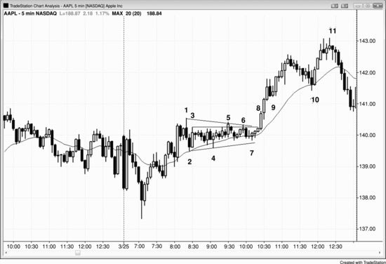

在图 22.1 中，到第 4 根K线时，市场显然已经进入了窄交易区间。第 1 根K线是三根K线内第二次尝试向下反转，紧接着第 2 根K线就形成了一个两K线反转，试图向上反转。五根K线内出现三次方向变化，是市场已进入强烈双向博弈的明确信号。第 3 根K线之后出现一根小十字星时，交易员就应该怀疑市场可能正在进入窄交易区间。当接下来两根K线也是十字星时，窄交易区间就已经确立了。

第 5 根和第 6 根K线都未能突破区间上沿，窄交易区间演化成了一个三角形——三角形通常也是顺势形态。由于最近一波趋势是从日内低点上涨的，向上突破的可能性较大，尤其是所有K线都保持在均线上方。在两次突破失败之后，第三次突破成功的概率大幅提升。另外，第 7 根K线是从第 5 根K线高点回调形成的高 2 建仓形态，此前有一定的上涨动能。激进的交易员会在这个高 2 处做多。

下一个合理的买点是突破第 5 根K线高 2 的高点，即第一次失败突破的高点。也可以在当日最高价上方一两美分处买入。一般来说，买入窄交易区间的突破是低概率交易。但这次的交易区间形成于市场从日内低点强力多头反转之后，而且长达两小时收盘价都没有跌破均线超过一个 tick，说明多头非常强。

最高概率的入场点是第 9 根K线处的第一次回调——市场只击穿空头反转K线低点一个 tick 就回头上涨，既套住了做空的，也把做多的甩在了场外。

另一个高概率买点是第 10 根K线处均线附近的高 2。入场点在第 10 根K线上方，也就是两K线反转的第二根K线上方。两根K线之前刚刚突破了空头微型通道，所以第 10 根K线同时也是一个更低低点突破回调的做多建仓形态。高概率交易的盈利幅度往往较小，但从定义上说，它们的成功概率通常要高得多。

**图 22.2** 多头腿和空头腿中都出现窄交易区间

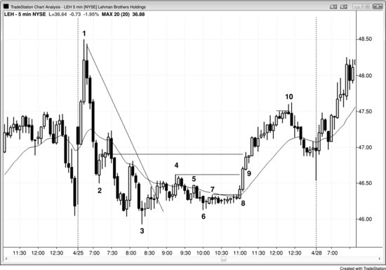

窄交易区间有时候既可以是多头趋势中的回调，也可以是空头趋势中的回调。在图 22.2 中，第 6 根到第 8 根K线之间的窄交易区间，到底是从第 3 根K线到第 4 根K线反弹中的牛旗，还是下跌至第 3 根K线的空头趋势中的熊旗？两种解读都说得通。只要同时存在合理的多头解读和空头解读，市场就存在不确定性，也就意味着市场处于交易区间中，并处于突破模式。

在反弹至第 4 根K线的过程中突破了空头趋势线之后，雷曼兄弟（LEH）在第 6 根K线形成了一个更高低点，然后进入窄交易区间。因为下跌到第 3 根K线的走势是一个楔形，之后可能至少会出现两段式横盘或上行回调，特别是在从前一日低点反转上涨之后。虽然交易区间的突破通常会失败，但这里向上突破后可能还会有第二段上涨，幅度可能与从第 3 根K线到第 4 根K线那一段相当。它甚至可能是一次趋势反转，特别是考虑到之前上涨至第 1 根K线时多头力量非常强。向上的目标位包括：第 4 根K线的最终更低高点、第 2 根和第 3 根K线之后的波段高点、第二段与第一段等高的测量移动目标，甚至可能回测第 1 根K线的多头急速阶段。

上涨至第 4 根K线的走势基本被包含在一个通道里，因此可能只是两段横盘至上行走势中的第一段。这段走势中阳线实体也比阴线实体更明显，这是买压的信号。第 6 根K线与第 3 根K线低点之后的第三根K线形成了双底。交易员知道，如果第 6 根K线的低点能守住，市场可能形成一个测量移动，向上突破第 4 根K线，幅度等于第 6 根K线低点到第 4 根K线高点的距离。激进的多头在窄交易区间内就开始买入，因为盈亏比非常好。他们的风险大约是 20 美分（止损设在第 6 根K线低点下方），而潜在利润是 1 美元甚至更多，胜率大约五五开——这是一笔非常划算的交易。

到第 8 根K线收盘时，市场已经明确进入 Always-in 做多状态，当下一根K线是一根强多头趋势K线时就更加确定了。多头在市价买入、在微小回调处买入、在突破前期波段高点时买入，也在三根K线组成的多头急速阶段中每一根K线收盘时买入。从三根K线急速阶段第一根的开盘价到第三根的收盘价，现在大约有 60% 到 70% 的概率形成测量移动，最终市场涨幅超过了这个目标。

突破后的第一次回调出现在第 9 根K线——一根多头内包K线，因此在第 9 根K线高点上方一个 tick 买入高 1 是一个高概率的做多机会。

反弹到第 10 根K线时，大约回撤了从第 1 根K线开始的空头趋势的 65%。斐波那契交易员会把反弹到第 10 根K线称为 61.8% 的回撤，说这"足够接近"了。但问题是，任何一次回调都会"足够接近"某个斐波那契数值，这使得斐波那契数值在大多数时候基本上没什么意义。

**图 22.3** 窄交易区间演变为更大的交易区间

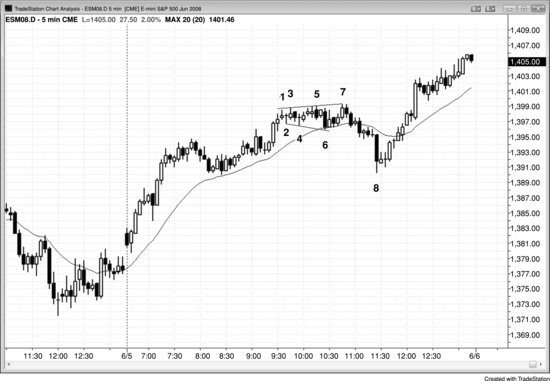

多头趋势中的窄交易区间本质上虽然是交易区间，也就是一面牛旗，但仍有大约 45% 到 49% 的概率先向下突破。之后这个形态有时会演变成更大的交易区间，而更大的交易区间通常会朝趋势方向突破（在图 22.3 中就是向上突破）。大多数在 K线 1 之后于窄交易区间内做多的交易员，应该在跌破 K线 5 或 K线 7 之后那根空头内包K线时离场，几乎所有人都会在 K线 6 的向下突破时出场。另一个选择是继续持有多单，使用较宽的止损。但即使市场没有跌破三小时前早上 8:25（太平洋时间）的波段低点，交易员也需要承受超过 7 个点的风险才能持有多单。大多数在窄交易区间内做多的多头，在 K线 8 低点形成之前就已经止损出场了。对他们来说，入场时要容纳更大交易区间所需的风险太大，而达到足够大的利润目标来使交易者方程盈利的概率又太低，根本不值得继续持有。遇到这种情况，更好的做法是先出场，然后在任意方向重新寻找交易机会。对于那些先承受了一笔小亏损、然后在 K线 8 空头突破失败之后的多头趋势K线上方再次买入的交易员来说，交易者方程是合理的。他们买入的是一个双底，也就是多头趋势中较大交易区间的一个可能（概率 60% 以上）底部。

到 K线 3 时，铁丝网形态已经出现了——有三根横盘K线，其中至少一根是十字星。这意味着大多数交易员应该等待突破，再判断突破是强势的还是可能（概率 60% 以上）失败的。激进且有经验的交易员可以在前一根K线低点下方做空、在前一根K线高点上方做多，也可以在底部的小型多头反转K线上方买入、在顶部的小型空头反转K线下方卖出。

K线 6 是一根空头趋势K线突破，之后在均线处形成了一个 ii 建仓形态，触发了一笔多头剥头皮交易。市场已经超过 20 根K线没有触及均线。价格正在逐步靠近，多头认为触碰均线的可能性很大，因为几个小时前市场仅差一个 tick 就触及均线却未能碰到。既然多头相信市场会跌到均线，他们就不愿意在均线上方稍高的位置买入，而这种不愿买入的行为使市场变成了单边状态。结果就是市场以一根强空头急速K线的形式迅速下跌至均线，多头在均线处重新出现并积极买入。

K线 7 是第一次向下突破失败之后的一次多头趋势K线突破失败，方向相反的失败构成二次入场点，因此特别可靠。K线 7 处的两K线反转构成了一个小型扩展三角形的做空建仓形态。K线 5 同样是一个扩展三角形做空建仓形态，但那时区间太窄，不足以做一笔向下的剥头皮交易。

扩展三角形是高度双边博弈的形态，因此对突破有磁力牵引作用，导致大多数突破都会失败，比如 K线 6 和 K线 7 处的突破。即使突破成功，市场也经常被拉回来，因为这个区域是多空双方都认为有建仓价值的位置。K线 8 是一根大的空头趋势K线，但最终也只是又一次失败的突破。

### 对此图表的深入讨论
在图 22.3 中，K线 8 是一个卖出高潮、一次失败的突破，同时也与大约早上 8:15（太平洋时间）开始的多头通道底部形成了双底，而它后面那根K线是第一个均线缺口K线建仓形态（实际上是第二次尝试，因为第一次发生在四根K线之前）。

**图 22.4** 铁丝网形态中用突破单入场代价高昂

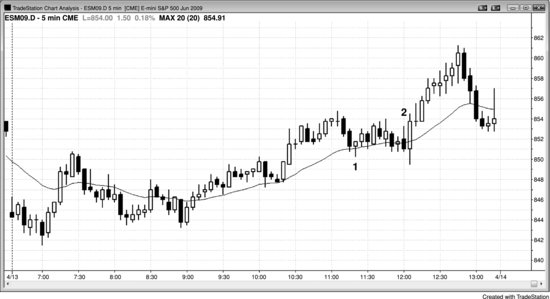

图 22.4 的走势看起来好像没什么特别的，对吧？但如果仔细观察 K线 1 到 K线 2 之间的铁丝网形态，就会发现连续八次反转都没有达到剥头皮者的利润目标。一旦你看到均线附近出现重叠的K线，就要非常小心。一般来说，最好只考虑顺势入场（这里是做多，因为形态大部分在 EMA 上方），而且只有在能在形态底部附近买入、或者一方明显被套住之后才行动。虽然这里的影线没有大多数铁丝网形态那么长，实体也没有那么小，但均线附近的重叠K线会造成非常危险的局面。

在 15 分钟图上，这段 5 分钟级别的**铁丝网形态**不过是一个朝均线方向运动的高 2 回调，因此当 5 分钟图上出现**铁丝网形态**时，切换到 15 分钟图去交易是完全合理的。对大多数交易员来说，最好的做法是暂时不动手，等形态完成**突破**、新的**建仓形态**出现后再入场。有些时候——比如这里——根本没有低风险的**建仓形态**。K线 2 做空是一笔烂交易：在一个多头日里，在**交易区间**底部、一根大**信号K线**的下方做空，本身就不合理。而且，**窄交易区间**内出现的**空头反转**K线根本没有什么可反转的，所以它起不到**反转K线**的作用。实际上，这里它是一个向上的**两K线反转**的第一根K线，**外包阳线**是第二根，入场点在**外包阳线**——也就是两根K线中较高那根——的高点上方。一根K线看起来像**反转K线**，不代表它就能发挥**反转K线**的功能。反过来也一样，有些形态即使看上去不像标准的**两K线反转**，实际上也能完美地发挥**两K线反转**的功能。只有时刻思考市场正在发生什么的交易员，才能抓住这类交易。换一个**时间周期**来看，这段走势很可能（60%+）完全不同——那根**空头反转**K线也许不会出现，**两K线反转**的形态会更漂亮。不过，只要你理解了眼前图表上正在发生的事，就根本不需要去寻找什么完美的**时间周期**。

**图 22.5** 用**突破单**入场的话会连续亏损 10 次

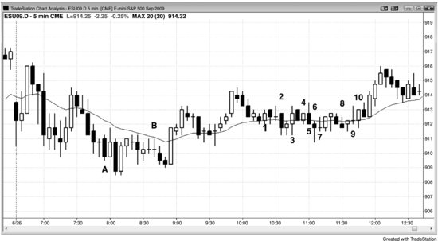

连续 10 笔**剥头皮**交易全部亏损，应该足以警醒那些以为自己能在**铁丝网形态**里赚到钱的交易员。这是一个极端的例子，说明如果交易员不愿花功夫去理解**价格行为**，而是选择纯机械式操作——每当一根K线反转前一根K线就跟着翻转仓位——会遇到怎样的麻烦。图 22.5 中，K线 1 是一笔做多**剥头皮**，结果亏了。如果在K线 2 翻转做空，又会亏。每亏一次就翻转一次，到K线 10 做空为止，会连续产生 10 笔亏损入场。假设第一笔只交易 1 手，采用马丁格尔策略、每次亏损后仓位翻倍，想着最终赢一把就能回到**盈亏平衡点**，那么第 11 笔就需要交易 1,024 手——哪个 1 手的交易员能做到？如果更激进一点，每次亏损后仓位变成 3 倍，想着最终赢一把就能覆盖之前所有连续亏损还能盈利，那么第二笔要做 3 手，第三笔要做 9 手，第 11 笔就要做 59,049 手！这就是马丁格尔策略不切实际的原因。如果你的账户大到能做 1,024 手，你不可能第一笔只做 1 手；而如果你只习惯做 1 手，你也永远不可能做到 1,024 手。

在这个夏天的周五，从K线 A 做多开始到K线 B 做空为止，还出现了另外 8 次连续亏损。

交易员也可以等连续亏 4、5 次之后再开始入场，这样能提高成功概率、降低整体风险，但这种做法只能偶尔使用，而且仅适合那些能快速、准确解读**价格行为**的交易员。聪明的交易员在**铁丝网形态**中会回避这种策略，尤其当**铁丝网形态**演变成漫长的**窄交易区间**时。盲目地在连续亏损后加倍下注，就是在赌博而不是在做交易——赌博是一种娱乐，而娱乐总是要付费的。那 10 笔亏损交易中没有一笔的**建仓形态**强到值得在**铁丝网形态**里交易，所以正确的做法就是等待。你不可能在**铁丝网形态**里反复吃亏，然后指望当天早些时候赚的钱还能撑住——撑不住的，账户会不可避免地缩水，直到连保证金都不够用，最终**爆仓**。

等你成为有经验的交易员后，可以考虑在区间底部附近、在K线低点下方或**波段低点**下方做多，以及在区间顶部附近、在前一根K线高点上方或**波段高点**上方做空。但这种操作非常琐碎，所需的专注程度是大多数交易员无法持续维持的。

**图 22.6** 带斜度的**窄交易区间**

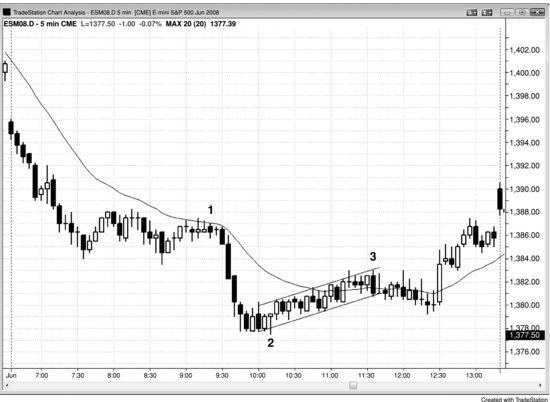

**窄交易区间**即使稍微向上或向下倾斜，本质上仍然是**窄交易区间**，处理方式不变。多空双方处于接近均势的状态，通常（60%+）最好等**突破**失败和**突破回调**出现再交易。总体而言，所有**窄交易区间**都是延续形态，就像图 22.6 中在K线 1 处结束的那个小型**窄交易区间**一样。

从K线 2 开始的区间出现在两段急速下跌之后，预期它会持续较长时间，而且可能（60%+）会形成两段上涨（到K线 3 的那段成了两段上涨中的第一段）。这类形态交易难度很大，经常出现假**突破**。明智的做法是尽量少做甚至不做，耐心等待不可避免会重新出现的清晰走势。这段走势本质上是一个**微型通道**，一旦**突破**发生，失败的概率非常高。市场最终向下**突破**，但随后又反转回升，一直涨到收盘。

### 这张图的深入讨论

所有交易区间，尤其是窄交易区间，都像磁铁一样吸引价格——突破之后，价格通常会被拉回区间内。当一个水平交易区间出现在趋势已经运行了20根或更多K线之后，它往往就是该趋势的最终旗形。突破经常失败，市场重新回到区间内的价格水平，有时候甚至出现趋势反转。

图 22.6 中，均线附近结束于 bar 1 的两段式回调形成了一个最终旗形，到收盘时市场又被吸回了那个价格区域。

结束于 bar 3 的窄交易区间也是一个最终旗形，突破之后形成了一个 HL。随后，在当日最低点的卖出高潮之后，市场反转上涨，突破了窄交易区间，走出了第二段上涨。

很多交易员把下跌到 bar 2 的走势简单看成一波大的两段式下跌，也认为结束于 bar 1 附近的交易区间可能是一个最终旗形。当日最低点出现卖出高潮之后，很多人预期会有两段上涨并回测到那个交易区间。因为这是逆势方向的走势，他们愿意持有在 bar 2 上方二次入场点买入的多头仓位，期间即使有K线跌破前一根K线的低点也不离场。等出现几根强多头趋势K线之后，他们开始把保护性止损移到强多头K线的低点下方跟踪，很快就能把止损移到盈亏平衡点附近。

**图 22.7** 铁丝网形态中的 ioi 形态

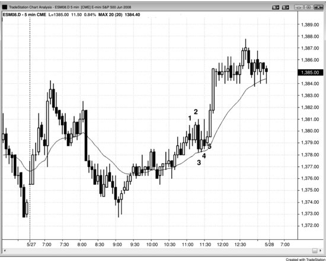

图 22.7 中，bar 1 是一根大的外包K线，后面跟着一根十字星内包K线。虽然 ioi 形态通常是一种可靠的突破建仓形态，但这里最近几根K线的影线太突出了。当出现三根横盘K线、其中至少一根是十字星时，多空双方谁都没有控制局面，最好等某一方取得主导权——标志就是出现一根明确突破的趋势K线。如果突破看起来很弱，而且形成了反转建仓形态，就考虑押注失败去做反向交易。这类形态中走出的大多数趋势K线最终都失败了，变成了反方向的建仓形态。这个入场也经常失败，而那就是做第二笔交易的信号。二次入场失败的情况不常见。这种K线计数对大多数交易员来说很难在实盘中做到，等走势明朗之后再出手，反而更容易赚到钱。

Bar 2 突破了 ioi 形态，但在大的重叠K线上方买入，尤其是在铁丝网形态中，通常是多头陷阱。事实上，有经验的交易员往往会在那根内包K线的高点或上方挂限价单做空，预期多头突破只是个陷阱，市场会很快反转下跌。

既然多头在 bar 2 上方被套了，那在 bar 2 下方做空是不是合理？毕竟那些被套的多头必须卖出平仓。问题在于你面临同样的困境：每当出现三根或更多大K线、其中一根是信号K线、迫使你在窄交易区间顶部买入或底部做空时，你大概率会亏钱，因为机构很可能（60%+）正在做相反的事。

Bar 3 后面那根K线是一根多头内包K线，形成了高 2 做多的建仓形态，其中 bar 2 是高 1。这根K线没有前面几根那么大，你是在一根测试均线的多头趋势K线上方买入，这通常是不错的交易。虽然这笔交易合理，但市场仍然处于铁丝网形态中，最好还是等第二次信号或突破回调。Bar 5 是均线附近的一根多头趋势K线，是三根K线内的二次入场，价格跟第一次入场一样。所有这些因素都提高了成功的概率。这根K线收盘时，多头看到一根大的多头突破K线——底部没有影线、顶部只有小影线——心里就有底了，至少可以预期一个从多头急速K线的开盘价到收盘价的测量移动幅度的上涨。入场K线后面又跟了一根非常强的多头趋势K线。

**图 22.8** 铁丝网形态中的失败突破

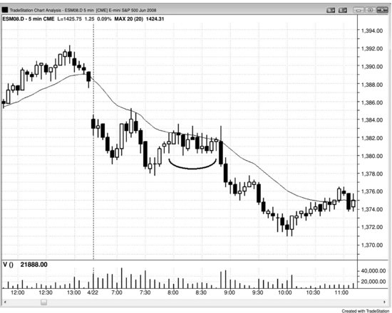

当铁丝网形态在当日价格区间的中部形成时，几乎总是靠近均线附近，最好的策略是在失败突破时入场。图 22.8 中，市场以高 2 形态向上突破了区间顶部，随后立刻反转向下突破了底部，形成了失败的高 2。交易员在窄交易区间下方突破时做空，有的在K线收盘时入场，有的在K线低点下方入场。不过，你必须事先就想到向上突破可能失败，才能及时下达卖出指令。要知道，那根向上突破的K线在最初一两分钟里是一根强多头趋势K线，那种多头力量会让很多交易员一门心思只想做多，结果就被套在了空头交易的场外。你必须时刻保持思考，尤其是市场刚开始启动的时候，不仅要找入场机会，还要一直想：如果最初的走势失败了、然后迅速反向运动会怎样。不这样想，你就会错过好的交易机会——而陷阱恰恰是最好的交易之一。

**图 22.9** 窄交易区间作为旗形

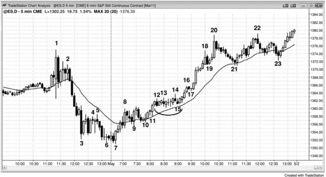

当窄交易区间出现在当天极端位置的突破之后，通常会演变为延续形态。这时应寻找顺势入场机会，有时机会出现在某个方向的假突破之后。以图 22.9 为例，大约到 K线 13 前后，大多数交易员已经认定市场在 K线 8 多头急速上穿高点之后进入了窄交易区间。多头在前一根K线低点及其下方买入，并持有部分或全部仓位，等待可能的向上突破。窄交易区间内大多数K线都带有多头实体，而且整个区间维持在均线上方——这两点都是买压信号，有利于向上突破。尽管K线小且横盘运行，成交量通常依然很大。很多K线的成交量在 5,000 到 10,000 份合约之间，相当于每分钟约 1 亿美元的股票交易量。

市场在一个更低低点之后急速上涨至 K线 8，随后六根多头趋势K线形成突破，在 K线 12 创出新高。之后市场进入窄交易区间，K线 14 向上突破，但突破随即失败。不过向下的反转只持续了一根K线，变成了一个突破回调做多建仓形态，随后引发了一波强多头趋势。K线 14 的反转把多头套在场外、空头套在场内；当两边都被套住时，接下来的走势通常至少会延续好几根K线。

**图 22.10** 窄交易区间熊旗

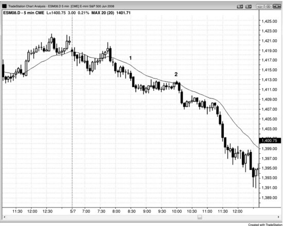

窄交易区间可以成为趋势中可靠的旗形。在图 22.10 中，K线 1 是铁丝网形态内的低 2 做空入场点，出现在一波急速下跌至当日新低之后，属于两段式横盘突破回调。K线相对较大且重叠，影线明显，形态内还有几根十字星。

市场形成了一段较长的窄交易区间，以两段式横盘测试均线收尾于 K线 2。K线 2 是一根空头反转K线——在空头趋势中、均线附近以低 2 做空时，出现空头反转K线始终是理想的信号。而且这根K线较小，位于窄交易区间顶部，所以风险也小。由于是顺势入场，潜在回报很大。

仔细观察这个形态，还有额外的做空依据：它同时也是一个横盘低 4，虽然这一点在这里并不特别重要。先是一段五根K线的两段式横盘回调，接着一段向下的回调（四根K线，两段），然后是第二段两段式上涨（六根K线，横盘偏上），最终以小幅突破均线上方结束。

**图 22.11** 铁丝网形态反转

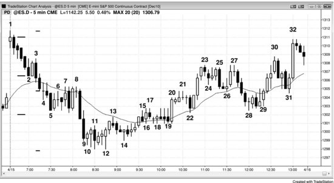

图 22.11 中，在两段下跌至 K线 10 当日低点的过程中，每一段底部都出现了铁丝网形态。第一处变成了熊旗，第二处则是反转。

当天开盘高于前一日高点，但随即形成了五根K线的强空头急速下跌，跌到均线上方附近。此时始终持仓方向明显偏空，意味着市场大概率（60%+）会先跌破 K线 2 的低点，然后才会涨到空头急速顶部上方。实际上，考虑到动能如此强劲，加上均线和前日收盘价两个磁力位就在附近造成了暂停，概率更接近 90% 而非仅仅 51%。

K线 5 之前的下跌走势处于窄空头通道内，所以第一次尝试向上突破通道时买入风险太高。这第一段下跌测试了前日收盘价，但下跌动能太强，市场很可能继续向下测试，大概率到前日低点附近。尽管大K线重叠、出现十字星、长影线和双K线反转说明多头已经开始买入，但铁丝网形态内并没有出现强的做多建仓形态。

K线 8 是均线附近的扩张三角形做空建仓形态。扩张三角形熊旗有三个上推，通常伴随低 3 信号K线，这里的 K线 8 正是如此。

由于铁丝网形态内存在强烈的双向交易，当铁丝网形态出现在一波抛售之后，往往会成为空头趋势的最终旗形。市场通常会回到铁丝网形态的价格区域，因为多头和空头都认为在那个区域建仓是有价值的。

市场跌破价值区间后，多头认为更低的价格反而是更好的买入机会，空头则觉得这个价位做空已经不划算。结果就是多头开始积极买入，空头停止做空。那问题来了：既然如此，跌破铁丝网形态的那次突破为什么是由当天两根最强的空头趋势K线完成的？原因在于，第一段铁丝网形态在测试前一天收盘价时未能构成底部，下一层支撑就是前一天的低点。多头非常急于买入，但一直在等——直到他们认为市场可能 (60%+)不会再继续下跌，才在K线 10 开始的铁丝网形态中重新入场。这已经是当天的第三次连续卖出高潮（下跌到K线 2 的那段走势是第一次，K线 3 到K线 5 的抛售是第二次）。连续三次卖出高潮之后，市场通常 (60%+)会横盘到向上修正，持续至少 10 根K线，并且至少包含两段腿。卖出高潮是情绪化的，通常 (60%+)意味着多头在崩盘期间不惜以市价单急于离场。一旦弱势多头全部出清，剩下的多头愿意扛住更多的抛售；当没有多头继续卖出时，市场就出现了买入失衡。同时，连续三次卖出高潮之后，空头也变得非常犹豫，不愿再继续做空，只有等出现明显的回调之后才会重新入场做空。

K线 11 是一个 ioi 形态，其中包含一根多头内包K线，对于激进的多头来说，这是一个可接受的做多入场机会，尤其是如果他们愿意在更低的价格加仓的话。但大多数交易员应该等到出现 HL 之后再做多。K线 14 形成的 HL 带有多头实体，是对K线 10 和K线 12 双底的回调。

### 本图深入讨论

每当市场出现大趋势K线时，这些K线既是急速走势，也是高潮和突破。突破的部分往往会产生测量移动的目标位，空头会在该位置部分或全部止盈，激进的多头也会开始买入。在图 22.11 中，K线 2 下方的突破是通过K线 3 到K线 5 的五根空头急速K线完成的。市场随后用K线 7 到K线 8 之间的四根K线测试了这次突破，而K线 2 低点突破位与K线 7 突破回测之间的空间形成了一个缺口，有可能成为测量型缺口。从K线 1 的高点到缺口中间位置的距离，往往对应一个市场可能找到支撑的价位。这里市场跌破了那个目标位。测量移动目标位的选择方式很多，其中不少并不明显。从当天最高点到K线 4（测量型缺口内的十字星）中间位置所得出的投影，比当天最低点仅低 1 tick。一旦市场跌破第一个目标位，交易员就会寻找其他可能的目标位。如果他们找到一个逻辑合理的目标位，就会更有信心认为至少一两个小时内的底部已经出现。

从K线 1 之后那根K线到K线 2 底部的急速走势也可能产生测量移动。通常用第一根K线的开盘价到最后一根K线的收盘价作为投影高度，第一段铁丝网形态的低点离目标位只差了 1 tick。

**图 22.12** 铁丝网形态作为低 2

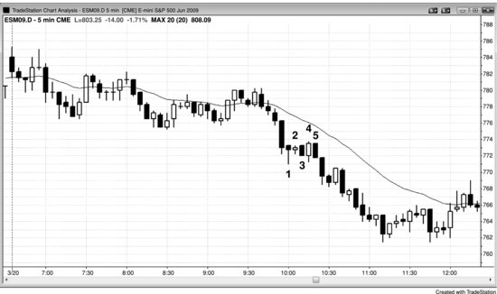

图 22.12 中，市场在前三个小时处于一个小区间内，因此突破的可能性较大。K线 1、2、3 横盘且互相重叠。由于K线 1 和K线 2 是十字星，这构成了铁丝网形态。但K线 3、4、5 实体较大、影线较小，说明市场正在从铁丝网形态过渡为空头趋势中一个常规的低 2 做空建仓形态，随后形成了一段两根K线的空头急速走势和一个窄空头通道。大多数在此过程中一路加仓的多头，在空头趋势中遇到低 2 做空信号时会平掉多头仓位，尤其是在出现空头信号K线的情况下。之后他们通常 (60%+)至少等几根K线才会再考虑做多。这就是为什么低 2 做空在空头趋势中如此有效——多头暂时退场，空头则变得更加积极。
