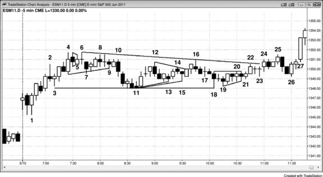
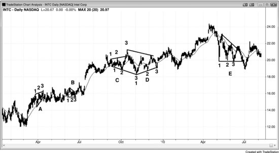

三角形属于交易区间，也属于通道，因为价格行为被夹在两条线之间运行。交易区间要被称为三角形，至少需要有三次向上或向下的推动。由于三角形包含 HL 或 LH（扩张三角形则两者兼有），它也带有一定的趋势特征。楔形是向上或向下倾斜的三角形。倾斜幅度很小时，交易员一般叫它三角形；倾斜幅度大了，通常就叫楔形。牛旗或熊旗可以是楔形，而且通常只是延续形态。楔形也可以出现在趋势末端，形成反转形态。楔形的行为更像旗形或反转形态，而不像传统三角形，所以放在旗形和反转形态的章节里讨论，这里不再展开。

扩张三角形被两条发散的线包含，严格来说这两条线都是趋势通道线——上方那条在多头趋势的高点（HH）之上，下方那条在空头趋势的低点（LL）之下。oo（外包-外包）形态，即一根外包K线后面跟着一根更大的外包K线，就是一个小型扩张三角形。收敛三角形被两条趋势线包含，因为市场同时处于小型空头趋势和小型多头趋势之中。ii 形态在低时间周期图表上通常就是一个小型三角形。上升三角形上方有一条阻力线、下方有一条多头趋势线；下降三角形下方有一条支撑线、上方有一条空头趋势线。楔形是趋势线和趋势通道线收敛的上升或下降通道，它是三角形的变体，也是通道的一种。所有三角形在一个方向至少有三条腿、在另一个方向至少有两条腿，而且凡是有三条腿、横盘或倾斜、形状像楔形的形态，都是三角形。跟趋势通道和交易区间可以无限延伸不同，市场一旦进入三角形，就处于突破模式——意味着突破迫在眉睫。突破可以强也可以弱：可以有跟随并发展成趋势，也可以失败后反转，也可以只是横盘演变成更大的交易区间。

跟所有交易区间一样，三角形是趋势中的暂停，突破方向通常与之前趋势的方向一致。多头趋势中的三角形通常向上突破，空头趋势中的三角形通常向下突破。楔形的情况更复杂一些。熊楔形是向下倾斜的楔形，跟所有空头通道一样，本质上是牛旗。当向下倾斜的楔形出现在更大的多头趋势中时，向上突破与大趋势方向一致，符合预期。但如果一个大型熊楔形占满了整个屏幕，屏幕上的K线就处于空头趋势中。这时向上突破就是一次反转，是对屏幕上趋势的逆向突破。屏幕左侧之外有没有一个明确的大型多头趋势并不重要。任何向下的楔形都会表现得像多头趋势中的一个大回调，也就是说它的行为跟牛旗一样。向上突破是对屏幕上空头趋势的反转，但这个方向仍然是预期中的方向——因为每一个空头通道，不管两条线是否收敛形成楔形，本质上都是牛旗，应该按牛旗来理解。实际上，大多数空头通道在高时间周期图表上就是牛旗。

每一个有三次推动的交易区间，功能上都等同于三角形。大部分确实是三角形，但有些没有明显的三角形外观。不过既然行为跟三角形完全一样，就应该按标准三角形来交易。三次推动比一次推动的回调（高1和低1回调）和两次推动的回调（高2和低2回调）更复杂，代表的逆势压力也更强。由于反方向的交易员力量在增强，这类形态往往出现在趋势和波段的末端，经常变成最终旗形。如果三角形的推动超过三次，大多数交易员就会把这段回调称为交易区间。

如果一个形态倾斜且有三次推动，很多交易员会误判为楔形，然后等着做反转交易。但正如第18章关于楔形的讨论，当三连推形态处于窄通道中时，它通常会像通道一样无限延续，而不是像楔形那样反转。三次推动本身并不构成反向交易的理由。当交易员无法确定楔形是否即将反转时，不应在突破时入场。举个例子，假设有一个相当陡峭的下降通道，趋势线和趋势通道线虽然收敛但间距很近，交易员不应在第一次向上反转时买入，也不应在楔形的多头突破时买入，而应等突破发生后再评估力度。如果突破很强（强突破的特征在第2章讨论过），就等回调结束再入场（突破回调做多）。如果好几根K线都没有回调，说明市场正在形成强劲的多头急速阶段，在大多数交易员看来几乎可以确定已经变成 Always-in 做多了。这时候可以像对待任何强突破一样去交易——可以在K线收盘时买入，可以在前一根K线高点上方买入，可以在任何小回调处用限价单买入，也可以等回调再说。

大多数三角形都相对水平，多头和空头处于均衡状态，双方都认为当前价格水平是合理的。正因如此，突破往往走不了多远就会反转回到区间内，三角形也经常成为趋势中的最终旗形。如果突破失败，市场通常（60%+）会被拉回交易区间，有时还会从另一侧突破，演变为两段式回调甚至趋势反转。关于交易区间的这种行为，第四部分会有更多讨论。

上升三角形、下降三角形和对称三角形的交易含义相同，没有必要去区分，统称为三角形就行。这些三角形基本上都是水平的，沿前期趋势方向突破的概率略高一些，但优势不够大，不足以单凭这一点下单。既然每种三角形都是交易区间的一种，就代表着不确定性，最好等突破发生后再交易。不过当形态高度足够大时，可以把它当交易区间来做——在底部附近买入、顶部附近卖出，利用极端位置做反向交易。突破经常失败，而且跟所有通道的突破一样，如果市场反转回到通道内，通常（60%+）会测试另一侧。如果向任一方向突破成功，突破带来的测量移动大致等于通道高度对应的点数。如果走幅超过这个距离，市场可能（60%+）已经进入趋势。

扩展三角形既可以是趋势末端的反转形态，也可以是趋势中的延续形态。一旦突破，突破往往会失败，市场随后反转并从另一侧突破，形成一个更大的扩展三角形。这样一来，原本的扩展三角形反转就变成了延续形态，原本的扩展三角形延续形态就变成了反转。比如，如果空头趋势底部出现一个扩展三角形，它是反转形态。一旦市场上涨并突破三角形顶部，这个突破往往会失败，市场随后再次下跌，结果形成一个大型扩展三角形熊旗。扩展三角形有时能触发一次主要趋势反转（MTR），但通常它更像交易区间，最终演变成其他形态。书3中关于趋势反转形态的章节会进一步讨论。

**图 23.1** 三角形有很多种画法

大多数交易员把三角形简单理解为有三次或更多次向上或向下推动的交易区间。如果推动次数超过五次，大多数交易员就不再叫它*三角形*，而直接称为交易区间。叫什么其实无所谓，因为所有交易区间的行为特征都差不多。

图 23.1 中，大多数 ii 形态——比如K线5、K线24、以及K线25前面那根K线——都应该被看作小型三角形，因为它们在更低时间周期图表上大多是三角形。

K线4、K线7和K线9的低点构成了横盘中三次向下推动，形成了一个三角形。K线4、K线6和K线8的高点构成了三次向上推动，同样形成了一个三角形。

K线3、K线11（或它前面两根K线中的任一根）、以及K线13、K线15或K线18中的任一根，它们的低点构成了三次向下推动，一些交易员把每种组合都视为三角形。K线26是一个两K线反转的突破回调做多建仓形态，来自K线24对K线3到K线18这个大型三角形的突破。

K线18、K线19和K线20后面那根K线的低点构成了三次向下推动。K线18后面的十字星、K线19后面的阳线以及K线20的高点构成了三次向上推动，形成了一个三角形。K线23是K线22向上突破三角形后的回调。

**图 23.2** 三角形

图 23.2 是 Intel（INTC）的日线图，其中有很多三角形，但没有一个是完美的。三角形 A 是一个上升楔形，突破没有动能，形态演变成了窄交易区间。当市场在上涨中突破上升楔形却没有下跌而是横盘时，这是强势信号，多头可能（60%+）会回来。如果空头在多头趋势中看到上升楔形，却无法把市场打下去，他们很快就会回补空单，等下次机会再做空。这使得市场变成一边倒的格局，向上突破继续推进，直到空头愿意再次做空、多头也愿意卖出部分或全部多头头寸来止盈的价位。

三角形 B 和 E 都是下降三角形，B 向上突破。三角形 E 先向上突破但失败了，然后向下突破，同样也失败了。

三角形 C 是一个扩展三角形，交易员可以在K线3的高点做空。扩展三角形顶部通常（60%+）会演变为扩展三角形底部，反之亦然，这个例子也是如此。交易员可以在K线3的低点上方买入。

三角形 D 是一个不太标准的对称三角形。既然对称三角形就是交易区间，交易员可以在价格测试下方多头趋势线时买入，在价格测试上方空头趋势线时做空。
