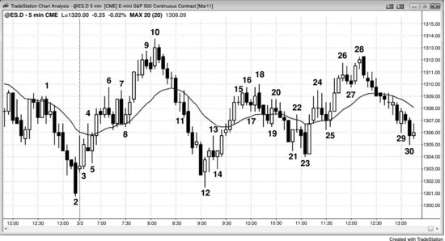

投资者根据基本面买入股票，计划持有6个月到数年，等有利的基本面逐步反映到股价上。如果股价下跌，投资者往往会加仓，因为他们觉得当前价格有价值。交易者则依据日线图和短期基本面事件（如财报、产品发布）来操作，目标是抓住一到数天的快速行情。交易者会在价格第一次停顿时先了结部分利润，然后把剩余仓位的止损移到盈亏平衡点——他们不愿看到浮盈变成亏损。交易者有时也被叫做剥头皮者，但这个词更常用来指一种特定的日内交易者。顺便说一句，坚守自己的时间周期非常重要。亏损的一个常见原因是：入场后发现方向做反了，到了原定止损位却不肯出场，反而说服自己把交易"变成投资"。如果你是按交易计划进的场，就应该按交易计划出场、接受亏损。否则你几乎一定会拿太久，亏损会膨胀到原本最坏预期的好几倍。不仅如此，它还会持续分散你的注意力，影响你管理其他交易。

在用日线到月线时间周期的交易者或投资者看来，所有日内交易都算剥头皮。但对日内交易者来说，剥头皮是指持仓大约1到15分钟，通常用限价单在利润目标处出场，试图在自己所用的时间周期上抓住一小段行情。一般来说，潜在回报（到利润目标的 Tick 数）和风险（到保护性止损的 Tick 数）大致相当。剥头皮者不希望遇到任何回调——如果价格在触及目标前回撤，他会迅速在盈亏平衡点出场。所以剥头皮者的角色，就相当于日线图上的交易者。日内波段交易者则会持仓穿越回调，试图抓住一天中2到4次较大的波段，每笔持仓从15分钟到一整天不等。他们的潜在回报通常至少是风险的2倍，愿意扛住回调继续持仓，角色相当于日线图上的投资者。

1990年代，媒体和机构投资者嘲笑日内交易者（当时大多是剥头皮者），说他们是毫无用处的赌徒。批评者完全忽略了一个重要事实：所有交易者都在增加市场流动性，从而压缩买卖价差，让所有人的交易成本更低。很大一部分批评可能(60%+)来自华尔街的老牌机构投资者。他们觉得这个游戏是自己的地盘，自己就是王者，看不起任何不按他们规矩玩的人。他们辛辛苦苦拿了 MBA，觉得一个高中辍学生只花几个月学点简单的交易技巧就可能(60%+)发大财，这不公平。机构享受着公众对他们业绩的崇拜目光，多少也嫉妒这些没学历的后来者抢走了关注度。后来高频交易公司成了华尔街成交量最大的交易者，业绩远超传统机构投资者，媒体注意到了这一点，开始给他们比那些自华尔街诞生以来就统治市场的"恐龙"更多的关注和敬意。高频交易公司是终极日内交易者，让日内交易变得受人尊敬。CNBC 的 *Fast Money* 节目每天都有经常做剥头皮的交易者上场，而且被塑造为令人钦佩的成功交易者。现在大家普遍认为：靠交易赚钱非常难，如果你能做到，你值得获得很多尊重，尤其是来自其他交易者的尊重。你怎么交易并不重要，重要的只有业绩——在一个资本主义社会里，本该如此。成功的投资者、交易者、日内波段交易者和剥头皮者都值得同样的尊重和敬佩，因为他们做的事情都不寻常，要做好需要非凡的天赋和大量的努力。

第25章"交易者方程"部分讨论过，波段交易者会站在所有剥头皮交易的对手面，同时也会站在反方向波段交易者的对手面。剥头皮者的回报大致等于风险，但胜率较高。反方向不可能同时存在一笔风险、回报和概率都相同的剥头皮交易。举个例子：市场不可能同时满足60%的概率先涨2个点再跌2个点，又有60%的概率先跌2个点再涨2个点。来看一个多头趋势中的例子：假设一个做多的交易员在 Emini 一个可靠的回调中，于一根强信号K线上方1 tick 处买入，入场价1254，止损2个点在1252，止盈目标在1256。多头只有在认为这笔交易大概率（60%以上）成功时才会下单，也就是说他至少有60%的把握，这意味着市场跌到1252触发止损的概率不超过40%。如果一个做空的剥头皮者在1254.00做空，止损在1256，止盈目标在1252。既然市场跌到1252的概率不超过40%，那空头赚到利润的概率也不超过40%。实际上几乎一定更低，因为他的限价止盈单要成交，市场通常需要再多走1 tick（概率超过60%），而更大幅度的运动发生概率更低。

正因为这个数学关系，站在剥头皮对手面的人，成功概率必然更低。在一个高度有效的市场里，机构主导着价格行为，每一笔成交的背后，都是一家或多家机构愿意站在一侧，另一家或多家机构愿意站在另一侧（虽然没什么是绝对的，但基本如此）。这就意味着，站在一笔合理剥头皮交易对手面的人，要想让交易者方程为正，回报必须大于风险（你得假设他确实有正期望，因为他要么是机构，要么是在做与机构同方向的交易）。这样一来，他就成了波段交易者。波段交易的成功概率往往不超过40%，所以波段交易者虽然站在剥头皮者的对手面，仍然可以拥有正期望的交易者方程。如果市场跌2个点的概率是40%，那么试图赚超过2个点的波段做空者，成功概率必然低于40%。但只要他的交易管理方式正确，用这个策略仍然可以持续盈利。举个例子，后面关于分批建仓的讨论会提到，他使用的止损可能远不止2个点，而且如果市场继续上涨，他可能愿意分好几次加仓。如果是这样，他的成功概率可以达到60%甚至更高。一旦市场最终下跌，他可以在最初的入场价1254平掉全部仓位。如果在最初的做空入场价平仓，第一笔单子打平，后面在更高价位加的空单则全部盈利。

要在5分钟 Emini 图表上有效地剥头皮，以目前日均波幅8到15个点来看，大约需要冒2个点的风险，止盈目标通常在1到3个点之间。如果只赚1个点，胜率必须超过67%才能打平。虽然有些交易员能做到，但对大多数人来说并不现实。一般原则是：只做那些潜在回报至少与风险相当、而且你有把握的交易。如果你有把握，一个参考标准是你认为成功概率至少有60%。在 Emini 中，以目前10到15个点的日均波幅来看，基于5分钟图表的大多数交易，2个点的止损是最可靠的选择，这意味着止盈目标也应该至少2个点。如果你觉得2个点不是一个现实的目标，那就不要做这笔交易。顺便提一件事，多年前我有一个朋友，一次做100手 Emini，每笔剥2 tick，一天大约做25笔。他住在一栋1.1万平方英尺的大房子里，我猜他做得相当不错。但这属于高频交易的范畴，对绝大多数交易员来说几乎不可能盈利。我还有一个朋友曾跟我提到一个共同认识的人，此人当华尔街律师赚了几百万，结果做交易几乎全赔光了。他大概觉得自己比那些靠交易赚了几百万的客户都聪明，至少应该做得一样好。他拿100手 Emini 来剥头皮，头两年就亏了200万美元。他或许聪明，但并不明智。有些事看起来简单，不代表真的简单。

每个人都会冒出"精挑细选"的想法。一天做20笔交易、每笔赚1个点，不如只做当天最好的3笔、每笔也赚1个点——这不是更好吗？理论上说得通，但问题是：你等了那么久才等到一笔完美交易，又下了那么大功夫才学会识别这种优质机会，就必须确保回报足够丰厚。1个点远远不够。比如你认为自己正要买入当天最好的一两个建仓形态之一，那就应该假定市场也会认同这个建仓形态很强。这意味着 Always-in 的方向可能（60%+）变成明确的 Always-in 做多，市场可能（60%+）至少走出两段上涨，到达某个测量移动目标或吸引价位附近，而且这波行情至少持续10根K线。与其冒2个点的风险只刮1个点就跑，远不如至少拿到2个点、甚至4个点再出场。如果你情绪上扛不住，第一次回调就在盈亏平衡点跑了，可以试试这个办法：做多之后立刻挂一组 OCO（二择一）委托——2个点的保护性止损加上2个点的止盈限价单，一个成交另一个自动取消。然后出去散个步，大约一小时后回来。这样做几次之后，可以试着把止盈目标从2个点提高到3个点甚至4个点，你可能很快就会发现，这类交易平均每天能赚到4个点。

有些剥头皮者所有交易都做剥头皮，但很多交易员会根据情况在剥头皮和波段交易之间切换。对这第二类交易员来说，选择剥头皮隐含着一个前提：他们并没有顺着一个明确的 Always-in 方向在做。如果在剥头皮，说明他们要么认为当前没有明确趋势，要么认为自己的交易方向是逆势的——否则就会做波段了。即便市场一直在走趋势、他们在回调时入场，但如果只做剥头皮，就说明他们认为趋势很快要结束了，至少暂时如此。比如他们买入了一个牛旗，却只拿了剥头皮的利润就出场，这说明他们怀疑市场即将进入交易区间。如果不这么想，就会持仓等更大的利润。每当交易员看到信号出现后市场回撤了3到4个 tick，这就是大资金认为市场走不远的信号。这时交易员应该只考虑交易区间内的交易或逆势交易，而不是趋势交易。既然市场可能（60%+）处于交易区间中，有经验的交易员就倾向于剥头皮而非波段交易，低买高卖。

逆势交易时，交易员有时会用较小的仓位，比如半仓，因为他们愿意在市场走反时加仓。如果真的加仓了，他们可能会等市场回到第一笔入场价时全部出场。这样第一笔入场盈亏平衡，第二笔入场赚到剥头皮者的利润。做剥头皮时，止盈目标通常大约是波段交易最低目标的一半，但风险通常一样大。也就是说回报和风险差不多，因此胜率至少要达到70%，否则就是亏钱的策略。分批加仓可以提高胜率，代价是仓位更大、风险也更大。剥头皮看起来轻松、诱人，但实际上要靠它稳定赚到钱是非常难的。

如果你拿到几个点的部分利润后，用盈亏平衡点止损来持有剩余仓位做波段，就可以降低所需的胜率。如果你在入场K线收盘后，把止损从信号K线极端价移到入场K线极端价（都加一个 tick 的缓冲），然后在行情走出5个 tick 之后把止损移到盈亏平衡点，这会进一步降低全天盈利所需的胜率。还有一些剥头皮者用更宽的止损——3到5个点，市场走反时分批加仓，同时用更大的止盈目标，这同样能进一步降低所需胜率。一般来说，如果你看到一个觉得成功概率非常高的建仓形态，这笔交易往往适合剥头皮，而不是大波段。原因在于，当市场出现如此明显的失衡时，会很快自行修正，所以一个概率极高、风险相对较低的机会不会持续超过一两根K线。

波段交易者用的建仓形态和止损方式跟剥头皮者一样，区别在于他们只关注每天少数几笔可能 (60%+)走出至少两段式回调的交易。他们通常 (60%+)能在部分仓位上拿到 4 个点甚至更多，然后把剩余仓位的止损移到盈亏平衡点。很多人会允许价格先走一段反向，在更好的价位加仓。不过，他们至少会设一个心理止损，一旦市场到了那个位置，就认定自己的判断不再成立，果断止损出场。要时刻关注剥头皮者的止损位置在哪里——如果形态依然有效，就在那些位置加仓。如果你买的是你认为的反转，可以考虑允许市场再走出一个 LL，然后在二次入场点加仓。举个例子，像苹果（AAPL）这种走势稳定的股票，如果你判断买入位置接近这波走势的低点，而且大盘当天不是空头趋势日，可以考虑在这笔交易上承受 2 到 3 美元的风险，浮亏 1 到 2 美元时加仓。不过，只有经验丰富、对自己读图能力非常有信心、并且能承受大额亏损的交易者才应该这么做。大多数交易日里，市场会马上朝你的方向走，所以这并不是什么问题。

波段交易者可以先建一个仓位，之后每出现一个新的信号就加同样大小的仓位，前提是已经有了合理的利润。整个仓位的止损就设在最近一次加仓的止损位，这意味着即使最后一笔加仓亏了，前面几笔还是盈利的。另外，如果在跟踪止损被触发之前市场已经出现了反向信号，他们也会主动平仓。

每个人都想要很高的胜率，但极少有人能做到持续 70% 以上。正因如此，能靠在 Emini 里剥头皮赚 1、2 个点来谋生的交易者少之又少——尽管几乎所有人刚入行时都会尝试一阵子。对大多数交易者来说，要想长期盈利，就必须学会接受较低的胜率，培养耐心去做波段交易，容忍途中的回调。哪怕是非常成功的剥头皮者，如果不愿意偶尔做波段，通常 (60%+)也会错过一些持续较长的趋势行情——这类行情的成功概率往往只有 60% 甚至更低。很多优秀的交易者在这种时候只是安静地等，等到出现高概率的剥头皮机会，结果错过了持续性行情中的不少利润。这种做法其实也没问题，因为交易的目的是赚钱，不是不停地下单。

当 Emini 的日均波幅在 10 到 15 个点时，每天通常 (60%+)至少有一笔交易可以用突破单入场、用限价单在 4 个点利润处出场。因为 99% 的交易日至少有 5 个点的波幅，理论上交易者可以用限价单进出、赚 4 个点，但波幅很小的日子里没人能持续做到这一点。整体来说，交易者更容易找到那些可以用突破单入场、用限价单或跟踪止损出场的建仓形态。90% 的交易日至少有一次 4 个点的波段，大约 10% 的交易日会出现 5 次左右 4 个点的波段。大多数交易日有 1 到 3 次波段机会，交易者可以通过突破单入场拿到 4 个点。如果一个交易者每天做 10 到 15 笔，那大部分都是剥头皮。不过，厉害的剥头皮者知道什么时候一个建仓形态有合理的机会发展成 4 到 10 个点的波段，遇到这种情况，他们通常 (60%+)会把四分之一到一半的仓位留着做波段。一旦剥头皮的部分平掉了，如果市场继续朝波段方向走并出现新的入场机会，他们通常 (60%+)会在新的建仓形态出现时再挂上剥头皮仓位。

波段交易的难度远超收盘后复盘时的感觉。波段建仓形态要么不够清晰，要么看似清晰却令人心生恐惧。大部分波段建仓形态只有 40% 到 50% 的概率让市场走到交易员的目标位。在剩余 50% 到 60% 的交易中，交易员要么在到达目标前主动退出——因为他们判断目标已不再合理，要么被保护性止损打掉。大多数波段交易者采用反转形态入场，因为要赚 4 个点以上，就必须在行情早期介入。趋势特别强时，通过回调入场或在一段强劲急速走势中某根 K 线的收盘价入场，也能赚到 4 个点，但这种机会一周也就出现两三次。大部分波段交易者会在开盘后头几个小时里做多某种双底、做空某种双顶，或利用其他可靠的开盘反转建仓形态入场。他们往往要连续尝试好几个反转形态，才有一个能发展成大波段。不过，在那些未达到 4 个点目标的交易中，他们整体上通常仍然能够盈利——那些交易最终变成了剥头皮。例如，交易员在第一个小时买入一个双底，6 根 K 线之后市场又出现了一个合理的双顶建仓形态，他就可以反手做空，在多头仓位上赚个一两个点。正如剥头皮者有时也会持有波段仓位，大部分波段交易者最终也做了大量剥头皮交易。一旦波段交易者认定最初的交易逻辑已经不成立，他们就会出场，通常带着一笔剥头皮利润离场。

波段交易者看到合理的建仓形态后，必须果断入场。波段建仓形态几乎总是比剥头皮建仓形态看起来更不确定，而这种较低的确定感容易让交易员犹豫不决。当出现一根强信号 K 线时，通常伴随着非常剧烈的反转，但新手交易员此时还在认为之前的趋势仍然有效，对此毫无准备。他们可能还觉得老趋势尚未结束，而且当天可能已经在好几笔逆势交易上亏了钱，不想再亏。这种心理上的否认导致他们错过了早期入场的机会。等到突破发生或突破 K 线收盘后再想入场就很困难了，因为突破的急速走势往往幅度很大，交易员必须迅速做出决定，承担比平时大得多的风险。这就是他们往往选择等回调再入场的原因。即便缩小仓位使金额风险与平时相当，光是想到要承受两三倍 tick 数的风险就足以让他们望而却步。等回调入场同样不容易，因为每一次回调起初看起来都像小型反转，令人担心它会演变成深度调整。最终他们一直等到临近收盘才确认趋势是明确的，但那时已经没有足够的时间入场了。趋势会想尽一切办法把交易员挡在门外，这也是唯一能让交易员整天追逐行情的方式。当建仓形态简单明确时，走出来的行情通常只是一段小而快的剥头皮。行情要走出很长的一段，就必须看起来模糊不清、令人不敢参与，这样才能把交易员留在场外，迫使他们去追趋势。

波段交易者应该不断问自己：是否要在到达目标前提前出场？有一个办法可以帮助做决定：假设自己当前空仓，然后想想是否愿意在当前价格、以当前市场中波段交易者通常设置的保护性止损位，用波段级别的仓位直接市价入场。如果你不愿意做这笔交易，那就应该立刻平掉当前的波段仓位。因为继续持有当前的波段仓位，与在同一价格、同一止损位、同一仓位大小重新建仓，在财务上完全等价。

大部分波段交易者在交易走势不如预期时会选择以剥头皮方式出场，而大部分剥头皮者碰到最佳建仓形态时也会把一部分仓位留着做波段。因此两种方式有大量重叠。根本区别在于：剥头皮者会做多得多的交易，其中大部分交易的盈利不太可能超过剥头皮的利润水平；而波段交易者只做那些有较大概率（60% 以上）至少走出两段式回调的交易。两种方式没有优劣之分，交易员选最适合自己性格的即可。

正如第25章交易者方程那部分所讨论的，波段交易的确定性通常低于剥头皮交易，也就是说成功概率更低。但波段交易者追求的是大利润，通常利润至少是风险的两倍。更大的潜在回报弥补了较低的成功概率，交易者方程仍然成立。最大的波段来自交易区间的突破和反转，而大多数反转形态本身就是交易区间。这种地方不确定性最高，成功概率往往只有50%甚至更低。波段交易者需要找到回报远大于风险的建仓形态，用它来弥补较低的成功概率。剥头皮交易的确定性高得多，但高确定性意味着市场存在显而易见的巨大失衡，这种失衡会迅速被交易者发现并消化。结果就是市场很快回归混沌状态（交易区间）。剥头皮者在入场和止盈时都必须快，因为行情通常几根K线内就会回到入场价。

波段交易之所以能持续很长时间，正是因为不确定性——这往往是任何持续多根K线、覆盖大量点位的交易的关键要素。强多头趋势中常说的"忧虑之墙"就是这个道理，强空头趋势中则是反过来的形式。顺势交易的困难在第一本书中讨论过。趋势从大大小小的急速开始，然后演变为大大小小的通道。突破幅度不大时，交易者不确定后面是否会有跟随。突破又大又强时，不确定性又换了一种形式——交易者不知道要承受多大的风险才能留在场内，也不确定在如此大的风险下交易者方程是否还成立。他们看到了大幅急速，意识到止损可能要放在急速的另一端，这就导致风险大增，仓位只能大幅缩小。等市场进入通道阶段，他们又开始追进去，因为一开始建的仓位比想要的小。而通道阶段的不确定性在于，它是一个双向市场。一天结束后，新手回头看图表，看到一个漂亮的强趋势，纳闷自己怎么就错过了。原因就是：所有大行情在展开过程中都充满不确定性，正是这种不确定性把交易者挡在了最强趋势的门外。它还经常把交易者诱入逆势交易，导致反复亏损。即使是新手也对概率有直觉，能感觉到趋势本身就是低概率事件——事实也的确如此。最强的趋势一个月也就出现几次，所以新手知道今天演变成强趋势日的概率很小。他们最终要么否认趋势的存在而被挡在场外，要么逆势操作反复亏损。他们真正需要学会的是接受现实，跟着市场走。如果市场一路上涨，哪怕看起来很弱，也要至少买入一个小仓位，做波段。

波段交易的仓位管理和 Always In 交易基本一样（第三本书会讨论），区别在于波段交易者倾向于在行情朝有利方向发展时逐步减仓。真正的 Always In 交易者会一直持仓，直到出现反向信号，然后反手操作。对大多数交易者来说，波段交易的入场和止损跟趋势交易是一样的，这在第一本书中讨论过。一个重要区别是：大多数波段交易者在交易区间中的出场方式和趋势中不同。在趋势中，他们更倾向于让部分仓位一直持有，直到出现反向信号；但在交易区间中，他们更倾向于在接近交易区间极端位置时全部平仓。到了那个位置，他们需要判断：这次波段是否足够弱、反转形态是否足够强，值得寻找反向波段；还是这次波段本身足够强，应该等回调后再入场，继续原方向做第二腿。

波段交易者看到合理的建仓形态后，必须果断入场。波段建仓形态几乎总是看起来不如剥头皮建仓形态确定，较低的概率容易让交易者犹豫观望。出现强信号K线时，它通常伴随着一次非常情绪化的反转，而新手这时候还停留在惯性思维里，觉得原来的趋势仍然有效，对此毫无准备。他们可能还在想着老趋势没结束，也可能今天已经在几次逆势交易中亏了钱、不想再亏了。这种否认心理让他们错过了早期入场机会。在突破时入场或在突破K线收盘后入场也很难，因为突破的急速往往很大，交易者必须迅速决定承担比平时大得多的风险。这就是为什么他们经常选择等回调再进。即使把仓位缩小，让美元风险跟其他交易一样，一想到要承受两三倍的 tick 数也会让他们害怕。等回调入场同样困难，因为每次回调一开始都像是一个小反转，他们担心回调可能演变成深度修正。就这样一直等到收盘前，才终于确认趋势已经很明显了，但这时候已经没时间下单了。趋势会想尽一切办法把交易者挡在门外——只有这样才能让交易者全天追着市场跑。一个建仓形态要是简单清晰，行情通常只是一个小的、快速的剥头皮机会。行情要走很远的话，它必须看起来不清晰、难以下手，这样才能把交易者留在场外，迫使他们去追趋势。

波段交易者应该始终问自己：是不是该在利润目标到达之前提前出场？一个判断方法是：假设自己是空仓状态，想一想是否愿意以当前价格建立一个波段大小的仓位，止损放在场内波段交易者的止损位置。如果不愿意做这笔交易，就应该立刻平掉手中的波段仓位。因为从财务角度看，持有当前的波段仓位和以同样的价格、同样的止损重新建一个同样大小的仓位，完全是一回事。

大多数波段交易者在交易走势不理想时会选择剥头皮出场，而大多数剥头皮者在遇到最佳建仓形态时会把部分仓位做成波段，所以两者的操作有很大重叠。根本区别在于：剥头皮者做的交易笔数多得多，而且大部分交易的利润不太可能超过剥头皮者的利润水平；波段交易者则尽量只做可能（60%+）至少走出两腿的交易。两种方式没有优劣之分，交易者会选择最适合自己性格的那种。

当 Emini 的日均波动幅度在 10 到 15 个点之间，大多数好的交易只需要 2 个点的保护性止损就不会被扫出去时，很多波段交易者会视情况在 2 到 4 个点处止盈一部分仓位。如果交易员判断市场处于交易区间，并且在底部做了一笔多头反转交易，那么价格达到等距目标的概率通常在 60% 以上。既然风险是 2 个点，就有 60% 的概率在止损被触发前赚到 2 个点。这刚好满足交易者方程的最低要求，所以在 2 个点处止盈一部分是合理的。如果交易员认为交易区间的高度足够大，能拿到 3 到 4 个点的利润，就可以在那个位置止盈部分或全部仓位。还有一些交易员会在阻力位处止盈多头的一部分——比如测量移动目标处出现小级别反转、前一个波段高点上方、空头趋势线和多头趋势通道线的过冲与反转（也就是失败的突破）。做空的仓位则在对应的支撑位止盈一部分。所有交易员在出现强反转信号时都会平掉剩余仓位。遇到弱反转信号时会部分或全部止盈，但通常不会反手。这是因为出场和入场用的标准不同：入场需要更强的信号，而止盈时只要出现与持仓方向相反的较弱信号就够了。波段交易有很多种赚钱的做法，唯一的核心问题就是交易者方程。只要数学上说得通，这套方法就能赚钱，也就是合理的。

对一位经验丰富的交易员来说，交易 Emini 时以剥头皮为主（日均波动幅度约 10 到 15 个点时，目标 2 到 4 个点），交易股票时以波段为主，这种搭配是合理的。如果你属于那种极少数能做到 80% 以上胜率的交易员，可以用 1 个点的利润来剥头皮交易 Emini。用限价单设置 4 个 tick 的利润目标来平掉部分或全部仓位，这通常需要价格在信号K线之外再走 6 个 tick（入场用突破单挂在信号K线外 1 个 tick 处，然后还需要 4 个 tick 作为利润，而限价单通常要价格超过目标 1 个 tick 才能成交）。Emini 的 4 个 tick 等于 1 个点，相当于 SPY（ETF 合约）的 10 美分（10 个 tick）。

那新手该怎么办？大多数交易员如果用比风险还小的利润目标来剥头皮，即使胜率有 60%，也还是会亏钱。新手经常搞错自己认为有 60% 胜率的建仓形态，其中很多实际上最多只有 50% 的把握，尽管下单的时候感觉确定得多。他们可能觉得只要再多积累点经验，胜率就能提高到 70% 或 80%，到那时数学就站在自己这边了。现实是，他们永远也达不到那个水平，因为就连最优秀的交易员里也极少有人能做到。这就是残酷的事实。

另一个极端是波段交易，利润目标至少是风险的两倍。大多数这类建仓形态的胜率只有 40% 到 50%，但已经足以让交易者方程为正。多数交易日里会出现几个这样的建仓形态，有时甚至超过 5 个，大多是主要趋势反转（第三本书会详细讨论）。如果交易员愿意做低胜率的交易（回报至少是风险的两倍，详见第 25 章），就必须抓住每一个合理的建仓形态，挑三拣四在数学上对他不利。这些交易作为一组来看，交易者方程是正的，但单独一笔大概率会亏，因为胜率不到 50%。胜率低是因为建仓形态看起来不太好，入场后走势往往也显得很弱，通常要经历好几次回调，强趋势才会真正展开。很多交易员宁愿等趋势启动之后再进场，这时胜率能到 60% 以上，不过剩余的利润空间就小了。也有不少波段建仓形态本身就很强，胜率达到 60% 甚至更高。这种情况下每笔交易都有正的交易者方程，挑选入场在数学上也站得住脚，而且无论是波段还是剥头皮，数学上都行得通。大多数刚起步的交易员会同时尝试波段交易和剥头皮，还会试各种时间周期和指标，看哪种能赚到钱，哪种风格更适合自己。没有唯一的最佳方法，只要交易者方程为正，就是好方法。很多交易员每天试图找 5 到 10 个可交易的波段，要求盈利至少等于风险的概率在 60% 以上。操作时，他们通常找微型双顶做空、微型双底做多。如果交易员认为一个建仓形态很强，回报很可能至少等于风险，那它的成功概率就至少有 60%（第 25 章讨论了等距移动方向概率的数学原理）。这就允许交易员把止损设得和利润目标一样大，交易者方程仍然为正。虽然这是大多数成功交易员采用的风格，但初学者应该先找强波段建仓形态，哪怕成功率往往只有 50% 到 60%。原因在于，当回报是风险的两倍甚至更多时，交易者方程反而更强，尽管成功概率更低。在 Emini 中，当日均波幅大约在 10 到 15 个点时，要找那些有较大概率做出 4 个点（初始风险的两倍）甚至更多波段的交易，在 4 个点处平掉部分或全部仓位。有了经验之后，交易员可以先剥头皮平掉一部分赚 2 到 4 个点，剩下的留着做波段。如果专注于这类建仓形态，就给了自己一个合理的机会成为盈利交易员。如果发现自己总是出场太早，可以考虑下好 OCO 订单（一个在 2 到 4 个点止盈，另一个在 2 个点以内止损），然后离开电脑，一个小时后再回来看。你可能会惊讶地发现自己突然就变成了一个成功的交易员。趋势确立之后，继续沿趋势方向寻找入场机会，大部分做剥头皮赚 2 个点、风险也大约 2 个点，如果趋势非常强，就把一部分仓位做波段。听起来很简单，但交易永远不容易，因为你是在一个零和博弈中跟非常聪明的人竞争。收盘后看起来那么明显的东西，在实时交易中往往一点都不明显。学会稳定盈利需要很长时间，即使做到了，每天也必须保持头脑清醒、坚守纪律。这是一件充满挑战的事，但也正是交易吸引人的地方。一旦你成功了，财务回报可以非常可观。

说到股票，利润目标的差异要大得多。一只 500 美元的股票，日均波幅 10 美元，如果只剥 10 美分的头皮就太蠢了，因为止损可能得设在 2 美元左右，那就需要超过 95% 的胜率才行。不过如果交易的是 QQQ，而且一次交 10000 股，剥 10 美分的头皮就可能是值得的。

在高成交量的股票（日均至少 300 万股，最好 700 万股以上）中找波段机会相对容易，这些股票的日均波幅通常有好几美元。你要的是滑点小、形态可靠、每笔至少赚 1 美元。先剥 1 美元的头皮，然后把剩余仓位的止损移到盈亏平衡点，一直持有到收盘或者出现明确的、强烈的反向建仓形态。你大概能同时盯着 5 只股票看一整天，偶尔再抽空瞄一下另外 5 只左右，但很少会真的去交易它们。

Emini 剥头皮者一天大概只能做几笔股票交易，因为 Emini 日内交易本身就需要高度集中注意力。另外，如果你只用K线图看股票，一个屏幕可以放 6 张图。挑出趋势走得最好的那只，然后在价格回调到均线附近时寻找入场机会。如果之前已经出现过一次有力的趋势线突破，随后价格过冲趋势通道线并形成反转，也可以做反转交易。如果 Emini 行情很活跃，可以考虑只看 15 分钟周期的股票图表，这样不用盯得那么紧。

当你预判行情会有一波较大的走势或新趋势即将启动时，或者在强趋势中回调入场时，先平掉 25% 到 75% 的仓位，拿到至少 1 到 2 倍初始风险的剥头皮利润，剩下的仓位随着行情继续朝有利方向发展逐步减仓。平掉剥头皮部分之后，把保护性止损移到盈亏平衡点附近。有时候，如果你非常看好这笔交易，觉得它不会走坏，而且出场后重新入场只能拿到更差的价格，那么可以承受 4 到 6 个 Tick 的风险。一笔好的交易不应该回头让后来者以跟聪明交易者相同的价格进场。聪明的交易者已经在最佳时机入场了，如果这笔交易确实很好，那些错过初始入场的交易者会急着进场，宁愿接受更差的价格，用限价单在比原始入场差 1 到 2 个 Tick 的位置挂单——如此一来，最初入场的交易者的盈亏平衡点止损就不会被打到。不过，有时候最好的交易也会打穿盈亏平衡点止损，把交易者套在场外，然后走出一波又快又大的趋势行情。当你觉得这种情况有可能发生时，就多承受几个 Tick 的风险。此外，如果价格回来扫掉那些止损后立刻恢复了新趋势的方向，就在前一根K线的上方或下方 1 个 Tick 处重新入场或加仓波段头寸（比如在新的多头趋势中，就挂在前一根K线高点上方 1 个 Tick）。

如果市场触及了你的止盈限价单但没有穿过去，而订单仍然成交了，说明市场的趋势压力可能比图表上看到的更强，接下来几根K线内价格突破止盈目标的概率会增大。假设你持有多头仓位，市场愿意在这一段走势的最高点把你的仓位买走（你在最高点用限价单卖出止盈），说明买方很激进，回调时很可能（60% 以上的概率）再次出手买入。这时要留意再次做多的机会。

同样的道理，如果市场触及了你的止盈目标（比如信号K线上方 9 个 Tick）但你没有成交，这可能意味着一次失败的突破。假设你持有多头仓位，市场涨到信号K线上方 9 个 Tick 却没让你成交，这时考虑把止损移到盈亏平衡点。等这根K线收盘后，如果背景支持反转交易，可以考虑在这根K线低点下方 1 个 Tick 处挂空单——因为大多数剩余的多头剥头皮者很可能（60% 以上的概率）在那个位置出场，形成抛压。而且他们不会马上再买入，要等更多价格行为走出来才会重新考虑——这就少了一批买方，空头更容易（60% 以上的概率）把价格推低到足够让你的空头头寸剥头皮获利的程度。5 个或 9 个 Tick 的突破失败在一波持续很久的趋势末端很常见，往往是反转的第一个信号。

虽然所有股票的走法基本相同，但不同股票之间还是有些微妙的个性差异。比如苹果（AAPL）在回测突破时走得很规矩，而高盛（GS）则倾向于扫止损，因此需要设置更宽的止损。

虽然理论上可以通过在 Emini 上做 1 个点的剥头皮来谋生——承受 4 到 8 个 Tick 的风险，用 1 分钟图或 1000 Tick 图这类更小周期的图表——但这就像淘金时只捡沙子里的碎金粒而不去找金块。非常辛苦，即使做得好也只能赚到很少的钱，而且毫无乐趣。用一个不大于止盈目标的止损去追求更大的利润，成功的概率会大得多，也更容易长期愉快地坚持下去。

**图 24.1** 强势上涨回调后的波段做多

如图 24.1 所示，百度（BIDU）昨天尾盘突破了 15 分钟趋势线，所以至少可能 (60%+)走出两段上涨。第二段上涨有可能在 K线 5 就结束了，但今天开盘非常强，回调之后可能 (60%+)还会再试一次突破那个高点。到 K线 7 的下跌很猛，但 K线 7 本身是一根强多头反转K线，同时反转了均线缺口、向上跳空开盘，以及对 K线 3 高点的测试（价格扫掉了那个高点下方的止损后快速拉升）。300 美元的股票，止损要放宽一些；所以要减少股数来保持风险不变，同时剥头皮部分的利润目标也要放大。2 美元是合理的初始目标，之后把止损移到盈亏平衡点，收盘前离场。因为这是一次从空头急速与通道形态发起的多头反转，市场甚至有合理的机会去测试 K线 1 处的空头通道顶部。

非常成功的剥头皮者在 K线 7 之前那四根K线的空头急速下跌中，如果觉得某笔交易的概率不到 70%，可能会选择不做。专做剥头皮的交易员碰到比较弱的急速行情，觉得概率不够高时，往往会安静地旁观。结果就是他们有时候会错过比较大的波段。不过，对于少数能把胜率维持在 70% 或以上的交易员来说，这仍然是一种可行的交易方式。

**图 24.2** 上下波段

如图 24.2 所示，今天多空两个方向都给波段交易者提供了很多机会。昨天市场跌了将近 2%，但过去几个月一直处于强多头趋势中。这波下跌只是跌穿了日线均线，属于 60 分钟急速与通道多头趋势中对多头通道底部的回调测试。也就是说，交易员把这里当成支撑区域，认为昨天的急跌可能只是一次真空效应式的下跌，而不是空头趋势的开始。K线 3 和 K线 5 都是强多头趋势K线，而且都出现在试图测试昨天低点之后。今天第一根K线顶部有很长的影线，说明收盘前遭到了抛售。但市场并没有找到足够的空头把价格推到昨天强空头收盘价下方，多头非常强势，根本没让低 1 做空信号触发。K线 4 的低 2（也有人看作低 1）触发了，但被 K线 5 强力反转向上。交易员认为这可能是当天的低点，于是在 K线 5 上方用突破单买入做波段。K线 7 处的双顶没有触发，因为那是一个两K线反转形态，触发点在两根K线中较低那根（K线 7 前面的阳线）下方，而不只是在那根阴线下方。一些多头在 K线 6 和 K线 7 形成过程中就做了部分止盈（2 到 3 个点，取决于入场位置），这些多头平仓造成了K线顶部的影线。双顶之后出现了 K线 8 这根多头趋势K线，在均线上方的多头波段中形成了高 2 买入信号，这是一个可靠的买入建仓形态。一些多头在入场后涨了 2、3 或 4 个点时做了部分止盈，另一些人在 3 或 4 个点时全部止盈。很多人一直持仓到市场在 K线 10 处的两K线反转给出卖出信号时才离场。跟很多波段交易一样，这个卖出建仓形态并不理想，因为从 K线 8 开始的上涨动能很强，这降低了波段做空成功的概率。不过，如果今天是交易区间日，空头至少有 50% 的机会让市场测试当天区间的中部，大约在入场价下方 5 个点。风险大概 2 个点，这样算下来交易者方程是划算的。

这是强空头日之后的第二段上涨，所以有可能就是当天的高点。一些空头在这里做空了，但也有交易员在想：经过这么强的一波反弹，市场会不会再往上冲一次。等到 K线 11 前面那根大阴线强势向下突破后，交易员就不再指望市场回调到均线时会形成牛旗了。很多人在这根大空头突破K线上做空，这也是它成为大空头突破K线的原因。还有人在 K线 11 收盘时做空——因为它没有收阳，确认了空头突破。其他人则追着下跌做空，在随后的阴线上入场。因为交易员知道市场可能在昨天低点附近形成双底，所以这波下跌有可能是真空效应式的下跌而非空头趋势。这让很多交易员在接近今天和昨天低点的支撑区域时不太敢做空。

K线12是一根强多头反转K线，低点刚好在昨天低点上方，构成了双底做多的信号K线。它紧跟在当天实体最大的空头趋势K线之后——那根大阴线属于衰竭性的抛售高潮和抛售真空效应，并不是空头趋势的起点。聪明的空头在这里止盈，不过其中不少人在距入场价2、3或4个点时就已经部分止盈了，因为他们预见到会形成双底，预期当天会演变成交易区间日。他们的判断基于一个正确的前提：不管急速走势看起来多强，80%的向上和向下突破尝试最终都会失败。强势多头也趁着抛售真空效应买入做多。回想一下涨到K线10时多头看起来多么强势，结果后来才发现那只是买入真空效应，而不是新一轮多头趋势。

K线13的低点1做空失败后，在发展中的交易区间底部出现了二次入场做多的机会，随后K线14形成了一根HL位置的多头反转K线。许多多头在这里再次做多，准备做一波向上的波段。涨到K线15的那段急速走势很强，所以交易员预期回调之后还会有一波上攻——只要市场守住这段多头急速走势的底部，这个前提就依然成立。一些交易员把保护性止损放在K线14下方，另一些则放在K线12的低点下方。如果他们在急速走势顶部附近买入，风险就比较大，仓位必须缩小。新手在K线12或K线14上方买入会觉得很难下手，因为之前的跌势太陡了。不过当天看起来是一个交易区间日，有经验的交易员愿意在胜率只有大约40%到50%的建仓形态上买入——比如K线12那个——他们认为这笔交易有大约5个点的盈利潜力，风险大约2个点。K线14的胜率可能（60%+）有60%，但那时的潜在回报稍微小一些。这两个建仓形态都具备有利的交易者方程，尽管新手很难下手去做。

激进的空头在K线18的两K线反转下方做空，那里是一个双顶，也是当天的一个LH。其他交易员则选择等回调后再买入。

K线19看上去像是一个高点2的买入入场，但前面那根K线不是一根好的买入信号K线，大多数交易员不会在K线19向上突破成为外包阳线时买入，而是会等回调再买。也有人在K线19上方买入，因为它的多头实体很强，突破其高点可以视为对前一根K线多头突破的确认。结果市场没有走出突破回调，反而向下突破了。

K线21是一根强多头反转K线，也是一个高点3买入建仓形态。不过市场仍处于从K线18开始的空头通道中，许多多头更愿意等二次入场，这个机会出现在K线23的高点4两K线反转处。一些人在高点4买入，另一些人在K线23之后那根多头K线上方买入。他们把这里视为从K线12到K线16的急速走势之后的牛旗，预期会出现第二段上涨，目标可能是第一段=第二段的测量移动。一些在K线21上方买入的交易员清楚市场可能会从突破顶部向下形成一个LL回调——事实也正是如此。正因为这种可能性，很多人选择较小的仓位，并使用较宽的保护性止损，比如放在K线14或K线12下方，或者设置3到5个点。然后他们在K线23两K线反转上方的二次入场时补足剩余仓位。一些多头按固定间隔分批止盈，比如2、3或4个点，另一些人则等价格行为给出止盈目标，比如在K线26的第二段上涨下方，或者在K线28的楔形上涨下方（K线24、26和28构成了三连推）。

激进的空头在K线28下方或其后那根空头K线下方做空，目标是测试K线23急速上涨之后从K线25开始的多头通道。他们在2、3、4个点处止盈，或者在K线25多头通道低点的略上方、平齐处或略下方止盈，也有人选择在收盘前止盈。
