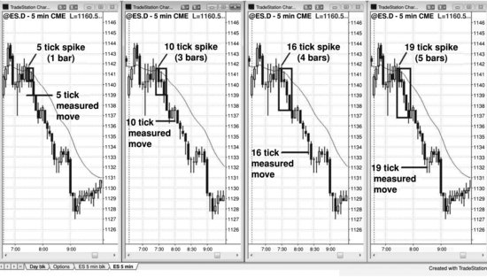
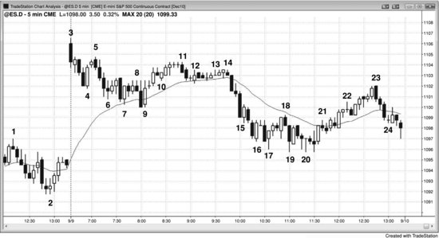
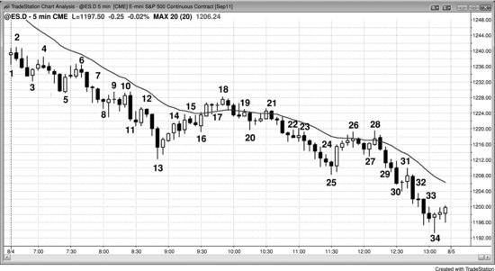

我有一个做了三十多年交易的朋友，据我观察，他在 Emini 上几乎每天都能赚到10个点以上。有一次他跟我说，他认为一般的新手每天至少应该能赚6个点。我不这么看——大多数新手如果能稳定地每天赚2个点，就已经很满意了。聊完之后我意识到，有些交易员成功太久，早已忘了当年亏钱是什么滋味。不过这次谈话也让我意识到，经验积累到一定程度后，好的交易习惯会内化为交易员自身的一部分，做交易几乎变得毫不费力。但不管怎样，数学始终是交易的根基。事实上，**交易完全就是数学**，所有成功的交易员都对概率和交易者方程有极深的理解。每跳动一个 Tick，数学关系就在变化——不理解这一点的人会被市场拒之门外，而理解的人则拥有巨大的优势。

新手总在寻找完美交易：入场形态清晰、胜率高、风险低、回报大。到了收盘时，他们却纳闷为什么一笔都没找到。这样的交易肯定存在吧？不然那些大交易员是怎么发财的？他们没意识到的是，赚钱非常难，因为市场里全是聪明人，每个人都在设法从对手那里赚钱。这种竞争使得没有人能拥有巨大的优势。一旦某个完美的入场形态开始成形，所有人都会去做，它很快就消失了——因为没人愿意站在对手那一边。错过完美入场形态的交易员不想追单，只愿意等回调再进场。而一旦市场没走多远就开始回调，那些以为自己抓到完美机会的交易员就变成了持有亏损仓位的人。他们迅速砍仓，于是"完美的交易"反而朝反方向走了。

想靠交易赚钱，你需要拥有优势——一种基于风险大小、回报大小以及盈利目标先于保护性止损被触及之概率所形成的数学优势。这种优势通常都不大，因此只要三个变量中有一个特别好，另外一两个就会相应变差，以此抵消。比如，如果潜在回报远大于风险（即风险相对较小），那概率通常就低。如果概率高，回报就小，而风险往往还大。传统机构的优势在于：交易量大到足以影响市场方向，同时运行着多套交易系统，由多个交易员独立操盘，从而平滑了资金曲线。他们的目标是每年赚取一个不算大的回报率——通常是10%到20%的利润，风险相对较小，成功概率很高（他们预期超过70%的年份能实现盈利）。高频交易公司的优势在于拥有高度可靠的统计优势，这个优势可能只有5%甚至更低（胜率不到55%，相比纯粹50对50的随机系统仅多出大约5%的优势），但他们每周将这个优势应用数百万次，这就赋予了他们赌场式的优势。如果一家赌场只有一个客户，这个客户一把押了10亿美元，赌场有47%的概率在这一把上倒闭。然而，如果赌注次数极多、每次金额正常，数学就会大大倾向于赌场一方，使其优势产生稳定利润。高频交易公司的道理完全一样。很多高频交易公司每笔交易只赚一两个 Tick，回报极小，单笔交易的风险相对较大，但胜率非常高。大多数高频交易公司每天实现盈利的概率可能在90%以上，也就是说成功概率极高。日内交易员能拥有的优势是出色的看图能力，由此带来的高胜率可以达到70%甚至更高。再配合不低于风险的盈利目标，他们就能获得非常高的资金回报率。全世界最顶级的交易员大多是自主决策型交易员，依靠主观判断做决定。一个超级明星为什么还要留在高盛，跟别人分享自己的收益？他完全可以出去自己开对冲基金或者单干。很少有人会选择留下，这就是为什么全世界最厉害的交易员最终都走向了独立——这也是吸引我们所有人的巨大诱惑。华尔街有无数知名交易员每年靠自主交易赚取数十亿美元的例子。有些人像沃伦·巴菲特那样持仓数月甚至数年，有些人则是日内交易员，比如被称为"Eurex 飞人"的保罗·罗特。日内交易员在风险、回报和概率之间有多种选择，有些人愿意接受较低的胜率（比如40%），以换取三倍甚至更高于风险的回报。

以下是交易员拥有优势的一些例子：

成功概率 70% 或更高（回报至少要达到风险的一半才能盈亏平衡）：

- 剥头皮交易。但大多数交易员无法持续找到胜率 70% 的交易，因此只应在回报至少等于风险时才做剥头皮。比如在 Emini 中，如果你认为需要 2 个点的止损，那就只在 2 个点的利润目标合理时才做这笔交易。

**成功概率 60% 或更高（回报至少要等于风险才能盈亏平衡）：**

- 在多头趋势中，买入回调至均线的高 2 回调。
- 在空头趋势中，卖出回调至均线的低 2 回调。
- 在多头趋势中，买入楔形多头旗形回调。
- 在空头趋势中，卖出楔形空头旗形回调。
- 在多头趋势中，买入多头旗形突破后的突破回调。
- 在空头趋势中，卖出空头旗形突破后的突破回调。
- 在多头趋势的强多头急速段中，买入高 1 回调，但不是在买入高潮之后。
- 在空头趋势的强空头急速段中，卖出低 1 回调，但不是在卖出高潮之后。
- 在交易区间顶部做空，尤其是二次入场点。
- 在交易区间底部做多，尤其是二次入场点。
- 趋势反转：
  - 趋势线被强力突破之后，当价格回测趋势极值时，寻找带有良好反转信号K线的反转机会。交易员要找的是底部的 HL 或 LL 做多，或者顶部的 HH 或 LH 做空。
  - 强最终旗形反转。
  - 在空头楼梯形态中，第三或第四次推低后做多，目标是测试前一次推低的低点。
  - 在多头楼梯形态中，第三或第四次推高后做空，目标是测试前一次推高的高点。
- 用限价单入场；这需要更丰富的看盘经验，因为你的入场方向与当前市场运动方向相反。不过，有经验的交易员可以在以下建仓形态中可靠地使用限价单或市价单：
  - 在强多头突破中，用市价单或在K线收盘时买入多头急速段，或者用限价单在前一根K线低点或更低位置买入（急速段入场需要更宽的止损，而且急速段发生得很快，这种组合对很多交易员来说很难操作）。
  - 在强空头突破中，用市价单或在K线收盘时卖出空头急速段，或者用限价单在前一根K线高点或更高位置卖出（急速段入场需要更宽的止损，而且急速段发生得很快，这种组合对很多交易员来说很难操作）。
  - 在测量移动附近买入空头突破，前提是突破力度不太强——比如在 Emini 中，如果交易区间大约 4 个点高，就在区间下方 4 个点处用限价单买入，止损 4 个点，预期价格会回测突破点。只有经验非常丰富的交易员才应该考虑这种操作。
  - 在测量移动附近卖出多头突破，前提是突破力度不太强——比如在 Emini 中，如果交易区间大约 4 个点高，就在区间上方 4 个点处用限价单卖出，止损 4 个点，预期价格会回测突破点。只有经验非常丰富的交易员才应该考虑这种操作。
  - 在一段强反转之后或交易区间底部，可能形成新的多头趋势时，用限价单在弱信号K线的低 1 或低 2 处或更低位置买入。
  - 在一段强反转之后或交易区间顶部，可能形成新的空头趋势时，用限价单在弱信号K线的高 1 或高 2 处或更高位置做空。
  - 在均线附近安静的多头旗形中，用限价单在前一根K线低点或更低位置买入。
  - 在均线附近安静的空头旗形中，用限价单在前一根K线高点或更高位置做空。
  - 在一根多头K线突破多头旗形上沿后，用限价单在该K线下方买入，预期出现突破回调。
  - 在一根空头K线跌破空头旗形下沿后，用限价单在该K线上方做空，预期出现突破回调。

**成功概率约 50%（回报至少要比风险大 50% 才能盈亏平衡）：**

- 在交易区间里分批建仓时的第一笔入场。
- 在窄交易区间中做多或做空，预期突破后的利润是风险的好几倍。
- 在交易区间中，当趋势可能向下反转时做空 LH，或当趋势可能向上反转时做多 HL。由于入场位置在交易区间中间，概率是 50%，但回报通常是风险的 2 倍。

**成功概率 40% 或更低（回报至少要达到风险的 2 倍）：**

- 在空头趋势底部做多或在多头趋势顶部做空，这种反转交易风险小、潜在回报非常大——比如价格反弹到一个明确的阻力位时做空，用限价单在阻力位下方 1 个 Tick 入场，保护性止损设在阻力位上方 1 到 2 个 Tick。在限价单入场的章节里有不少这样的例子。

**成功概率 40% 到 60%，取决于具体情形（概率只有 40% 时，回报至少要达到风险的 2 倍才能达到盈亏平衡点）：**

- 多头趋势中，市场回落时用限价单买入突破回测；空头趋势中，市场回升时用限价单做空突破回测。
- 新多头趋势或交易区间底部，即使信号K线本身不弱，也可以用限价单在低 1 或低 2 信号K线下方买入（潜在的 HL）；新空头趋势或交易区间顶部，即使信号K线本身不弱，也可以用限价单在高 1 或高 2 信号K线上方做空（潜在的 LH）。举个例子，如果市场可能（60%+）正在多头趋势中完成一个楔形反转顶部，而且已经回调了一根或几根K线，那么在高 1 和高 2 信号K线上方做空，就是在押注一波新的空头波段正在展开。
- 押注磁力位失败，比如在多头趋势中做空测量移动目标位，或在空头趋势中买入测量移动目标位。
- 过度延伸的空头趋势中，当市场到达支撑区域、收出一根异常大的空头趋势K线时，在其收盘价附近买入卖出高潮（高潮在第三本书中讨论）。
- 过度延伸的多头趋势中，当市场到达阻力区域、收出一根异常大的多头趋势K线时，在其收盘价附近做空买入高潮。

新手很快就会发现，做趋势交易似乎是赚钱的好办法。但他们也会很快发现，趋势交易实际上跟其他任何类型的交易一样难。你赚的钱一定是别人亏的钱。市场是一个零和博弈，两边都有无数聪明人在参与。这就决定了交易者方程里的三个变量会始终让优势保持得很小、很难判断。交易员想赚钱，就必须持续比一半以上的对手做得更好。而大多数对手都是盈利的机构，所以交易员必须非常出色。趋势交易中，概率往往比新手期望的要低，风险也更大。交易区间中，风险不算大，但概率和回报也不高。反转交易中，回报可能（60%+）很大，但风险往往也大，而且概率低。剥头皮交易中，概率高，但回报相对风险来说很小。

## 交易者方程

虽然大多数交易员不会从数学角度去想一笔交易，但所有成功的交易员都在使用交易者方程，至少是下意识地在用。电视上的评论员在决定是否做一笔交易时，经常会提到盈亏比。这其实有问题，因为他们忽略了一个同等重要的变量：概率。要做一笔交易，你必须相信交易者方程对你有利：成功概率乘以回报，必须大于失败概率乘以风险。评论员说一笔交易的盈亏比不错，意思就是如果你管理得当，这笔交易有优势，有正的数学期望。他的推荐里隐含着一个前提——这笔交易"可能（60%+）"会成功，也就是说他认为你盈利的概率超过 50%。虽然他们不会这样去分析自己的说法，但如果他们是成功的交易员，就一定是这么想的，因为不考虑这三个变量，不可能（60%+）做到持续盈利。

做任何一笔交易时，回报和风险都是你自己设定的：潜在回报就是到止盈目标的距离，风险就是到止损位的距离。这个方程的难点在于给概率赋值——概率永远无法精确知道。一般来说，拿不准的时候，就假设赢和输各 50%；如果觉得信号看起来不错，就假设赢的概率 60%、输的概率 40%。不用纠结行情能走多远。只需要评估建仓形态看起来好不好，如果好，就假设向上走任意幅度的概率是 60% 或更高，对比向下走同等幅度的概率。这就是等距移动概率（也叫方向性概率），本章后面会详细讨论。如果潜在回报是风险的很多倍，不少交易员也会考虑做成功概率不高的交易。这种情况下，应该假设概率为 40%。如果成功概率远低于 40%，那不管潜在回报有多大，几乎没有交易员会去做这笔交易。

理解这些概率的含义非常重要。不然，新手很容易在市场走出他认为不太可能甚至不可能的走势时感到沮丧。不管你多有信心，市场常常会朝你认为不该走的方向走。如果你有 60% 的信心看涨，那就意味着有 40% 的情况市场会跌，做多就会亏钱。你不该无视这 40%——就好比有人在 30 码外朝你开枪，命中率只有 40%，你不可能不当回事。40% 是非常真实、非常危险的，所以永远要尊重那些跟你看法相反的交易者。

如果你觉得一笔交易的概率只有 50% 就不做，非要等概率到 60% 才出手，那你有一半的机会会错过好交易。这就是交易的常态，也是零和博弈下优势必然很小的结果——市场里有大量非常聪明的参与者，其中一半人的判断跟另一半完全相反。永远不要因为市场的任何表现而懊恼或困惑，接受一切皆有可能就好，哪怕你不理解原因。没人真正理解原因，原因也从来不重要。你赚钱靠的是数学，不是理由。所以，只要一个交易者只在交易者方程明显有利时才出手，就有很大机会稳定赚钱。

想要长期盈利，就必须待在自己的舒适区里。有些交易者喜欢回报是风险好几倍的交易，愿意接受只有 30% 到 40% 的胜率。这种做法交易者方程是正的，但大多数交易的回报其实跟风险差不多大。这意味着这类交易者每天会主动放弃大部分交易机会，因为他们觉得回报不够大，不值得去承受那么低的胜率。还有些交易者只做高概率建仓形态，愿意接受回报和风险差不多大的交易。但很多时候，趋势行情中回调幅度很小，建仓形态的概率往往不到 50%。比如，一个弱空头通道里K线有明显的影线，通道底部出现了一个做空信号。市场看起来更可能形成交易区间，但那些愿意在底部做空、目标是风险 2 到 3 倍利润的空头，会做得很好。而那些只想做高概率交易的人会干坐着，眼看空头走势再走 10 到 20 根K线，一直等高概率的反转建仓形态来做多，或者等回调来做空。这也是一种可以接受的交易方式。有些交易者在各种行情环境下都能适应，根据市场调整自己的风格，这样他们整天都能赚钱——这也是每个交易者的目标。但现实是，大多数优秀交易者都有自己固定的风格，只等符合那种风格的建仓形态。

剥头皮者追求的利润相对于风险来说比较小（他们至少应该争取回报不低于风险），需要高胜率才能让交易者方程为正。不要以为这意味着他们只做旗形交易，因为很多剥头皮者也会做强突破。强突破时，止损理论上要放在急速阶段的另一端，距离可能很远（比如，一个由 4 根多头趋势K线组成的突破，初始止损理论上在第一根K线低点下方，虽然大多数交易者不会冒那么大的风险）。但因为突破很强，等距运动的概率有 60% 或更高。这意味着他们可以做一笔风险大的交易，因为回报同样大，概率也高。为了让每笔交易的风险金额跟其他交易保持一致，他们需要减小仓位。

交易者整天都在做的一个最重要的判断是：在前一根K线的高点或低点附近，多头和空头谁会赢。比如，如果出现了一根强多头趋势K线，在它的高点和收盘价附近，是做空入场的空头和止盈卖出的多头更多（主要用市价单和限价单），还是做多入场的多头和回补空头的人更多（主要用突破单）？同样，在低点附近，是买方力量更大还是卖方力量更大？交易者试图评估的是：承担某笔交易的风险后，赚到足够利润的概率有多大。他们的目标是长期赚钱，也知道自己经常会亏。但要想长期盈利，他们需要做的是那些交易者方程有利（为正）的交易。

任何时刻，买方和卖方都有各自的数学优势，哪怕是在最猛烈的急速行情中也一样。为什么？从逻辑上就能推断出来。市场中绝大部分交易由机构的计算机完成，运行的算法经过长期验证是盈利的。所以即使市场正在自由落体，也有计算机在暴跌途中买入。每一笔做空的单子，不管量多大，都必然有一个买方在另一边接走。当成交量巨大时，买方一定是机构，因为散户的数量根本不足以消化如此庞大的空单。有些买入程序之所以买入，是因为程序员掌握了统计证据：有足够多的大幅突破最终失败并剧烈反转，所以在强空头突破中买入是可以盈利的。另一些程序则是在平掉更高位置建立的空头仓位——它们把快速下跌视为一个可能转瞬即逝的机会，趁市场向上反转之前在好价位锁定利润。高频交易公司也在买入做小幅剥头皮，还有一些公司买入是为了对冲其他市场上的空头头寸。当市场没有处于异常强劲的多头或空头急速行情中时，每一个价位上都有机构买家和卖家在交易——之所以如此，是因为他们的策略在交易者方程的基础上已被证明是数学上合理的。每家公司对每笔交易都有自己的风险、回报、概率和预期持仓时间的组合，很多公司还会分批建仓和平仓。如果没有大量的大型参与者，市场根本无法存在，而且其中大多数必须长期盈利，否则他们会倒闭，市场也不可能维持现在这么大的规模。这意味着他们中的大多数都在执行合乎逻辑、经得起检验的策略，并且在赚钱——即使他们有时在空头趋势中买入、或在多头趋势中做空也一样。散户交易员没有雄厚的资金来运行复杂的策略，但对于有经验的交易员来说，有足够多简单有效的策略可以长期赚到钱。

强势（即机构）多头要想被成交，需要对手方有足够的成交量，而这只能来自强势空头。可以合理地假设，强势空头和强势多头长期都是赚钱的，否则他们不会投入这么多资金，也就不会被视为强势。可能的策略数不胜数，包括对冲、分批建仓和平仓等，不同的强势多头和空头会用一切想得到的办法来赚钱。但即使不借助复杂策略，数学上合理的多空建仓形态同时存在也是很常见的。举个例子，如果一个强多头趋势已经走得太过、可能要回调了，强势多头可以市价买入，扛过回调，等趋势恢复并创出新高后止盈。同一时间，强势空头也可以做空，在市场回落到均线的过程中赚到钱。再举一个例子：当市场处于窄交易区间时，假设 Emini 的波动范围只有 5 个 Tick。向上或向下突破的概率大约各 50%。如果多头在区间中部买入、或空头在区间中部卖出，每一方可能只需要承担 3 个 Tick 的风险，就能在小幅突破中赚到 4 个 Tick 或更多。因为双方的回报都大于风险，成功概率大约 50%，所以双方各自都有一笔数学上合理的交易——即使他们在同一时间入场，即使他们互为对手方。

数学有时会产生误导，如果不真正理解概率分布，仅凭数学结论去下单是很冒险的。举个例子，假设你回测了过去10年里每一个交易日，想看某个特定日期的收盘价是否大概率高于开盘价。结果你发现不久后的某个日期，比如3月21日，在过去10年里有9年收盘高于开盘。你可能会认为有某种市场力量在起作用——也许跟季度末临近有关——才导致这一天经常收阳。但这个结论是错的，因为你没有理解概率分布。把一副扑克牌往空中抛10次，每次记录哪些牌正面朝上，你会发现有些牌在10次里有9次正面朝上，也许红心8就是其中之一。你会因此有90%的把握认为它第11次还会正面朝上吗？还是说你觉得实际概率就是50-50，只不过运气使然，有些牌刚好朝上了8次、9次，另一些只朝上了1次、2次或3次？如果你抛10次硬币，有8次正面朝上，你敢跟别人打赌下一次还是正面吗？还是你觉得那不过是运气？道理很清楚：只要测试足够多的想法、足够多的参数，总会发现有些在10次测试里赢了8次，另一些输了8次。这只是钟形曲线下的结果分布，跟实际概率没有关系。正因如此，很多交易员设计出回测表现优异的系统，实盘却亏钱。他们以为胜率是80%，实际上只有50-50。既然如此，他们就需要远大于风险的利润目标才可能赚钱。但在一个50-50的市场里，利润目标基本上和风险差不多大，所以这样的系统最好的结果也不过是亏掉手续费，赚不到钱。

大多数交易员应该寻找能赚到波段利润的交易机会。当Emini的日均波幅大约在10到15个点时，交易员通常可以用大约2个点的风险去做一笔交易，而波段交易是指利润达到4个点或以上的交易。虽然这类交易的成功概率通常只有40%到50%，但对大多数交易员来说，这是靠交易谋生的最佳途径。一天通常大约有5个建仓形态，交易员可能需要每天至少做3笔交易，才能确保至少抓住一个大赢家。只要保持耐心和纪律，那些没有赚到4个点以上利润的交易大体上可以打平——其中一些会赚1到3个点，另一些会亏1到2个点。但整套方法能够盈利，靠的是那些赚到4个点的交易。如果交易员想在一天里做更多笔交易，就必须接受更小的利润目标，比如2个点，因为一天里很少有5到10笔能赚4个点的机会。不过一天里通常确实有那么多机会，让一个有经验的交易员在承担2个点风险的情况下赚到2个点。这样的话，交易员就需要至少60%的胜率才能盈利。这更难做到，但对于特别擅长解读价格行为的交易员来说，是一个合理的目标。

在实际交易中，大多数成功的交易员都有自己的套路，下单时不需要去想数学问题。比如，如果你每天只找一两笔4个点的波段交易，始终用2个点的止损，而且用这个方法已经盈利了好几年，那你看到一个建仓形态时可能只会凭感觉判断它是否值得做，根本不会去想概率。你从经验中知道，按这些特定的建仓形态、2个点的止损和4个点的利润目标去操作，月底账户余额就会增长，不需要再想别的。一般来说，新手应该把利润目标设得至少跟保护性止损一样大，因为这样只需要大约50%的胜率就能打平。当然，没有人应该抱着长期打平的目标去做交易，但打平是交易员走向盈利途中必经的一个阶段。到了这一步之后，可以尝试提高成功概率——对建仓形态更加挑剔，同时使用更大的利润目标。也许光是这些调整就足以实现持续盈利了。

关于反转信号还有一点需要说明。如果信号不够清晰，就不应该拿它来开仓，但可以用它来对当前持仓做部分或全部止盈。比如，你正持有多头仓位，市场开始尝试反转，但近期的上涨力度还很强，不足以让你考虑反手做空——这时候你应该考虑平掉部分或全部仓位。一个较弱的反转信号是止盈的好理由，但不是逆势开仓的好理由。

做交易时，需要考虑的东西越少，成功的可能性越大，所以掌握一些指导原则可以让交易稍微简单一些。如果你判断某个方向至少有 60% 的概率走出等于或大于风险的幅度，就可以用风险或回报作为起点来制定策略。当你认为一个突破会成功并且有跟随，通常至少要有 60% 的把握——所以只要风险等于或小于预期回报，这就是一个盈利策略。比如，AAPL 出现一段强势的 $2.00 多头急速段，你在顶部买入，合理的止损就设在急速段底部。风险是 $2.00，而急速段往往会引发一个测量移动，所以你可以在高出 $2.00 的地方部分或全部止盈。如果 $2.00 的风险超出了你的承受范围，就减少交易股数。你也可以等 $0.50 的回调再买入，这样风险降到 $1.50，潜在回报增加到 $2.50。

如果 AAPL 突破了一个 $3.00 高度的交易区间顶部，你认为突破会成功，就可以把止损设在交易区间底部（可能低 $4.00），或者设在突破时那段急速K线的底部（可能低 $2.00）。以交易区间高度做测量移动向上推算可能 (60%+) 实现，所以你可以在区间顶部上方 $3.00 处部分或全部止盈。

如果 AAPL 向下突破了一个 $3.00 高度的交易区间，下方大约 $3.00 处有支撑，这也正好是基于区间高度的测量移动目标位，你可以考虑在突破点下方 $3.00 附近买入，搏一个 $3.00 的反弹去回测突破位。如果下跌是一段 $2.00 到 $3.00 的强势空头急速段，而且可能 (60%+) 以空头通道的形式继续跟随，那就不应该用限价单买入，而应该等二次入场点做多，或者等回调后做空。但如果交易区间下方的下跌过程中出现了两到三根强多头趋势K线、大量重叠K线且带影线，并且有两到三段清晰的下跌腿，就可以考虑在下方 $3.00 处用限价单买入、风险 $3.00，因为价格回测到上方 $3.00 突破位的概率可能 (60%+) 有 60%。如果出现了二次入场的买入建仓形态，信号K线只有 $0.30 高，其低点距突破位 $3.00，那你的风险只有 $0.32，而反弹回交易区间底部能赚 $2.70 的概率大约有 60%。

## 方向概率

交易员总想找到能赚钱的交易，但还有另一种概率也能帮助筛选交易，那就是方向概率。在任何时刻，下一个 Tick 都有一个方向概率——它会涨还是跌？一天中的大部分时间，这个概率在 50% 附近，也就是说下一个 Tick 涨和跌的机会相当。这就是等距移动的方向概率，移动幅度为 1 个 Tick。实际上，对于任意幅度的等距上涨与下跌，方向概率在一天中的大部分时间都在 50% 附近。所以，市场先涨 10 个 Tick 和先跌 10 个 Tick 的概率通常都接近 50%。20 个 Tick 或 30 个 Tick 也是如此。幅度大小无所谓，只要相对于你所看的图表不会太大；而且移动幅度相对于最近 5 到 10 根K线的波动范围越小，这个概率就越准确。显然，如果你看的是一只 $10 的股票，算它向下走 $20 的方向概率毫无意义，因为跌 $20 的概率是零。但在图表上合理范围内的波动，每个交易员每笔交易都在用方向概率做判断，只是大多数人从没这样想过。比如交易员在 IBM 回调到日线均线时买入，是因为他们认为先涨 $5.00 再跌 $3.00 的概率更大——也就是说他们相信概率远超 50%，否则不会进场。他们多半认为概率在 60% 以上。如果交易员极度看多，可能会认为 IBM 先涨 $10 再跌 $3.00 的概率有 70%——如果判断正确，这就是一笔非常好的交易。

最后这个观察很重要，而且是对的。假设 IBM 在 5 分钟图上处于强多头趋势中，在均线和多头趋势线位置形成了楔形牛旗回调，先涨 $0.50 再跌 $0.50 的方向概率可能是 60%，但先涨 $1.00 再跌那 $0.50 的概率可能只是略低一点，比如 57%——这就给了交易员很大的优势，也解释了为什么回调入场是一种非常好的策略。

同样的道理，假设一个交易员做 Emini，在一段空头波段中出现最终熊旗之后，价格在一条长期（大约 50 到 200 根K线）多头趋势线附近形成了一个强反转向上的信号，这个交易员可能判断有 60-40 的概率，市场会先涨 4 个点触及他的止盈限价单，而不是先跌 2 个点打到保护性止损。这笔交易做 10 次，其中 6 次赚 4 个点，合计 24 个点；4 次亏 2 个点，合计 8 个点；总利润 16 个点，平均每笔 1.6 个点。对于风险只有 2 个点的日内交易来说，这已经是很不错的结果了。亏损最常见的原因之一，就是下单之前没有认真想过这笔交易的数学基础。

几乎所有交易员都应该只做回报至少等于风险的交易。每次下单之前，想一想"等距移动的方向概率"（也就是回报和风险一样大时，价格朝你预期方向走的概率）是很有用的。问自己：我赚到的钱至少有没有可能跟我可能亏掉的一样多？换句话说，在 Emini 中用 2 个点的保护性止损做多，有没有 60% 以上的概率赚到 2 个点？用 1.00 的保护性止损做空 AAPL，有没有 60% 的概率赚到 1.00？如果答案是肯定的，那这笔交易的交易者方程是正数，属于合理的交易。如果不是，就不要做。虽然风险、回报和概率有很多组合方式都能让交易者方程为正，但用"等距移动的方向概率"来快速评估该不该做一笔交易，是一个很好的简便方法。做交易的时候，行情变化很快，情况也经常不太明朗，所以有一个可靠的逻辑框架帮你在市场留给你的有限时间内做出决定，是非常有用的。只要你能对这个问题回答"是"，就可以入场。你最终可能会想持仓到回报大于风险的程度，但起码一开始的标准应该是回报等于风险。如果你看到任何一个建仓形态，能很快判断它是好的，那你其实就是在认为赚到至少跟风险一样大的利润的概率有 60%，这笔交易的交易者方程为正，是一笔合理的交易。

等距移动的方向概率在 50% 附近徘徊，意味着什么呢？假设 IBM 的股价是 100 美元，你不看图表，也完全不关心基本面和整体市场状况，只是买入 100 股 IBM，然后下一个 OCO（二择一）指令——101 美元挂限价卖出，99 美元挂突破单卖出，哪个先触发就执行哪个——那么你大概有 50% 的概率赚 1 美元，50% 的概率亏 1 美元。反过来，如果你一开始做空这 100 股，同样用 1.00 美元的 OCO 对冲指令（跌 1.00 用限价单买回，涨 1.00 用突破单买回），结果也差不多——50% 概率赚 1 美元，50% 概率亏 1 美元。做多的胜率会略高一点点，因为 IBM 是一家成长中的公司。如果它一年涨大约 8%，换算下来每天大概涨 3.5 美分，这对上涨目标的胜率提升微乎其微，所以基本上还是五五开。

即使等距移动的方向概率只有 50%，你也可以通过分批建仓或分批出场来赚钱（第 31 章会讨论）。如果一个大幅度有利方向移动的概率在 50% 左右，只要这个移动幅度远大于你的风险，你也能赚钱。甚至在等距移动的方向概率低于 50% 的时候，只要你可能赚到的利润足够大，你同样可以赚钱。举个例子，如果你在交易区间顶部附近买入，市场先涨 10 tick 再跌 10 tick 的方向概率可能只有 30%（记住，大多数突破交易区间的尝试都会失败）。假设突破成功后会涨到一个高 60 tick 的吸引点，而你只冒 10 tick 的风险，成功率只有 30%。做 10 次这样的交易，预期 3 次成功各赚 60 tick，合计 180 tick 的利润；7 次失败各亏 10 tick，合计 70 tick 的亏损。净利润 110 tick，平均每笔 11 tick。

对大多数交易员来说，最简单的做法是去寻找方向概率高于50%的等距移动建仓形态，然后把精力集中在捕捉这类稍纵即逝的机会上。为什么说稍纵即逝？因为市场会很快发现这种失衡，价格迅速变动，把市场拉回均衡状态。这种失衡在每一个趋势运行的时刻都存在，在交易区间的顶部或底部也同样存在——这些就是大多数交易员都能看到、并且可以用来盈利的优势所在。举个例子：假设在一轮强空头趋势中，价格回调到均线附近，你做空了一个低点2建仓形态。入场之前，市场正处于一个小交易区间的顶部——每次回调本质上都是一个小交易区间——此时等距移动向下的方向概率大约是60%。假设信号K线高度是6个tick，你在其最低点下方1个tick以突破单入场，保护性止损设在信号K线最高点上方1个tick，总风险就是8个tick。在这次突破过程中，市场先下跌8个tick触及利润目标（假如目标确实设在那里），而不是先上涨8个tick触及保护性止损，这个方向概率可能达到70%甚至更高。也就是说，你有70%的概率赚8个tick，30%的概率亏8个tick。如果做10笔这样的交易，预期盈利56个tick，亏损24个tick，净赚32个tick，平均每笔赚3.2个tick——对剥头皮者来说，这是可以接受的。

这对刚起步的交易员有什么帮助？它提供了一个判断该不该做某笔交易的逻辑基础。首先评估风险。如果AAPL的信号K线高度是48美分，以突破单在其最高点上方1美分入场、保护性止损设在其最低点下方1美分，初始风险就是50美分。如果交易的是Emini，信号K线高度是6个tick，保护性止损距入场价8个tick，那利润目标至少也要设在8个tick之外。新手永远不应该带着"赚的比亏的少"这种预期去入场，所以在那笔AAPL交易中，预期回报至少是50美分（Emini交易则至少是8个tick）。你要寻找的是等距移动——止损和利润目标距入场价相等（都是50美分）。最后，看这个建仓形态。如果你觉得它看起来不错——不管用什么标准来定义"不错"——就应该假设市场先触及止盈限价单、而不是先触及保护性止损的概率至少有60%。只要你读图的能力还过得去，你觉得"这个形态不错"，就说明你认为这笔交易盈利的可能性大于亏损。既然你有足够的信心做出这个判断，概率就不会只有50%。如果只有55%的把握，你多半不会觉得有信心。当你确实感到有信心时，说明你至少认为有60%的确定性。有时候你可能只有58%的把握，有时候可能高达80%，但平均下来至少有60%，所以在评估交易者方程时可以用60%来计算。既然概率至少60%，潜在回报又至少跟风险一样大，交易者方程就是正值，可以做这笔交易。你知道最多有40%的交易会亏50美分（实际上有些交易会通过跟踪止损提前出场，亏损不到50美分），但平均利润会大于零。正因为用的是60%而不是50%，即便把滑点和手续费算进去，整体仍然可能是盈利的。

交易区间的特征是不确定性——多头和空头都在积极交易，因为双方都认为自己的入场价位有价值——但当市场测试区间极端位置时，等距移动的方向性概率可以短暂地远高于50%。举个例子，假设IBM的5分钟图上有一个1美元高度的交易区间，上沿和下沿已经被反复测试，轮廓非常清晰。这时如果你在区间底部一根小型多头反转K线上方买入，向上移动50美分先于向下移动50美分的方向性概率可能（60%+）达到60%甚至更高；入场后如果出现一波急涨，概率甚至可能短暂升到70%。随着反弹走向区间中部，方向性概率会很快回到50%，但这个"中部"到底在哪里，事先无法精确知道。市场通常（60%+）得过冲这个位置，交易员才能判断出它明显走过头了。市场要花很长时间去逼近那个50%的价格，但一旦一波波段走过头，反应却很快。这个价格会落在某个阻力区域，成为交易区间的顶部。一旦交易员判定方向性概率明显偏向空头，市场就可能（60%+）处在交易区间的顶部了。当IBM接近区间顶部时，再向上走50美分先于回调50美分的概率可能降到40%，也就是说向下走50美分反而更可能（60%+）先发生（向上的概率是40%，那向下的概率就是60%）。接着IBM就会开始下跌，而且往往会过冲中性区域，到了明显走过头的程度后再反弹，如此上下摆动，寻找不确定性和方向中性的概率平衡点。这种上下波动会一直持续，直到多头和空头对某个价值区域达成共识。到那时波动幅度变小，形成窄交易区间或三角形的尖端，而这个位置最终会落在交易区间的中间。一旦多空一方意识到当前价值对自己不利，市场就会突破，再次进入趋势，直到找到新的价值区域。

当交易区间非常窄——比如IBM只有20美分的幅度——即使方向性概率短暂跳到70%，你可能赚的只有10美分、风险也是10美分，这种情况下滑点和手续费就变得很关键了。这是一笔糟糕的剥头皮交易。如果滑点加手续费是4美分，那你10美分的收益实际只剩6美分。即使胜率是60%，做10笔这样的交易，你只能赚36美分却要亏40美分。由于你永远无法确切知道真实概率，而且高概率只会维持很短时间，持续做这种交易最终一定会亏钱。只有高频交易公司才能在这种环境下持续赚钱，因为它们的基础设施能够快速下单，而且目标只是赚1个tick的利润。

窄交易区间有时也能提供很好的波段交易机会，前提是数学上说得通：突破后可能（60%+）引发一波大幅运动。窄交易区间属于突破模式，突破后的运动幅度通常（60%+）是区间高度的好几倍。既然向上或向下突破的概率大约各50%（取决于具体情况），那如果你在区间底部附近几个tick的位置买入，止损大约5个tick；或者在区间顶部附近几个tick的位置做空，止损大约5个tick呢？如果你持有等待突破，止盈目标设在15到20个tick，那就是冒5个tick的风险去赚20个tick，成功率50%。从理论上看这是一笔很好的交易：做10次，5次赚20个tick，5次亏5个tick，净利润75个tick，平均每笔7.5个tick。但大多数交易员承受不了这种心理压力——持有一笔50%胜率的交易很长时间，眼看着市场反复朝自己方向走，结果又掉头打回来。

如果你看交易区间的市场概况图（Market Profile），会发现市场在区间顶部和底部停留的时间非常短——而高概率恰恰出现在那些位置。这意味着你必须长时间高度专注地盯盘，等市场测试区间上下沿时迅速出手，实际做起来远比说起来难得多。当市场测试区间顶部时，通常（60%+）会伴随一根或几根强多头趋势K线，它们的动能强到足以让你考虑突破成功的可能性。而且反转下跌的信号K线往往很大，导致你的入场价已经接近区间中部——那里的方向性概率已经接近50%了。

当市场测试交易区间的顶部或底部、出现突破迹象时，反转的概率可能达到 60% 甚至更高。然而一旦突破真的发生，在接下来几根K线内，价格向上或向下运动 X 个 tick 的方向性概率会迅速变化。如果突破K线不算太大，而且在趋势通道线和其他阻力区域附近出现停滞，那么突破失败并反转的方向性概率可能短暂升至 65%。如果下一根K线是一根强反转K线，这个概率还可能变成 70%。这意味着交易员拥有优势，但优势总是稍纵即逝，而且幅度通常不大。一旦交易员们认定近期方向有 60% 或更高的确定性，大家就会蜂拥入场，市场迅速回到不确定区域，优势随之消失。当你认为优势存在时，机会就在眼前，必须赶紧入场，否则机会转瞬即逝。

但如果突破K线看起来很强，反转的概率可能降到 50%；如果接下来几根K线出现强劲的跟随，反转的方向性概率可能降至 30%——换言之，价格沿急速方向继续运动 X 个 tick 的概率为 70%，远高于朝反方向运动的概率。举个例子：假设 AAPL 出现三根K线的向上急速，正在突破一个牛旗，急速目前的高度为 2 美元，那么 AAPL 在回落 2 美元（跌至急速底部）之前再涨 2 美元的概率为 70%。如果急速扩大到 4 美元，那么在触及急速底部之前再涨 4 美元的概率仍然至少为 60%。在急速只有 2 美元时入场的交易员，此时已经有 2 美元的浮盈，止损距离为 2 美元（到急速底部），并且有 60% 的概率再赚 4 美元。这就是为什么一旦你确信方向性概率对你有利——换句话说，一旦 Always-in 的方向明确——并且你相信价格还会朝你的方向持续几根K线，就必须尽快入场。

这是交易员赚钱最重要的方式之一。在实盘中做这种决策压力很大——你看着图表上过去五次突破尝试全都失败了，而现在又来了一次看起来可能成功的突破。而且你可能已经被之前的失败麻痹了，什么都不做的惯性让你很难迅速切换到需要果断出手的状态。但如果你能训练自己做到这一点，就有机会抓住最赚钱的那类交易。记住，优势转瞬即逝，所有人都看得见，市场会迅速将优势抹平，所以你必须够快。如果你觉得做这种交易很难，就把仓位缩到很小。比如你平时习惯交易 500 股 SPY、承受 20 美分的风险，但这次突破急速要求你承受 40 美分的风险，那就只买 100 股，用市价单入场，然后设 40 美分的保护性止损。这就像从很高的跳水台跳下去一样：最初几秒钟你吓得要命，全身肌肉绷紧，紧闭双眼，屏住呼吸，捏住鼻子。但几秒钟之后就结束了，你发现自己安全了。做这种情绪化的突破交易感觉也是类似的，但你必须学会跳下去，相信很快一切都会好起来，你能把止损收紧。几根K线之后，你可能已经有 40 美分的浮盈和一个盈亏平衡点的止损，而这笔交易可能是你当天最好的一笔。

怎么才能相信强急速中等距移动的方向性概率确实有 60% 以上？回到刚才 AAPL 多头突破的例子。一旦 AAPL 在一个非常强的买入信号之后出现 2 美元的强多头急速，机构就在急速形成的过程中不断买入。你可以看到K线形成过程中回调很小。如果K线收在最高点，市场开始形成又一根多头趋势K线、接着又一根，说明买方机构的力量远强于卖方，市场大概率（60%+）会有更多跟随。如果那个最初 2 美元的多头急速足够强，让你判断 Always-in 的方向现在是做多，那你就应该认定等距移动的方向性概率至少为 60%。原因在于：机构认为初始止损在急速下方，而大多数急速至少会延续一个测量移动的距离。如果急速高度是 2 美元，机构冒 2 美元的风险去赚 2 美元，假如胜率只有五五开，他们根本不可能靠这样的交易盈利。除非有一定的容错空间，否则他们几乎不会做这笔交易——这就意味着他们赚 2 美元而不是亏 2 美元的概率至少为 60%。换个角度想：如果你觉得概率不到 60%，你会做这笔交易吗？大概率不会。你应该认为机构也是同样的想法。

趋势初期入场有一个很大的好处：一旦趋势朝你的方向运行，这笔交易的数学优势会大幅改善。假设急速阶段涨了 3 美元，你的风险仍然是 2 美元，但在急速底部被测试之前，出现测量移动的概率仍然至少有 60%。如果急速继续涨到 4 美元，AAPL 在跌破急速底部之前再涨 4 美元的概率仍然至少 60%。这时候你已经有 2 美元的浮盈，风险还是只有 2 美元，而市场再涨 4 美元的概率至少 60%。也就是说，你有 60% 的概率总共赚 6 美元，只拿 2 美元去冒险。到了这个阶段，你可能已经分批止盈了一部分仓位，也可能已经把保护性止损移到了盈亏平衡点。这就是为什么趋势初期入场如此重要——哪怕这意味着你必须在急速阶段就入场，而不是等回调。机构就是这么做的，你也应该这样。

虽然每天、每个市场、每个时间周期的数学都不一样，而且不可能提前精确知道，但大多数图表上大多数交易的胜率都在 40% 到 60% 之间。这里的"大多数"本身也很模糊，大概指 90% 的情况。这话听起来有点绕，但对你的交易成败至关重要。不管什么时候、什么理由买入或卖出，你有 90% 的把握可以认定：赚到一定点数的概率和亏掉相同点数的概率基本相当。但真正关键的是剩下那 10% 的时间——如果你有把握判断市场不在那个 40% 到 60% 的区间内，你就有了优势。比如，AAPL 在 5 分钟图上出现强劲的急速下跌，做空赚 1 美元的概率可能达到 70% 甚至更高，远大于先亏 1 美元的概率。你对价格行为的理解越深，就越能捕捉到这种短暂的不平衡。这样的机会每天都有，每张图表上都有，每个时间周期里都有，关键是学会识别它们，然后耐心等待。一旦你熟练掌握了这个能力，你就具备了靠交易赚到钱的条件。

方向性概率不可能长时间远离 50%，因为交易的另一方一定有机构存在，他们会很快发现自己的交易者方程变成了负值，然后调整仓位。强急速阶段的方向性确定性很高。比如，AAPL 在 5 分钟图上出现一个 3 美元的强三K线多头急速，市场在跌回 3 美元之前再涨 3 美元的概率可能有 60% 甚至更高。一旦急速结束、通道开始，随着市场逼近测量移动目标或其他发挥磁吸效应的阻力位，概率会逐步衰减。在朝目标运行的途中，方向性概率降到大约 50%，但到达目标之后，方向性概率会越过 50% 这个中点，实际上开始偏向下跌。为什么？因为市场通常要走过头，交易员才会意识到已经超过了中性位置。市场擅长判断"走过头了"，但不擅长判断"走够了"。当市场还处在一个正在形成的交易区间中部时，交易员并不确定这里就是中部；直到明显到达了顶部，他们才会确信。通道顶部就是下跌的起点，也是正在形成的交易区间的顶部。每当市场处于交易区间顶部，等距移动的方向性概率都偏向下跌，因为大多数突破尝试都会失败并反转回到区间内。所以下跌的概率大约有 60%。一旦市场跌回正在形成的交易区间中部，等距移动的方向性概率又回到大约 50%。如果之前的上升趋势非常强，当市场处于区间中部时，概率可能略微偏向上涨；如果市场继续下滑到通道底部，上涨的概率还会进一步增大，因为市场此时处于交易区间底部，向下突破不太可能成功。

市场经常在区间中部上下震荡，试图找到中性和不确定性的平衡点。这个位置是多头和空头都觉得有价值、愿意建立新仓位的地方。但到了某个时刻，一方会认为这个价位不再有价值，愿意在这个价位朝那个方向建仓的交易员会大幅减少。市场于是开始趋势运行，直到找到一个多头和空头都认为有价值的新价位——那就是下一个交易区间。

市场最初触及通道顶部时，假设通道顶部到底部的距离是 3 美元，那么市场先跌 3 美元回到通道底部、再继续涨 3 美元的概率大约是 60%。这里你可以换任意数字——2 美元或 1 美元都行，只要在屏幕图表的范围之内就没问题。市场先跌 1 美元再涨 1 美元的概率大约是 60%，反过来也一样。通道底部是一个磁力位，通常都会被测试，而它在下方 3 美元处。回调测试通道底部时的动能通常远弱于之前急速阶段，所以测试完通道底部后，向上运动的方向概率会低于急速阶段，可能跟多头通道阶段差不多。如果回调斜率较缓，回调底部（也就是正在形成的交易区间底部）等距运动的方向概率偏向多头，可能有 60%。你永远无法确切知道具体数字，但下跌这一腿本身也是某种趋势——就像之前上升通道是弱趋势一样——只要趋势存在，延续的方向概率就高于 50%，直到走得太远为止。一旦回调到达支撑位，方向概率就重新回到大约 60%，转而有利于反方向的向上运动。如果支撑看起来较弱，概率会低一些，但仍高于 50%，有利于向上反弹。比如，AAPL 可能有 56% 的概率先涨 1 美元再跌 1 美元。

不管怎样，当概率接近 50% 时，回报必须大于风险才值得交易。如果风险和回报一样大，理论上在完美执行且不算手续费的前提下，这笔交易只是打平。但谁也做不到完美执行，也不可能忽略手续费，所以这套系统一定亏钱。举个例子：利润目标是 1 美元，止损放到 2 美元，而市场涨 1 美元和跌 1 美元的概率都是 50%，你还是会亏。为什么？假设做了 4 次交易，其中 2 次，1 美元止盈的限价单会成交。但另外 2 次，市场会先跌 1 美元，没有触及 1 美元的止盈目标。这时已经跌了 1 美元，市场先涨 1 美元再跌 1 美元的概率仍然是 50%。也就是说，4 次交易中有 1 次亏 2 美元，2 次赚 1 美元。剩下那 1 次是市场跌了大约 1 美元后又涨回盈亏平衡点。到了那个位置，整个过程重新开始：有 50% 的概率赚 1 美元，25% 的概率亏 2 美元。这个迭代可以无限重复，结论都一样——赚 1 美元的可能性是亏 2 美元的 2 倍。这意味着预期净利润为零。再扣掉手续费和人为失误的成本，就是一个必然亏损的方法。换更大的止损重复计算，结果还是一样。

测量移动目标为什么往往能精确到位？因为它是机构获得正的交易者方程所需的最低幅度，达不到这个幅度它们根本不会进场。既然机构是盈利的，那么它们所有交易组成的篮子一定具有正的交易者方程，这意味着每投入的平均一美元，最小运动幅度至少要达到一个测量移动的距离。要么概率远高于 60%，但这不太可能。结果就是，很多交易精确打到目标位，因为许多机构会在那里止盈——它们知道这是让整篮子交易保持盈利所需的最低要求。大多数目标位之所以起作用，恰恰因为它们是最低要求；而当市场很强时，机构会持仓远超目标位才止盈。

关于交易的数学，还有最后一点要说。这个观点借自数学家查尔斯·路特维奇·道奇森（Charles Lutwidge Dodgson）——生活中很多事情并非表面所见。道奇森本人就是如此，他更广为人知的名字是刘易斯·卡罗尔（Lewis Carroll）。我们所处的市场就像"爱丽丝梦游仙境"一样，什么都不是表面看到的样子。涨不一定是真涨，跌不一定是真跌。看看大多数交易区间的强势突破就知道了——它们通常都会失败，向上突破其实是下跌的开始，向下突破也不过是上涨的一部分。还有，60%的概率也只在90%的时间里才是60%，有时候可能是90%，有时候又可能只有10%。一个好的建仓形态成功率是60%，怎么才能把胜率提高到80%甚至更高？打个比方，强趋势回调中、价格刚好在支撑上方，一个建仓形态可能有60%的成功率；但如果你用更宽的止损，或者在价格继续走低时加仓——尤其是后续仓位更大——你可能会发现，在这些60%成功率的建仓形态中，你能赢到80%甚至更多。既然80%的趋势反转尝试都会失败、最终只是变成回调，那这些回调就往往有80%的概率可以顺着趋势方向做出盈利交易。再比如，如果你用非常宽的止损，愿意扛几个小时的大幅回撤，那在 Emini 上原本60%概率赚2个点（同时面对亏2个点的风险），就可能变成90%概率赚4个点（同时面对亏8个点的风险）。如果你足够灵活，能适应不断变化的概率以及多种概率同时存在的局面，成功的可能性就会大得多。

**图 25.1** 急速段越长，利润目标也越大

急速段幅度越大，潜在利润也越大。虽然有些交易员用急速段第一根K线的高点到最后一根K线的低点来衡量急速段，但更可靠的做法通常是只看K线实体，不看影线。如果以第一根K线开盘价到最后一根K线收盘价为基础的测量移动目标被超越了，交易员就应该关注以第一根K线高点到最后一根K线低点为基础的测量移动目标，看市场在那里会怎样反应。

在图 25.1 左侧的图表中，急速段只有一根空头趋势K线，实体高度为5个 tick，向下的目标就是该K线收盘价下方5个 tick。右侧的图表中，急速段已经发展到4根K线，第一根K线的开盘价比最后一根K线的收盘价高出19个 tick，目标就变成最后一根K线收盘价下方19个 tick。如果你在急速段刚形成时就早早做空了，虽然止损一直放在急速段第一根K线高点上方1个 tick 处、风险始终不变，但随着测量移动目标不断下移，潜在回报却在持续增加。当市场走出一到两根大的空头趋势K线后，你可以把止损移到盈亏平衡点，甚至移到其中某根K线高点上方。这样就能锁定至少一小笔利润，同时仍然处于一个有利的位置去赚取大利润。

**图 25.2** 寻找短暂的高概率时刻

虽然等距上下波动的方向性概率通常在50%左右，但一天之中会有很多短暂时刻概率偏高，交易员应该抓住这些机会入场。如图 25.2 所示，在K线15之前那三根强空头急速段中的任何时刻做空，市场继续下跌 X 个点（而不是先反弹 X 个点）的概率大约有70%。不太明显的是K线20处的底部。当天是趋势性交易区间日，K线9的低点到K线11的高点构成的上方区间大约4个点。由于下方区间通常会回测K线9的突破点，而且下方区间的高度很可能跟上方交易区间差不多，所以在K线9下方4个点或更低处买入，大约有60%的概率先涨4个点再跌到4个点止损处。在K线15、16、17以及K线19后面那根K线和K线20反复出现多头反转K线之后，概率可能已经上升到70%。空头反复尝试把价格推到前一日收盘价下方，但屡屡失败。每一次失败的尝试都代表买压的积累，而且这种买压是叠加的。一旦达到临界点，多头就会接管。经历了最初三四次探底尝试之后，你就可以在K线9下方4个点处挂限价单买入，风险设4个点，同时用 OCO 限价单在高出4个点处止盈。

在K线14下方做空，只有大约50%的概率做成一笔好的波段交易，因为当时处于窄交易区间中，向任何方向做波段的概率都只有大约50%。这个建仓形态是一个小楔形熊旗，也是K线11处两K线空头急速之后的一个LH。当天早盘出现了强烈的抛压，所以向下突破的概率可能略高于50%。风险不到2个点，回报是某种测量移动下跌的幅度，比如基于K线3到K线9走势的腿1 = 腿2移动，或者K线5到K线9交易区间的高度。不管哪种情况，交易员都有大约50%的概率赚到约4个点，同时只承担约2个点的风险，这构成了一个可靠的交易者方程。一旦市场以强空头急速向下突破到K线15，交易员就会持有部分仓位，目标是基于K线14到K线15空头急速高度的测量移动下跌。

这是一个趋势性交易区间日，也是一个很好的例子，说明关注当天正在展开的日型有多重要。上半天的交易区间大约是平均日内振幅的一半。当第一个小时或前两个小时之后发生突破时，市场通常会走出大约一个测量移动的距离然后反弹，开始形成一个较低的交易区间。理解这一点的交易员在K线16到K线20之间买入时会更有信心，很多人在最近的波段低点处或其下方用限价单买入。那个区域之所以出现那么多带下影线的K线，原因就在这里。比如K线19反弹之后，激进的交易员会在K线19低点处、略低于低点、或略高于低点的位置挂限价单或下市价单买入。他们在K线20处做多，持有仓位等待市场测试上方交易区间底部——也就是K线9的低点。很多人会设保护性止损，止损距离大约等于最近几根K线平均振幅的tick数。

一旦市场从K线16开始到K线18之前那根K线形成了强多头趋势K线，买压就足够强，交易员有理由预期市场会测试K线9下方的突破点。他们把最近价格与K线9低点之间的空间看作缺口，并预期缺口会被填补。K线18距离K线9低点只差3个tick，但交易员通常预期测试要到2个tick以内才算到位。考虑到当天市场已经有了这么强的买压，大多数交易员相信市场会交易到K线9低点上方。有些人根据K线9低点到K线11高点这段交易区间的高度（大约4个点），在K线9低点下方约一个测量移动的位置挂限价单买入。另一些人开始在前一根K线低点下方或之前低点下方买入，比如市场跌破K线19低点时。这些交易员可能用等于回报的风险，预期大约60%的成功概率。

如果空头突破非常强，交易员会做相反的操作。他们会在空头急速底部附近**做空**，止损设在急速上方，相信有大约60%的概率达到与风险相等的回报。比如有些人在K线15收盘价附近做空，预期大约60%的概率赚到与风险相等的tick数（从K线14高点上方1个tick到入场价的距离，大约4个点）。一旦市场在他们止盈限价单上方几个tick处开始出现买压，他们就不再认为自己的交易前提成立了。尽管收紧了保护性止损，但面对这些买压，他们不愿意冒2到3个点的风险去赚剩下那1个点，于是开始回补空头仓位，反而加大了买压。这些空头刚刚退出了一笔结果比预期更弱的空头交易，短时间内不会愿意再次做空。只有在更高的价位——比如K线9低点附近——且出现合理的做空建仓形态时，他们才会考虑做空。但那时市场处于窄多头通道中，可能（60%+）继续上涨，没有足够多的空头在那里做空来扭转市场方向，这就导致了一直到K线23的窄多头通道——市场被真空效应吸引上去测试K线12的低点。

剥头皮者的回报通常跟风险差不多大，所以要让交易者方程为正，就需要高概率交易。但在某些趋势中，多头通道顶部会连续出现弱的做多建仓形态（或空头通道底部连续出现弱的做空建仓形态），成功概率很低。不少波段交易者仍然会接这些单，而且经常能赚到好几倍于风险的利润，但大多数剥头皮者往往会错过持续 10 根K线甚至更久、覆盖很多点数的趋势。比如，剥头皮者可能不会在 K线 21 后面那根空头十字星上方做多，也不会在 K线 22 后面那根空头反转K线上方做多，结果就错过了涨到 K线 23 的这波行情。对刚入门的交易者来说，眼睁睁看着趋势一直涨却找不到高概率的回调机会，确实很让人抓狂，但从数学角度看这个决定是合理的。随着经验增长，他会发现其实也有一些高概率的建仓形态可以参与，比如在 K线 21 和 K线 22 之间那两根多头趋势K线的收盘价买入，或者在 K线 22 的低点买入——因为这个回调是强劲多头微型通道中的第一次回调。每个月总有那么几天，多头通道顶部的低概率做多建仓形态、或空头通道底部的弱做空建仓形态，最终引发一波大趋势，波段交易者赚到的利润大到足以抵消他们在其他类似交易中的大部分亏损。他们也会做很多别的交易，其中一些成功概率很高。

剥头皮者能不能在止损比目标更大的情况下盈利？能，但这需要仓位管理，大多数交易者不该尝试。比如，利润目标设 1 个点、止损设 2 个点，如果市场很快就打到了止盈限价单，中间没有任何回调，那实际上只冒了几个 tick 的风险却赚了 4 个 tick。假如市场先回调了 7 个 tick 才朝他的方向走，实际承担的风险就变成了 8 个 tick，这时候就需要把利润目标至少提高到 8 个 tick，才能让交易者方程为正——因为概率大概仍在 60% 左右。

**图 25.3** 当建仓形态概率不高时，剥头皮者经常错过趋势

剥头皮者的回报通常跟风险差不多，所以建仓形态至少需要 60% 的成功概率。在某些趋势日里，很多建仓形态看起来不够可靠，剥头皮者就容易错过持续 10 根K线以上、覆盖很多点数的趋势。波段交易者则不同，当回报远大于风险时，哪怕成功率只有 40% 甚至更低，他们也能安心做。

从 K线 18 开始的这波下跌中，很多建仓形态在不少剥头皮者看来可能都没有 60% 的成功率，他们就会错过这波巨大空头趋势的大部分行情。很多人在 K线 18 到 K线 25 之间的两个小时里会选择少做甚至不做。波段交易者可以在 K线 18 均线缺口K线下方做空，或在 K线 21 的两K线反转和 LH 下方做空，或在 K线 28 双顶 LH 和熊旗下方做空，赚到的点数足以弥补他们相对较低的成功概率。他们还可以在 K线 31 下方加仓，尽管它的实体是阳线，而且是楔形做多的入场K线（K线 13、K线 25 和 K线 31 前面的小十字星构成三连推下跌）。它是空头趋势中一个 6 根K线的空头微型通道里的第一次回调，顶部有明显的影线，增加了市场继续下跌的可能性。波段成功的概率依然相对较低，但潜在回报非常大，因为市场可能正在跌破一个楔形底部，有望走出大约一个测量移动的跌幅——事实上确实如此。

大多数剥头皮者不会在 K线 18 下方做空，因为它有阳线实体，而且处在窄多头通道中。虽然紧接着的一根K线有阴线实体，形成了两K线反转，但它有很长的影线，降低了信号的可靠性——尤其是在窄多头通道中一波强劲上涨之后。

虽然 K线 21 是一个 LH，但当时市场刚经历了 K线 13 那波强劲的卖出高潮，大多数交易者都在等第二腿上涨，所以很多剥头皮者不愿意在三角形（K线 16 和 K线 20 是前两次下推，K线 21 后面的十字星可能成为第三次）或交易区间的底部做空——这种位置做空的概率本来就比较低。

K线 22 是一个突破回调做空机会，但它跟在一根小十字星后面，而那根十字星可能是第二腿上涨的起点，所以很多剥头皮者不愿意在可能很快变成第二腿上涨底部的位置做空。

从 K线 23 到 K线 25 的所有空头K线都有明显的影线，说明有人在K线低点附近买入，通道走得很弱。剥头皮者不喜欢在弱空头通道的底部做空。

从可能的 K线 25 LL 和抛物线通道底部（K线 13 前面三根K线空头急速下跌之后，还有 K线 20 和 K线 21 后两根K线处的较小急速）到 K线 26 的上涨中，出现了 4 根阳线实体，包括一根大的多头趋势K线。力度强到足以让很多交易者认为市场已经翻转为 Always-in 多头，倾向于找做多的建仓形态而非做空。K线 27 是一根强多头反转K线，同时也是两段式的 HL。走势偏向继续横盘或上涨。K线 28 有阳线实体，不算强的做空信号K线。下一根K线有阴线实体，构成了两K线反转，但它的低点离 K线 28 的低点太远，剥头皮者不愿意做空，因为太容易跟 K线 27 的低点形成双底。

等到市场强势突破跌到 K线 29 时，剥头皮者可能会在 K线 29 收盘做空，或者在下一根K线收盘做空——那根K线确认了 Always-in 翻转为空头。

K线 31 是一个突破回调，但有阳线实体和明显的影线，让剥头皮者怀疑市场可能正在进入一个小的交易区间。这种概率高到足以让很多人不愿在它的低点下方做空，但也有人会做。他们也可能在价格涨过那根十字星上方后做空，或者看到顶部出现很长的影线（代表抛压）后在收盘做空。尽管 K线 18 高点之后的做空建仓形态对剥头皮者来说都很棘手，但仍然有足够多的高概率机会让他们赚钱。他们可以在 K线 2、4、6、12 下方做空，也许还有 K线 21（有些人不会做这笔空），也可以在 K线 6 后一根、K线 12 后一根、K线 29、K线 30、K线 31 及其后一根的收盘做空，还可以在 K线 1 上方、K线 17 上方、K线 20 后一根上方、K线 22 前一根上方、K线 30 后一根上方用限价单做空。做多方面，他们可以在 K线 3 上方、K线 5 上方、K线 13 后一根上方、K线 25 后一根的收盘或再后一根上方、以及 K线 27 上方买入。
