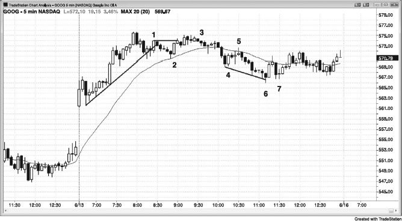
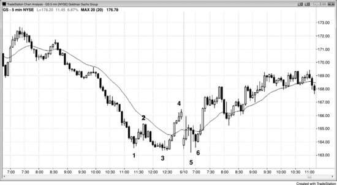
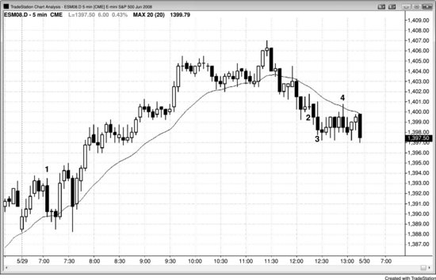
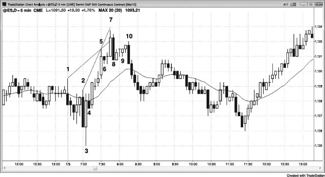
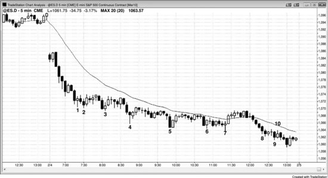

有些基本规则能让交易变得更简单——条件一满足，就可以毫不犹豫地下单。其中最重要的一条是：做一笔交易至少要有两个理由，任意两个就够了。一旦凑齐，直接挂单入场，进场后按基本的利润目标和保护性止损规则执行，相信一天下来是能赚到钱的。有一点要特别注意：如果当前是陡峭的趋势，绝不要逆势交易，哪怕出现了高/低 2 或高/低 4 的建仓形态也不行——除非之前已经出现过一次明显的趋势线突破，或者趋势通道线过冲后发生了反转。而且趋势线突破最好是带有强劲动能的，而不只是横盘漂移过去。要记住，K线计数建仓形态不是趋势反转形态。比如，高 2 是多头趋势中或交易区间底部的入场机会，不适用于空头趋势。如果当前是陡峭的空头趋势，就不应该去找高 2、高 3 或高 4 的做多建仓形态。

要学会提前预判交易机会，这样信号出现时才能及时挂单。比如：价格跌破一个主要波段低点之后又走出两段下跌，或者过冲了趋势通道线，就可以准备找向上的反转；如果一个过度延伸的腿中出现了 ii 形态，就留意反转的可能。一旦出现外包K线或铁丝网形态，就在极端位置找小K线，看看有没有押注失败的交易机会。如果是强趋势，就要准备好做第一次均线回调、任何到均线的两段式回调，以及第一次均线缺口回调。

只有少数几种情况，一个理由就可以入场。第一，只要处于强趋势中，每一次回调都必须入场，除非之前刚出现过高潮或最终旗形反转——哪怕回调只是强多头急速中的高 1，或强空头急速中的低 1。第二，如果趋势线过冲后出现了一根好的反转K线，可以逆势入场，预期趋势恢复。第三，不管是在交易区间还是趋势中，只要出现二次入场点，一个理由就够了。道理很简单：既然有了第一次入场，二次入场点本身就是第二个理由。

以下是一些入场理由（记住，至少需要两个）：

- 好的信号K线形态，比如好的反转K线、两K线反转或 ii。
- 趋势中的均线回调，尤其是两段式回调（多头趋势中的高 2 或空头趋势中的低 2）。
- 突破回调。
- 明确的 Always-in 市场（强趋势）中的回调。
- 对任何类型支撑或阻力的测试，尤其是趋势线、趋势通道线、突破回测，以及测量移动目标位。
- 对冲线。
- 多头趋势中或交易区间底部的高 2 做多建仓形态（每个双底都是高 2 做多建仓形态）。
- 空头趋势中或交易区间顶部的低 2 做空建仓形态（每个双顶都是低 2 做空建仓形态）。
- 大多数多头反转（底部）来自微型双底、双底或最终熊旗反转。
- 大多数空头反转（顶部）来自微型双顶、双顶或最终牛旗反转。
- 多头趋势中横盘至下跌的高 3 回调，即楔形牛旗。
- 空头趋势中横盘至上涨的低 3 回调，即楔形熊旗。
- 高 4 牛旗。
- 低 4 熊旗。
- 交易区间顶部出现弱的高 1 或高 2 信号K线，正好是找做空机会的时候。
- 交易区间底部出现弱的低 1 或低 2 信号K线，正好是找做多机会的时候。
- 任何东西的失败（市场在预期到达的位置之前就反转了）：
  - 突破前高或前低后失败。
  - 旗形突破失败（最终旗形在第三本书中讨论）。
  - 趋势线或趋势通道线过冲后反转。
  - 未到达利润目标就反转了，比如 Emini 剥头皮交易中价格在 5 tick 或 9 tick 处就反转了。

**图 26.1** 做交易至少要有两个理由

如图 26.1 所示，K线 2 是强多头趋势中到均线的两段式回调（每个双底都是高 2 做多建仓形态），仅凭这一点就足以做多。还有一个理由：这是始于开盘的趋势（大缺口高开）中超过 20 根K线以来第一次触碰均线。同时也是第一次有效的趋势线突破，因此可以预期价格会回测前高。

K线 3 出现在第二次尝试突破K线 1 高点失败之后。这里有一个 ii 建仓形态，其中第二根K线收阴。它也是一个正在形成的交易区间中的低 2，向上到K线 1 的运动是第一段上涨。

K线 5 是空头波段中均线处的低 2，之前出现了一个强劲的三K线空头急速。这样的强急速之后，市场可能 (60%+) 会形成一个空头通道。

K线6是空头趋势通道线过冲后的反转，同时也是对第一个小时窄交易区间（三角形态）的突破回测。不过，它处于一个持续了三小时的空头通道底部，而通道往往能走很远，途中还会有很多回调。几乎所有情况下，做逆势交易前最好等通道出现突破回调再入场。二次入场机会出现在K线7的HL处，那是价格向上突破从K线5引出的下降趋势线（图中未画出）之后的回调。

虽然K线6是一根反转K线，但收盘价仅略高于中点，作为信号K线来说偏弱。

**图 26.2** 扩展三角形

如图26.2所示，前一天收盘阶段市场急速拉升到K线4，完成了一个正在发展的扩展三角形的四条腿，还需要再创一个新低才能走完。如果你意识到这种可能性，就会在价格跌破K线3之后寻找做多的入场机会。K线5跌破了K线3，完成了扩展三角形的底部，接下来只需要等一个建仓形态出现——在K线6两K线反转和小型HL高点上方一个tick处入场。

**图 26.3** 做交易需要两个理由

如图26.3所示，K线1是测试前一天高点之后的二次入场做空机会。之前上涨力度很强，所以最好等到二次入场再动手。交易员可以在该K线跌破前一根K线低点、变成外包阴线时做空，也可以在跌破两根K线之前那根空头K线的低点时做空。一般来说，在一根强空头趋势K线的下方做空总是更可靠。

K线2是一根大型内包十字星之后的高2，但当时下跌动能很强。强空头急速之后出现窄空头通道时，最好等趋势线被突破再考虑做多。同理，K线3也是一个不好的二次做多入场，因为它紧跟在一根强空头趋势K线之后，你应该继续等空头趋势线被突破再找做多机会。

K线4是均线位置的低2，但它前面的四根K线几乎完全重叠。在这种窄交易区间里，不应该在任何方向上入场，除非出现以下两种情况之一：一根大趋势K线以至少3个tick的幅度突破该形态，并且你已经等到该突破K线失败；或者在交易区间顶部或底部附近出现一根小K线，你可以押注失败。这里是一个两K线反转，与至少另一根K线重叠，而且信号K线很大，迫使交易员在交易区间底部做空。正如第一册第5章关于反转K线的讨论，这可能（60%+）是一个空头陷阱，而不是一个顺势的建仓形态。有经验的交易员不会在那里做空，激进的交易员甚至会挂限价单在该K线低点买入。

这类像K线2和K线3那样只突破了一个tick就失败的假突破，很多发生在逆势5分钟入场K线的头一两分钟。相比之下，发生在该K线最后一分钟的突破往往更可靠，因为动能出现在K线收盘前，延续到下一根K线的概率比那些在四分钟前就发生、之后又回撤的突破要大。

交易低概率的机会，会把你之前赚的钱全部亏光，甚至更多。

**图 26.4** 均线回调做空

当一只股票处于强趋势中时，在前几次测试均线时用限价单入场是合理的，也可以在1分钟图上用价格行为的突破单在均线位置入场。在图26.4中，5分钟图是较小的那张图，1分钟图上的均线其实就是5分钟均线，只不过画在了1分钟图上。在AAPL的K线1和K线2处，1分钟图上在5分钟均线位置的二次入场风险大约是25美分，而5分钟图（插图）上的价格行为入场风险大约是45美分。你也可以在第一根5分钟K线收盘价高于均线时直接市价做空，止损大约20美分。这里，在5分钟图的K线1和K线2处，价格只在收盘价上方涨了4美分就反转下跌了。总的来说，最好是等1分钟图上的二次入场，或者用传统的5分钟价格行为入场方式（在测试EMA的那根K线下方挂突破单），因为其他方法带来的好处非常有限，反而需要更多思考，容易分散你在高时间周期图表（比如5分钟图）上主要交易的注意力。

**图 26.5** 通道很窄时，等第二次信号

如图26.5所示，Emini由K线1、5和7构成了一个楔形。K线2、5和7构成的楔形作为反转建仓形态不太可靠，因为通道太陡了。当通道很窄时，最好等一个LH出来再做空，就像K线10那个位置。

K线8是一个两K线反转，因此入场点在两根K线中较低那根的下方——也就是K线8的低点下方，而不仅仅是K线7的下方。大多数交易员不会在K线8跌破K线7低点时就入场做空，而是等到K线10形成更低高点之后再做空。这次向下的反转同时也是从K线6这个小的最终旗形开始的。楔形顶部和最终旗形顶部之后，通常（60%+）至少会出现两段式横盘到下跌的回调，而且在回调完成之前，楔形的高点通常（60%+）不会被突破。明白这一点之后，在K线9的ii形态上方1到2个tick处挂限价单做空就是合理的，保护性止损放在K线7高点上方，风险为6个tick。当顶部出现一根强空头趋势K线时，在它下方做空通常（60%+）是一笔好交易，即使入场发生在好几根K线之后。K线10就是一根很强的空头趋势K线，收盘价低于K线8的低点，这里正是这种情况。

**图 26.6** 在空头趋势中买入新低

图26.6中的价格行为既是一个强烈的急速与通道空头趋势，又是一个始于开盘的趋势空头日，做空本可以赚更多钱。然而，有经验的交易员在尾盘强烈的下跌趋势出现之前，一直在每个新低处买入。这种做法不适合新手，因为在积累足够经验、对市场走势有信心之前，在情绪上很难做到逆势操作。新手在这种明确的空头趋势中应该只做空。

一种逆势方法是：在前一个波段低点的价位挂限价单买入半仓，同时在低2个点的位置再挂一张限价单加仓，目的是分批建立多头仓位。如果1个点的目标利润先被触及，而第二张买单还没成交，就先止盈，取消那张未成交的买单，然后等下一个波段低点再买入。比如，K线2期间你会在K线1的低点精确成交，可以剥头皮赚1个点出场。第二张买单不会成交，这时取消它，然后等下一个波段低点。如果你在K线4期间用限价单在K线3的低点买入，可以在低2个点处挂第二笔加仓单，同时把整个仓位的止损设在第二笔入场价再低2个点的位置。一旦市场回升到最初的入场价，就可以全部平仓——低位加仓那笔赚2个点，第一笔买入盈亏平衡出场。

这个方法即使在尾盘市场进入强空头趋势通道时也照样有效。如果交易员在K线8期间以K线7的低点买入，然后在K线9期间低2个点处加仓，就可以在K线10期间出场。K线10的高点比K线7的低点高1个tick，所以第二笔加仓赚了2个点，第一笔买入盈亏平衡出场。
