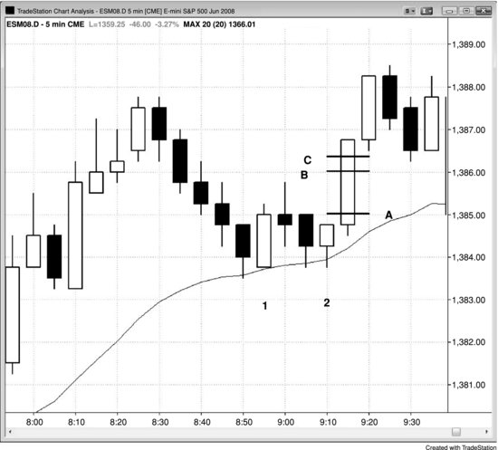

价格行为交易员要找的是入场理由。完成建仓形态的那根K线叫做信号K线，实际成交入场的那根K线叫做入场K线。用价格行为做交易，最好的方式之一就是用突破单入场——市场的动量会带你进场，交易方向至少跟一个微小的趋势一致，哪怕只有一个 Tick 的长度。这是最可靠的入场方法，初学者在能够稳定盈利之前，应该只用这一种。举个例子，如果你想在空头趋势中做空，可以在前一根K线低点下方一个 Tick 的位置挂一张卖出突破单。成交之后，前面那根K线就成了你的信号K线。保护性止损的合理位置是信号K线高点上方一个 Tick。入场K线收盘后，如果空头实体很强，就把止损收紧到入场K线高点上方一个 Tick；否则，在市场明确朝有利方向运行之前，止损继续放在信号K线上方。

**图 27.1** 要赚 4 个 Tick，需要走出 6 个 Tick 的幅度

在 Emini 中，价格通常（60%+）要越过信号K线 6 个 Tick，才能净赚 4 个 Tick 的剥头皮利润；要越过 10 个 Tick，才能赚到 8 个 Tick 的剥头皮利润。在图 27.1 中，买入突破单挂在K线 2（信号K线）高点上方一个 Tick 的位置，也就是线 A，在这里成交。4 个 Tick 的剥头皮止盈限价单挂在成交价上方 4 个 Tick 的地方，即线 B。限价单通常（60%+）需要市场再穿过它一个 Tick 才能成交，对应线 C——也就是信号K线高点上方 6 个 Tick 的位置。
