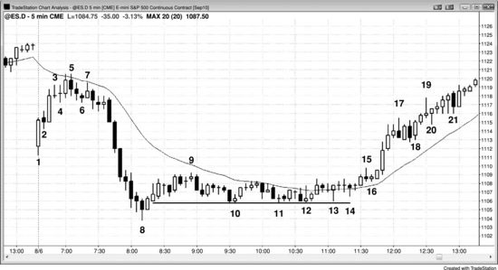
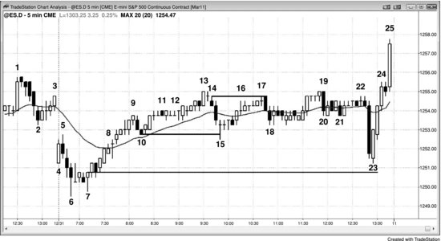
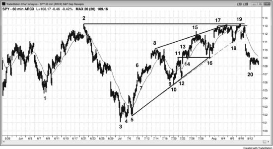
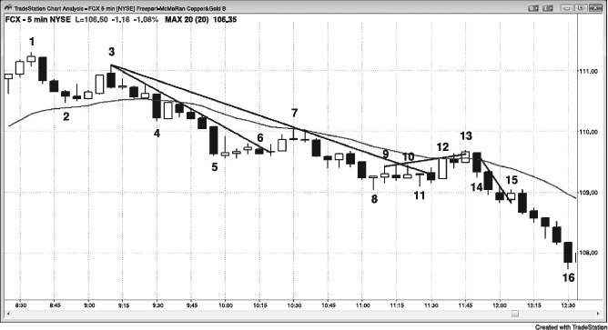
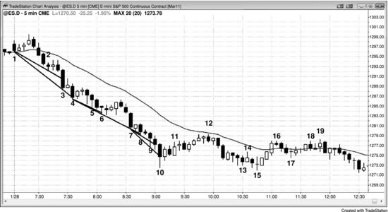

有经验的交易员会根据具体情况，在突破单和限价单之间灵活切换。市场处于强趋势时，用突破单入场是合理的；而当市场更偏向通道走势时，他们就倾向于用限价单入场。举个例子，在一轮强劲的多头急速拉升中，交易员会在K线上方挂突破单，或者在K线顶部附近直接以市价单入场。一旦市场转入通道阶段，虽然仍处于多头趋势中，但趋势已经走弱，随时可能结束并回撤到通道底部。通道初期，交易员仍然会在高1和高2买入信号处用突破单入场。当通道持续了大约10根或更多K线之后，很多有经验的交易员就会改用限价单在前一根K线低点及其下方入场，不再用突破单在前一根K线高点上方入场。当通道持续了大约20根K线并接近阻力区域时，交易员就不再考虑做多，转而在前一根K线高点及其上方挂限价卖单。他们卖出既是为了对多头仓位止盈，也有一些人会逐步建立空头仓位。一旦出现空头突破，整个过程就反过来。如果空头趋势很强，他们会在K线下方挂突破单做空；但如果空头腿走势偏弱，有经验的交易员不会在低点附近用突破单做空，而是更倾向于在回调中用突破单做空——比如在均线附近的低1或低2建仓形态下方入场，同时也会在前一根K线高点及其上方挂限价单做空。

交易员在能稳定盈利之前，应该只用突破单入场，因为入场时市场正朝着有利方向运行，这会提高交易盈利的概率。限价单入场的成功概率可以同样高，但判断建仓形态是否足够强需要更多经验。而且从心理上说，入场后立刻看到价格朝有利方向走，比看着价格继续反向运行要好受得多——而限价单入场后经常会出现后一种情况。用限价单入场，本质上是在押注市场即将反转。你的判断可能是对的，但入场时机偏早了，所以很多用限价单入场的交易员会缩小仓位，如果市场继续反向运行而他们仍然认为很快会反转，就分批加仓。

以下是一些适合用限价单入场的情形（三本书相关章节中都有具体例子）：

- 如果你错过了原始入场的突破单，只差了几秒钟，想在原来的价格附近进场，可以挂一张限价单，价格设在原始入场价或差一个 tick 的位置。
- 在强多头急速段中，如果前一根K线是强多头趋势K线，可以用限价单在该K线收盘价买入。
- 在强空头急速段中，如果前一根K线是强空头趋势K线，可以用限价单在该K线收盘价卖出。
- 在强多头急速段中，可以在K线收盘前趁小幅回调买入，比如挂一张限价单，在当前K线高点下方两个 tick 处买入。
- 在强空头急速段中，可以在K线收盘前趁小幅回调卖出，比如挂一张限价单，在当前K线低点上方两个 tick 处卖出。
- 当出现一根可能形成微型缺口的多头突破K线时，在突破K线前一根K线的高点上方买入，那里就是突破点。
- 当出现一根可能形成微型缺口的空头突破K线时，在突破K线前一根K线的低点下方卖出，那里就是突破点。
- 在强多头急速段中，用限价单在前一根K线低点或更低位置买入。
- 在强空头急速段中，用限价单在前一根K线高点或更高位置卖出。
- 在强多头趋势中，用限价单在 ii 形态底部上方一个 tick 处买入，冒两个 tick 的风险去赚四个 tick 或更多，因为这种交易的胜率大约是 60%。
- 在强空头趋势中，用限价单在 ii 形态顶部下方一个 tick 处卖出，冒两个 tick 的风险去赚四个 tick 或更多，因为这种交易的胜率大约是 60%。
- 当一根不算特别大的多头趋势K线将市场翻转为 Always-in 做多时，用限价单在该K线前一根K线的高点上方一个 tick 处买入，预期形成测量缺口（如果价格没有跌破多头突破K线前一根K线的高点，这本身就是强势信号）。
- 当一根不算特别大的空头趋势K线将市场翻转为 Always-in 做空时，用限价单在该K线前一根K线的低点下方一个 tick 处卖出，预期形成测量缺口（如果价格没有涨过空头突破K线前一根K线的低点，这本身就是强势信号）。
- 在开盘区间形成过程中，如果出现连续两根实体强劲的多头趋势K线，在前一根K线低点处买入，预期多头急速段的低点至少能撑住一次剥头皮的上涨。
- 在开盘区间形成过程中，如果出现连续两根实体强劲的空头趋势K线，在前一根K线高点处卖出，预期空头急速段的高点至少能撑住一次剥头皮的下跌。
- 在交易区间底部，可以用市价单或限价单在空头急速段底部买入。
- 在交易区间顶部，可以用市价单或限价单在多头急速段顶部卖出。
- 当多头市场中出现空头急速段，空方需要下一根K线是阴线来确认 Always-in 方向翻转为向下时，可以在跟随K线形成之前，在急速段最后一根空头趋势K线收盘时买入，同时在该K线低点及更低处挂限价单买入；如果下一根K线没有收出阴线实体，则在其收盘价买入（同时在其高点上方挂突破单买入）。回调的概率大于演变成空头急速与通道的概率。
- 当空头市场中出现多头急速段，多方需要下一根K线是阳线来确认 Always-in 方向翻转为向上时，可以在跟随K线形成之前，在急速段最后一根多头趋势K线收盘时卖出，同时在该K线高点及更高处挂限价单卖出；如果下一根K线没有收出阳线实体，则在其收盘价卖出（同时在其低点下方挂突破单卖出）。回调的概率大于演变成多头急速与通道的概率。
- 当空头趋势末端或多头趋势回调末端出现一根可能构成卖出高潮的大阴线时，在该K线收盘价买入，在其低点下方买入，并在下一根K线收盘价买入（同时在其高点上方挂突破单买入）。
- 当多头趋势末端或空头趋势回调末端出现一根可能构成买入高潮的大阳线时，在该K线收盘价卖出，在其高点上方卖出，并在下一根K线收盘价卖出（同时在其低点下方挂突破单卖出）。
- 多头趋势中，在单K线多头急速段之后出现回调时，用限价单在多头急速段底部上方一到两个 tick 处买入，预期这是突破回调而非失败的突破。
- 空头趋势中，在单K线空头急速段之后出现回调时，用限价单在空头急速段顶部下方一到两个 tick 处卖出，预期这是突破回调而非失败的突破。
- 当多头急速段之后可能出现第二段上涨时，用限价单在原始信号K线高点上方一到两个 tick 处买入，即使回测发生在几十根K线之后也不例外。
- 当空头急速段之后可能出现第二段下跌时，用限价单在原始信号K线低点下方一到两个 tick 处卖出，即使回测发生在几十根K线之后也不例外。
- 在多头通道中，在前一根K线低点下方买入，尤其是通道处于早期阶段时。
- 在空头通道中，在前一根K线高点上方卖出，尤其是通道处于早期阶段时。
- 在空头通道后期，抛压不断积累之后，在前一根K线低点下方并且在最近波段低点下方买入。
- 在多头通道后期，买压不断积累之后，在前一根K线高点上方并且在最近波段高点上方卖出。
- 在多头微型通道中，在前一根K线低点下方买入，预期第一次向下突破通道会失败。
- 在空头微型通道中，在前一根K线高点上方卖出，预期第一次向上突破通道会失败。
- 在急速与通道多头趋势中，当价格以低动量回调到通道底部时，在通道底部的测试位置买入。
- 在急速与通道空头趋势中，当价格以低动量回调到通道顶部时，在通道顶部的测试位置卖出。
- 在强多头波段起点出现至少两根强多头趋势K线之后，如果随后收出阴线，可以在该阴线收盘处买入。
- 在强空头波段起点出现至少两根强空头趋势K线之后，如果随后收出阳线，可以在该阳线收盘处卖出。
- 在交易区间底部，在之前的波段低点或更低位置买入。
- 在交易区间顶部，在之前的波段高点或更高位置卖出。
- 用限价单在多头 Ledge（底部由两根或多根低点相同的K线构成的小型交易区间）底部上方一到两个 tick 处买入。
- 用限价单在空头 Ledge（顶部由两根或多根高点相同的K线构成的小型交易区间）顶部下方一到两个 tick 处卖出。
- 在交易区间底部，或强反转上涨后的新多头趋势初期（可能形成更高低点），当出现弱的低 1 或低 2 信号K线时，用限价单在该信号K线价格或更低处买入。
- 在交易区间顶部，或强反转下跌后的新空头趋势初期（可能形成更低高点），当出现弱的高 1 或高 2 信号K线时，用限价单在该信号K线价格或更高处做空。
- 在强多头趋势中，逆向做空的剥头皮大多会失败，可以押注这些空头失败。当强多头趋势中出现做空剥头皮建仓形态时，用限价单在空头剥头皮者预期止盈位置上方两到三个 tick 处买入。比如在 Emini 强多头趋势中出现做空建仓形态，可以用限价单在空头信号K线下方约四个 tick 处买入，冒约三个 tick 的风险，预期下跌不会达到空方赚一个点所需的六个 tick。
- 在强空头趋势中，逆向做多的剥头皮大多会失败，可以押注这些多头失败。当强空头趋势中出现做多剥头皮建仓形态时，用限价单在多头剥头皮者预期止盈位置下方两到三个 tick 处做空。
- 在非常强的多头趋势中，如果价格还没有跌破均线超过两个 tick，当第一根小阴线收盘在均线下方一到两个 tick 时，在该K线收盘价买入。
- 在非常强的空头趋势中，如果价格还没有涨过均线超过两个 tick，当第一根小阳线收盘在均线上方一到两个 tick 时，在该K线收盘价卖出。
- 在均线附近安静的多头旗形中，用限价单在前一根K线价格或更低处买入。
- 在均线附近安静的空头旗形中，用限价单在前一根K线价格或更高处做空。
- 在均线附近安静的多头旗形中，遇到阴线收盘时买入。
- 在均线附近安静的空头旗形中，遇到阳线收盘时卖出。
- 在强多头趋势中，在均线回调处买入，比如 EMA 20 缺口K线做多建仓形态。
- 在强空头趋势中，在均线回调处卖出，比如 EMA 20 缺口K线做空建仓形态。
- 当价格回调到陡峭上升的均线时买入，并在均线下方按间隔分批加仓。
- 当价格回调到陡峭下降的均线时卖出，并在均线上方按间隔分批加仓。
- 当一根阳线向上突破多头旗形时，在该阳线下方买入，预期出现突破回调。
- 当一根阴线向下突破空头旗形时，在该阴线上方卖出，预期出现突破回调。
- 在多头趋势中做波段交易时，在突破回测处买入或加仓——突破回测就是市场试图触发之前多头入场的盈亏平衡点止损。
- 在空头趋势中做波段交易时，在突破回测处卖出或加仓——突破回测就是市场试图触发之前空头入场的盈亏平衡点止损。
- 当价格回调到可能形成双底牛旗的位置时，用限价单在之前波段低点附近买入。
- 当价格回调到可能形成双顶熊旗的位置时，用限价单在之前波段高点附近卖出。
- 在你认为交易逻辑扎实的任何交易中，都可以加仓。
- 如果市场处于楼梯形态中，可以用限价单在回调到前一级楼梯的位置入场。比如 Emini 当天的平均波幅约为 12 个点，市场处于空头楼梯形态，可以考虑在前一个波段低点下方四个点处挂限价买单，预期价格反弹回测该波段低点。
- 在趋势性交易区间日中，在极端位置挂限价单，预期价格会测试最近交易区间的另一侧。比如在多头趋势性交易区间日中，抛压开始积累时，可以考虑在测量移动目标（基于较低交易区间的高度）下方一个 tick 左右挂限价做空单，预期价格会回测上方区间的底部或下行进入较低区间。
- 在交易区间日中，当区间顶部出现多头急速段时，如果收出阴线——尤其是收在前一根K线波幅的上半部分、且属于第二次向下反转尝试——可以在该阴线收盘处卖出。
- 在交易区间日中，当区间底部出现空头急速段时，如果收出阳线——尤其是收在前一根K线波幅的下半部分、且属于第二次向上反转尝试——可以在该阳线收盘处买入。
- 在多头趋势性交易区间日中，当测量移动目标附近出现一根大阳线时，在该K线收盘价及其高点上方卖出，尤其是该K线相对较大、因而可能是买入高潮，而且过去 5 到 10 根K线中已经有一些抛压。
- 在空头趋势性交易区间日中，当测量移动目标附近出现一根大阴线时，在该K线收盘价及其低点下方买入，尤其是该K线相对较大、因而可能是卖出高潮，而且过去 5 到 10 根K线中已经有一些买压。
- 在多头趋势性交易区间日中，如果当天波幅大约 10 个点，可以在较低区间高点上方 4 到 6 个点处挂限价做空单，预期突破回测。
- 在空头趋势性交易区间日中，如果当天波幅大约 10 个点，可以在较高区间低点下方 4 到 6 个点处挂限价做多单，预期突破回测。
- 在强空头通道中，当市场正在形成两K线反转向上时，趁第二根K线上涨到第一根K线高点时做空，冒几个 tick 的风险，预期价格不会涨过第二根K线高点从而触发做多。
- 在强多头通道中，当市场正在形成两K线反转向下时，趁第二根K线下跌到第一根K线低点时买入，冒几个 tick 的风险，预期价格不会跌破第二根K线低点从而触发做空。
- 在多头趋势中，用限价单在多头趋势线测试位置买入（不过通常更好的做法是在测试趋势线的多头反转K线上方用突破单买入）。
- 在空头趋势中，用限价单在空头趋势线测试位置卖出（不过通常更好的做法是在测试趋势线的空头反转K线下方用突破单卖出）。
- 在多头趋势或交易区间中，当下降楔形（楔形牛旗）测试向下倾斜的趋势通道线时买入（不过通常更好的做法是在测试该线的多头反转K线上方用突破单买入）。
- 在空头趋势或交易区间中，当上升楔形（楔形熊旗）测试向上倾斜的趋势通道线时做空（不过通常更好的做法是在测试该线的空头反转K线下方用突破单卖出）。
- 在多头趋势的回调中（回调本身是一段小型空头趋势），在波段低点下方买入，预期向下突破新低会失败，演变成高 2 或楔形牛旗的做多信号。
- 在空头趋势的回调中（回调本身是一段小型多头趋势），在波段高点上方卖出，预期向上突破新高会失败，演变成低 2 或楔形熊旗的做空信号。
- 在多头趋势中，在从当前高点回调 60% 到 70% 的位置买入，止损设在更低的低点，在新高或更高位置止盈（回报大约是风险的 2 倍，胜率大约 60%）。
- 在空头趋势中，在从当前低点反弹 60% 到 70% 的位置卖出，止损设在更高的高点，在新低或更低位置止盈（回报大约是风险的 2 倍，胜率大约 60%）。

一般来说，市场处于**多头趋势**时，多头会预期空头的每一次尝试都会失败，所以逢跌就买。每根**空头趋势K线**收盘附近他们都会买入，哪怕这根K线很大、收在最低点。市场跌破前一根K线低点、任何前期**波段低点**、或任何**支撑**位（比如**趋势线**）时，他们也会买。同样，市场每次试图上涨，比如接近**多头趋势K线**高点、突破前一根K线高点或突破**阻力**位时，他们也会买。强**空头趋势**中情况正好相反：空头在K线上方和下方都会卖，在**阻力**和**支撑**上方和下方也会卖。他们在K线上方（以及各种**阻力**附近）卖出——包括**强多头趋势K线**——因为他们把每次上涨都看作**趋势反转**的尝试，而大多数**趋势反转**尝试都会失败。他们在K线下方（以及各种**支撑**附近）卖出，因为他们把每次下跌都看作**空头趋势**恢复的尝试，并预期大多数会成功。

**市价单**本质上就是一种**限价单**，只不过交易员急于入场或出场，不在乎省那一两个 tick。很多想按市价成交的交易员会直接在价格阶梯上挂**限价单**，所以大量**限价单**交易实际上就是以市价成交为目的。举个例子，QQQ 报 $51.10 且处于多头**急速**阶段，想做多的交易员往往会在价格阶梯上以高于卖价的价格（比如 $51.14）挂买入**限价单**，结果就是以市价成交。正因如此，我写的关于**限价单**的内容，对那些习惯用**市价单**的交易员来说也同样适用。

每当市场突破前一根K线的高点或低点时，都有一件非常重要的事在发生。市场正在**突破**前一根K线的范围，但一定要认识到，大多数**突破**尝试都会失败。不幸的是，新手交易员容易被每次**突破**的情绪裹挟，以为一波大行情就要来了。他们没有理解这次**突破**其实是一次测试。市场在寻找价值，**突破**只是多空双方之间的较量，通常 (60%+) 并不是大**趋势**的起点。这种测试几乎每隔一两根K线就会在每张图表、每个**时间周期**上发生。如果一个交易员用**突破单**在每根K线高点上方买入、在每根K线低点下方做空——等于每次**突破**都做——最终一定会亏钱。为什么？因为**突破单**入场就是**突破**交易，而大多数**突破**会失败。市场通常 (60%+) 会被拉回到**交易区间**内（比如前一根K线的**实体**范围），然后再决定下一步方向。虽然**突破单**入场和出场对新手来说是最好的选择，但必须有选择性地使用。

假设当前这根K线刚好涨到前一根K线高点上方 1 个 tick。大多数散户要么什么都不做，要么在前一根K线高点上方 1 个 tick 处挂**突破单**买入，要么在前一根K线高点处挂**限价单**卖出。如果**突破**成功、市场涨得够远让多头获利，那他们的决定就是对的。但如果突破前一根K线高点只是一次买入**真空效应**，市场很快就会转跌，空头就能赚到钱。如果趋势向下，很多空头会等反弹再卖出，而他们最喜欢的**建仓形态**之一就是市场涨过某个东西之后做空——涨过**空头趋势线**、涨过前一个**波段高点**、甚至只是涨过前一根K线高点。如果有足够多的强势空头在等市场涨到某个位置上方再做空，这种买入**真空效应**就很容易导致只突破前一根K线高点 1 到 2 个 tick。市场到了上方并没有遇到大量强势多头，反而碰到了一堆等着市场稍微再涨一点（比如涨过前一根K线）就做空的强势空头。

**多头趋势**中多头的操作正好相反。他们想买**回调**，如果足够多的强势多头相信空头能把市场推到当前K线低点下方，那为什么不等一等、到更低的价格再买呢？他们干脆退到一边，在前一根K线低点处挂**限价单**买入，等空头把价格推到当前K线低点下方。那个卖出**真空效应**把价格吸入他们的买入区域，他们就大举买入，套住了空头——空头很快不得不回补空仓（为反弹提供了燃料），于是市场迅速反转上涨。

大多数时候，在前一根K线高点上方用突破单买入，还是在前一根K线高点用限价单做空，两者的概率大约各 50%，但经常有一边能占到 60% 甚至更高的优势。有经验的交易员能识别出这些 60% 的情形，把单子下在有优势的方向。由于大多数突破尝试都会失败，成功的限价单入场往往更可靠，但也更难执行——因为你赌的是市场走势会失败，并且在打到保护性止损之前就朝你的方向反转。没有大量经验积累，等待市场反转走向自己一方的过程会非常煎熬。每个突破单信号都盲目跟进是必输策略，同样，每个突破单信号都用限价单反着做也是必输策略。任何一天，大约有 10 个合理的突破单建仓形态和 20 个甚至更多的限价单建仓形态，只是很多对新手来说并不明显。正因为可靠的限价单建仓形态这么多，交易员学会评估它们就很重要。

想用限价单入场，追求的就是比当前价格更好的成交价。比方说你想用限价单做多，挂单在当前价格下方，需要价格下跌才能成交。用突破单入场整体上更安全，因为入场时市场正朝你的方向运动，出现跟随的概率更高，对新手来说这是最好的方式。不过，有很多情形可以用限价单代替突破单入场。实际上，前面提到过，限价单建仓形态的数量通常是突破单建仓形态的两倍左右，但风险更大，也通常更难执行，因为它们至少与短期趋势相反。举个例子：假设你刚刚在突破空头趋势线后的回调中，用二次入场点做多，信号K线是一根强多头反转K线，接下来一两根K线里市场几次测试入场K线的最低点。这时可以考虑在入场K线低点上方一个 tick 处挂限价买单，把仓位翻倍，风险只有两个 tick（止损放在入场K线下方，也就是原来的止损位置）。如果你试着在入场K线低点直接挂限价买单，很可能成交不了，因为市场通常要穿过限价价格，单子才能成交。大家都知道入场K线低点下方一个 tick 处堆了很多保护性止损——为什么聪明钱没有去猎杀这些止损？因为一旦那些止损被触发，市场的性质就变了。原本是一个强力的二次入场点，现在变成了失败的二次入场点，而失败的二次入场点是一个顺势建仓形态，可能（60%+）引发再跌两段。聪明钱如果在底部大量建仓，他们不希望看到市场再跌两段，所以会跟你做一样的事：继续累积多头仓位来守住底部。最终，卖方会放弃并开始平仓，随着他们平仓，市场会涨到远超剥头皮者的目标位。

用限价单入场至少是在逆短期趋势交易，整体上会带来不必要的焦虑，干扰你当天后续的交易状态。仅凭一波强急速走势，不足以作为用限价单在回调处入场的理由。比如 Emini 出现一波强多头急速走势，涨到交易区间顶部，或者多头趋势末端出现疑似买入高潮，有些交易员可能把它看作强势信号，挂限价单在低 1 到 4 个点处分批做多。但他们需要考虑一种可能：这波多头急速走势是衰竭型的买入高潮。只要有任何疑问，就不应该在市场下跌时用限价单买入，因为这波下跌可能至少持续 10 根K线、走出两段，甚至可能是一轮向下反转的起点。单凭一波强多头急速走势不足以作为限价单做多回调的理由，交易员需要考虑这波多头急速走势的背景。空头急速走势的情况正好相反。

再说，如果市场涨了两个小时之后又跌了一个小时，还没有任何见底迹象，这时你用限价单在斐波那契 62% 回调位挂多单，或者在布林带、肯特纳带或其他什么轨道上挂多单，你入场的时候市场正在下跌，等于是逆着当前趋势做，赌的是之前的趋势能恢复。市场确实经常在 62% 回调附近反弹，但反弹的频率和幅度都不够高，不足以让它比用突破单入场更划算。如果市场在 62% 回调附近向上反转，先等那根K线收盘，看收盘是不是偏多。如果是，就在那根K线高点上方一个 Tick 挂买入突破单。这样你入场的时候市场正朝你的方向走，而且多头已经通过偏多的收盘和把市场推过前一根K线高点这两件事展示了力量。同时你还有 62% 回调这个有利因素。如果这笔交易本身没问题，成功的概率就大得多了。没错，等突破单入场可能会多付几个 Tick，但你能因此避开更多亏损交易和大量不必要的压力。

少数情况下，限价单入场的胜率可以跟好的突破单入场相比。如果因为某种原因你错过了一笔看起来很好的突破单入场，而几秒内还能以突破单的价格或差一两个 Tick 的价格挂限价单进去，这样做是可以的。但这只适用于非常强的建仓形态，因为一般来说，你不会想进一笔在你已经错过原始入场点之后还能让你拿到好价格的交易。真正好的交易很少会回头救那些反应慢的交易员。

强多头趋势中，不要指望做空低 1 或低 2，尤其是信号K线很弱的时候。当出现暂停K线或弱空头趋势K线时，很多交易员会选择观望，等市场跌破那根K线后再买入，这就制造了一个微型抛压真空。在那根K线的低点或低点下方买入，通常是一笔不错的交易，预期几个 Tick 之后会触发高 1 或高 2。还有些交易员会在急速阶段高点下方固定间距处买入，比如跌 1 到 2 个点就买，这个位置经常恰好和那些低 1、低 2 信号K线的低点重合。记住，强多头趋势中低 1 和低 2 信号根本不成立，只是陷阱。强多头趋势中的顶部大约 80% 的情况下会变成牛旗。强空头趋势则正好相反：在高 1 和高 2 信号K线的高点或高点上方做空，通常是不错的策略。

如果你做的是反转入场，尤其是在交易区间里，入场后经常会出现回调，往往在入场后一两根K线内就发生。如果你对自己解读价格行为的能力有信心，可以押注这些回调会失败。这些回调通常是你认为会失败的低 1、低 2 或高 1、高 2 建仓形态。举个例子，如果在一个交易区间日出现了楔形底部，你在反转向上时买入，那就可以预期楔形的低点会守住。你认为趋势现在已经转为向上，所以想买回调。回调可以小到只有一根K线。因为可能（60%+）会出现两段上涨腿，第一段回调不会跌太远。那个低 1 做空应该会失败，变成新的上涨腿中的一次回调，因为接下来 10 根或更多K线的趋势已经反转为向上。只有在强空头趋势的急速阶段，低 1 做空才是可靠的，在反转形态之后永远不可靠。那个低 1 做空入场很可能（60%+）不会跌破楔形的低点，而是在两段式回调向上的过程中形成一个较小的 HL。正因如此，你可以在那根做空信号K线的低点或低点下方 1 到 3 个 Tick 处挂限价单买入，预期会形成一个较小的 HL，而不是一笔盈利的低 1 做空。在 Emini 中，止损通常只需要 4 个 Tick。

随着向上反转的延续，你可能会想，这里是不是要形成一个低点2做空建仓形态。但如果你判断趋势已经反转为多头趋势，就应该预期这个低点2同样会失败，之后价格继续走高。你仍然处于逢回调买入的模式，而这个模式也包含像低点2这样的小幅回调。做法同样是：在低点2信号K线的低点或更低位置挂限价单买入，Emini 中大约承担4个 tick 的风险。你预期这个空头旗形不会向下突破超过几个 tick，而是会继续向上发展成多头通道。这其实是一种最终旗形，因为它是空头趋势中的最后一面旗。空头把它当成空头旗形来对待，但当价格无法跌破空头信号K线下方超过一两个 tick 时，这面旗就会持续向右上方扩展，直到交易员意识到它已经变成了多头通道。当足够多的交易员意识到这一点后，空头就会回补，通常会出现一次向上突破（概率60%以上），随后形成一段测量移动上涨。一旦空头认为市场已经到达交易区间顶部、或者多头趋势正在反转向下，他们就会寻找高点1和高点2信号K线，在这些K线的高点或稍上方挂限价单做空。他们要做的是逢反弹卖出，哪怕是像高点1或高点2这样非常小的反弹。多头则会在交易区间底部寻找低点1和低点2的买入机会，或者当他们认为空头趋势正在反转为多头波段时，在空头趋势底部买入。

在第三本书关于趋势反转的章节中讨论过，大多数顶部都是某种形式的双顶，涉及一个失败的高点1、高点2或三角形突破，而那个高点1、高点2或三角形随后就变成了反弹中的最终旗形。当上涨腿和顶部的幅度较小时，双顶就是微型双顶。当交易员预期反转时，他们会在多头旗形信号K线的价格处或更高位置挂卖出限价单，预期旗形会失败。底部通常源自一个失败的低点1、低点2或三角形突破（概率60%以上），形成空头腿中的最终旗形。当双底仅在几根K线内形成时，就是微型双底。预期旗形失败并引发向上反转的交易员，会在卖出信号K线低点处或更低位置挂限价单买入。

回到之前的楔形底部，如果它以一根大阳反转K线收尾，紧接着又出现第二根影线很短的强多头趋势K线，那么出现两段式反弹的概率就很高。如果下一根K线是一根小阳线或十字星，这在任何情况下都是一个较弱的低点1做空建仓形态，而且出现在可能的楔形底部之后，它带来盈利做空机会的概率尤其低（不超过40%）。空头至少应该等到低点2，但如果趋势已经反转，低点2也很可能会失败（概率60%以上）。聪明的多头会看到这个弱低点1建仓形态，预期它不会给空头带来剥头皮利润；他们会在这根K线的低点或再低几个 tick 的地方挂限价单买入，Emini 中大约承担6个 tick 的风险。所有市场中交易员都一直在这样操作，限价单和保护性止损的具体位置取决于市场本身。举个例子，假设 Google（GOOG）最近的日均波幅是10美元；如果5分钟图上从空头楔形向上反转，前几根K线从低点上涨了3美元，交易员可能会在第一段上涨腿顶部下方大约50%的位置挂限价单买入——大概比第一腿顶部低1.50美元，也许比低点1信号K线低0.50美元甚至1美元——然后承担1.50美元或2美元的风险，或者把止损设在楔形低点下方。

在一些铁丝网形态和小型交易区间中，用限价单入场同样可以有效。这类形态的K线较大、大部分相互重叠，整体走势基本水平。这种做法风险较高，需要快速决策，只有最优秀、最有经验的交易员才应该尝试。

交易员经常用限价单和市价单来押注各种类型通道的失败——在顶部做空、在底部反手做多。最安全的通道是交易区间，拥有清晰明确的支撑和阻力，并且已经被多次测试过。由于假突破很常见，在阻力线上方做空或在支撑线下方买入以押注极端位置测试失败的交易员，会把保护性止损设在线外足够远的地方，为假突破留出空间，等市场反转朝自己的方向运行并测试区间的另一侧。在趋势通道中交易员也会这样操作。比如，在多头趋势通道中，当市场触及或接近趋势通道线时，他们会用市价单或限价单做空，也会在通道内最近的波段高点上方做空，并在市场继续上涨时加仓。这个策略不适合在当天最后几个小时使用，因为你经常会来不及等到回落，被迫亏损平掉一个大空仓。

多头会在价格测试通道底部趋势线时，用市价单或限价单买入，保护性止损放在趋势线下方足够远的位置，给小幅过冲留出空间。他们也会在前一根K线低点或更低处挂限价单买入。因为是顺势交易，他们更倾向于做波段持仓，并在后续出现建仓形态时加仓。在多头通道中，不要去找低 1、低 2、低 3 或低 4 建仓形态，那些只在空头趋势和交易区间中才有效。如果在多头趋势里看到这类形态，大概率会失败并触发上方的保护性买入突破单，所以不如反过来操作——不要在前一根K线低点下方挂单做空，而是在该K线低点或更低处挂限价单买入。你买入的位置正是那些空头做空的价位，既然他们大概率会输，你就大概率会赢。

如果通道内有更大幅度的波段，比如趋势性通道或楼梯形态，双向交易机会就更明显，在通道顶部和底部押注失败的可靠性也更高。所有通道中的押注失败交易，只要仓位足够小、能在市场继续反向运动时加仓，可靠性都会更高。举个例子，如果市场处于空头通道中，你可以在每个前波段低点下方挂限价单买入，同时准备好在更低的位置少量加仓，用较宽的止损。如果市场在第一笔入场后就到了利润目标，直接止盈。如果趋势继续走，第二笔限价单也成交了，你可以在第一笔入场价格处同时平掉两笔仓位——第一笔大约在盈亏平衡点出场，第二笔则带着利润出场。逆势加仓的交易者要注意一点：当市场第二次朝反方向运动时，应该平仓或反手做顺势方向。也就是说，如果你在多头趋势中逆势加仓做空，当出现高 2 形态时——尤其是在均线附近——就应该平仓甚至反手做多。同样，如果你在空头趋势中逆势加仓做多，当出现低 2 形态时——尤其是在均线附近——就应该平仓甚至反手做空。

在 Emini 中做剥头皮，通常需要信号K线之外 6 个 tick 的运动才能赚到 4 个 tick 的利润——入场突破单在K线之外 1 个 tick 触发，加上 4 个 tick 的利润空间，再加上限价止盈单通常要市场多走 1 个 tick 才能成交。有时候不需要穿过挂单价格就能成交，但那种情况下市场往往很强，大概率会在几分钟内继续突破那个价位。同样，在 QQQ 中做 10 个 tick 的剥头皮，通常需要 12 个 tick 的运动。

当一个建仓形态看起来很弱时，最好不要入场，等下一个机会。弱的形态大概率会失败，没必要冒不必要的风险。弱的建仓形态往往会演变出二次入场点，到那时它就变成了一个强建仓形态。

交易者也可以在回调测试突破区域时用限价单入场，前提是他们认为突破力度够强、预期测试会成功。突破回测的意义在于：看交易者是否愿意在之前入场的价位再次入场。举个例子，如果 5 分钟 Emini 在一段空头波段的最终旗形之后出现强多头反转K线向上反转，随后反弹持续了几个小时，市场回测到那根多头信号K线高点附近 1 到 2 个 tick 的位置是很常见的。交易者之前在那根K线上方积极买入，现在市场又回到了那个价位。如果多头趋势够强，买方会在同一价位重新入场，多头波段将继续。很多机构会在那个价位常规性地挂限价单和市价单，这给交易者提供了很好的盈亏比——可能只需要承担 4 到 6 个 tick 的风险，同时有超过 50% 的概率赚到 4 个点或更多。相关示例请参见第 5 章关于失败突破、突破回调和突破回测的内容。

虽然大多数交易应该用突破单入场，但在强趋势中随时入场都是安全的。尤其在股票中，用限价单在均线处入场效果特别好，因为股票的走势往往更规律。这样做风险更小、潜在回报更大，胜率基本不变。在多头趋势中，交易者通常把止损放在最近的 HL 下方，所以在回调时买入意味着保护性止损更小。同样，在空头趋势中，交易者通常把保护性止损放在最近的 LH 上方，在回调时做空也能用更小的止损。

**图 28.1** 限价单入场

图 28.1 展示了几个用限价单入场的好交易案例。市场上涨到 K线3 时走势很强，价格刚好停在均线下方——均线本身就是一块磁铁，价格已经进入了均线的吸引范围。K线3 是一根十字星，在一段强势上涨之后，用它作为做空的信号K线并不好，所以市场可能(60%+)不会跌太远，大概率会再推上去测试均线。激进的多头可以在 K线3 的价位或略低一点挂限价单做多，赌市场测试均线，止损大约 6 个 tick。

K线5 测试均线之后，市场可能(60%+)横盘或向下回调。敏锐的交易者注意到多头无法打出连续的强多头趋势K线，这让他们更愿意做空。K线5 是一根空头K线，测试了均线底部。由于这是在第二次买入高潮之后（当天的第一根和第三根大阳线构成了两次买入高潮），接下来可能(60%+)出现两段式横盘或向下走势。因此，在 K线6 的高点或高一个 tick 的位置挂限价单做空，盈亏比是不错的。有些多头认为可能(60%+)出现高 2 做多信号，就在 K线5 低点及下方挂限价单做多。但考虑到近期K线的双向性，这种策略高风险。另一些交易者看到 K线5 收阴，预期均线附近会出现低 2 做空信号。K线5 收盘后，他们直接市价做空，或者在 K线5 收盘价位挂限价单做空。

市场从均线处暴跌后，交易者在三根大阴线的收盘价附近做空，也在阴线形成过程中的小幅回调处做空。比如，很多人会在最近低点上方 1、2 或 3 个 tick 的位置挂限价单做空。

从 K线1 到 K线5 的开盘区间大约是平均日内波幅的一半，所以当市场跌破 K线1 时，一些交易者就会用测量移动来估算当日可能的低点。K线8 的低点恰好是从 K线1 开盘价到 K线5 高点这段距离向下的等幅测量移动目标。交易者知道此时当天的开盘价正好处于全天波幅的正中间，市场在收盘前可能回测开盘价附近。如果出现这种情况，日线图上就会形成一根十字星，开盘价和收盘价都在当天的中间位置。如果市场能涨回高点，那当天就变成一根多头反转日线。一些多头愿意在测量移动目标上方 1 个 tick 处挂限价单做多，然后持仓等待回测开盘价。成功回测到当天开盘价的概率大约在 30% 到 40%。他们可以把保护性止损设在大约两个点以下，然后观察市场走势。由于下跌动能在减弱，市场大概率会在触及止损之前就有足够的止盈盘推动价格反弹。如果价格跌破了入场价但还没触及止损，一旦觉得自己的交易逻辑已经不成立了，可以在盈亏平衡点出场。等到出现两K线反转向上之后，就可以把保护性止损移到盈亏平衡点，然后耐心等待看涨势能否发展起来——最后确实涨了。

空头急速下跌到 K线8 的过程中出现了连续 7 根空头趋势K线。有些交易者认为这是空头强势的信号，可能会在高 1 到 4 个点的位置挂限价单分批做空。但他们需要考虑另一种可能：这段空头急速走势其实是一个衰竭型抛售高潮。只要存在这种疑虑，交易者就不应该在市场反弹时用限价单做空，因为反弹可能持续至少 10 根K线、走出两段上涨，甚至在当前这种背景下演变成一轮向上反转。仅凭一段强势的空头急速走势，不足以作为在反弹中挂限价单做空的理由。交易者必须结合空头急速走势的背景来判断。

低点处的窄交易区间很好地说明了理解交易数学怎样带来绝佳的交易机会。区间太窄，根本不适合用突破单来剥头皮——在这么窄的区间里，不管是在K线上方买入还是在K线下方做空，都很难稳定赚到钱。但对波段交易者来说，这里有一个非常好的机会。当天是趋势性交易区间日，如果价格向上突破这个窄交易区间，大约有 70% 的概率会测试上方交易区间的底部（即K线 1 的低点）。一旦价格上破K线 11、确认了双底牛旗，多头就会守住这个形态的低点。所以，在低点上方 1 tick 处挂限价单买入，止损设在低点下方 1 到 2 tick，盈亏比很划算。K线 12 正好精确到 tick 地回测了K线 10 和K线 11 的双底，你的限价单会在那里成交。风险大约 3 tick，潜在利润至少 4 个点（到K线 1 的低点），如果市场反转上行测试上方交易区间的高点，甚至能赚大约 12 个点——事实上确实如此。因为你是在窄交易区间的底部买入，价格测试区间顶部的概率是 60%。但你需要一次成功的向上突破，而窄交易区间向任一方向突破的概率是五五开。所以在你买入的那一刻，你有 50% 的概率赚到 4 个点以上，风险还不到 1 个点。这是一笔盈亏比非常好的交易，但只有懂得这套数学逻辑的交易员才能看到这一点。

K线 13 和K线 14 开始形成 HL 之后，你可以把保护性止损跟踪到最近的 HL 下方 1 tick。经过K线 13、K线 14 的测试以及K线 16 的突破回调，至少赚 4 个点的概率从大约 50% 提高到了 70%。到这时，你已经锁定了几 tick 的利润，有 70% 的概率赚到至少 4 个点，还有大约 50% 的概率价格会涨到上方交易区间的顶部。K线 16 之后连续出现 5 根多头趋势K线形成突破，强急速突破通常意味着市场至少有 60% 的概率走出一个测量移动。测量移动的算法是：从K线 16 之后那根K线的开盘价到急速阶段第三根K线的收盘价，再把这段幅度加到第三根K线的收盘价上。急速阶段中实体最强的那些K线往往对应一个测量移动。这意味着你有 60% 的概率再赚大约 5 个点。你会把保护性止损放在急速阶段的底部，这样能保住大约 2 个点的浮盈。

K线 17 是强多头急速中的一根空头反转K线。多头预期市场会在 1 到 2 根K线的回调之后形成一个成功的高 1 买入建仓形态。不过，那根买入信号K线的高点很可能高于K线 17 这根卖出信号K线的低点，所以激进的多头直接在K线 17 的低点买入。K线 17 之后是一根多头K线，上涨趋势很强。如果再下一根是空头趋势K线（实际确实是），就会形成一个两K线反转做空建仓形态。由于多头趋势很强，激进的多头会在那根多头K线的低点挂限价单买入。他们预期，即使空头K线跌破了那根多头K线的低点，这个两K线反转顶部的做空也不会跌破两K线反转的两根K线下方，不会在K线 18 处触发。

在K线 17 的上涨过程中，市场明显处于 Always-in 做多状态，而K线 18 之前的那根空头K线已经是向下反转的第二次尝试，很多多头认为市场很快会恢复上涨。他们不相信下跌会有跟随，所以K线 18 一开盘，就在前一根空头趋势K线的收盘价挂限价单买入。

**图 28.2** 安静交易日的限价单入场

12 月下旬交易清淡时，用限价单入场往往是最好的方式。图 28.2 中，下跌到K线 6 的过程有买压迹象，比如K线 4 是一根多头K线，而且K线底部的影线越来越长。所以这不是一个强空头急速，K线 7 的低 1 突破很可能失败。K线 6 同时处于两天扩张三角形的底部，也刺穿了一条持续两周的多头趋势线下方，交易员在寻找对抗线买入建仓形态。激进的多头在K线 7 跌破 iii 形态时就买入了，更保守的交易员则在K线 7 的高点上方买入。

大多数交易者在 K线8 之前那根多头突破K线收盘时，已经判断市场为 Always-in 做多，因此一直在等回调买入的机会。从上涨到 K线8 的这段走势处于多头微型通道中，他们认为第一次跌破前一根K线低点的突破会失败，形成空头陷阱——尽管有些交易者把它看作均线附近的低 2 做空信号。这些多头会在前一根K线低点及其下方挂限价买单，并在 K线8 之后那根K线上成交。

K线8 之前那根K线把市场翻转为 Always-in 做多，因此多头希望市场守住那根K线的高点上方。有些人在那根K线高点上方 1 个 tick 处挂了限价买单，在 K线8 之后的十字星上成交。有人只承受 2 个 tick 的风险，有人用更宽的保护性止损，还有人选择在更低的价位加仓。虽然用 2 个 tick 止损的成功概率可能只有 30% 到 40%，但潜在回报是这个测量缺口对应的测量运动目标，或者至少 6 个 tick 的利润。最悲观的现实估计是 6 个 tick 利润配 30% 的成功率——这已经是盈亏平衡的策略了；最乐观的情况可能是 60% 的成功率加上 10 到 12 个 tick 的利润。这个结果非常不错。实际结果大概率介于两者之间，数学期望仍然为正，所以这是一个合理的买入建仓形态。假日交易期间，日均波幅只有大约 5 到 6 个点。一年中只有极少数交易日的波幅小于 5 个点，所以今天的波幅应该至少会达到那个水平。

从 K线7 到 K线8 的走势是一段多头微型通道。多头微型通道的第一次向下突破通常会失败，因此多头持续在前一根K线低点挂限价买单，在 K线8 之后那根K线上成交。

微型通道一直延续到 K线9，下一根K线跌破 K线9 时，多头再次成交。有些人在多单上承受 4 到 8 个 tick 的风险，也有人选择分批加仓，在第一笔入场下方 4 到 6 个 tick 的位置加买。

虽然 K线11 可以看作最终旗形做空和一个更高高点，但大多数交易者认为向上的动能足够强，出现一段空头腿的可能性不大。市场要么继续上涨，要么只小幅回落后形成一个交易区间，然后再创新高。因为概率偏向更高的价格，他们愿意在前一根K线低点及其下方挂限价买单，分别在 K线11 和 K线12 下方成交。

K线14 之后的两根K线空头急速下跌，可能让部分交易者把市场翻转为 Always-in 做空，但大多数人会希望看到下一根K线出现强劲的跟随卖盘来确认向下突破。当他们看到下一根K线收了十字星而非强空头收盘时，就在那根K线的收盘价附近挂限价买单入场。

市场很可能会测试 K线10——也就是 K线7 到 K线9 多头急速之后多头通道的底部。之后，市场有不低于 60% 的概率会形成一个小交易区间，再决定下一步方向。空头在 K线15 反弹的过程中做空，止损设在 K线14 空头急速顶部上方 1 个 tick。精明的空头在 K线14 高点下方 1 个 tick 处挂了限价卖单，保护性止损再高 2 个 tick，在 K线17 上成交。由于风险只有 2 个 tick，而且是在交易区间内做空，等距运动的成功概率至少有 50%，在 2 个 tick 止损被触发之前先走出 4 个 tick 下跌的概率也很可能超过 50%。因为当天是个小幅震荡日、市场处于交易区间，这些空头用的是剥头皮模式，目标就是 1 个点（4 个 tick）的利润。潜在回报是风险的 2 倍，概率至少 50%，所以交易者方程很强。

到 K线21 时，交易者已经把当天定性为交易区间日，预期突破尝试会失败。虽然 K线22 之后的强空头急速看起来很有气势，但只要下一根K线没有出现持续的卖盘和空头收盘，这段下跌就很可能是空头陷阱，而不是急速之后跟通道的走势。激进的交易者在那段急速收盘时买入，同时在其低点也挂了限价买单。他们还注意到 K线23 正好测试了当天的开盘价和最初在 K线7 上方做多的位置。他们可能承受大约 4 个 tick 的风险去做一笔波段交易。即使成功概率只有 30% 到 40%，潜在回报也许是风险的 4 到 5 倍，所以值得考虑。更保守的交易者选择在 K线23 这根多头反转K线上方买入，以此确认空头突破已经失败。他们的入场价更高、离底部更远，因此潜在回报更小、风险更大，但成功概率大幅提升，足以弥补这些劣势。

交易员看到 K线 23 之后那根入场K线强势收盘，便在该K线收盘价附近买入。也有人等下一根K线开出来后，立刻在前一根K线收盘价挂限价单买入。当这根新K线同样走成一根强多头趋势K线时，他们在 K线 24 上重复了同样的操作。

到 K线 24 收盘时，市场已经处于 Always-in 做多状态，所以一些多头会尝试在第一根空头收盘K线买入，也就是下一根K线。但市场始终没有跌到那根空头K线的收盘价，所以他们的限价单大概率（60% 以上）没有成交。这说明临近收盘时多头的买入意愿非常强烈。反应快的多头还会在那根空头K线高点上方挂买入止损单，因为那里构成了一个突破回调做多建仓形态。很多人来不及进场，只好在下一根K线形成的过程中追着买，用限价单抢 1 到 2 个 Tick 的回调机会。

在市场一路上涨到 K线 13 的过程中，趋势明显向上。一些交易员挂限价单，打算在斐波那契 62% 回撤位买入，或者说只要回调幅度在 60% 到 70% 左右就买，止损设在 K线 6 多头低点下方。他们要找的是回报至少为风险 2 倍的入场机会。在大约三分之二的位置买入，目标是测试多头高点，风险大约只有三分之一，这样目标就是风险的 2 倍——这始终是不错的交易。下单时趋势向上，所以买回调至少有 60% 的概率走出等距运动（上涨幅度等于止损幅度），甚至有 60% 的概率创新高（回报是风险的 2 倍）。利用回调入场来降低风险是很多交易员常用的方法，其交易者方程非常理想。

**图 28.3** 限价单建仓形态

图 28.3 展示的是 SPY 的 60 分钟图，其中有很多几乎可以确定是机构和交易员用限价单或市价单入场的例子。K线 3 是空头通道的高潮底部，同时也是一个牛旗，还可能是一个扩展三角形底部。K线 1 是第二次下推，它前面的波段低点是第一次下推。K线 3 低点形成之后，交易员非常确信市场会继续上涨，以至于在下探到 K线 5 的那段回落中，他们用市价单和限价单在 K线 4 低点上方买入。每当双底牛旗呈现这种形态时，原因都是多头太害怕错过新趋势的起点，所以把买单挂在远高于 K线 4 低点的位置，而不是刚好在低点或高出 1 个 Tick 的地方。这带来了一波急速上涨到 K线 6，随后是到 K线 8 的通道。交易员也可以在那个价格区域用限价单入场，止损设在 K线 4 低点下方大约 1 个点处，持仓目标是测试通道中交易区间的顶部——105、108、甚至 110。这些位置都是空头急速下跌之后通道下行的起点，对价格有磁力吸引作用。交易员冒 1 个点的风险去赚 3 到 7 个点，概率至少 40%，这是一笔合理的交易。另一种做法是在 K线 5 高点上方挂买入止损单入场，这样成功概率提高到大约 60%，因为此时买入的是一个已经确认的交易区间底部（双底）。风险在信号K线下方大约 1 个点，第一利润目标再高 2 个点，同样是一个合理的策略。

K线 6 是一波强多头急速上涨的顶部，所以任何回调之后再创新高的概率大约是 70%。很多交易员因此在 K线 6 低点下方挂限价单买入。也有交易员在 K线 7 的高 1 上方 1 个 Tick 处挂买入止损单。当市场再次测试那个价格区域时，他们在 K线 9 附近买了一些，但没能把市场推高多少。不过当 K线 10 跌破 K线 7 的低点之后，多头用限价单、市价单以及止损单积极买入。

K线 14 是对 K线 11 上方突破的一次小幅回测，很多交易员在那里用限价单买入，把市场托了起来。

到 K线 13 的急速上涨之后，形成了到 K线 15 的通道，接着市场回测通道底部到 K线 16，在那里形成了双底牛旗——这是急速与通道多头趋势中常见的形态。买方再次用限价单和市价单在与 K线 14 相同的价格买入，形成了双底牛旗。K线 16 跌破了从 K线 5 到 K线 10 的趋势线，很多交易员在这个测试位用市价单和限价单买入。随后他们重新画了趋势线，当 K线 18 测试并跌破该线时，又用限价单和市价单买入。多头积极地在 K线 11 上方突破和 K线 14 回调买入时的同一价位再次入场。

K线17是一个对冲线做空的建仓形态，因为楔形顶部的趋势通道线所在区域正好靠近K线2的高点，而主要波段高点始终是阻力区域。之后几天里，交易者反复在阻力线下方做空，市场最终跌破了K线17和K线19形成的小型双顶；这波下跌也是从楔形顶部和大型双顶（K线2和K线19）向下反转的起点。K线17到K线19之间形成了一个交易区间，交易者反复在区间顶部的测试位做空，很多人用的是限价单。

K线8之前的多头急速与通道走势非常强劲，后续出现更高价格的概率很大。虽然有些交易者一路上用市价单买入，也在微小回调中买入，但很多交易者只在回调时买入，比如K线9和K线10测试K线7（多头通道底部）的区域。他们在市场下跌过程中用限价单买入，也在支撑区域用突破单挂在前一根K线高点上方一个 tick 处买入。因为趋势向上，只要市场没有跌破最近的 HL（K线5）或者波段底部K线3，在远低于K线8高点的位置买入就可以用更小的止损，从而降低风险。跌到K线9或K线10之后，趋势的确定性降低了，做多波段交易的盈利概率有所下降，但K线8的涨势比K线9的跌势更强，所以胜算仍然偏向多头。一旦市场在K线11处急涨，多头就把止损移到K线10低点下方。跌到K线12的走势虽然很急，但守住了止损位上方。

**图 28.4** 用限价单押注趋势线测试失败

很多交易者在趋势线和趋势通道线被测试时押注失败，但大多数交易者在市场从线附近反转之后用突破单入场，赚得更多。这种做法的代价是利润稍少一点，换来的是确定性大幅提高，通常能让交易者方程更强。

如图 28.4 所示，K线6是 Freeport-McMoRan（FCX）中对空头趋势线的一次测试，一些交易者在市场测试该线时用限价单做空。这种策略风险较高，因为K线5的卖出高潮之后出现了三根K线的窄交易区间，很可能（60%以上）会有两段式回调。市场当时处于均线的磁力范围内，很可能继续向均线靠拢。更好的策略是在均线附近的低点2（K线7）下方一个 tick 处用突破单做空。

交易者还在K线9到K线10测试空头趋势线时用限价单做空。更好的策略是在低点2信号K线下方做空，比如K线11后面那根K线，但那笔做空从未触发。随后市场在K线13处的均线位置形成了楔形熊旗。交易者在均线和趋势通道线处用限价单做空，但更好的策略是在K线13下方做空，或者在K线13前后的空头趋势K线下方做空。当交易者看到K线11这个 HL 时，他们预期任何突破波段高点的尝试都会失败。有些人挂限价单在K线10上方一个 tick 处做空。他们还相信会有更多空头在均线下方一个 tick 处做空，而且很少有多头会买入突破K线10波段高点的走势。大多数反转空头趋势的尝试都会失败，变成熊旗。这些激进的空头在熊旗顶部做空，相信高价不会持续太久。还有交易者在市场跌破K线12这根多头趋势K线时入场，预期剩余的多头会在那个位置卖出平仓，为进一步下跌提供动力。这些多头至少在接下来几根K线内也不太愿意重新买入，让空头暂时掌控了市场。

K线14是三根K线空头急速走势的第一根，形成了空头微型通道。交易者可以在K线15上穿趋势线时做空。还有交易者在K线15收盘时做空，因为他们看到这将是一根弱的多头突破K线。K线15收盘后，很多交易者立刻在它的高点、高点上方一点和高点下方一点挂限价单做空。由于下一根K线没有超过K线15的高点，那些试图在K线15高点或上方做空的人没有成交。他们随后追空，很多人在K线15低点下方一个 tick 处用突破单卖出。这是最佳入场点，因为交易者看到了空头微型通道，相信后续还会有更多卖盘，而且市场始终没有突破K线15的高点。这告诉他们，那些试图在K线15高点做空的交易者被套在场外，急于做空，而下一个合理的入场点就是在K线15下方用突破单。

**图 28.5** 强空头趋势中趋势通道线套住过早买入的多头

在空头市场中，指望楔形底部出现而在趋势通道线处买入，是一种亏钱的策略。如果你发现自己在市场下跌过程中反复画趋势通道线，说明你很可能完全忽略了一段强趋势，一直在找反方向的交易。

如图 28.5 所示，K线3直接跌穿了从K线1到K线2画出的趋势通道线，在市场下跌到该线时买入的交易者立刻被套。市场强烈处于 Always-in 做空状态时买入是一种亏钱的策略。交易者应该只找做空机会，并尝试将部分仓位做成波段。在市场测试K线6、K线8和K线9处的其他趋势通道线时买入的交易者也很可能亏了钱。虽然在K线10跌到趋势通道线时买入或许能赚钱，但风险很大，概率和潜在回报都很小，所以是个糟糕的策略。不过，在K线10这根大卖出高潮K线之后的强多头内包K线上方买入，作为剥头皮交易涨到均线附近，是可以接受的做多机会。

之后在K线12附近均线位置出现了楔形熊旗做空机会。K线12是二次入场点，而且它是一根靠近均线的空头反转K线，在强空头趋势中这是一个特别可靠的做空建仓形态。
