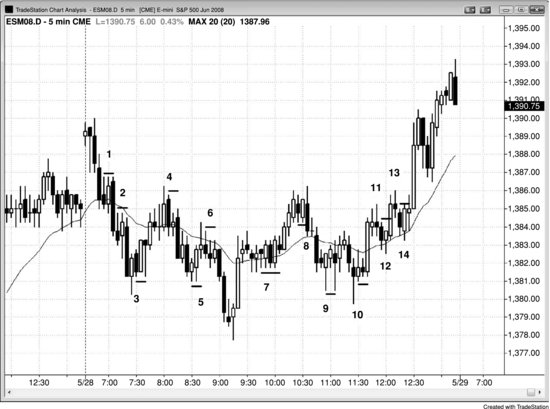
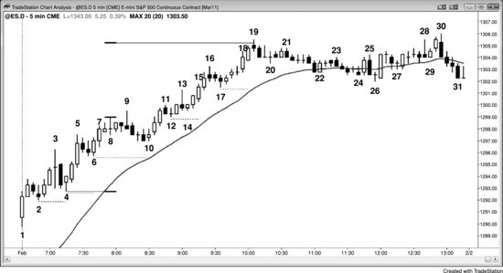
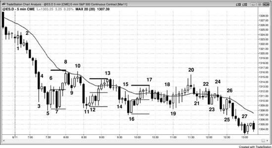
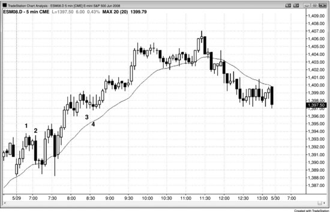
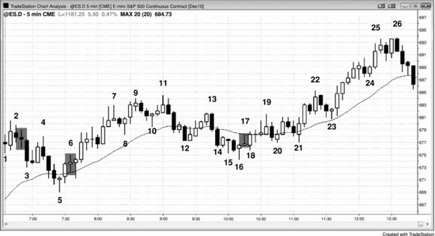

大多数交易的成功率最多只有60%，所以你必须始终为剩下的40%——即交易不及预期的情况——制定应对方案。不要小看这40%：试想有人在30码外朝你开枪，即便命中率只有40%，你也绝不敢掉以轻心。40%是一个非常真实且危险的概率，所以永远要尊重与你判断相反的交易者。应对方案中最重要的一条，就是在市场中挂好保护性止损单，防止行情朝不利方向运行。止损单最好是实际挂入市场的，因为很多采用"心理止损"的交易员，到了最需要止损的时候反而会找各种理由不去执行，结果小亏越拖越大。止损的设置方式有好几种，用哪种都行，最关键的一点是：止损单要真正挂到市场里，而不是只停留在脑子里。

保护性止损主要分两类：一类是资金管理止损，设定一个固定的 Tick 数或金额作为风险上限；另一类是价格行为止损，当市场突破某根K线或某个价位时离场。很多交易员会根据情况将两者结合使用，或二选一。例如，一个在 Emini 上通常使用2点止损的交易员，在K线幅度很大时，可能会把止损放宽到3点。又如，一个刚做多的价格行为交易员，初始保护性卖出止损可能挂在信号K线低点下方1 Tick；但如果那根K线异常大，比如有6个点高，她可能会大幅减少合约数量，或者改用大约3点的资金管理止损。总的来说，最好在大部分时间或所有时间都使用同一种方法，让止损成为固定流程的一部分——每次一进场就自动挂好保护性止损。这样可以省去在不同情况下纠结该用什么类型、多大幅度止损的干扰，让你把注意力集中在判断要不要做这笔交易上。

对于大多数小型剥头皮交易，交易员不希望看到任何回调，一旦出现回调往往马上离场。但如果他们判断市场已经进入趋势通道，通常会容忍小幅回调。举个例子：当天是交易区间日，市场刚从区间底部急速上涨，现在可能正在形成一个小型多头通道，有望测试区间顶部。此时做多者的盈利目标有限，所以这笔交易属于剥头皮。既然市场处于多头通道中，就很可能出现回调——某根K线可能跌破前一根K线低点几个 Tick，但不会跌破通道内最近的波段低点。交易员既然预判市场可能进入通道仍选择做多，就必须愿意承受这些回调，把保护性止损放在通道内最近的波段低点下方。激进且经验丰富的交易员甚至会在前一根K线低点处挂限价单加仓做多，因为他们知道通道中的回调通常只持续一两根K线，之后还会继续走高。

如果交易员做的是波段交易的多头，那他预期的就是一轮多头趋势。多头趋势的特征是不断出现更高高点和更高低点，所以在市场创出新的波段高点之后，把保护性止损上移到最近波段低点下方是合理的，这就是跟踪止损。如果市场涨了5到10根K线后回调到入场价下方，然后再次创出新的波段高点，交易员不会希望市场再跌破那次回调的低点，就会把保护性止损移到那个低点下方1 Tick。很多交易员不想让止损被第二次测试，会直接把止损移到盈亏平衡点。

一旦交易员判断市场突破进入了趋势性交易区间日，就要准备好在第二个交易区间开始形成时调整交易风格。例如，出现了持续两三根K线的多头突破，接着一根K线回调，随后涨势变弱——那根回调K线的低点很可能就是上方交易区间的底部。由于市场通常会回测突破缺口，而且经常回到下方交易区间的顶部，价格很可能跌破那根回调K线的低点。因此，多头不应该把跟踪止损放在那个低点下方，否则会被止损出局。如果原本打算在那里设置保护性止损，更合理的做法是在接下来几根K线中，找一根多头趋势K线在收盘价附近主动止盈离场——这样等于在正在形成的交易区间顶部附近获利了结，而不是在底部下方被止损扫出。一旦市场演变成交易区间，就不应该再用强趋势的思路去交易了。

有些交易员允许价格回调到信号K线之外，只要他们觉得波段交易的前提还成立就行。比如在多头趋势中买入高 2 回调，信号K线大约 2 个点高，即使市场跌破信号K线低点，他们也可能继续持仓，因为觉得这有可能演变成高 3——也就是楔形牛旗做多建仓形态。另一些交易员则会在市场跌破信号K线后先出场，等出现强烈的高 3 做多信号再重新买入。有些人甚至会以第一次仓位 2 倍的规模买入，因为他们认为这个更强的第二次信号更可靠。很多这类交易员在高 2 做多信号看起来不太对劲时，一开始只会建半仓。他们预留了高 2 失败后演变成楔形牛旗的可能性，而楔形牛旗的信号可能看起来更强。真的演变成了楔形牛旗，他们就会放心地用正常的满仓去交易。

另一些交易员在信号不够理想时用半仓交易，保护性止损被打到就先出场，然后如果第二次信号够强就满仓进场。那些在交易反向运行时逐步加仓的交易员，显然不会把信号K线的极值当作初始保护性止损位，很多人恰恰选择在其他交易员止损出场的位置加仓。有些人干脆就用一个宽止损。比如，当 Emini 的日均波幅不到 15 个点时，趋势中的回调很少超过 7 个点。一些交易员会认为，只要市场回调幅度没达到日均波幅的 50% 到 75%，趋势就仍然有效。只要回调在他们的容忍范围内，就继续持仓，相信自己的交易前提是对的。假设他们在多头趋势回调中买入，入场点比当天最高点低 3 个点，那他们可能会设 5 个点的风险。既然他们相信趋势还在，就认为市场有 60% 甚至更高的概率走出等距的移动。也就是说，他们至少有 60% 的把握认为市场会先涨 5 个点，而不是先跌 5 个点打到保护性止损——这就构成了一个盈利的交易者方程。如果最初的做多信号出现在比高点低 5 个点的位置，那他们可能只设 3 个点的风险，并且打算在市场回测高点时出场。因为回调幅度比较大，趋势可能有些走弱，这会让他们倾向于在回测趋势高点时止盈。他们会尽量让利润至少等于风险，但如果担心市场可能正在转入交易区间、甚至反转成空头趋势，也可能愿意在略低于前高的位置就出场。

一旦市场开始进入交易区间，交易员应该考虑在区间高点附近至少部分止盈，而不是单纯依赖跟踪止损。因为市场很可能开始出现跌破前波段低点的回调。一旦交易员觉得自己的止损可能会被打到，就应该在那之前主动出场，特别是利润目标已经基本达成的情况下。

大多数交易的初始价格行为止损设在信号K线外侧一个 tick 的位置，持续到入场K线收盘。如果入场K线很强，就把止损收紧到入场K线外侧一到两个 tick。如果入场K线是十字星，就继续用原来的止损位。记住，十字星就是一根K线的交易区间。如果你刚刚做多，你不会想在一个你认为是多头趋势的市场中、在交易区间下方卖出（同理，如果你刚做空，也不会想在一个新空头趋势中、在交易区间上方买入）。

有经验的交易员可以考虑在可能的新多头趋势中、在小十字星入场K线下方一两个 tick 处加仓（或者在新空头趋势中、在十字星入场K线上方加仓），加仓部分的止损仍然用最初的止损位。他们在低 1 做空信号K线下方买入，是因为他们认为市场会涨，不会跌。低 1 在这里是空头趋势中一段急速空头下跌底部的做空建仓形态，或者是交易区间顶部附近的做空建仓形态（在交易区间内，最好等低 2 再做空），而不是交易区间底部或新多头趋势底部的做空形态。在那种位置做空很可能失败，2 个点的保护性买入突破单比在低 1 信号K线下方设置的 6 个 tick 止盈限价单更容易被触发。这意味着在低 1 信号K线下方买入后，市场可能先涨至少 2 个点，然后才会跌 6 个 tick。既然交易员认为这是新的多头趋势或者至少是交易区间，他们预期市场会涨至少 3 到 4 个点，所以这是一笔合理的做多交易。

如果入场K线走出了反方向，你就得做一个判断。举个例子，假设你在一个强多头趋势中买入回调，信号K线是一根强多头反转K线，出现在一段到达均线的两段式回调末端。这时如果入场K线变成了一根空头反转K线，你通常把保护性止损继续放在信号K线下方就好。但如果你是在一个强空头趋势中买入反转做多，那么一旦市场跌破这根空头入场K线，你通常就该出场。某些情况下，如果背景合理，你甚至应该反手做空。一般来说，如果你觉得做多一旦失败就会形成做空的建仓形态，那你就不该在强空头趋势中做多。极少有交易员能在这种情况下反手，而且如果空头趋势强到低 1 建仓形态还能继续做空的程度，那对多头来说可能(60%+)太强了，不适合找做多机会。多头应该等一波强力反弹出现，然后找一个 HL 回调来买入。在空头趋势中，还没有出现多头能控制市场的证据就急着做多，是一种亏钱的策略。大多数多头反转最终都会变成熊旗，所以除非反转的建仓形态特别强（这一点在第三本书关于趋势反转的章节中有讨论），否则不买更好，应该转而寻找做空机会。

如果入场时K线太大，用资金管理止损更明智——比如在 Emini 5 分钟图上用 8 tick，或者大约 70% 幅度的回调（比斐波那契 62% 回调多几个 tick）。举个例子，在一根大的多头信号K线上做多，你可以把保护性止损放在信号K线底部到入场价这段距离的 30% 处。资金管理止损的大小跟K线的大小成比例。市场到达第一个利润目标、锁定部分利润后，把保护性止损移到盈亏平衡点附近——也就是入场价，即距离信号K线极值一个 tick 的位置。最好的交易不会触发盈亏平衡点止损，而且在 5 分钟 Emini 上，价格很少会超过入场价 4 个 tick 以上（比如做多后价格跌破信号K线高点 3 个 tick）。

如果你对反转非常有信心——因为出现了一根大而强的反转K线，加上其他多个因素的共振——你可以把止损放在那根大信号K线之外，允许入场后出现回调，只要不触发止损就行。你甚至可以允许止损在信号K线之外多留几个点，但如果这样做，一定要算好风险，并相应减小仓位，确保总风险跟其他交易保持一致。另外，如果你有信心认为反转足够强、可能(60%+)走出两段上涨，而且在你剥头皮部分出场后，市场又回穿了原来的入场价几个 tick，你可以继续持有波段仓位，依靠原来的止损扛过这段回调，即使浮亏了好几个 tick。不然的话（比如你是做多的情况），你会在盈亏平衡点把波段仓位平掉，然后在触发止损的那根K线高点上方重新买入——虽然这样会放弃几个点的利润，而你本来认为这是一笔第二段上涨概率很高的交易。

如果你在一个温和的回调中入场，认为回调即将结束，而且K线很小，你可以考虑用你通常的资金管理止损，即使这意味着止损在信号K线之外好几个 tick。举个例子，当天是一个空头趋势日，一个低动量的多头通道上涨到均线，形成了低 4 做空建仓形态，信号K线是一根 3 tick 高的十字星。认为回调即将结束的交易员可能(60%+)会用通常的 8 tick 止损，尽管这样止损会在信号K线上方 4 个 tick。低 4 建仓形态经常出现在窄通道中，入场就是对窄通道的向下突破。窄通道突破后通常会有回调，有时回调会超过信号K线。这种情况下，出现一个 HH 的突破回调并不意外。只要交易员认为自己的入场前提仍然成立，就可以给交易留一些空间。另一种做法是，如果市场涨过入场价或信号K线就先出场，等市场再次转下来时重新卖出；但如果你对自己的分析有信心，可以依靠原来的 8 tick 止损，允许出现 HH 回调。一般来说，如果你正处于一笔亏损的交易中，问问自己：假如现在空仓，你还会做这笔交易吗？如果答案是不会，那就出来。如果你的入场前提已经不成立了，即使亏损也要出场。

如果你担心市场波动剧烈、K线很大，应该只用平时仓位的一部分来交易。把仓位缩减到一半或四分之一，然后下单。假设你要做多，而且有信心某个低点能守住，但这笔多头交易所需的资金管理止损远大于你平时的幅度，那么可以使用更大的止损，然后等着看。如果市场没怎么回调就直接打到你的利润目标，直接止盈即可。但如果价格只超过你的入场价一两个 tick，接着回调到接近止损位，然后又在入场价上方重新上涨，就该把利润目标上调。一般来说，市场上涨的幅度大致等于它迫使你承受的止损幅度。所以如果市场曾跌到你入场价下方 11 个 tick 才反转上涨，那说明 12 个 tick 的止损刚好够用，因此市场很可能至少涨到入场价上方 12 个 tick。明智的做法是挂一个限价单，在目标价下方 1 到 2 个 tick 处止盈，等价格接近目标时，把止损移到盈亏平衡点，然后等着看限价单能否成交。举个例子，假设回调幅度是 11 个 tick，你放在信号K线外侧的止损没有被打掉（也许止损距离是 12 个 tick 甚至 18 个 tick），现在市场重新朝你的方向运行——算一下为了不被止损出场，你总共需要承受多少 tick 的风险。到这个节点，你实际需要承受的风险是 12 个 tick（回调幅度加上 1 个 tick）。现在把利润目标上调到比这个风险少 1 到 2 个 tick 的位置，也就是 11 个 tick。同时把保护性止损调整到那次回调低点再往外 1 个 tick，这样你的风险就是 12 个 tick。

当保护性止损在还没赚到剥头皮利润之前就被打掉时，说明你被套进了一笔糟糕的交易，这时候在止损位反手有时是个好策略。具体要看背景。比如，低 2 做空失败后反手做多，如果你判断市场正在反转进入多头趋势，就是一笔好交易。但如果只是窄幅交易区间里的扫止损，那就不属于反转。花点时间确认自己正确地解读了图表，再考虑反方向的交易。如果来不及马上反手，就等下一个入场形态出现，用不了多久肯定会有。

对一个市场研究足够深入后，你会知道什么是合理的止损幅度。对于 Emini 5 分钟图，当日均波幅在 10 到 15 个点时，大多数日子 8 个 tick 就够用了。但要密切留意开盘第一个小时内所需的最大止损幅度，因为这往往是当天剩余时间最好用的止损参考值。如果止损超过 8 个 tick，你很可能也能相应提高利润目标。不过除非K线特别大，否则这种调整带来的优势很有限。

有两种常见的入场形态通常需要较大的止损，也就意味着要用较小的仓位。两种都涉及在趋势中强急速段的尾端附近入场，但方向相反。当趋势开始时出现一波强急速上涨，连续出现好几根趋势K线，交易员会在K线形成过程中以及收盘时顺势入场。比如，出现一波强势的多头突破，有两根大的多头趋势K线，多头会在第二根K线收盘时买入，也会在它的高点上方买入。如果后面接着出现第三、第四、第五根连续的多头趋势K线，多头会随着急速段不断延伸而持续买入。所有这些入场点的理论止损位都在急速段底部下方，距离很远。如果用那个位置做止损，就必须把仓位缩得很小，才能让风险保持在可承受的范围内。实际上大多数交易员会在急速段后期入场时选择做剥头皮，用较大的仓位配较小的止损。这是因为回调出现的可能性越来越大，等回调出现后就可以在更低的价格建立波段仓位，配一个更小的止损，比如放在信号K线下方。

第二种需要在大趋势K线形成期间入场、因而不得不用宽止损的情况，是逆势入场。举个例子，假设市场连续出现三波卖出高潮，其间没有明显回调，而第三波中出现了当天最大的一根空头趋势K线，收盘价接近最低点。激进的多头会在这根K线收盘时买入，预期这里就是或接近波段低点，之后会有一波强劲反弹。这种情况下，保护性止损没有绝对靠谱的放法，但有一个原则：既然交易员预期反弹至少能到那根大空头趋势K线的高点，而且对这笔交易有 60% 的把握，那止损的 tick 数大致应该跟那根空头趋势K线的高度相当。这个话题在第三册关于高潮的章节中会进一步讨论。对于非常有经验的交易员来说，这可以是一笔靠谱的交易。这种时刻成交量往往很大，说明机构也在大量买入。空头在回补获利了结，多头在积极买入。双方通常都等着一根大空头趋势K线跌入支撑区域作为衰竭信号，然后大举买入。因为他们预期底部即将形成，所以在支撑位上方就停止买入、退到一边观望，这就制造了一个抛压真空效应，表现为那根大空头趋势K线。

还有很多特殊情况下交易员会使用异常宽的保护性止损。我有个朋友专门寻找弱通道，然后逆着通道方向分批建仓，预期反转。比如，市场在一波多头急速之后进入多头通道，而通道本身并不特别强，他就会在通道内前一个波段高点挂限价单做空，仓位只用正常的四分之一。如果通道继续运行，他会在接下来两三个波段高点上方加仓。当 Emini 的平均日内波幅大约在 10 到 15 个点时，他最终的止损距第一笔入场大约 8 个点，目标是价格回测到第一笔入场的位置。一旦反转开始，如果他认为反转力度够强，通常会把一部分仓位以波段交易的方式持有到第一笔入场价下方。

在楼梯形态或趋势性交易区间的交易日中，交易员可以用宽止损来押注突破失败。如果 Emini 的平均波幅大约在 10 到 15 个点，某次突破运行了大约 5 个点，交易员可以押注突破失败，用大约 5 个点的风险去赚 5 个点，预期价格会回测突破位。在典型情况下，这笔交易的成功概率超过 60%，因此交易者方程为正。

交易员有时会在大趋势末端押注单K线最终旗形的大趋势K线突破失败，预期那根趋势K线是一个衰竭型高潮（这在第三册关于高潮反转的章节中有讨论）。比如，一段多头趋势已经运行了大约 30 根K线，只有小幅回调，接着出现一根大多头趋势K线，随后是一到两根K线的回调。如果下一根K线也是一根大多头趋势K线，多头和空头都会在它收盘时卖出。多头卖出是为了止盈，激进的空头卖出是为了建立空头仓位。空头的止损大致设在那根K线的高度（如果K线高 10 个 tick，止损就用大约 10 个 tick），初始目标是价格回测到那根K线的底部，下一个目标是一个测量移动的下跌幅度。

我另一个朋友在 Emini 做回调入场时，固定用 5 个点的止损。他觉得自己没法每次都精准判断回调的终点，所以在他认为趋势恢复时就入场。他的假设是：自己有时候会进早了，回调可能还会再走一段才真正恢复趋势，宽止损让他能留在场内。他的利润目标是价格回测到趋势的极端点，大约 3 到 5 个点。如果趋势恢复的力度很强，他会把交易转为波段交易，目标 5 个点以上。虽然这个方法有很多变体，但平均风险大致跟平均回报差不多，又因为这是一个顺势策略，概率至少 60%，所以交易者方程为正。

只要交易员用了宽止损，一旦市场开始朝有利方向运动，通常就能收紧止损、大幅降低风险。波段交易走到利润目标大约一半时，很多交易员会把保护性止损移到盈亏平衡点。如果市场强势地朝有利方向运动，成功概率会上升，潜在回报可以保持不变甚至调高，而风险变小了。这让交易者方程变得更强，也正是很多交易员宁愿等到市场走到这个位置再入场的原因。但如果反转非常弱，虽然交易员可以收紧止损、降低风险，但成功概率也会下降，他们可能还得缩小目标（收紧止盈限价单）。如果交易者方程弱到一定程度，他们可能会尝试以小利剥头皮出场，然后等下一笔交易。

交易的目标是赚钱，这就要求交易者方程为正。K线幅度大的时候，止损必须设得宽，但目标也要相应放大，才能保证交易者方程为正。同时，仓位大小也应该相应缩减。

一个大市场里，可能有上百家机构在活跃交易，每家大约贡献总成交量的 1%。剩下 99% 的成交量中，个人交易者只占 5%。机构赚钱的对象是其他机构——那占了市场的 94%，而不是散户那 5%。机构根本不在乎我们，也没有刻意去打散户的止损。你的止损被打掉，跟你个人没有任何关系。比如你做多，保护性卖出止损被触发了，应该认为至少有一家机构也想在那个价位卖出。散户同时做同一件事、且能提供足够成交量去吸引机构的情况非常少见，所以最好这样理解：只有同时有一家机构愿意在那个价位买、另一家愿意在那个价位卖，市场才会在那个价格成交。

**图 29.1** 初始止损设在信号K线的另一侧

图 29.1 中，初始止损设在信号K线之外一个 tick 的位置。入场K线收盘后，如果这根K线很强，就把止损移到入场K线之外一个 tick。如果风险太大，可以改用资金管理止损，或者把风险控制在信号K线高度的大约 60%。

如果你在K线 1 处做空——跌破空头内包K线时入场——初始止损就设在信号K线上方。K线 1 这根入场K线入场后立刻反弹，但没有超过信号K线的顶部，所以这笔做空最终是一笔盈利的剥头皮交易。入场K线收盘后，只要它是多头或空头趋势K线而不是十字星，就把止损移到其高点上方一个 tick。这个例子中，信号K线和入场K线的最高价相同，所以止损不需要收紧。

K线 3 之前那根K线是一根多头反转K线，出现在开盘后的三连推下跌之后。虽然在窄空头通道中做多第一次突破通常不是好交易，但第一个小时内的反转通常是可靠的，尤其是前一天收盘很强的时候（看均线在昨天收盘前的陡峭斜率就知道了）。K线 3 这根入场K线入场后立刻下跌，但没有跌破信号K线的低点，也没有跌到信号K线高度的 70% 以下（如果你觉得这根信号K线太大、不适合在其低点下方设置价格行为止损，改用资金管理止损的话）。入场K线收盘后，保护性止损应该上移到其低点下方一个 tick。如果市场跌破了入场K线的低点，很多交易者会做空，因为这是一个突破回调做空建仓形态。不过，由于这并不是一根强空头急速K线，这个低 1 做空并不可靠。另一种做法是把止损留在信号K线下方，但在强空头趋势中抄底时，如果市场跌破一根强空头趋势K线——而它同时也是一根低 1 做空信号K线——继续持有多头是有风险的。

两根K线之后出现了一根回调K线，但没有触及止损，精确测试了入场K线的低点，形成了一个双底。既然这个楔形底部可能（60%+）会有两段上涨，有经验的交易者继续持仓、扛过入场后两根K线的回调、依赖入场K线下方的止损，是合理的。否则你会被止损出场亏掉 7 个 tick，然后又在回调K线的高点上方买入去追第二段上涨；入场价会差 3 个 tick，总共差了 10 个 tick。

K线 4 处回调到均线，与K线 1 区域形成双顶，也是一个小型楔形熊旗。其他交易者会把它看作均线处的一个简单低 2。K线 4 低 2 做空的初始保护性止损没有被触发，尽管入场后两根K线出现了一根回调K线。止损设在信号K线上方，在市场朝你的方向移动大约 4 个 tick、或者出现一根实体较强的空头K线之前，不要急着把止损收紧到最近那根K线上方。给交易一些时间来运作。入场K线是十字星时，通常可以容忍 1 到 2 个 tick 的回调。十字星是一个单K线交易区间，在交易区间上方做多是有风险的，所以不要在那里回补空头。在市场朝你的方向至少走了几个 tick 之前，依赖你最初的止损。

K线 5 做多后立刻下跌去测试信号K线的低点（这在 1 分钟图上可以看到，这里没有展示），形成了一个微型双底，然后变成一笔成功的多头剥头皮交易。依赖你的止损，不要去看 1 分钟图。用 5 分钟图入场，就用 5 分钟图的止损，否则你会输得太频繁，大量交易会因为想少冒一点风险而被止损出局。

K线 7 是强多头急速运动之后出现的一个高点 2 做多信号。市场测试了信号K线下方的止损位，差一个 tick 没有触及，随后又测试了收紧到入场K线下方的止损位，两次均未被打掉。入场前出现的十字星增加了这笔交易的风险，但市场从日内新低急速上涨、连续 6 根K线收在均线上方，在这样的背景下，这是一个可以接受的做多建仓形态，因为你理应预期还会出现第二段上涨。

K线 8 的 ii 形态是一个高点 1 做多建仓形态。但它并不是出现在强多头趋势中强多头急速的顶部，所以算不上一个好的交易。实际上，它位于从日内低点急速上涨后的多头通道顶部附近，接近测量移动的目标位，而且可能正在与K线 4 形成双顶。由于交易区间中大多数突破尝试都会失败，市场向下走的概率约为 60%，突破成功的概率仅有 40%。确切的概率无法精确知道，但 60 对 40 是交易区间突破尝试的一个实用经验法则。激进的交易者会在 ii 形态高点用限价单做空，预期这是一个多头陷阱。反过来，如果交易者在K线 8 的 ii 形态上方买入，保护性止损在入场K线就会被打掉；这本身是一个不错的反转机会，大多数失败的 ii 形态都是如此。

如果你在K线 11 这个波段高点、接近交易区间日内顶部的位置做空，可以在K线 12 这根测试均线的反转K线处反手做多，也可以在K线 11 做空后、于入场K线高点上方一个 tick 的买入突破单处反手。

K线 13 波段高点的做空、低点 2 变成了 5 个 tick 的失败，即一个失败的低点 2。你应该在K线 14 处反手做多，入场价位是入场K线（K线 13 信号K线之后那根K线）高点上方一个 tick，因为有空头被套住，你理应预期至少还有两段上涨。如果你没有在那里买入，也应该在K线 14 之后那根K线买入，因为K线 14 是一个两K线反转向上，同时也是均线上方的高点 2 买入信号，出现在一个可能的多头趋势中，而且信号K线是多头K线。每当交易者在摸顶交易时，看到均线处出现高点 2 买入信号且信号K线为多头K线，就应该果断退出空头仓位并反手做多。即便他们本身没有空头仓位，也应该直接做多。这本来就不是一个好的做空建仓形态，因为市场可能正处于大型楔形牛旗突破后的回调过程中。两根K线之前的那根强多头趋势K线就是突破K线，三连推向下始于K线 7 附近的K线（往前数三根是一个合理的选择），然后是K线 9，以及K线 10 之前那根K线。上涨到K线 8 的走势突破了前几个小时的空头通道，K线 10 是突破空头趋势线后更高低点处的二次入场点。有些交易者在K线 10 处买入，因为他们把这里看作一个头肩底。另一些交易者用限价单在K线 13 低点 2 下方买入，因为他们认为当前是多头趋势而非交易区间——在多头趋势中，低点 2 是做多建仓形态。低点 2 只有在交易区间或空头趋势中才是做空建仓形态。当市场处于多头阶段时，交易者会把低点 2 视为空头陷阱，在其下方买入以捕捉向上的反转。还有些交易者会选择在低点 2 入场K线高点上方一个 tick 处挂买入突破单，等待失败确认信号出现后再入场。

如果交易者从K线 12 开始持有波段多头仓位，那么在市场创出新高之后，就可以把止损移到最近的波段低点下方一个 tick。因此，一旦市场涨过K线 13 的波段高点，就可以把保护性止损上移到K线 14 这个更高低点的下方。

**图 29.2** 强多头趋势中的跟踪止损

在强多头趋势中，交易者通常在市场创出新的波段高点后，把保护性止损跟踪到最近的波段低点下方。一旦市场看起来要进入交易区间，交易者就应该先获利了结一部分仓位，并考虑以更小的目标进行剥头皮交易。

如图 29.2 所示，今天大幅跳空高开，第一根K线就是一根强多头趋势K线，因此很有可能（60% 以上）演变成始于开盘的趋势日。如果交易者在K线 2 或K线 4 上方买入，那么当K线 5 涨过最近的波段高点K线 3 时，就可以开始跟踪保护性止损了。截至K线 5 的三根K线多头急速让大多数交易者确信，始终持仓的方向是做多且势头强劲，所以很多人希望让利润继续奔跑。当K线 7 涨过K线 5 后，可以把保护性止损收紧到K线 6 下方一个 tick；当市场涨过K线 9 后，再把止损上移到K线 10 下方一个 tick。

交易员都知道，趋势在某个阶段通常（60%+）会出现较大的回调，很多人一旦判断更复杂的回调即将到来，就会部分或全部止盈。测量移动目标往往能帮你判断机构可能在哪里止盈，也就是回调可能从哪里开始。最初的强多头急速阶段从K线 4 开始、在K线 8 附近结束，从这里向上的测量移动就是一个可能（60%+）出现止盈的位置。K线 10 到K线 19 的上涨也走了三段，三段式走势是楔形的变体（即使像这样出现在陡峭的通道里），之后可能跟着一波较大的回调。最初的目标是均线。K线 18 是一根大的多头趋势K线，紧接着又是一根大的多头趋势K线，这个两K线买入高潮出现在一段持续已久的趋势末尾。这种情况发生时，市场往往至少回调 10 根K线、走出两段，尤其是当价格远离均线的时候——这里正是如此。当K线 19 变成一根空头反转K线时，很多交易员止盈了。也有交易员认为第一波回调之后至少还会再创一次新高，所以持仓不动，扛过了回调。不过，临近收盘时市场涨到K线 19 上方，K线 30 出现了激进的止盈行为，很多交易员在新高处止盈，市场随之回落。

当天是一个非常强的多头趋势日，回调到均线之后可能（60%+）会再测试高点。下跌到K线 24 的空头通道动量很弱、K线很小。如果交易员在K线 24 上方买入，可以考虑用常规的 8 tick 止损，以防空头通道突破后（所有空头通道都是牛旗）出现更低低点的突破回调。市场随后强力向上突破，但紧接着就形成了一个大的两K线空头反转。在一个正回调到均线的强多头趋势里，这不是一个可靠的做空建仓形态。有经验的交易员会坚持持仓、依赖自己的止损，即使止损在信号K线下方好几个 tick。止损不会被触发，交易员之后可以在当天高点附近退出多头仓位。另一种做法是，先在K线 25 两K线反转下方退出，然后在K线 26 微型通道突破回调上方重新买入。

在强多头趋势中，如果波段交易员在K线 19 买入高潮之前的任意位置买入，理想的做法是把保护性止损放在最近的波段低点下方，这意味着风险超过 2 个点，用的是宽止损。一旦K线 19 买入高潮形成，市场可能（60%+）进入交易区间，交易员就该切换到交易区间的操作方式——从波段交易改为剥头皮。既然市场正在进入交易区间，价格可能（60%+）会跌破之前的波段低点，那么把保护性止损放在那里就不再合理了。一旦因为交易区间正在形成，止损可能（60%+）被触发，交易员就应该在那之前尽早退出多头。精明的交易员会在可能正在形成的交易区间顶部趁强退出，比如在K线 19 下方。激进的交易员甚至会在那个位置开始做空，目标是剥到均线附近的头皮。

大多数波段交易员会把保护性止损跟踪到最近波段低点的下方。有些交易员不愿意一直持仓直到趋势结束，而是倾向于用利润目标来退出。这类交易员通常在市场走到利润目标一半的位置时，就会把保护性止损移到至少盈亏平衡点的位置。

**图 29.3** 回报往往等于风险

市场给交易员的利润 tick 数，往往跟它迫使交易员承受的风险 tick 数差不多。一般来说，在空头趋势日里在大信号K线上方买入是高风险的，这里基于图 29.3 描述的交易充其量也只是勉强可做，但它们能说明一个要点。

如果交易员在K线 5 上方买入——认为这是连续第二个卖出高潮、抛物线式下跌的底部，因此可能（60%+）跟着一波两段式反弹——那么初始止损会放在K线 5 低点下方。K线 7 测试了低点但没有触及止损。不过，一旦市场涨过K线 7，交易员就会把止损移到K线 7 低点下方 1 tick 的位置，距离入场价 16 tick。市场随后精确地涨到了K线 8 的高点，正好在入场价上方 16 tick（同时也是对均线的测试，空头在那里进场了）。理解这种规律的交易员会在入场价上方 15 tick 的位置挂一张止盈限价单。因为他们是在自己认为会成为小交易区间底部的地方买入的，所以相信市场至少有 60% 的概率走出等距的向上移动。这笔交易勉强算是可以做的。

同样的情况在K线 12 和K线 16 这两根强多头趋势K线上方做多时又重复出现了。一旦出现回调然后市场再次回升，交易员就能看到市场迫使他们承受了多少风险，然后可以在比那个风险少 1 tick 的位置挂止盈限价单。

在K线 2 到K线 3 的空头急速阶段中任何位置做空的交易员，如果打算做波段交易，会设一个较宽的保护性止损，可能放在急速阶段顶部上方。多数交易员不愿承担那么大的风险，但他们的风险也会是剥头皮时的两到三倍。

在K线 16 处，假设一位多头交易员在第三次下推之后的反转处买入，博的是最终旗形趋势反转。因为从K线 13 开始的下行通道很窄，如果等到突破确认强势后再买入——买强势急速段或随后的回调——做多成功的概率会更高。但为了说明问题，假设这位交易员直接在K线 16 上方买入。他可能认为市场有 50% 的概率突破K线 13 高点并达到测量移动目标，这样回报远大于风险（风险在K线 16 信号K线下方）。但他可能注意到多头在涨到K线 17 十字星的过程中缺乏力度，由此判断自己最初的前提已经改变。他可能开始认为市场只是在空头通道中再创一个更低高点，而非趋势反转，于是选择剥头皮出场。如果他判断市场正在筑顶，那继续持有多头就不合逻辑了。如果他认为可能还有第二段上涨，但涨不到盈亏平衡点止损的位置，他可以把保护性止损移到盈亏平衡点。如果他认为市场可能跌破入场价但不会跌破信号K线低点、会形成一个更高低点，他可以保持原来的止损不动，也可以先出场，等突破回调到更高低点时再买入。交易员要不断做这类判断，判断能力越强，赚钱能力就越强。如果一直死守最初的前提，即使市场走势已经不符合预期也不调整，交易就很难赚钱。交易员的职责是跟随市场——市场没有按预期走，就应该出场，去找下一笔交易。

波段交易者会容忍回调，耐心等到趋势充分展开后才收紧止损。假设一位交易员在K线 20 下方做空，认为这是对交易区间顶部的测试，会带动始于开盘的空头趋势恢复，目标回报至少是风险的两倍。当他看到强势的空头入场K线后，可能把止损收紧到该K线高点上方；也可能先维持在K线 20 信号K线高点上方，等到市场在K线 24 双顶处转头后再收紧。信号K线高 3 个点（12 个 tick），所以初始风险是 14 个 tick。如果利润目标是风险的两倍，他需要在入场价下方 28 个 tick——也就是 1,305.25——止盈，他的止盈限价单会在K线 27 前两根K线成交。K线 24 曾一度高出K线 23 前面那根强空头趋势K线的高点 1 个 tick，把缺乏耐心的弱势空头扫了出去，但没有越过入场K线或信号K线的高点。

**图 29.4** 止损幅度通常由当天第一笔交易决定

如图 29.4 所示，市场先涨过昨日高点然后转头下行。在K线 1 下方做空的交易员会把初始保护性止损放在K线 1 上方。K线 2 市场转跌后，他们可以算出：市场在朝有利方向运行之前，先反向走了 8 个 tick。也就是说，要保住这笔交易，初始保护性止损最少需要 9 个 tick，这个数字在当天剩余时间里都值得记住。

如果你在K线 3 处买入（押注低 2 失败），初始止损放在信号K线低点下方 1 个 tick，风险就是 8 个 tick。1 个 tick 的扫止损很常见，而盘中早些时候的经验已经告诉你需要 9 个 tick 的止损，所以多冒 1 个 tick 的风险是明智的。这笔买入并不算太好，因为它跟在一个很小的突破后面，最近 7 根K线基本横盘。二次入场会更好。K线 4 是高 2 买入建仓形态，两根K线之后的多头内包K线是突破回调买入建仓形态（内包K线是从高 2 多头突破回调下来的那根）；这两个建仓形态都更强。

一旦K线变小，你可以根据当前市况调整止损幅度。不过当天晚些时候市场往往还会出现需要更大止损的交易。被止损打掉、承受一笔亏损也不必纠结。比起整天不停调整止损、目标和仓位大小——最后反而错过交易或犯更多错——固定止损通常更省心。

**图 29.5** 不要过早收紧止损

入场后如果出现几根小十字星，不要急着收紧保护性止损。十字星就是单根K线的交易区间，市场反向突破一两个 tick 是常事。你不想在交易前提依然成立的情况下被扫止损出场。

如果交易员在K线 2 下方做空，看到入场K线以十字星收盘，应该继续把保护性止损留在信号K线高点上方，直到市场朝有利方向出现明显的强势运动。他们可以在K线 3 的急跌中对部分仓位剥头皮止盈；如果觉得均线斜率陡峭、有反弹风险，可以把止损收到盈亏平衡点，或者收到K线 3 上方一根K线处。这样做的话，K线 4 会触发止损，但这仍然是合理的决策。不过在大幅跳空高开、随后回调靠近均线的日子里，通常还会有第二段下跌、进一步测试均线附近；这往往就形成了当日低点，就像这里的K线 5 一样。

如果交易员在K线 5 上方买入——K线 5 同时是均线缺口K线、高 2 和楔形牛旗的测试——在入场K线收盘后确认是一根强多头趋势K线时，可以把波段仓位的保护性止损移到盈亏平衡点。他们不会因为K线 6 是十字星就在其低点下方出场。

如果交易员在K线 16 多头反转K线上方买入，把它看作高 2 做多或楔形牛旗（其中K线 8 或K线 10 构成第一推），入场K线变成十字星后不应收紧止损。但K线 18 一旦成为强多头趋势K线，就应该把止损移到它的低点下方。
