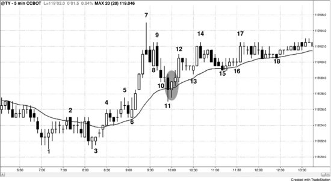
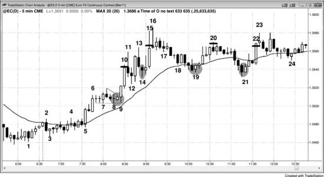

所有的回调和反转都始于止盈。经验丰富的交易员会在市场强势时出场，等回调出现后再重新入场。举个例子，如果一轮多头趋势刚刚启动且特别强劲，多头会在市场突破最近波段高点时通过突破单加仓买入。但随着趋势逐渐成熟、双边交易增多，他们就不再在最近波段高点上方通过突破单买入了。相反，随着上涨动力减弱，他们会在前高附近甚至略低的位置开始止盈。如果大多数多头都在前高附近止盈、不再追涨买突破，市场就会开始回调。这说明多头更愿意在更低的价格买入——他们相信回调会给他们这个机会，所以不再追高，不再在前高上方买入。如果止盈力度很大，同时又有持续、强势的做空力量，回调就会演变成大幅修正（交易区间），甚至演变成反转。多头还会在任何强势迹象出现时止盈，比如在一根大阳线（多头趋势K线）的收盘价附近及上方止盈，或者在接下来一两根K线的收盘价附近止盈——尤其是后续K线较小、或以阴线收盘的时候。如果价格跌破下一根K线的低点，他们会止盈更多仓位。这就是为什么很多大趋势K线（即突破尝试）后面往往跟着小K线和回调——意味着突破失败了。交易员还会在前一根K线低点下方、最近的更高低点下方、或盈亏平衡点设置保护性止损突破单。原因在于：如果市场在到达目标之前就强势反转，他们通常会觉得先出场、再在更好的价位重新买入更划算。空头看到同样的情况，也会开始做空——通常先在新高或强势多头趋势K线收盘价附近做剥头皮空单。随着回调幅度加深，他们会把部分仓位转为波段交易。起初，波段部分通常会被止损出场，但随着修正幅度越来越深、或者趋势最终反转，他们终将获得丰厚的波段利润。

空头趋势中交易员的行为类似。趋势强劲时，空头会通过突破单在波段低点下方做空；但随着趋势减弱，他们会转而在最近波段低点附近及下方平掉空单，然后等更高的位置再次做空。多头剥头皮者会在新低买入，在小幅反弹中止盈出场——差不多就是空头重新做空的位置。多头和空头都在等一根相对较大的、突破到新低的空头趋势K线出现，一旦出现，双方都会在这根K线的收盘价附近买入。随着空头趋势中的反弹越来越强，多头会更愿意把部分仓位转为波段持有。到了某个节点，市场就会过渡到一轮大的多头波段或趋势，整个过程开始反向运行。理解制造突破的趋势K线，是交易员能掌握的最重要技能之一。交易员需要判断：一个突破是大概率会成功，还是会遭遇止盈和回调，还是会被反转。这三种情况在这三本书的其他部分都有详细讨论。

当你入场交易时，目标是让市场先触及你的利润目标，而不是先触及你的保护性止损。与保护性止损不同——只要持仓就必须挂在市场里——利润目标可以实际挂单，也可以只在心里设定。比如，如果你在一轮强趋势中做波段交易，可以沿途对部分仓位止盈（即分批出场），同时保留一部分仓位，等到出现反向信号再出场。一旦反向信号触发，就应该离场。极少有交易员能做到同时平掉盈利的波段仓位、又在反方向建立新仓位。

剥头皮者通常在入场后立刻挂出OCO委托（即"一个撤销另一个"委托）。比如，他们在一个回调中买入AAPL，做100美分的剥头皮，冒50美分的风险，前提是他们有60%或更高的把握认为这笔交易会成功。一旦入场，初始委托通常会自动生成两个挂单：一个是入场价下方50美分的卖出保护性止损突破单，一个是入场价上方100美分的卖出限价单。因为这组括号委托是OCO的，其中一个成交后，另一个就自动取消。不管你怎么管理委托，每次入场和出场后都应该检查账户，确认当前仓位和挂单跟你预想的一致。你不想出现这种情况：明明已经空仓了，却还有一个买入限价单挂着——你以为它早该被自动取消了。永远不要假设券商的软件百分之百可靠，也不要假设你的下单操作每次都没出错。任何环节都有一定的出错概率，你应该在自认为操作完成之后，再确认一遍是否真的完成了。

所有交易都应该以交易者方程为基础。新手应当优先选择胜率60%以上、回报至少与风险相当（最好达到风险2倍左右）的交易机会，不过具备这种强交易者方程的建仓形态，一天平均也就出现几次。举个例子，欧元外汇期货或其对应的外汇品种 EUR/USD，最近日均波幅大约100 tick（也常叫 pip），每天都有好几段20 tick的行情，其间10 tick的保护性止损不会被打掉。交易员可以考虑在趋势回调到均线时入场，胜率可能（60%+）在60%以上。仔细筛选建仓形态后，交易员大约有60%的概率赚到20 tick，同时只承担约10 tick的风险——这就是一个非常好的交易者方程。再看10年期美国国债期货，日均波幅约32 tick（即16/32个点），很多信号K线高度为4 tick，交易员同样可以在回调到均线时入场，冒大约6 tick的风险，设定8 tick的利润目标。这同样是一个很强的交易者方程。

剥头皮和波段交易的仓位管理方式不同。做剥头皮的交易员认为利润空间有限，要么因为没有趋势，要么因为是在逆势交易。在交易区间里剥头皮可以是一种盈利策略，但只有最有经验的交易员才应该考虑逆势交易。跟耐心等回调、顺势入场相比，逆势交易赚到钱的可能性小得多。一旦你判断存在趋势，就必须接受一个事实：80%的反转尝试都会失败，最终演变成旗形。这意味着大多数交易员几乎不可能靠逆势用突破单入场来持续盈利。比如，你觉得强多头趋势顶部出现了一根小的空头反转K线，后面会回调到均线，于是在那根K线低点下方一个 tick 的位置用突破单做空。但你要知道，非常聪明的多头交易者在那根K线低点挂着限价单等着买入，概率站在他们那边。如果你交易的是 Emini，市场需要跌到那根K线低点下方10 tick，你才能在空单上赚到8 tick的利润。但强多头趋势中的大多数回调，在跌到那个位置之前就会形成高1或高2的做多建仓形态，你最终会亏钱。如果你看到市场处于强趋势中，想在回调时做多，就不要自欺欺人地以为自己有能力在等待做多建仓形态的过程中靠做空剥头皮赚钱。结果几乎总是这样：你在空单剥头皮上亏了钱，等做多建仓形态出现时却不敢进场——因为你一直盼着再跌一点，拒绝承认回调即将结束，最终错过了一笔可能赚好几个点的多头交易。

当趋势转变为交易区间后，逆势交易实际上就不算真正的逆势了，因为趋势已经暂时结束。但很多交易员总想去抄多头趋势的顶或空头趋势的底，以为市场马上要进入交易区间，觉得风险很小，结果只能眼睁睁看着账户一点点亏下去。

不管做什么交易，入场之后都要有止盈计划，否则市场迟早会反过来，利润变成亏损。仓位管理完全取决于交易者方程，只要风险、回报和概率的组合能带来持续盈利，就是有效的策略。一般来说，大多数交易员应该只做高概率交易，而且风险至少要和潜在回报相当。理想状态下，交易员应该寻找胜率60%以上、潜在回报约为风险2倍的建仓形态，但通常只能退而求其次——回报跟风险差不多大，或者稍微大一点。这种机会最常出现在趋势中的回调。

在强趋势中做波段交易时，交易者很容易过早止盈，因为实在难以相信行情能跑出初始止损幅度5倍甚至更多的利润。然而，强趋势中确实会出现这种情况。如果你判断趋势很强，一个合理的做法是：当市场朝有利方向运行了大约2倍初始保护性止损的距离后，先平掉一半仓位。举例来说，假设你在 Emini 中的初始止损是2个点，在一轮强空头趋势中，你认为这是一波大级别下跌波段的起点，于是做空——那就在入场价下方4个点处挂限价单，平掉一半仓位。到了这个位置，开始使用跟踪止损。你可以在3倍初始止损距离（6个点）处再平掉四分之一，剩下的四分之一让它继续持有，直到出现强多头信号或者当天收盘，以先到者为准。不过，如果你不习惯分批出场，在2倍风险的位置一次性全部平仓也是合理的。你随时可以在下一个信号出现时重新入场。

交易者方程随着每一个 Tick 的变化而变化。如果交易者方程仍然有利但不如之前那么强，经验丰富的交易员通常会收紧保护性止损，或者拿一个较小的利润出场。如果交易者方程变得勉强，就应该尽快出场，尽量拿到大一点的利润或者小一点的亏损。如果变成负值，应该立刻市价出场，即使这意味着亏损。有一个判断是否该出场的方法：假设你手上没有任何仓位，然后看看当前市场——你是否愿意在这个位置市价入场、用那个保护性止损？如果你不愿意，说明你当前持仓的交易者方程已经很弱或者已是负值，应该出场。

请记住，止盈目标和保护性止损是一体两面，都是为了防止你跟自己过不去。止盈目标迫使你在交易者方程仍为正值时落袋为安，避免你持仓太久，等到价格回到入场价甚至变成亏损才出场。正如大多数交易员最好始终在市场里挂着保护性止损一样，最好也始终挂着止盈限价单。

**图 30.1** 回调在多种支撑汇聚处结束

在有趋势的市场中，在回调到均线附近入场是一种可靠的方法，成功概率通常至少60%，潜在回报大于风险。图 30.1 中，从K线6开始的强劲四K线多头急速上涨之后，出现了一波急速回调至均线。K线11之后的多头内包K线是一根合理的做多信号K线。由于该K线高度为4个 Tick，初始风险为6个 Tick。有些交易员把这个建仓形态看作高 2，另一些人看作窄楔形，其中K线8和K线10的低点是前两次下推。斐波那契交易者把它看作62%的回撤，它同时也是对K线4高点的突破回测，距离盈亏平衡点仅差1个 Tick。回调结束时，回调底部所处的位置通常都有多个数学上合乎逻辑的理由。不同的机构依据不同的理由入场，但当多种理由在同一区域汇聚时，就有足够多的机构在此买入，压倒空头，回调就此结束。

市场有可能（概率60%以上）在K线9高点附近遇到阻力。空头把K线9高点视为从K线7到K线8低点那波急速下跌之后的通道起点，他们期待形成双顶熊旗，很多人会等到市场测试K线9高点时才做空。这批空头的暂时缺席反而增加了价格触及该水平的概率。K线9的高点恰好比信号K线高点高出10个 Tick，这正是多头挂限价单出场、拿到8个 Tick 利润（4/32个点）所需的距离。在主要市场中，一切都基于数学，因为大量交易由计算机完成，而计算机必须依赖数学来做决策。

**图 30.2** 在多头趋势中买入回调

在欧元外汇期货（或其对应的外汇品种 EUR/USD）中买入回调是一种可靠的交易方法。在欧元品种上，如果交易员精心挑选建仓形态，止盈目标往往可以达到止损的2倍左右。注意图 30.2 中，K线9处的三角形突破毫不犹豫地快速上涨。那根小的多头内包K线就是买入信号，它的高点距离 Ledge 的低点只有8个 Tick，因此风险为10个 Tick。既然这根内包K线是买入信号，在K线9突破它上方、形成外包K线时买入是合理的。交易员可以在入场价上方20个 Tick 处挂止盈限价单，在K线10顶部附近（小黑色水平线位置）成交。

交易员随后可以在K线14的双底处买入——这同时也是基于K线12高1的高2入场点，以及K线12小牛旗突破后的突破回调——然后在K线15处、刚好在K线13高点上方止盈，拿到20 tick的利润。K线14的信号K线高度为14 tick，所以初始风险是16 tick。由于这是趋势中的回调做多，成功概率至少有60%。

K线19是一根多头反转K线，也是强多头趋势中第一次回调到均线的位置。这根K线高度为8 tick，所以风险是10 tick。交易员可以在K线20顶部稍下方出场，那里恰好在信号K线高点上方22 tick处。由于限价单挂在信号K线高点上方21 tick，多头可以拿到20 tick的利润出场。此时市场可能（60%+）已经进入交易区间，因为K线16是一根向下的急速（十字星顶部实际上是在同一根K线内先向上急速、再向下急速），从K线16到K线19的下跌走势则构成一个通道。市场可能（60%+）会测试通道顶部并形成双顶，交易区间也可能（60%+）继续扩大——后来确实如此。正因如此，在K线19上方做多时选择剥头皮更合适。止盈目标设在20 tick，在通道顶部下方仍有空间可以成交，所以在这里全部平掉多头剥头皮仓位是合理的。

交易员还可以在K线21的两K线反转上方再次买入，因为它与K线19构成双底，同时也是第一根均线缺口K线（即该趋势中第一根高点低于均线的K线）。风险是11 tick，交易员可以在K线22高点稍下方止盈，拿到20 tick的利润。

如果交易员买入了K线9的三角形突破，在看到两K线多头急速的强势表现后，可以改变原来的计划。不必在20 tick处全部平仓，而是先平掉一半，然后挂限价单在更高10或20 tick的位置再平掉四分之一，剩下的仓位一直持有到收盘，或者等到出现明确的做空信号再出场。K线16的卖出高潮可能（60%+）引发一波回调到均线的走势，交易员在K线16下方出场（或在两根K线之后的空头内包K线下方出场）是合理的，之后可以在均线处再次买入。不过，如果一直在分批平仓、手里只剩四分之一仓位，也可以选择持有到收盘，因为多头可能（60%+）会在均线处重新入场，并且有机会在收盘前把价格推到新高。

K线21的多头仓位仍然处于交易区间内，但它与K线19构成了双底牛旗，因此市场在收盘前创新高的概率是合理的。虽然大多数交易区间顶部的突破尝试都会失败，交易员可以据此在20 tick处全部剥头皮出场，但这次两段式回调后成功突破的概率更高，而且强多头趋势日往往在尾盘还会再涨一波创新高。所以交易员可以把四分之一到一半的多头仓位做波段持有，以防万一。
