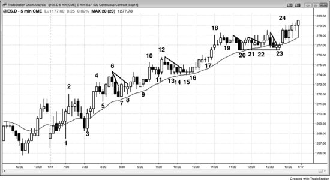
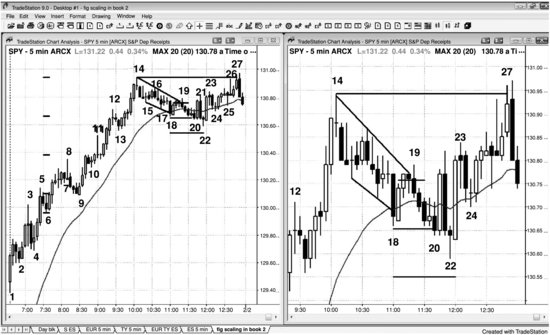
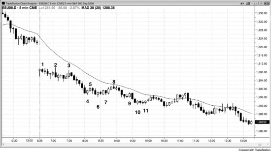
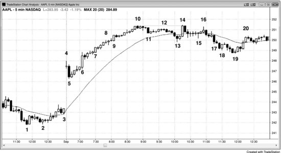
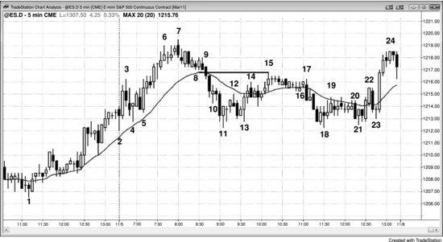
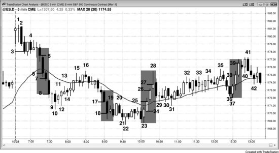
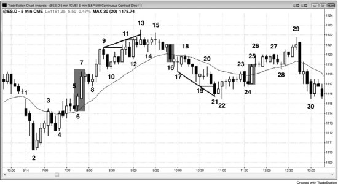
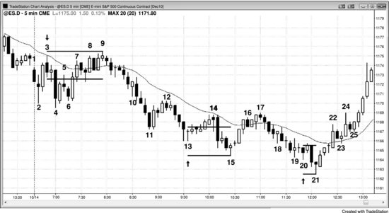

分批建仓的意思很简单：你已经持有仓位，然后在同一方向上再次入场加仓。分批平仓则是：出场时不一次性全部平掉，而是先平一部分，剩下的等更好的价位再平。愿意分批平仓的交易员比愿意分批建仓的多得多，实际上很多交易员都习惯分批平仓。比如，先平一部分做剥头皮，剩下的仓位留着做波段，这就是分批平仓。

分批建仓就是逐步增加仓位。共同基金之类的机构必须不断地分批建仓和分批平仓，因为每天都有新资金流入，也有赎回请求要处理。个人交易员常见的分批建仓场景有三种：顺势回调时加仓、在交易区间的极端位置押注失败，以及摊低成本。在潜在反转位置分批建仓风险非常高——通常更好的做法是：一旦市场走反就先砍仓出来，然后寻找二次入场点。

分批建仓既可以在浮亏时加仓，也可以在浮盈时加仓。浮盈时继续加仓，也叫追涨（多头加仓）或杀跌（空头加仓）。举个例子，市场处于多头通道中，多头会在每次回调时加仓，随着价格不断走高逐步加码。强多头急速阶段也是一样，很多交易员会在急速上涨的过程中快速加仓做多，一根K线接一根K线地追。强急速行情总会制造出交易者方程极佳的短暂机会，有些交易员很擅长在这种快速行情中追涨加仓。每次新加的仓位价格通常更高，而之前所有的入场点都已经是浮盈。至于在多头通道中做空的空头，他们是在前一根K线高点上方分批入场，随着价格继续走高不断加仓。每一笔之前的入场都在扩大浮亏，但空头预期一旦市场反转，整体就能盈利。我有个朋友，是 Emini 中分批逆势入场做通道反转的高手，目标是等市场回测通道起点时止盈。比如，如果 Emini 最近的日均波幅大约在 10 到 15 个点，当天出现了急速与通道的多头趋势，已经有过几次上推，而且走势并不是特别强，他就会在最近的波段高点用限价单开始做空，然后在接下来的一到两个新高处加仓，前提是每次新入场的价格至少比上一次高 2 个点。每次入场大约 10 手，总共一到三次入场。多年前我跟他聊过很多次他做这种交易的情况，市场从来没有超过他第二或第三次入场太远就开始反转朝他的方向走了，所以止损从来不是我们聊天的话题。不过我推测他的止损至少在最后一次入场价上方几个点。按我的计算，他 30 手仓位大概愿意承担 5000 到 10000 美元的风险。我讲这个故事不是要推荐他的做法，因为极少有人具备那样的经验来这么做。但他确实是一个有趣的、真实存在的例子——专门靠某种特定的分批建仓方式来谋生。

加仓到逆势仓位的核心前提是：你相信市场很快就会朝你的方向转，最终能赚到钱。除非你对大格局有信心，否则绝对不要给亏损仓位加仓。最理想的情况是：你确信自己正处于一个强趋势中，沿着明确的 Always-in 方向，在一个不断扩大的回调中加仓。大多数交易员从来不给亏损仓位加仓，而是让止损触发后出场，然后等下一个信号再考虑重新入场。不过也有很多交易员认为，自己虽然没法精确抓到趋势或交易区间的顶底，但能在市场接近反转时做出判断。这些交易员中，有的直接做反转交易、用宽止损；有的用窄止损，被打掉就出来，再找下一个入场机会。而加仓型交易员一开始只下很小的仓位，如果市场继续逆着他们走，只要大前提没变，就继续加仓。如果市场马上就朝他们的方向走了，很多人会在顺势方向上追涨加仓，把仓位加到目标大小。他们既愿意在更好的价格加仓，也愿意在更差的价格加仓。比方说，如果他们在一个大交易区间的底部做多反转，本来打算在更低的位置加仓，但市场直接往上走了，他们就可能在市场向交易区间顶部反弹的过程中逢回调加仓。还有些交易员会先做半仓，在更低的位置补上另一半，然后在反弹时把第一笔仓位在盈亏平衡点出掉，只留第二笔仓位做波段，止损放在盈亏平衡点。如果你在给亏损仓位加仓的过程中，发现大格局已经变了、原来的前提不再成立，就必须马上平仓、认赔出场。即使市场开始往你的方向走，但你觉得原先设定的目标已经不现实了，也不要死扛着等前提重新变回来。你必须始终交易眼前的市场，而不是去交易你希望出现的市场，或几根K线之前的市场。市场每一个 Tick 都在变化，如果你原来的目标已经不现实了，就重新设定一个目标，到了就出，哪怕要亏钱。比如说，你在一个 Always-in 多头市场中加仓做多，结果市场翻转成了 Always-in 空头方向，那你就应该平掉多单、转去找做空机会，而不是抱着幻想等多头市场回来。幻想永远不是持仓的合理依据，因为市场建立在数学之上，跟运气、公平、情绪、因果报应或信仰都没有关系。

"永远不要给亏损仓位加仓。"这是华尔街最基本的规则之一。但这句话有误导性，因为机构一直在这么做，而且这是很多盈利策略的组成部分。怎么可能呢？因为这条格言针对的是逆势交易，而机构加仓的是顺势交易。每当机构觉得市场涨得太高或跌得太深，就会看到反方向的价值。由于没人能稳定地精确抓到转折点，很多机构会在多根K线的过程中分批入场。即使某些入场信号出现时之前的仓位还在浮亏，它们也不在意。只要它们觉得有价值、手上还有大仓位要建，就会继续以尽可能好的价格填仓，不管当前价格高于还是低于先前的入场价。这跟个人投资者的定投策略类似。如果一个投资者有一笔闲钱想买股票，他可能会在接下来十个月里每月一号用十分之一的资金买入，不管后面的买入价是否比之前更低。定投是一种行之有效的方法，而且多数情况下确实需要在亏损仓位上继续加仓。但这跟另一种做法完全不同——有些交易员在一个强势空头急速下跌的底部买入，觉得肯定快要反弹了。市场又直直往下砸了两根K线，他又买，再跌再买，试图拉低均价。很快，他就开始祈祷只要反弹到均价附近就赶紧跑，争取不亏。结果往往是，仓位已经大到他不得不在下一根空头趋势K线出场。而那根K线通常是一个大型抛售高潮，他带着巨额亏损出场——亏掉的钱是他当初想从这笔多头剥头皮中赚取的利润的好多倍——而他出场的位置恰好是市场的最低点，紧接着就是一波大幅反弹。

加仓和减仓有坚实的数学基础，但很多交易员纯粹是因为发现它管用才这么做，并不在乎背后的道理。专业交易员在日线和周线上一直在用这种方法，日内交易同样适用。如果你在股票上做日内波段交易，没法全天盯盘，但你擅长解读价格行为，又有信心自己的入场点接近一波波段的起点，就可以设一个较宽的保护性止损，市场继续反向运行时考虑加仓。初始仓位可以是你平时仓位的一半或三分之一，在市场继续朝不利方向运行的过程中加仓一到两次。

加仓最好的场景，通常是在 Always In 市场（明确的趋势）中——至少在高时间周期上如此——回调不断加深时顺势加仓，或者在交易区间的极端位置押注失败。交易员可以在以下情形加仓：

- 强多头急速之后出现小幅回调时，加仓做多（回调本质上是一段小型逆势通道）。
- 强空头急速之后出现小幅回调时，加仓做空。
- 空头通道持续下跌时加仓做多，或多头通道持续上涨时加仓做空。
- 回调继续走低时加仓做多（回调是小型趋势，因此呈通道形态），或空头反弹继续走高时加仓做空。比如，均线陡峭上扬时，多头会在价格回调到均线下方时加仓做多。
- 在任何强趋势的回调中，根据之前回调的幅度和近期平均日线波幅，按固定间距加仓。
- 在交易区间中加仓做多或做空。
- 在突破过程中建立逆势仓位，前提是价格很可能回调到突破点——比如在宽幅通道日、趋势性交易区间日或楼梯形态中。

加仓和减仓的方式多种多样，因为涉及的变量很多，包括：

- *加仓次数。*可以只加一次，也可以加很多次。
- *仓位大小。*如果你考虑到市场可能反向运行时需要加仓，初始仓位就要足够小，确保最终总仓位的风险仍在你能承受的范围内。
- *每次加仓的股数。*第一次可以买 100 股，第二次 200 股，第三次 500 股，或者任意数量。不过大多数交易员每次加仓的股数是一样的。
- *各次入场的价格。*间距不一定是固定的——你可以在第一次入场价下方 20 美分处加仓做多，然后再低 30、70 或任意美分处继续加仓。另一种做法是在第一个反转信号处入场，如果趋势继续，就在下一个反转信号处加仓，甚至再下一个也加。
- *风险。*保护性止损到平均入场价的距离。
- *回报。*止盈限价单到平均入场价的距离。
- *概率。*概率永远无法精确知道，它随风险、回报和平均入场价的变化而变化。比如，冒 30 美分风险去赚 30 美分的成功概率，高于冒 20 美分风险赚 30 美分，但低于冒 40 美分风险赚 30 美分。

加仓本质上是在应对不确定性——通道和交易区间里双向交易同时进行，正是这种不确定性的体现。交易员押注的是短期走势即将结束、一段更大的行情即将展开。在交易区间中也是如此，比如交易员在交易区间的一段空头腿中加仓做多，因为他判断大格局仍是交易区间，这段小型空头腿大概率不会把交易区间转化成空头趋势。只要任何一种变量组合能让「胜率 × 潜在回报」大于「败率 × 风险」，就是一个有效的策略。风险和潜在回报永远是已知的，因为在设保护性止损和止盈限价单时就已经确定了。概率永远无法精确知道，但通常能判断它是否达到 60% 以上；如果没把握，就假设概率是 50%。

逆势加仓有一条通用原则：一旦市场朝不利方向走出第二波，就应该离场。比如你在空头趋势中抄底做多，市场形成了一个低点 2 做空信号——尤其是出现在均线附近、且信号K线是空头K线的情况下——你应该平掉多头仓位，甚至考虑反手做空。如果你仍然认为底部即将到来，可以等价格更低时再重新开始加仓。另外，在尾盘最后一小时左右逆势加仓也很危险，因为你很可能发现自己持有一个大额亏损仓位，必须在收盘前平掉，而剩余时间对你极为不利。最后，在任何强趋势中逆势加仓都是高风险的。举个例子，如果你判断市场处于强空头趋势，那你肯定认为价格很快会更低；既然你认为价格还会更低，现在就开始买入未免太早。趋势很强的时候，唯一应该考虑的加仓方式是顺势加仓。

加仓和减仓有其数学基础，但这并不意味着它们就是对资金的最佳利用方式。举个例子，假设一只股票现价 20 美元，你认为它跌到零的概率不超过 1%，于是买入 100 股；如果每跌 5 美元加一次仓，你就会在 15 美元买 100 股、10 美元买 100 股、5 美元再买 100 股。这时你总共持有 400 股，均价 12.50 美元。没错，股票也许不会跌到零，但你现在需要 150% 的涨幅才能回到盈亏平衡点。而且几乎可以确定，如果你果断止损全部出场，把资金转去买一只处于强多头趋势的股票，赚到的钱会更多。

交易员也可以对盈利仓位和亏损仓位分批减仓。在前面那个多头通道的例子中，随着通道上行不断加仓的多头，到了某个阶段就会停止买入并开始止盈。如果他们部分平仓，就是在分批减仓。空头方面，他们可能觉得预期中的反转不会像最初预想的那么强，于是回补了一部分刚做空的仓位。如果市场再朝不利方向走了 10 个 tick，他们可能会继续回补更多，等价格更高时再重新做空。这就是在对亏损仓位分批减仓，尽管他们可能计划之后再重新建仓。

有一个方法可以帮你决定第二次入场价位设在哪里：想想如果你不加仓的话，保护性止损会设在什么位置。比如，你在多头趋势中买入美国银行（BAC）的回调，打算用 30 美分的止损。你可以不设止损，而是在那个价位再买入一笔，然后把整个仓位的保护性止损设在再低 30 美分的地方——也就是比你第一笔入场价低 60 美分。

逆势加仓的方法有很多种，加仓次数也没有限制。你可以按固定间隔加仓，也可以在不同的支撑位或阻力位加仓，或者在每一次后续的反转建仓形态出现时加仓。每次加仓的规模可以与初始仓位相同，也可以更大或更小。最关键的一点是：如果你考虑加仓的可能性，就必须在一开始就制定一套完整的计划。如果你觉得制定计划让你不舒服，那就不要对亏损仓位加仓，哪怕你是在强多头趋势中买入回调，或者在强空头趋势中做空反弹。你必须清楚自己最终的保护性止损在哪里、均价是多少，因为你需要把总风险控制在正常范围之内。稍有不慎，你可能会发现自己持有的合约数量跟平时一样，但止损离均价太远，导致风险比平时大好几倍。

如果交易员一定要尝试加仓，风险最小的方式是：在仍然持仓且入场前提依然有效的情况下，一旦出现第二个入场信号就再进一笔。举个例子，假设他们做多了，市场横盘或小幅下跌但还没触及保护性止损，或者小幅上涨但还没到止盈限价单的位置；这时如果市场又出现一个交易者方程良好的买入信号，交易员就可以同时做这笔交易，把两笔入场当作独立的交易来对待。两笔交易可以有不同的止损和止盈目标，只要每一笔都有有利的交易者方程，交易员就可以将它们当成独立的交易，根据各自的特点分别管理。如果再出现第三个好的信号，还可以继续买入，但到了一定程度，仓位管理会变得过于复杂，不值得费那个功夫。一次只管一笔交易压力要小得多，所以大多数交易员不应该加仓，即使后续的信号看起来很好。

**图 31.1** 加仓不适合大多数交易员

新手交易员不应该分批加仓，因为这样做可能把风险放大到自己无法承受的程度，一旦判断失误就会造成巨大亏损。但经验丰富的交易员可以在强趋势的回调中进行第二次或第三次入场，也可以在强急速走势的每一根K线上逐步加仓，比如从K线3到K线4的上涨过程中。

图31.1所示的走势中，到K线4收盘时，大多数交易员已经认定市场处于强烈的 Always-in 做多状态——K线4是一段由四根K线组成的多头急速上涨，K线之间几乎没有重叠，而且实体很大。在此之前，开盘时就已经出现了买压，K线1处的两根K线急速上涨同样体现了这一点。K线7是一个有效的两K线反转兼高2买入信号（K线5是高1）。也有交易员把K线7看作高1买入建仓形态。入场K线是K线7之后的那根小十字星，构成了牛旗突破。随后K线8处出现了突破回调买入建仓形态，同样是有效信号。有些交易员把它视为由K线6和K线7构成的三角形。入场价格与K线7上方做多的价格相同。既然原先的交易前提仍然成立，而K线8进一步证明市场正在试图走高，交易员就可以在这个信号上买入第二个仓位。之后的两根K线上涨构成了一个5 tick 的失败，可能没有触及止盈限价单，但多头趋势依然完好，保护性止损也没有被触发。这波上涨突破了另一条小型空头趋势线，因此又构成了一次牛旗突破。K线9就是突破回调买入建仓形态。既然趋势仍然完好，这个新的建仓形态也具备良好的交易者方程，交易员可以在这里买入第三个仓位，并将其作为独立交易来管理，设置相应的保护性止损和利润目标。K线10出现急速上涨时，交易员就可以把三个仓位全部以1个点的利润剥头皮出场。

K线14、15和16提供了类似的分批加仓做多机会，分别有三个独立入场点。

K线20、21、22和23有四个有效的买入建仓形态，四个仓位都可以在K线24的多头急速上涨中以1个点的利润出场。

**图31.2** 分批加仓做多

如图31.2所示，5分钟SPY处于强多头趋势中，多头可以在K线9到K线14前一根K线的多头急速上涨过程中分批加仓做多，也可以在K线14高点之后的复杂回调中加仓。右侧图表是左侧的放大版，只标注了回调中的关键K线。多头可以在价格回调到均线附近形成小楔形牛旗时买入，目标是在前高（K线14）处止盈。他们可以把买入突破单设在K线18之后那根多头内包K线高点上方一个 tick 的位置，另一种选择是在两K线反转的高点（即K线18的高点）上方入场。如果他们在多头内包K线上方买入200股，成交价为130.76美元。保护性止损设在K线18低点130.66美元下方一个 tick 的位置，计划在当日新高处以限价单止盈，即K线14的高点130.94美元。他们冒11美分的风险去赚18美分。由于这是均线处的牛旗，成功概率至少有60%，失败概率为40%。在这个案例中，K线20跌破K线18低点时他们亏了11美分。因为买了200股，所以亏损为22美元加上手续费。

还有一些交易员同样相信趋势足够强，回调之后应该会再创日内新高，但他们担心回调至K线18这段走势处于一个相对较窄的通道中。通道往往只是两段走势中的第一段，第二段继续横盘甚至向下的风险是合理存在的，之后多头趋势才会真正恢复。不过趋势确实很强，如果趋势依然有效，市场不太可能跌穿均线太远。正因为这种不确定性，加仓型交易员可能只在K线18之后那根多头内包K线上方买入半仓。他们不会在K线18下方止损出场，而是在那里补入另一半仓位，比第一次入场低10美分，然后把整个仓位的止损设在再低11美分的位置，也就是初始保护性止损幅度的2倍。他们会在K线20以$130.66成交，200股的平均入场价降到$130.71，风险位在$130.55。他们冒16美分的风险去博取23美分的利润，而且这是一个牛旗形态，成功概率至少60%。K线20之后那根K线强力反弹，但很快又回落，形成一个双K线反转。新手可能在这个时候亏损出场，甚至反手做空。但有经验的交易员绝不会在多头趋势中的交易区间底部做空，他们会依靠止损来决定去留。市场在K线23再次反弹，形成了均线缺口K线做多入场形态，随后逐步走高并创出日内新高。上涨过程中出现了好几次回调，说明多头并不强势，市场在新高处反转向下——显然很多多头在那里止盈离场了，包括那些加仓型交易员。

早些时候已经做多的交易员可以在趋势推进过程中分批减仓。盘中有好几次合理的买入机会，比如K线2、K线4和K线6处的高1入场形态。假设一位多头在K线6上方1个tick处以$130.10买入400股，保护性止损放在下方1个tick即$129.96，风险14美分。止盈方式有很多种，一种常见的做法是在利润达到初始风险约2倍时减仓。这位交易员可以在盈利28美分时卖出100股，正好处于从K线9急速上涨突破K线8高点的那段走势中。也有交易员按固定间隔止盈，比如每涨20美分减一次仓。按这种方式，会在K线8那里减仓——K线8顶部有一根很长的上影线，说明很多交易员在那里部分止盈了。多头应该把保护性止损跟踪到最近一个波段低点的下方，所以这位多头的止损仍然在K线6下方。等市场涨过K线8后，就把止损移到K线9下方。他可以在利润达到初始风险4倍即$130.52时再卖出100股，对应K线12前两根的多头趋势K线，市场正好在那里突破K线11的高点。K线11的最高价恰好就是$130.52，所以很多交易员把限价卖单挂在这个明显目标位下方1个tick处。这是一种失败形态，通常会引发更大的回调，但这里只在K线顶部留下了一根止盈上影线，之后趋势仅暂停了一根K线就继续推进。这位交易员可以继续在入场价上方72美分和96美分处各卖出100股（即盈利60美分和80美分），也可以在市场出现较大回调迹象时——比如跌破K线14下方1个tick——先卖出第三个100股，然后等收盘前市场回调后再创日内新高时卖出最后100股。最终出场点在K线27，价格$130.94，比初始入场价高出84美分。

**图31.3** 机构在市场反向运动时加仓

机构在交易区间底部买入后，会在每一次小幅回落时继续加仓，以此保护止损位，同时试图推动市场上涨。

如图31.3所示，当天大幅低开，因此市场有60%以上的概率走出上涨或下跌的趋势。K线3之后，市场大幅下跌进入一个更低的区间；到K线6形成时，当天已经是趋势性交易区间日。通常在每个区间底部附近买入、顶部附近做空都是安全的。

K线5向上突破了一条陡峭的趋势线。K线4和K线6都是强多头反转K线，其中K线6形成了一个二次入场做多的机会（微型通道突破后出现的更低低点回调）。入场K线是一根空头趋势K线，这是弱势信号。如果市场跌破该K线低点一个Tick，就意味着这次入场失败，市场很可能（60%以上的概率）会快速再跌一到两段（如果多跌一段，可能构成一个小型楔形底部）。聪明的交易者判定当天是趋势性交易区间日，既然在二次入场点买入了，就会通过一路加仓做多来保护这笔交易——持续买入直到入场K线的低点。他们不希望市场再多跌哪怕一个Tick，因为那样这笔交易就会变成亏损。在随后的15分钟里，市场多次只差一个Tick就触及这些保护性止损，最终坚持持有的多头获得了回报。

当天也可以看作从开盘起形成的空头趋势——小幅回调型空头趋势，或趋势恢复型空头趋势——太平洋时间上午8:00到11:00的交易区间向下倾斜，说明空头力量很强。

**图 31.4** 在强多头通道中，交易者一路加仓上去

当多头确信市场还会继续上涨，又不相信短期内会有回调让他们在更低价格买入时，就会以市价单买入，并一路持续加仓。如图31.4所示，苹果（AAPL）大幅跳空高开后出现回调，接着在K线6处发生多头突破。当天大概率（60%以上）是多头趋势日，交易者相信即使出现回调，市场也会很快再创新高。因此从数学角度看，合理的做法是立即以市价买入，并在每一次哪怕只有10美分的小回调时继续买入。交易者和机构持续不断地买入，但力度和规模不足以形成一根巨大的多头趋势K线并引发高潮反转。他们一路加仓直到K线10，因为他们相信第一次回调幅度不会太大，而且会有足够激进的买盘将市场推向新高。

当趋势这么强的时候，你必须相信市场很快会走得更高。既然相信这一点，那就没有理由开始分批建仓做空，因为等一等就能在更好的价格做空。通道很强时，绝对不应该逆势分批建仓。

市场经历了大约1美元的急速与通道式空头回调，跌到K线13处均线附近，多头终于压倒了空头。他们把市场推到一个名义上的新高，使那些在K线10买入的交易者也能在盈亏平衡点出场。其中很多是动量交易者，他们会一直买入直到趋势改变——这些人很乐意在K线13这根首次均线缺口K线处加仓。之后他们在盈亏平衡点平掉了K线10的多头仓位，而K线13的多头仓位则赚了60美分。

多头可能也在下跌到K线19的过程中分批加仓做多，因为他们相信多头趋势如此强劲，回调应该会引发对高点的回测。K线18是一根强多头反转K线，多头可能在其高点上方买入。由于空头通道很陡，这些多头知道市场可能还会进一步下跌，但他们想确保至少能抓住一部分预期中的趋势恢复行情。因为回调可能还没结束，有些人只建了半仓，打算在大约再跌50美分时加仓。市场跌到K线19时，这些加仓单成交了。还有些人只是等待另一次触底尝试，然后在信号K线上方加仓买入，比如在K线19的高点上方。K线19是一段两腿式横盘到向下的回调，其中K线13是第一腿，其幅度大致等于从K线10和K线14构成的双顶向下的测量移动目标。虽然他们可能在价格回测到第一个入场点（K线18高点附近）时分批减仓一部分，但大部分仓位会继续持有以争取更大的利润。他们可能在市场急速上涨到K线20后出现的暂停K线处平掉一半仓位，然后把剩余仓位的保护性止损移到盈亏平衡点。

**图 31.5** 在回调中分批建仓

均线陡峭上行时，交易员会在价格回调到均线附近买入，如果继续下跌就向下加仓。如图 31.5 所示，用限价单在价格触及均线时买入的交易员，在 bar 9 处成交了，但不巧的是，市场随后急速下跌。很多交易员会选择向下加仓，因为他们相信市场很快会重新回到均线附近，而事实上价格经常真的一路涨回到他们最初的买入价。bar 15 的高点恰好就是 bar 9 多头在均线回调处买入的价格。市场为什么在 bar 15 处掉头？因为很多在 bar 11 那波下跌中向下加仓做多的交易员，在价格回到最初入场点——即 bar 9 触及均线的位置——附近时，把多头仓位全部平掉了。他们在较低的加仓价位赚到了钱，第一笔入场则在盈亏平衡点出场。他们的目标是在均线陡峭上升的背景下做一笔盈利的多头交易，目标达成后便全部平仓。到这时，买盘已经耗尽。

市场出现可能的反转时，很多交易员不会在价格第一次触及均线时就买入，而是等跌到均线下方再开始建仓。举个例子，在 bar 9 买入的交易员，可能每跌 1 个点就加一笔仓。另一些交易员可能等到跌破均线 1 个点、2 个点甚至更多才开始建仓，然后每跌 1 个点加一次，大概加 2 到 3 笔。止损可以设在大约半个日均波幅的位置，也就是第一笔入场价下方大约 5 个点。比如，如果在 1,219 买入第一笔，在 1,218 加仓一笔，那么两笔仓位都在最初的价格平掉时，第二笔赚 1 个点，第一笔不赚不亏。如果更激进一些，可以在高位入场价上方 1 个点止盈，或者在均线附近止盈，或者等到价格回测 bar 9 最初均线入场价时再止盈。

**图 31.6** 急速阶段中的加仓

交易员可以在趋势的急速阶段入场或加仓。如图 31.6 所示，当天大幅跳空高开，但前两根 K 线都是十字星，说明市场对这个高开能否成立存在分歧。多头并没有积极买入，只是在两根 K 线的底部少量买入，形成了下影线；但如果市场转跌，这两次尝试都失败后，多头就不会继续买入了。bar 2 这根强空头趋势 K 线让多头确信市场要走低。交易员在 bar 2 收盘时做空，多头也在 bar 2 收盘时平仓离场，或者在跌破当天第一根 K 线低点时止损出场。下一根 K 线又是一根强空头 K 线，空头由此确信一波急速下跌已经启动，至少会走出一个测量移动的幅度。他们在 bar 3 收盘时做空。开盘头 30 分钟内出现的两根 K 线组成的急速下跌很常见，之后经常出现回调，所以有些空头会把保护性止损放在 bar 2 上方，为可能出现的较低高点留出空间。另一些空头认为 bar 3 是一根非常强的空头趋势 K 线，同时也是入场 K 线（对应在 bar 2 信号 K 线下方做空的交易员），因此把止损放在 bar 3 上方。

下一根 K 线是一根强多头反转 K 线，但在连续两根强空头趋势 K 线之后，市场大概率会走出一个较低高点，大部分交易员会继续持有空单。价格向上穿过这根 K 线高点一个 tick，把犹豫的空头洗出场外、把犹豫的多头套在场内，然后在 bar 4 处反转下跌。

有些交易员会在 bar 4 下方挂卖出限价突破单做空，两根 K 线后成交。入场 K 线以十字星收盘，会让他们有些紧张，但紧接着空头急速下跌就开始了。

bar 5 实体很大、空头力量很强，有些交易员在它收盘时做空，另一些在它低点下方做空。

bar 6 是急速下跌中的第二根 K 线，空头实体很大。走到这里，很多交易员把它视为对开盘区间的突破。多头终于放弃了，空头则非常有信心当天的波幅会向下扩展，达到近期日均波幅的水平。交易员在 bar 6 收盘时做空。激进的交易员会持续在每根 K 线收盘时做空，直到出现一根带有大影线或多头实体的 K 线。即使出现了这样的 K 线，它也只是第一次暂停或回调，市场通常在几根 K 线内就会再次下跌，之前在收盘做空的交易员仍然能赚到剥头皮利润。一旦连续多根 K 线的急速下跌后出现暂停 K 线，大多数交易员就不再在收盘时入场了。

市场反弹到 bar 16，交易员开始考虑这里会不会形成一个较高低点，然后走出第二段上涨。bar 17 这根强空头趋势 K 线向下突破了所有可能的牛旗形态，让交易员确信市场很可能创出当日新低。交易员在 bar 17 收盘时做空，也在 bar 18 跟随 K 线收盘时做空。bar 19 是一根暂停 K 线，空头停止在收盘做空。

K线 23 是一根强多头反转K线，同时也是当天第三次下推所形成的两K线反转。交易员将其视为一个可能的楔形底部，或者更高时间周期上的楔形牛旗。由于它的低点远高于昨天的低点，很多交易员把今天整段下跌看作一面牛旗。一些交易员在它的高点上方买入，另一些则在K线 25 这根入场K线收盘时买入。市场在一个不错的底部之后形成了两K线多头急速，交易员知道至少还会有两段上涨。

K线 26 同样收出一根强阳线，交易员在收盘时买入。

K线 28 顶部有很长的影线，交易员不再在收盘时买入。

K线 31 处出现了楔形牛旗，多头认为这是第二腿上涨的起点。

市场跌破了K线 31 到K线 35 之间的多头通道，交易员认为第二腿上涨可能已经结束，空头趋势可能恢复。有些交易员在K线 36 收盘时做空，但市场在K线 37 处向上反转，形成两K线反转，空头随即平仓离场。他们认为这是一个空头陷阱，是对多头通道的假突破，而且市场在一个更高低点（高于K线 31）处反转向上，于是他们开始考虑多头趋势是否会恢复。

多头在K线 37 两K线反转的高点上方买入，又在K线 38 和 39 的收盘时买入。下一根是暂停K线，于是停止在收盘买入。在K线 39 收盘买入的交易员在K线 41 那根空头趋势K线出现时离场——他们原本是做剥头皮的，市场在下一根K线并未上涨，接着又失败了一次，因此后市继续下跌的概率较大（60% 以上）。

那这些急速走势跟逐步建仓有什么关系？假设你习惯交易 2 手，一手做剥头皮赚 1 个点，另一手做波段持有到趋势结束。如果你在K线 2、3 或 4 附近任意位置做空入场，你会在K线 5 期间剥头皮平掉 1 手。在K线 5 收盘时，你可以重新加回那 1 手剥头皮合约，恢复到 2 手空单。你会在K线 8 期间再次剥头皮平掉 1 手，然后在K线 8 收盘时加回来。根据你最初入场的位置，你可能在K线 12 全部平仓；或者如果你最早是在K线 3 附近做空的，你可以继续持有空单，把止损移到盈亏平衡点。

除了在K线 5 收盘时只加回 1 手，你也可以在那里多做空 2 手，总共持有 3 手——虽然超过了你平时的仓位，但你可以把第一手的止损设在盈亏平衡点，这样总风险跟平时交易 2 手时相同。你可以在K线 7 收盘和K线 8 收盘重复同样的操作。到那时候，你的波段仓位是 4 手，其中 3 手的止损设在盈亏平衡点。你还有 1 手剥头皮合约，所以总仓位是 5 手，但总风险跟你平时交易 2 手时一样。

同一天的其他急速阶段，你也可以用同样的方法操作。只要总风险不超过你平时交易 2 手时的水平，有些日子你就能持有 5 手甚至更多仓位，获取可观的利润。

**图 31.7** 通道中的逐步建仓

当市场形成通道时，交易员会逐步建立逆势仓位，但只有在当天不是强趋势日的情况下，这种做法才可靠。在图 31.7 中，市场下跌到K线 2 的幅度约为平均日内波幅的一半，因此从K线 6 开始的向上突破有可能形成测量移动向上，随后进入上方区间，形成趋势性交易区间日。之后市场大概率（60% 以上）会回落测试K线 1 或K线 5 的突破点。明白这一点的交易员愿意在K线 9 高点上方做空，并在更高位置逐步加仓。他们可以在其他波段高点上方加仓（比如K线 9 上方），也可以按固定间距加仓，比如每隔 1 个点和 2 个点各加一次。他们是在通道顶部附近做空，这是做空的理想位置。当市场急速下跌到K线 21 形成突破回测时，他们可以止盈。

多头则会在K线 7 那波强急速上涨之后，在前一根K线的低点下方逐步加仓买入。他们会在K线 7 之后的内包K线下方买入，然后在K线 9、11，可能还有K线 13 下方继续买入。由于K线 13 是通道中的第三次上推，而通道在三次推动之后通常至少要回调 10 根K线（概率 60% 以上），大多数多头到这里会选择止盈而非继续加仓。同样，就像他们在上涨过程中在K线低点下方逐步加仓一样，他们也会在前一根K线高点上方、波段高点上方以及强多头趋势K线收盘时分批或全部止盈。这些位置都靠近通道顶部——也就是多头倾向于出场、空头倾向于入场的区域。

多头认为上涨到K线 13 的走势是强势信号，所以愿意在随后跌向K线 22 的空头通道中加仓做多。他们可能先在K线 19 这根多头反转K线上方买入，然后在K线 22 上方出现第二次信号时加仓——市场正试图与K线 8（多头通道底部）形成双底。另一种做法是按固定间距加仓，比如在K线 19 上方的初始多头入场价下方 1 点和 2 点处分别加仓。出场时，可以先在原始入场价附近平掉一部分，再在K线 26 测试K线 18 通道顶部时清掉剩余仓位；也可以按固定间距分批出场，比如先在盈亏平衡点出一部分，再分别在高出 1 点和 2 点处各出一部分。

**图 31.8** 在弱手出场的地方入场

市场经常精确打到明显的保护性止损位，然后立刻反转。如果交易员一天只想抓几次主要反转，就必须愿意用更宽的止损，因为市场经常精确触及入场价上方或下方 2 点、3 点、4 点甚至 5 点处的整数位保护性止损后反转。假设交易员在图 31.8 的K线 3 下方做空，设了 3 点的止损，那么K线 9 的高点会精确打掉这个止损。但如果他愿意加仓，就可以挂一张限价单，正好在弱手被止损出场的位置做空加仓。3 点止损在这里是合理的——大小适合近期价格行为，又处于新的日内高点——所以精明的交易员会在第一笔入场价上方 11 个 tick 处挂一张限价做空单，也就是 3 点止损位下方 1 个 tick 的地方。

在K线 13 的更低低点买入或在K线 20 的第二次向上反转处买入的交易员，碰到了同样的情况：3 点止损被精确打掉。替代方案同样是在明显止损位的稍前方加仓。

开盘的交易区间大约是平均日内波幅的一半，所以当交易员看到向下突破至K线 11 时，他们知道大约有 60% 或更高的概率，这会是一个趋势性交易区间日，市场会回来测试K线 4 的突破点。交易员可以在K线 4 下方 2 点、3 点和 4 点处挂限价买入单。最终只有第一张单成交，而在上涨到K线 12（比K线 4 的突破点高出几个 tick）的过程中，可以带着 2 点利润出场。

看到趋势性通道的交易员会注意到，每次突破到新低之后都会回调到前一个低点上方。基于这一规律，他们可以计划在每个低点下方加仓。K线 13 比K线 11 低了 5 个 tick，所以交易员会假设下一个新低大约也会延伸到K线 13 下方 5 个 tick 左右。有时下一次突破的幅度稍小，市场就转变为缩梯形态。他们可以在K线 13 低点下方约 3 个 tick 处挂限价买入单，再分别在低 1 点和再低 1 点处各挂一张加仓单。加仓单最终没有成交，只有第一笔入场成交，能赚到 1 到 2 个点。如果加仓单也成交了，可以在第一笔入场价处全部平仓——第一笔打平，第二笔赚 1 个点。或者继续持有博取更多利润，第一笔赚 1 到 2 个点，第二笔赚 2 到 3 个点。

当市场跌破K线 15 时，他们可以重复同样的操作。第二笔加仓单能否成交不确定，因为K线 21 的低点正好落在限价单的价格上——K线 15 低点下方 8 个 tick。

如果交易员认为K线 11 到K线 17 形成的交易区间会守住，他们可能愿意在下跌过程中加仓做多，第一笔入场大约在K线 18 附近。但一旦K线 20 之后出现了低 2 形态，更好的选择是出场，甚至反手做空，然后在更低的位置再寻找买入机会。
