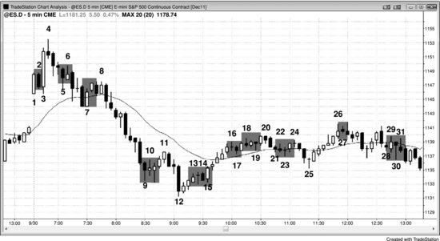

突破单可能让你被套进一笔糟糕的交易，保护性止损也可能让你被套出一笔好交易。有人会问：既然市场大部分成交量都来自机构的程序化订单，为什么机构还会频繁出错？原因在于这些程序本身就很复杂，而且各家机构使用的方法各不相同。有些止损扫单是因为对冲或部分止盈，有些是因为分批建仓，其中绝大多数跟5分钟图根本没有关系。如果简单地认为机构全都判断失误、全都被止损套住了，或者认为止损扫单是散户那点小成交量造成的，那就太天真了。图表上呈现的，是无数交易员基于无数不同且不可知的理由做出决策后的最终结果。最终效果是，个人交易员有时会被套进或被套出市场。大多数机构不会逐笔盯盘，也不会在意这些小波动，因为他们清楚自己模型背后的数学逻辑是可靠的。在他们看来，这些根本不是陷阱——多数机构甚至完全察觉不到这些波动，只是依赖自己的模型和客户委托的订单来操作。不过，高频交易公司会试图从每一个小波动中获利。

**图 32.1** 被套的交易员

如图 32.1 所示，当天充满了让交易员被套进坏交易或被套出好交易的建仓形态。但如果你仔细解读价格行为，就能在每一个陷阱中用限价单反向操作来获利。

K线2是一根空头趋势K线，出现在跳空高开且可能构成当日高点的位置，但K线1非常强，做空前最好等待更多信息。一旦做空被触发，警觉的交易员会在K线2上方挂突破单做多，一方面是因为有被套的空头，另一方面市场在跳空高开的日子里突破了一根强多头趋势K线的高点，当天可能演变为始于开盘的多头趋势日。

K线5是从疑似日内高点急速下跌中的第三根空头K线，所以即使市场涨过它的高点，形成更低高点并出现第二段下跌回到均线的可能性仍然很大。交易员可以在K线5的高点挂限价卖单做空，保护性止损设在当日高点上方，或者设在K线4卖出信号之后那根空头入场K线的上方。

下跌到K线7的空头通道很陡，所以尽管这是一个回调到均线的高2做多建仓形态，而且K线7本身是一根多头趋势K线，多头最好还是等突破回调出现后再做多。激进的交易员会在K线7的高点挂限价单做空，做一笔剥头皮交易。

下跌到K线9的走势非常强劲，所以在第一次反弹时买入是一笔糟糕的交易。交易员可以在K线9的高点挂限价卖单做空，预期接下来几根K线内会出现新低。

K线12是一根大空头趋势K线，构成一个卖出高潮，而且紧跟在下跌到K线9的卖出高潮之后。K线11处的低2可能是空头趋势中更大幅度回调之前的最终旗形。K线13是一个低1做空建仓形态，但市场已经不再处于强空头急速阶段，这是一笔糟糕的做空。交易员可以在K线13的低点挂限价买单做一笔剥头皮。

K线14是一个弱的低2做空建仓形态，因为连续卖出高潮之后，出现至少持续10根K线的回调是大概率事件。多头可以在K线14的低点买入，预期低2失败后向上突破。K线15变成了一根外包阳线，把做空低2的空头套住了。因为这根K线形成得太快，很多多头来不及反应，被套在场外，只能追着市场往上买。

K线16是五根多头趋势K线之后的一个低1做空建仓形态，因此很可能失败。多头会在这根K线的低点买入。

K线17是一个高1做多建仓形态，但多头急速阶段的K线实体小、影线多，这不是一个强的多头急速阶段，高1应该会失败。空头在K线17的高点挂限价单做空。

K线18是一个低2做空建仓形态，但市场仍处于强多头通道中，而且已经横盘了6根K线。这个低2很可能失败，多头在它的低点买入做一笔剥头皮。

K线19是一个失败的低2，因此是一个做多建仓形态，但市场已经开始横盘、K线变小，而且这已经是第三次上推。空头在它的高点做空。

K线23是一个高1做多建仓形态，但这不是一个强的多头急速阶段，空头在它的高点做空。

K线27是一个高1做多建仓形态，但急速阶段同样不强——K线小、影线明显。空头在它的高点做空。

K线28是一个高1，同时也是交易区间中部的更高低点，而且前面一根K线是一根强的空头反转K线。空头在它的高点做空。

K线30是一根大十字星空头反转K线，也是一个高2做多建仓形态，但它处于交易区间中部，而且这根大信号K线迫使交易员在接近顶部的位置买入——这从来都不是好事。十字星是一根弱信号K线。空头在它的高点做空。
