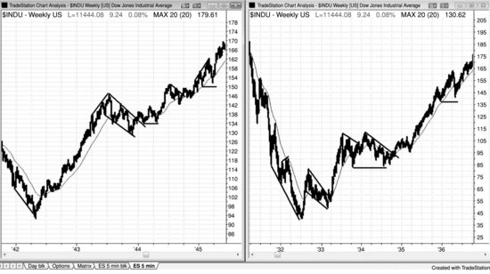
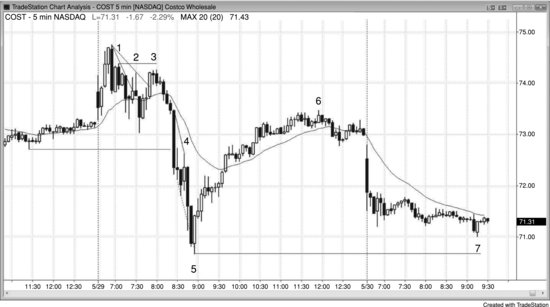
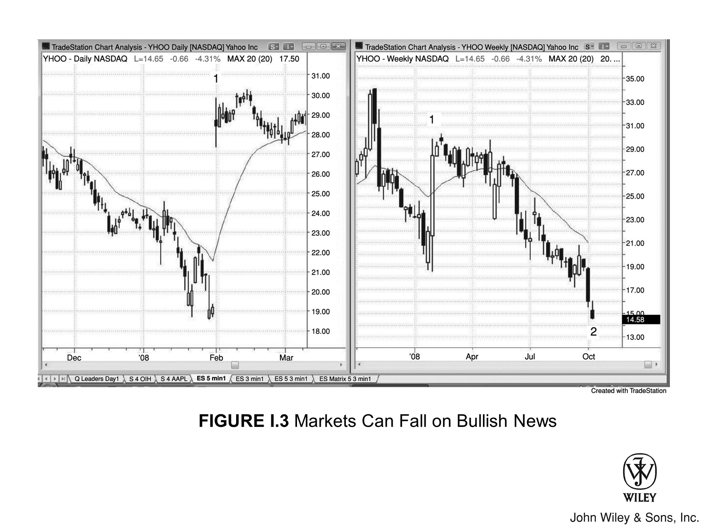
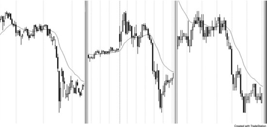

至今市面上还没有其他交易员写过关于 **价格行为** 的综合性专著，这并非无缘无故。著书立说耗时数千小时，但其经济回报若与交易相比，实在微不足道。不过，随着我的三个女儿离家去读研究生 (grad school)，我生活中的空缺正好需要填补，而写作本身也成了一件非常令人满足的事。

起初，我只打算更新 2009 年由 John Wiley & Sons 出版的 *Reading Price Charts Bar by Bar* 第一版。但在深入写作后，我改变了主意，决定巨细靡遗地阐述我观察市场和交易的方法。打个比方，我是在教大家如何拉小提琴。以此谋生所需的一切知识都已囊括书中，但能否学会这门手艺，全看你是否愿意投入无数个小时去苦练。

过去一年里，我在网站 www.brookspriceaction.com 上回答了交易员们提出的数千个问题。经过这番历练，我认为自己找到了更清晰的表达方式，因此这套书读起来应该比前作轻松许多。上一本书侧重于解读 **价格行为**，而这一系列新书的重心则在于如何利用 **价格行为** 在市场中进行交易。

由于本书篇幅已膨胀至第一本书的四倍有余，John Wiley & Sons 决定将其拆分为三本独立的著作：

- **第一卷**：涵盖 **价格行为** 的基础知识以及 **趋势**；
- **第二卷**：探讨 **交易区间**、订单管理以及交易数学；
- **最后一卷**：聚焦于 **趋势** 反转、日内交易、日线图、期权，以及适用于所有时间周期的最佳 **入场策略**。

许多图表虽也曾出现在 *Reading Price Charts Bar by Bar* 中，但大多数已做更新，且相关的图表解说也已大幅重写。前作 12 万字的内容中，仅有约 5% 保留在本系列 57 万字的篇幅里，因此读者几乎不会看到重复的内容。

我撰写这三部曲的初衷，是想分享我的理解：为什么那些精挑细选的交易机会能提供极佳的 **盈亏比**，以及如何利用这些 **入场策略** 来获利。我希望书中的内容能引起职业交易员和商学院学生的兴趣，同时也盼望刚入门的新手能从中得到启发。

## 市场由机构主导

人人都看 **价格图表**，但往往只是匆匆一瞥，或是带着某种狭隘的目的去观察。然而，每一张图表都蕴藏着海量的盈利信息。要想有效利用这些信息，**交易者** 必须花时间仔细研读，听懂每一根 **K线** 在诉说什么——它们揭示的正是 **机构资金** 的动向。

---

在大型市场中，90% 以上的交易量来自机构。这意味着，市场本质上就是机构的集合体。

- **机构的主导地位**：长期来看，几乎所有机构都能盈利，极少数不赚钱的很快就会被市场淘汰。
- **对手盘的本质**：既然机构是盈利的，而且它们构成了市场，那么你的每一笔交易，对手盘必然是一位盈利的交易者（即机构群体的一员）。
- **成交的必要条件**：若没有一家机构愿意接手买方，另一家愿意接手卖方，交易根本无法达成。散户那点微薄的交易量，只有在机构也愿意参与交易时才能成交。

如果你想在某个价位买入，除非有一个或多个机构也想在该价位买入，否则市场根本不会运行到那里。同理，除非有一个或多个机构愿意在某处卖出，否则你也无法在那里卖出，因为市场只会移动到那些既有机构愿买、又有机构愿卖的价格位置。

> **举例来说：**
>
> 假设 Emini 现价 1,264，你持有 **做多** 仓位，并在 1,262 设了 **保护性卖出止损**。除非有机构也愿意在 1,262 卖出，否则你的止损单绝不会被触发。

几乎所有的交易，莫不如此。

一旦你的手笔达到 200 张 Emini 合约，这就属于机构级的体量了。此时，你本身就是一家机构，甚至偶尔能凭一己之力让市场挪动一两个 tick。

反观大多数散户，无论操作得多么荒唐无脑，都绝无可能撼动市场分毫：
- 市场才不会特意去扫你的止损。
- 价格确实可能试探你的 **保护性止损** 位置，但这跟你设没设止损毫无瓜葛。

市场之所以去测试那个价位，唯一的理由是：
- 有机构认为在那里卖出划算；
- 而另一批机构觉得在那里买入有利可图。

在每一个 tick 上，都有机构在买，也有机构在卖。双方手里都握着久经考验的系统，都确信这笔交易能赚到钱。

> **你必须始终跟随主流机构资金的方向，因为是它们在掌控市场的去路。**

收盘复盘时，看着当天的图表，你怎么看透机构这一整天都在干什么？答案很简单：
- 凡是市场上涨，就是机构主力在买；
- 凡是市场下跌，就是卖出的资金更多。

随意截取一段涨跌行情，仔细琢磨每一根 K 线，你很快就会发现，很多形态在反复重演。日子久了，盘中形态刚一开始演变，你就能一眼看穿，下单时自然底气十足。

---

## 价格行为的思维方式

有些价格行为（Price Action）很隐蔽，所以心态要放宽，什么可能性都别排除。

**举个例子：**
有时市场明明在走高，某根 K 线却跌破了前一根 K 线的低点，可随后趋势照涨不误。你得认定，大资金就是在前一根 K 线低点、甚至更低的位置接货的，很多老手也是这么干的。他们买进的位置，正是：
1.  那些弱手忍痛止损离场的地方；
2.  或者是另一批弱手误以为行情要崩、急着进场做空的地方。

一旦你习惯了这个观念——即强趋势（Strong Trend）常有回调（Pullback），而大资金是在买入而非卖出这些回调——你就能抓住那些极佳的交易机会。放在以前，你可能觉得这些操作简直是大错特错。

---

别钻牛角尖。只要市场在涨，机构就在不停地买，哪怕在你觉得多单该止损的时候，他们照样在买。你的任务是紧跟他们的步伐，而不是死抠逻辑，去否认眼皮底下正在发生的事实。

> **哪怕这看起来反直觉也没关系。关键就一点：市场在涨，说明机构主力在买，所以你也得买。**

机构通常被尊称为“**聪明钱 (Smart Money)**”。这名头意味着他们不仅本事大，靠交易吃饭绰绰有余，而且手笔大，每天的成交量惊人。

电视上提到的“机构”，通常还是指那些传统大鳄：
- 共同基金
- 银行
- 券商
- 保险公司
- 养老基金
- 对冲基金

过去，市场上的成交量大半归功于它们，而它们做交易，主要看的是基本面。无论是日线还是周线的大方向，亦或是日内那些剧烈的波动，基本都是它们在掌舵。

---

## 交易模式的演变与机构定义

### 从人工到智能

就在十来年前，拍板做决策、动手敲单子的，还大多是那些绝顶聪明的人类交易员；可如今，这活儿正越来越多地被计算机接管。

- **自动化执行：** 机构手里的程序能瞬间消化经济数据，并立马据此下单，整个过程行云流水，压根不需要人类插手。
- **量化分析：** 还有些公司靠计算机程序，专门盯着**价格行为**做统计分析，以此执行海量交易。
- **市场占比：** 如今，单日总成交量里，足足有 70% 都是计算机搞出来的。

### 决策能力的比较

论做决策，计算机可是行家里手。其实，下棋也好，在 *Jeopardy!* 这种智力竞赛里夺冠也罢，难度都比炒股要高。

- **1997 年：** 想当年，Gary Kasparov 独步棋坛多年，算路举世无双，却输给了决策更优的计算机。
- **2011 年：** Ken Jennings 曾被奉为 *Jeopardy!* 史上最强选手，但也被计算机彻底碾压。

既然如此，计算机被公认为机构交易的最佳决策者，也只是个时间问题罢了。

### 程序化交易对市场结构的影响

由于程序化交易依赖客观的数学分析，支撑与阻力区域的界定应该会变得更加泾渭分明。例如：

- 既然海量的成交都源于严密的数学逻辑，**测量移动**（Measured Move）的目标位预测自然也会愈发精准。
- 此外，程序倾向于在日线图的**小幅回调**（Small Pullbacks）处买入，这或许会让**窄通道**（Tight Channels）延续得更为漫长。

然而，一旦有足够多的程序在同一个关键位平多或**做空**（Go Short），抛售可能会来得更猛烈、更迅疾。

这种变化会天翻地覆吗？大概不会。毕竟在全人工交易时代，驱动市场的底层力量并未改变。但不可否认，随着情绪因素从交易中被逐步剥离，市场理应会向着某种“数学上的完美”不断演进。

### “机构”的定义正在变化

随着这类公司在市场波动中的分量越来越重，加之传统机构也日益依赖计算机进行分析与下单，“机构”一词的定义正日趋模糊。对于个人交易者而言，不妨这样理解：

> 任何实体的成交量只要大到足以撼动**价格行为**（Price Action），它就是“机构”。

既然这些买卖程序贡献了绝大部分成交量，那么图表长什么样，主要由它们说了算；正是它们，为个人投资者创造了绝大多数的交易机会。

### 交易策略的差异：以思科（CSCO）为例

没错，思科（CSCO）财报亮眼，股价上扬，这当然是好消息。但不同的投资者应采取不同的策略：

- **长线投资者**：如果你是打算持仓数月的长线投资者，那就跟随传统机构的步伐，买入 CSCO 便是。
- **日内交易者**：但如果你是日内交易者，请忘掉新闻，只看图表。因为这些程序生成的形态纯粹基于统计学，与基本面毫无瓜葛，却能提供极佳的交易良机。

### 谁决定了市场的走势？

- **基于基本面的传统机构**：的确决定了未来几个月的股价方向和大致目标。
- **利用统计分析的短线公司**：才真正决定了通往目标的路径，以及这波行情最终会涨到多高、跌到多深。

### 市场形态与本书指南

有一些大形态，在所有时间周期和所有市场中周而复始地出现，包括：
- 趋势
- 交易区间
- 高潮
- 通道

此外，还有许多仅由最近几根 K 线构成的较小形态，同样具备交易价值。

本系列书籍是一部详尽的指南，旨在帮助交易者读懂图表上的一切，助其捕捉更多获利良机，同时规避亏损风险。

### 本书的核心要义

归根结底，我想传达的核心要义就这几条：

- 死磕那些绝对最好的机会，坚决避开那些绝对最烂的 **入场策略**；
- 止盈目标（回报）至少要能覆盖掉 **保护性止损**（风险）；
- 还有，要努力把你的交易仓位做大。

## 解读逻辑与实战的关系

坦白讲，我对每个 **入场策略** 背后逻辑的解释，纯属一家之言。我对某笔交易为何能成的推断，甚至可能大错特错。

但这都不重要。

重要的是，解读 **价格行为** 确实是行之有效的交易法门，而我也确实对市场走势背后的成因做过深思熟虑。这些解释能让我心里踏实，下单时更有底气；但话说回来，理论归理论，操作归操作，两者其实没啥关系，所以这些解释是对是错，我压根不在乎。

我对市场方向的看法可能瞬间反转，同理，一旦我发现了更合理的解释，或者揪出了逻辑里的漏洞，我对某种形态成因的看法也会立马掉头。

我之所以把这些观点写出来，是因为它们听着挺有道理，或许能帮读者在执行特定 **入场策略** 时心态更稳，又或许能给人带来些许思维上的启发。但请记住，对于任何 **价格行为** 交易而言，这些理论并非必需品。

## 读图的核心理念

这套书细节详尽，读来甚至有些晦涩，专为那些渴望彻底参透图表解读的严肃交易者而作。不过，书中的理念对于各个段位的交易者都大有裨益。

本书虽囊括了 Robert D. Edwards 和 John Magee（*Technical Analysis of Stock Trends*, AMACOM, 9th ed., 2007）等人论述的诸多经典技术，但核心更侧重于 **单根 K 线**。我想借此阐明：K 线本身提供的信息，足以显著优化交易的 **盈亏比**。

大多数书籍在一张图表上往往只标出寥寥三四笔交易，仿佛在暗示其余部分要么如天书般难解，要么毫无意义，抑或充满风险。但我坚信：

- 盘中跳动的每一个 tick 皆有学问；
- 每张图表上潜藏的绝佳机会，也远不止那几个一眼可见的“送分题”；
- 但若想洞察先机，你必须深刻理解 **价格行为**，绝不能轻视任何一根 K 线，视其为无物。

> 昔日我在显微镜下主刀过数千台手术，那段经历教会了我：至关重要之物，往往隐于极微小之处。

我读图时，会逐根审视 K 线，挖掘每一根 K 线透露的任何蛛丝马迹。**它们每一根都至关重要。**

每当一根 K 线收盘，大多数交易者都会自问：“刚才发生了什么？”面对大多数 K 线，他们的结论往往是：

- 此刻无利可图，根本不值得费神去琢磨。
- 于是，他们选择按兵不动，等待某种更清晰、通常也更为宏大的形态出现。
- 仿佛在他们眼中，那根 K 线根本不存在；又或者，他们将其仅仅归结为散户无法参与的机构程序化交易活动，便置之不理。

在这些时段，他们觉得自己置身事外，是个局外人。然而，交易日里的绝大部分时间，恰恰都是由这些时段构成的。

> 可是，若去观察成交量，你会发现那些被忽略的 K 线，其成交量丝毫不亚于他们作为交易依据的那些 K 线。
>
> 显然，海量的交易正在发生，但他们不解其故，便索性假装它不存在。**但这却是在否认现实。**

交易无时无刻不在进行。作为交易者，你必须对自己负责：弄清楚交易为何发生，并找到从中获利之道。

学会解读市场传递的信息，过程既漫长又艰辛，但这却是你迈向成功交易者的基石。

市面上大多数讲 K 线图的书，往往让人觉得非得死记硬背那些形态不可。我这三本书则不同，重点在于讲透背后的逻辑：

- 为什么某些特定形态能成为交易者眼中可靠的 **入场策略**。
- 书中有些术语，在市场技术分析师看来是一回事，在交易者眼里却是另一回事。
- 而我写作的立足点，完全是基于实战交易者的视角。

## 交易者的共识与成长之路

### 交易者之间的共识

我确信，许多交易者对书中的门道早已了然于胸，只不过在描述 **价格行为** 时，表述方式可能与我不同。成功的交易者之间并无秘密可言：

- 那些常见的 **入场策略** 大家都心知肚明，无非是各家叫法不同罢了。
- 大家几乎都在同一时间买卖，捕捉着同样的 **波段**；至于为何进场，每个人都有一套自己的理由。
- 许多人凭直觉交易 **价格行为**，从未觉得有必要去解释清楚某个 **入场策略** 为何有效。

我希望他们能喜欢我对 **价格行为** 的解读与视角，也希望这些内容能带来些许启发，助他们本就成功的交易更上一层楼。

多数交易者所求，无非是以一种契合自身个性的风格，追求利润最大化。我深信，若无此契合，想要长期盈利，几无可能。

### 走向成功的障碍

许多人常问：到底要熬多久才能出头？为此，他们甚至做好了亏损数年的心理准备。然而，我足足花了 10 多年，才真正踏入成功交易的大门。人人皆有俗务缠身，干扰各异，故而所需时间长短不一。但有一点是肯定的：要想持续盈利，就必须扫清路上的绝大多数障碍。

我曾面临几大难题，亟待解决：

- **家庭牵挂**：其一便是抚养三个可爱的女儿。为人父者，心系子女，她们总是占据我的思绪，让我分心。好在随着她们长大成人、日渐独立，这桩心事才算了结。
- **性格认知**：接下来，我耗费良久才终于认清：许多性格特质是刻在骨子里的，改不了（或者说，我后来想通了，自己压根就不愿改）。
- **信心缺失**：最后一关，是信心。我在诸多事务上向来自信，甚至有些自负。熟识我的人若知晓我在交易上竟缺乏信心，定会大跌眼镜。但内心深处，我曾一度认定：自己永远也琢磨不出一套既能持续盈利，又能让我乐在其中、愿意长相厮守的交易法门。

于是，我转而向外求索：

- 买入各种交易系统；
- 编写并测试无数指标和系统；
- 博览群书杂志，奔波于各类研讨会；
- 重金聘请导师，混迹于各种聊天室。

我曾与那些自诩成功的交易者攀谈，却从未见过他们的实盘账单。我不禁怀疑，这些人多半是“能说不能练”的教书匠，真正懂交易的实战家——若真有的话——恐怕也是凤毛麟角。

交易这一行，往往如此：

> **知者不言，言者不知。**

这对我有如醍醐灌顶，因为它让我看清了通往成功之路上必须避开的所有雷区。

### 实盘难度与人性陷阱

外行看图，无一例外都会觉得交易简直易如反掌，而这正是诱人入局的陷阱之一。说到底，事后诸葛亮谁都会做，随便拿张图表一看，谁都能指出哪里是绝佳的入场点和出场点。

**然而，要在实盘当下做到这一点，却是难上加难。**

- **人性使然**，大家都想抄在绝对的低点，并指望行情一去不回，绝不反向波动。一旦行情稍有反复，新手为了避免大亏便会匆忙止损，结果陷入连续亏损的泥潭，最终导致账户爆仓。
- 使用 **宽止损（wide stops）** 固然能缓解这一问题，但交易者迟早会遭遇几次重创，导致账户严重亏损，从此吓破了胆，再也不敢沿用此法。

> 你可能会担心：把书里的秘籍公之于众，会不会培养出一大批 **价格行为** 高手？要是大家都在同一时间、做同样的动作，那谁来充当后续的买盘，把价格推向你的目标位呢？

这种担心大可不必。

- 市场是 **机构** 的天下，那里汇聚了全球最顶尖的大脑。书里讲的这些东西，那些绝顶聪明的交易员早就烂熟于心——哪怕只是出于直觉，他们也早已洞悉。
- 市场的每一分每一秒，都是顶级 **机构多头** 与顶级 **机构空头** 之间的博弈。一方买入，必有一方卖出，双方旗鼓相当。
- 既然市场主力早已深谙 **价格行为** 之道，多几个人懂行，根本无法撼动既有的平衡。所以，我完全不担心写出这些内容会让 **价格行为** 失效。

正因这种极致的均衡，任何人的优势都微乎其微。无论你的读图功力有多深，只要稍有差池，亏损便在所难免。

- 不懂 **价格行为**，想在市场赚钱固然寸步难行；但光懂这些，也远远不够。
- 学会读图只是第一步，要真正学会交易，还得经历漫长的磨练——交易的实战难度，丝毫不亚于读图本身。

我写这套书，就是为了帮你练就一双读图的慧眼，修成交易的正果。如果你真能做到这两点，那么，从别人的账户里赚走资金、存入自己的腰包，就是你应得的奖赏。

假如所有人一夜之间都变成了 **价格行为** 的 **剥头皮交易者**，那些微小的 **形态** 或许会暂时生变，但假以时日，有效市场终将胜出。所有交易者的“投票”最终都会沉淀为标准的 **价格行为形态**——这是无数人依循逻辑行事的必然归宿，无可避免。

此外，现实很残酷：想做好交易极难。

- 尽管基于 **价格行为** 交易是条正途，但在实盘博弈中想要成功执行，依然难如登天。
- 根本不可能有足够多的高手在同一时刻精准出击，也就无法随着时间的推移对 **形态** 产生任何显著影响。

看看爱德华兹和迈吉（Edwards and Magee）便知。几十年来，全球顶尖交易员一直在沿用他们的理念，至今依然行之有效。原因无他：

1.  图表之所以长成这样，是因为它是有效市场不可磨灭的指纹。
2.  在这个市场里，无数聪明人运用着无数种方法和 **时间周期**，都在竭尽全力攫取最大利润。

> **试举一例**
>
> 泰格·伍兹（Tiger Woods）打高尔夫球从不藏着掖着，谁都可以随意模仿。但真正能把球打到以此为生的人，却是凤毛麟角。

交易亦是同理。即便你通晓一切理论，仍可能亏损离场。因为要将毕生所学转化为持续盈利的实战能力，实在是太难了。

Edwards 和 Magee 的书其实很简单，无非是拿趋势线、突破和回调做文章。既然如此，为何那么多商学院仍将其奉为圭臬？原因很简单：**它管用。过去管用，将来也永远管用。**

## 简化工具与指标的取舍

如今电脑普及，人人都能看日内数据，书里的许多招数稍作调整，便能用于日内交易。此外，K 线图还能透露更多细节：
- 让你看清多空双方谁在控盘；
- 从而让入场更及时，风险更可控。

Edwards 和 Magee 着眼于大趋势。我虽然沿用了同样的基本功，但我更死抠图表上的每一根 K 线，力求优化盈亏比，而且我在日内图表上下了苦功夫。

道理显而易见：如果你读图的功力够深，能在行情启动且绝不回头的刹那精准入场，那你便占尽了优势。
- 这样不仅胜率极高；
- 即便偶有失手，亏损也微乎其微。

我决定以此为起点，结果发现：**根本不需要再添加任何东西**。
- 事实上，任何画蛇添足的指标都是干扰，只会拉低利润。
- 这道理听起来简单得离谱，以至于大多数人都不敢相信。

> 我是一名日内交易者，专攻 Emini S&P 500 期货，完全依赖**日内图表**上的**价格行为**来做交易。我坚信，对于所有交易者来说，**善于解读价格行为**都是一项无价的技能。

但新手往往不这么想：

- 他们内心深处总有个执念，觉得光看图还不够，非得再加点什么——也许是某种极少人**使用**的复杂数学公式，仿佛只有这样，才能获得他们**梦寐以求**的交易优势。
- 在他们眼里，高盛（Goldman Sachs）财大气粗、老谋深算，交易员肯定都武装了超级计算机和尖端软件。面对这种装备优势，散户注定一败涂地。
- 于是，他们开始钻研各种指标，反复**摆弄**参数，试图把指标调教得“恰到好处”。

任何指标都有灵光的时候，但对我而言，它们非但没把行情理顺，反而徒增干扰。说穿了，哪怕你连图表都不看，闭眼下一张买单，也有 50% 的概率是赌对的！

我并非因为不懂其中的门道才摒弃指标和系统。多年来，我在编写和测试指标与系统上耗费了逾万小时，这般阅历恐怕早已远超常人。正是这段对指标与系统的苦心钻研，奠定了我交易成功的基石。

> 指标对许多人确实奏效。但交易之道，贵在知行合一——只有找到一套与自身性格完美契合的打法，才能触及成功的巅峰。

我与指标系统最大的隔阂，在于“信任”二字——我从未真正信过它们：

- 每当 **入场策略** 出现，我总能挑出刺来，看到那些必须经受测试的例外情况。
- 我太贪心，总想榨干市场里的每一个铜板；只要觉得还能变个花样改良系统，我就绝不满足于既得的利润。

优化之路虽无止境，怎奈市场变幻无常：

- 行情总在 **强趋势** 与窄幅 **交易区间** 之间轮回。
- 你的优化往往基于眼前的行情，一旦市场风向一转进入新阶段，这些优化便会迅速失效。

归根结底，是我这人：

- 控制欲太强
- 强迫症太重
- 性子太急
- 眼光太毒
- 又生性多疑

注定无法长期靠指标或自动系统吃饭。不过，我属于极端个例，大多数人倒不必有此顾虑。

许多交易者，尤其是新手，总对指标情有独钟。当然，也不光是指标，什么“神力”、大师、电视名嘴、投资内参，只要能让他们觉得有靠山，能通过赚大钱来证明自己被爱、被认可，他们都信。归根结底，他们只是指望这些东西能告诉自己：到底什么时候进场。

殊不知，绝大多数指标的根基，不过是简单的 **价格行为**。就我个人而言，实盘交易时，光看价格都来不及，哪有那个脑力去处理好几个指标发出的信号？

---

### 仅凭价格行为识别趋势转弱

试想一下：**多头趋势** 中出现 **回调**，随后 **上涨** 创出新高。但这波 **上涨** 走得磕磕绊绊：

- **K线** 大面积 **重叠**；
- **阴线实体** 频现；
- 中间夹杂着好几次小 **回调**；
- 而且 **K线** 顶部还留着显著的 **影线**。

任何老手一眼就能看穿：这是对趋势高点的一次弱势测试。如果 **多头趋势** 真的强劲，绝不该走出这副模样。此时，市场几乎肯定正在演变为 **交易区间**，甚至可能转为 **空头趋势**。这一点，何须震荡指标来告诉你？

---

### 震荡指标的陷阱

此外，震荡指标容易诱导交易者死盯着 **反转**，反而忽略了 **价格图表** 本身。

- **指标的适用性：** 诚然，在 **大多数日子** 里，如果市场出现两三次持续一小时以上的 **反转**，这些指标确实管用。
- **指标的陷阱：** 但一旦市场走出强 **趋势**，麻烦就来了。如果你太依赖指标，你会发现它们整天都在提示背离。

**结果呢？** 你可能会一次次地 **逆势** 进场，一次次地亏钱。等到你终于认清市场是在走 **趋势** 时，这一天剩下的时间恐怕已不够你回本了。

**反之**，如果你只是单纯地看 **K线** 图，一眼就能看出市场 **趋势** 明显，自然也就不会受指标蛊惑，非要去抓什么 **趋势反转** 了。

- 最常见的成功反转，往往先是一股强劲动能突破 **趋势线**，随后 **回调** 测试极值。交易者若是太执着于背离，反而容易忽略这个最根本的事实。

- 如果之前没有反向动能爆发突破 **趋势线**，单凭背离就进场，这种策略注定失败。

- 要耐心等待 **趋势线** 突破，再观察对旧极值的测试：究竟是引发反转，还是旧趋势延续？

- 这种位置的强力反转是高胜率交易——至少做 **剥头皮**（scalp）是稳的——根本不需要指标来指手画脚。况且这里几乎必有背离，何必非要在决策中加上指标，把思路搞复杂呢？

有些专家推崇“全副武装”：结合多周期、各类指标、数浪理论，外加斐波那契的回调与扩展。可真到了下单的节骨眼上，若没有好的 **价格行为** 入场策略，他们绝不动手。

而且，一旦捕捉到好的 **价格行为** 入场策略，他们反倒忙活起来，四处寻找佐证：

- 指标有无背离？
- 各周期均线是否回测？
- 波浪数得对不对？
- 斐波那契点位能否对上？

——折腾一圈，只为确认眼前明摆着的事实。

说穿了，他们骨子里就是 **价格行为** 交易者，只盯着一张图，全凭 **价格行为** 交易，只是不愿承认罢了。

把交易搞得如此繁复，必然会错失大量良机。因为过度分析挤占了下单的决断时间，导致他们只能被迫等待下一个入场策略。化简为繁，这在逻辑上根本站不住脚。

---

## 信息、纪律与优势

显然，信息增量有助于优化决策，许多人或许也有能力在下单前的瞬间处理海量信息。若仅仅为了死守某种简化的教条而无视数据，无疑是愚蠢的。毕竟，交易的终极目标是盈利，交易者理应穷尽所能去最大化利润。

但就我个人而言，要在精准下单的那一瞬间，同时顾及多个指标和周期，我实在力不从心。我发现：

1.  心无旁骛地仔细 **解读** 单一图表，收益反而更丰厚。
2.  此外，一旦依赖指标，我对 **价格行为** 的 **解读** 就会产生惰性，往往对眼皮底下的机会视而不见。

**价格行为** 的分量，远超其他任何信息。如果你为了获取旁枝末节，而牺牲了 **价格行为** 正在传递的核心内容，那你很可能正陷于错误的决策之中。

刚入行时，最让交易者头疼的，莫过于凡事都太主观。他们总想找一套稳赚不赔的铁律，最恨那种昨天还灵验、今天就失灵的形态。

市场之所以高效，是因为无数聪明绝顶的大脑正深陷这场零和博弈。想赚钱，你就得长期跑赢市场上约一半的人：

- 既然对手大多是赚钱的 **机构交易者**，你若不出类拔萃，根本没戏。
- 一旦出现某种优势，立马就会被人盯上，随即烟消云散。
- 别忘了，你每做一笔交易，对面都得有人接盘。对手用不了多久就能看穿你那套“神奇系统”，一旦看穿，谁还会傻傻给你送钱？

交易的魅力在于，在这场零和博弈中，优势往往微乎其微。能捕捉并利用这些稍纵即逝的微小机会，既有智力上的成就感，又有真金白银的回报。这并非不可能，但需要下苦功，更需要铁一般的纪律。

> 所谓纪律，无非就是强迫自己去做不愿做的事。

### 纪律与耐心

人皆有好奇心，天生喜欢尝鲜猎奇，但顶尖交易者能克制这种诱惑。你必须死守规则，摒弃情绪，耐心蛰伏，只抓最完美的交易机会：

1.  收盘后看静态图，一切似乎轻而易举；可一旦身处实盘，盯着 **K 线** 一根根走，甚至一小时一小时地熬，就变得难如登天。
2.  当绝佳的 **入场策略** 终于出现时，你若稍有分心或麻痹大意，就会失之交臂，被迫再熬更久。
3.  反之，你若能磨炼出耐心与纪律，严格执行一套完善的系统，获利空间将不可估量。

股票和 Eminis 的交易法门千千万，但万变不离其宗——都得靠波动（好吧，卖空期权除外）。

一旦学会读图，赚钱的机会每天都俯拾皆是。

- 你根本不必深究**为什么**某家机构发动了趋势，也不必理会那些指标到底在说什么。
- 机构的软件、分析师的报告，统统不需要，因为他们的底牌全亮在盘面上。
- 你只需顺势搭车，跟上他们的节奏，利润自然落袋。**价格行为**会泄露天机，让你不仅能尽早入场，还能设个极窄的**保护性止损**。

## 简化执行与常用工具

我发现，做交易时想得越少，反而赚得**多得多**，而且细水长流，持续稳定。我只需一台笔记本，盯着一张图：

- 图上除了 **EMA 20**，什么指标都不加。
- 这不需要复杂的分析，却能让每天涌现的绝佳**入场策略**一目了然。

有些人可能会盯着成交量，因为在**空头趋势**末端，有时会爆出异常巨大的量刺。

- 随后的**一两个**新波段低点，往往是做多**剥头皮**的好机会。
- 这种量刺有时也会出现在杀跌过头的日线图上。
- 但在我看来，这指标不够靠谱，不值得我费心。

许多交易者往往只在做背离和趋势回调时，才会关注价格行为。其实：

- 大多数使用指标的交易者，若没看到一根强劲的信号 K 线，根本不会出手；
- 反之，只要背景合适，哪怕没有背离，许多人也会单凭一根强劲的信号 K 线进场。

他们渴望看到巨大的反转 K 线收盘强劲，但现实中，这种完美形态少之又少。

---

## 读图工具与图表细节

若要读懂价格行为，最有力的工具莫过于：

- 趋势线与趋势通道线
- 前高与前低
- 突破与失败的突破
- K 线实体与影线的大小
- 当前 K 线与前几根 K 线的相互关系

尤其是将当前 K 线的开、高、低、收四价与前几根 K 线的走势相比，往往能极大地预示后市走向。

---

### 图表信息与噪音

图表所透露的关于“谁在掌控市场”的信息，远超大多数交易者的想象。几乎每一根 K 线都在暗示市场的去向，如果交易者把这些价格行为统统当作噪音忽略掉，那他每天都会白白放过许多赚钱的良机。

本书的大部分观察都与实际下单息息相关，但也有一小部分属于有趣却单纯的价格行为倾向，其可靠性尚不足以作为交易依据。

---

### 适用市场与时间周期

我个人在交易 Emini、期货和股票时，主要依赖 K 线图。不过，大多数信号在任何类型的图表上都清晰可见，许多信号甚至在简单的线形图上也一目了然。

我主要以 5 分钟 K 线图为例来阐述基本原理，但也同样会探讨日线图和周线图。由于我也交易股票、外汇、国债期货和期权，因此我也会讨论如何将价格行为作为此类交易的基石。

> **作为交易者，我眼中的世界并非黑白分明，而是深深浅浅的灰。我的思维模式，永远建立在概率之上。**

---

## 灰色地带与概率思维

若某种形态正在酝酿，虽非完美，却与某种可靠的 **入场策略** 神似，那它的走势很可能也会如出一辙。

- 所谓“差不多”，通常就是“足够好”。
- 若盘面看着像教科书里的 **入场策略**，那这笔交易的演变过程，多半也会照着教科书里的剧本走。
- 这就是交易的艺术。要在这种“灰色地带”游刃有余，非得数年苦功不可。

人人都想要确切明晰的规则，或是某种神奇指标；都指望聊天室、时事通讯、热线电话或导师能指点迷津，告诉他们何时入场能风险最小、利润最大。

**但长远来看，这些统统没用。**

- 你得为自己的决策负责，但前提是你得先学会如何决策。
- 这意味着，你必须习惯在“灰色迷雾”中摸索前行。

---

### 概率与不确定性

世事绝非非黑即白。我在这一行摸爬滚打多年，深知任何事——无论看着多离谱——都有可能发生，而且迟早会发生。

这就好比量子物理：凡是能想象到的事件，皆有概率；那些你还没想到的，亦复如是。这无关情绪，至于事情背后的成因，更是无关紧要。

盯着美联储今天降不降息，纯属浪费时间。因为无论美联储做什么，市场总能解读出 **多头** 和 **空头** 两套逻辑。

**关键在于看市场怎么走，而不是看美联储怎么做。**

细想之下，交易本质上是一场 **零和博弈**。既是零和，就不可能存在一套放之四海而皆准的铁律。若真有必胜法，人人皆用，谁来做对手盘？没了对手，交易自然无从谈起。

“指导方针”大有裨益，但“可靠法则”纯属虚妄。这对新手往往是个沉重打击：

- 初入行者总是一厢情愿地相信，只要找到那套“完美战法”，就能在市场里日进斗金。
- 凡是规则，皆有失灵之时。可它们偏偏又时不时灵验一下，刚好够把你绕进去，让你误以为只要稍加修补，这套规则就能万世长存。
- 你这是在造神，妄图寻求庇护。但这不过是自欺欺人，是在一场唯有艰辛付出方能生存的游戏里，妄想寻找捷径。

你的对手是这世上最精明的脑袋。若你聪明到能悟出万全之策，他们岂会不知？届时大家又会陷入零和博弈的死局。

---

交易之道，贵在变通，死板者无利可图。你必须亦步亦趋跟随市场，因为市场本身就是极度善变的：

- 它可以向任意方向肆意延展，持续之久远超常人想象；
- 也可以每隔几根 **K线** 就反复 **反转**，旷日持久地拉锯；
- 总之，在这两极之间的任何走势，市场不仅能走出来，而且一定会走出来。

> 永远别为此懊恼。坦然接受这一现实吧，学会欣赏它，这正是这场博弈的魅力所在。

市场总是倾向于不确定性。在一天的大部分时间里，市场向上或向下走出等距行情的概率，都是五五开。

所谓五五开，具体表现为以下两种情形：

- **买入：** 假设你完全不看图表，直接买入任意一只股票，然后设一个 OCO 订单（二选一订单）——在入场价上方 X 美分处挂**限价单**止盈，同时在下方 X 美分处挂**保护性止损**——那你做对的概率大约就是 50%。
- **卖出：** 同理，如果你在盘中任意时刻卖出股票，同样不看图表，只是在低 X 美分处挂**限价单**止盈，高 X 美分处挂**保护性止损**，那你赢的概率约为 50%，输的概率也约为 50%。

当然，这里有个明显的例外：X 相对于股价过大。
> 比如一只 50 美元的股票，X 不能是 60 美元，因为你亏损 60 美元的概率是 0%。同样，X 也不能是 49 美元，因为亏损 49 美元的几率微乎其微。

但只要你设定的 X 值在当前时间周期的合理波动范围内，上述定律通常成立。

---

### 市场状态与概率特征

**1. 交易区间（不确定性）**
市场处于五五开状态，意味着不确定，你无法理性地预判方向。这正是**交易区间**的典型特征。因此，每当你感到不确定时，就默认市场正处于**交易区间**中。

**2. 强趋势（概率升高）**
图表上也会有短暂的时刻，方向概率会升高。在**强趋势**中，这一概率可能达到 60% 甚至 70%，但这无法持久，因为它终将回归不确定性，回到多空双方都认为有价值的五五开状态。

**3. 趋势的终结与循环**
一旦存在**趋势**且具备一定的方向确定性，市场就会向支撑位和阻力位靠拢（这些位置通常是某种**测量移动**的目标位）。而在这些区域，不确定性总会回归，**交易区间**也随之形成——哪怕只是短暂的。

## 新闻、专家与噪音

> **交易时段，切忌看新闻。**
> 若想参透新闻事件背后的玄机，眼前的图表自会言明。

在记者眼中，新闻大过天，仿佛世间万象皆由当日的头条主宰。毕竟端着这碗饭，新闻自然成了宇宙的中心，金融市场的一草一木似乎都得听它号令。

### 新闻叙事与图表事实

以下是 **2011 年** 的一个典型案例：

- **2011 年 3 月中旬股市大跌**
    他们一口咬定是日本地震惹的祸。殊不知，早在三周前，市场经历一次 **买入高潮（Buy Climax）** 后便已掉头向下，但这在记者看来根本无关痛痒。

- **早在 2 月底**
    在一轮漫长的多头长跑后，日线图上赫然出现了连续 15 根 **多头趋势 K 线（Bull Trend Bars）**。当时我就在聊天室里提醒大家：**大幅回调（Correction）** 已是大概率事件。这是一次异常强劲的买入高潮，更是市场发出的重磅宣言。

几周后会有地震？我毫不知情，也压根无需知情。图表早已揭示了交易者的动向：众人正磨刀霍霍，准备平多开空。

电视上的专家也指望不上。每逢市场剧烈波动，记者总能挖出个把自信满满、言之凿凿，且 *恰好* 押对宝的专家来采访。这让观众误以为此人有未卜先知的能力，却掩盖了一个避而不谈的真相：这家伙前 10 次预测可能全错了。

接着，这位“大咖”会对未来走势指点江山，天真的观众便奉若神明，甚至据此操作。殊不知，这圈子里：

- 有些人是万年死多头；
- 有些人是万年死空头；
- 还有些人总是想一鸣惊人，专门发表耸人听闻的预测。

记者无非是看当天的行情脸色，抓个观点正好能对上的专家来凑数罢了。这对交易者不仅毫无助益，反而有害无利——它会：

1.  干扰你的判断；
2.  让你自我怀疑；
3.  最终背离原本的交易章法。

在这种大方向的预测上，没人能长期保持 60% 以上的胜率。别看专家说得头头是道，未必就靠谱。同样聪明、同样言之成理但持相反观点的人多得是，只是你没听见罢了。

> 这就好比旁听庭审却只听辩方律师的陈词。只听一面之词总是极具煽动性，但也极具误导性，其可靠性很难超过 50%。

机构的多头和空头无时无刻不在下单博弈，正因如此，市场的走向才始终充满变数。哪怕没有突发新闻，财经频道也会全天候滚动播出访谈，记者们总得拉一位专家（pundit）来做报道。

> **你得明白一点：**
> 如果看的是未来一小时左右的走势，她挑对人的概率也就是 50%。

假如你决定听信这位专家来做交易，他说午后会有抛售（sell off），结果行情却一路不回头地上涨，你还会想去做空（short）吗？

---

### 权威人物的时间框架错配

华尔街顶级投行的首席交易员（head trader）说话极具煽动性，你应该信他吗？显然，他年薪百万，要是不能持续精准地预测市场走向，公司哪会给他开这么高的价？

事实上，他可能真有这本事，也可能确实是个选股高手（stock picker），但他几乎肯定不是个日内交易者（day trader）。仅仅因为他管钱能做到 15% 的年化收益，就信他能算准未来一两个小时的走势，这简直是犯傻。

**算算这笔账。**

- 如果他真有那本事，一天抓两三次 1% 的波动，一年下来回报率能有 1,000%。
- 既然他没做到，你就该知道他没那能耐。
- 他的时间框架（time frame）是按月算的，而你是按分钟算的。

既然他靠日内交易赚不到钱，你为什么要依据一个在日内交易上已被证实的失败者来做单？

他不是个成功的日内交易者，这一简单事实足以证明他无法靠日内交易获利。这就直接告诉你：如果他做日内，肯定亏钱。因为如果他真能做成，他早就专职做这个了，赚的钱也远比现在多得多。

哪怕你为了复刻他基金的业绩，一拿就是好几个月，听他的建议依然是犯傻。因为他下周可能就变卦了，而你根本无从知晓。一旦入场，**管理交易**与**下单**同样重要。

- 如果你跟着这位专家，指望像他那样年赚 15%，你就得跟上他的管理节奏；但这你根本做不到，所以这套策略用久了，亏钱是注定的。
- 没错，你偶尔也能做出一笔漂亮的交易，但你闭着眼随便买只股票，运气好也能赚。关键在于，做完 100 笔交易后这方法还能不能赚钱，而不是看开头那一两笔。

想想你是怎么教孩子的：别自欺欺人，别把电视上演的当真，不管它包装得再光鲜、再像那么回事。

---

### 记者与节目机制

就像我说的，同样的新闻，会有专家解读为**看涨**，也会有专家解读为**看跌**，记者不过是挑一个来做报道罢了。你打算让一个记者替你的交易拿主意？简直疯了！

- 如果那个记者真懂交易，她早就去当全职交易员了，赚的钱得是现在当记者的几百倍。你凭什么让她左右你的决策？
- 说到底，可能只是你对自己没信心，或者潜意识里在找一个能关爱、保护你的“父亲”形象。如果你容易受记者的决定影响，这笔交易你压根就不该做。
- 她选的那个专家并不是你的父亲，他既不会护着你，也不会护着你的钱。哪怕记者选的专家看对了**方向**，他也不会守在你身边帮你管理交易，一旦遇到**回调**，你很可能就会带着亏损**被止损**出局。

财经新闻台并非公益机构。它们是生意人，逐利才是本色。为了把广告收入最大化，它们必须尽可能地扩充观众群体。诚然，它们也追求报道准确，但赚钱才是头等大事。

它们深知，只有节目赏心悦目，观众才会买账，收视率才能上去。因此，嘉宾必须有看点：
- 有的负责语出惊人；
- 有的负责展现学者风范、安抚人心；
- 还有的纯粹负责“颜值担当”。

总之，大多数嘉宾都得具备一定的娱乐价值。

---

### 嘉宾与分析师的局限

哪怕有些嘉宾确实是顶尖交易员，也帮不了你的忙。

试想，如果他们采访了一位全球最成功的债券交易员，此人通常只会泛泛而谈未来几个月的**趋势**，而且往往是在自己进场交易数周之后才会开口。如果你是日内交易者，这对你毫无助益。

因为无论月线图上是多头还是空头市场，落实到日内图表上，上涨和下跌的波段几乎一样多，每天都充斥着做多和做空的交易机会。他的时间框架与你截然不同，他的交易与你的操作也毫无瓜葛。

---

节目组还常邀请华尔街大行的图表分析师。这些人虽然资历光鲜，但依据的是周线图，而观众盯着的却是几天内的获利机会。

- **在分析师眼里**：即便市场在未来几个月下跌 10%，他推荐买入的那个**多头趋势**依然完好无损。
- **然而观众**：早在跌到底之前就止损离场了，根本熬不到三个月后创新高的那一刻。

除非这位分析师是针对你的具体目标和时间框架在讲，否则他说的一切都是废话。

若是换作电视采访日内交易者，他嘴里聊的都是陈年旧账。这种马后炮的信息，哪能帮你赚到钱？等他露脸时，行情没准早就掉头了。

- **时效性不足**：就算他聊的时候手里还拿着单子，那短短两分钟的采访哪够？他肯定是在下播后才去慢慢处理，绝不会在直播镜头前操作给你看。
- **缺乏指导**：退一步讲，哪怕你跟单进场了，到了必须决定去留的关键时刻——不管是行情变脸要跑路，还是赚了钱想落袋——他可没法隔着屏幕帮你拿主意。

不管什么情况，哪怕刚出了重磅报告，指望看电视听消息来做交易，那就是死路一条。**千万别干这种傻事。**

---

> **只看图表，它会告诉你所需的一切。**
>
> 能让你赚钱的是图表，能让你赔钱的也是图表，所以做交易时，你眼里应该只有它。

---

### 他人意见的干扰

假如你身在场内，哪怕是最好的朋友，他的操作也不可信。

他表面上可能在大肆叫卖橙汁看涨期权，背地里却安排经纪人在低位暗吸十倍的筹码。你这位朋友不过是在制造恐慌砸盘，好借代理人之手，以更低廉的价格大举吸筹。

朋友和同事总爱随口提意见，你大可置若罔闻。

偶尔会有交易员跑来跟我说，他们有个绝佳的“入场策略”，想跟我探讨一番。当我直言不感兴趣时，无一例外都会惹恼他们。他们立刻觉得我：
- 自私
- 固执
- 思想封闭

确实，在交易这件事上，我不仅如此，甚至有过之而无不及。那些能让你赚钱的本事，在外行眼里往往被视为缺陷。

---

### 为什么我不再阅读交易类的书籍文章，也不再与其他交易员交流想法？

- **信息干扰**：如前所述，图表已告知我所需的一切，其余信息皆是干扰。
- **社交本质**：有好几个人曾因我的态度感到被冒犯。但我认为，部分原因在于我拒绝了他们表面上的“帮助”——实际上，他们是在献殷勤，指望我能回报以某种指导。

当我告诉他们，我不想听任何人的交易技术时，他们便会感到沮丧甚至愤怒。我告诉他们，我自己这一套还没精通，恐怕永远也精通不了。但我确信，与其试图将非“价格行为”的方法融入交易，不如专心打磨我已知的知识，这样赚到的钱要多得多。

---

我问他们：如果 James Galway 送给 Yo-Yo Ma 一支精美的长笛，并因为自己靠此赚了大钱而坚持要 Ma 也开始学，Ma 应该接受吗？

> 显然不该。Ma 应该继续拉他的大提琴，靠这个赚的钱，远比他分心去学长笛要多得多。

我虽不是 Galway 或 Ma，但道理是一样的。“价格行为”是我唯一想演奏的乐器，我坚信，精通此道所带来的财富，远胜于融合其他成功交易员的理念。

**图表——而非电视上的专家——会确切地告诉你，“机构交易者”究竟是如何解读新闻的。**

- 或者，你可能因为那份利好财报，开盘就直接买进。
- 随后你便会陷入焦虑：股价为何没像电视分析师预测的那样飙升，反而崩盘了？
- 当行情发起第二波跳水、跌向 K线 5 时，你很可能会卖出多头仓位，最终亏损 2 美元离场。

如果一段趋势仅用寥寥几根 K 线便拉出了巨大的空间——这意味着它由大 K 线组成且彼此重叠极少——那么它最终势必会迎来回调。这类趋势动能极强，因此：

- 回调结束后，市场大概率会恢复原趋势，进而测试此前的极值点。
- 只要回调没有演变为反向的新趋势并超越原趋势的起点，极值点通常都会被突破。

一般而言，如果回调幅度达到或超过 75%，价格重返原趋势极值点的概率就会大幅降低。以空头趋势为例，一旦达到这个程度，交易者最好将其视为新的多头趋势，而不是旧空头趋势中的回调。

- Bar 6 的回调幅度约为 70%，随后市场在次日开盘测试了空头高潮留下的低点。

### 案例：雅虎收购传闻

> 市场因消息面跳空高开，并不意味着行情会持续上攻——无论该消息看起来多么利多。

如图 图 I.3 所示，雅虎 (YHOO) 的两张图表（左侧为日线，右侧为周线）显示：在 **K线** 1 开盘前，有新闻报道称微软有意以每股 31 美元的价格收购雅虎。市场随即跳空高开，价格直逼收购价。

许多交易者想当然地认为这事儿已经是板上钉钉了。毕竟微软是全球顶尖巨头，它若想买雅虎，还不是探囊取物？不仅如此，微软财大气粗，真有必要的话，加点甜头促成交易也不在话下。

然而，雅虎 CEO 声称自家股票估值应在 40 美元左右，可微软压根没接茬。这笔交易慢慢告吹，雅虎的股价也随之蒸发。所谓的强劲基本面，所谓的诚意收购，到头来不过如此。到了 10 月：

- 雅虎股价比消息公布前还低了 20%；
- 比公布当天更是跌去了 50%；
- 而且跌势未止。

在**价格行为**交易者眼中，对于此类行情有如下判断：

1.  熊市中的巨幅上涨通常只是个**熊旗**，除非后续能连续走出更高的低点和更高的高点。
2.  这种上涨或许会接一个**牛旗**，然后继续反弹。
3.  但在**多头趋势**确认之前，你必须时刻谨记：周线级别的大趋势更为重要。

---

**图 I.3 市场可能在利好消息下下跌**

> **唯有图表，真实不虚。**

若看不懂图意，切勿出手。静待局势明朗——这一刻终将到来。而一旦时机成熟，你就必须果断下单，承担风险，执行计划。

### 宏观视角与历史案例

即便从宏观视角看，基本面顶多也只能提供一个模糊的参考。不妨看看 **1987 年** 和 **2009 年** 的崩盘：

1.  市场经历了剧烈的暴跌与反弹，但基本面并没有在如此短的时间内发生天翻地覆的变化。
2.  在这两个案例中，市场都像是被吸到了月线趋势线下方一点点的位置，随即剧烈反转向上。
3.  市场的下跌源于人们对基本面的认知，但究竟跌多深，却是由图表决定的。

---

## 交易执行与时间框架纪律

### 切勿切换至 1 分钟图去收紧止损，否则必输无疑

- **1 分钟图是个诱惑陷阱**：它提供了大量入场机会，K 线更小，看似风险更低。然而，你无法以此穷尽所有机会，只能挑挑拣拣。这正是账户毁灭的根源，因为你注定会挑中太多的“烂果子”。
- **既在 5 分钟图入场，交易便基于 5 分钟图的逻辑**，本就不该理会 1 分钟图长什么样。因此，你必须坚守 5 分钟级别的止损与目标，并接受这一现实：1 分钟图常会逆势反扑，轻易扫掉该级别的止损。
- **若盯着 1 分钟图，便无法在 5 分钟图上全神贯注**。届时，高明的交易员就会把你的钱掏空，装进他们自己的腰包。

---

若想在这场博弈中胜出，必须摒弃一切杂念，屏蔽眼前图表之外的所有干扰。要坚信：唯有如此，方能赚取暴利。这听似虚幻，实则确凿无疑。切勿置疑。

**大道至简，严守那些简单的规则即可。**
简单之事，持之以恒却极难。但在我看来，这才是交易的不二法门。

归根结底，随着对“价格行为”理解的加深，交易压力会骤减，甚至变得枯燥无味，但利润却会愈发丰厚。

## 交易与赌博：概率、纪律与心态

我从不赌博。原因很简单：赔率、风险和回报这三者凑在一起，对我没好处，而我绝不会跟数学作对。但在外行（那些不交易的人）眼里，交易和赌博确实挺像。

赌博玩的是概率，但我对它的定义更严苛一点：

> 只有那些“胜率略微对你不利，且长期必输”的局，才叫赌博。

为什么要这么定义？因为如果不设这个门槛，那所有投资都成赌博了。毕竟，凡事都有运气成分，都有血本无归的风险。不管你是：

- **投资房产**
- **买房自住**
- **下海创业**
- **买蓝筹股**
- **甚至是买国债**（想想看，政府可能会为了缩减实际债务规模，故意让美元贬值。这样一来，等你以后拿回本息时，手里的美元购买力早就大不如前了）。

有些交易者利用简单的博弈论，亏了一次或几次后，反而加大仓位（这就是所谓的马丁格尔策略）。

玩 21 点的算牌客，跟**交易区间**交易者简直是一个模子刻出来的：

1.  **算牌客**想抓的，就是数学概率向一边偏离过头的时机。具体来说，他们盯着剩下的牌，看什么时候“人头牌”（Face cards）的比例会过高。一旦算出来这种情况大概率要发生，他们就会出手（下注）。因为这时候，人头牌出现的概率极高，赢面自然就大了。
2.  **交易区间交易者**也是在等这种机会：一旦觉得市场向某个方向走得太远（过头了），他们就会反向操作（即**押注失败**）。

我曾在网上玩过几次扑克（没用真钱），想看看它与交易到底有何异同。

很快我就发现了一个劝退我的根本原因：运气造成的内在不公让我时刻处于焦虑之中，而我绝不希望自己的成败很大程度上要看运气的脸色。这就是天壤之别。尽管大众往往将两者混为一谈，但在我眼里，赌博和交易本质上截然不同。

相比之下，交易具备以下特性：

- **公平博弈**
    在交易中，每个人拿到的“牌”都是一样的，所以这场博弈永远是公平的。拉长时间来看，你是获得奖赏还是遭受惩罚，完全取决于你的交易技术。

- **概率风险**
    显然，有时候即便操作正确，也可能会亏钱。受概率曲线的影响，这种情况甚至可能接连发生。理论上确实存在微乎其微的概率，让你在操作完美的情况下连续亏损 10 次甚至上百次；但我已记不起上一次见到连续 4 个优质信号全部失效是在何时了，所以这个险，我愿意冒。

- **零和游戏**
    只要技术过硬，假以时日你必能获利，因为这是个零和游戏（除去佣金——若选对经纪商，这笔费用应很低）。只要你比大多数交易者技高一筹，就能赢走他们的钱。

体育博彩和扑克这两种赌博，与纯粹碰运气的游戏截然不同，反倒与交易颇为神似。在这两类游戏中，赌客赚的是其他赌客的钱，而不是庄家的钱。因此，只要技高一筹，显著强于对手，就能建立起对自己有利的胜算。

然而，他们支付的“佣金”可能远高于交易者：

- **体育博彩**：这一点尤为明显，其“抽水”（vig）通常高达 10%。正因如此，像 Billy Walters 这样顶级的博彩玩家才凤毛麟角：他们必须比对手强出至少 10%，才仅仅能够保本。
- **扑克**：成功的玩家相对多见，电视上层出不穷的扑克节目便是佐证。但即便最顶尖的牌手，其收入也无法与顶级交易者相提并论，因为受现实条件所限，他们的“交易规模”上限要低得多。

我个人觉得交易没什么压力，因为运气成分微乎其微，几乎可以忽略不计。不过，交易与扑克确有一处共通——**耐心至关重要**：

1.  **打扑克时**：若能耐住性子，只在拿到绝佳好牌时下注，获利将远超常人；
2.  **做交易时**：若能耐心等待最好的 **入场策略** 出现，收益也会更为丰厚。

对我而言，交易中这种漫长的空窗期要好熬得多。因为即便行情清淡，我依然能看到所有的“底牌”，去发掘那些微妙的 **价格行为** 现象，这本身就是一种智力上的享受。

---

赌界有句至理名言，放之四海而皆准：**不见好牌不下注**。交易亦是如此。

务必等待一个优质的 **入场策略** 出现，然后再出手。如果你毫无纪律，缺乏完善的方法，单纯寄希望于运气来获利，那么毫无疑问，你做的不是交易，而是赌博。

圈外人（nontraders）常抱有一种令人遗憾的偏见。他们想当然地以为，所有的日内交易者——乃至所有市场参与者——都是上了瘾的赌徒，甚至还得上了某种精神病。

我倒不否认许多人确实有瘾。对这些人来说，交易图的是刺激，而非利润。他们甘愿押注那些低概率（low-probability）的机会，哪怕输掉巨款也在所不惜，只因偶尔赢一把时那种令人头皮发麻的快感（rush）实在太让人着迷。

> 然而，大多数成功的交易者本质上就是投资者，这与那些投资商业地产或经营小买卖的人并无二致。唯一的区别只在于：**交易的时间框架（time frame）更短，使用的杠杆（leverage）更高。**

---

遗憾的是，新手偶尔赌上一把是常有的事，而代价无一例外就是赔钱。成功的交易者无不依规行事。无论借口是什么，一旦背离规则，就是在凭希望而非逻辑做单，这就是在赌博。

新手往往在连亏几笔后陷入这种境地：

- **急于回本：** 他们急于回本（made whole），为此不惜铤而走险。他们会去做平时绝不会碰的交易，一心只想把刚输掉的钱赢回来。
- **情绪化交易：** 明知这笔交易胜算渺茫（low-probability），却因亏损带来的焦虑与懊恼而强行入场——这已不再是交易，而是赤裸裸的赌博。
- **后果与自责：** 一旦赌输，心情更是跌入谷底。不仅当天的亏损窟窿越来越大，内心更是倍感凄凉。因为残酷的现实摆在眼前：他们明知纪律是成功的基石，却依然没能管住手，没能坚守自己的系统（system）。

神经金融学有个有趣的发现：交易者准备下单时的脑部扫描图，竟然与瘾君子毒瘾发作时的图像别无二致。研究人员观察到一种“雪球效应”：

- 无论结果盈亏，交易者想要继续交易的欲望只会越来越强。
- 遗憾的是，面对亏损，交易者往往不是收敛风险，反而变本加厉，最终导致账户“死亡”。

Warren Buffett 虽然不懂神经科学，却对这一症结洞若观火。他说过：

> “只要有普通人的智商就够了，你真正需要的是一种心性，能够克制那些让别人在投资中栽跟头的冲动。”

顶尖的交易者能够驾驭情绪，始终恪守规则。

---

最后再谈谈赌博心态。人性本能地认为，凡事有度，物极必反，一切终将“均值回归”。既然已经连亏了三四笔，下一笔赢面总该大些了吧？这不就像抛硬币一样吗？

可惜，市场并不吃这一套：

- 当市场处于 **趋势** 中，试图反转的操作大多会失败；
- 当市场处于 **交易区间** 时，试图 **突破** 的尝试也多半折戟。

这与抛硬币截然不同——硬币的正反概率永远是 50-50。但在交易中，惯性才是常态，刚才发生的行情延续下去的概率高达 70% 甚至更高。正是基于这种“抛硬币逻辑”，大多数交易者在某个阶段都会开始琢磨博弈论。

### 马丁格尔悖论与交易本质

马丁格尔策略（Martingale techniques）理论上看似完美，实战中却往往碰壁，根源在于冷冰冰的数学逻辑与人性情感之间的冲突。这就是所谓的“马丁格尔悖论”。

如果每次亏损后你都将仓位翻倍（甚至三倍）并反手做单，理论上讲，你最终总能赚到钱。在 5 分钟 Emini 图表上，若你精挑细选：
- 连续 4 次亏损确实罕见，但并非绝无可能；
- 甚至连续 12 次或更多次的亏损也可能发生——尽管在我的记忆中从未亲眼见过如此极端的行情。

**试想一下，假设你的心理承受力是 10 手合约，但你从 1 手起步，计划每次亏损后加倍反手：**
- 一旦遭遇 4 连败，下一笔交易就需要 **16 手**；
- 若遭遇 8 连败，仓位将飙升至 **256 手**！

在连续 4 次甚至更多次亏损的打击下，你很难再去下一个远超心理舒适区的单子。这就陷入了一个死结：
1.  愿意从 1 手做起的人，绝不敢扛 16 手或 256 手的单子；
2.  有胆量交易 256 手的大户，又绝不屑于从 1 手开始玩这种策略。

这就是该策略内在的、无法逾越的数学死穴。

---

### 交易的比喻：赌博还是弈棋？

交易既充满乐趣又极具竞争性，人们自然会将其比作游戏。又因涉及金钱押注，大家首先联想到的往往是赌博。然而，更为贴切的比喻其实是**国际象棋**。

- **关于信息透明度**
    在棋局中，对手的一举一动你都看在眼里；这不像打牌，你永远不知道对手手里捏着什么底牌。

- **关于运气与决策**
    打扑克拿到什么牌全凭运气，但在象棋中，棋子的落位完全取决于你的决策。

棋盘之上，毫无隐秘可言，胜负仅取决于双方技艺的高下。审视眼前局势、预判后续发展的能力，无论是对棋手还是对交易者而言，都是一笔巨大的财富。

值得一提的是，既然同样的形态遍布所有时间周期，这就意味着分形数学（fractal mathematics）的原理或许正是设计交易系统的敲门砖。

换言之，任何形态一旦放到更小周期的图表里，都会拆解成标准的价格行为（price action）形态。既然底层逻辑相通，基于价格行为分析的交易决策，自然在所有时间周期上都行得通。

## 阅读指南

为了助各位交易者一臂之力，我特意对这三本书的内容进行了编排，力求阅读顺序逻辑清晰、循序渐进。

**第一卷：Trading Price Action Trends: Technical Analysis of Price Charts Bar by Bar for the Serious Trader**

- **价格行为与 K 线基础**。市场只有两种状态：要么是趋势（trending），要么是交易区间（trading range）。此理贯通所有周期，甚至微观至单根 K 线——它要么是趋势 K 线（trend bar），要么是非趋势 K 线（即十字星 / doji）。
- **趋势线（Trend lines）与趋势通道线（trend channel lines）**。这些是勾勒趋势与交易区间轮廓的基本工具。
- **趋势（Trends）**。这是每张图表中最引人注目，也是利润最丰厚的部分。

**第二卷：Trading Price Action Trading Ranges: Technical Analysis of Price Charts Bar by Bar for the Serious Trader**

- **突破**。这是市场从 **交易区间** 演变为 **趋势** 的过程。
- **缺口**。**突破** 常会形成几种对交易者颇有助益的日内 **缺口**，但只有放宽定义，才能看清这些 **缺口**。
- **磁铁、支撑与阻力**。一旦市场 **突破** 并启动走势，往往会被吸向某些特定价位，这些“磁铁”常常引发反转。
- **回调**。这是从 **趋势** 过渡到暂时性 **交易区间** 的阶段。
- **交易区间**。这是价格主要横向运动的区域，但其中的每一 **腿** 本身都是一个小 **趋势**；而且，整个 **交易区间** 通常只是更大周期图表上 **趋势** 中的一个 **回调**。
- **订单与交易管理**。交易者手中的工具多多益善，不仅要理解 **剥头皮**、**波段交易** 以及 **分批进出场**，还要掌握如何利用 **突破单** 和 **限价单** 进出场。
- **交易的数学原理**。所有交易都有其数学基础。当你洞悉行情演变的逻辑，交易的压力便会骤减。

### 第三册：《价格行为反转交易：严肃交易者的逐 K 线图表技术分析》

- **趋势反转**。在各类交易中，它的 **盈亏比** 最佳；但由于大多数反转都会失败，交易者必须精挑细选。
- **日内交易**。既已理解 **价格行为**，读者便可将其付诸实战。关于日内交易、开盘第一小时交易的章节以及详尽的案例，展示了具体做法。
- **日线、周线和月线图表**。这些图表上有着非常可靠的 **价格行为入场策略**。
- **期权**。**价格行为** 同样可高效应用于期权交易。
- **最佳交易**。某些 **价格行为入场策略** 质量极高，初学者应专注于此。
- **指导方针**。许多重要的概念能帮助交易者保持专注。

---

> 若遇到陌生术语，可查阅本书开篇的“术语表”以获取定义。

有些书里的图表采用市场所在地的时区。但在如今电子化、全球化交易的时代，这一点已无关紧要。因我身处加州交易，故图表均采用太平洋标准时间 (PST)。所有图表均由 TradeStation 生成。

每张图表都包含几十处值得注意、但尚未讲解的 **价格行为 (price action)** 事件。因此，在主要讲解之后，我紧接着附上了一节“关于此图的深入探讨 (Deeper Discussion of This Chart)”，对其中许多细节加以描述。

针对这部分内容，我有以下建议：

- 初读时，你或许会觉得这部分晦涩难懂，但当你重读本书时，自会豁然开朗。你见过的标准形态变体越多，在实盘中当它们正在形成时，你就越容易一眼辨识。通常，我还会指出图中主要的一两笔交易。
- 如果你愿意，初读时大可跳过这些补充讨论。待读完整套书后回头再看，这些深入探讨的内容便会迎刃而解。许多 **入场策略 (setups)** 都是重要概念的绝佳案例，虽在当时尚未讲解，但若读者重读本书，定会觉得这些讨论价值连城。

此外，你还可以通过以下渠道获取更多资源：

- **每日分析：** 本书出版之际，我每天都会在 www.brookspriceaction.com 发布 Emini 的盘后分析，并在交易时段提供实时的读图解说。
- **高清图表：** 这三本书中的所有图表，均可在 John Wiley & Sons 的网站 www.wiley.com/go/tradingtrends 找到大尺寸版本。（请参阅书末的“关于网站 (About the Website)”页面。）你可以放大查看细节，也可以下载或打印。当图表解说长达数页时，手边若有一份打印好的图表，对照阅读会轻松许多。

---

## 强势信号与形态速览

### 强势信号：趋势、突破、反转 K 线与反转

以下是 **强趋势 (strong trends)** 中常见的一些特征：

- 当日开盘即出现大幅跳空缺口。
- 波段高低点呈现趋势性排列。
- 绝大多数 K 线均为顺势的趋势 K 线。
- 相邻 K 线实体间鲜有重叠。
    - 例如，在多头急速行情中，许多 K 线的低点要么触及前一根 K 线的收盘价，要么仅低一个 tick。
    - 有些 K 线的低点虽触及却未跌破前一根 K 线的收盘价，导致试图在前一根 K 线收盘价挂限价单买入的交易者无法成交，被迫在更高价位追入。
- K 线两端无影线或影线极短，暗示市场情绪急切。
    - 例如，在多头趋势中，若一根多头趋势 K 线开盘即为最低价（low tick）并随即上攻，说明前一根 K 线甫一收盘，交易者便急不可耐地买入。
    - 若该 K 线收盘于或接近最高价（high tick），表明交易者维持强劲买盘，因为他们预期 K 线收盘后立即会有新买家入场。
    - 他们甘愿在收盘前买入，只因担心一旦等到 K 线收盘，可能不得不以高出一两个 tick 的价格追涨。
- 偶尔，K 线实体间会出现缺口（例如在多头趋势中，某根 K 线的开盘价高于前一根 K 线的收盘价）。
- 突破型缺口表现为趋势启动时的一根强趋势 K 线。
- 当突破测试未与突破点重叠时，便形成了测量型缺口。
    - 例如，多头突破后的回调，并未跌破突破 K 线的高点。
- 若出现一根强趋势 K 线，且其前后两根 K 线之间存在缺口，即为微型测量型缺口。
    - 例如，在多头趋势中，若强多头趋势 K 线之后那根 K 线的低点，位于该趋势 K 线之前那根 K 线的高点之上（或持平），这便构成缺口，既是突破测试，也是强势信号。
- 未出现大规模的高潮形态。
- 巨型 K 线鲜有出现（即便是大的趋势 K 线亦不多见）。

往往，最大的趋势 K 线反而是逆势的。这设下陷阱，诱使交易者寻找逆势机会，从而错失顺势交易。相比之下，逆势的入场策略看起来几乎总是优于顺势策略。

- 趋势通道线未被显著刺破；即便有微小过冲，也仅引发横盘回调。
- 趋势线被突破后，回调呈横盘走势。
- 楔形形态失败，其他反转形态也纷纷失败。
- 出现一连串 20 根以上的“均线缺口 K 线”（即连续 20 根或更多 K 线不触碰均线，详见第二册）。
- 几乎找不到有利可图的逆势交易机会，甚至根本没有。
- 回调幅度小、频率低，且多为横盘。例如，若 Emini 平均波幅为 12 个点，回调可能不足 3 到 4 个点，且市场往往连续运行 5 根 K 线以上而不见任何回调。
- 市场弥漫着紧迫感。你会发现自己为了一个像样的顺势回调苦等无数根 K 线，但机会迟迟不来，而市场却在缓慢地延续趋势。
- 回调具备强势的入场策略。例如，多头趋势中的高 1 和高 2 回调，其信号 K 线往往是强势的多头反转 K 线。
- 在最强的趋势中，回调的信号 K 线通常很弱，致使许多交易者放弃入场，最终迫使他们追单。例如，在空头趋势中，低 2 做空的信号 K 线往往是处于两三根多头急速 K 线之中的小阳线，而随后的入场 K 线有些甚至是外包阴线。市场的“任何要素”都在走趋势：收盘价、最高价、最低价，或是 K 线实体。
- 反复出现的两段式回调，正在构筑顺势入场机会。
- 均线对侧，不会出现连续两根趋势 K 线收盘的情况。
- 趋势走得很远，接连突破多重阻力位——如均线、前期波段高点及趋势线——且每一次突破都幅度颇大（许多个 tick）。

- 表现为逆势急速的反转尝试若缺乏跟进，便会失败，并转化为顺势旗形。
- 多头突破具备下列特征越多，其强劲的可能性就越大：

- 突破 K 线拥有巨大的多头趋势实体，影线极短甚至没有。K 线越大，突破成功的胜算就越高。

- 若这根大突破 K 线的成交量达到近期均量的 10 到 20 倍，那么出现跟进买盘及潜在测量移动的概率随之增加。

- 这波急速行情延伸极远，连拉数根 K 线，并一举突破多重阻力位——如移动平均线、前波段高点和趋势线——且每一处突破都超过许多个 tick。

- 在首根突破 K 线形成过程中，价格大部分时间都维持在最高价附近，且回调极浅（不到该 K 线高度的四分之一）。

- 盘面透着一种紧迫感。你觉得非买不可，却又想等回调，结果回调迟迟不来。

- 随后的两三根 K 线也拥有多头实体，大小至少达到近期 K 线的平均水平。即便实体较小且影线较长，只要跟进 K 线（即初始突破 K 线后的那一根）够大，趋势延续的概率依然很高。

- 急速行情一口气延伸 5 到 10 根 K 线，期间即便有回调，持续时间也不超过一根 K 线左右。

- 急速行情中，有一根或多根 K 线的最低价与前一根 K 线的收盘价齐平，或仅低一个 tick。

- 急速行情中，有一根或多根 K 线的开盘价高于前一根 K 线的收盘价。

- 急速行情中，有一根或多根 K 线收在最高点，或仅比最高点低一个 tick。

- 多头趋势 K 线之后的那根 K 线，其最低价若持平或高于多头趋势 K 线之前那根 K 线的最高价，便形成了一个微型缺口，这是强势的信号。
    - 这些缺口有时会成为测量型缺口。
    - 虽说这对实战交易影响不大，但按艾略特波浪理论来看，它们可能代表了更小时间周期上 1 浪高点与 4 浪回调之间的空间——二者或许相触，但互不重叠。

- 整体 **背景** 预示着 **突破** 很可能发生，比如 **回调** 之后 **趋势** 得以延续，或者在强力突破 **空头趋势线** 之后，价格回测 **空头低点**（形成 **更高低点** 或 **更低低点**）。
- 近期市场走出了数个强劲的 **多头趋势** 日。
- **交易区间** 内买压积聚，涌现出许多大实体的 **多头趋势 K线**，且这些 **多头趋势 K线** 明显比区间内的 **空头趋势 K线** 更为强势。
- **突破** 发生后，至少延续了三根 **K线** 才出现第一次 **回调**。
- 第一次 **回调** 很短暂，只持续一两根 **K线**，而且回调前的那根 **K线** 并不是强劲的 **空头反转 K线**。
- 第一次 **回调** 既没有回踩到 **突破** 点，也没有打掉 **保本** 止损（即入场价）。
- **突破** 一举反转了近期许多 **K线** 的收盘价和最高价。举个例子，当 **空头通道** 中出现一根大实体 **多头 K线** 时，这根 **突破 K线** 的最高价和收盘价，一举超越了过去 5 根、甚至 20 根（或更多）**K线** 的最高价和收盘价。相比于最高价反转了同等数量的 **K线**，若 **多头 K线** 的收盘价能反转大量 **K线**，则是更强劲的信号。

**空头突破** 若具备以下特征越多，该 **突破** 往往就越强劲：

- **突破 K 线**是一根拥有大实体的空头趋势 K 线，影线很短甚至没有。K 线实体越大，突破成功的几率就越高。

- 如果这根大突破 K 线的**成交量**达到近期 K 线平均成交量的 10 到 20 倍，那么后续出现跟进抛售、并向下走出测量移动的概率就会大增。

- **急速行情（Spike）**跌幅深、持续时间长（数根 K 线），并且一举击穿均线、前期摆动低点和趋势线等多重支撑，且对每个支撑位的突破幅度都很大（很多个 tick）。

- 在**首根突破 K 线**形成的过程中，价格大部分时间都压在低点附近，盘中回调幅度极小（不足 K 线高度的四分之一）。

- 市场弥漫着一种**紧迫感**。你觉得必须得卖了，但又想等个回调再进场，可回调就是迟迟不来。

- **随后的两三根 K 线**也都是空头实体，个头至少不小于近期 K 线的平均水平。哪怕这几根 K 线实体较小、影线较长，只要跟进 K 线（紧随初始突破 K 线之后的那根）够大，趋势延续的胜算依然很高。

- **急速行情**一口气延伸至 5 到 10 根 K 线，期间即便有回调，持续时间也不超过一根 K 线左右。

- 当空头突破**跌破前期关键的摆动低点**时，向下穿越的幅度足够深，足以让那些在低点下方 1 个 tick 处挂突破单进场的剥头皮交易者获利离场。

- 急速行情中，有一根或多根 K 线的**高点**，刚好就在前一根 K 线的收盘价位置，或者顶多高出 1 个 tick。

- 急速行情中，有一根或多根 K 线的**开盘价**低于前一根 K 线的收盘价。

- 急速行情中，有一根或多根 K 线**收在最低点**，或者仅比最低点高出 1 个 tick。

- 空头趋势 K 线之后的那根 K 线，其高点等于或低于空头趋势 K 线之前那根 K 线的低点，从而形成**微型缺口**。这是强势的信号，这些缺口有时会演变成测量型缺口。

虽然这对实战交易意义有限，但这可能代表了小周期艾略特波浪中 **1 浪**低点与 **4 浪回调**之间的空间——按照理论，两者可以接触，但绝不可重叠。

整体**背景**显示**突破**很可能发生，就像**回调**之后**趋势**得以延续，或者在强力跌破**多头趋势线**后，市场对**多头高点**发起的测试（可能形成更低的高点，也可能创出新高）。

近期市场接连出现几个强势的**空头趋势**日。**交易区间**内抛压积聚，盘面上涌现出许多巨大的**空头趋势 K 线**；显然，**空头趋势 K 线**在此区间内比**多头趋势 K 线**更具统治力。

**突破**发生后，往往要经过三根或更多 **K 线**，才会出现第一次**回调**。这次**回调**：
- 稍纵即逝，仅持续一两根 **K 线**，且其前一根 **K 线**并非强势的**多头反转 K 线**；
- 既不会回踩**突破**点，也不会触发**保本**止损（即入场价）。

此次**突破**一举反转了近期许多 **K 线**的收盘价和最低价。例如，当**多头通道**中收出一根巨大的空头 **K 线**时：
- 这根**突破 K 线**的最低价和收盘价，会低于过去 5 根、甚至 20 根乃至更多 **K 线**的低点和收盘价。
- 相比于仅凭最低价反转同等数量的 **K 线**，若该空头 **K 线**的收盘价能反转大量 **K 线**，则是更强烈的信号。

最著名的**信号 K 线**莫过于**反转 K 线**。**多头反转 K 线**的最低门槛是：
- 收盘价高于开盘价（形成**多头实体**）；
- 或者收盘价位于 **K 线**中点之上。

最优质的**多头反转 K 线**通常兼具以下多项特征：

- 开盘价位于前一 K 线收盘价附近或下方，收盘价则双双高于自身开盘价与前一 K 线收盘价。
- 下影线约占 K 线全长的三分之一至二分之一，上影线极短甚至没有。
- 与前一根或数根 K 线重叠甚少。
- 紧随信号 K 线之后的，绝非十字星孕线，而是一根强劲的入场 K 线（即实体饱满、影线短小的多头趋势 K 线）。
- 收盘价实现反转（即收于上方），一举超越了不止一根 K 线的收盘价与最高价。

---

空头反转 K 线的**最低门槛**是：要么收盘价低于开盘价（形成空头实体），要么收盘价低于 K 线中点。

而**最佳的空头反转 K 线**则具备以下特征：

- 开盘价位于前一 K 线收盘价附近或上方，收盘价却远低于前一 K 线收盘价。
- 上影线约占 K 线全长的三分之一至二分之一，下影线极短甚至没有。
- 与前一根或数根 K 线重叠甚少。
- 紧随信号 K 线之后的，绝非十字星孕线，而是一根强劲的入场 K 线（即实体饱满、影线短小的空头趋势 K 线）。
- 收盘价实现反转（即收于下方），一举跌破了不止一根 K 线的收盘价与极值。

以下是强多头反转中常见的一系列特征：

- 出现一根**强劲的多头反转 K 线**，拥有巨大的多头趋势实体，且影线极短甚至没有（光头光脚）。
- 随后的**两三根 K 线**也是多头实体，体量至少达到近期多空实体的平均水平。
- 这波**急速行情**延续 5 到 10 根 K 线，期间回调不超过一根 K 线左右，一举反转了之前空头趋势中的多根 K 线、波段高点和熊旗。
- 急速行情中，有一根或多根 K 线的**最低价**与前一根 K 线的收盘价持平，或仅低一个 tick。
- 急速行情中，有一根或多根 K 线的**开盘价**高于前一根 K 线的收盘价（跳空高开）。
- 急速行情中，有一根或多根 K 线**收盘于最高价**，或仅比最高价低一个 tick。
- **整体背景**支持反转，例如在强力突破空头趋势线后，对空头低点进行测试，形成更高的低点或更低的低点。
- **第一次回调**至少在 3 根 K 线之后才会出现。
- **第一次回调**仅持续 1 到 2 根 K 线，且其前一根 K 线并非强劲的空头反转 K 线。
- **第一次回调**不会打掉保本止损（即入场价）。
- 这波急速行情**涨幅巨大**，连破移动平均线、前期波段高点和趋势线等多道阻力，且均为大幅突破（超过许多 ticks）。
- 反转的**第一根 K 线**在形成过程中，大部分时间维持在最高价附近，盘中回调幅度不足该 K 线高度的四分之一。
- 盘面充满**紧迫感**。你迫切想要买入，却想等待回调，而回调迟迟不来。
- 该信号是过去几根 K 线内的第二次反转尝试（即**第二信号**）。
- 这波反转始于对旧趋势中趋势通道线的**过冲（Overshoot）**。
- 它正在**逆转**一个重要的波段高点或低点（例如，跌破前期强劲的波段低点后向上反转）。
- **高 1 和高 2 回调**均以强劲的多头反转 K 线作为信号 K 线。
- 呈现“**万物皆趋势**”的特征：无论是收盘价、最高价、最低价还是实体，都在不断上移。
- **回调幅度微小**，呈横盘整理状。

- 早期空头趋势线此前已遭突破（这并非多头强度的首次展现）。
- 对空头低点的测试回调动能匮乏，表现为 K 线重叠度高，且夹杂大量多头趋势 K 线。
- 测试空头低点的回调，止步于移动平均线或旧的空头趋势线。
- 此次突破一举反转了近期多根 K 线的收盘价与最高价。
    - 试举一例：空头通道中形成一根大实体多头 K 线，其最高价与收盘价超越了此前 5 根、甚至 20 根以上 K 线的最高价与收盘价。
    - 相比仅凭最高价完成反转，若多头 K 线的收盘价能反转大量 K 线，则是更强烈的信号。

以下是强劲空头趋势反转的常见特征：

- 出现一根**强劲的空头反转 K 线**，它拥有巨大的空头趋势实体，影线极短甚至没有。
- **随后的两三根 K 线**也都是空头实体，体量至少达到近期多空实体的平均水平。
- 这波**急速（Spike）**延续 5 到 10 根 K 线，期间回调不超过一根 K 线左右；它一举反转了之前多头趋势中的许多 K 线、波段低点和牛旗。
- 急速行情中，有一根或多根 K 线的**最高价与前一根 K 线的收盘价持平**，或仅高出一个 tick。
- 急速行情中，有一根或多根 K 线的**开盘价低于前一根 K 线的收盘价**。
- 急速行情中，有一根或多根 K 线**收于最低点**，或仅高于最低点一个 tick。
- **整体背景（Context）支持反转**，例如在强力跌破多头趋势线后，对多头高点进行测试，形成更低的高点或更高的高点。
- **第一次回调**直到 3 根或更多 K 线之后才出现。
- 第一次回调仅持续一两根 K 线，且其前一根 K 线并非强劲的多头反转 K 线。
- 第一次回调**未触及保本止损**（即入场价）。
- 这波急速（Spike）**延伸很远**，跌破了多个支撑位，如移动平均线、先前的波段低点和趋势线，且突破幅度都达到许多 ticks。
- 当反转的第一根 K 线形成时，价格大部分时间都维持在低点附近，且盘中回调幅度不到该 K 线高度的四分之一。
- **市场充满紧迫感**。你感觉必须卖出，却想等个回调，但这回调迟迟不来。
- 该信号是过去几根 K 线内的**第二次反转尝试（第二信号）**。
- 此次反转是对**旧趋势通道线过冲（Overshoot）后的反转**。
- 它在一个**重要的波段高点或低点区域反转**（例如，向上突破一个强劲的前波段高点后反转向下）。
- **低 1 和低 2 回调**的信号 K 线都是强劲的空头反转 K 线。
- 它展现出**“任何”要素的趋势特征**：收盘价、最高价、最低价或实体（都在不断降低）。
- **回调幅度很小**，且呈横盘走势。

- 早期多头趋势线已被突破（这并非空头示强的首个信号）。
- 向上测试多头高点的回调动能匮乏，K 线重叠严重，且夹杂大量空头趋势 K 线。
- 这波测试高点的回调在均线或旧多头趋势线处受阻。
- 突破 K 线一举反转了近期多根 K 线的收盘价与低点。试想在多头通道中，突现一根大空头 K 线，其低点和收盘价击穿了过去 5 根甚至 20 多根 K 线的低点与收盘价。相比仅凭低点反转，若空头 K 线的收盘价能反转同样数量的 K 线，信号更为强烈。

### K 线计数基础：高 1、高 2、低 1、低 2

在多头趋势或交易区间中，一旦当前 K 线高点超越前一 K 线高点至少一个 tick，往往是回调结束的可靠信号。基于此，我们引入一个实用概念——统计此类情况发生的次数，即“K 线计数”。

在多头趋势或交易区间的侧向或下行走势中，首根高点超越前一 K 线高点的 K 线即为“高 1”。它标志着侧向或下行走势第一条“腿”的终结，哪怕这条腿可能只是更大级别回调中的一个小波段。若市场未转为多头波段，而是延续侧向或下行，则将下一次出现高点超越前 K 线高点的情况标记为“高 2”，这标志着第二条腿的结束。

多头趋势中的高 2 与空头趋势中的低 2，常被称为“ABC 回调”。其中，第一条腿为 A，形成高 1 或低 1 入场的转折为 B，回调的最后一条腿则是 C。突破 C 腿即构成多头 ABC 回调的高 2 入场 K 线，或空头 ABC 回调的低 2 入场 K 线。

### 高3 与 低3 形态
- 若多头回调在第三腿终结，该买入形态即为 **高3**，通常表现为 **楔形牛旗**。
- 当空头反弹在第三腿终结时，则是 **低3** 卖出形态，通常表现为 **楔形熊旗**。

### 高4 形态及其演变
有些多头回调可能延续，演变为 **高4**，其具体表现与应对如下：

- **结构特征**：高4 有时始于一个 **高2**，但该高2未能走远，随后又出现两段下跌腿，形成第二个高2。从更高的时间周期看，整个结构其实只是一个高2。
- **特殊形态**：有时，高4 表现为小型的 **急速转通道空头趋势**：第一或第二次下跌推动构成 **空头急速**，随后的推动则形成 **空头通道**。
- **失败应对**：若高4 未能恢复趋势，且价格跌破其低点，市场 **很可能** 已不再是多头回调，而是转为了 **空头波段**。此时应 **等待** 更多 **价格行为** 展开再入场。

### 低点计数（低1 至 低4）
当 **空头趋势** 或 **横盘** 市场出现横向或向上回调时：

1.  **低1**：一旦某根 K 线的低点低于 **前一根 K 线** 的低点，该 K 线即为 **低1**。这标志着回调第一腿结束，该腿可能短至仅包含这一根 K 线。
2.  **后续信号**：后续出现的此类信号称为 **低2**、**低3** 和 **低4** 入场点。

### 低4 失败与市场控制权
- **失败含义**：若 **低4** 失败（即 **低4** 做空触发后，有 K 线突破了 **低4 信号 K 线** 的高点），这种 **价格行为** 表明空头已失控，市场要么进入 **双向** 震荡（多空交替掌权），要么由多头夺取控制权。
- **空头重掌局势**：无论何种情形，空头若要证明已重掌局势，最有力的表现是以强劲动能跌破 **多头趋势线**。
