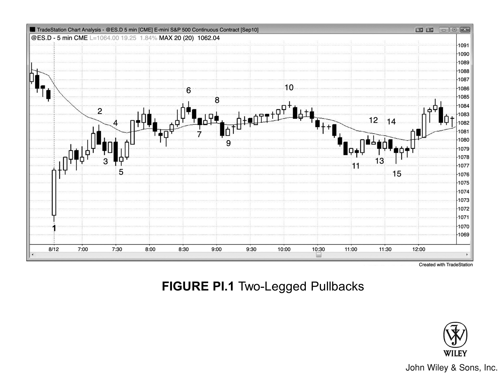

# 第一部分：价格行为

## 定义与基础

对交易员来说，**价格行为**最实用也最简单的定义就是：任何图表、任何时间周期上的价格变动。价格变动的最小单位是 Tick，不同市场的 Tick 值各不相同。说起来，Tick 有两层含义：一是市场价格能变动的最小幅度，对大多数股票来说就是一美分；二是当天发生的每一笔成交，所以逐笔成交表上的每一条记录都算一个 Tick，即使它跟上一笔成交价相同。每一次价格变动都是价格行为的一个实例。价格行为并没有一个公认的定义，而你又必须时刻留意市场给出的每一条信息——哪怕看起来微不足道——所以定义必须足够宽泛。任何细节都不能轻易忽略，因为很多时候，一开始看似不起眼的东西，最终能带来一笔很棒的交易。

光靠定义本身并不能告诉你怎么下单，因为每根K线都可能是做多信号，也可能是做空信号。市场上总有人打算在下一个 Tick 做空，因为他们认为价格不会再往上走一个 Tick；也有人打算买入，因为他们认为价格不太可能再往下走一个 Tick。他们可能看的是同一张图表，但一个交易员看到了看涨形态，另一个却认为存在更强的看跌形态。他们的判断依据可能是基本面数据，也可能是其他千百种理由。一方会对，另一方会错。如果买方判断错了，价格跌了一个 Tick、又一个、再一个，他们就会开始怀疑自己的判断是否有误。到了某个临界点，他们不得不割肉离场。这时他们从买方变成了新的卖方，不再提供买盘，市场因此进一步下跌。卖方会持续入场——要么是新开的空头，要么是被迫平仓的多头——直到某个价位有更多买方开始进来。这些买方中，有新的做多者，有止盈平仓的空头，也有新开空头之后反而亏损、不得不买入平仓的人。市场就这样反弹上去，直到这个过程再次反转。

## 趋势市场与交易区间市场

交易员每天反复面对的核心问题就是：当前市场是在走趋势还是没在走趋势。哪怕只是看一根K线，他们也要判断这根K线内部是趋势行情还是非趋势行情。这根K线是不是趋势K线？——开盘价靠近一端、收盘价靠近另一端。还是交易区间K线？——实体很小，带着一根或两根很长的影线。如果看的是一组K线，他们就要判断市场整体是在走趋势还是处于交易区间。举个例子，如果市场处于多头趋势，交易员会在高位或低位寻找做多机会，甚至在整段行情的顶部突破处买入；但如果市场处于交易区间，他们只会在区间底部买入，在区间顶部则想要卖出而不是买入。至于三角形、头肩顶、头肩底之类的传统形态，本质上都是交易区间。给它们贴一个名称其实没多大帮助，因为真正重要的只有一件事：市场是不是在走趋势，而不是你能不能辨认出某个常见形态并给它贴个标签。交易员的目标是赚钱，而他们能从市场中提取到的最关键信息，就是当前是否有趋势。如果有趋势，就假设趋势会延续，顺着趋势方向找入场机会（**顺势**）。如果没有趋势，就反着最近一段行情的方向找入场机会（**押注失败**或**逆势**）。趋势可以短到只有一根K线（在更低的时间级别上，那根K线内部可能存在一段强趋势），也可以在5分钟图上持续一整天甚至更久。怎么做出这个判断？靠的就是读懂眼前图表上的价格行为。

## 市场效率与概率

有一点很重要：大多数时候，下一个 Tick 涨跌的概率各占 50%。实际上，交易日的大部分时间里，市场先涨 X 个点和先跌 X 个点的概率基本是五五开。偶尔，这个概率会偏移到大约六四开，这些短暂的窗口就是好的交易机会。但很快市场就会回到不确定状态，多空双方重新回到大致均衡的五五开格局。

参与交易的人数众多，方法也五花八门，所以市场非常高效。举个例子，假设你不看图表，在交易日的任意时点市价买入，同时在高 10 Tick 的地方挂止盈、低 10 Tick 的地方挂保护性止损（OCO，一方成交则另一方自动撤单），那你盈利的概率就是 50%。反过来做空也一样，用 10 Tick 的止损和止盈，在保护性止损被打掉之前赚到 10 Tick 的概率仍然是五五开。把 X 换成 20 Tick 或 30 Tick，结果也一样。当然有明显的例外，比如 X 值选得太大就不适用了；但只要 X 值在近期价格行为的合理范围内，这条规则就相当准确。

强趋势的急速阶段，接下来几根K线延续趋势的概率可能达到 70% 甚至更高，但这种状态持续时间很短，一天里很少出现超过一两次。一般来说，在强势的突破趋势形成过程中，如果你选的 X 值小于当前突破走势的幅度，那么在 X Tick 的保护性止损被打掉之前先拿到 X Tick 利润的概率就有 60% 或更高。比方说，一轮多头突破已经走了 4 个点（16 Tick），而且势头很强，你选 X = 8，那么在 8 Tick 的保护性止损触发之前先赚到 8 Tick 的概率大概有 60%。

正是因为市场天生具有高度不确定性，我在描述至少 60% 的情况会出现的走势时，经常用*通常*、*可能*、*大概*这样的字眼。读起来可能不够痛快，但如果你想靠交易谋生，这就是你能拿到的最好的确定性了。没有什么事情接近百分之百，你始终是在一片灰蒙蒙的迷雾中操作。你见到的最好的交易机会，也只能用这些不确定的词来描述，因为这才是交易者真实处境的最准确表达。

一切都是相对的，一切都可能在一瞬间完全反转，哪怕价格一动没动。也许你突然发现当前K线高点上方 7 Tick 处有一条趋势线，于是不再想做空，转而考虑买入去测试那条趋势线。盯着后视镜做交易肯定会亏钱。你得一直往前看，不要纠结刚犯的错误。那些错误跟下一个 Tick 没有任何关系，必须把它们抛在脑后，持续重新评估价格行为，而不是盯着当天的盈亏不放。

## 价格行为贯穿所有时间周期

每一个 tick 的变动都会同时改变所有时间周期图表上的价格行为——从 tick 图、1 分钟图一直到月线图，无论图表是基于时间、成交量、tick 数量、点数图还是其他任何类型，概莫能外。当然，单个 tick 对月线图来说通常没有意义（除非恰好在某个关键点位仅突破一个 tick 后立即反转），但在越小的时间周期图表上，单个 tick 的价值就越大。道理很简单：如果 Emini 1 分钟图上一根K线的平均高度是 3 个 tick，那么一个 tick 的变动就占了平均K线高度的 33%，这已经是一个相当可观的波动了。

## 突破与形态演变

价格行为最有价值之处，在于观察市场突破前期K线或趋势线之后所发生的变化。举例来说，如果市场向上突破了一个重要的前高，之后每一根K线的低点都高于前一根K线的低点、高点也高于前一根K线的高点，这种价格行为就表明后续某根K线大概率（60%+）会创出更高的价格，即便短期内出现几根K线的回调也不改变这一判断。然而，如果市场向上突破后，紧接着的一根K线是小的内包K线（高点没有超过突破K线的高点），再下一根K线的低点又跌破了这根小K线的低点，那么突破失败、价格反转向下的概率就会大幅上升。

小形态会演变成更大的形态，既可能沿同一方向也可能沿相反方向产生交易机会。常见的情形是：市场从一个小旗形中突破，获取了剥头皮利润后开始回调，形态随之演变为一个更大的旗形。这个更大的旗形可能继续沿同一方向突破，也可能反向突破。此外，同一个形态往往可以同时被解读为好几种不同的结构。比如一个较小的 LH，可能同时是更大三角形的第二个 LH，也是更大头肩顶的第二个右肩。你怎么命名并不重要——只要你能正确解读K线，后续走向都是一样的。在交易区间里，经常可以看到相反的形态同时酝酿，比如一个小的熊旗和一个更大的牛旗并存。你选择交易哪个形态、用什么名字来描述它，都无关紧要。唯一重要的是你对价格行为的解读：读得准，交易自然做得好。你会选择最合理的建仓形态入场；如果没有足够的把握，就等到有把握再说。

## 基本面与机构交易的作用

长期来看，基本面决定了股票的价格，而价格是由机构交易者确定的——在长线交易者中，机构的成交量远远大于其他参与者。高频交易公司虽然成交量更大，但本质上是日内剥头皮，对日线图的方向可能（60%+）没有太大影响。价格行为就是机构在探索价值过程中产生的运动。每根K线的高点，不管在什么时间周期上，都处于某个阻力位；每根K线的低点都在某个支撑位；而收盘价之所以在那里，不多一个 Tick、不少一个 Tick，是因为计算机出于某种逻辑把它放在了那个位置。这些支撑和阻力可能不那么显眼，但既然计算机控制着一切，而计算机运行的是逻辑，那么一切都应该有其道理，尽管很多时候不容易看懂。短期来看，计算机算法和新闻决定了价格运动的路径和速度，但基本面决定了最终的方向，而且越来越多的基本面分析本身也是由计算机完成的。当机构认为价格太高时，会平仓或做空；当他们认为价格太低、具有价值时，就会买入。阴谋论者永远不会信，但机构并不会私下开会投票决定价格，然后去坑不知情的散户。它们的"投票"本质上是独立且隐秘的，体现为它们的买卖行为，而结果就显示在价格图表上。它们永远无法隐藏自己在做什么。比如，如果足够多的机构在买入，你会看到市场上涨，这时就应该寻找做多的机会。短期内，机构确实可以操纵某只股票的价格，尤其是成交量稀薄的股票。但跟其他交易方式的收益比起来，操纵价格赚的钱少得多，机构不想把时间浪费在小利润上。因此操纵带来的影响几乎可以忽略不计，尤其是在成交量巨大的市场中，比如 Emini、大盘股、债券和外汇。

每家机构都是独立运作的，彼此并不知道对方在干什么。事实上，大型机构内部有很多交易员互相竞争，他们常常在不知情的情况下站在同一笔交易的对立面，而且并不在乎。每个交易员都在用自己的系统交易，没人关心九楼那个人在做什么。图表上的每一次波动都是总资金量的综合体现；每个交易员受不同因素驱动，有人做各种时间周期的交易，很多交易员根本不看图表，只凭基本面做交易。当我说市场因为某个原因做了某件事时，其实不可能只有一个原因。我给出的原因只是背后无数原因中的一个，指出它只是为了帮你理解一些大资金交易者在做什么。比如，如果市场开盘小幅跳空高开，随后快速下跌到均线附近，然后一整天持续上涨，我可能会说：机构想在更低的价格买入，所以一直观望，等市场跌到一个支撑区域后，他们判断价格不太可能（60%+）再往下走了，于是大举买入。实际上，这可能只是一部分机构交易者的逻辑，其他人在同一价位买入有无数其他理由，其中很多跟你面前的图表毫无关系。

价格行为最有用的地方在于：市场突破之前的K线或趋势线之后会发生什么。比如，如果市场涨过了某个重要的前高，而后续每根K线的低点都高于前一根K线的低点、高点也高于前一根K线的高点，那么这种价格行为说明市场可能（60%+）还会继续走高，哪怕短期内出现几根回调K线。但如果市场向上突破后，紧接着出现一根小的内包K线（它的高点没有超过那根大突破K线的高点），再下一根K线的低点又跌破了这根小K线的低点，那么突破失败、向下反转的概率就会大幅增加。

小形态会演化成更大的形态，更大的形态可能带来同方向或反方向的交易机会。比如，市场从一个小旗形中突破，拿到剥头皮者的利润后回调，这个小形态就演化成了一个更大的旗形。这个更大的旗形可能继续同方向突破，也可能反方向突破。同一个形态经常可以被解读为好几种东西。比如，一个小的 LH 可能既是更大三角形的第二个 LH，也是一个更大的头肩顶的第二个右肩。你叫它什么名字无所谓，因为只要你把K线读对了，后面的走势方向都是一样的。在交易区间里，经常会看到相反的形态同时在构建，比如一个小的熊旗和一个更大的牛旗。你交易哪个形态、用什么名字来描述它，都不重要。重要的是你对价格行为的解读——读得好就做得好。你会选择最合理的建仓形态入场，如果不够确定，就等到确定再说。

我看图表的时候，每一个 tick、每一根K线、每一次波段，都在同时推演多头和空头各自的理由。一天中绝大多数时间，做一笔交易赚到一定 tick 数的概率，跟亏掉同样 tick 数的概率差不多。因为市场一直在寻找价值和平衡，大部分时间里多空双方都觉得自己的仓位没问题。有时候某个方向的胜率能到六四开，在非常强的趋势中甚至能短暂达到八二开甚至更高，但一天中大部分 tick 出现后，胜率大致是五五开，不确定性、价值和平衡占主导。格林斯潘说过，他当美联储主席时大概 70% 的时候是对的。这个数字很能说明问题——他对市场有那么大的影响力，正确率也只有 70%。如果你做交易 70% 的时候能赚钱，而且你根本没办法靠放大交易量来提高胜率，那你的表现已经非常出色了。

电视上那些分析师信誓旦旦说市场要涨，还人身攻击持不同意见的嘉宾——这种人一看就是个傻瓜。这种傲慢说明他觉得自己的预测准确率至少有 90%，但真有这个水平的话，他早就富到不需要上电视了。大多数剥头皮交易的确定性只有 60% 左右，剩下那 40% 值得你非常认真地对待。你应该始终有一个应对相反走势的计划，因为这种情况会经常出现。通常 (60%+) 最好的选择是出场，但有时候反手做会更好。最重要的一点是：你判断的反面，大约会在 40% 的交易中发生。确实有些交易员非常擅长读图、下单和管理仓位，胜率能到 90%，但这样的人非常少。

电视分析师的头衔个个唬人，论点讲得头头是道，形象光鲜，口气像教授，看起来像是在全心全意帮你赚钱。但这一切都是假象，你永远不要忘了——这只是电视节目。电视的目的是给拥有这些节目和电视台的公司赚钱。那些公司的股东根本不在乎你能不能从节目里的交易建议中赚到钱。电视台选分析师看的是收视率，要的是能吸引观众的人，好卖广告。他们总是挑那种特别有魅力、看起来特别真诚、好像真的在关心你财务状况的人，让你忍不住去看、去信任。这些人也许确实真诚，但真诚不代表能帮到你。事实上他们只会误导你，让你以为他们能解决你的财务问题、缓解你养家糊口的压力。他们卖的是虚假的希望，受益的是他们自己，不是你。记住，没有人靠看电视发过财。

很多电视分析师根据基本面分析给出交易建议，再用技术术语包装这笔交易。外汇交易员尤其喜欢这么干。他们会挑出一个事件——比如某国央行即将召开的会议——预测结果，然后根据预期结果推荐一笔交易。描述交易时，他们一定会强调这完全是技术面的判断，跟基本面毫无关系。比如 EUR/USD 正处于多头趋势中，他们就会断言那场会议将推动欧元走强，建议在回调时买入，在最近的波段低点下方设保护性止损，目标利润大约是止损幅度的 2 倍。实际上根本不需要了解那场会议就能做这笔交易。他们不过是在建议多头趋势中买回调，这笔交易跟他们的分析和即将到来的会议没有半点关系。真正因为巨大交易量而左右市场方向的参与者——政府和银行——对那场会议以及可能公布的消息了解得远比这些分析师多，而这些信息早就反映在价格里了。而且这些机构还要考虑大量跟那场会议无关的变量。电视上的评论员只不过是想用自己高深的基本面分析能力来打动观众，想让自己显得特别聪明、特别有洞察力。实际上他们不过是在享受装专家的快感，说的全是废话。他们基于基本面的预测纯属猜测，正确概率只有 50%。他们的技术分析倒是站得住脚，如果交易成功了，完全归功于图表解读能力，跟基本面分析一点关系都没有。股票评论员也经常对基本面做出荒唐的解读，比如告诉观众明天买 GS，哪怕它已经跌了 6 个月，理由是 CEO 很强，他会采取行动终结空头趋势。可这位 CEO 上周在、上个月在、6 个月前也在，GS 照样一路跌！凭什么明天或者接下来几周就会涨？根本没有任何基本面理由，尽管电视上那位像教授般一本正经的"推销员"说得头头是道，但他的工作是替电视台卖广告，不是帮你赚钱。另一位评论员可能推荐 ADM 或 POT，理由是非洲发展迅速，生活水平提高将带来农产品需求。可非洲上个月也在快速发展，6 个月前也一样，今天没什么不同。每当你听到某位评论员基于自以为深刻的见解给出推荐，最好直接假定他是个糊涂蛋，上电视不过是为了博眼球、帮电视台赚广告费。你只要看图表就行了。市场在涨，就找机会买；市场在跌，就找机会卖。电视分析师总是把事情说得好像某一条基本面信息就能左右市场方向。市场远比这复杂，推动市场的原因有成百上千个，其中大部分电视分析师根本无从知道。基本面已经反映在价格行为里了，你只需要看图表，就能明白那些机构——它们比电视上那个小丑聪明得多，交易量大到足以控制市场方向——是怎么解读基本面的。机构分析的是全部数据，不是一小块碎片，它们的交易基于严谨的数学分析，不是随口一说的简单化判断。跟着机构走，别跟着电视评论员走。机构会清清楚楚告诉你它们的看法，也藏不住——就在你面前的图表上。顺带一提，基本面分析本质上也是一种技术分析，因为基本面交易者的决策同样基于图表，只不过他们看的是盈利增长、债务增长、营收、利润率以及其他各种指标的图表。

我看图表时，每一个 tick、每一根K线、每一次波段，都在同时推演多头和空头各自的理由。一天中绝大部分时间，做某笔交易赚到一定 tick 数的概率，跟亏掉同样 tick 数的概率差不多。因为市场一直在寻找价值和平衡，大部分时间里多空双方都觉得自己的仓位没问题。有时候某个方向的胜率能到六四开，在非常强的趋势中甚至能短暂达到八二开甚至更高，但一天中大部分 tick 出现后，胜率大致是五五开，不确定性、价值和平衡占主导。格林斯潘说过，他当美联储主席时大概 70% 的时候是对的。这个数字很能说明问题——他对市场有那么大的影响力，正确率也只有 70%。如果你做交易 70% 的时候能赚钱，而且你根本没办法靠放大交易量来提高胜率，那你的表现已经非常出色了。

电视上那些分析师信誓旦旦说市场要涨，还人身攻击持不同意见的嘉宾——遇到这种人，你就知道他是个傻瓜。这种傲慢说明他觉得自己的预测准确率至少有 90%，但真有这个水平的话，他早就富到不需要上电视了。大多数剥头皮交易的确定性只有 60% 左右，剩下那 40% 值得你非常认真地对待。你应该始终有一个应对相反走势的计划，因为这种情况会经常出现。通常最好的选择是出场，但有时候反手做会更好。最重要的一点是：你判断的反面，大约会在 40% 的交易中发生。确实有些交易员非常擅长读图、下单和管理仓位，胜率能到 90%，但这样的人非常少。

电视分析师的头衔个个唬人，论点讲得头头是道，形象光鲜，口气像教授，看起来像是在全心全意帮你赚钱。但这一切都是假象，你永远不要忘了——这只是电视节目。电视的目的是给拥有这些节目和电视台的公司赚钱。那些公司的股东根本不关心你能不能从节目里的交易建议中赚到钱。电视台选分析师看的是收视率，要的是能吸引观众的人，好卖广告。他们总是挑那种特别有魅力、看起来特别真诚、好像真的在关心你财务状况的人，让你忍不住去看、去信任。这些人也许确实真诚，但真诚不代表能帮到你。事实上他们只会误导你，让你以为他们能解决你的财务问题、缓解你养家糊口的压力。他们卖的是虚假的希望，受益的是他们自己，不是你。记住，没有人靠看电视发过财。

他们研究动量、斜率和趋势线，本质上做的就是技术分析，只是自己不这么认为，而且很多人并不信任纯粹基于价格的技术分析。

## 成交量与价格运动

价格为什么会往上走一个 tick？因为在当前价位上，买方的出价量大于卖方的出价量，而且其中不少买方为了让订单成交，必要时愿意出更高的价。这种情况有时被描述为"买方多于卖方"、"买方占据主导"或"买压"。当所有能在当前价位成交的买单都已成交（即最近成交价），剩余的买方就要考虑是否愿意以高一个 tick 的价格继续买入。如果他们愿意，就会在更高的价位上继续挂买单。这个更高的价格会让所有市场参与者重新评估自己对市场的看法。如果买方出价量持续大于卖方出价量，价格就会继续上涨——因为在最近成交价上，卖方挂出的合约数不够填满买方的订单。到了某个时点，买方会开始挂出一部分合约来部分止盈。同时，卖方会觉得当前价位适合做空，于是挂出的卖单数量超过买方想买的量。一旦卖方挂出的合约更多——不管是多头在平部分或全部仓位，还是新卖方在建空头仓位——当前价位上所有的买单都会被填满，但一些卖方找不到足够的买家。买方报价就会下移一个 tick。如果有卖方愿意在这个更低的价格上卖出，它就成为新的最近成交价。

成交量决定市场方向，所以初学者难免会想：市场深度信息能不能帮自己在交易中占到优势？如果他们在价格梯度面板上下单，就能看到当前价格上下好几个 tick 每个价位的挂单量。他们觉得既然信息摆在那里，肯定有办法拿来用。但他们忘了一件事：市场由算法主导，那些程序员同样在追逐一切可能的优势。当这场博弈的核心是在几分之一秒内快速处理海量信息、以 55% 的胜率每天赚上千次的一两个 tick 时，个人交易员必输无疑。交易员根本无法判断自己看到的挂单是真实的，还是一台计算机用来诱骗其他计算机的陷阱。你很少听到专业交易员说自己把市场深度纳入了决策依据——因为它没用。就算交易员能足够快地处理这些信息，从中获得的优势也远远不如读图带来的优势大。反而会因为分心而错过许多风险相当、但回报更大、胜率更高的交易机会，最终赚得更少。只打你确定能赢的仗。

## 机构订单与价格行为

大多数市场由机构订单驱动，这就引出一个问题：机构是根据价格行为来下单，还是它们的行为本身造就了价格行为？实际上，机构不会盯着苹果（AAPL）或标普 500 ETF（SPY）的每一个 Tick，看到 1 分钟图上出现两段式回调就启动买入程序。它们每天有大量订单要执行，核心目标是以最优价格完成建仓。价格行为只是众多考虑因素之一——有些机构更依赖它，有些则不太用甚至完全不看。很多机构有自己的数学模型和程序来决定何时买卖、买卖多少，而且整个交易日都在不断接到客户的新订单。

交易员在盘中看到的价格行为，是机构活动的结果，远不是机构行动的原因。一个可盈利的建仓形态展开时，交易过程中会有大量不可知的力量汇聚在一起，最终决定这笔交易是赚还是亏。建仓形态其实是一波行情的第一阶段——这波行情已经启动了，价格行为入场让交易员在早期就搭上了这趟车。随着更多价格行为展开，更多交易员会沿着行情方向入场，在图表上形成动量，进而吸引更多交易员跟进。包括机构在内，交易员出于各种各样的理由挂出买单和卖单，这些理由大多无关紧要。但有时候某些理由是有意义的，因为聪明的价格行为交易员可以从被套的交易中获利。比如，如果你知道保护性止损很可能就挂在某根K线低点下方一个 Tick 的位置，一旦触发就会让刚买入的交易员亏损，那你就该考虑在同一价位挂一张卖出突破单做空——那些被套的交易员被迫出场时，你很有机会从中赚到钱。

机构资金量巨大，主导了行情走向，而且大多数仓位的持有周期从几小时到几个月不等，所以它们一般不会去剥头皮，而是倾向于守住最初的入场成本。如果 Vanguard 或 Fidelity 需要为旗下某只共同基金买入股票，客户期望的是基金在收盘时持有股票。没有人买共同基金是指望基金做日内交易、到收盘时全部变成现金的。基金必须持有股票，也就是说它们得买入并持有，不是买入后剥头皮。比如，初次买入之后，它们很可能还有大量要买的，任何小幅回调都会被拿来加仓。如果没有回调，它们就会在市场上涨的过程中继续买入。

有些新手会好奇：市场一路涨上去的时候，谁在买？为什么不等回调再买？答案很简单——机构在不断拆分大额订单、分批买入，力求在最优价格完成全部建仓。大量交易由机构的算法程序执行，程序跑完就自动停止。还有一些机构的程序会在动量强劲时持续买入，动量一减弱就停手。如果一笔交易失败了，原因大概率是交易员误读了价格行为，而不是机构中途改了主意，也不是机构在启动程序几分钟后就拿了几个 Tick 的利润跑掉。这些程序都建立在统计学基础上，而从统计角度看，趋势延续是大概率事件。趋势会一直走下去，直到触及某个技术关键位——到了那个位置，概率上看市场已经走过头了。并不存在某一条趋势线或某个测量移动目标让所有程序开发者达成共识，图表上的关键技术点位实际上数不胜数。当足够多的关键点集中出现在同一片区域时，市场就会转向。一家机构的程序用其中一些关键点，另一家用另一些。当足够多的机构在同一个区域押注反转时，反转就真的发生了。到了那个节点，数学上有利于反转——机构会部分止盈，量化机构则会在反方向建仓。这些算法会继续在反方向交易，直到市场再次过冲，这时数学上再次有利于反转，量化机构又会反手做另一个方向。

既然机构那么聪明、那么赚钱、又主导了每一个 Tick 的走势，为什么还会在多头趋势里买在最高点（或者在空头趋势里卖在最低点）？因为一路上涨的过程中，它们的算法一直在这么做并且赚了钱，其中有些算法的设计就是要一直买到多头趋势明确结束为止。最后那笔买入会亏钱，但之前所有交易赚的利润足以覆盖这笔亏损。别忘了，所有机构的系统都有 30% 到 70% 的失败率，最高点那笔买入只是其中一次失败而已。还有高频交易机构，它们会一路剥头皮到多头趋势的最高 Tick，哪怕只赚一个 Tick。最高点总是落在阻力位上，很多高频交易机构会在阻力位下方一两个 Tick 的地方买入，试图捕获那最后一个 Tick——前提是它们的系统显示这么做能赚钱。还有一些机构买入是为了在其他市场（股票、期权、债券、外汇等）做对冲，因为它们判断加上这笔对冲后盈亏比更好。这些成交量不是散户贡献的——在主要转折点上，散户的成交量不到总量的 5%。

明白"价格行为由机构驱动"这件事，唯一的实际意义就是：它让基于价格行为的交易更加可靠。大多数机构不会在日内频繁进出，不会在你每次入场后立刻把市场打反。你的价格行为入场不过是搭机构的顺风车，不同的是你会把全部或部分仓位做成剥头皮。

顺便提一句，如果剥头皮者的止损比利润目标还大，胜率就必须达到 70% 以上才能赚到钱。能稳定做到 70% 胜率的交易员少之又少，所以大多数人都不应该用比利润目标更大的止损。不过，当潜在利润至少跟风险一样大，而且对这个建仓形态有至少 60% 的把握时，就可以考虑出手。大多数交易员应该先从波段交易入手，找那些利润至少是风险 2 倍的机会。这类交易的成功概率通常只有 40% 到 50%，一天也就几次机会，但长期赚到钱的可能性反而更大。有些时候波段建仓形态的成功率能到 60% 甚至更高，但这通常出现在强突破行情中。这种机会对大多数交易员来说很难把握，因为分析时间有限、K线很大导致风险也大，但从数学角度看，这往往是交易员能遇到的最好的盈亏比。

有些公司做日内交易，量非常大。不过它们的交易要赚钱，市场就得朝它们的方向走很多个 tick，而价格行为交易者能在行情最早期就察觉到这一点，从而提前入场，并且有把握判断剥头皮成功的概率很高。这些公司不可能让市场反向走 15 个 tick——如果它们只想剥 4 个或 8 个 tick 的话。所以它们只会在觉得反向波动风险很小的时候才入场。如果你在图表上读懂了它们的行为，你同样应该对自己的交易有把握，但一定要在市场上挂好止损，以防你的判断出错，或者其他机构用反方向的交易压过了当前这波行情。

有一种很常见的现象：回调会精确测试入场K线的极端价位，一个 tick 都不差。比如做多入场后，买方通常会在入场K线收盘后把保护性止损挂在入场K线低点下方一个 tick。经常可以看到回调恰好打到入场K线低点，但没有再低一个 tick。这说明止损没有被打掉，背后一定有机构级别的量在保护这些止损。这个价位在图表上非常明显，它们就是基于价格行为在那里买入的。

在 5 分钟 Emini 图上，有些价格行为事件会改变聪明的交易者的判断。比如，多头趋势中出现了两段式回调（ABC），然后市场涨过了前一根K线的高点，很多买方就会在那根K线高点上方一个 tick 做多（这是高 2 做多入场）。如果之后市场跌破了这个两段式回调的低点，所有人都会认为市场可能 (60%+) 至少还有一段下跌。如果你是一个机构交易员，买入了这个高 2，你不希望它失败，你会一路往下加仓买入，一直买到那个关键保护性止损价位上方一个 tick 为止。这家机构就是在用价格行为来支撑它的多头仓位。

有些刚入门的交易员会好奇：市场一路直线涨上去的时候到底是谁在买？为什么有人按市价单买入，而不是等回调？答案很简单——是机构在分批把订单填满，在能拿到的最好价格买入，市场继续涨它们就继续买。而且很多交易是机构的计算机算法在做，程序跑完就停了。还有一些公司的程序是只要动量强就持续买入，动量一减弱就停。如果一笔交易失败了，更大的可能是交易员误判了价格行为，而不是某家机构改了主意，或者在启动程序几分钟内就拿了几个 tick 的利润。这些程序都是基于统计的，而趋势延续在统计上就是大概率事件。趋势会一直持续，直到价格到了某个技术性位置，概率上显示走得太远了。并不是说所有软件开发者都认同某一条趋势线或某个测量移动目标——图表上实际有无数个关键技术位置。当足够多的关键位置聚集在同一个区域时，市场就会转向。一家公司的程序用其中一些，另一家用另外一些。当足够多的公司都在同一个大致区域押注反转时，反转就会发生。到了那个时候，数学上有利于反转：机构会部分止盈，量化公司会在反方向开仓。这些算法会继续朝反方向交易，直到市场再次过冲，那时数学上又有利于反转，量化公司会再次押注反方向。

如果机构那么聪明、那么赚钱，而且对每个 tick 都有影响力，为什么它们还会买在多头趋势的最高点（或者卖在空头趋势的最低点）？因为它们的算法一路涨上来就是这么做的，而且一直在赚钱，有些算法的设计就是继续这样做，直到明确确认多头趋势已经结束。它们在最后那一笔买入上会亏，但之前所有交易赚的钱足以弥补这笔亏损。记住，它们所有的系统都有 30% 到 70% 的时间在亏钱，这只是其中一次。还有一些高频交易公司会一直剥头皮，哪怕只剥一个 tick，一路剥到多头趋势的最高点。最高点总是在阻力位上，很多高频交易公司会在阻力位下方一两个 tick 买入，试图吃到最后那一个 tick——前提是它们的系统显示这是一个能赚钱的策略。还有些机构买入是为了在其他市场（股票、期权、债券、外汇等）做对冲，因为它们觉得加上对冲后盈亏比更好。这些成交量不是来自散户的，因为在主要转折点上散户的成交量不到总量的 5%。

认识到"价格行为是由机构驱动的"这一点，唯一的意义在于：它让基于价格行为的交易更可靠。大多数机构不会像日内交易那样频繁进出，导致你每次入场后市场都反转。你的价格行为入场只不过是搭了它们的顺风车，但跟它们不同的是，你是在对全部或部分仓位做剥头皮。

## 高频交易

有一点很重要：每天股票、期货、ETF、外汇、大宗商品和期权的成交量中，有很大一部分——而且比例还在不断增加——是由高频交易（HFT）公司完成的。这些公司的算法由被称为"宽客"的量化分析师设计。大多数程序员拥有数学、量化分析、工程、编程或物理学的硕士或博士学位，最顶尖的一年能赚100万美元。有些算法持仓仅零点几秒，有些则会持有一两个小时。各种你能想到的策略都在被使用——从基于海量数据进行复杂金融分析的模型，到简单的统计异常捕捉。每个策略都必须有扎实的逻辑支撑，回测也必须证实其有效性。有些程序员甚至会在盘中实时调整程序，以便在接下来几个小时获得优势。很多程序运行在纳秒级别（十亿分之一秒），任何能缩短从接收数据到成交之间延迟的硬件和软件改进都会被采用。最快的编程语言和操作系统也被用来降低延迟。由于优势极为微小，而涉及的资金动辄数亿美元，高频交易公司往往非常隐秘、低调，里面都是聪明人。

CBS 的《60 Minutes》在 2010 年 10 月做了一期关于高频交易的报道，称高频交易程序贡献了高达 70% 的成交量，每天超过 10 亿股。这个说法有些误导性，因为高频交易公司只是算法交易世界的一部分。还有一些为较长周期交易设计的程序，也被计入了那 70%。无论是瞬时的高频交易软件，还是较长周期的程序化交易软件，都是量化分析师开发的。这些宽客都是数学家，其中设计高频交易程序的那些人根本不关心图表或基本面，只关注基于统计分析的短期市场倾向。他们中大多数人连 5 分钟图表都不看，他们的交易跟你白天盯着看的任何图表都没有关系。

在那期报道中，《60 Minutes》采访了 Tradeworx 的负责人——这是一家由数学家和宽客组成的小型高频交易公司，每天在其覆盖的 4500 只股票上交易 4000 万股。也就是说，平均每只股票每天交易 1 万股。由于交易员每笔交易往往只赚 1 美分甚至不到 1 美分，持仓时间只有几秒到几分钟，仓位可能(60%+)非常小。所有交易都由计算机执行，因为他们捕捉的机会仅存在零点几秒，人类根本反应不过来。因为他们交易 4500 家公司，其中排名第 4500 位的公司在市值上可能(60%+)日均成交量也很小。这意味着他们交易的一些公司日成交量可能只有几十万股甚至更少。如果 Tradeworx 在某只股票上交易 1 万股，另外还有 50 家高频交易公司也各交易 1 万股，加起来就是每天 500 万股。这已经超过了该公司股票的总成交量，所以 Tradeworx 很可能(60%+)经常每笔只交易 1000 股甚至更少。这些交易员显然不会在每只股票上都交易 1 万股，但根据 4000 万股的总交易量和 4500 只股票来算，平均就是这个数。他们可能(60%+)在日成交量巨大的公司上交易更多的量、更高的频率，但在很多股票上仍然只能交易很小的量。很多公司的交易目标就是每笔赚 1 美分甚至更少，持仓几秒到几分钟。

这些程序完全建立在统计学基础上。交易中的优势向来很小，但只要数学上的确定性足够高，并且每天用上千次，理论上就能产生稳定利润。赌场赚钱的道理一模一样——大多数赌局中，赌场的优势只有3%甚至更低，但它们有超过99%的把握确认这种优势是真实存在的，而不是巧合。假如赌场只有一个客户，这个人一把就压了10亿美元，赌场有47%的概率会因为这一把而倒闭。但如果每天有几千个赌客下小注，赌场持续盈利的概率就大得惊人了。高频交易公司也是同样的道理。

一位量化分析师提到过一种假设策略：在一篮子4500只股票里，凡是过去一周跌了5%的，每只买入5美元；凡是过去一周涨了10%的，每只做空10美元。赢的次数只比输的次数多一点点，但只要一个带有微小优势的系统交易得足够频繁，就能像赌场一样产生稳定利润。他说自己的公司有时会连亏两三天，但从来没有亏过一整个月。一位受访者提到，据说有一家公司连续4年每天都在赚钱。可以合理推测，这些公司会拿一切能拿到的数据——价差、成交量、相关市场、大盘整体走势——去测试每一种想得到的策略，只要回测显示有优势，就一直交易下去，直到策略失效为止。

这些公司能比别人早几毫秒拿到订单流信息。它们每月花数万美元，把服务器尽可能放到离交易所最近的地方，以最快速度获取信息，同时还跑着市面上最快的计算机。每多争取一毫秒，优势就多一分。它们的计算机每秒发出并撤销几千笔订单，借此感知市场即将往哪个方向走，然后尽早入场、尽早出场。技术在飞速变化，而既然电脑化交易掌控了大部分成交量，也就掌控了大部分价格行为，这种局面很可能会一直持续下去。对个人交易员来说，有一个重要的好处：巨大的成交量带来了非常充足的流动性，交易员可以在很小的价差内进出市场，交易成本因此降低了不少。

道琼斯公司现在有一项叫 Lexicon 的新闻服务，专门向订阅者发送机器可读的财经新闻。Lexicon 扫描所有关于股票的道琼斯报道，把信息转换成算法能直接使用的格式，让算法在一瞬间做出买卖决策。还有一些算法在更长的时间周期上运作，除了新闻源，还会分析股票表现和财报数据来辅助决策。有些算法使用差分进化优化软件来生成数据，再用生成的数据继续衍生新数据。它们可以不断精炼数据，直到达到某个数学确定性的门槛，然后自动执行买入或卖出。有些订单太大，没法一次下完，算法交易软件就会把大单拆成小份，防止被其他想从即将形成的趋势中获利的交易员察觉。还有一类掠夺性算法，专门试图识破其他算法程序想要隐藏的意图。所有人都在找优势，越来越多的公司在用计算机来发现优势、执行交易。

交易员不可能在5分钟图上来得及分析一份报告及其全部影响并下单。计算机处理信息和下单的速度远超个人交易员，所以在报告刚发布的那段时间里，计算机相对个人交易员有巨大的优势。对手有巨大优势，你就处于很大的劣势——也就是说你没有优势可言。你自己的优势本来就不会太大，而且只该在有优势时交易，没有优势时就该回避——尤其是对手优势特别大的时候。不过，你仍然可以从报告中赚到钱。现在有这么多公司在用计算机快速分析报告并据此下单，交易员只需要能读懂图表，看出所有这些分析汇总后的共识方向就行。计算机会把报告对市场的含义摆在你面前，你要做的就是顺着同一方向交易。顺便说一下，计算机在尾盘还有一个额外的优势。交易员连续交易好几个小时后，自然会疲惫、反应变慢，还会抗拒下单。计算机永远不会累，在收盘前最后几秒钟依然跟开盘时一样高效。如果交易员不在最佳状态——最后一个小时常常如此——优势就会减弱甚至消失，这时候只有自身状态好、建仓形态也强的情况下，才应该下单。

仔细想想，高频交易公司面临一个天然的问题：他们可能会杀死那只下金蛋的鹅。他们的交易以统计为基础，虽然大多经过多年回测，但他们肯定也在盯着过去几周市场的表现。如果足够多的公司根据近期价格行为做出调整，就不会有足够的对手盘来接他们的单，结果就是他们没法按算法预期的方式交易，赚的钱也会变少，甚至可能亏钱。这种失衡会改变价格行为。举个例子，如果近期日均波幅缩小到长期均值的大约三分之一，这种状态不可能持续太久。最终所有人都会找到从小行情日中赚钱的方法，而且很可能 (60%+)大家都在做同样的事。到某个时候，就没有足够的资金去充当他们的对手盘了，要么成交不了，要么只能接受更差的入场价。不管是哪种情况，都会改变市场的行为。

许多为机构客户执行大单的机构交易员对高频交易者很不满，但我怀疑其中很大一部分是嫉妒。这些机构交易员曾经站在食物链的顶端，市场所有重要的波动都是他们推动的，现在不是了。他们看到量化交易员持续赚更多的钱，而且赚钱的方式完全无视基本面——那些传统机构交易员视为华尔街基石的东西。他们讨厌这些后来者闯入自己的地盘，无视他们的规则和他们珍视的一切，业绩记录远远更好，更受敬畏，甚至可能 (60%+)成为最优秀年轻新人更想去的地方。他们的部分客户资金很可能 (60%+)正在被分流到高频交易和其他程序化交易公司，这威胁到了他们的收入。不过，做交易的目标毕竟是赚钱；我乐意看到流动性增加，也喜欢现在常见的强劲波段。我甚至喜欢这些量化交易员制造的窄交易区间，只是做起来压力更大。

流动性说的是能不能随时以公平价格买卖股票。从这个角度看，高频交易商其实在帮机构交易者拿到合理的成交价。过去这种流动性由做市商提供，现在高频交易公司已经在很大程度上取代了做市商。有意思的是，当年人们怎么抱怨做市商的不公平行为，现在就怎么抱怨高频交易。一个很大的不满是：市场崩盘时做市商拒绝接盘，而那恰恰是大多数交易者最急需对手盘的时候。还有一些针对暗池、闪电交易、交叉网络、抢先交易以及电脑化交易各方面的抱怨，但大多数不公平行为最终可能（60%+）会被联邦政府压制下去，长远看不会对个人交易者造成太大问题。

量化交易员给市场注入了流动性，缩小了所有交易者的价差，但当足够多的量化程序在同一时间做同一件事时，有时会在几分钟内引发大幅波动。这些剥头皮程序对日内波段的影响可能（60%+）不大，日内波段更多是机构替客户执行订单的结果。长远看，基本面决定一切；但在接下来几秒到几分钟这个尺度上，程序交易往往主导市场，而且跟当下基本面可能（60%+）毫无关系。基本面决定了未来几个月的方向和目标位，但数学家们决定了市场走向目标位的路径。这些算法以统计为基础，实际上可能会强化支撑与阻力以及趋势，因为市场存在惯性。市场倾向于延续当前的运动状态，程序编写者会捕捉到反复出现的行为模式，编写程序加以利用。因为趋势可能（60%+）延续，程序会持续建立顺势仓位，这可能让趋势更稳定、回调更小。同样，大多数交易区间的突破尝试会失败，在这么多资金押注突破失败的情况下，突破失败的概率甚至可能更高。

市场虽然有惯性，但到了某个点，当前的价格行为就会变得过度。比如 SPY 日线处于多头通道中，已经 45 天没有触碰均线，而过去 10 年里这种情况只出现过一次，那当前的走势就极其异常。任何极端状态都撑不了太久，因为最终它会在你能想到的每一个衡量过度的指标上都表现为极端，而极端就是机会。市场不擅长判断"涨多远才算够"，但非常擅长判断"什么时候已经过头了"。一旦足够多的机构认定市场出现了极端，它们会把这当作优势，下注均值回归——押注市场将回归到一贯的运行方式。拿 SPY 多头的例子来说，强势空头会在此处做空，并随着远离均线的天数进一步增加而加仓。同时，强势多头看到这种异常走势后，也会开始止盈，不再考虑买入，除非市场至少回调到均线附近。市场可以在任何类型的行为中达到极端——比如连续出现空头趋势K线的数量、连续多日振幅只有均值一半或两倍的天数、连续多根K线的低点、高点或收盘价高于前一根的数量，以及你能想到的几乎任何其他指标。总有机构在盯着各种形式的极端行为，随时准备押注失败。而且，极端行为最终会在你能想到的每一个技术指标上都显示为极端，所以那些根据指标做决策的交易者也会开始押注这种行为即将结束。没错，极端最终会结束，但除非你对自己的判断非常有信心，否则不要去逆势做——市场维持异常状态的时间，可能远比你的账户能撑住的时间更长。

交易者不可能在 5 分钟图上来得及分析一份经济报告及其全部影响就下单。电脑处理信息和下单的速度远超个人交易者，报告发布后的瞬间它们占尽优势。对手拥有巨大优势时，你就处于很大的劣势，等于没有优势。既然你的优势本来就不大，而且应该只在有优势时才交易，那在没优势的时候就该回避——尤其是对手优势特别大的时候。不过，你仍然可以从报告中赚到钱。现在有大量公司用电脑快速分析报告然后据此下单，交易者要做的就是看懂图表，看看所有这些分析得出的共识方向是什么。电脑会告诉你这份报告对市场意味着什么，你只需要顺着同一方向交易就行。顺便说一句，电脑在尾盘还有一个额外的优势。连续交易几个小时后，交易者自然会疲倦、反应变慢、不愿再开仓。电脑永远不会累，直到收盘前最后几秒都跟开盘时一样高效。如果交易者状态不好——尾盘最后一个小时经常这样——优势就会减弱甚至消失，这时应该只在自身状态和建仓形态都很强时才交易。

仔细想想，高频交易公司面临一个天然的问题：它们可能会杀死下金蛋的鹅。它们的交易基于统计，虽然主要经过多年回测验证，但肯定也会关注最近几周的市场表现。如果足够多的公司根据近期价格行为调整策略，就不会有足够的对手盘来承接它们的交易，结果就无法按算法预期的方式执行，赚不到那么多钱，甚至可能亏钱。这种失衡会导致价格行为发生变化。比如近期日均振幅已经缩小到长期均值的三分之一左右，这种状态不可能维持太久。最终所有人都会找到从小振幅中获利的办法，而且很可能（60%+）大家都在做同样的事情。到了某个时刻，对手盘的资金就不够了，它们要么无法成交，要么不得不接受更差的入场价。不管是哪种情况，都会改变市场的行为模式。

许多负责为机构客户执行大单的机构交易员对高频交易者非常不满，但我觉得很大程度上是出于嫉妒。这些机构交易员过去站在食物链顶端，市场中所有重大波动都是他们推动的。现在不是了。他们眼看着量化交易员持续赚更多钱，而且赚钱的方式完全无视那些传统机构交易员视为华尔街根基的基本面分析。他们讨厌这些新人闯进自己的地盘、无视他们的规则和一切他们珍视的东西，却拥有好得多的业绩记录、赢得最多的敬畏，而且可能（60%+）正在成为最优秀的年轻新交易员更向往的去处。很可能（60%+）他们的部分客户资金正被分流到高频交易和其他程序化交易公司，直接威胁到了他们的收入。不过，做交易的目标就是赚钱；我乐于看到流动性增加，也喜欢现在常见的那些幅度大的波段。我甚至喜欢量化交易员制造出的窄交易区间，只不过这些区间交易起来压力更大。

## 两段式回调

图 PI.1 以及本书所有图表均可在 https://www.wiley.com/go/tradingtrends 下载，下载后可以放大查看细节。

两段式回调是顺势交易中可靠的建仓形态。K线计数会在后续章节（第二本书）中详细讨论，但 ABC 形态几乎出现在每张图表上，所以这里有必要先简单介绍一下。如图 PI.1 所示，价格强势上涨到K线 2 之后，K线 3 是第一段下跌，也就是 ABC 回调中的 A 腿。随后小幅上涨到K线 4 高点是 B 腿，再下跌到K线 5 低点是 C 腿。大多数回调并不是清晰的 ABC 形态，有的只有一段，有的则有三段甚至四段，所以需要另一种方式来描述这些走势。把四段式回调标成 ABCDE 太笨拙了，没什么实用价值。换一种方法：多头腿中出现回调（比如图 PI.1 中回调到K线 3）之后，第一根突破前一根K线高点的K线就是高 1 做多入场点。K线 4 就是一个例子，K线 7 之后那根也是。如果回调继续向下走出第二段（比如跌到K线 5），那么K线 5 之后第一根突破前一根K线高点的K线就是高 2 入场点。K线 5 之后那根就是高 2 做多入场的例子，K线 9 之后那根也是。K线 5 和K线 9 是高 2 买入建仓形态的信号K线。如果多头旗形中出现第三段下跌，那入场就是高 3 买入；如果再出现第四段下跌后市场掉头向上，入场就是高 4 做多。当市场处于空头腿中（比如从K线 10 开始的下跌），第一段反弹就是 ABC 回调的 A 腿。K线 12 或它前面那根K线就是那个 A 腿。这一小段反弹之后的回落是 B 腿，即K线 13。接着第二段反弹是 C 腿，到K线 14 前一根结束。这是一个横向 ABC 形态，C 腿不超过 A 腿的情况在 ABC 回调中很常见。K线 13 是低 1 做空入场点，因为它是空头旗形中第一根跌破前一根K线低点的K线。K线 15 是低 2 做空入场K线。

大的波段走势基本上势不可挡，但小级别的价格行为会被一些盯着每个 Tick 的机构交易员、或基于小幅价格变动编写程序的机构交易员精细调控。举个例子，一些 Emini 交易员会尝试剥头皮，目标是 1 个点（4 个 Tick）的利润。如果他们刚做多入场，市场通常需要在信号K线高点上方走出 6 个 Tick。他们很可能是用买入突破单在信号K线高点上方 1 个 Tick 处入场，止盈限价单挂在入场价上方 4 个 Tick。一般来说，限价单要等到市场交易到比限价单价格再高 1 个 Tick 的位置才会成交——也就是信号K线高点上方 6 个 Tick。有时候市场反复触及 5 个 Tick 就是不到 6 个（潜在的 5 Tick 失败），这时突然出现一笔 250 手 Emini 的成交，而价格并没有下跌。一般来说，在目前的 Emini 市场上，超过 100 手的交易就应该被视为机构行为。即使那只是某个大户，他也很可能具备机构级别的洞察力，而且交易量达到了机构级别，所以跟机构没有区别。既然价格停在 5 个 Tick 没有下跌，那笔 250 手的单子几乎可以肯定是机构买单。道理很简单：如果机构在一个满是紧张多头的市场里卖出，价格会迅速下跌。市场已经涨了 5 个 Tick 时机构还在买入，说明他们预期价格不止再涨 1 个 Tick，通常一两分钟内价格就会冲破 6 个 Tick 并继续大幅上涨。机构在高位买入，意味着他们认为市场还会走高，而且随着价格上涨，他们很可能还会继续加仓。同样，由于 4 Tick 剥头皮的成功率很高，很可能存在机构级别的剥头皮行为，对日内大多数剥头皮交易产生着巨大影响。

流动性指的是能以合理价格立即成交的能力。这意味着高频交易实际上在帮助机构交易员获得更好的成交价格。过去这种流动性由做市商提供，但现在做市商的角色已经基本被高频交易公司取代了。顺便说一下，就像现在有人抱怨高频交易一样，过去也有人抱怨做市商的不公平行为。最大的不满之一是：市场崩盘的时候他们不愿意接单，而那恰恰是大多数交易员最迫切需要对手方的时候。还有人抱怨暗池、闪电交易、交叉网络、抢先交易以及计算机化交易的方方面面，但大多数不公平行为最终很可能会被联邦政府压制下来，长远来看不会对个人交易员造成问题。

量化交易员在为市场提供流动性的同时也在缩小所有交易员的买卖价差，但如果足够多的程序在同一时间做同一件事，有时会在几分钟内引发大幅波动。这些剥头皮程序对日内波段走势的影响可能不大，波段走势更多是机构为客户执行订单的结果。长期来看，基本面决定一切；但在接下来的几秒到几分钟内，程序化交易往往主导市场，而且这可能跟相关市场的基本面毫无关系。基本面决定了未来几个月的方向和目标位，但数学家们决定了市场走向目标的路径。由于算法以统计为基础，它们实际上可能在强化支撑、阻力和趋势性——因为市场存在惯性。市场倾向于延续当前的运动方式，程序开发者会识别出反复出现的行为模式，编写程序加以利用。既然趋势很可能延续，程序就会持续建立顺势头寸，这可能让趋势更加可靠、回调更小。同理，大多数交易区间的突破尝试都会失败，而如此大量的资金押注突破失败，突破可能就更容易失败。

虽然市场有惯性，但到了一定程度，当前的价格行为就会变得过度。举个例子，如果日线 SPY 处于多头通道中，已经 45 天没有触及均线，而且过去 10 年里只出现过一次这种情况，那当前的走势就极不寻常。任何极端状态都不可能持续太久，因为它最终会在所有可以想象的衡量指标上都表现为过度，而过度就意味着机会。市场不擅长判断"走多远才算到位"，但非常擅长识别"什么时候已经走过头了"。一旦足够多的机构认定市场过度，它们就会把这当作优势，押注均值回归——赌市场会回到一直以来的常态。拿那个 SPY 多头来说，强势空头会做空，并且随着远离均线的天数越来越极端而不断加仓。同时，强势多头也会注意到这种异常，开始止盈，并且不再考虑买入，至少要等到市场回调到均线附近。极端行为可以出现在任何类型的市场表现中，比如：

- 连续空头趋势K线的根数
- 连续多少天振幅只有平均值的一半或两倍
- 连续多少根K线的低点、高点或收盘价都高于前一根
- 以及你能想到的任何其他指标

总有一些机构会关注各种形式的极端行为，然后押注其失败。极端行为最终也会在所有可以想象的指标上显示为极端，所以那些依据指标做决策的交易员也会开始赌这种行为将终结。没错，极端最终一定会结束，但除非你对自己的判断非常有信心，否则不要逆势交易——因为市场维持异常行为的时间，可能比你的账户撑得住的时间还长。

交易员会密切关注关键时间周期收盘前最后几秒的走势，尤其是3分钟、5分钟、15分钟和60分钟K线。成交量K线图在关键成交量节点上也是如此。举个例子，如果很多交易员都在看10年期美国国债期货的1万股成交量K线图，那么当一根K线即将收盘时（它在这根K线起始后累计成交达到至少1万股的那笔交易时收盘，所以实际成交量很少刚好是1万股），往往会出现一波密集交易，目的是影响这根K线最终的形态。其中一方可能想展示自己的意愿，让这根K线看起来更偏多或更偏空。简单来说，一根强多头趋势K线意味着多头主导了这根K线。在强趋势中，反转K线在5分钟K线收盘前最后几秒完全逆转形态是非常常见的事。比如在一段强空头趋势中，可能出现一个正在形成的多头建仓形态，伴随着一根非常强的多头反转K线。然后在收盘前5秒，价格突然暴跌，这根K线收在最低点，把那些抢跑入场的多头全部套住——他们原本预期会出现一根多头趋势反转K线。逆势交易面对强趋势时，必须等信号K线收盘之后再下单，然后用突破单在信号K线之外一个 Tick 的位置入场，方向与你的交易方向一致（如果你要做多，就在前一根K线高点上方一个 Tick 处挂买入突破单）。

## 学习阅读价格行为

学习阅读价格行为最好的方法是什么？打印图表，然后找出每一笔可以盈利的交易。如果你是在5分钟图上做剥头皮、目标是 AAPL 赚50美分或 GOOG 赚2美元，那就把当天每一段能实现这个利润目标的波动都找出来。坚持几周之后，你会开始发现一些形态，让你在承担差不多同等风险的前提下去做这些交易。如果风险和回报相当，胜率必须远超60%才能让这笔交易值得做。不过很多形态的成功率在70%甚至更高，而且很多交易允许你在等待利润目标到达的过程中，把止损从信号K线极值下方移到入场K线极值下方，从而降低风险。同时，你应该尽量选择那些有较大概率远超利润目标的入场机会，只在部分仓位上止盈。事实上，初期你应该只关注这类入场。把止损移到盈亏平衡点，让剩余仓位继续跑。每周你很可能至少会遇到几笔交易，在出现反向入场形态之前，已经跑到初始目标的4倍甚至更多。

斐波那契回撤和延伸属于价格行为的一部分，但由于大多数只是近似值，而且大多数会失败，它们只是偶尔对交易有帮助。比如，一段新趋势中的第一次回调，往往会回撤第一腿的大约62%，但频率还不够高，不足以让你在那个位置挂限价单入场。那样的限价单意味着你在逆着市场方向入场。比如市场正在下跌，你试图在你期望会成为 HL 的位置买入，盈亏比不够高，心理压力也太大，不适合作为常规操作；不过在某些情况下这确实是合理的策略。如果某个斐波那契数值有效，它一定伴随着一个本身就可靠、可交易的图表形态，不依赖斐波那契测量或任何指标。

艾略特波浪理论也是一种价格行为分析方法，但对大多数交易员来说不可交易。波浪形态通常要在理想入场点过去很多很多根K线之后才变得清晰，而且每个时刻都存在大量相互矛盾的解读，太费脑子，不确定性也太大，大多数活跃的日内交易员没法用。
