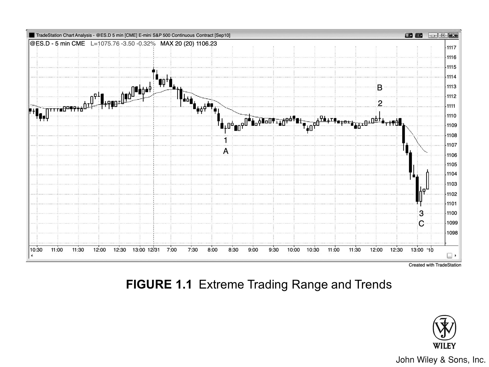

无论谁看图表，都会发现市场时而斜向运动，时而横向盘整，波幅有限。市场展现出的价格行为就像一个光谱：

*   **一端是极端趋势**：几乎每个 tick 都不断创新高或新低；
*   **另一端是极端交易区间**：刚涨一两个 tick 紧接着就跌一两个 tick，反反复复。

市场极少处于这两种极端状态，即便出现也往往转瞬即逝。更多时候，市场要么走出持续很久的趋势，期间仅有微小回调；要么在狭窄范围内上下震荡，耗上好几个小时。**趋势**给人一种确定感和紧迫感，而**交易区间**则让交易者感到迷茫，不知市场下一步意欲何往。

所有趋势之中都包含着更小的交易区间，所有交易区间之中也都包含着更小的趋势。同样，大多数趋势只是更高时间周期（HTF）图表上交易区间的一部分，而大多数交易区间也只是 HTF 图表上趋势的一部分。即便是 1987 年和 2009 年的股市崩盘，也不过是月线多头趋势线上的回调罢了。

接下来的章节主要沿着这个光谱展开：从最强的趋势讲到最窄的交易区间，随后探讨回调（从趋势向交易区间的过渡）以及突破（从交易区间向趋势的过渡）。

> **请务必记住一点：市场具有惯性，倾向于延续当下的行为。**
>
> *   若市场处于 **趋势** 中，大多数反转的尝试终将失败；
> *   若市场处于 **交易区间** 中，大多数试图突破成为趋势的努力也难逃失败。

***

**[Figure 1.1] 极端交易区间与趋势**

图 1.1 包含两段极端趋势和一个极端交易区间。当日开盘即现强劲空头趋势，一路跌至 K线 1，随后陷入异常狭窄的交易区间。直到 K线 2 向上突破一个 tick 后，行情随即反转向下，演变为极强的空头趋势，直抵 K线 3。

“两段式”走势极为常见，但遗憾的是，传统术语对此的定义颇为混乱。不同情境下的称呼如下：

*   **ABC 回调（ABC move）：** 若出现在趋势回调中，通常被如此称呼。
*   **艾略特波浪（Elliott Wave）：** 若这两段构成趋势的开端（first two legs），技术分析师则称其为第 1 浪和第 3 浪，中间的回调即为第 2 浪。
*   **测量移动（measured move）/ AB = CD：** 有些交易者关注当第二段跌幅与第一段大致相等时，预期行情将反转向上。这类分析师常称此形态为 AB = CD：
    *   第一段下跌始于 A，止于 B（图 1.1 中的 K线 1，即 ABC 回调中的 A 点）；
    *   第二段下跌始于 C（图 1.1 中的 K线 2，即 ABC 回调中的 B 点），止于 D（图 1.1 中的 K线 3，即 ABC 回调中的 C 点）。

有些回调会延续至第三甚至第四段（leg），所以我更倾向于使用另一套标记系统来应对，后文将详述。简而言之，这套系统就是计算回调的段数：

*   **多头趋势或交易区间：**
    *   例如，出现一段下跌，随后若有一根 K线突破前一根 K线的高点，该突破即为**“高1”（High 1）**。
    *   若市场随后走出第二段下跌，且再次突破前一根 K线的高点，这根突破 K线便是**“高2”（High 2）**。
    *   以此类推，第三次为“高3”，第四次为“高4”。
*   **空头趋势或交易区间：**
    *   同理，若市场在一段上涨后反转向下，该入场点即为**“低1”（Low 1）**。
    *   若在两段上涨后反转向下，则是**“低2”**入场，而触发入场前的那根 K线即为“低2”形态（setup）或信号（signal）。

鉴于“测量移动”在交易中举足轻重，而“AB = CD”这一术语又与更通用的“ABC”标注法相悖，因此不宜使用“AB = CD”。此外，我偏好“数腿”，既然涉及计数，用数字自然最直观。

所以，我会把每一段价格运动称为一条“腿”（leg）：
*   比如“腿 1”或“第一波推动”，随后是“腿 2”，以此类推。
*   等到第二本书讲 K 线计数时，我还会采用“高/低 1、2、3、4”的标注法，这对交易者大有裨益。

### 本图深度解析

当天开盘便向上突破昨日高点，但突破失败，导致行情演变为“开盘即趋势”的空头趋势日。这也是一个趋势恢复型空头趋势日。

通常情况下，若开盘出现强趋势，随后陷入持续数小时的窄幅交易区间，那么出现趋势恢复日的概率就很大：

*   在太平洋标准时间（PST）上午 11:00 到中午 12:00 左右，常会出现假突破，将交易者诱入错误方向。
*   这种失败的突破构成了绝佳的入场策略（setup），适合做一笔持有至收盘的波段交易。
