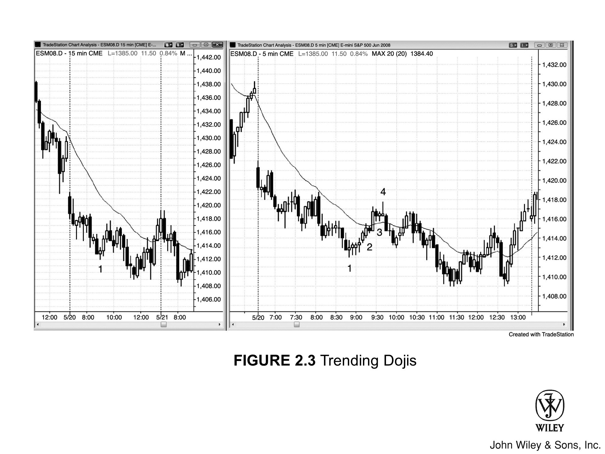
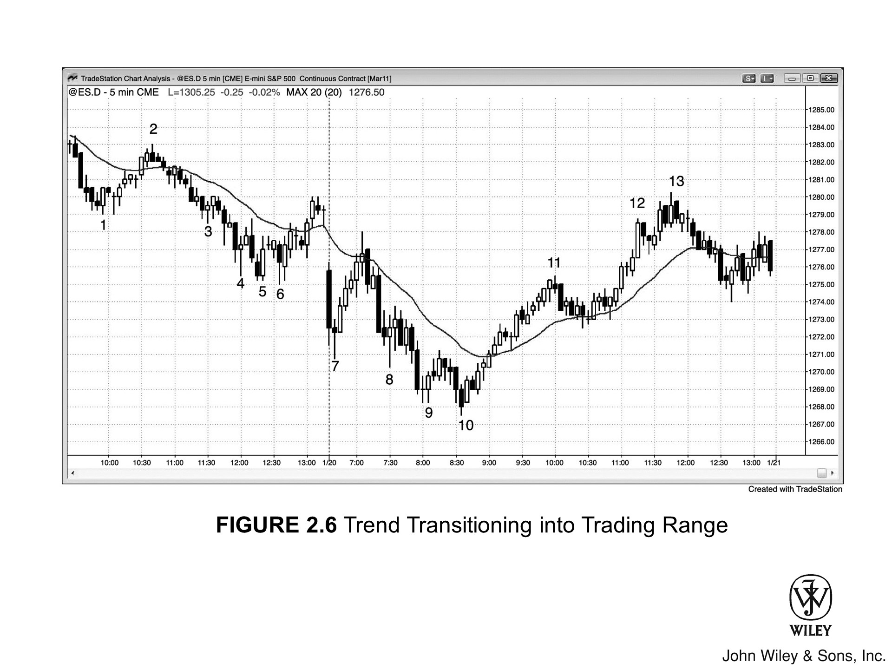

盯着眼前的图表看，市场只有两种状态：要么处于 **趋势** 之中，要么不在。若非趋势，便是处于某种 **交易区间**。这种区间，拆解到更小的时间周期上看，其实也是由一段段趋势构成的。

只要两根或以上的 **K 线** 出现大面积重叠，**交易区间** 便形成了。交易区间的形态各异，名目繁多，诸如旗形、三角旗形、三角形之类，但叫什么名字其实无关紧要。核心在于，多空双方此刻处于某种均衡，通常某一方略占上风。

具体到单根 **K 线**，性质也一样：要么是 **趋势 K 线**，要么是交易区间 K 线。这意味着：
*   要么多空某一方掌控了局面；
*   要么双方势均力敌（即单 K 线交易区间）。

交易之道，首重两大观念：
1.  其一，万事万物皆有数学基础；
2.  其二，无论何时，当你对市场方向笃定不疑时，总有个和你一样聪明的家伙在押注相反的方向。

切勿盲目确信，务必心存一种可能——市场接下来的走势，或许会与你的预判截然相反。虽说市场偶尔会失衡，出现连续多根 **K 线** 的剧烈涨跌，但绝大多数时候，它都处于相对平衡的状态——尽管在新手眼中，未必看得出这份平衡。

每一个 tick 都是一笔成交，这意味着同一个价格，有人觉得卖得值，有人觉得买得值。既然市场由机构主导，而机构又是聪明的，那么交易双方必然都是理性且精明的。他们各自手中，都握有经过实战检验、能稳定盈利的策略。

交易者最重要的基本功之一，就是能一眼看穿一根趋势 K 线到底是一波行情的开端，还是尾声。如果你看到强劲的多头趋势 K 线只知看涨，看到强劲的空头趋势 K 线只知看跌，那你完全忽略了市场上另一半大资金玩家的动向。

***

**在每一根多头趋势 K 线的高点附近：**

*   总有多头在追涨买入强势。
*   另一些多头则在等待回调，一旦价格回落到 K 线低点附近，他们便会出手接货。
*   然而必须清醒地认识到，还有一部分多头并不看好这种强势的持续性，他们正借着上涨的势头，逢高平仓，获利了结。

**更有空头：**

*   无论这根多头趋势 K 线看起来多么势不可挡，在他们眼中不过是多头的高潮与强弩之末，他们正埋伏在 K 线高点附近大举做空。
*   有些人一直在场外观望，苦等一根强劲的多头趋势 K 线出现，只为在他们认为“涨过头”的位置进场做空。
*   还有些空头会选择在 K 线低点下方做空，因为他们视此为示弱信号，预判行情可能由此引发一波可交易的反转。

***

**同理，在每一根空头趋势 K 线的底部——哪怕跌势再猛：**

*   都有空头在获利了结；
*   也有新多头在进场抄底；
*   与此同时，仍有空头盯着高点准备做空；
*   也有多头盯着高点上方准备买入。

对交易者来说，化繁为简最重要：把所有 K 线只看作两类——**趋势 K 线**和**非趋势（交易区间）K 线**。

“非趋势 K 线”这词叫着拗口，长得又大多像**十字星**，不如干脆统称为十字星，简单省事。
*   只要图上 K 线**实体**极小甚至没有，那就是十字星。
*   这说明多空双方谁也没压过谁，本质上，这就是个**单 K 线交易区间**。

这种判断既相对又主观，全看你做的是什么市场、什么周期：
*   在 5 分钟 Emini 图上，十字星可能没实体，或者也就一两个 **tick** 大，看 K 线本身规模而定。
*   但换到 Google 的日线或周线图，实体哪怕有一百个 tick（1 美元）甚至更大，其意义也跟完美十字星没两样，所以叫它十字星也合情合理。

做交易，**差不多就是够好了**，完美难得一见。只要走势看着像某个形态，后面的行情大概率就会照着完美形态的剧本走。

非要把小实体 K 线细分成上吊线、锤子线、孕线这些五花八门的子类，对交易其实没啥大用。
*   核心在于搞清楚这根 K 线和市场是不是**想走出趋势**，同时得明白，市场大多时候都在不上不下的中间状态。
*   判断趋势强弱，远比纠结某根 K 线到底叫什么名字重要得多。
*   赚钱靠的是实盘交易，而不是钻研那些花里胡哨却毫无意义的名词。

只要存在实体，就意味着收盘价远离了开盘价，这根 K 线便是**趋势K线**。显然，如果 K 线很大但实体很小，说明趋势强度并不高。此外，在这根 K 线内部（从小周期看），可能包含几波大体呈**横盘 / 侧向运动**的摆动。但这无关紧要，因为你应当只关注眼前这一张图表。

一般来说，实体越大，强度越高。但是：

*   如果在一波漫长的走势或**突破**之后，出现了一根极大的实体，这可能代表趋势进入了衰竭性的**高潮**终点。此时不应入场，必须等待更多的**价格行为**展开。
*   一连串强**趋势K线**是趋势健康的标志，通常随后会创出新的极值，哪怕紧接着就发生了**回调**。

***

每一根**趋势K线**都同时具备四重身份：

1.  **急速**；
2.  **突破**；
3.  **缺口**（正如第二本书中所述，所有的**突破**在功能上都等同于**缺口**，因此所有的**趋势K线**亦是如此）；
4.  真空与**高潮**的一部分或全部（在一根或连续几根**趋势K线**之后，出现的暂停 K 线或**反转K线**标志着**高潮**的结束）。

在任意一根**趋势K线**中，这四个特征里的某一个或几个可能会占据主导地位。每一个特征都提供了交易机会，这一点将贯穿全书进行探讨。

***

当它表现为**高潮**并开启反转时，这是由“真空效应 (vacuum effect)”造成的。例如，如果一波买入**急速**之后紧接着发生了反转，那么这波急剧的上涨很可能归因于强力空头暂时让路，而多头也推迟平仓，直到价格触及了双方都准备卖出的区域。

相反，如果出现了后续买入 (follow-through buying)，那么这种买盘就不是源于真空效应，而是源于强力多头的买入，加上强力空头确信市场还将进一步上涨。

交易者利用整体**背景**来判断哪种情况的可能性更大。这一评估将指引他们去寻找买点、卖点，或是观望。

显然，凡是能引发反转的 **急速**（Spike），本质上都是真空效应的体现。不过，我这里特指那种打到明显支撑或阻力位（即第二册详述的“决斗线”）后，随即发生反转的 **急速** 行情。

顺便说一句，崩盘正是真空效应的典型案例。回顾 1987 年和 2009 年的股市崩盘，价格都是一口气跌到了月线级别 **趋势线** 的紧下方，随后强力买盘卷土重来，强力空头获利离场，行情随即掉头向上，走出了剧烈的反转。

此外，在 **多头趋势** 中，股票交易者往往敢于逆着强劲的空头 **急速** 买入，视其为价值投资的良机。虽然通常他们会等待强势的 **价格行为**（Price Action）确认后再出手，但对于心仪的个股，一旦遭遇急剧抛售——特别是跌至 **多头趋势** 线附近时——哪怕行情尚未反转，他们也会果断抄底。

他们的逻辑是：

*   受某些新闻事件干扰，市场暂时错杀了个股，导致估值过低。
*   他们之所以敢买，是因为认定这种“打折”不可持续。
*   他们并不介意价格再跌一点，毕竟没人敢打包票能精准抓到 **回调**（Pullback）的绝对低点；
*   他们只想趁着抛售潮赶紧上车，因为坚信市场会迅速纠错，股价很快就会回升。

回调（第 2 册会详述）常以强劲的急速形态出现，这往往让交易者心生疑虑：趋势是不是反转了？

譬如在多头趋势中，可能会突然冒出一两根巨大的空头趋势 K 线，不仅跌破均线，甚至可能向下击穿交易区间好几个 tick。此时，交易者不禁会问：Always-in 的方向是不是正要翻转为下？

他们需要确认的是后续抛售，哪怕只再多出一根空头趋势 K 线也行。所有人都会死盯着下一根 K 线：

*   **若这根 K 线仍是巨大的空头趋势 K 线**
    多数交易者便会确信反转已成定局，随即开始市价做空，或趁回调时进场。

*   **反之，若收盘呈多头态势**
    他们就会怀疑反转尝试已告失败。这波抛售不过是短暂而剧烈的“价格打折”，反倒是绝佳的买入良机。

---

**新手与聪明钱的博弈**

*   **新手**
    盯着强劲的空头急速，却忘了大背景是强劲的多头趋势。他们会在那根空头趋势 K 线的收盘价做空，跌破低点时做空，随后几根 K 线稍有反弹也做空，甚至在任何低 1 或低 2 做空策略下方还要做空。

*   **聪明的多头**
    则站在了对手盘，照单全收，因为他们洞悉局势。市场总是试图反转，但这其中 80% 的尝试都会以失败告终，进而演变为牛旗。

---

**市场深层逻辑**

反转尝试发生时，那两三根空头 K 线看着确实极具说服力，但若无后续抛售跟进，多头就会把这波下杀视为天赐良机，在短暂的抛售高潮低点附近重新做多。

经验丰富的多空双方都在等这些强趋势 K 线，有时甚至会离场观望，直到 K 线成型。随后他们进场买入，因为在他们眼中，这就是抛售的高潮，是行情的终点。空头回补离场，多头重建多单。

这种情形同样发生在趋势末端，彼时强势交易者们苦等的，正是这样一根巨大的趋势 K 线。

举个例子，当强空头趋势逼近支撑区域时，往往会在末端出现突破，收出一根异常巨大的空头趋势 K 线。在这根 K 线成形之前，多空双方都按兵不动。

一旦 K 线落定，双方都会买入这波抛售高潮：
*   **空头**：将其视为空单获利了结的绝佳价位；
*   **多头**：则将其视为以极低价格买入的短线良机。

有时，这根空头急速 K 线会收在最低点，随后市场却或快或慢地反转向上，这让新手大吃一惊。明明是一根收盘在最低点的大空头趋势 K 线，怎么紧接着就来了一根小多头孕线，随即反转拉升，甚至创出日内新高？

殊不知，在更小的时间周期里，那根强劲的空头趋势 K 线内部暗藏着清晰的反转形态——比如在 Emini 的 100-tick 图表上，可能走出了一个“三推”形态。

然而，即便盯着小周期图表做交易，他们照样会亏钱。因为形态瞬息万变，人脑根本来不及精准分析。切记，所有形态皆是计算机算法的产物，而在速度上，计算机拥有绝对优势。

在这场容错率极低的游戏里，硬要跟占据优势的对手较劲，永远是错误的：
*   一旦拼的是速度，计算机便是王者，交易者切勿与之硬碰硬。
*   相反，你应该选择像 5 分钟图这样的时间周期，给自己留出从容研判信息的时间。

### 趋势 K 线、高潮与反转的关系

趋势 K 线是构成高潮的核心要素，而高潮又是构成反转的核心要素，但交易者往往误把“高潮”当成“反转”的同义词。

*   任何一根趋势 K 线，不是高潮本身，就是高潮的一部分；
*   而第一根暂停 K 线的出现，标志着高潮的结束。

---

### 实例解析：三根 K 线的买入高潮

举例来说，若连续出现三根多头趋势 K 线，随后的 K 线却是一根上影线突出的多头小 K 线、孕线、十字星或空头趋势 K 线，那么高潮便止步于这三根多头趋势 K 线。

这种三根 K 线的买入高潮，无非是说明以下几点：
1.  行情走得太急太远，买盘热情迅速消退；
2.  市场已转入双向博弈阶段。部分多头正在获利了结，意图低位回补；而部分空头也开始着手做空。

---

### 市场博弈结果与形态定义

在此阶段，市场面临两种走向：
*   **若多头压倒空头**：涨势将会延续；
*   **若空头胜出**：市场则会以一根空头趋势 K 线反转下跌。

这根 K 线充当了空头突破的角色，而该反转形态也就成了**高潮反转顶**。

> **简单来说：**
> *   **买入高潮**：是一段上冲行情；
> *   **高潮反转顶**：是上冲之后紧接着下跌。

其中，多头趋势 K 线主要充当高潮，空头趋势 K 线主要充当突破，二者合力构成了高潮反转顶，即“买入高潮加反转”。

所有的强多头趋势必然包含强多头趋势 K 线，或是连续的多头趋势 K 线。虽然每一根此类 K 线都算作买入高潮（Buy Climax），但绝大多数并不会演变为高潮反转的第一腿（Leg）。

构成这种反转的条件是：
1.  先有一个买入高潮；
2.  随后出现空头突破，也就是一根强空头趋势 K 线。

这两根 K 线（多头趋势 K 线与空头趋势 K 线）不必相邻，中间往往相隔多根 K 线，但二者缺一不可，共同构成了高潮反转。

***

事实上，牛市顶部的每一次反转本质上都是高潮反转，无论在眼前的图表上看起来是否典型：

*   **关于小周期**：如果在 5 分钟图上，多头走势通过一根强空头反转 K 线发生反转，这依然属于高潮反转，只不过是发生在更小的时间周期上。虽然并不值得为了寻找那种完美的“急速上涨接急速下跌”形态而去不断切换到更小的周期，但这种形态客观上总是存在的。
*   **关于大周期**：此外，每当出现由多根 K 线构成的高潮顶部时，在某个更高周期的图表上，它往往对应着单根反转 K 线。同样，特意去寻找那个能显示完美反转 K 线的“完美周期”也是不值得的。

***

请记住，交易者都在寻找某种优势（Edge）。计算机程序允许交易者基于任何能想到的间隔快速生成图表，而市场上总会有交易者利用一切可想象的依据来制定决策。这些图表的生成依据不仅限于时间，还包括：
*   Tick 数；
*   成交合约量；
*   上述因素的任意组合。

总有人能看到那根完美的反转 K 线，也总有人能看到“急速上涨接急速下跌”的形态。但只要你读懂了眼前图表的含义，就不必非要去寻找这两种特定的形态。

***

**高潮底（Climactic Bottoms）**的情况正好相反：卖出高潮之后紧接着向上反转。

关于高潮反转的更多细节，将在第 5 章和第 6 章探讨信号 K 线（Signal Bars）时详述，并在《书 3》中再次讨论。

理想的趋势 K 线，实体大小适中。这表明直至收盘，市场已明显脱离开盘价，走出了方向。

就多头趋势 K 线而言，最低门槛是收盘价高于开盘价，书中以白色实体标示。若实体大小能达到甚至超过过去 5 到 10 根 K 线实体的中位数，便彰显出多头更强的控盘力。

其他章节将详述更多强势征兆，包括：
*   开盘即最低（或接近最低），收盘即最高（或接近最高）；
*   收盘价压过前几根 K 线的收盘价与最高价；
*   最高价突破前一根或多根 K 线的最高点；
*   以及影线短小。

然而，若 K 线巨大，尤其是在趋势中出现，这往往意味着衰竭，或是单 K 线假突破。它诱捕新多头入场，随即在接下来的一两根 K 线内反转向下。空头趋势 K 线反之亦然。

所有趋势 K 线本质上都是试图开启趋势的突破尝试，但如下章所述，大多数突破终将失败。此外，万般趋势皆始于一根趋势 K 线，其实体可能仅比近期 K 线略大分毫。但有时它体量巨大，且紧随其后又出现几根同向趋势 K 线，这预示着趋势强劲，更有可能产生后续跟随 (follow-through)。

当市场处于交易区间或空头趋势中，却开始接连出现多头趋势 K 线，这是**买压**显现的信号，也是多头试图夺取控制权、力图将行情扭转为多头趋势的尝试。

交易者正在采取以下行动：

*   **买入 K 线内部的微小回调**：因为他们确信市场即将走高，且担心再无更深的回调给他们上车的机会。
*   **在 K 线收盘前的最后几秒抢进**：因为唯恐下一根 K 线开盘即低点，随后便一路冲高。

这种紧迫感促使他们急于当下做多，而不愿苦等回调——因为回调可能要等市场涨到很高之后才会出现。他们在前一根 K 线的低点下方买入，也在波段低点下方买入，市场正向多头腿或多头趋势过渡。空头不再在新低处大举做空，而是开始获利了结；越来越多的多头则将新低视为绝佳的价值洼地，纷纷买入。

***

如果在多头趋势或交易区间中，空头实体开始堆积，这就是**卖压**的迹象，空头可能很快就能引发一波下跌趋势。

例如，市场本处于多头趋势，经历了一两次伴随大空头趋势 K 线的回调，随后进入交易区间，且在几次波段运动中都出现了显著的空头趋势 K 线。这意味着卖压正在积聚，空头可能很快就能将市场反转为空头腿或空头趋势。

**卖压具有累积效应：**

*   空头实体越多、越大，压力就越可能达到临界点，最终彻底压垮多头，迫使市场下跌。
*   **买压亦是同理**：若市场处于交易区间或空头趋势，而多头趋势 K 线的数量增多、实体变大，说明买压正在建立，上涨的可能性随之增加。

强多头造就买压，强空头形成卖压。两者皆为机构交易者，正是这些强势力量的累积效应，决定了市场的走向。

例如，在空头趋势中，若出现以下迹象，即意味着买压显现：
*   **K 线底部留有影线**；
*   **下跌波段底部出现双 K 线反转或多头反转 K 线**；
*   **大实体阳线数量日益增多**。

正是强多头在每一个新低点和每一根 K 线底部的买入行为，将收盘价托起，使其脱离 K 线最低点。唯有当强空头认为在如此低位做空已无价值时，这种情况才会发生。

*   **强多头**：若市场继续下跌，愿意加仓买入。
*   **弱势多头**：只会止损离场。
*   **强空头**：此时只愿在更高价位做空。

**何以见得？**
倘若当时有足够多的强空头愿意在 K 线底部做空，他们本足以压倒多头，K 线也就理应收在最低价，而非收在中间或接近最高价之处。

***

每当交易者目睹买压迹象，便会推断：强多头正在低位吸筹，而强空头已不愿在低位做空，转而只愿逢高抛售。

那么，当强多头在底部买入，而强空头只愿高位卖出时，结果如何？**市场便进入了交易区间。**

在此区间内，不同交易者的操作截然不同：

1.  **强势交易者**
    *   **强空头**：会在顶部做空，而非底部。
    *   **强多头**：会在底部买入，而非顶部。

2.  **弱势交易者（操作往往背道而驰）**
    *   **弱势多头**：在低位持续卖出，因为他们被迫止损；而在高位买入，则是唯恐踏空新一轮的多头趋势。
    *   **弱势空头**：在低位做空，以此押注突破；而在高位亏损回补，只因害怕市场正反转为多头趋势。

一切都是相对的，且需要时刻重新评估。这种评估甚至可能让你对市场方向的看法发生根本性的逆转。

请记住，你对市场方向的把握极难达到 60%。哪怕真有，这种概率也可能瞬间变成 50-50，甚至变成 60% 确信市场将反向运行。

没错，每一根 K 线非此即彼：
*   要么是趋势 K 线；
*   要么是十字星。

十字星意味着多空双方势均力敌。在十字星形成期间，若切换到足够小的时间周期观察，你会看到市场要么先跌后涨（形成卖出高潮），要么先涨后跌（形成买入高潮）。

正如我在第 3 本书（关于高潮）中 Climactic Reversals 一节所言，高潮并不等同于反转。它仅仅意味着市场在某个方向上走得太远、太快，现在正试图向反方向试探。此时：
*   **多头**继续买入，试图制造上行跟进（upside follow-through）；
*   **空头**继续做空，试图引发空头趋势。

两军对垒，结果通常是市场陷入横盘。这种横盘短则一根 K 线，长则持续多根，但无论长短，它都代表了双向交易，因此本质上就是一个交易区间。

既然所有十字星都包含双向交易，且随后通常会（至少短暂地）延续这种双向交易，那么我们应当将十字星视为**“单 K 线交易区间”**。

然而，有时一连串的十字星也可能意味着趋势正在延续。例如，若出现连续的十字星：
1.  每一根收盘价都高于前一根；
2.  且大多数的高点和低点也都在不断上移（高于前一根 K 线）。

这表明市场呈现出趋势性的收盘价、高点和低点，说明趋势依然有效。

***

**[Figure 2.1] 十字星很少是完美的**

[Figure 2.1] 揭示了死扣定义的弊端：非要把“十字星”限定为收盘价与开盘价分毫不差。既然基础的价格行为分析放之四海而皆准（适用于所有周期），非要苛求形态完美，显然毫无道理。

左侧的 1 分钟 Emini 图虽是多头趋势，却冒出了 10 根完美的十字星；反观右侧 Google (GOOG) 的月线图，竟连一根十字星也找不到。尽管有好几根 K 线乍看之下像极了十字星，但即便是实体最小的 bar 3，收盘价也比开盘价高出了 47 美分。

在这两种情境下，死守经典定义对交易者毫无助益。在 GOOG 图表中，bar 3 是一根极佳的信号 K 线，其表现与预期的十字星如出一辙，交易时就该把它当十字星处理。做交易，“差不多”就行了，一味追求完美只会让你赔钱。

### 图表深度解析

*   **买入高潮：** 当多头趋势中突然爆出一根巨型多头趋势 K 线（如 [Figure 2.1] 中的 GOOG 图），这往往意味着最后一批买家在绝望买入：要么是空头在回补被套的单子，要么是多头想在强趋势的末期强行上车。这就是买入高潮。
*   **反转形态：** 一旦形成，买盘往往随之枯竭，市场控制权便落入空头手中。紧随其后的大空头趋势 K 线，构成了反转形态的第二根 K 线。放到更大的时间周期看，这就是一个完美的双 K 线反转；若周期再大一级，这个顶部本身就是一根巨大的空头反转 K 线。
*   **交易区间与决出胜负：** 经历了一轮急涨急跌（向上急速与向下急速）后，多空博弈仍在继续，双方都试图构建有利于自己的通道。由此形成的交易区间，短则一根 K 线，长则持续许久。在本例中，这种双边拉锯形成了一个由三根 K 线构成的“更低的高点”。最终，必有一方胜出。

[Figure 2.2] 日内十字星

从实战交易的角度看，把所有 K 线简单划分为 **趋势 K 线** 和 **十字星**（即非趋势 K 线，图 2.1 和 2.2 中标为 D）是非常有用的思维方式。这种分类不必过于刻板：同样一根小实体 K 线，在此处可能是十字星，换个环境可能就是根小趋势 K 线。

做这种区分的唯一目的，是帮你快速判断：
*   到底是一方控盘？
*   还是多空陷入僵局？

[图 2.2] 中有好几根 K 线，既看作趋势 K 线也行，看作十字星也未尝不可。

***

### [Figure 2.3] 趋势型十字星

*   **单个十字星**：意味着多空双方均未掌控市场。
*   **趋势型十字星**：表明趋势正在运行。这是买压积聚的信号，意味着后续上涨的概率增加。

**图表观察：**
*   **右侧 5 分钟图**：从 K 线 1 开始连续出现四根十字星，其收盘价、最高价和最低价均呈趋势排列。
*   **左侧 15 分钟图**：显示这几根 K 线在当时的新摆动低点处，合成了一根多头反转 K 线。

### 图表深度解析

如 [图 2.3] 所示：

1.  **开盘背景**
    当日大幅跳空低开（即空头突破），紧接着收出一根大实体空头趋势 K 线。这意味着当天很可能是某种空头趋势日，交易者都在寻机做空。

2.  **多头尝试与失败**
    右侧 5 分钟图的第 4 根 K 线是多头趋势 K 线，这是多头试图反转日内走势的尝试，但尝试失败，导致多头被套，空头踏空。这种“突破失败”本身宣告了多头的溃败，从而在那根多头趋势 K 线下方形成了一个突破回调做空形态。

3.  **做空机会**
    K 线 4 处于强空头趋势中，是一根均线（EMA 20）缺口 K 线，这是测试日内低点的绝佳做空机会。

4.  **后续预期**
    但由于此类测试通常会引发强劲回调或反转，交易者便准备在随后的新低点，以及后续对日内低点的测试中寻找买入机会。

在 图 2.3 中，两张图表上的 Bar 1 均形成了对趋势通道线的过冲，该通道线由前两个摆动低点连线而成。

市场试图击穿空头通道底部并加速下行，但正如大多数突破一样，这次尝试以失败告终。此类失败在趋势通道线突破中司空见惯，因为这是试图让趋势加速，而趋势往往随时间推移而日渐衰竭。

Bar 4 收出十字星，本质上虽是单 K 线交易区间，但在特定背景下，仍不失为优质的入场 K 线。此处，它既是最终旗形反转的信号 K 线（源于 ii 旗形突破失败），又是空头趋势下的均线缺口 K 线做空策略，因此信号可靠，预示着市场将测试空头低点。

行情反弹至均线缺口 K 线，通常会突破空头趋势线，随后的抛售虽会测试前低，但这往往是市场反转前的最后一跌：

*   **本例中**：市场对空头趋势 Bar 1 低点的测试创出了更低的低点，交易者应预期随后至少有两腿上涨。
*   **若测试形成的是更高的低点**：那么反弹至 Bar 4 的走势便算作第一腿上涨，交易者应预期从该更高低点起，至少还有一腿上涨。

**图 2.4 无趋势时的趋势 K 线**

正如十字星未必代表市场无趋势，趋势 K 线也未必意味着市场有趋势。

在 Figure 2.4 中，Bar 6 是一根强多头趋势 K 线，从一连串十字星中突破而出。然而，后续缺乏跟进：

*   **跟进乏力**：下一根 K 线仅向上探出这根趋势 K 线 1 个 tick，便收盘于自身低点附近。
*   **首次离场**：多头在这根空头暂停 K 线下方 1 个 tick 处离场，新空头也在此处卖出，双方都将其视为一次失败的多头突破。除非出现更多看涨的价格行为，否则没人愿意买入，市场因此下跌。
*   **防守失败**：多头试图防守多头突破 K 线的低点，形成了一根小多头趋势 K 线（Bar 8 构成了突破回调做多的入场策略，尽管从未触发），但市场最终跌穿了该低点；新进的早场多头再次离场，更多新空头趁势杀入。

至此，多头已两度受挫，若无有利于他们的实质性价格行为，他们绝不会轻易买入，且多空双方都预期市场将出现至少两腿的下跌。

趋势 K 线的实际意涵，可能与其表象截然相反。

### 关于 K 线 3 及其前后的多头陷阱

新手看到 **K 线 3** 之前的那根强趋势 K 线，可能会误以为这是开启新多头趋势的突破。但老练的交易者需要看到跟进表现——即随后的第 2 或第 3 根多头趋势 K 线——才会确信 **Always-in** 已经反转向上。

老手们的操作逻辑如下：
*   他们会在那根 K 线的收盘价、最高价上方、**K 线 3** 的收盘价以及 **K 线 3** 的下方卖出。
*   多头正借机剥头皮离场，而空头则在建立新的波段空单。

类似的多头陷阱也出现在 **K 线 7** 和 **17** 之前的多头趋势 K 线上，正是这些 K 线终结了当时的熊旗。

### 关于 K 线 19 的衰竭性抛售

**K 线 19** 的情况则截然相反。那是当天最大的空头趋势 K 线之一，却标志着空头趋势走向终结的开端。

*   **识别特征**：当空头趋势持续了 **30 根** K 线以上且缺乏明显回调时，若出现一根巨大的空头趋势 K 线，通常意味着卖盘真空和衰竭性抛售高潮。
*   **后续走势**：有时这就是趋势的最低点；也有时，市场会再跌几根 K 线才尝试反转。

**市场心理与博弈**：
1.  当强力多头和空头看到某个支撑位并预期市场将去测试时，他们会暂时离场观望，等待一根巨大的空头趋势 K 线成型。
2.  一旦成型，双方都会大举买入。空头回补平仓，多头建立新仓。
3.  双方都预期将出现更大级别的回调：至少包含两段，持续至少 **10 根** K 线，并且会上穿并稍稍突破移动平均线。

市场随后可能演变为趋势反转，但在预判行情能走多远之前，交易者需要先观察这波反弹的强度。

# 关于此图表的深入探讨

如图 2.4 所示，今日行情虽向上突破昨日高点，但随即反转下行，构成了突破失败，并演变为“开盘即跌”的空头趋势。尽管开盘头几小时表现为交易区间震荡，但这本质上属于空头趋势恢复日。

全天最关键的一笔交易，始于太平洋标准时间上午 11:00 开始的那波崩盘。一旦第 12 根 K 线形成突破，交易者就必须意识到：空头趋势可能要恢复了。
*   当下一根 K 线收出更大的阴线实体时，交易者必须进场做空。
*   甚至等到再下一根（第 13 根）也行，那同样是一根强劲的空头趋势 K 线。

在沉闷行情之后去做空崩盘极具挑战，因为此时交易者往往已经松懈，预期当天会一直风平浪静。然而，这是一个胜率极高的做空机会。第 12 和第 13 根 K 线拥有巨大的阴线实体，且互不重叠（Overlap）。它们形成了一个强劲的空头急速形态（Spike），并伴有随后几根 K 线的持续跟进。市场极大概率会走出一波测量移动（Measured Move），测量基准是从急速形态第一根 K 线的高点（或开盘价）至最后一根 K 线的收盘价（或低点）。

由于 K 线巨大且行情极快，交易者担心面临大幅反转的风险。上策是：
*   在第 13 根 K 线（或其前一根）收盘时做空，并在该信号 K 线高点上方设置保护性止损。
*   如果心存畏惧，那就只做极小的仓位，以确保自己在场。
*   一旦再次出现强劲的空头趋势 K 线（如第 14 根），就将止损移至保本位（Breakeven）或该 K 线高点上方，并持有至收盘。

Figure 2.5 一根巨大的空头趋势 K 线可能终结空头趋势

如图 2.5 右侧的 5 分钟 Emini 图表所示，市场正处于强空头趋势中，但在巨大的空头趋势 K 线 Bar 8 之后，行情急剧反转向上。Bar 9 形成了一个两 K 线反转，其位置处于从 Bar 3 到 Bar 4 的向下测量移动处（关于测量移动，第二本书会有讨论）。

交易者能否通过盯盘更小周期的图表，在小型反转形态触发时买入呢？

左侧是一张 tick 图，每根 K 线包含 100 个 tick。每成交 100 笔，当前 K 线收盘，新 K 线随即开始。具体对应关系与形态如下：

*   **Bar 8：** 5 分钟图上的 Bar 8 结束于太平洋标准时间上午 11:20，而 tick 图上的 Bar 8 正是由该 5 分钟 K 线的最后 100 个 tick 构成。
*   **Bar 9：** Tick 图上的 Bar 9 对应 5 分钟图上 Bar 9 的低点。
*   **形态走势：** 在 tick 图上，市场走出了一个双底，并在 Bar 9 处向下突破，但这波空头突破随即失败，行情反转向上。此时，随机指标也出现了背离。

这是一个非常规整、传统的反转策略，但存在一个问题，使其根本无法交易：

> 左图中的灰色方框对应右图 5 分钟 K 线的最后一分钟，其中竟然包含了 **33 根 K 线**！

如此巨大的信息量，人类根本无法可靠处理，更不用说及时、准确地下单了。

市场由计算机主导，有时价格波动极快。交易获利本就困难，而当速度成为关键时，获利几乎是不可能的，因为微秒级的反应速度是计算机独有的优势。当对手拥有明显优势时，别指望能从交易中赚到钱。

对于经验丰富的交易者，在这张 5 分钟图上有很多买入方法，包括：
*   在 Bar 8 收盘时市价买入；
*   或在 Bar 9 上方买入。

这些内容将在第三本书中探讨。

看看 K线 7 到 9 这波**空头急速**，到底发生了什么？**阴线实体**逐根增大，这既显示**空头力量**在增强，但同时也往往预示着潜在的**抛售高潮**——本例正是如此。

一旦**空头趋势**延续了 30 根 K线以上且逼近**支撑位**：

*   多空双方往往会先收手，都在等一根巨大的**空头趋势K线**砸下来，然后再大举买进。
*   K线 9 的低点正好达成了一个**测量移动**目标。其实，**趋势**反转时总伴随着重重**支撑位**，只是新手往往视而不见。

正因为强力多空手都在等这种异常凶猛的**空头趋势**才肯进场，这就导致市场逼近支撑位时买盘枯竭，形成**抛售真空**，最终催生了那根巨大的**空头趋势K线**。K线一出：

1.  空头迅速回补**空单**、**获利了结**；
2.  多头则顺势开仓做多。

双方对此心知肚明，都预期会有大幅**回调**甚至**反转**。因此：

*   除非市场至少**反弹**两段（**腿**）、持续 10 根 K线以上，且站上**均线**，否则空头不会急着做空，多头也不会轻易平仓。
*   结果往往是一波猛烈上涨，而这波行情的起点，恰恰可能是一根极强的**空头趋势K线**。

***

Figure 2.6 趋势演变为交易区间

当新低出现，若空头不再将其视为做空再跌一腿的良机，而是选择落袋为安；多头也视其为做多的好价位——此时，市场便正由强趋势向双向市场演变。

如图 2.6 所示，在始于 bar 2 的空头趋势中：

*   每当价格跌破最近的摆动低点，随后一两根 K 线内总会收出阳线，或是带有长影线的 K 线。
*   这是买压涌现的迹象，而买压具有累积效应。
*   一旦积蓄充足，多头就能接管盘面，引发一波大幅反弹，甚至促成趋势反转。

在 bar 13 顶部，阴线实体开始堆积，这种卖压预示着市场可能很快面临回调。
