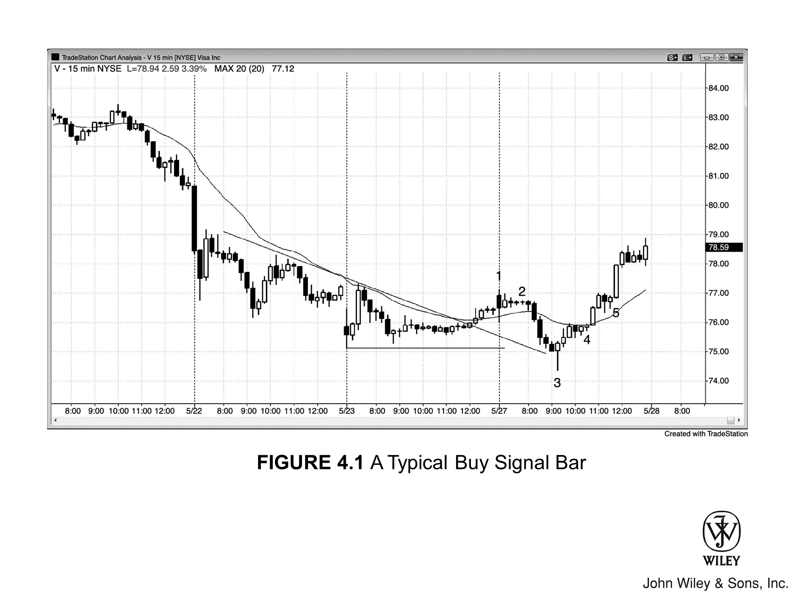

## 信号K线、入场K线、建仓形态与蜡烛图形态

### 理解建仓形态与交易方向

交易员整天都在寻找**建仓形态**。**建仓形态**是由一根或多根K线构成的图表形态，它让交易员相信可以下单，并且有较大概率做成一笔盈利的交易。实际上，图表上的每一根K线都可以看作一个建仓形态，因为下一根K线随时可能成为任一方向强势行情的起点。

如果交易方向与近期或主流趋势一致，就是**顺势**交易；方向相反，就是**逆势**交易。举个例子：近期趋势向上，你做多，那你用的就是一个**顺势建仓形态**。如果你反过来做空，那你依据的就是一个**逆势建仓形态**，你的空头仓位就是一笔**逆势交易**。

### 信号K线与入场K线

**信号K线**总是在事后才标注出来——等到该K线收盘、交易已经入场之后才能确认。入场订单一成交，前面那根K线就从普通的**建仓K线**变成了**信号K线**，当前这根K线则是**入场K线**。

入场后的下一根K线叫**跟随K线**，最好是朝入场方向运动。有时候市场会横盘一两根K线之后才出现**跟随K线**，这也没关系，只要有跟随出现，这笔交易盈利的概率就会提高。

### 市场结构：买方与卖方

前一根K线的高点上方，有多头挂着买入突破单；同一根K线的低点下方，有空头挂着卖出突破单。同时，也有多头在前一根K线低点及更低位置挂着买入限价单，有空头在前一根K线高点及更高位置挂着卖出限价单。

这意味着每根K线既是做多的**信号K线**，也是做空的**信号K线**——多头和空头都会在K线的上沿和下沿突破时入场。换个角度看，每根K线都可以当作一个**单K线交易区间**。如果下一根K线突破了它的高点或低点，**突破交易员**就会预期这次突破有足够的跟随，至少让他们赚到**剥头皮者的利润**。

不过，同样聪明的交易员会预期突破失败，反向操作。假设市场向上突破前一根K线高点 1 个 tick，会有多头通过突破单做多，前一根K线就是他们做多的**信号K线**。同时也会有空头在前一根K线高点处挂限价单做空，赌这次突破会失败。

这些空头希望市场在做空后的下一根K线跌破入场K线的低点，这样入场K线就变成了做空的**信号K线**。交易中最重要的认知之一是：不管你多确信自己是对的，总有一个同样聪明、同样坚信相反方向的人在跟你对手交易。

### 交易员的优势：解读价格行为

交易员能培养的最重要的技能，就是判断前一根K线的上方或下方何时买方更多、何时卖方更多。在合适**背景**下出现的**信号K线**，正是这种失衡存在的时刻。

举例来说，**多头趋势**中的回调出现了一根**多头信号K线**，那么该K线上方的买方大概率多于卖方，在上方做多就比做空更合理。只要交易员认为存在这种失衡，他就有了**优势**——但这个优势始终很小，因为总有聪明的交易员持相反观点（必须有人接你的对手盘，否则你的订单根本无法成交）。

作为交易员，我们的优势来自解读**价格行为**的能力。读盘能力越强，优势就越大，靠交易谋生的概率也就越高。

### 常见的信号K线与建仓形态

以下是常见的**信号K线**和**建仓形态**（后续章节会详细讨论）：

#### 强趋势急速阶段中的延续信号

**延续信号**可以是在**多头趋势**顶部做多，也可以是在**空头趋势**底部做空。

- **多头急速**阶段中的强**多头趋势K线**。
- **空头急速**阶段中的强**空头趋势K线**。

#### 反转信号

**反转形态**既可以是**趋势反转**，也可以是一段**回调**走完后反转回到趋势方向。

- **反转K线**
- **两K线反转**
- **三K线反转**
- **小K线**：
  - **内包K线**
  - **ii**（或 **iii**）形态
  - 大K线或**交易区间**高低点附近的小K线
  - **ioi 形态**
- **外包K线**和 **oo 形态**（一根外包K线后面跟着一根更大的外包K线）
- **双顶和双底**
- **失败的反转尝试**，包括**反转K线失败**
- **失败的延续尝试**，例如在看似正在筑底的**空头趋势**中，在**低 1 信号K线**下方买入；或者在看似正在筑顶的**多头趋势**中，在**高 1 信号K线**上方做空
- **光头K线**：顶部或底部没有**影线**的K线
- **趋势K线**：在强**空头趋势**的反弹中以及**交易区间**顶部附近，**多头趋势K线**可以作为做空建仓形态；在强**多头趋势**的**回调**中以及**交易区间**底部附近，**空头趋势K线**可以作为做多建仓形态
- 强趋势**急速阶段**中的任何**暂停K线**或**回调K线**
- **通道**中的所有K线：在前一根K线低点或更低位置买入，在前一根K线高点或更高位置卖出
- **多头趋势**中形成**HL**的任何K线，以及**空头趋势**中形成**LH**的任何K线

### 新手交易指南

新手应该只在**信号K线**同时也是顺着交易方向的**趋势K线**时才入场，并且只做顺势交易。比如做空时，应该只在**空头趋势**中选择**空头趋势K线**作为**信号K线**，因为市场已经表现出**抛压**，**跟随**的概率比信号K线收盘价高于开盘价时更大。

同样，新手想做多时，应该只在**多头趋势**中、**信号K线**收盘价高于开盘价时才买入。

### 不同交易类型对信号K线的要求

一般来说，**趋势反转**入场对**信号K线**的要求应该比**趋势回调**和**交易区间**交易更严格。原因在于大多数**逆势**交易都会失败，你需要尽一切可能提高成功率。

最强的趋势往往伴随着很难看的**信号K线**，但交易本身依然很好。如果一个**建仓形态**太明显，市场会迅速修正这种偏差——走势又快又小，跟大多数**剥头皮**交易一样。

**波段交易**的建仓形态则不同，成功概率通常只有 50% 甚至更低，这一点在第二本书中会详细讨论。这类形态看起来往往像是**交易区间**的一部分，好像还会继续横盘很多根K线。

强趋势会想尽一切办法把交易员挡在门外，迫使他们不断追着趋势跑。**交易区间**顶部的**二次入场点反转建仓形态**，其**信号K线**常常带有**多头**实体；底部的做多建仓形态，其**信号K线**常常带有**空头**实体。

不过，既然大多数反转尝试都会失败，交易员只有在一切条件看起来完美——包括**信号K线**——的时候才应该考虑**反转**交易，以降低失败的概率。新手应该避开所有**逆势**交易，只留最强的那些；任何交易员想做逆势交易，也要确保整体图表形态支持**反转**。

至少，交易员应该等待**趋势线**被强力突破后的**回调**，并且只在出现强**反转K线**时才入场，因为大多数成功的**反转**交易都始于一根强**信号K线**。否则成功概率太低，长期下来会亏钱。

顺带一提，**趋势线**突破后的**回调**有可能创出新的极值——比如**多头趋势**末端的**HH**，或**空头趋势**末端的**LL**。由于**逆势**交易的成功概率本来就低，最好的交易员只有在看到充分证据表明趋势即将反转时才会做这类交易。

### 趋势延续与顺势交易

**趋势**延续的时间往往远超大多数交易员的预期，结果就是反方向的交易大多失败，最终不过是在趋势中又形成了一次**回调**，提供了新的**顺势**入场机会。

同样，如果交易员打算**顺势**交易，他们会急于入场，不愿等一根漂亮的**信号K线**出现。比如在强趋势中，价格小幅**回调**到均线附近，同时又测试了前一个**波段低点**、一根**趋势线**，甚至一个斐波那契回撤位，这时即使**信号K线**是一根**空头趋势K线**，交易员也会买入。

结果就是，强趋势中大多数成功的**信号K线**看起来都很差。一般规律是：趋势越强，**信号K线**的外观越不重要；入场越**逆势**，就越需要看到一根强**信号K线**。在强趋势中，大多数**信号K线**看起来都不好，很少有K线是顺着趋势方向的**趋势K线**。

### 入场技巧与下单方式

几乎每根K线都有可能成为**信号K线**，但其中大部分不会触发入场，因此并不会真正变成**信号K线**。作为日内交易员，你会挂出很多最终未被成交的订单。

通常最好用**突破单**入场，挂在前一根K线高点或低点上方/下方一个 Tick 的位置。如果没有触发，就撤单，重新找位置挂单。对于股票，入场**突破单**最好挂在潜在**信号K线**外侧两个 Tick 以上，因为**一个 Tick 的陷阱**很常见——价格只突破一个 Tick 就反转，把刚用突破单入场的交易员全部套住。

入场**突破单**一旦被触发，你做这笔交易的依据之一就是前一根K线，这根K线就叫**信号K线**（它给了你一个信号，让你去挂单）。很多时候一根K线可以同时是两个方向的**建仓K线**，你会在它的上下两端各挂一张入场突破单，哪边先突破就做哪个方向。

### K线形态与价格行为

关于**K线形态**的书已经写了很多，那些稀奇古怪的日文名字让人觉得背后一定有什么神秘力量，仿佛来自某种古老智慧。这恰恰是新手最想要的东西——让神灵来告诉自己该怎么做，而不用靠自己下功夫。

对交易员来说，最核心的问题只有一个：市场到底在走**趋势**还是处于**交易区间**。分析单根K线时也一样——它到底有没有方向。如果多头或空头中的一方占了上风，K线就会有实体，就是一根**趋势K线**。如果多空双方势均力敌，实体很小甚至没有，那就是一根**十字星**。

很多K线交易员用"**烛芯**"来称呼实体上下延伸出来的那两条线，大概是为了跟"蜡烛"这个概念保持一致。也有人叫它们"**影线**"。我们成天都在找**反转K线**，而**反转K线**的外形更像蝌蚪或小鱼，所以**影线**其实是个更贴切的说法。

你应该只从**价格行为**的角度去理解K线，而不是去记一堆毫无意义、容易误导人的**K线名称**（误导在于它们暗示了某种神秘力量）。每一根K线只有放在**价格行为**的背景下才有意义，绝大多数**K线形态**在大部分时候都没什么用，因为它们出现的位置根本不具备高概率的预测价值。

所以，**K线形态**的名称只会让你的交易变复杂，让你想太多，反而忽略了趋势本身。

### K线形成过程中的风险考量

经常会出现这种情况：一根**信号K线**正在一个不错的位置形成。比如一根 5 分钟K线，过了三分钟的时候形状很好看，像一根刚从最终**熊旗**突破后出现的**多头反转K线**。结果在收盘前五到十秒，K线突然拉长了四个 Tick 甚至更多。

K线收盘时，形状看起来仍然像一根不错的**多头反转K线**，但高点已经接近**熊旗**的顶部了。你只有几秒钟来决定是否还要在它的高点上方做多，同时得意识到这样做等于在**熊旗**顶部买入。在你能稳定盈利、具备快速解读能力之前，最好放弃这笔交易，等**二次入场点**再说。

不过，如果你确信有大量**被套的空头**，可以做这笔交易，但只要出现好几根大**幅度K线**连续排列、彼此大量重叠，风险就很大。

### 理解高潮

所有**反转**都涉及**高潮**，但不同交易员对这个词的用法往往不一样。记住，每一根**趋势K线**本身就是一个**高潮**或**高潮**的一部分，**高潮**在第一根**暂停K线**出现时结束。

举个例子，如果连续出现三根**多头趋势K线**，紧接着是一根带有明显顶部**影线**的小**多头趋势K线**、或者是一根**内包K线**、一根**十字星**、又或者是一根**空头趋势K线**，那么**高潮**就在那三根**多头趋势K线**处结束了。

---

## 图 4.1：一根典型的买入信号K线

图 4.1 是 **Visa（V）** 的 15 分钟图。价格先突破了**空头趋势线**，随后两腿下跌，跌破昨天低点形成了一个 **LL**。这张图的重点是展示什么是**信号K线**和**入场K线**，具体的**建仓形态**会在后面的章节讨论。

第一腿在 K线 2 结尾处的 **iii** 完成。K线 3 是一根强**多头反转K线**，同时反转了昨天的低点和对**空头趋势线**的测试，构成了一个潜在的做多机会。在这根K线高点上方一个 Tick 处挂买入突破单就会被触发，K线 3 随即从一根**建仓K线**变成了**信号K线**，而实际成交的那根K线就是**入场K线**。

入场后两根K线出现了一根不错的**多头趋势K线**，它是一根**跟随K线**。因为这是一笔**逆势**交易，交易员需要像 K线 3 这样的强**多头反转K线**才能入场做多；否则交易成功的概率会大幅降低。

K线 4 是基于 **ii** 建仓形态（后文讨论）的**入场K线**，对应第二腿上涨。

K线 5 是基于**内包K线突破回调**（价格仅仅略微突破了 K线 2 的 **iii**）的**入场K线**。两根**暂停K线**的实体分别是内包实体，所以这个建仓形态实际上等同于一个 **ii** 形态。
