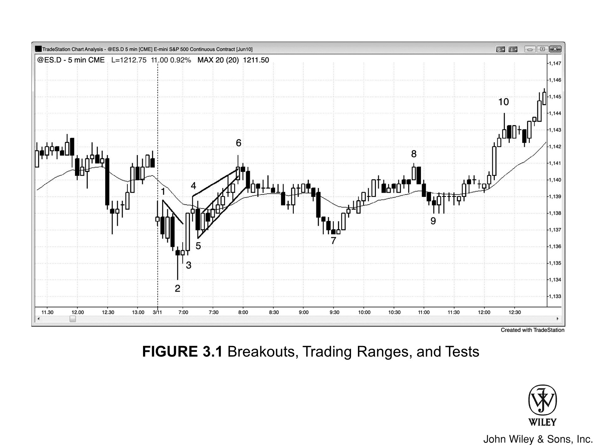

正如 K 线分为趋势 K 线与交易区间 K 线，图表上的任何一段走势也可归为两类：
*   要么是趋势性的（多头或空头某一方主导）；
*   要么是双向的（多空双方交替掌控局面）。

当市场突破并形成趋势时，通常先出现一根趋势 K 线（大小不限），紧接着是一连串的趋势性 K 线，推动价格急速脱离原先的交易区间。

交易者最核心的本领之一，就是能准确判断突破是成是败（失败即反转）。突破之后，行情究竟是顺势走出一个波段，还是掉头反向运行？这一话题将在第二本书中深入探讨。

在交易清淡的市场中，突破往往以缺口的形式出现，而非趋势 K 线。正因如此，我们应将趋势 K 线视为一种特殊类型的缺口（这一点在第二本书中有详述）。

随着行情发展，市场开始出现回调，趋势随之减速，斜率变缓，逐渐演变为通道形态。此时，便可绘制趋势线与趋势通道线。

随着趋势延续，你需要不断重绘这些线条，以包容不断演变的价格行为。通常情况下，通道的斜率会越来越平缓，宽度也会越来越大。

这种“急速转通道”的戏码，每天都在各类市场轮番上演，无非是程度深浅有别。而通道的起始之处，往往就是日后那个交易区间的发端。

**试举一例：**

*   **急速阶段：** 若市场出现一波持续数根 K 线的向上急速（即向上突破），随后必有回调。
*   **通道阶段：** 待回调告一段落，趋势重拾升势时，行情通常不再是近乎垂直的暴冲，而是转为通道式上涨。此时呈现以下特征：
    *   K 线往往重叠增多；
    *   小回调频现，影线层出不穷；
    *   间或还会夹杂几根空头趋势 K 线。

这一通道阶段的底部，通常在一两天内便会面临测试。一旦回调开启，价格回落逼近通道起点，交易者们便会生疑：**交易区间是否正在成形？** 事实证明，他们的直觉没错。

急速一停，通道一起，价格行为交易者便已料定交易区间即将到来：

1.  **早期布局：** 少数空头会在急速后的首次回调中，率先分批做空。因为确信通道低点很快会受测，即便市场继续上行，他们也会利用后续的回调，或在前期 K 线的高点上方，持续分批加仓空单。
2.  **后期加码与离场：** 通道行至后期，会有更多空头在 K 线高点上方加码。一旦行情掉头向下，形成幅度更大的回调去测试通道底部，他们便会全线平仓——后进场的单子落袋为安，最早的底仓则保本离场。

众多交易者会在通道底部附近回补空单，这股买盘，加上多头回到早先入场点（即急速向上后的首次回调底部）再次买入，会合力将市场再度推高，交易区间也随之扩宽。

这波反弹过后，“急速转通道”的剧本便算演完了，交易者们将转而寻觅其他的形态。

由于通道最终往往面临回撤，因此，将所有多头通道视为熊旗，将所有空头通道视为牛旗，是有益的视角。不过，市场也存在以下变数：

*   若趋势强劲，突破后可能转为横盘，随后趋势延续。
*   极少数情况下，市场会顺势突破，且趋势急剧加速。

例如，在多头急速接多头通道的形态中，市场很少能向上突破趋势通道线并加速上涨。通常，这种突破会在 5 根 K 线左右失败，随后市场反转。

尽管在更高周期的图表上，大多数交易区间本质上是旗形，且多为顺势突破，但几乎所有的反转也都始于交易区间。这一点将在第三本书关于反转的章节中详述。

***

所谓“测试”，是指市场回撤至某个支撑或阻力区域，例如：

*   趋势线、趋势通道线；
*   测量移动目标位；
*   前期波段高点或低点；
*   多头入场 K 线低点或空头入场 K 线高点；
*   多头信号 K 线高点或空头信号 K 线低点；
*   昨日的高点、低点、收盘价或开盘价。

交易者往往根据价格在测试位的表现来决定如何交易。举例来说，若市场创出高点后回调，随后反弹重回该高点：

*   **多头**希望能看到强劲突破。如果突破看似正在形成，他们可能会在旧高点上方 1 个 tick 处买入；或者等待突破后回调，在前一根 K 线高点上方 1 个 tick 处买入，预期突破将延续。
*   **空头**则在寻找反转机会。如果上攻旧高点动能不足，且在该区域形成反转 K 线，他们就会在反转 K 线下方做空。他们并不在乎这次测试形成的是更高高点、双顶还是更低高点。他们只想看到市场拒绝这一区域的价格，以此验证他们的观点：此处的价位太高了。

所谓 **反转**，是指行为模式由一种转变为相反的一种。

*   不过在通常语境下，这个词多用来描述多头趋势转为空头趋势，或者空头趋势转为多头趋势。
*   然而，交易区间与趋势其实也是对立的。当趋势结束后进入交易区间，市场行为本质上也发生了反转。
*   同样，当交易区间演变为趋势时，市场行为也反转了，但这通常被称为 **“突破”**。虽然从技术角度看，这是双向交易向单向交易的反转，但没人会把这叫作“反转”。

***

尽管大多数交易者眼中的反转是多空趋势的直接互换，但实际上，大多数反转并不会引发相反的趋势，而是仅仅让原本的多头或空头趋势暂时过渡为 **交易区间**。

1.  **市场的惯性与抵抗**
    市场具有惯性，极难改变。强劲的多头趋势会顽强抵抗这种变化；几乎每一次反转尝试，最终都会演变成 **牛旗**，随后趋势得以延续。接下来的每一个牛旗往往会越来越大，这是因为随着价格创新高，多头急于获利了结，不再愿意重仓买入，而空头则开始变得愈发激进。

2.  **趋势的最终确立**
    终有一刻，空头将压倒多头，交易区间向下突破，空头趋势随之开启。然而，这种情况通常发生在此前多次反转尝试失败之后——早期的这些尝试虽然形成了越来越大的牛旗，但多头始终压制着空头，导致空头趋势迟迟无法形成。

3.  **交易策略与常态**
    尽管大多数反转只是演变为交易区间，但这波行情的幅度通常足以构成一次波段交易，也就是说，其波动幅度足以产生可观的利润。即使相反的趋势最终真的展开了，交易者也会在第一个合理目标位至少进行部分获利了结，以防反转仅仅演变为交易区间——毕竟，这才是市场的常态。

反转形态的具体样貌，取决于你所用的图表周期。举个例子：

*   **月线图**上的一根大实体空头反转 K 线，在周线图上可能表现为双 K 线反转；
*   若切到**日线图**，它可能先是一段由三根 K 线构成的多头急速（即买入高潮），紧接着十天的交易区间，最后以双 K 线空头突破收尾。

你具体看的是哪张图并不重要，关键在于你能否识破其反转的本质——毕竟，上述形态殊途同归，皆为反转。

***

**Figure 3.1 突破、交易区间与测试**

Figure 3.1 中的 5 分钟 Emini 图表展示了突破、交易区间和测试的实例。每一次价格摆动（swing）本质上都是一次测试，尽管多数交易者并不清楚到底在测什么。许多测试其实关联着其他时间周期或图表类型上的价格行为，测试对象包罗万象，诸如：

*   各类均线
*   通道带（bands）
*   斐波那契位
*   枢轴点（pivots）等等，不一而足。

市场测试了昨日低点，但突破失败。在创出更低的低点后，行情剧烈反转向上，形成一段急速（spike）直抵 Bar 4。

所有的突破，无论成败，最终都会演变为交易区间，本例便是如此。向下突破创新低一旦失败，即表明多空双方达成共识：当前价格过低。此时：

1.  **空头**会获利了结，不再低位大量抛售；
2.  **多头**则会持续激进买入。

这种状态将一直持续，直到双方确信市场找到了新的平衡区域——也就是交易区间。

> **注意：** Bar 1 是开盘抛售行情的信号 K 线。若空头控盘依旧，市场本不该涨破这根 K 线的高点。

- **K线 4**
  上攻测试 K线 1 的高点，并创出新高（Higher High）。当时的上涨动能极为强劲，市场很可能至少再向上冲一次，多头才会收手。此次双顶（双顶双底罕有精准重合）仅引发了一根 K 线的回调，随后便成功突破了 K线 1。

- **K线 5**
  回测 K线 2 信号 K 线的高点，形成了一个抬高的低点（Higher Low）。

---

**关于急速行情与通道演变：**

1.  **结构突破与共识**
    任何急速运动或强劲反转，本质上都是对某种结构的突破。至于 K线 2 启动的这波急涨，究竟是突破了 K线 1 引出的小型空头趋势线，还是突破了 K线 2 本身这根反转 K 线，其实无关紧要。关键在于，在这波急速（Spike）行情中，市场已达成共识：价格过低。因此行情快速延展，试图寻找一个多空双方都乐意交易的价格区域。

2.  **上升通道（K线 5 至 6）**
    于是，K线 5 到 6 形成了一个上升通道（Channel）。通道内，K 线之间频繁重叠（Overlap）。这种重叠反映了多头的犹豫：市场在继续上行前，能够先向下回撤几个 tick，或停留几分钟。

3.  **多空博弈与仓位管理**
    随着价格走高，部分多头开始获利了结，空头也开始进场。市场越涨，许多空头越是加仓（Scaling in），而多头则越是减仓（Scaling out）。

4.  **形态后果**
    这种通道属于较弱的多头走势，往往预示着交易区间（Trading Range）的开启。如你所见，至 K线 7 时，市场已回撤至通道起点附近。

---

- **K线 7**
  回测了 K线 5 的波段低点，形成抬高的低点（Higher Low），同时也是对昨日低点的二次测试，随后市场反转向上，构筑双底。

- **K线 8**
  上攻 K线 6 高点及昨日收盘价，但高点降低（Lower High），最终形成双顶而非突破。它还测试了紧随 K线 6 之后那根空头孕线（Inside Bar）的高点——该孕线正是随后那波抛售行情的信号 K 线。

- 向下至 K 线 9 的反转测试了均线，但这仅仅演变为对突破尝试的一次**回调**；紧接着市场成功**突破**，创出日内新高。
- K 线 9 还测试了 K 线 7 之后那根**多头 K 线**上方的做多入场点，距离触发**保本**止损仅差一个 tick。当多头能够守住**保本**止损不被触发时，便显现出强势，随后通常会创出新高。

### 关于本图表的深入探讨

> 当某张图表的讨论长达数页时，请记住，你可以访问 John Wiley & Sons 网站 www.wiley.com/go/tradingtrends。你可以查看或打印图表，这样在阅读书中描述时，就不必反复回翻页码去对照图表了。

*   **[Figure 3.1] K 线 3 的形态**
    K 线 3 是一根巨大的**多头趋势 K 线**，开启了一段**多头趋势**，应将其视为一次**突破**和一个**突破缺口**。

*   **市场背景与结构**
    市场向下**突破**了延续至昨日收盘的**多头通道**，而**多头通道**即是**熊旗**。此次**突破**虽有些许延续性，但出现了多头**实体**和**K 线**重叠，表明多头依然活跃。随后，市场向下**突破**昨日**波段**低点，但**突破**失败，该处反而成了当天的最低点。

*   **交易机会与 Always-in 判读**
    1.  如果你没有买入 K 线 2 从昨日低点起的向上反转，那么 K 线 3 这根强劲的**多头趋势 K 线**便是在告诉你，**Always-in** 仓位是向上的。
    2.  你应该寻找买入机会，既可以市价买入，也可以在 K 线 5 **回调**的上方买入。
    3.  第三本书详细讨论了 **Always-in**，其基本含义是：假设你必须时刻在场（要么做多，要么做空），那么你当前应持有的仓位就是 **Always-in** 仓位。这是一个非常重要的概念，大多数交易者应该只顺着 **Always-in 的方向**交易。
    4.  K 线 7 的**双底回调**是另一个做多机会，预期会有**第二腿**上涨直至收盘。

这是一个急速转通道多头趋势（spike and channel bull trend）。该形态之所以重要，是因为它揭示了市场正从单边交易（强趋势）向双边交易（交易区间）过渡。

至于急速（spike）的具体界定，无论你视 Bar 3 为单独的急速，还是将 Bar 2 到 Bar 4 的整段剧烈波动看作急速，其实都无关紧要。

市场回调至 Bar 5 后虽有反弹，但涨势已不再那般急迫：
*   K 线之间出现大面积重叠，此时画出的通道线已能相当精准地囊括价格走势。
*   你也可以沿高点画一条趋势通道线，勾勒出一个楔形通道，这一点后文还会详述。

**交易者的不同策略：**
*   **部分交易者**会在 Bar 4 低点下方做空，并随着行情上行，在后续的回调处分批加仓空单（scale in）。
*   **另一些人**则会按兵不动，等待楔形顶出现后再将多单获利了结，或反手做空。

一旦急速行情回调至 Bar 5 并开始呈现通道特征，交易者便会将此多头通道视为潜在的熊旗（bear flag），并预期市场将回测通道低点。
*   在此类小型形态中，回测通常发生在日内稍晚时段；
*   而在更大级别的形态中，回测可能要等到一两天后。

市场如期从楔形顶向通道底部展开了两段式回调：
1.  **空头**会在此处将所有头寸获利平仓。他们早期的入场单大概只能勉强保本，但后期的加仓单则会有利可图。
2.  此外，**多头**会再次寻求在 Bar 5 低点附近买入——此前第一次回调结束时他们便是在此买入，从而确立了通道的起点。
3.  多头的买入叠加空头的回补（short-covering），通常会引发反弹。这波反弹可能演变为双底（Bar 5 和 Bar 7）牛旗后的上涨，也可能随后陷入漫长的交易区间，甚至转为空头趋势。

还要注意，Bar 2 的低点构成了第三次向下推进，因此属于楔形反转。

- **Bar 6** 构成了双顶熊旗（第一个顶点是昨天的最后一根 K 线），而 **Bar 5** 和 **Bar 7** 则组成了双底牛旗。
- 随后便是 **Bar 9** 的双底回调。
- 虽说你可以把 **Bar 5** 到 **9** 这一段价格行为看作三角形，认为多空突破皆有可能，但这恰恰忽略了市场正在向你展示的看涨特征。
- **Bar 7** 属于楔形牛旗，因为这是自 **Bar 6** 高点以来的第三次向下推进。
- 在此前的六根 K 线牛旗之后，**Bar 8** 走出了最终旗形反转。
