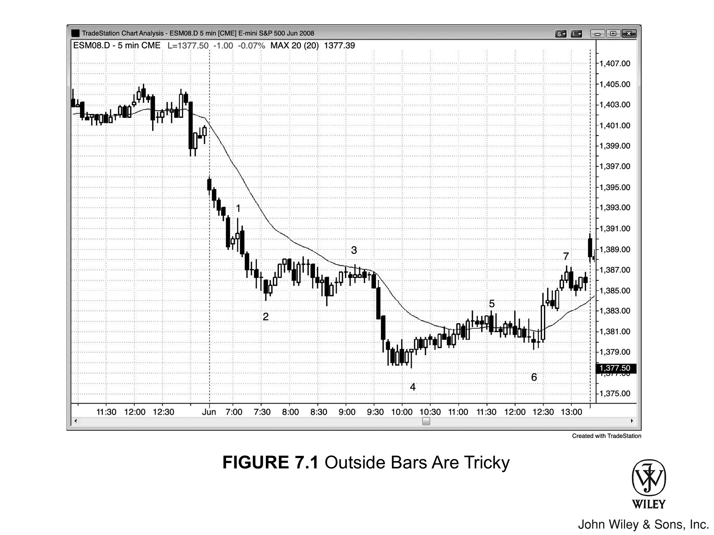
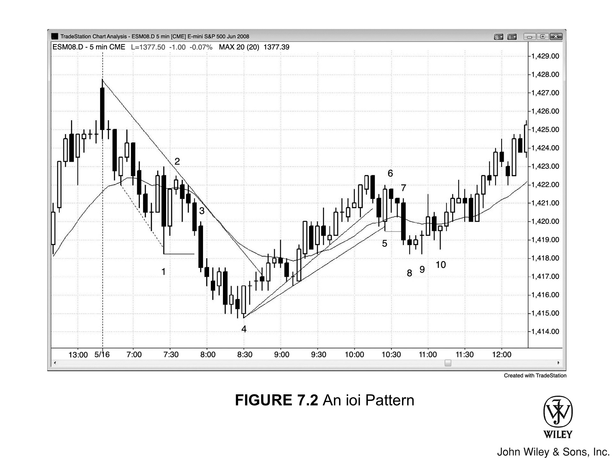
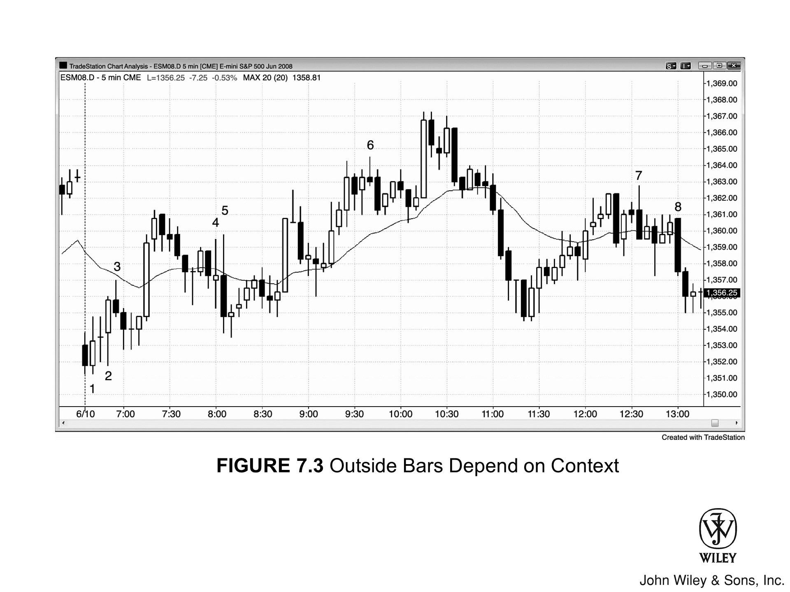
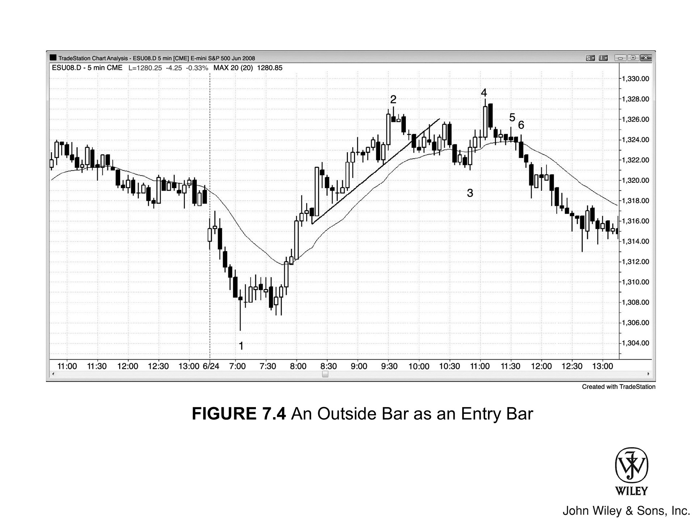

## 概述

如果一根K线的高点高于前一根K线的高点，低点又低于前一根K线的低点，它就是**外包K线**。外包K线的解读比较复杂，因为在这根K线以及前一根K线的形成过程中，多头和空头都各自占据过主导地位，需要注意的细节很多。K线变大，说明多空双方都更愿意激进参与，但如果收盘价在中间位置附近，它本质上就是一个**单K线的交易区间**。从定义来看，外包K线完全覆盖了前一根K线，所以每一根外包K线都构成**交易区间**的一部分——交易区间由两根或更多大幅重叠的K线组成。有些情况下，外包K线也能充当**反转K线**或**趋势K线**。交易员必须关注它出现时的**背景**。

## 交易方法

### 传统建仓方法

传统技术分析把外包K线当作**建仓K线**，认为它可以向两个方向**突破**，操作上在外包K线的上方和下方各挂一张**突破单**。一旦某一方成交，就把未成交一方的单子数量翻倍，变成一张反向入场单。但在5分钟图上用外包K线的突破来入场几乎都不明智，尤其是外包K线很大的时候——止损距离远意味着风险更大。有时候你正在寻找一个主要的**反转**机会，而且非常有把握会出现一轮大幅、强劲的反转，这时在价格突破前一根K线的极端价位时立刻入场是合理的。如果把握不够大，可以等这根K线收盘后，再用外包K线的突破来入场。如果你已经在外包K线的突破上建了仓，而**保护性止损**距离太大，可以改用**资金止损**（比如 Emini 上设2个点）或减少合约数量。外包K线本质上是一个**单K线交易区间**，在**横盘**市场的顶部买入或底部卖出并不理想，所以通常最好不要在外包K线被突破时入场。

### 外包K线与信号K线

如果外包K线前面那根K线是一根好的**信号K线**，外包K线就可以成为可靠的**入场K线**。比如：交易员在一段**空头波段**的底部找买入机会，市场先形成了一根强**多头反转K线**，但下一根K线跌破了它。这时候交易员应该考虑继续把**买入突破单**留在市场中。一旦价格突然反转回到多头信号K线上方，突破单就会被触发，当前这根K线就同时成为外包K线和入场K线。一般来说，除非前一根K线是一根不错的信号K线，否则不应该在外包K线上做反转交易。

### 强反转中的入场

有时你不得不直接在外包K线上入场（而不是等它被突破），因为你知道有交易员已经**被套**了。一轮强劲走势之后尤其如此。如果外包K线出现在**趋势线突破**或**趋势通道线过冲**后的强反转中，作为**二次入场点**，它可以是一根非常好的入场K线。比如：市场第二次跌破了一个**波段低点**，并且从趋势通道线过冲处反转向上，这时候你多半在找做多机会，不断把买入突破单移到前一根K线高点上方一个 Tick 的位置，直到成交。有时候成交发生在一根**外包阳线**上，这通常是一笔不错的反转交易，背后有强劲的买方力量。

### 交易区间中的外包K线

如果外包K线出现在**交易区间**的中间位置，没什么意义，不应该用来产生交易信号——除非后面紧跟一根小K线出现在外包K线的高点或低点附近，形成一个**押注失败**的建仓形态。交易区间中的外包K线只是再次证明了大家都知道的事实：多空双方势均力敌，双方都会在区间顶部附近卖出、底部附近买入，预期价格会向外包K线的另一端运动。如果市场反而向另一个方向突破，不要追，等**押注失败的突破**——这种情况在随后几根K线内经常出现。如果没出现，就等**回调**（失败的突破再次失败，就构成了一个**突破回调建仓形态**）。

### ioi 形态（内包-外包-内包）

如果外包K线后面跟着一根**内包K线**，就形成了一个 **ioi 形态**（**内包-外包-内包**），可以顺着内包K线突破方向入场。不过，只有在你有理由相信市场能走出足够幅度、达到利润目标时，才应该入场。比如：ioi 出现在一个新的**波段高点**位置，第二根内包K线是一根收在低点附近的**空头K线**，那么向下突破可能是一个好的做空机会，因为它很可能是一个**二次入场点**（第一次入场机会大概出现在外包K线跌破其前一根K线低点的时候）。如果 ioi 出现在**铁丝网形态**（窄交易区间）中，特别是内包K线很大且处在外包K线的中间位置，通常最好等一个更强的建仓形态出现。

### 顺势外包K线与反转

当**趋势反转**的**第一腿**出现**顺势外包K线**，而且之前的趋势很强时，这根外包K线的作用更像是一根强**趋势K线**，而不是交易区间里那种无方向的K线。举个例子，在一段**空头趋势**中，如果出现了一次强力上涨反转，交易员就会开始期待更大的涨幅。很多人会等着在**HL**上方买入，愿意在前一根K线低点下方做空的人则很少。如果多头特别强势，他们不会等到前一根K线高点上方才买，而是直接在前一根K线低点下方就开始买入，并在接下来几分钟持续加仓，因为越来越多的交易员看到多头已经控制了市场。这会推动K线突破前一根K线的高点。一旦突破，它就变成了一根**外包阳线**，而那些刚刚在前一根K线低点下方做空的空头大概率会平仓，并且至少在几根K线内不会急着再做空。空头极少、多头又很强势，市场变成了**单边市**，至少还会再涨一两根K线。所有人突然对新方向达成共识，因此这波走势动能很强、幅度很大，在回调之后很可能被再次测试，形成**第二腿上涨**。这个**HL**——而不是空头趋势的真正低点——才是上涨腿的起点，因为市场正是在这个位置突然达成共识：下一腿是涨而不是跌。从外包K线底部起算，通常会有**两腿上涨**。虽然从图表上看，整段上涨从空头趋势真正的低点算起好像有三腿，但功能上只有两腿——因为市场并不是在真正的低点就认可了多头走势，而是要等到HL形成之后才明确。正是在那个位置，多头夺取了控制权。

### 为什么外包K线引发的走势往往很强

这波走势为什么往往很猛？那些在前一根K线低点下方做空的老空头，以为只是又一个**空头旗形**的顺势突破，结果被套住了。紧接着，他们的入场K线迅速反转为**外包阳线**，把空头套在里面，把多头挡在外面。很多多头被挡在外面，是因为他们不喜欢在外包K线形成过程中入场——毕竟很多外包K线最后只是形成交易区间。接下来，市场不可避免地会强势上涨很多根K线，因为所有人都意识到市场已经反转，都在想办法调整仓位。空头盼着能回调一下、以更小的亏损出场；多头也盼着同样的回调，好用有限的风险买入更多。当所有人都想要同一件事时，它反而不会发生——因为双方即使只回调两三个tick也会立刻买入，导致**两到三根K线的回调**根本形成不了，直到趋势走了很远之后才会出现。聪明的价格行为交易员从一开始就会意识到这种可能性。如果他们预判会出现**两段式延伸上涨**，就会密切关注那个空头旗形的向下突破，提前预判它会失败。他们会把入场单挂在前一根K线高点上方，即使这意味着在**外包阳线**上入场（尤其是当这根K线恰好也是空头的入场K线时）。

### 机构视角与被套交易员

从机构的角度想一想：你会希望**空头旗形做空单**被触发，这样那些错过入场的多头就会被**套在场外**、不得不追涨买入，同时新做空的交易员会被**套在里面**、一旦空头突破失败就不得不平仓。对于一家看涨并期待上涨的机构来说，这是最理想的局面。那么作为机构，你能做什么来促成这个局面？在陷阱触发之前不要大举买入。实际上，你应该先卖出，把价格打到空头入场点被触发的位置，然后趁那些空头交易员刚刚做空、多头刚刚在前一根K线低点下方止损出场的时候，大举买入。你接过他们的仓位，在前一根K线低点下方大量买入！等所有人都被套住之后，你就可以一路向上猛买；他们一旦看清陷阱，就会追涨，这股力量会在所有人一致看多的情况下推动市场持续走高。

## 核心原则

关于外包K线，最重要的一条原则是：只要交易员拿不准该怎么做，最好的选择就是**等待更多价格行为展开再做决定**。

## 图 7.1：外包K线的陷阱

外包K线风险很大，交易员必须仔细关注形成外包K线之前的**价格行为**。

图 7.1 中，K线 1 是强**空头趋势**中的一根**外包阳线**，所以交易员只会考虑在**向下突破**时入场。你可以在K线 1 下方做空，也可以等突破K线收盘后再看情况。这里的突破K线是一根强**空头趋势K线**，被套的多头大概率会在这样一根强空头趋势K线下方止损出场。因此，在那根空头K线低点下方做空是合理的。

K线5是一根**外包阴线**，但市场基本在横盘，多根K线高度重叠，所以不构成可靠的突破入场建仓形态。紧随其后的内包K线形成了ioi形态，但这根内包K线太大，不适合当突破信号——做空等于在交易区间底部卖出，做多又是在顶部买入，而交易者只应该**低买高卖**。

### 本图深入讨论

图7.1中，市场向下突破了昨日低点，第一根K线是一根**空头趋势K线**，也是**始于开盘的空头趋势**的第一根K线。K线1和它前面那根K线构成了**第一次回调**，第一次回调之后通常(60%+)至少还有一次**向下剥头皮**的机会。到K线3时，市场完成了一次到均线的**两段式回调**，同时也是一个**EMA 20 缺口K线做空建仓形态**。

## 图7.2：ioi形态

外包K线很棘手，因为在这根K线内部或前一根K线期间，多头和空头都曾各自占据主导，所以接下来几根K线很可能继续反复拉锯。图7.2中，K线1是一根**外包K线**，与前后K线共同构成了一个**ioi形态**。K线2对K线1之后那根内包K线的突破失败了，这种情况很常见，尤其是内包K线比较大的时候。原因在于，做多的交易者被迫在ioi形态（本质上就是一个交易区间）的顶部附近买入，这在任何时候都不是好事，何况市场还在下跌。

K线2是交易区间顶部附近的一根小K线，这个位置很适合找**做空入场**机会。交易者预期多头会在K线2（他们的入场K线）低点下方认赔出场，空头便在K线2低点下方一个tick处挂单做空，这是交易区间顶部的一个**失败的ioi突破**。因为ioi各K线都比较大，K线2下方有足够的空间至少完成一次**向下剥头皮**。

K线4几乎就是一根**外包阳线**，在交易中，如果某个形态接近于一个可靠形态，它往往也会产生可靠的结果。K线4是前5根K线中的第三根**多头趋势K线**，说明市场在**三连推下跌**之后向上反转了。它也是其中最强的一根——实体最大、影线最小——表明多头力量在不断增强。

K线5是一根**外包K线**，紧跟着一根贴近其高点的小内包K线。这提供了一个风险极小的优质做空机会，尤其那根内包K线还是一根**空头K线**。

### 本图深入讨论

图7.2中，第一根K线向上突破了昨日高点，但突破失败了。这根K线变成一根强势**空头趋势K线**，为**始于开盘的做空交易**提供了建仓形态。

K线8和K线9形成了一个**小型双底**，这不是交易者在K线7那根**空头突破K线**之后所预期的持续下跌走势。下跌动能减弱之后，随之而来的是**K线10的双底回调做多**机会。

K线9同时也是从K线4上涨以来**两段式回调**的**高点2做多**信号。它在**空头趋势线**被突破后形成了日内的**HL**，为可能的**趋势反转**提供了建仓形态。

## 图7.3：外包K线取决于背景

外包K线必须结合背景来判断。图7.3中，K线1之后的那根**十字星内包K线**不是好的**做空信号K线**，因为当时已经出现了三根横盘K线，而且K线1刚刚把它前面那根空头K线反转掉了。大概率(60%+)市场在这个开盘反转之后至少还会横走或继续上涨一两根K线，尤其是**均线**相对平坦的情况下。上方到均线还有**剥头皮**的空间，最好在**多头K线**上方买入。那根内包K线是一次**暂停**，也就是向上反转之后的一种回调，所以在其高点上方以及K线1高点上方买入是合理的。交易者可以在K线1上方一个tick处挂一张**买入突破单**，当K线2跌破内包K线时，明智的做法是继续保留这张挂单。做多的逻辑依然成立，而且现在有一批**被套的空头**——他们犯了在弱信号K线下方做空的错误，迟早会在信号K线上方回补。所以K线2一旦形成**外包阳线**就立即做多，是一笔好交易。只要外包K线的前一根K线是一根像样的信号K线，在外包K线上入场就是合理的。

K线3是均线附近的一根**空头反转K线**，可以考虑做空，但它跟K线1和K线2的**多头实体**比起来太小了，所以市场可能先形成一个**HL**再继续上涨——当一个可能的**趋势反转**位置出现强势的外包趋势K线时，这种情况经常发生。所以不管交易者有没有在K线3下方做空，都必须随时准备好在HL处做多，两根K线之后出现的小型**多头ii形态**就是一个好信号。

K线4是一根**外包K线**，但市场已经横走了五根K线，所以它只是**交易区间**的一部分，不是信号K线。

K线 5 是一根更大的**外包K线**，形成了一个 **oo**（**外包-外包形态**）。这通常只是一个更大的交易区间。这根K线有很大的**空头实体**，收盘低于K线 4 的低点；那些错误地在K线 4 这根外包K线下方做空的交易者被套住了。一般来说，当交易区间内有很多K线都比较大、而且带有明显的**影线**时，不适合在交易区间突破的位置做空，因为突破失败的概率很高。随后出现的那根小**多头十字星**是一个不错的**押注失败做多**的信号K线。

K线 6 在一根**外包阳线**顶部突破之后形成了一个做空建仓形态。

K线 7 突破至一个**波段高点**后向下反转，形成一根收在最低价的**外包K线**。这属于上涨之后**多头被套**、出现强烈**空头反转**的情况。不过，当天是一个**交易区间日**，只要一段走势超过 5 根K线，交易者就会开始寻找反转机会（交易区间日的原则是"低买高卖"）。虽然在K线 7 前面那根小**空头K线**跌破时做空是可以接受的，但更好的做法是在K线 7 的低点下方卖出，因为这样是在一根强**空头反转K线**获得跟随的时候做空。

### 对这张图表的深入讨论

在图 7.3 中，市场以一根大幅**跳空低开**和一根**空头趋势K线**向下突破，但并没有继续下跌形成**始于开盘的空头趋势**，而是**向下突破失败**，市场反转向上，走出了一个**始于开盘的多头趋势日**。

K线 2 是一根**外包阳线**，也可能是**当日最低点**，因为市场正从一个大幅跳空低开中反转向上。这意味着市场在K线 2 的位置确认了趋势向上，因此K线 2 应被视为**上涨的起点**。虽然K线 3 是一个**低点 2 做空**信号，但市场将它视为一个**低点 1**，因为它是从K线 2 开始的上涨走势中的**第一次回调**，因此很可能只会形成一个更高的低点。交易者预期这个做空信号会失败，不管你把后续的上涨看作**失败的低点 2** 还是**失败的低点 1**，两者都是在可能的**多头趋势**中一个好的**做多建仓形态**。

K线 5 是对**铁丝网形态**的一次**突破**；铁丝网的突破大多会失败，所以交易者应该寻找**押注失败的建仓形态**。**铁丝网形态**是一个充满不确定性和双边交易的区域。多头在低点附近积极买入，在高点附近停止买入；空头在高点附近积极卖出，在低点附近停止做空。从每根K线的成交量可以看出，这里有大型的**买入和卖出程序**在运作。多空双方都乐于在这个区域交易，如果一方暂时压倒另一方并制造了一次**突破**，通常这个形态的磁吸效应会把价格拉回来。一旦市场向下突破，那些之前在交易区间中部就乐于买入的多头，在更低的价位只会更加乐意买入。同时，之前在交易区间顶部乐于做空的空头，如果突破后没有立即出现跟随，也会迅速回补空头仓位。这些因素使得突破失败并被拉回铁丝网形态的概率很高，实际走势也正是如此。有时市场随后会从另一侧突破，有时交易区间继续延续。最终市场总会走出这个形态。

当天的第一根K线以及开盘后的前几根K线，往往预示着接下来几个小时甚至全天的走势特征。这一天以一个**两K线反转**开场，接着出现一根**十字星**（本身就是一个K线内反转），然后又是一根**外包阳线反转**。之后出现了一次**空头反转**和几根带有**影线**的小K线，表明市场存在不确定性。多次反转、大影线、不确定性——这些都是**交易区间日**的典型特征，而这一天最终也确实走成了交易区间。有了这个早期判断，交易者就更愿意双向交易，把更大比例的仓位用于**剥头皮**，而不太倾向于做波段。

太平洋时间上午 11:25，出现了一根**多头外包K线**，构成了一个**两K线反转**，从而形成了一个**做多建仓形态**。这个形态还与前面那根**十字星**形成了一个**微型双底**。

## 图 7.4：外包K线作为入场K线

外包K线有时可以作为合理的**入场K线**。在图 7.4 中，K线 3 是一根**外包阳线**，作为入场K线是可以接受的，因为它是在强**多头趋势**中经历**两段式回调**后的**向上反转**，而且前面两根K线处还有一根**多头趋势K线**，显示出力量。交易者会在价格突破前一根K线高点时立刻买入，但更安全的做法是多等几个 tick，等价格突破前面两根K线处那根**多头趋势K线**的高点。在**多头K线**上方买入，通常盈利的概率更高。最后，交易者还可以等**外包阳线**收盘，看它是否收在高点附近并且收在前一根K线上方——实际走势正是如此。看到这种强势信号后，交易者可以在外包K线的高点上方买入。

K线 6 是一根**外包阴线**，前面六根K线里有五根都是**阴线实体**。它收在了最低点，**空头力量**非常强，激进的交易者可以在它下方做空——况且它还把那些追着之前**多头趋势**做多的交易者套住了，而那轮趋势此时可能已经结束。

### 本图的深入分析

图 7.4 中，市场向下突破了昨天最后一小时的**交易区间**。第一根K线是**多头趋势K线**，但上方拖着很长的**影线**，说明多头没能把收盘推到最高点。可以在这根K线上方买入，也可以先观望。第二根K线形成了一个**突破回调做空**的建仓形态，押注当天走出**始于开盘的空头趋势**。跌到K线 1 的过程是一波**抛物线式卖出高潮**，所以那里有可能是**当天的低点**。不过抛售力度太强，最好等**第二次信号**再考虑买入。八根K线之后信号出现了——一个**HL**加上**熊旗****突破失败**的组合。

跌到K线 3 的过程打破了一条**主要趋势线**，提醒交易者可以在价格回测K线 2 高点时做空。K线 3 前面那根K线是强趋势中的**均线缺口K线买入建仓形态**，所以在它上方买入——哪怕入场K线是一根**外包阳线**——也是一笔不错的交易。跌到形成**EMA 20 缺口K线建仓形态**的过程几乎总会打破一条**趋势线**，之后的上涨通常会回测趋势高点，形成**HH**或**LH**。如果随后出现**向下反转**，通常至少会走出**两段**、持续至少 10 根K线的下跌，甚至演变为**趋势反转**。

K线 3 同时也是一个**两K线反转**的第二根K线——它与前面那根**阴线**以及再前面一根**阴线**构成了反转组合，所以很多多头在K线 3 高点上方买入。

K线 4 是一根很大的**多头趋势K线**（带有高潮性质），形成了一个**HH**，紧接着出现了一根强的**空头内包K线**作为做空信号。交易者预期这么强的建仓形态之后会走出**两段下跌**。所以聪明的交易者会盯着是否出现**高 1**，然后是**高 2**，准备在这些**做多建仓形态**失败、套住多头的时候加仓做空。

K线 5 是**高 1 失败**的**做空建仓形态**，K线 6 则是一个绝佳的**多头陷阱**。它是**高 2 失败**，**做多入场K线**反转成了一根**外包阴线**，把多头套在场内、空头套在场外。这根**外包K线**表现得像一根**空头趋势K线**，不仅仅是普通的外包K线。因为它是外包K线，入场和入场失败在一两分钟之内接连发生，交易者根本来不及反应。一两根K线之后他们才意识到，市场其实已经进入了**空头趋势**。多头盼着出现一个**两到三根K线的回调**，好以较小的亏损出场；空头同样盼着这样的反弹，好以较小的风险入场做空。结果双方都在每一次**两到三个 Tick 的小反弹**上卖出，所以像样的**两到三根K线反弹**迟迟不来，直到市场已经跌了很远。

要注意，这个**高 2 做多**是一个很差的买入建仓形态，因为前面六根K线中有五根是**阴线**，另一根是**十字星**。光凭一个**高 2**本身并不构成建仓形态。它需要前面先有多头力量的表现——通常是一段突破**趋势线**的**高 1**上涨腿，或者至少要有一根之前出现的强**多头趋势K线**。
