别忘了，所谓信号 K 线（Signal Bar），就是那根最终触发入场的策略 K 线（Setup Bar）。但要注意，并非所有交易机会都值得出手。

即便突破单（stop）被触发，前一根 K 线确立为信号 K 线，也不代表这笔交易就非做不可（例如，窄交易区间内的许多信号最好避开，这点后文会详述）。

**判断的关键在于价格行为：**
如果看不出突破后有足够的延续空间——至少能赚到一个剥头皮（scalp）的利润——那么任何信号 K 线都毫无意义。

### 强趋势 K 线

强趋势 K 线（Strong Trend Bar）是一类至关重要的信号 K 线，尤其是在趋势的急速（Spike）阶段。试想，如果受重大新闻（影响可持续数日）刺激，市场刚刚在主要支撑区筑底并向上突破，交易者就会寻找一切理由做多。

一种常见策略是等待 K 线收盘：一旦收出强多头趋势 K 线，交易者便会在收盘瞬间市价买入（buy at the market）。此外还有以下入场方式：

*   **限价转市价**：许多人会尝试按收盘价快速挂出限价单（limit order），若几秒内未成交，便立即改为市价单追入。
*   **突破单入场**：另一些交易者则选择在该 K 线高点上方 1 tick 处通过突破单（stop）入场。

这种抢筹的紧迫感会催生出一连串的多头趋势 K 线，令多头急速行情的规模越滚越大。

### 反转形态

交易者时刻都在捕捉变盘的蛛丝马迹，而反转形态（reversal patterns）往往被视为趋势可能转向的最早信号。此类交易的特点在于：
*   止损位通常设在 K 线的另一端。
*   潜在回报往往是风险的数倍。

**举例来说：**
面对一根 8 ticks 高的多头反转 K 线，若交易者在其高点上方 1 tick 处挂突破单买入，并将保护性止损设在 K 线低点下方 1 tick 处，那么：

*   **总风险**：就是 10 ticks。
*   **获利目标**：可能定在入场点上方 20 ticks 甚至更远的地方。

强趋势若要掉头，转为交易区间或反向趋势，交易者往往期待看到强劲的反转策略（Setup），也就是常说的“反转”。毕竟趋势惯性极大，极难改变。要想逆势押注，交易者必须看到市场即将变盘的铁证。

但如果是强趋势后的回调（Pullback），情况就不同了：

*   **大家笃定趋势会延续**，所以在回调尾声，并不苛求多强的反转策略。实际上，大多数趋势回调的信号 K 线，乍看之下都显得软弱无力。
*   **若是某个回调策略看起来完美无缺**，入场轻而易举，这往往反而不是好事——说明趋势本身不够强。正因众人蜂拥而入，它常演变为趋势的“最终旗形”（Final Flag），随之而来的，往往是幅度更深的修正（Correction）。

---

**趋势的延续，靠的就是让交易者不断踏空。**

这种持续的焦虑感和入场渴望，维持了趋势的动力。而制造这种局面的手段之一，就是给出看似疲软的信号 K 线。

**试举一例：**

1.  **市场形态：** 强多头趋势中，价格向均线（Moving Average）走出两段式回调（Two-legged pullback）。此时，即便前一根 K 线是空头趋势 K 线，而非强劲的多头反转 K 线，交易者也敢在其高点上方买入。
2.  **交易心理：** 他们生怕回调结束，行情掉头向上，瞬间加速拉升。之前盼着回调，是为了低价吸筹；如今回调来了，他们只想赶紧上车，生怕牛旗（Bull Flag）突破后跑得太远，再也追不上。
3.  **后续走势：** 这种紧迫感弥漫在市场中，正因如此，价格冲向新高的过程往往迅猛异常。那些嫌信号太弱没敢下手的交易者，依然心痒难耐。许多人会在上涨途中不断小单追进，只求手里哪怕有一点仓位也好。

被套的空头苦苦等待，盼着能有个深幅回调 (Correction) 或是明确的买入信号，好让自己少亏点离场。可惜这种机会迟迟不来。眼看趋势 (Trend) 节节走高，他们别无选择，只能分批买入平仓。

在深幅回调到来前，大多数趋势终归会出现至少一次微型高潮 (Climax)。这种高潮的成因通常有两个：

*   **一是** 弱势交易者姗姗来迟，终于入场；
*   **二是** 站错队的最后一批交易者终于认赔离场。

一旦做错方向的人跑得一干二净，那种紧迫感也就烟消云散。随后，市场通常会转入交易区间 (Trading Range)，至少维持一阵子。

除了经典的反转 K 线 (Reversal Bar)，还有一些常见的反转入场策略 (Setup，有些由两三根 K 线组成)，具体如下。

### 双 K 线反转 (Two-Bar Reversal)

双 K 线反转是最常见的反转入场策略之一，其重要性不言而喻。不妨把所有的反转都看作某种形式的双 K 线反转，这很有帮助。因为这个概念能时刻提醒交易者：市场先是朝一个方向猛攻，紧接着又朝相反方向发力。

最强劲的行情，往往始于反转 K 线或双 K 线反转信号。正因如此，一旦这种入场策略出现在可能引发大行情的时点，你必须随时准备下单，这一点至关重要。

双 K 线反转变体众多，且蕴含于每一次反转之中，只是在你眼前的图表上未必显眼。不过，只要你明白市场正在反转，就没必要非得翻遍各种图表，去刻意寻找那个完美的双 K 线反转或完美的反转 K 线——哪怕从本质上讲，每一次反转里确实都藏着它们的身影。

最典型的版本是一对连续的 5 分钟趋势 K 线，两者实体大小相当，但方向相反。

*   **做多策略**：表现为一根空头趋势 K 线后紧跟一根多头趋势 K 线；
*   **做空策略**：则是一根多头趋势 K 线后紧跟一根空头趋势 K 线。

这两根 K 线组合起来，本质上就是一根 10 分钟反转 K 线。但在 10 分钟图上，这种形态只有 50% 的概率清晰可见，因为只有一半的 5 分钟双 K 线反转会与 10 分钟 K 线同时收盘。至于另一半情况，在 10 分钟图上往往呈现为某种不太清晰的反转形态。

---

必须认识到：所有的高潮反转、反转 K 线以及双 K 线反转，本质上完全相同，且存在于所有的反转行情中。只要查看的图表类型足够多，你总能发现它们的踪迹。

试想一下：
1.  即便是一根经典的反转 K 线，若切换到更小的时间周期，或者换用某种特定参数的图表（如设定了恰当 tick 数的 tick 图或成交量图），它其实就是一个双 K 线反转。
2.  此外，这两根方向相反的 K 线未必相邻，事实上，它们大多数时候都不相邻。
3.  然而，若去翻看各种更高时间周期的图表，你总能找到某张图，让该形态恰好呈现为一个完美的双 K 线反转。同理，你也几乎总能找到某张图，将其显示为单根反转 K 线。

始终保持开放的心态，接纳各种可能性，这样你会发现更多自己能看懂、且有信心交易的入场策略。关键在于识别反转正在发生，同时要明白反转的表现形式多种多样：

*   **空头反转**：总是包含一根多头趋势 K 线（本质是买入高潮），随后不久便是一根空头趋势 K 线（充当向下突破）。
*   **多头反转**：则恰恰相反，先是一根空头趋势 K 线（充当卖出高潮），紧接着是一根多头趋势 K 线（充当多头突破）。

反转 K 线可能只是“双 K 线反转”形态的后半段。一旦它与前一根 K 线的重叠幅度超过了 75% 左右，你最好把这两根 K 线打包看作一个整体——也就是“双 K 线反转”策略，别光盯着那一根反转 K 线。这么看，做反转的胜算才大。

举个例子，上涨途中收出一根空头反转 K 线，可它的低点偏偏比前一根 K 线的低点高出 1 个 tick。这往往是个空头陷阱：

*   **陷阱逻辑**：行情经常是这样走的：向下跌破空头反转 K 线 1 个 tick，却没能击穿前面的多头趋势 K 线，紧接着没过几根 K 线就掉头向上，再创新高。
*   **有效突破**：如果空头入场 K 线能一口气跌破这两根 K 线的低点，而不只是破了反转 K 线的低点，那这种“假摔”的情况就少见多了。
*   **进场原则**：当反转 K 线跟前一根 K 线重叠太多时，这就成了个“双 K 线交易区间”，这时候想做突破进场，位置得设在整个交易区间的边界之外。既然交易区间就这两根 K 线长，进场点自然得把这两根 K 线都包在里面，光超过第二根可不行。

假如那根空头反转 K 线跌穿了前面的多头趋势 K 线，哪怕它的高点没过前高，你也得把它当成“外包 K 线”来对待。这种时候，通常最好先等等，等行情回调出一个“更低的高点”再动手做空。不然的话，你的做空点离这段多头腿的顶部实在太远了，风险极大——你很可能正好空在了支撑位上（比如一个正在成型的交易区间底部），结果一进场，市场就反弹。

有一种特殊的双 K 线反转，指引的却是反向交易。

如果这种双 K 线反转形态位于均线之上或触及均线，且这两根 K 线几乎完全与前面的一根或多根 K 线重叠，**突破通常会失败**。

**趋势环境的影响：**

*   **若市场处于强趋势中：** 该信号通常有效。毕竟在强趋势里，几乎任何顺势入场都能获利。
*   **但只要不是强趋势：** 哪怕双 K 线反转形态再完美，信号也往往失效。凡是出现三根及以上大幅度且互相重叠的 K 线，情况亦是如此。

**举例来说：**

若均线上方刚好出现看涨双 K 线反转，K 线幅度较大且大部分与之前的第三或第四根 K 线重叠：

1.  **切勿**在信号 K 线的高点上方买入。
2.  此时市场已形成小型交易区间，对整体价格行为研判有信心的交易者，往往会在看涨信号 K 线处或其上方直接做空，向下剥头皮。

# 三 K 线反转

### 三 K 线反转

三 K 线反转其实就是双 K 线反转的一种变体。形态上，它由三根连续 K 线构成：
*   第一根和第三根组成了双 K 线反转的架构；
*   中间夹着一根不起眼的 K 线，比如小 K 线或十字星。

如果第 3 根 5 分钟 K 线的收盘时间恰好也是 15 分钟 K 线的收盘时间，那么这三根 K 线在 15 分钟图上就会合成一根反转 K 线。这种情况下，信号往往更可靠，因为它会把那些盯着 15 分钟图操作的交易者也吸引进来。而在其余三分之二的时间里，虽然收盘时间不重合，但这个 5 分钟信号通常也会演变成某种其他的 15 分钟反转形态。

在寻找 5 分钟反转入场机会时，不妨多想一步：这三根连续 K 线是否正在构筑一根 15 分钟级别的反转 K 线？若是如此，你的交易信心应当大增。因为大周期的信号往往预示着更大的行情，你也就更有底气去持有更多的波段仓位，并设定更远的获利目标。

总体而言，交易者只需把它们看作简单的双 K 线反转即可，不必纠结它们是否同时也构成了 15 分钟反转 K 线。

### 小 K 线

如果某根 K 线的幅度相对于之前的 K 线较小，它也可以充当反转信号 K 线。常见的例子如下：

*   **孕线 (Inside Bar)**
    *   指高点低于（或持平）前一根 K 线高点，且低点高于（或持平）前一根 K 线低点的 K 线。
    *   若孕线体型小巧且实体方向与当前趋势相反，信号更为可靠；反之，若是一根巨大的十字星，可靠性便大打折扣。
    *   事实上，巨大的十字星即便形成了孕线，也极少是优质的信号 K 线。本质上，它就是一个单 K 线构成的交易区间，往往预示着后续会有更多的双向拉锯。

*   **ii（或 iii）形态**
    *   即连续两根孕线，且第二根完全包容在第一根之内（iii 形态则是连续三根）。

*   **极值点附近的小 K 线**
    *   指出现在大 K 线（趋势 K 线或外包 K 线）高低点附近，或是处于交易区间边缘的小 K 线。
    *   若这根小 K 线的实体方向与你的预期方向一致，效果尤佳，因为这暗示着你押注的一方已掌控局面。

*   **ioi 形态**
    *   即“孕线—外包 K 线—孕线”的组合（Inside-Outside-Inside）。
    *   若此形态出现在看似即将突破的区域，交易者可在第二根孕线被突破时进场。这通常属于“突破模式”，意味着价格可能向任一方向爆发。
    *   **稳妥之策是**：在第二根孕线上方挂买入突破单，下方挂卖出突破单，顺势入场。一旦成交，另一张未成交的订单随即转为保护性止损。

请注意，十字星很少是理想的信号 K 线，因为它们本质上是单 K 线交易区间。既然身处交易区间，就不该指望突破高点买入或跌破低点做空。

不过也有例外。如果十字星出现在交易区间日的高低点附近，或者是强趋势中的顺势入场策略，它们也可以成为不错的反转信号 K 线。

*   **交易区间策略**：在交易区间内，若十字星位于区间顶部，完全可以在其下方做空，特别是当它构成二次入场时。
*   **底层逻辑**：大级别交易区间的权重胜过十字星所代表的微型交易区间，因此在十字星下方做空，本质上就是在大级别交易区间的顶部做空，这通常是一笔胜算颇高的交易。

***

# 外包 K 线

外包 K 线是指高点或低点超过前一根 K 线，且另一端极值也达到或超过前一根 K 线极值的 K 线。详见第 7 章。

# 微型双底

微型双底由两根连续或近乎连续的 K 线构成，其最低价相同或几乎相同。

*   **作为单 K 线熊旗**
    若它出现在空头急速中，且形态为一根收在低位的空头趋势 K 线，紧接一根开在低位的多头趋势 K 线，那它就是一个单 K 线熊旗。如果两者最低价分毫不差，可考虑在低点下方 1 个 tick 处做空。

*   **作为反转形态**
    除此之外，它更可能是一个反转形态，因为大多数小型多头反转都源于某种形式的微型双底（将在第三卷讨论）。

# 微型双顶

微型双顶由两根连续或近乎连续的 K 线构成，其最高价相同或几乎相同。

*   **作为单 K 线牛旗**
    若它出现在多头急速中，且形态为一根收在高位的多头趋势 K 线，紧接一根开在高位的空头趋势 K 线，那它就是一个单 K 线牛旗。如果两者最高价分毫不差，可考虑在高点上方 1 个 tick 处买入。

*   **作为反转形态**
    除此之外，它更可能是一个反转形态，因为大多数小型空头反转都源于某种形式的微型双顶（将在第三卷讨论）。

# 反转 K 线失败

### 反转 K 线失败形态 (Reversal Bar Failure)

所谓反转 K 线失败，指的是紧随反转 K 线之后的那根 K 线，从反转信号的“错误一侧”进行了突破（例如，在多头趋势中出现了一根空头反转 K 线，按理说下一根应该跌破其低点，结果反而涨破了它的高点）。

### 光头 / 光脚 K 线 (Shaved Bar)

这种 K 线的一端或两端没有影线。只有当它出现在强趋势中时，才构成入场策略。

*   **例如：** 在强多头趋势中，如果出现一根顶部或底部没有影线的多头趋势 K 线，这就是一个买入策略。

### 衰竭 K 线 (Exhaustion Bar)

如果在趋势方向上出现一根异常巨大的趋势 K 线，这往往代表趋势走向了情绪化的尽头，即衰竭。

本质上，所有的趋势 K 线都是急速、突破、缺口、高潮或衰竭 K 线，只不过有时，“衰竭”这一属性会占据主导地位。

### 趋势 K 线 (Trend Bars)

趋势 K 线不仅是强趋势中顺势入场的信号 K 线，同样也能作为反转交易的信号 K 线——这既包括回调结束、重回原趋势方向时的反转，也包括交易区间内的反转操作。

**举个例子：**

1.  **场景设定：** 假设市场处于强多头趋势，且至少连续 20 根 K 线都维持在移动平均线之上。随后，行情横盘漂移，靠向正在上升的均线。
2.  **观察信号：** 此时要留意第一根小的空头趋势 K 线，如果它的收盘价只比均线低一两个 tick，那就准备在该收盘价买入。同时，也可以在突破该 K 线高点时买入。
3.  **交易逻辑：** 你的逻辑是：这段侧向或向下的回调即将终结，行情将反转，重回原来的趋势方向。

- 如果交易区间边界清晰，且反复反转，此时若在日内中段出现两段式急速形态——由两根多头趋势 K 线构成，并创出微幅新高——这往往是市价做空的良机。尤其是若你有能力在更高位加仓（scale in），或者该形态恰好也是其他模式的一部分（比如小楔形顶部，或是在测试空头趋势线），信号便更为可靠。

- 同理，若在区间下半部分出现两段式抛售（sell-off），形成一根空头趋势 K 线，且收盘价跌破了区间内前期的波段低点，这也是市价做多的信号，尤其是若你能逢低加仓，或者该形态构成了其他模式（如楔形牛旗底部）。

### 通道内的所有 K 线

处于强多头通道时：

*   **多头**：会在前一根 K 线低点或下方挂限价单买入；也会在回调 K 线高点上方挂买入突破单。
*   **空头**：会在每根 K 线高点或上方、以及每个波段高点上方挂限价单做空；也会在通道顶部的 K 线低点下方挂卖出突破单。

空头通道的情况则刚好相反。

***

小 K 线形态各异，出现场景也千差万别，但它们无一例外都意味着多空双方缺乏热情。每一根小 K 线都必须置于背景（context）中审视：

1.  **实体方向一致**：如果小 K 线的实体方向与你的交易方向一致（即小反转 K 线），这便是一个优质得多的入场策略，因为它表明你押注的一方掌控了这根 K 线。
2.  **无实体**：若小 K 线没有实体，通常最好等待二次入场，因为此时胜率大减，而被来回扫损（whipsaw）的风险却过高。

孕线未必非得完全收敛于前一根 K 线之内（即高点低于前高，低点高于前低）。只要高低点中有一端——甚至两端——与前一根 K 线持平，依然算作孕线。

通常而言，若孕线是一根小 K 线，且收盘方向与你预期的交易方向一致，信号便更为可靠：
*   想买入，最好是多头信号 K 线；
*   想卖出，则是空头信号 K 线，这总是更稳妥的选择。

当一根大趋势 K 线突破交易区间后，若紧随其后出现孕线，这可能只是趋势交易者的短暂休整，但也可能意味着信心动摇，进而引发反转（即突破失败）：
*   如果这根小孕线本身是一根趋势 K 线，且方向与大突破 K 线相反，那么发生反转的可能性更高。
*   反之，若是顺势孕线，则会增加突破延续的胜算，尤其是当市场在当天早些时候已处于该方向的趋势中时（例如，这可能正是你所预期的第二腿行情的起点）。

突破趋势 K 线后若紧跟一根小型孕线，往往会让交易者心绪不宁。因为此时多空双向皆可挂突破单（stop）入场，必须在电光石火间处理大量信息。

譬如，若下跌日内出现多头突破：
*   交易者常会在孕线高点上方 1 个 tick 处挂买单，同时在低点下方 1 个 tick 处挂卖单。
*   一旦一边成交，另一边的挂单即刻转为保护性止损。

根据成交情况，后续处理逻辑如下：

*   **若成交的是代表突破失败的那一侧（即卖单成交）：**
    交易者应考虑将原先的买入突破单仓位加倍。这是为了防备刚才的“突破失败”其实是演变成了“突破回调”（一旦反向失败，意味着多空双方皆被套牢，这通常能酝酿出可靠的交易机会）。

*   **若买单（顺势方）率先成交：**
    通常不应在止损位反手；但若当日是空头趋势日，则另当别论，或许可以考虑反手。

只要后续两三根 K 线未见失败，此时再出现的“失败”，大概率只是顺着新趋势方向构筑“突破回调”入场点，而非那种值得去做的反转失败形态。

通常而言，优秀交易者能基于诸多微妙因素，迅速做出主观决断。若感觉过程太过烧脑或情绪上头，建议如下：

1.  最好按兵不动，尤其要避开双向突破单或反手单这类复杂操作。
2.  交易者切勿在混沌不清的交易中过度消耗心力，否则一旦随后出现清晰的良机，恐将因准备不足而失之交臂。

### 市场形态与反转信号

一段波段走势后的**孕线**，可能意味着该波段的终结。特别是当收盘价逆势，且伴随其他因素时——比如：
*   **趋势线**或**趋势通道线**过冲；
*   **ABC 两段式回调**（即**高2**或**低2**）；
*   又或是**交易区间**内创出波段新高。

此外，在大 K 线（**趋势K线**、**十字星**或**外包 K 线**）极值点附近的任何小 K 线，无论是不是**孕线**，都可能酝酿反转，尤其是当这根小 K 线本身就是小**反转K线**时。

> **总的原则是：逢低买入，逢高卖出。**

---

### 不同市场环境下的策略

#### 1. 在交易区间里
（无论是交易区间日，还是趋势日里的区间）

利用小 K 线入场只能做极值点的**押注失败**（Fade）交易：
*   **只找做空机会**：如果小 K 线形成波段高点，或紧随空头**趋势线**测试之后，又或是多头**趋势通道线**过冲并反转之后。
*   **只找买入机会**：若是波段低点。

#### 2. 在趋势中
（哪怕是交易区间日里的趋势）

小 K 线可能带来双向的入场机会。例如，若**多头趋势**强劲，且此前未跌破过重要的多头**趋势线**，那么出现在大多头**趋势K线**高点附近的**孕线**，或者探出该**趋势K线**高点的小 K 线，只能看作买入形态。

具体情形如下：
*   **如果是孕线**（特别是多头**趋势K线**形态的孕线）：那是极佳的做多形态。
*   **如果只是一根探出多头趋势K线高点的小 K 线**：只要趋势够强，做多也安全。

**进场时机说明：**
通常最好等**回调**再进场，但有个例外：如果这根小 K 线是空头**反转K线**。这时它可能会陷住空头，因此在其高点上方一个 tick 处挂**突破单**买入，是合理的。

### ii 形态定义
ii 形态是指紧随一根较大孕线之后的另一根孕线。它由连续两根 K 线构成，第二根包在第一根内部，且幅度相等或更小（iii 形态则是连续三根，信号更强）。

### 市场背景与突破特性
*   **顺势突破：** 在一波过度延展的行情之后，特别是若趋势线已被突破，ii 形态的顺势突破往往只是一笔剥头皮交易，且极易在达到止盈目标前后发生反转（即第三本书所述的“最终旗形”）。
*   **逆势突破：** 逆势突破（或是最终旗形的反转）往往会引发大幅度的反转行情。这种形态常作为最终旗形出现，因为它标志着多空力量终于达到平衡；弱势一方的力量已经追平强势一方，至少暂时如此。正因如此，即便顺势一方夺得控制权并实现突破，逆势一方也很大概率会试图反扑。

### 交易策略与风控
*   **止损设置：** ii 形态的止损通常设在两根 K 线组合的另一侧（而不仅仅是第二根 K 线外，尽管技术上它才是信号 K 线）。不过，如果这两根 K 线相对较大，有时也可以采用较窄的止损（设在第二根 K 线外，而非两根 K 线整体之外）。
*   **入场管理：** 入场 K 线收盘后应收紧止损，并考虑在入场 K 线外 1 个 tick 处反手。
*   **应对失败：** 随后的几根 K 线若出现任何失败迹象，都要准备反手，因为 ii 形态突破后常会出现失败，尤其是当该形态出现在日内区间的中间位置时。

<?enlrg ??>

### 跨周期分析
5 分钟图上的 ii 形态，往往对应 1 分钟图上多头趋势中的双底回调，或空头趋势中的双顶回调（详见第二本书）。既然这些都是反转形态，也就不难理解为什么一个小小的 ii 形态竟能引发大幅度的逆势行情。

在强多头趋势中，有时会连出两根 K 线，高点齐平，且顶部常带小影线。这就是“双 K 线双顶买入策略”，本质上即 1 分钟图上的双顶。

*   **双 K 线双顶买入策略**：
    应在这两根 K 线高点上方 1 tick 处挂突破单做多。此时你买入的是一个失败的双顶，而此前做空该形态的交易者，其保护性止损正设于此处；一旦触发，这些止损盘将为涨势“火上浇油”。
*   **双 K 线双底卖出策略**：
    同理，若强空头趋势中出现此形态，则应在低点下方 1 tick 处挂突破单做空。

***

“双 K 线反转策略”名目繁多，但万变不离其宗：两根趋势 K 线相互重叠，方向相反，实体大小相当。二者本质皆为双 K 线反转形态，对应 10 分钟图上的一根反转 K 线（试想将两根 5 分钟 K 线合并为一根 10 分钟 K 线的情形便知）。

*   **双 K 线顶部反转**：
    先是一根多头趋势 K 线，继而是一根空头趋势 K 线；只要市场未陷于交易区间，这就是一个卖出策略。
*   **双 K 线底部反转**：
    由一根空头趋势 K 线紧接一根多头趋势 K 线构成，属于买入策略。

***

双 K 线反转既可是中继形态（即单 K 线旗形），亦可是反转形态，具体视背景 (Context) 而定：

*   **作为中继形态（单 K 线熊旗）**：
    例如，市场正处于强劲空头急速 (Spike) 中，先出一根空头 K 线，紧跟一根小多头趋势 K 线，且两者低点接近，这便构成了双 K 线反转。但鉴于趋势陡峭，你**绝不**应试图在其上方做多。相反，应将这根多头 K 线视为“单 K 线熊旗”，并考虑在跌破其低点时做空。
*   **作为反转形态（买入策略）**：
    反之，若同样的双 K 线形态现于多头趋势中，且恰逢向均线 (EMA) 的两段式回调 (Two-legged pullback) 末端，那它就是双 K 线反转，也是极佳的买入策略。这意味着回调告终，行情将反转向上，重拾多头升势。

### 强趋势中的 K 线形态分析

在强趋势中，若趋势 K 线呈现“光头”或“光脚”形态（即一端或两端无影线），通常意味着市场处于强势单边行情。

*   **奔走型多头趋势（Runaway Bull Trend）：**
    *   **形态对比：** 5 分钟多头趋势 K 线的“光头”形态比“光脚”更强。这是因为极度的强势一直贯穿至收盘那一刻，且更有可能延续过去 5 分钟的强劲势头。
    *   **入场策略：** “光头”形态是一个优质的做多入场策略。
    *   **例外情况：** 如果 K 线顶部带有 1 个 tick 的影线，或者是“光脚”，虽然仍属强势，但通常仅凭这一点，不足以支撑在其高点上方买入。

*   **结合背景（Context）分析：**
    *   若 K 线处于交易区间内，在其高点上方买入实属愚蠢。
    *   交易区间倾向于反复测试极值，当这根 K 线是“测试”的概率大于“成功突破”时，你不应在高点附近买入。

*   **奔走型空头趋势：**
    *   “光脚”的空头趋势 K 线构成了做空策略，可在其低点下方 1 个 tick 处进场。

---

### 市场清淡时的形态陷阱

当市场清淡且成交量低迷时，光头光脚形态有时很常见，但这并非强势信号。

*   **识别陷阱：** 如果你在约一小时内看到许多光头光脚 K 线，且处于交易区间中，交易务必精挑细选。
*   **实质含义：** 这些 K 线每一根都是陷阱，诱骗交易者误以为市场强势，实则不然。

---

### 关于押注失败（Fade）的特殊情况

并非所有小 K 线都适合用来押注失败（Fade）。有一种特定情况不应将其作为信号 K 线：

*   **特定形态条件：**
    1.  当 K 线为小十字星（相对于近期 K 线较小）时；
    2.  特别是当它没有实体、紧贴均线；
    3.  且出现在太平洋标准时间（PST）上午 10:00 到 11:00 左右。

*   **操作建议：** 此类形态失败率极高，下单前务必等待更多的价格行为确认。

尽管顺势的大 **趋势K线** 多半代表强势，可一旦 K 线大得反常，往往意味着 **高潮** 性 **衰竭**（**买入高潮**）。

以 **多头趋势** 为例，这通常意味着：
*   最后一波买家在恐慌中入场——他们迫切地想要挤上车，不管价格多高；
*   又或者是被套的 **空头** 被迫不惜一切代价回补止损。

一旦买盘枯竭，市场便会掉头向下。任何标准的 **反转策略** 都可作为 **信号K线**，但在 **逆势** 交易中，最稳妥的 **策略** 永远是等待强 **反转K线** 触发的 **第二次入场**。

**突破** 时出现的大 **趋势K线**，往往在下一根 K 线就宣告失败，将交易者反向套牢。这种情况在行情清淡的 **交易区间** 日尤为常见：
*   市场总是在区间顶部和底部之间来回猛冲，诱使天真的交易者误以为真要 **突破** 了。

Figure 6.1 Small Signal Bars

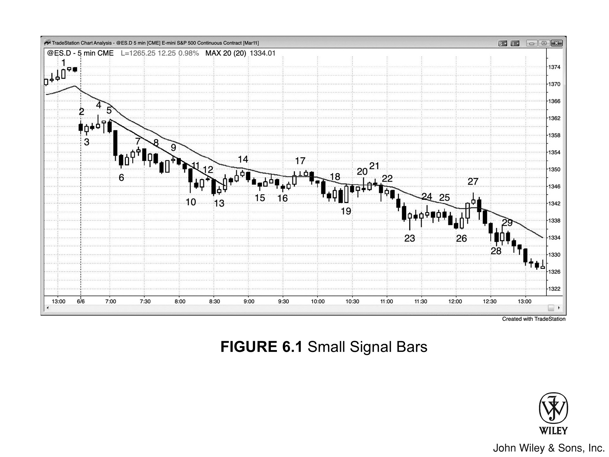

小 K 线既可是顺势入场策略，亦可是逆势入场策略。但在趋势行情中，回调时的小 K 线只能视为顺势入场策略。

**1. 顺势交易中的小 K 线（如图 6.1 所示）**

*   **实例分析**：Bar 7、9、12、14、17 和 21 均为回调中的小 K 线。
*   **交易机会**：它们给出的唯一交易机会，是在低点下方 **1 个 tick** 处挂突破单做空。
*   **形态特征**：尽管它们大多是十字星，但既然顺应趋势，便是合理的做空点。

**2. 强趋势中的市场心理与逻辑**

在强趋势中，大多数信号 K 线往往看起来很弱，而这恰恰是趋势能持续走低的原因之一：

*   **双方博弈**：空头急于做空，多头想止损离场，双方都在苦等一个强有力的卖出策略。这样一个策略能让他们确信市场不会反弹，必须立即离场。
*   **踏空与被套**：然而，完美的入场策略始终未现，导致空头踏空（trapped out），多头被套（trapped in）。
*   **市场推力**：这种局面制造了持续的紧张与紧迫感，不断推动市场走低。双方整日都在小批卖出，生怕那个完美的策略永远不来……而事实通常也确是如此。

**3. 交易者的常见误判**

*   由于入场策略看起来总是不够强，交易者很容易误判趋势疲软，以为市场很快会有像样的反弹，以便卖个好价钱。
*   他们眼看市场维持在均线下方，但跌速从未快到令人恐慌，于是继续期待一波更大的反弹再做空。
*   **结论**：这些弱势信号 K 线，反而是强趋势的重要组成部分。

***

**4. 逆势交易中的小 K 线**

如果小 K 线出现在摆动低点，且具备其他逆势理由（如先前的趋势线已被突破），那么它也可以构成逆势入场策略。

*   **实例分析**：Bar 16 是一根小阴线。
*   **入场理由**：在价格突破空头趋势线，且 Bar 7 到 13 的空头通道形成 **高 4 底部（High 4 bottom）** 结构后，这根 K 线构成了做多策略。
*   **后续预期**：行情从 Bar 14 测试均线开始，走出了两段式回调，市场很可能会迎来第二段上涨。

只有在 **空头趋势** 中，交易者才应在低位做空小 K 线，若能赶上 **强空头急速**（strong bear spike）则更为理想。K 线 29 个头不算小，但它是一根 **孕线**（inside bar），功效等同于小 K 线，加之它本身又是 **空头趋势 K 线**，即便处于日内低点，依然是安全的做空机会。

K 线 13 是“三 K 线向上反转”的中间那根，而 K 线 17 则是“四 K 线向下反转”的中枢。所谓的多 K 线反转，无非是 **双 K 线反转**（two-bar reversals）的变体。此图中还有几处反转形态，这在任何图表上都司空见惯。

### 图表深度解析

如图 Figure 6.1 所示，当日大幅 **低开缺口**（gap down）开盘。交易者必须警惕开盘后可能出现的单边趋势（无论涨跌），并密切搜寻 **入场策略**（setup）：

*   K 线 3 是一根 **多头反转 K 线**，本是博弈“突破失败向上反转”的绝佳做多 **入场策略**。
*   然而，随后的 **入场 K 线**（entry bar）却收出 **空头实体**（bear body），这对期待 **多头趋势** 的人来说，绝非善类。
*   于是，这个“失败的突破”宣告失败，演变为 **突破回调做空策略**（breakout pullback short setup），空头突破行情随之延续。

价格在 K 线 4 下方反转走低，多头止损离场，许多人顺势反手做空。次根 K 线又是一根 **十字星**（doji），至此，在这个大幅低开的日子里，市场陷入了 **窄交易区间**（tight trading range）。这是极佳的 **突破模式**（breakout mode），往往孕育着大幅的单边行情。K 线 5 仅比那根十字星高出一个 tick，很可能套住了急于进场的多头——他们没能耐心等待价格突破 K 线 4 的顶部（即开盘区间高点）。

**当日最佳交易机会有三：**

1.  是在 K 线 5 下方做空；
2.  是在次根 K 线跌破 **窄交易区间** 低点时入场；
3.  是在该 K 线收盘时跟进，因为此时市场已确立为 **Always-In Short** 状态。

跌至 K 线 6 的这段 **急速**（spike）由三根巨大的 **空头趋势 K 线** 组成，这意味着随后很可能出现向下的 **测量移动**（measured move），且多半会演变为 **空头通道**（bear channel）。最终，趋势延续的幅度远超预期。

### 关键 K 线与形态解析

*   **Bar 13**
    *   **形态特征**：这是一根出现在新摆动低点的小阳孕线。
    *   **策略构成**：它既是对“低 2 最终旗形”做空的向上反转，又是“第二腿下跌中的第二腿”，这使其构成了“高 4”做多策略。
    *   **市场背景**：处于“急速转通道”空头形态的通道阶段（此前的“急速”始于 Bar 5，由三根空头趋势 K 线构成）。这是第 3 或第 4 次向下推动（取决于具体的计数方式）。
    *   **后续走势**：通道往往在第 3 次推动终结，随后通常接一个“横盘至上涨”的两段式运动，此处正是如此。此类回调通常能触及通道顶部，但此处的空头趋势过于强劲，导致回调只能横盘而无法向上。这通常意味着后市价格将继续走低。

*   **Bar 16**
    *   **策略构成**：这是一个“高 2”买入策略，出现在一个正在形成的交易区间内。
    *   **强度分析**：此前至 Bar 14 的上冲相对强劲，足以突破空头趋势线。这种强度表明，大概率会出现第二腿上涨。

*   **Bar 14**
    *   **策略构成**：接近构成“20 均线缺口做空策略”，因为此前 20 根 K 线的高点均位于均线之下。
    *   **判断逻辑**：“接近即视为合格”（Close is close enough），市场很可能测试此前的空头低点。
    *   **结构意义**：至 Bar 14 的反弹也是对窄通道的首次突破，因此随后很可能至少会有一次向下测试。

*   **Bar 17**
    *   **策略构成**：这是一个标准的“20 均线缺口做空策略”（十字星形态）。
    *   **价格行为**：市场先跌破该 K 线，随即反抽至其上方，最终掉头抛售，创出当日新低。
    *   **交易细节**：考虑到源自 Bar 16 的上攻是一个强劲的“多头急速”，大多数交易者在做空前会等待第二个信号。
    *   **入场时机**：入场点位于紧随 Bar 17 的“外包阳线”下方。这根入场 K 线是一根强劲的空头趋势 K 线，并成为随后一波强劲“空头急速”的首根 K 线。

*   **微型反转形态**
    *   所有图表中都充斥着“微型双顶”和“微型双底”反转形态，对此我会在第三本书的“反转”一章中详述。
    *   **实例**：**Bar 20** 和 **Bar 21** 便构成了一个微型双顶反转形态的实例。

***

> **[图 6.2] 反转 K 线也可以是中继策略**

趋势强劲时，市场往往反其道而行：
*   面对多头反转 K 线，价格在下方成交而非上方；
*   面对空头反转 K 线，价格在上方成交而非下方。

如图 Figure 6.2 所示，在 Baidu, Inc. (BIDU) 的 5 分钟图上：

*   **Bar 3：** 是市场第三次尝试向上反转，本身也是一根强劲的多头反转 K 线。然而，价格并未向上突破，反而跌破了该 K 线。或许有些多头操之过急，在买入信号触发前（下一根 K 线并未在其高点上方 1 个 tick 处成交）就抢先入场，结果反被套牢。他们会在多头反转 K 线下方 1 个 tick 处止损离场，而这正是聪明的交易者建立空仓的位置。

*   **Bar 6：** 空头反转 K 线处的情况恰恰相反。有些交易者在价格跌破低点前就提前做空，结果被套；当下一根 K 线涨破这根空头反转 K 线时，他们不得不狼狈平仓。

哪怕身处合理的反转区域，单凭一根反转 K 线也不足以成为入场的理由。

***

### Figure 6.3 巨大的趋势 K 线可能预示衰竭

如果一段趋势已持续了 10 根 K 线以上，此时突然出现一根异常巨大的趋势 K 线，通常意味着市场已成强弩之末（衰竭）。随后往往会有至少 10 根 K 线的回调，有时甚至会直接引发反转。

### 本图深度解析

如图 6.3 所示：

*   **K线 3 是一根巨大的趋势 K线**，它一头栽下，不仅跌破了开盘低点，还击穿了趋势通道线。紧接着收出一根光头多头孕线，意味着买家攻势凌厉，一路买进直至收盘。这是一个极佳的做多策略。
*   那根巨大的空头趋势 K线其实是卖出高潮，一旦突破这根多头孕线的高点，便是多头突破。这是一个先急速下跌、随即急速上涨的反转过程。若查看不同的大周期图表，你会发现这个底部在某些周期上是完美的双 K线反转，而在其他周期上则合成了一根单反转 K线。

***

*   **K线 4 是空头反转 K线**，但作为做空入场 K线的 **K线 5** 却立即反转向上，升破 K线 4 高点，扫掉了空头的止损盘。
*   **必须注意，在 K线 4 这根空头反转 K线下方做空并不明智**，因为上涨动能实在太强。此前已连续出现 11 根多头趋势 K线，交易者绝不应在第一根空头 K线下方就急于做空。
*   **在空头反转 K线上方，或在 K线 5 这根多头外包上行 K线上方买入，都是合理的交易**。因为空头止损离场后，往往会观望等待更多的价格行为，才会再次考虑做空。既然空头尚未准备好出手，多头便能趁势将市场推向新高。

如图 Figure 6.3 所示，当日跳空低开，首根 K 线虽为强多头趋势 K 线，但随即反转向下，形成突破回调做空策略。

*   鉴于前两根 K 线实体巨大、影线修长，且开盘向下缺口微小，市场陷入横盘震荡的概率极高，因此最佳策略是观望，而非入场做空。
*   然而，随后出现的双 K 线反转信号意味着突破失败，这可能确立了当日低点。
*   紧接着是一波四根 K 线的上涨急速行情，但缺乏后续跟随。在随后的几小时内，交易者理应至少部分止盈；若未反手做空，剩余仓位可能会在尾盘的抛售中触及保本止损离场。

---

**Bar 3** 同时也处于急速转通道空头趋势的底部，随后的反转应当回测通道起点——即 **Bar 2**。市场走势确是如此。

*   **结构分析**：下跌至 **Bar 1** 的五根 K 线抛售构成了“急速”行情，而下行“通道”则始于向 **Bar 2** 的回调。
*   **高潮特征**：下跌至 **Bar 3** 的抛售具有高潮特征，因为其中约有十几根 K 线的高点和低点均低于前一根 K 线。具体数量并不重要，关键在于 K 线数量众多；数量越多，这种走势越难以为继，因而越具备高潮特征。
*   **形态定义**：在强劲空头趋势之后，出现如 **Bar 3** 这样的大阴线（空头趋势 K 线），即为抛售高潮。这通常会引发两段式的横盘至上涨回调，而像本例这样直接引发趋势反转的情况则较为少见。

---

**Bar 4** 这一失败的反转 K 线，构成了一个基于“低 2 (Low 2) 失败”的买入策略。

*   这个低 2 (Low 2) 形态套住了那些天真的交易者，他们在反转 K 线下方做空，却未等待市场预先展现出空头强度。
*   若市场处于强多头趋势的窄通道中，且此前未曾突破多头趋势线，切勿做空。

截至 7:05 K 线的那波四 K 线 **急速** 上涨，本可能演变为向上 **通道**。然而，随后跌至 Bar 1 的 **急速** 行情带来了另一种可能：市场或许会转为向下 **通道**——事实确是如此。

*   在 8:45 左右 **回调** 结束时买入是合理的，因为预期会有向上 **急速** 行情；
*   同样，在 Bar 2 之后的熊势 **孕线** 下方反手做空，也完全恰当。

> **注意**：Bar 1 前后的那些 **十字星** 都不是好的 **信号K线**，因为它们身处当日 **交易区间** 的中部，且依附于一条走平的均线。

Bar 1 前第 5 根 K 线处的波段高点形成了一个三 K 线反转形态。由于第三根 K 线与 15 分钟 K 线同时收盘，所以在 15 分钟图上，该形态会表现为一根实体仅 1 tick 高的阳性 15 分钟 **反转K线**。

Figure 6.4 5 分钟图上的 15 分钟反转

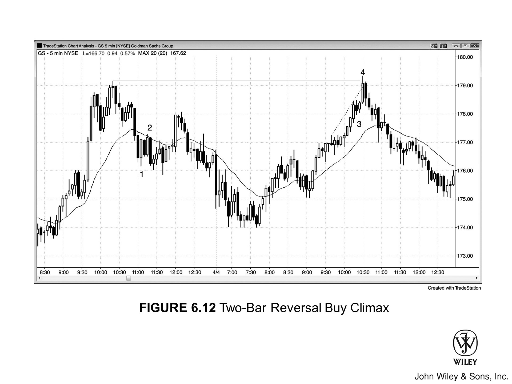

请注意，15 分钟反转形态在 5 分钟图上也能识别：

1.  在 Figure 6.4 中，左侧 15 分钟图出现了几根 **反转K线**，其对应的三 K 线形态则显示在右侧 5 分钟图的方框内。
2.  通常，相比 5 分钟反转，15 分钟反转更可能引发幅度更大的行情。
3.  在寻找 5 分钟交易机会时，若看到同时也构成 15 分钟反转的三 K 线组合，你对这笔交易通常会更有把握。

<?enlrg ??>

一般而言，如果一根 **趋势K线** 出现后，在接下来约 10 根 K 线内出现了一根反向 **趋势K线**，且其收盘价接近第一根 K 线的开盘价，那么将其视为反转形态是明智的。这种反转在某个更高的时间周期图表上会表现为双 K 线反转，而在更高级别的时间周期图表上，则是一根 **反转K线**。

# 本图深度解析

在 图 6.4 中，市场跌破均线，但突破失败，进而引发了一波开盘即走的多头趋势：

*   **K线 3**：是强趋势中的一根均线缺口 K线，跌至 K线 3 的这波走势跌破了多头趋势线。均线缺口 K线通常会引出大级别回调前的最后一腿趋势。
*   **K线 4**：是位于更高高点处的双 K线反转做空策略。

***

### 图 6.5 三 K线反转

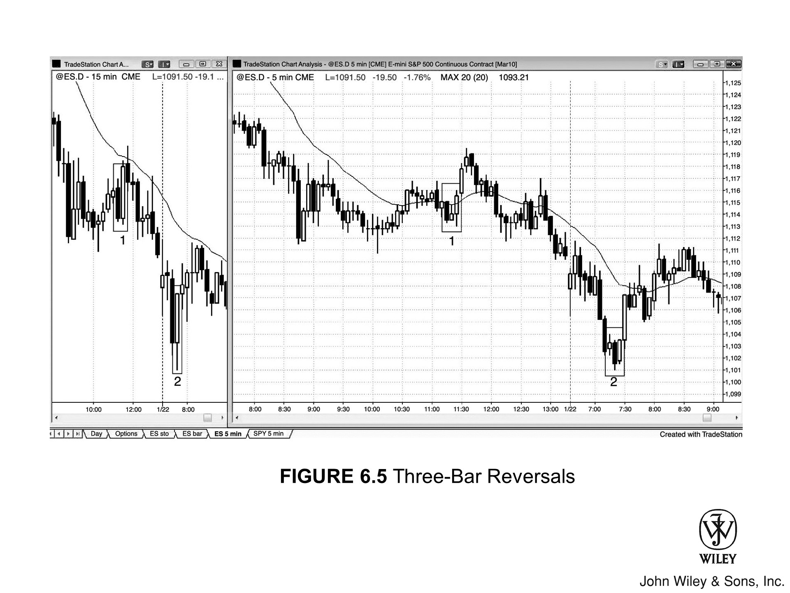

5 分钟图上的某些三 K线形态，虽未在 15 分钟图上形成优质反转，但仍能带来合格的反转行情。

在 图 6.5 中，右侧 5 分钟图上有几个三 K线形态，乍看之下似乎能在 15 分钟图上形成完美的三 K线反转。然而，由于这两个案例中第 3 根 K线都收盘于整点后的 25 分，而非 30 分，因此当 15 分钟 K线最终收盘时，形态并未展现出同等的强度。

如果该 5 分钟形态是一个完美的 15 分钟反转，交易者便可进行交易：

1.  在三根 K线高点上方 1 个 tick 处买入；
2.  若存在更早的 5 分钟入场点，也可提前入场。
    *   **例如**：在 5 分钟图的第二个案例中，第 2 和第 3 根 K线构成了双 K线反转，因此在双 K线反转上方 1 个 tick 处入场是可以接受的，不必非要等到三根 K线最高点上方（即高出 2 个 tick 的位置）才进场。

总体而言，交易者不应刻意寻找三 K线反转，因为这种形态一天仅出现寥寥几次，不值得为了它而冒着错过其他更常见策略的风险。

Bar 2 是两 K 线反转形态的第一根 K 线。若切换至其他时间周期（例如左侧的 15 分钟图），你会发现：
*   导致底部的三根大阴线（熊市趋势 K 线），加上 Bar 2 之后的两根趋势 K 线，在那个周期上恰好构成了一个两 K 线反转。
*   你甚至能找到某个图表，显示这些 K 线合并成了一根完美的单 K 线反转。

正因如此，所有的反转策略本质上都是紧密相连的。别太纠结细节，也别忘了最终目标：

> 你的任务是观察市场何时试图反转，一旦确信反转可能产生延续性（follow-through），就寻找入场机会。

### 图表深度解析

在 Figure 6.5 中，市场跳空低开（带有小型缺口），跌破了昨日低点。

*   **第一根 K 线**：这是一个失败的突破买入形态，多头原本指望借此走出“开盘即涨”的多头趋势。当反转发生在这种陡峭的熊市通道中时，最好不要急于买入，而是等待向上反转后的回调。
*   **后续走势**：几根 K 线后出现了一个更高的低点（Higher Low），但走势横盘且 K 线带有长影线，因此多头应等待更强的信号。

随后反而出现了一个 Low 2 做空信号（也是突破回调做空）。但是，当开盘区间只是一个小型交易区间（波幅小于日均波幅的三分之一）时：

1.  大多数交易者更倾向于等待市场突破整个开盘区间后再行动。
2.  随后出现一根大阴线（熊市趋势 K 线）跌破开盘区间低点，这表明大多数交易者确实是在等待突破发生后才进场做空。

**Bar 2** 是一个两 K 线反转，构成了开盘反转做多策略。它紧随在一根单 K 线最终旗形之后，而且当天第一根强劲的 K 线也显示出早期就存在买盘力量。

Figure 6.6 两 K 线反转

双 K 线反转由两根 K 线构成，入场点需设在超出这两根 K 线极值一个 tick 处。

针对 Figure 6.6 中的具体形态分析如下：

*   **Bar 5**
    虽是空头趋势 K 线，其低点却比前一根 K 线高出一个 tick。当反转 K 线几乎完全重叠前一根 K 线时，应视作双 K 线反转形态。以此例而言，最稳妥的做空位，应设在 Bar 5 或前一根 K 线中较低的那个低点下方。行情虽跌破 Bar 5 一个 tick，却随即与前一根 K 线低点构成了双底。那些以为在大空头 K 线下方做空万无一失的交易者，最终止损出局。

*   **Bar 3**
    情形相似。若有意做空，更稳妥的策略是等待价格跌破前一根 K 线低点，而非仅跌破 Bar 3。无论如何，这笔做空凶多吉少，毕竟市场此前已连涨九根 K 线，势头正劲。上策是放弃做空，转而寻找回调买入良机，例如在 **Bar 4** 这个双 K 线反转上方做多。

*   **Bar 1**
    是双 K 线买入反转组合的第二根 K 线，且位于第一根 K 线高点之上。入场点应设在这第二根 K 线的高点上方。

*   **Bar 2**
    亦是双 K 线反转，两根 K 线高点持平。

***

### 关于此图表的深度探讨

在 Figure 6.6 中，市场大幅跳空低开，随即收出一根多头趋势 K 线。接着虽形成向下的双 K 线反转，却未触发做空，反而演变为向上的双 K 线反转。Bar 1 上方的多头入场，在随后两根 K 线中获得了良好的延续。

鉴于这可能是“开盘即涨的多头趋势”，且买盘显露强势，交易者应坚守位于日内低点下方的初始止损，静待更高的低点出现。一旦市场从更高的低点向上转折，并拉出一根强劲的多头趋势 K 线，便可将止损上移至该低点下方，持有多单直至收盘。

> Figure 6.7 首小时反转

开盘后一小时左右，要时刻准备应对反转。高盛集团 (GS) 昨日处于空头趋势，今日开盘强劲反弹，因此交易者都在等待回调，看是否形成更低的低点或更高的低点，进而引发潜在的趋势反转。

如图 Figure 6.7 所示：

*   **K线 1** 创出更低的低点，随后被 **K线 3** 测试，两者形成双底。
*   紧接着，**K线 5** 形成更高的低点，多头开始寻找买入策略，期待开启新的多头趋势。
*   **K线 5** 是孕线，其后一根 K线 仍包在 **K线 5** 内部——低点更高，高点更低。这是一个 **ii setup**，交易者会在第二根 K线 上方 1 个 tick 处挂突破单买入。
*   **K线 6** 构成了第二个 **ii setup**，因为它本身是孕线，且前一根 K线 也是孕线。

<?enlrg ??>

### 本图深入探讨

Figure 6.7 的开盘走势充满陷阱。记住：拿不准，就观望。

*   市场先是向上突破昨日尾盘的交易区间，但突破在第三根 K线 处失败。
*   随后市场向下突破交易区间，但同样失败，并在 **K线 1** 处反转向上。
*   **K线 3** 是个尚可的双底做多策略，但选择等待的交易者可以在 **K线 6** 上方买入该双底回调。

这是一个双底回调买入策略。双底回调形态中，回调幅度通常超过 50%，甚至经常一路跌回双底的起始低点。图中的双底在点位上分毫不差（exact to the tick）。

那个较高的低点往往形成圆底，传统股票交易者常称之为“吸筹区”。叫什么名字并不重要，重要的是市场在第二次尝试下跌时（K线 3 为第一次）未能创出新低。既然跌不下去，空头就会让路，市场转而向上试探（寻找愿意在高价卖出的卖家）。结果市场没找到卖家，反而找到了愿意以更高价格买入的买家。

以下是具体的 K 线形态分析：

*   **K线 7**
    构成了第三次入场机会，其背景是连续两次方向相反的突破失败。市场先是向上突破 K线 6 失败，紧接着下一根 K 线向下突破也宣告失败，这意味着多空双方都被套住了。如此一来，K线 7 仅仅变成了针对 K线 6 突破的一次回调，因此属于突破回调做多策略。

*   **K线 4**
    是一个双顶熊旗做空策略。开盘反弹后，在 K线 2 形成了一个更低的高点，随后 K线 4 对该点进行了测试，构筑出双顶。由于该双顶位于开盘高点之下，暗示可能存在空头趋势；而在空头趋势中，任何回调都应视为熊旗。

***

**Figure 6.8 微小的 K 线依然有用**

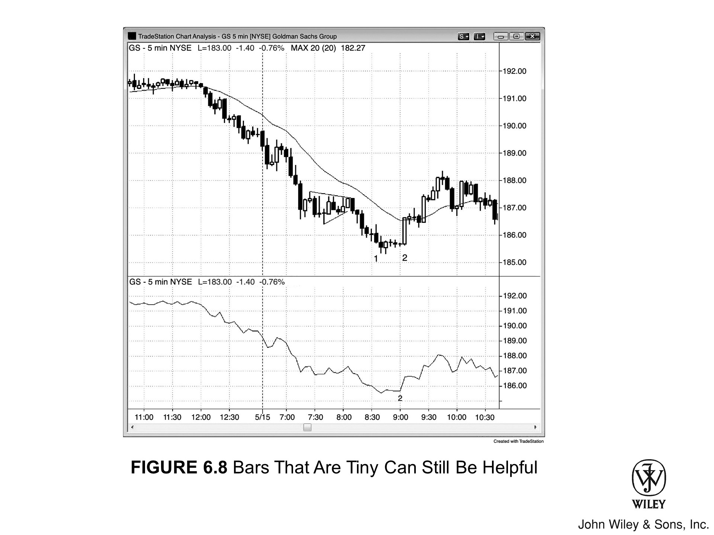

有时 K 线极小，看似微不足道，却可能传递着至关重要的信息。在 Figure 6.8 中，信号 K 线 2 非常微小（股价 185 美元，波幅仅 11 美分），但若查看收盘价线图，点 2 处那个微小的“更高的低点”便清晰可见。

Bar 2 构成了反转形态的后半段，而 Bar 1 前方第三根大实体空头趋势 K 线，则是这波反转下跌的起始点。若在更高的时间周期图表上观察，你会发现这 10 根 K 线实际上组合成了一个双 K 线反转形态。

### 本图深度解析

如图 Figure 6.8 所示：

*   **开盘走势**：当日开盘价即为全天最高点（High Tick）。随后市场以两根 K 线的急速下跌，突破了昨日收盘时形成的双 K 线熊旗。
*   **第 4 根 K 线**：市场试图向上反转，但这根外包阳线缺乏后续跟随，因此不存在做多机会。
*   **空头操作**：空头会继续持仓，并将保护性止损设在信号 K 线或外包阳线上方。随后的 K 线是一根空头孕线，这在开盘即形成的空头趋势中，构建了一个低 2 做空入场点。

关于 **Bar 2** 的入场逻辑：

*   Bar 2 前方的第三根 K 线虽是多头反转 K 线，但入场风险较高，因为此前七根 K 线显示市场正处于窄空头通道之中。
*   更稳妥的策略是等待通道突破，再买入突破回调。此次回调更像是一种横盘停顿，最终以 Bar 2 形成的更高低点买入信号告终。
*   通常而言，二次入场更为可靠。该形态极似 iii 形态，而 iii 形态往往预示着波段末端的反转。

关于 **Bar 1** 的形态缺陷：

*   Bar 1 并非理想的最终旗形突破反转形态，因为其信号 K 线只是一根十字星。在强空头趋势中尝试抄底时，应当等待一根多头趋势 K 线作为信号 K 线。
*   此外，此前四根 K 线均为空头趋势 K 线，下跌动能过强，不宜在第一次反转尝试时买入，尤其是当信号 K 线为十字星时——这绝非强劲买盘的征兆。

---

Figure 6.9 ii 形态即更小时间周期的反转

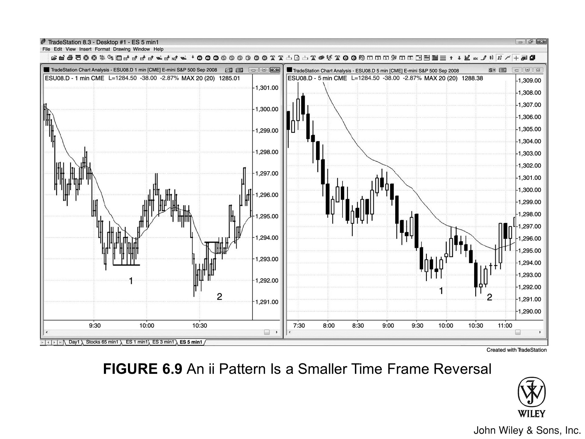

由于 ii 形态在更小周期的图表上总是对应着清晰的反转策略，你无需特意查看小周期图表加以确认。如图 [Figure 6.9] 所示，右侧 5 分钟图出现了两个 ii 形态（第一个实为 iii 形态）。若观察左侧的 1 分钟图等更小周期图表，这些形态往往呈现为更清晰的反转形态。

- **5 分钟图上的 Bar 1**：是 iii 形态，构成了一个更高的低点；在 1 分钟图上，该低点经历了反复试探。
- **5 分钟图上的 Bar 2**：是继前一更高低点后的又一个更高低点，这意味着市场正在形成趋势性的低点抬升，属于多头趋势的特征之一。

`<?enlrg ??>`

在这两个案例中，ii 形态均以一根多头趋势 K 线收尾，构成了极佳的做多策略。
- 尽管小 K 线的方向指引意义较弱，但若形态的最后一根 K 线是顺着预期入场方向的趋势 K 线，效果总是更好。
- 5 分钟图上的 **Bar 2** 与其前两根的那根空头趋势 K 线，共同构成了一个反转形态。

**关于此图的深入探讨**

在 [Figure 6.9] 的 1 分钟图上：
- **Bar 1** 的策略是双底回调买入形态。
- **Bar 2** 则是失败的低 2（failed low 2）。

***

### [Figure 6.10] 双 K 线双底与双顶

双底和双顶可以极小，甚至仅由两根连续 K 线构成，但其重要性不减。在 [Figure 6.10] 中：

- **Bar 1**：属于微型双底熊旗策略。当时处于空头急速行情中，先是一根空头趋势 K 线，紧接着是一根多头趋势 K 线，且两者低点完全相同。
    - 可在其低点下方一个 tick 处卖出。
    - 你也可以在下一根 K 线跌破单 K 线回调的低点时卖出，从而提前入场。
- **Bar 2**：亦是同理。

Bar 3 是一根做多的微型双顶入场 K 线。之所以做多，是因为：
*   那根空头趋势 K 线其实是多头急速行情中的单 K 线牛旗（即多头急速中的高 1 买入策略）。
*   同时，它既是微型双底，又与前一根 K 线构成了两 K 线反转。

因此，交易者也可以在 Bar 3 高点上方买入，但这属于风险较高的入场，毕竟进场位置差了 4 个 tick。此外，三根 K 线重叠后被一根大 K 线突破，此时追高买入是有风险的，因为那三根重叠 K 线可能就是交易区间的开端。

### 图表深度解析

如图 Figure 6.10 所示，当日首根 K 线向下突破昨日低点，但突破失败。由于市场仍处于昨日尾盘的交易区间内，且开盘向上的两 K 线反转包含巨大的 K 线，若此时入场，交易者将被迫在交易区间顶部买入，而该区间内又充斥着长影线。因此，正确的做法是等待。

随后行情上攻至均线，形成熊旗，并在上午 7:15 尝试突破。但突破失败，紧接着下一根 K 线向上反转，形成两 K 线反转，这是一个合理的买入点。

上午 8:50，出现了双底回调做多策略。

Figure 6.11 强两 K 线反转

在强劲的 **空头趋势** 中，直接买进第一次反转通常并非上策。但若是在 **抛售高潮** 之后，出现强有力的 **双 K 线反转**，这便是一个可靠的 **买入策略**。

如图 [Figure 6.11] 所示，雷曼兄弟 (LEH) 在经历连续 **抛售高潮** 后，测试了 **空头趋势通道线**，并形成了一个 **双 K 线反转** 底部。这波抛售属于高潮性质，因为这种极端行为无法持续：

*   此前 17 根 K 线中，竟有 16 根的高点低于前一根 K 线。
*   此外，还有三次出现这样的情形：在一连串较小的 **空头趋势 K 线** 之后，紧跟一根巨大的 **空头趋势 K 线**。
*   **高潮** 之后，通常会接一个持续多根 K 线的 **两段式回调**（在 5 分钟图上至少一小时）。

**关于 Bar 1 与入场逻辑：**

Bar 1 是 **双 K 线反转** 的第一根 K 线。在强劲的 **空头趋势** 中，买入第一次反转通常风险较大，但鉴于已出现多个高潮迹象，且该 **双 K 线反转** 极为强势，这便构成了一个合理的 **买入策略**。

*   **Bar 1**：又是一根巨大的 **空头趋势 K 线**，因此也是又一次 **抛售高潮**。
*   **第二根 K 线**：则是一根强劲的 **多头趋势 K 线**。该 K 线实体巨大，开盘即最低，收盘即最高。

### 关于此图表的深入探讨

在 [Figure 6.11] 中，市场走势细节如下：

1.  **开盘阶段**：市场开盘突破了昨日最后 90 分钟形成的 **熊旗**，并测试了昨日低点。
2.  **早期测试**：第三根 K 线测试了 **移动平均线**，随后一根 K 线构成了“**低 2**”做空形态。
3.  **潜在形态**：这可能演变为“开盘走低 **空头趋势**”以及“**突破回调** 做空”的机会。
4.  **进场时机**：许多交易者等待价格跌破当日第一根 K 线才进场做空，这催生了一根 **空头趋势 K 线**，它也成为随后三根 K 线 **空头急速** 的第一根。
5.  **后续机会**：交易者也可在随后的 **熊旗** 下方做空。

### Bar 1 与卖出高潮分析

*   **Bar 1 形态：** Bar 1 波幅很大，且紧随一段强劲的空头腿之后，因此属于**卖出高潮**。
*   **前序高潮：** 往前数 4 根 K 线，还有一根巨大的空头趋势 K 线，也是卖出高潮。
*   **市场惯性：** 当趋势极强时，市场往往要等到第二个卖出高潮出现后才会回调，极少会等到第三个。
*   **最终旗形：** Bar 1 之前两根 K 线处的那根小孕线，演变成了一个单 K 线最终旗形。

### 开盘后的走势演变

1.  **向下急速 (Spike Down)：** 开盘后出现了三根连续的巨大空头趋势 K 线，彼此重叠极少，构成了向下急速。
2.  **后续预期：** 强劲的向下急速后，通常会接一个空头通道，随后是回调，有时甚至反转。
3.  **实际走势：** 在这个初始向下急速后，紧接着是一个横盘 **Low 2**，随后是更猛烈的抛售。
    *   虽然这段后续抛售近乎垂直下跌，但仍应将其视为初始急速后的空头通道。
    *   那个 Low 2 属于一种最终旗形，即便市场在尝试回调前已经跌了很远。

### 急速转高潮空头形态与大周期影响

*   **常规预期：** 急速转高潮空头形态（急速转通道空头趋势的一种变体）通常会在一两天内回测通道起点附近。
*   **特殊情况：** 但若抛售如此强劲，市场可能不会回测，因为更大周期的形态可能正在主导走势。
*   **大周期示例：** 例如，跌至 Bar 1 的整段抛售，在 60 分钟图上可能只是一个巨大的急速 (Spike)，随后的交易区间可能成为回调，进而引发大型空头通道，推动价格跌至更低位。

---

### [图 6.12] 双 K 线反转买入高潮

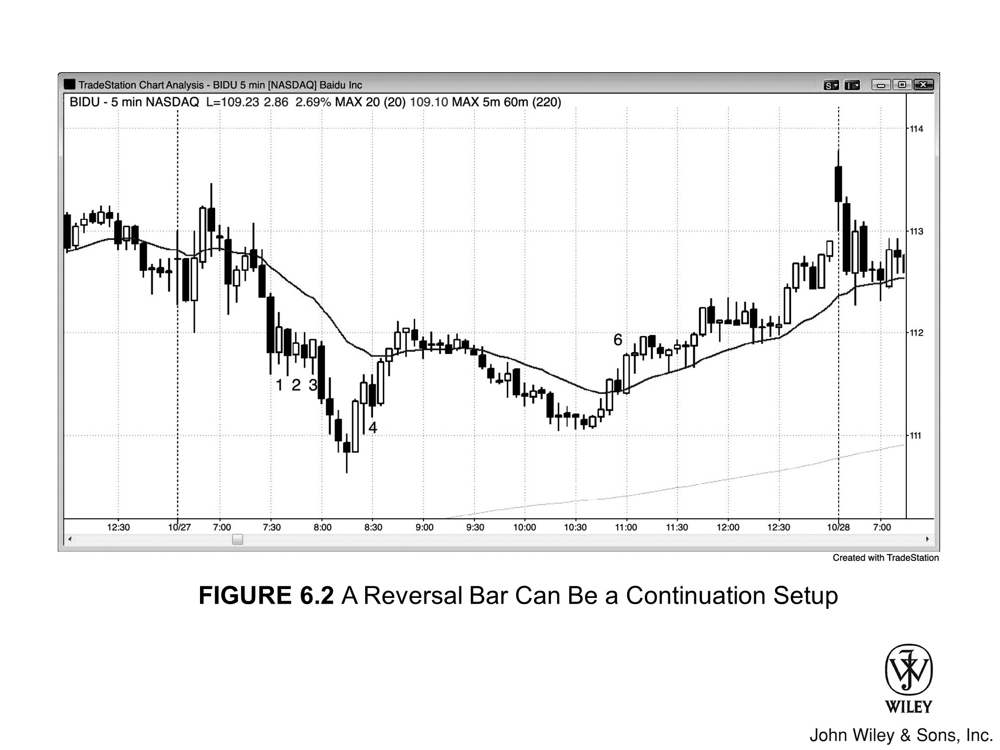

如果处于买入高潮末端，且双 K 线反转形态强劲，那么对强多头通道的第一次反转尝试，可以作为一个可靠的做空机会。

如图 [Figure 6.12] 所示，Bar 4 形成了一个巨大的双 K 线反转顶。该形态出现在突破昨日高点及多头趋势通道线之时，且紧随小型旗形（Bar 3）的突破之后。

*   当两根 K 线重叠幅度很大时，若在两根 K 线中**低点更低**的那一根下方做空，而非另一根（本例中为 Bar 4），获利概率会更高。
*   此外，第二根 K 线是一根大实体阴线；在强劲多头趋势中，做空**只能**选在强空头 K 线（Strong Bear Bar）下方，**绝不**可在强多头 K 线下方入场。

Bar 1 与前一根阴线并未构成理想的双 K 线反转买入形态（Buy Setup）。原因是：
*   这两根大阴线从“更低的高点”向下突破，下跌动能（Momentum）过强。
*   两根 K 线几乎没有重叠，且影线极短。

紧接着又出现了一个双 K 线反转买入形态（这种连续形态偶有发生）。但在急速下跌（Spike）之后，四根重叠 K 线构成了熊旗（Bear Flag）。
*   身处空头趋势，不应在交易区间顶部买入，尤其是价格紧贴均线下方时。
*   只有当你有理由预期反转时，双 K 线反转才是有效的逆势信号。

基于前两根 K 线形成的双 K 线反转顶，Bar 2 是一根尚可的做空入场 K 线（Entry Bar）。它逆转了此前向均线回归的小型回调（Correction）。然而：
*   若双 K 线反转做空形态（Sell Setup）紧贴均线下方出现，且 K 线较大并伴有重叠，通常可在信号 K 线低点或更低处买入，进行多头剥头皮（Long Scalp）。
*   此处本质是小型交易区间，而在其底部买入通常更佳。

Bar 4 是该双 K 线反转的第一根 K 线。

# 本图深入探讨

在 **Figure 6.12** 中：

*   **Bar 4 形态分析**：这是一个双 K 线反转，紧随 **Bar 3** 的小型最终旗形（final flag）之后。这是自上午 9:10 多头急速（bull spike）启动后的第三次上推。
*   **急速转通道形态（Spike and channel patterns）原理**：行情往往在三次推升后展开回调。急速本身是第一推，随后通常还有两段急速，最后才是一波回调，目标通常是回测通道底部附近。

**关于今日开盘与早期交易机会：**

*   **首根 K 线**：向下突破了昨日尾盘 90 分钟形成的双底牛旗。
*   **做空策略**：
    *   交易者可以在双底下方挂突破单（stop order）做空；
    *   或者在三根 K 线后，利用 **ii** 突破回调形态（ii breakout pullback setup）在下方做空。

**关于整体背景与 9:05（PST）走势：**

*   **背景**：从昨日高点起，行情走出大幅两段式下跌，至今日开盘形成三重底。
*   **9:05（PST）行情**：先是一段强劲上涨腿测试了开盘高点，随后在更高的低点（higher low）处给出了第二次做多机会。
*   **形态本质**：这本质上也是个突破回调买入形态，即便当时市场尚未真正突破开盘高点。

**关于 Bar 1 及其后续心理博弈：**

*   **K 线序列**：**Bar 1** 为阳线，随后是一根阴线，接着第二根阳线向上测试均线。
*   **低 2 形态（Low 2）**：这是针对均线的小型两段式回调，因此构成了低 2 做空形态。
*   **市场心理与被套多头（Trapped Bulls）**：
    *   此前连续出现双 K 线反转尝试筑底，在上方买入的多头此时成了被套的多头；一旦低 2 触发，他们只能亏损离场。
    *   这部分止损盘叠加新空头的抛压，提升了做空胜率。
    *   此外，刚吃过亏的多头不敢轻易再买，买方的受挫增加了做空剥头皮（short scalp）成功的机会。

一连串相互重叠的 **K 线**构成了**窄交易区间**。这种区间如同磁铁，往往导致**突破**失败，将价格重新吸回区间内部。究其原因，**多头**和**空头**都认可该区间内的价格具有价值：

*   **区间底部**：多头视其为更佳的价值洼地，买入愈发激进；空头则倾向于在区间中部或顶部**做空**。由于空头在底部收手，加之多头买盘增强，市场被重新推高。
*   **区间顶部**：情形恰恰相反，空头变得激进，买家则停止买入，等待价格稍稍回落。

一旦发生**突破**，这一过程会进一步放大。在此例中，空头压倒多头，推动市场向下突破。然而，低位并未涌现出能推动价格续跌的新卖家；相反，买家认为此处的价值优于**窄交易区间**之内。结果，市场被拉回区间。

随后，市场尝试向上突破，却再次被拉回。不过，成功的突破终究会到来。

***

### Figure 6.13 无影线即强势

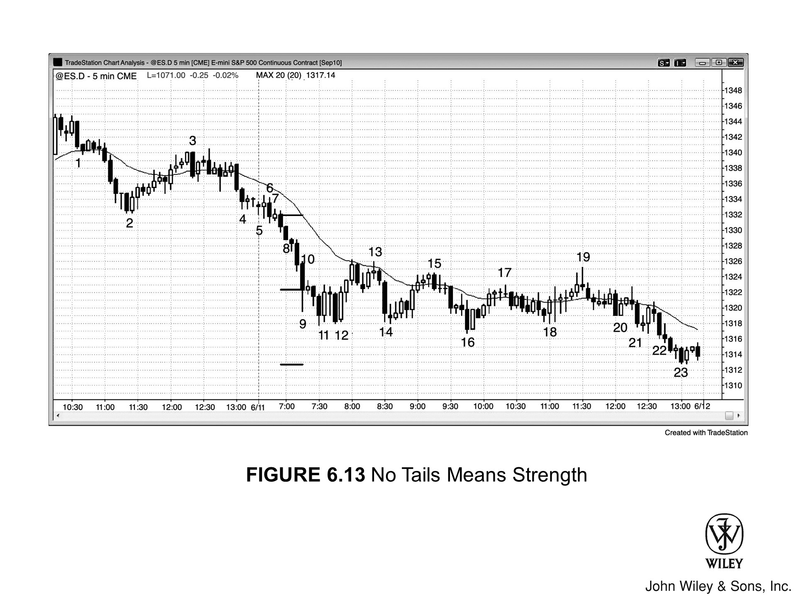

在**强趋势**中，若某根 **K 线**两端均无**影线**，即为强势信号，交易者应在其突破时顺势入场。

在 Figure 6.13 中，Bar 8 是强**空头趋势**中的一根**空头 K 线**：
*   **形态特征**：其高低点均无**影线**，表明抛压极重（空头从头卖到尾）。
*   **后续预示**：这预示着后续很可能有进一步抛售。

鉴于市场移动迅速，交易者必须手疾眼快，可采用以下方式入场：
1.  挂出**卖出突破单**；
2.  直接以**市价单**做空；
3.  在价格反弹 1 到 2 个 **tick** 时利用**限价单**入场。

- **Bar 10 之后的 K 线**：虽在空头趋势中收出光头形态，但因当时市场并非处于自由落体状态，仅凭此点，不足以构成做空理由。
- **Bar 16 之后的 K 线**：是一根光头光脚的多头趋势 K 线，但因市场不在多头趋势中，故不能单凭“无影线”这一点将其视为买入策略。
- **Bar 17 之后的 K 线与 Bar 20 之前的 K 线**：均不构成光头 K 线做空策略，因为市场并未处于自由落体的空头趋势中。

本图中出现了许多双 K 线反转策略，其实所有图表皆是如此。

### 本图深度解析

在 Figure 6.13 中，开盘平淡，延续了昨日收盘时的窄交易区间。

*   **Bar 8**：是一次双 K 线突破，交易者可在该 K 线收盘时做空，因为这很可能形成“开盘即跌”的空头趋势；
*   **Bar 10**：也可在其下方做空，这是第一处停顿；
*   **Bar 13**：或者在此处做空，这是对移动平均线的一次双顶熊旗测试。

**关于 Bar 11：**
Bar 11 是双 K 线反转的第二根 K 线，市场经历抛售高潮后，或许正试图掉头向上。随后的 K 线是一根十字星孕线，也是低 1 (Low 1) 做空策略。然而，如果熊旗的信号 K 线与前两根 K 线大部分重叠，且市场可能处于交易区间内，那么做空失败并演变为空头陷阱的概率极高。切勿交易此类做空信号。

**关于 Bar 12：**
Bar 12 开始的三 K 线反弹形成了一个 20 均线缺口 K 线 (20 Gap Bar) 做空形态，但鉴于上涨动能强劲，最好等待第二个信号，该信号出现在 Bar 13。

- **K线 19**
  形成均线缺口 K 线做空形态，随后创下当日新低。
  - **意义**：此举既是对 K线 15 与 17 波段高点的突破失败，亦是对交易区间顶部的测试。
  - **背景**：趋势日中，太平洋时间上午 11:00 至正午常有强劲的反趋势行情，正如本例所示，容易诱使交易者站错队。
  - **应对**：认清此点至关重要，唯有如此，方能做好顺势交易的心理准备——即在此处做空。

- **K线 10**
  前一根 K 线波幅巨大，且出现在持续已久的趋势中，故属于抛售高潮，市场随后或将尝试横盘，甚至向上回调。
  - **机会**：强趋势中的首次停顿，通常是胜率颇高的剥头皮做空机会，即便在强劲空头趋势中亦不例外。
  - **警惕**：它可能演变为最终旗形，进而引发向上回调（即向下突破低点后，或许在一两根 K 线内便反转向上）。

- **测量移动**
  每当出现强劲的向下急速行情，随后通常伴有测量移动。
  - **测算基准**：取决于急速形态的某些特征，通常取自急速第一根 K 线的开盘价或最高价，至最后一根 K 线的收盘价或最低价。
  - **目标验证**：当日低点完美兑现了这一测量移动（从第一根 K 线开盘价测算至最后一根 K 线收盘价）。
  - **交易策略**：交易者应继续持有空单，直至市场抵达上述目标位的大致区域。

- **K线 16**
  为大实体多头孕线，于当日新低处反转向上，此时市场已转入交易区间。
  - 该 K 线同时构成交易区间内的高 2 形态，属于尚可的做多策略。
  - 高 1 形态则形成于两根 K 线之前。

- **趋势结构**
  昨日收盘时的两根 K 线向下急速，引发了一段空头通道，并终结于今日 K线 11 之前的那根 K 线。
  - 然而，整个通道走势陡峭，极可能在 15 分钟或 60 分钟图上充当急速形态。
  - 市场或许正以通道形式持续下跌，直至收盘。

Bar 21 是一根强劲的空头趋势 K 线。它，或者是 Bar 20 之前的那根 K 线，可能充当了一个小型向下急速（spike），由此开启了持续至收盘的空头通道。

> **Figure 6.14 信号 K 线示例**
>
> 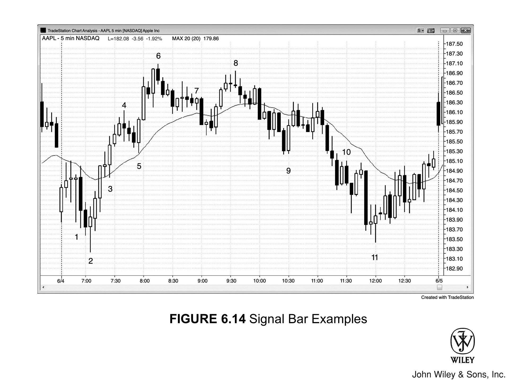

如图 Figure 6.14 所示，Apple (AAPL) 的 5 分钟图表呈现了许多常见的信号 K 线。

*   **Bar 1**
    是一根位于下跌波段底部的锤子十字星，且与当日第一根 K 线形成双底。这种形态会让许多“蜡烛图信徒”跃跃欲试，想要买入。但对价格行为交易者来说，这却是一个糟糕的入场策略（setup）：
    *   它是连续第三根重叠的十字星，意味着在这三根 K 线期间，市场反复上下震荡。这是一个双向交易区，本质上就是交易区间。
    *   每当交易区间紧贴在移动平均线下方时，向下突破的概率往往更高。价格从下方测试均线时，卖盘总是蓄势待发。
    *   况且，这根 K 线的高点与均线之间的空间太过狭窄，连剥头皮（scalp）的利润都挤不出来。

    > *注意：如果你打算在 Bar 1 上方买入，必须留意 K 线的幅度——当时所有 K 线的波幅都相对较大。这无疑增加了交易风险，因为保护性止损的位置部分取决于当前 K 线的大小。为了保持每笔交易的风险恒定，你必须减少交易股数。*

*   **Bar 2**
    相比之下，Bar 2 是一个好得多的反转 K 线入场策略：
    *   它拥有大小适中的多头实体，并且代表了价格跌破昨日低点及创出当日新低后的第二次向上反转尝试（Bar 1 是第一次）。
    *   当天开盘前两根 K 线的多头实体，已经展现了多头的一些潜在力量。
    *   虽然顶部的影线透露出些许疲软，但随后出现的趋势 K 线将这种疲软一扫而空。

- **K线 2 是双 K 线反转的第二根**，同时也处于某个更高时间周期图表上大型双 K 线反转的中间位置。
    - 你总能找到某个周期的图表，显示其前一根或后一根 K 线与之构成了双 K 线反转；若再往上看更高周期，甚至可能发现其前后各两根 K 线共同组成了一个双 K 线反转。
    - 正如所有的双 K 线反转原理一样，在更高周期的图表上，这五根 K 线最终会合并为单根多头反转 K 线。

---

- **K线 3 是一根外包阳线**（实体收阳的外包 K 线）。
    - 此前行情刚刚突破当日新高，紧接着出现了一根暂停 K 线，K线 3 便紧随其后。
    - 对于在小 K 线高点上方买入的策略而言，K线 3 即为入场 K 线。
    - 在新趋势中，外包 K 线往往形成得极快，容易让交易者踏空，从而错失绝佳良机。许多交易者来不及迅速将看空思维扭转为看多，最终只能被迫追涨。

---

- **K线 3 之前是一根十字星**。
    - 尽管市场在突破当日新高后确实可能反转下跌，但这根十字星本身并非强力的做空形态。鉴于多头力量正在积蓄，只有剥头皮交易者和弱势空头才敢在其低点下方做空。
    - 十字星的前一根 K 线收出了当日最大的阳线实体，收盘价位于最高点，且是连续第三根上涨的 K 线。这三根 K 线实体都很饱满，且第二、第三根 K 线与前一根 K 线的重叠部分均未超过一半。
    - 交易者很可能正急于在任何回调中买入，并在十字星的低点下方和高点上方都布下了买入限价单；由于买盘极为强劲，这两组买单在同一根 K 线内全部成交。

- **Bar 4**
    - 创新高，收成一根空头十字星。但此时上涨动能正劲，这根反转 K 线实在太弱，想做空？只能等二次入场。
    - 此前连拉 7 根阳线，这是头一回出现阴线实体。在这种情况下，市场极少一击即反转，很难走远，况且这根信号 K 线收盘价还在中间，没能收在低位。空头连把收盘价压到低位都做不到，指望他们把行情推得很深？不太可能。多头很快就会卷土重来。

- **Bar 5**
    - 又是一根外包阳线，它回踩测试了均线，也测试了开盘区间的突破点。这标志着这波强上涨趋势中的第一次回调宣告结束。

- **Bar 6**
    - 是一根空头反转 K 线，也是二次做空入场点（第一次在两根 K 线前），此时价格已经突破了 Bar 4 的波段高点和昨日高点。
    - 既然 Bar 5 期间空头已经有力气去测试均线，加上多头趋势延伸得更加过度，这回空头应该能把价格压回均线，甚至更低。趋势走到这一步，多头通常得看到更深幅度的回调，才肯再次进场买入。

### **Bar 7**

*   **触发策略**：Bar 7 触发了 ii 做空策略，成为了入场 K 线。此时，预期的背景正是行情将去测试均线。
*   **形态分析**：ii 形态中的两根 K 线均为阴线实体，这提升了做空成功的胜率。
*   **入场细节**：
    *   作为空头入场 K 线，收成阳线实体虽不理想，且随后的 K 线一度突破了它的高点，但价格并未触及 ii 形态中任何一根 K 线的高点——那正是保护性止损的位置。
    *   在窄幅交易区间内交易，必须预留一点回旋余地。
*   **反转逻辑**：这根入场 K 线最终收成了一根小阳线反转 K 线。但这种微小的反转 K 线通常质量不高，尤其是在窄幅交易区间内，根本不应视其为反转 K 线，因为此时“无势可反”。
*   **后续走势**：几根 K 线后，ii 的向下突破反转向上。考虑到该 ii 形态位于日内区间的中部，这种走势早在意料之中。此外，市场也完成了既定目标：两段式下跌并刺穿均线。

---

### **Bar 8**

*   **形态特征**：Bar 8 是一根十字星，位置接近双顶，此时行情已演变为交易区间。
*   **信号评估**：
    *   在强多头趋势中，十字星绝非理想的做空信号 K 线；
    *   但在交易区间内，视具体背景而定，它们尚可作为做空信号 K 线。
*   **结论**：既然市场正在测试区间顶部，且有可能向下测试区间底部，那么这便是一个可以接受的做空信号 K 线。

---

### **Bar 9**

*   **形态形成**：市场创出新的波段低点并测试了 Bar 5 低点后，形成了 Bar 9 这一双 K 线反转形态。
*   **入场位置**：入场点位于这两根 K 线中较高者的高点上方，即 Bar 9 之上。
*   **风险提示**：
    *   但这很冒险，因为当市场从下方反抽均线时，均线处往往潜伏着空头。
    *   此外，这两根 K 线实体很大，迫使买家在距离下跌波段低点过高的位置进场。
*   **操作建议**：既然风险较大，最好放弃这笔交易，耐心等待更强的形态出现。

---

### **Bar 10**

*   **背景环境**：Bar 10 之前是四根空头趋势 K 线，实体饱满、影线短小且重叠极少。
*   **形态定性**：紧随其后的这个双 K 线反转，构成了强空头趋势中的优质做空形态。

**K 线 11** 是第三次向下推进后的多头反转 K 线，意在守住当日低点。空头趋势已旷日持久，途中回调频频，因此测试移动平均线的胜算颇高。既是逆势，在上攻移动平均线的过程中就得容忍回调，切莫过早收紧止损。

### 本图深度解析

如图 6.14 所示，市场开盘跌破移动平均线，但随即突破失败，收出一根强劲的多头反转 K 线。

*   **后续跟进**：第二根 K 线虽有多头实体，但影线很长，且受阻于移动平均线之下。第三根 K 线同样测试均线未果，亦无后续买盘跟进。
*   **多头策略**：此时多头理应考虑平仓观望，因为市场已在移动平均线下方陷入小型窄交易区间，且 K 线波幅巨大、影线突出。
*   **市场背景**：均线下方的窄交易区间通常向下突破，但当时并无可靠的做空策略。相反，交易者应按兵不动，等待更佳良机。
*   **K 线 2**：是一根强劲的多头反转 K 线，借由该窄交易区间的突破失败确立了做多策略，而该区间也随之演变成了最终旗形。

市场一旦突破开盘高点，便极可能走出一波向上的测量移动。

### Bar 2 的价格行为分析

*   **Bar 2 还是一个熊市微型楔形**，并且刺破了连接前三根 K 线底部的趋势通道线。
*   **请注意，Bar 1 之后的那根 K 线底部留有影线**，这意味着买家在该 K 线低点附近入场承接。
    *   空头原本指望价格跌破该低点后能引出卖家，并使收盘价远低于该低点，但事与愿违，买家反而进场了。
    *   这种情况在下一根 K 线上重演，而在 **Bar 2** 上表现得尤为明显。
    *   空头终于将价格压至前一根 K 线低点之下，但多头突然发力，一举反转行情，使收盘价高于开盘价，且收在最高价附近。
*   **虽然微型楔形本身通常不足以引发主要反转**，但在其他因素的合力作用下，此处确立了当天的最低点。

### 三 K 线反转与跨周期原理

*   **Bar 2 与其前后 K 线共同构成了三 K 线反转**，同时也等效为一根 15 分钟图表上的反转 K 线。原理在于：
    1.  前一根 K 线的开盘价即为该 15 分钟 K 线的开盘价；
    2.  后一根 K 线的收盘价即为该 15 分钟 K 线的收盘价，且收盘价高于开盘价。
*   随后的 K 线便会触发 15 分钟级别的做多入场。

### Bar 4 至 Bar 5 的趋势演变

*   **Bar 4 到 Bar 5 的下跌过程中出现了多根重叠 K 线**，这可能构成最终旗形。
*   **Bar 5 及其后那根 K 线均是大实体、小影线**，因此形成了双 K 线买入高潮。
*   **当高潮出现在一段已持续多根 K 线的趋势之后**，市场出现两段式横盘或下跌回调、且持续至少 10 根 K 线的概率随之增加。
*   **下一根 K 线是紧随买入高潮后的熊市孕线**，它可能会演变成单 K 线最终旗形。

### Bar 6 与买入高潮

Bar 6 是 Bar 5 首次回调后的第二段上涨腿（Leg），也是始于 Bar 2 低点的第二段腿，而第二段腿往往意味着反转。同时，它具备多重形态特征：

*   它既是 **低 4（Low 4）**，也是一个 **楔形（Wedge）**，三次推动（Pushes）分别为 Bar 4、Bar 5 后一根 K 线，以及 Bar 6。
*   它还构成了一个 **更大的楔形**，三次推动分别是当日第三根 K 线、Bar 4 和 Bar 6。

多重因素共振下，交易者应预期市场至少会有两段式下跌。此时市场刚经历两次 **买入高潮（Buy Climaxes）**：

1.  第一次是 Bar 5 及其后一根 K 线构成的双 K 线高潮。
2.  第二次是 Bar 6 前一根 K 线。

连续第二次买入高潮通常会引发至少两段式回调（Correction），不仅会刺穿移动平均线，持续时间也往往在一小时以上。

---

### 回调与均线缺口 K 线

随 Bar 6 做空信号而来的 **两段式回调（Two-legged pullback）** 刺穿了均线，并终结于一根 **均线缺口 K 线（Moving Average Gap Bar）**。

*   **市场背景**：由于该形态身处强趋势中，市场大概率会去测试趋势高点。
*   **形态结构**：这也是一个 **楔形牛旗（Wedge Bull Flag）** 买入策略（Setup），第一次向下推动为 Bar 6 前一根 K 线，第二次为 Bar 6 后第三根 K 线。
*   **后续演变**：均线缺口 K 线往往开启趋势的最后一段（Final Leg），随后市场将迎来更深幅的回调，甚至发生反转。

---

### Bar 8 与趋势反转

Bar 8 是均线缺口 K 线后的 **更低高点（Lower High）** 或 **双顶（Double Top）**。由于均线缺口 K 线意味着趋势线已被跌破，Bar 8 构成了潜在的趋势反转点。

*   **交易策略**：此处做空波段交易（Swing）的 **盈亏比（Reward-to-Risk Ratio）** 极佳，空头（Shorts）应持有部分仓位博取波段利润。
*   **形态细节**：它同时也形成了一个 **单 K 线最终旗形（Final Flag）** 反转，以及一个 **微型双顶（Micro Double Top）** 反转——其影线探至前两根 K 线中任一根的顶部。

Bar 9 是一个楔形牛旗（wedge bull flag），包含从 Bar 8 开始的三次向下推进（three pushes down）。

*   但这波下跌处于相对较窄的空头通道（tight bear channel）中，市场可能已反转为空头趋势（bear trend），因此最好观望，等待合理的突破回调买入策略（breakout pullback buy setup）出现。
*   5 根 K 线后出现了一根外包阳线（outside up bar），但无论是在交易区间（trading range）还是空头趋势中，这都不是理想的做多点，买家只能继续等待。
*   Bar 9 还试图与 Bar 5 构筑双底牛旗（double bottom bull flag），此处正是当天早些时候买家入场的价位。
*   最终，Bar 9 标志着始于 Bar 6 高点的大型两段式回调（two-legged correction）终结，因此构成高 2（High 2）做多形态；在 15 分钟图等更高周期的图表上，这很可能是一个清晰的高 2。

***

市场跌破了 Bar 9 楔形牛旗低点，高 2 形态宣告失败，Bar 10 便是此次突破后的突破回调（breakout pullback）；在此之前，Bar 9 之后形成的双顶熊旗（double top bear flag）也已被向下突破。

*   **形态演变**：这波 4 根 K 线的突破构成了向下急速（spike down），随后市场反弹，收盘时回测了 Bar 10 这一通道顶部。Bar 10 的高点与 4 根 K 线后的那根 K 线，共同构成了双顶熊旗（double top bear flag）做空策略（short setup）。
*   **市场原理**：所有突破本质上都是急速（spikes）和高潮（climaxes）。Bar 11 之前的两根 K 线处出现了第二次抛售高潮（sell climax）；连续第二次抛售高潮通常会引发至少两段式回调（two-legged pullback）。
*   **测量移动**：突破急速（breakout spike）往往预示着向下的测量移动（measured move down）。计算方法是：
    1.  取这 4 根 K 线中第一根的开盘价到第四根阴线收盘价之间的 tick 数；
    2.  然后从第一次回调的顶点（即 Bar 10 高点）向下投射。

### Bar 11 的市场背景分析

Bar 11 的形态与 Bar 1 相似。

*   **支撑区域**：早些时候，Bar 1 曾在该价格区域获得买盘支撑，买家或许愿意在此卷土重来。
*   **趋势判断**：鉴于空头趋势线尚未被突破，市场演变为交易区间的概率要高于发生重大反转的概率。
*   **通道形态**：Bar 6 以来的下跌呈通道形态，而空头通道应视为牛旗，因此随后可能很快会出现强劲上涨。
*   **多周期视角**：此外，从 Bar 6 开始的整段下跌是一个复杂的两段式结构，第二条下跌腿始于 Bar 8；若置于更大周期的图表（如 60 分钟图）审视，这可能只是一个简单的两段式回调。
*   **微型形态**：Bar 11 与前一根多头十字星的影线构成了微型双底反转。

---

### Figure 6.15 单 K 线熊旗

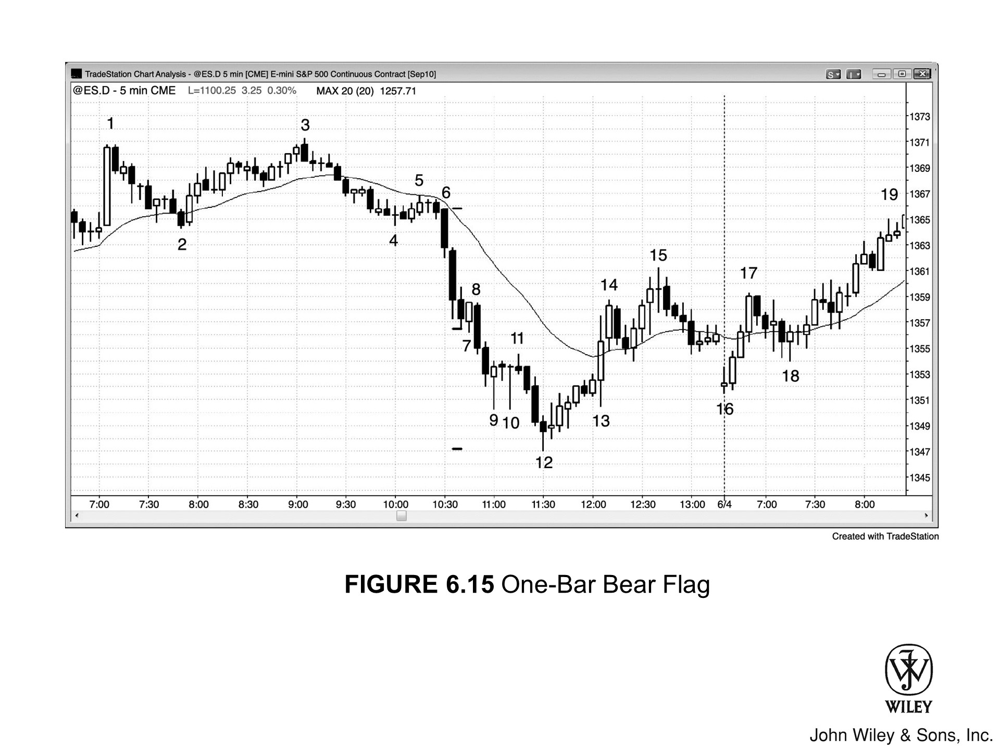

在空头急速行情中，一根多头反转 K 线可构成单 K 线熊旗。在 Figure 6.15 中：

1.  **反转失败**：Bar 8 跌破了强空头趋势中的一根多头反转 K 线（即反转失败）。
2.  **做空机会**：这是绝佳的做空机会，因为过早入场的多头将被套牢，并被迫在该 K 线低点下方抛售。
3.  **多周期形态**：Bar 8 至 14 在更大周期的图表上构成了两 K 线反转，而在周期更长的图表上，则形成了一根单 K 线反转。

---

### 交易逻辑与入场分析

Bar 9 和 10 形成小型双底，Bar 11 是做多入场 K 线。但在强趋势中逆势操作，十字星并非理想的信号 K 线。

*   **市场惯性**：在这波急跌中，此前未见多头回调；鉴于强趋势中的首次回调通常以失败告终，聪明的交易者预期该底部将失效。
*   **做空策略**：他们在亏损多头止损离场的精确位置——即 Bar 11 下方 1 个 tick 处——挂入了做空突破单（Sell Stop Orders）。

十字星即单根 K 线的交易区间。

*   **Bar 9 和 Bar 10：** 是两根大十字星，中间夹着一根小十字星。这三根 K 线在强空头趋势中形成了一个小型横盘交易区间，即熊旗，因此大概率会向下突破。
*   **Bar 11：** 是第二次反弹尝试（第一次在前两根 K 线，但连前一根多头十字星的高点都没过）。因此，多头几乎肯定会在 Bar 11 下方离场，且在市场继续下跌一两根 K 线之前，绝不会再考虑买入。
*   **市场合力：** 随着多头平仓，其卖单与聪明钱（Smart Traders）的卖压形成合力——聪明钱预期这个弱势底部必将破位，因而选择在 Bar 11 下方做空。仅存的买家刚进场即被套，市场短暂转为单边，下跌已成定局。

<?enlrg ??>

### 图表深度解析

*   **Bar 7：** 与前两根大阴线的下影线构成了微型双底（双底低点无须完全平齐）。由于市场处于空头急速（Bear Spike）中，在 Bar 7 双底低点下方做空跌破，是合理的。
*   **Bar 18：** 这有别于 Bar 18 的微型双底（与前两根十字星影线构成），Bar 18 处于四根 K 线多头急速后的回调中，而非空头急速。在 Bar 18 上方买入是合理的（正如第三卷反转章节所述，大多数次要多头反转都始于某种微型双底），但在其下方做空则不可取。
*   **Bar 11：** 与前两根 K 线的高点形成微型双顶，并成为低 2 熊旗卖出信号 K 线。
*   **Bar 15 与 Bar 16：** Bar 15 强势突破了 Figure 6.15 中的空头趋势线，随后 Bar 16 跳空低开，形成更高低点（Higher Low）买入策略，预期将有第二腿上涨（Second Leg Up）。市场虽跌破均线，亦跌破昨日尾盘一小时形成的双底牛旗，但该突破最终失败。

- K线 15 至 16 形成**牛旗**。
- K线 18 是该旗形**突破**后的**突破回调做多**（breakout pullback long）形态。

---

### 市场背景与突破分析

- **K线 6 及其后一根 K线**：均为巨大的**空头趋势K线**，向下**突破**了 K线 2 和 4 构成的**双底**。这些 K线 **实体**巨大且**影线**短小，预示着随后很可能有更多抛售。
- **抛售高潮与反转**：凡是巨大的空头**突破**皆为**抛售高潮**，但这并不代表市场即将**反转**。此次**突破**势头强劲，多头在**抛售高潮**后仅勉强制造了两根 K线 的暂停，便再次被空头碾压。
- **急速与通道**：**突破**既是**高潮**，也是**急速**（Spike）。
    - 当**突破**如此强劲时，通常会先接一个下降**通道**，随后才会形成具备交易价值的底部。
    - 在潜在底部形成前，空头会激进地做空每一次暂停和每一次微小**回调**。

### 测量移动与目标位

底部通常出现在某个**测量移动**目标位。常见的投射方法如下：

1.  **首选目标**：取**突破**前的**交易区间**高度，从顶到底测量并向下投射。
2.  **次选目标**：测量从**突破** K线 的开盘价，到**突破**浪中最后一根强**空头趋势K线**（可能是 K线 7 前一根或再前一根）的收盘价或最低价。
3.  **实际情况**：事实证明，本轮**空头趋势**最终筑底于这样一个**测量移动**目标——取**急速**行情的顶部，至**急速**中第三根（也是最后一根）空头 K线 的最低价，向下投射。

你也应寻找其他可能的**测量移动**投射目标。若市场试图在距离这些磁力点（magnets）几个 tick 的范围内**反转**，这将增加你进场交易的信心。

### 交易警示

- **切勿仅凭测量移动逆势交易**：此类尝试大多会失败，你必须继续寻找其他依据。单凭此点，成功率微乎其微。
- **增加胜率的条件**：若有其他理由支持这笔交易，例如**趋势通道线**的过冲（overshoot）并**反转**，或**最终旗形**的**反转**，成功概率便会显著提升。

强劲的向下急速过后，行情最常演变为某种下降通道，最终会向上测试通道顶部。交易者会顺着通道一路做空，待跌到底部再反手买入，博一波回调，目标直指通道顶。

*   **Bar 8 及其后一根 K 线**：均为大实体空头趋势 K 线，两者重叠极少，构成了第二个抛售高潮。
*   **通常而言**：第二个抛售高潮往往会引发至少持续 10 根 K 线的两段式横盘或上涨；然而，跌向 Bar 9 的走势过于陡峭，导致买家望而却步，卖家却意犹未尽，继续抛售。

---

*   **Bar 11 结束了一个由四根 K 线组成的铁丝网形态**。在漫长的趋势之后，铁丝网往往会演变为最终旗形，本例便是如此。
*   **交易者预期**：一旦价格向下突破这个小型窄幅交易区间，突破大概率会失败，价格随即会被拉回区间之内。因此，即便在 Bar 11 下方做空，交易者也多半只会做剥头皮，而不会持有仓位去博波段下跌。
*   **Bar 11 之后的两根 K 线又是巨大的空头趋势 K 线**，形成了第三个急速。这种形态总是具有双重性质：
    1.  它既是对某种形态（此处为铁丝网，即潜在的最终旗形）的突破；
    2.  同时也是一个高潮。
*   **连续出现三个抛售高潮相当罕见**，因此市场极大概率会迎来至少持续 10 根 K 线的两段式横盘或上涨回调。再加上这是对最终旗形的突破，且已完成测量移动，这种回调发生的可能性就更高了。

尽管底部的信号 K 线 **Bar 12** 是阴线实体，但其收盘价位于中点上方，显示买方已展现一定力度。这也是急速突破后的第三次向下推进（前两次分别是 **Bar 7** 和 **Bar 9**）；急速之后形成的通道，往往终结于第三推。

结合最终旗形、连续第三次抛售高潮、楔形底以及测量移动等背景，这是一个很好的反弹入场策略。其目标如下：

*   **首要目标**：测试 **Bar 11** 高点附近的铁丝网形态顶部，以及测试 EMA。
*   **另一个目标**：走出一段横盘转涨的两段式行情，持续约 10 根 K 线或一小时左右。
*   **最终目标**：测试初始急速后的通道顶部，即 **Bar 7** 阳线的高点。

虽然至 **Bar 15** 的上行包含两段，但主要受限于通道内，因此更可能只是更大级别两段式形态中复杂的第一段（事实确是如此）。第二段上涨始于次日 **Bar 16** 的开盘。

***

### [Figure 6.16] 好的入场策略很常见

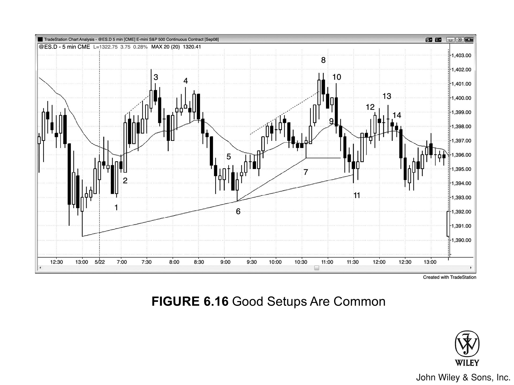

每张图表每天都会出现许多好的入场策略。若你能在形态形成时识别它们的经验越丰富，获利机会就越大。在 **[Figure 6.16]** 中：

*   **Bar 1**：是跌破开盘低点后形成的双 K 线反转买入策略，且相对于昨日低点，它是一个更高的低点。
*   **Bar 2**：之前的那根小阴线反转 K 线测试了 EMA，试图让双 K 线反转形态失败。这一尝试失败了，仅演变为对 **Bar 1** 向上突破后的回调。当市场试图上涨时，在回调上方买入是不错的选择。
*   **Bar 3**：是一根看跌孕线，出现在市场试图向上突破多头趋势通道线和昨日高点之后。这构成了一个做空策略，因为一旦市场跌破其低点，交易者就会认为突破失败，进而预期出现回调。

### Bar 4
*   **形态分析**：Bar 4 是一根十字星，此前已连续出现两根十字星。这种实体极小、且由十字星构成微型楔形顶的 K 线，极少构成可靠的入场策略。
*   **市场心理**：十字星相互重叠，代表多空双向交易，市场充满不确定性。不过，这几根 K 线顶部的三根影线表明，卖压正在积聚。
*   **入场策略**：两根 K 线后出现了二次入场策略，形态为双 K 线反转，做空点设在这两根 K 线中较低那根的下方。
*   **结构意义**：跌破那根空头趋势 K 线入场，同时也意味着跌破了一个微型双底——该双底由这根空头 K 线与两根 K 线前的十字星共同构成。

### Bar 5
*   向上突破 ii 形态失败。

### Bar 6
*   是一根多头反转 K 线，也是测试日内低点时的第二次上涨尝试。

### Bar 7
*   虽是十字星，但带有多头实体，属于强劲上攻后对均线的回调。这也是第二次尝试上涨（第一次是前一根 K 线）。

<?enlrg ??>

### Bar 8
*   **形态与动能**：Bar 8 是一根空头孕线，但此前出现了三根强劲的多头趋势 K 线。由于上涨动能强劲，最好等待二次入场策略出现后再做空。
*   **更高时间周期（HTF）**：
    *   Bar 8 构成了双 K 线反转，且处于更高时间周期图表上双 K 线反转形态的中间。
    *   在那个更高时间周期的反转形态中，多头部分由 Bar 8 之前的三根多头趋势 K 线构成，空头部分则是由结束于 Bar 11 的一系列空头趋势 K 线组成。
    *   有些更高时间周期的图表会包含所有这些 K 线，而另一些则涵盖了这些 K 线期间发生的大部分交易。

- **K 线 9**：是一根多头反转 K 线，但个头比近期的 K 线都要小，因此很难引发成功的上涨。此时最好等待二次入场，但这机会迟迟未到。
    - 反之，市场反转收出一根外包阴线，瞬间套住了在 K 线 9 上方买入的多头。
    - 在 K 线 9 低点下方做空是可以的，因为这能收割那些被迫止损离场的多头。不过，交易者得脑子转得快，看清局势并果断下单。

- **K 线 11**：是个 ioi 形态。此前市场向下跌破了 K 线 7 的摆动低点，K 线 11 便是这一过程中的二次做多入场点。
    - 在交易区间日，市场突破前期摆动点后往往会反转，此时第二信号尤为可靠。
    - 前两根 K 线出现了第一信号，但当时下跌动能太猛，直接买入并非明智之举。

- **K 线 13**：做多风险很高，因为一旦有三根或更多相对较大的 K 线重叠并依托在均线之上，随后的多头突破往往是个陷阱。

***

### 关于此图表的深入探讨

在 [Figure 6.16] 中，市场开盘延续了昨日收盘的涨势，随后回踩均线，构筑了一个均线回调做空形态。然而，鉴于上涨动能强劲，最好别做第一入场做空，而是耐心等待，看是否有二次机会。

市场跌破了当天开盘价，但向下突破创新低失败。这次向上反转可能确立了当天的最低点，它与当天的第一根 K 线构成双底，且是一个更高的低点。

- **K 线 1**：是一个低 2 失败买入形态，昨日收盘前的低点构成了第一段向下推动。

### Bar 2：突破与形态演变

Bar 2 是 Bar 1 上方做多入场的强力跟随 K 线（follow-through bar）。随着低 2 失败，它演变为一根巨大的突破 K 线。

**低 2 失败后通常有两种后续：**
*   要么再向上推进一段，形成楔形熊旗做空策略；
*   要么再推进两段，形成低 4 做空策略。

如果突破强势（如本例），走出低 4 的概率更高。由于急速（Spike）上涨如此强劲，形成上升通道的可能性也很大，该通道呈楔形形态。一旦楔形或通道反转，首要目标便是回测形态起点。

---

### Bar 3：楔形顶与低 4 策略

Bar 3 正是低 2 失败后预期的低 4 做空策略，同时也是两个楔形顶向下反转的入场策略：
*   **较小楔形**：第一段推进是 Bar 2 后一根 K 线，第二段上推则在三根 K 线之后。
*   **较大楔形**：始于当日第二根 K 线，其第二段推进是 Bar 2 后一根 K 线。

这两个楔形随后都应出现至少两段横盘至下跌的腿（legs sideways to down），并回测各自起点。

**对较小楔形起点的回测出现在 Bar 3 之后的第三根 K 线，此次测试包含两个小腿（legs）：**
1.  **第一条下跌腿**：由 Bar 3 后两根 K 线处的十字星（Doji）影线构成。该 K 线反弹并收高。
2.  **第二段向下推进**：紧随其后，出现在下一根 K 线。

这是一个双底牛旗（与 Bar 2 后三根 K 线处的波段低点构成）。当市场回测通道或楔形底部时，这是常见策略。

---

### Bar 6：反转与失败突破

这两个小腿仅是较大楔形顶的第一条下跌腿。Bar 6 具有多重性质：
*   既是第二条腿的终点；
*   也是对该楔形底部回测后的向上反转；
*   同时还是一个 5 tick 的失败突破。

- **Bar 5**
    - **形态定义**：这是一波抛售后的第三根小型横盘 K 线。在一波行情之后，任何横盘形态都可能演变为最终旗形（Final Flag），本例便是如此。
    - **市场动态**：由于这次演变伴随着一次 5 tick 的失败，空头被套，迫使他们在 Bar 6 上方回补空头头寸，从而加剧了买盘压力。
    - **Bar 6 关联**：Bar 6 还与 Bar 1 的低点构成了双底牛旗，引发了预期的反弹。
    - **结构分析**：同时，这也是该楔形牛旗的做多入场策略（Setup）；该楔形的第一次向下推动出现在 Bar 3 之后的第三根 K 线，第二次向下推动则出现在 Bar 5 之前的第三根 K 线。

- **Bar 7**
    - **形态背景**：出现在强劲的上涨行情中，构成了一个楔形牛旗。
    - **推动计数**：第一次向下推动是太平洋标准时间（PST）上午 10 点前的那根 K 线，第二次向下推动则结束于 Bar 7 之前的第二根 K 线。
    - **信号有效性**：尽管十字星（Doji）通常不是可靠的信号 K 线，但若出现在趋势回调或交易区间的强腿（Leg）中，它们依然有效。

- **Bar 8**
    - **K 线特征**：是一根空头趋势孕线。
    - **反转逻辑**：它既标志着交易区间日第二段上涨腿的结束，也是对当日高点的测试——这两个条件通常都会引发反转。
    - **通道位置**：此外，它紧随趋势通道线突破之后，且是多头通道中的第三次上推（Bar 5 为第一次）。

- **Bar 11**
    - **技术计数**：从技术上讲，Bar 11 是一个高 3（High 3），但应预期其表现如同高 2（High 2）。
    - **判断依据**：这是因为 Bar 10 是外包 K 线多头陷阱，应被视为下跌波段的起点（而非 Bar 8 这一实际波段高点）。

***

**[图 6.17] 空头反转 K 线可能演变为牛旗**

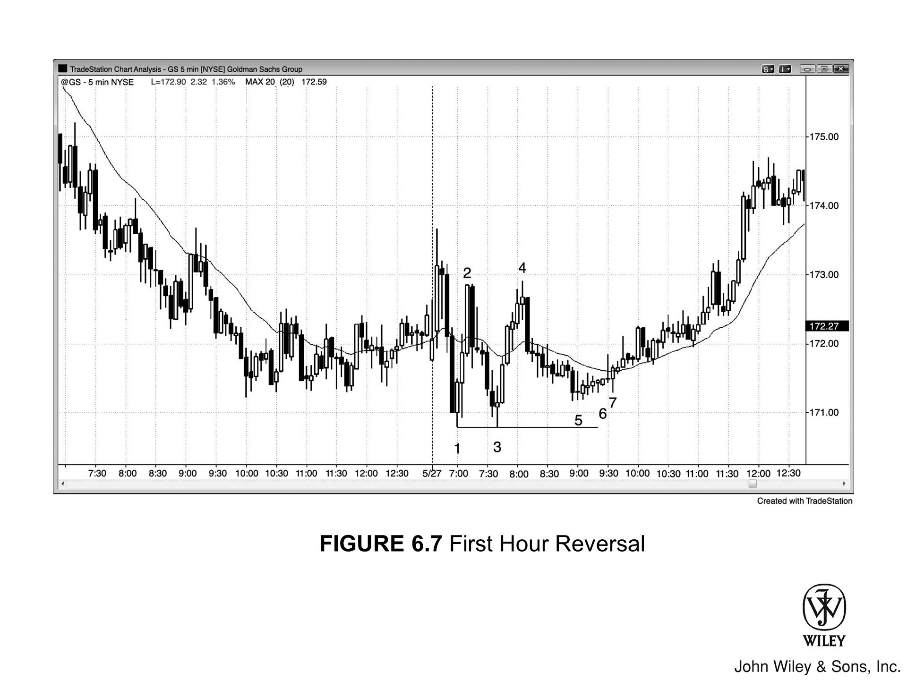

在多头趋势中，单凭一根空头反转 K 线就去做空，理由并不充分，因为它有时反而会演变成牛旗。如图 [Figure 6.17] 所示：

*   **Bar 1：** 后面虽紧跟一根强劲的空头反转 K 线，但此前已连续出现了五根强劲的多头趋势 K 线。鉴于空头此前未显强势，这并非做空良机。
*   **Bar 2：** 唯一值得考虑的只有二次入场，即在 Bar 2 下方做空。然而，Bar 2 是一根十字星，且身处强劲多头趋势之中，四根 K 线大幅重叠。

与其做空，不如静待回调买入。四根 K 线后，均线处出现的双 K 线反转，才是一个优质的入场策略。

***

在多头急速行情中，虽然在空头趋势 K 线上方买入通常胜算颇高，但在此处，无论是突破这根空头趋势 K 线高点买入，还是在随后的多头反转 K 线上方买入，风险都极大：

1.  **Bar 1** 是一根巨大的多头趋势 K 线，又紧随数根多头趋势 K 线之后，因此构成了高潮。买入高潮过后，市场极易陷入横盘或向下回调，风险过高。
2.  观察截至 **Bar 1** 的各 K 线高点，斜率不断陡峭。这种抛物线式的弧度也是高潮特征之一，预示着极大的回调风险。

此时，逢低买入回调，或寻找做空机会，才是更稳妥的策略。

***

**Bar 4** 是一个双 K 线反转。在此之前，价格先是向下突破了两根小十字星，而更早的 **Bar 3** 则向下突破了均线附近一个由七根 K 线组成的水平熊旗。

*   鉴于过去约 15 根 K 线的下跌趋势中回调极小，即便 Bar 4 是一根巨大的外包上行多头趋势 K 线，这也充其量只是个剥头皮做多的机会。

***

**Bar 5** 是一根收盘于高点附近的小型多头反转 K 线，也是过去六根 K 线里的第三次下推，表明买家正开始入场。

*   尽管市场仍受制于过去几小时的空头通道，但这依然是个不错的剥头皮做多策略。

### Bar 6 与 Bar 7 的形态分析与入场策略

**Bar 6 的形态特征**
Bar 6 是一根巨大的空头趋势 K 线，下影线很长，且收盘价回升至 K 线中点上方。
*   这显示出多头力量强劲，足以扭转市场，尤其是在空头趋势末端经历了一波暴跌之后。
*   同时，它也跌破了几条空头趋势通道线（图中未示）。

**二次入场（Second Entry）的逻辑**
鉴于此前连续出现了四根巨大的空头趋势 K 线，做多只能等待“二次入场”（Second Entry），这个机会出现在 Bar 7：
*   **形态：** Bar 7 是一根外包向上 K 线。
*   **结构：** Bar 7 的低点略微抬高（Higher Low），构成了第二腿上涨的起点。

**买入点位比较**
在 Bar 6 高点上方买入尚可，但在阳线（如 Bar 6 之后那根）高点上方买入更好，而最佳策略是等待第二信号。Bar 7 正是这个第二信号，具体操作如下：
1.  **瞬间买入：** 你可以在它形成外包向上形态的瞬间买入——因为它突破了 Bar 6 之后那根强多头 K 线的高点；
2.  **高点买入：** 或者，你也可以选择在 Bar 7 本身的高点上方买入。

***

### **关于此图的深入探讨**

在 Figure 6.17 中，市场跳空高开并收出一根多头趋势 K 线，形成多头急速（Bull Spike）。随后第二根 K 线稍作回调，价格一度下探至第一根 K 线中点下方。这是市场进入抛物线走势前的唯一一次回调，随后行情演变为“缺口急速与通道多头趋势”，同时也是“开盘即多头趋势”。

**抛物线走势的识别**
所谓抛物线走势，是指趋势在已经很强劲的基础上进一步加速。可以通过以下方式观察：
*   若连接前三根 K 线的高点画一条趋势通道线来勾勒趋势斜率，你会发现第四根 K 线向上突破了这条线。
*   若继续沿后续 K 线高点绘制趋势通道线，你会看到线条愈发陡峭，直至在高点处趋于平缓。

这就是抛物线形态，而这种抛物线式上涨属于一种买入高潮（Buy Climax）。

**交易警示**
由于市场仍处于“开盘即多头趋势”之中，**切勿在首次回调时做空**。因为第一次回调后，市场几乎总会在几根 K 线内重新测试高点。

无论上涨动能多强，交易者都得绷紧这根弦：市场随时可能反转，尤其是在开盘第一小时。行情往往会加速冲向某个不起眼的磁铁位（magnet），一旦测试到位，市场就彻底“自由”了，想怎么走都行，包括反转。

> 不管是什么类型的高潮（climax），只要市场开始回调，通常都会走出两段（two legs）结构，而且至少持续 10 根 K 线。

**关于 Bar 3 及其后续走势的分析：**

*   **背景形态**：Bar 3 之前出现过一个持续 7 根 K 线的水平熊旗。当趋势已经延续了 10 根 K 线以上，此时出现的窄幅交易区间往往就是最终旗形（Final Flags）。
*   **交易机会**：这里虽然出现了带有空头信号 K 线的低 2 做空机会，但考虑到最终旗形反转的风险，这笔空单最好只做剥头皮（scalp）。
*   **突破与高潮**：随后，巨大的空头趋势 K 线 bar 3 向下突破了该熊旗，这**总是**意味着急速（Spike）和抛售高潮。
*   **反转预期**：当抛售高潮出现在一段早已过分延伸的趋势之后，往往会失败，进而引发持续约 10 根 K 线的“横盘转涨”两段式回调。
*   **当前判断**：不过，目前的空头趋势中尚未显露明显的强势迹象，所以即便市场尝试反转，最好也只把它当作剥头皮的机会。

**急速之后紧跟着走出了一个楔形熊旗，其构成包括：**

*   bar 3 之后的十字星（doji）；
*   bar 4 之后的外包阳线（outside up bar）；
*   以及两根 K 线之后的小十字星。

**这个形态也可以看作是一个低 2 做空策略：**

*   bar 4 构成了第一段下跌（push down）；
*   而做空点位就在四根 K 线之后那根小的多头孕线（inside bar）下方。

跌至 Bar 6 的这波走势包含四根强劲的空头趋势 K 线，这既是又一个急速（Spike），也是又一次抛售高潮。此外，这还是 Bar 3 急速之后的第三次向下推进。

*   **交易逻辑**：急速后的通道往往在三次推进后终结，但既然下跌动能如此强劲，最好还是等待第二个信号出现再考虑买入，Bar 7 便是如此。
*   **市场原理**：熊市通道本质上就是牛旗，所以一旦市场向上突破该通道，理应出现反弹。
*   **目标位**：通常是测试 Bar 3 急速下跌后的通道起点，不过有时反弹未必能在当天走完，可能会延续至次日。

***

### 图 6.18 弱反转 K 线需要更多理由

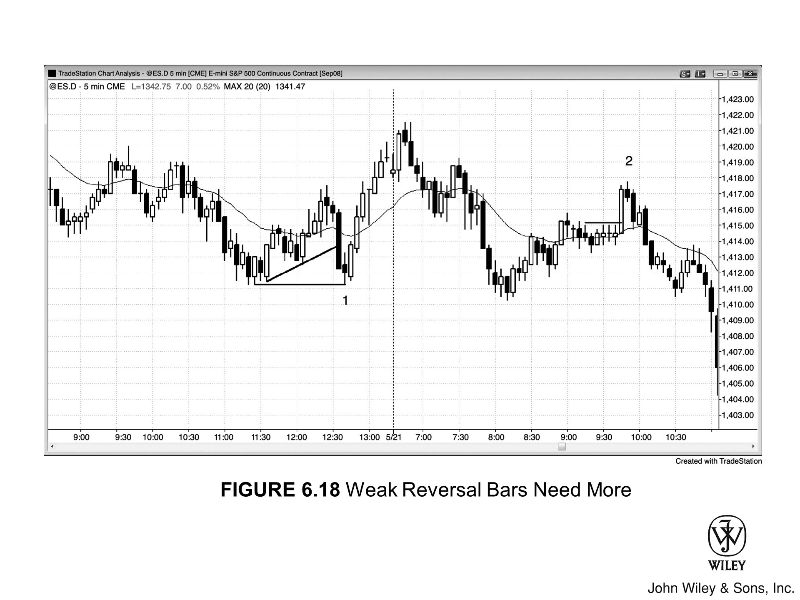

> 当反转 K 线不够强劲时，若能找到额外的交易理由，它仍不失为一个好的入场策略（Setup）。

在 图 6.18 中：

*   **Bar 1**
    *   是一根相对较小的 K 线，紧随在一根突破大型旗形的大空头趋势 K 线之后，这可能是在酝酿该旗形的突破失败。同时，它也精确测试了前期低点。
    *   既然是交易区间日，且 Bar 1 具备这两重反转意味，这便是一个合理的做多策略，尤其是下一根 K 线还构成了双 K 线反转买入策略。
    *   Bar 1 引发的上涨，加上次日跌回同一价格区域的抛售，在更高时间周期的图表上会形成双 K 线反转顶，而在级别更高的时间周期图表上，则是一根单反转 K 线。

*   **Bar 2**
    *   是一根小实体空头反转 K 线，此前是一根突破小型交易区间的大多头趋势 K 线。
    *   作为突破失败的做空信号 K 线，这是可以接受的。

***

**关于此图的深入探讨**

在 图 6.18 中，市场向上突破了昨日高点，但突破失败，随后演变为“开盘即跌的空头趋势日”（Trend from the open bear day）。

Bar 2 是窄交易区间突破失败后的最终旗形（final flag）做空策略。

*   当窄交易区间出现在延续了 10 根或更多 K 线的波段（swing）之后，往往会演变成最终旗形。
*   同时，Bar 2 与早上 7:30（PST）的高点构成了双顶熊旗。请记住，接近即是到位（close is close enough）。
*   随后的空头趋势跌幅巨大，市场收盘时下跌了 30 点。
*   图中并未展示全天走势，因为那样会压缩这根多头趋势 K 线的比例，使其显得平平无奇，无法还原当时的实时视觉冲击。

***

### Figure 6.19 光头光脚 K 线未必有意义

光头光脚形态（Shaved tops and bottoms）并不总是强势信号。当此类 K 线密集出现时，交易者务必警惕，因为这可能意味着交易区间内成交量低迷，而非趋势强劲。

在 Figure 6.19 中：
*   **第一组（标为“s”）：** 四根光头 K 线处于依然强劲的空头趋势中。
*   **第二组：** 市场已进入交易区间，这些形态可能仅仅反映了成交清淡。在此类情形下交易，需格外谨慎。

***

### 关于此图表的深入探讨

如图 Figure 6.19 所示，市场走势如下：

1.  市场跳空高开（gap up）突破昨日高点，但首根 K 线却是空头趋势 K 线，尽显多头颓势。
2.  市场本可向下运行确认突破失败，却反身向上突破，收出一根强劲的多头趋势 K 线。这本有望开启一个强劲的“开盘即趋势”（trend from the open）多头日，谁知紧随其后的竟是一根巨大的空头趋势 K 线。
3.  这形成了一个两 K 线反转（two-bar reversal），构成了突破失败的做空策略，但做空入场点从未被触发，多头依然持仓未动。
4.  随后，市场向上突破了 ii 形态（ii pattern）；然而突破失败，再次形成突破失败做空策略，并可能确立了日内高点。

当几根大波幅 K 线构筑出窄幅横盘交易区间时，追突破极其危险，因为窄幅区间的磁力效应往往会导致突破夭折。

*   市场先是向上试探，继而向下破位，随后踩着均线反弹，又被拉回区间之内。
*   在那波杀向均线的急速下跌之后，紧接着一波回调确立了一个更低的高点，从而演变为双顶熊旗。

这波试图测试日内高点的回调显得动能匮乏：

*   K 线大面积重叠；
*   阴线夹杂其中；
*   且多带影线。

这绝非强多头腿该有的形态。
