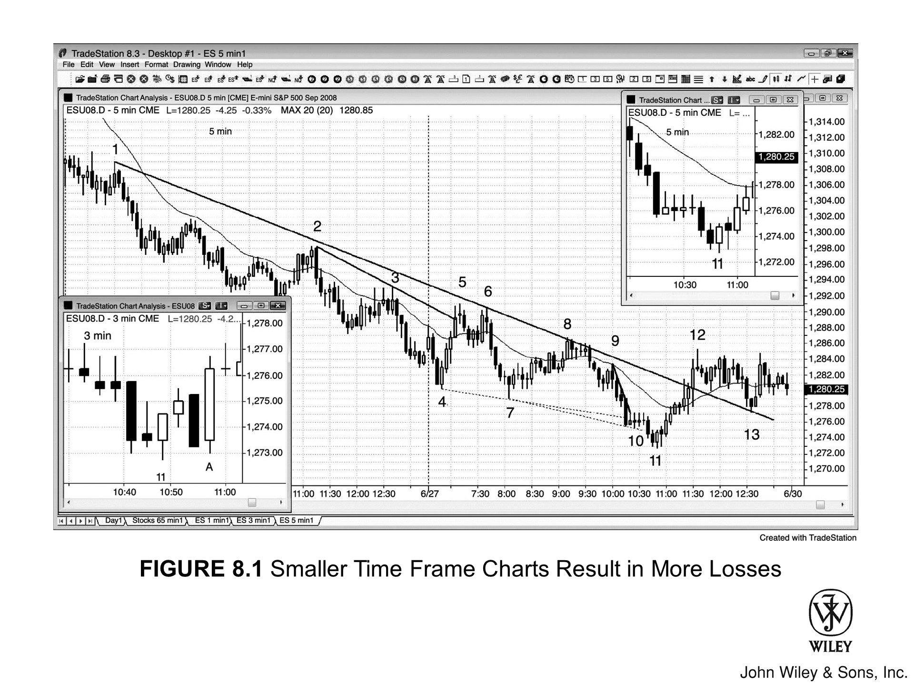

5 分钟 K 线在收盘前，哪怕还有几秒甚至一分多钟，其形态往往已大局初定，与最终模样相差无几。若抢在收盘前入场，偶尔确实能多贪到一个 tick 的利润。

然而，每天总有一两次，你预判的信号会落空，导致大约 8 个 tick 的亏损。这意味着，你需要做对 8 次提前入场，才能填补这一次失败的窟窿，而这根本是不可能的任务。

若身处强趋势且顺势而为，提前抢跑或许无伤大雅。但既然趋势强劲，你对信号理应信心十足，耐心等到 K 线收盘，再在 K 线外侧挂突破单入场，百利而无一害。

*   你不能在每一根 K 线上都纠结是否要“抢跑”，因为交易中还有太多紧要关头需要你决断。若为此分心，你很可能每天都会错失良机。
*   捡了芝麻丢了西瓜，偶尔提前入场赚的那点蝇头小利，远抵不上因错失机会而付出的巨大代价。

这一法则在所有时间周期通用。试看日线图，你会发现许多 K 线低开，却收于中段：

1.  这些 K 线，每一根都曾在盘中某个时刻表现为强劲的多头趋势 K 线，现价直逼最高点。
2.  若你臆测它将光头收盘而在高位追入，结果收盘价却回落至中段，你便会猛然惊觉：自己错了。
3.  此时你手中拿着一笔过夜单，而若是等到收盘定论，这笔交易你压根就不会碰。

在 5 分钟图上，常有两个坑。最要命的，就是在 **强趋势** 里硬要去抄底。

通常，**趋势线** 刚被突破，价格就砸出了新低。这时候，如果再来个 **空头趋势通道线** 的过冲（overshoot），交易者就会眼巴巴地盼着出现一根强劲的 **反转 K 线**。

*   **诱多形态**：K 线走了 3 分钟左右，形态看着挺完美，活脱脱一根强劲的 **多头反转 K 线**。价格在最高点附近悬了好几分钟，引得越来越多的 **逆势** 交易者抢跑入场。他们算盘打得好：早点进，**止损** 就在 K 线底下，风险能小点。
*   **突发崩塌**：谁知就在收盘前最后 1 到 5 秒，价格突然崩塌，直接收在最低价。那些为了省一两个 tick 风险而抢跑的多头，结果反倒亏了 2 个点甚至更多。这笔烂交易，纯粹是自投罗网。

这种戏码每天都要上演好几回，往往就在潜在 **信号 K 线** 即将收盘的那一刻。

*   比如，你正盯着一根 **空头反转 K 线**，打算在它下方做空。眼看离收盘没几秒了，价格也正压在 K 线底部。
*   就在收盘前不到一秒的节骨眼上，价格突然从最低点向上跳了两三个 tick，收盘价没能封在最低位。

市场这是在告诉你：信号变弱了。千万别因为三秒前的那点预期和幻想，一头扎进陷阱里。

另一个常见的问题是：明明是一笔好交易，却被震荡出局（trapped out）。

### 案例分析：被震荡出局的过程

举个例子，假设你刚买入，浮盈已有 3 到 5 个 tick，可市场就是够不着第 6 个 tick，让你没法按计划赚 4 个 tick 剥头皮（scalp out）离场。

1.  **心理波动**：这时，你开始慌了。你盯着 3 分钟或 5 分钟图，眼看这根 K 线还有 10 秒就要收盘，形态却是一根强劲的空头反转 K 线。
2.  **错误操作**：于是，你把保护性止损上移到这根 K 线下方 1 个 tick 处。
3.  **市场陷阱**：就在收盘前一刻，市场下杀打掉你的止损，结果却在最后两秒钟猛地向上反弹了好几个 tick。
4.  **最终结果**：紧接着，下一根 K 线开盘不到 30 秒，市场迅速冲上 6 个 tick。聪明的交易者在那儿部分获利了结，你却只能在场外干瞪眼。

**总结：** 入场很好，计划很好，纪律却很烂。你就这样被震荡出局，把一笔好交易搞砸了。如果你当初照计划行事，坚持用初始止损扛到入场 K 线收盘，这笔利润早就到手了。

---

### 交易技巧：盯住 K 线收盘

关于 K 线收盘，还有一点。要死死盯住每一根 K 线的收盘，特别是入场 K 线及其随后的一两根 K 线。

*   **观察实体变化**：假设入场 K 线高 6 个 tick，你肯定更希望看到它的实体在最后几秒突然拉长，从 2 个 tick 涨到 4 个 tick。这时，你很可能会减少剥头皮离场的合约数量。
*   **后续策略调整**：这一逻辑对接下来的几根 K 线同样适用。如果收盘强劲，相比收盘疲软，你应该更愿意保留更多合约做波段（swing），拿得更久，去博取更大的利润空间。

### 理论基础：机构视角与收盘价

收盘价之所以重要，还有一个原因：许多机构交易者下单是基于“价值”，而非“价格行为”。

*   他们看图时，看的是线图，而线图正是基于收盘价绘制的。
*   如果图表不影响决策，他们根本就不会去看；既然看了，而他们唯一考量的价格又是收盘价，这就进一步增加了收盘价的分量。

小周期图表虽允许止损更窄，但也增加了好单子被扫损出局的风险。如图 8.1 左侧插图所示，看 3 分钟图的交易者不幸被扫损，而依据 5 分钟图操作的交易者则安然无恙。

数周以来，5 分钟 Emini 一直处于强空头趋势，如今回调幅度开始加大。每一个新低（Lower Low）都有买盘承接，逆势做多开始有利可图。多头信心渐增，空头也更乐于落袋为安。左侧缩略图为 3 分钟图，右侧为 5 分钟图特写。

Bar 11 是一根强多头反转 K 线，同时也构成了双 K 线反转。这是在更低低点处的第二次反转尝试（Bar 10 之后的 ii 形态 [连续孕线] 是第一次），也是当天的第三次下推（可能形成楔形底）。

这是一个高胜率做多机会，但止损必须设在其低点下方，距入场价 3 个点。
*   这比 Emini 常规止损要大（近期平均日波幅在 10 到 15 个点，通常 2 个点止损足矣），但这正是当前价格行为（Price Action）所要求的。
*   如果顾虑风险，大可减半仓位，但面对如此强劲的入场策略（Setup），绝不能放过，且应计划半仓做波段（Swing）。

这是一个完美的案例，典型地反映了交易者试图通过盯小周期图来降低风险时的通病：
*   止损虽小，胜率却也随之下降。
*   由于 3 分钟图上信号更多，错过最佳机会的风险反而增加，这往往导致许多交易者操作 3 分钟图的整体收益缩水。

与 5 分钟图如出一辙，3 分钟图也在 bar 11 走出了一根反转 K 线。但变数陡生，入场 K 线下方设置的止损被一根空头趋势 K 线直接打穿——这根 K 线上下均无影线，卖方杀气腾腾。

此时若对比两张图表，处境便极为尴尬：
*   **信号冲突：** 5 分钟图上止损安然无恙，两者信号严重冲突。
*   **心理博弈：** 鉴于 5 分钟图所需的止损空间较大，交易者往往倾向于尽早砍仓认赔。
*   **最终结果：** 倘若交易者同时也盯着 3 分钟图，面对那根凶悍的空头趋势 K 线，几乎难逃亏损离场的命运，最终惨遭震仓出局。

紧接着，3 分钟图上收出一根极强势的外包多头趋势 K 线。多头正以雷霆之势宣告回归，试图确立一个更高的低点。然而，那些刚被扫地出门的“弱手”恐怕早已惊魂未定，哪敢再次入场？他们多半会选择观望，等待回调。

在关键的反转关口，3 分钟图上的扫损（Stop runs）远比 5 分钟图频繁。

*   **精明的交易者：** 对此心知肚明，并将其视为天赐良机。因为这种扫损能将意志不坚定的多头清洗出局，迫使他们在随后行情拉升时不得不苦苦追涨。
*   **交易之道：** 贵在专注一张图表。若同时兼顾两张图，试图理清彼此的矛盾，往往会因行情瞬息万变而反应不及，最终错失下单时机。

### 关于此图的深入探讨

回看 Figure 8.1：
*   **Bar 5：** 向上突破了一条趋势线；
*   **Bar 8：** 对另一条趋势线的突破幅度极小，仅有不到一个 tick。

这两次突破双双失败，构成了顺势做空的形态。
