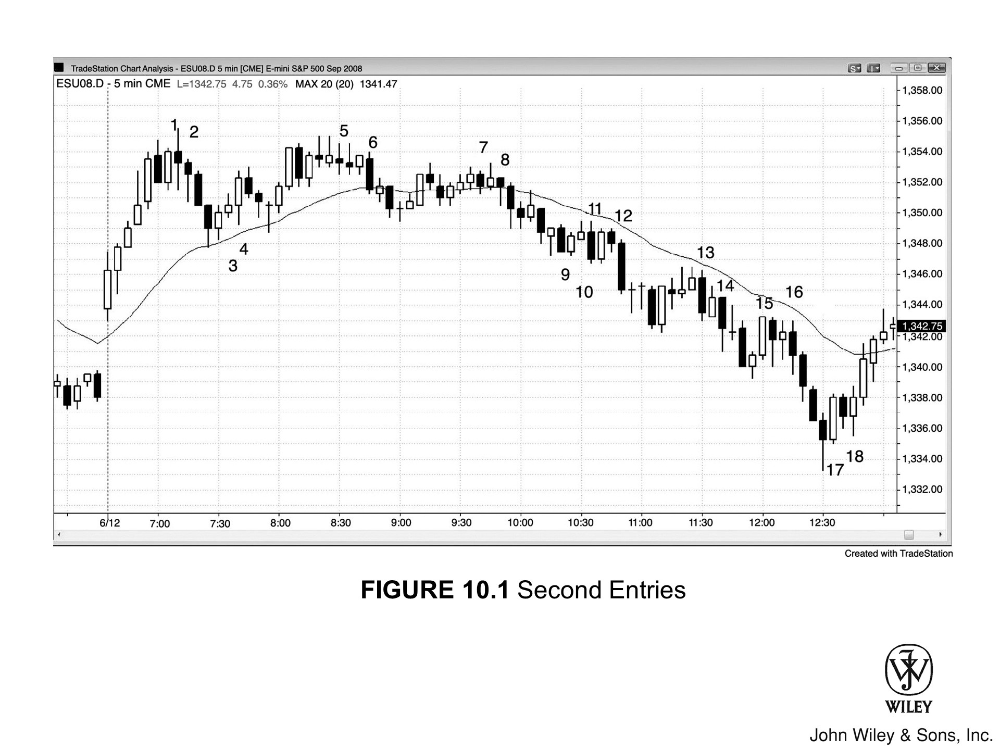

## 理解二次入场点

分析师常说，日线图上的**底部**通常需要经历**二次反转**，才能让足够多的交易者认可，把行情当成潜在的**多头趋势**来交易。**顶部**也是一样。**二次入场点**几乎总是比**第一次入场点**更有可能带来盈利。

### 价格与风险的考量

如果二次入场点的价格比第一次更好，就要提高警惕——这可能是**陷阱**。多数优质的二次入场点，价格跟第一次持平，甚至更差。**等待二次入场的交易者**入场较晚，想靠多等一会儿来降低风险，市场通常会让他们为这份额外信息多付出一些代价。如果市场反而给了更好的价格，说不定正在用**信号失败**来设局坑你。

等待二次入场的交易者往往更主动、更有把握，经常会在低时间级别图表上提前入场。这通常意味着，当5分钟图上的交易者等到二次入场时，早已有大批交易者先行进场，入场价自然会差一些。如果市场让你以更低的成本入场，就该怀疑自己是不是看漏了什么，认真考虑这笔交易还值不值得做。多数时候，**好成交等于坏交易**（**坏成交等于好交易**）。

### 什么时候该等二次入场点

当你**押注失败**（即逆势操作）时，比如在强势**多头趋势**中尝试做空**第一次反转**——如果此前已经出现大约4根连续的**多头趋势K线**，或者两三根大**多头趋势K线**——动能太强，不适合逆势下单。正确做法是：观察第一次入场机会，但不要进场；等趋势再走一两根K线后，在市场**第二次尝试反转**时再入场。

**图10.1：二次入场点**

图10.1当天出现了很多**二次入场交易**，除了一笔之外，其余二次入场点的价格都与**第一次入场点**持平或更差。看**K线10的做多**：市场让你以比K线9买家低1 tick的价格入场。一般来说，**"好成交，坏交易"**这条准则在这里同样适用。只要市场给了看似"便宜"的价格，就先假设自己图看错了——多数情况下，不做才是更好的选择。尽管K线10是**二次入场点**，但从K线8往下的那段窄**空头通道**来看，下行动能仍然很强。做**逆势交易**之前，必须先在前几根K线里看到**多头**有能力突破前一根K线高点不止一两个tick，才算有足够的支撑。

第三册讨论过，多数**顶部**都源于某种**微型双顶**形态，比如K线1与其前两根K线的**空头反转K线**；多数**底部**则源于某种**微型双底**形态，比如K线18与K线17前一根K线。

**图10.2：强势行情中等待二次反转**

动能强时，做**逆势交易**之前最好先等**第二次反转建仓形态**出现（见图10.2）。

### 图10.2中的关键建仓形态

**K线1**前面有5根**多头趋势K线**，上行动能太强，不适合在**第一次向下尝试**时做空。**聪明的交易者**会等着看**多头**能否在**第二次反转上涨**时失败，而**K线2处第二次做空信号**正是这样的结果。

**K线3**是日内新低处的**第一次做多入场点**，但此后6根K线都没有出现**多头收盘**，更合理的做法是等**第二次做多入场点**，即**K线4**。

**K线5**前面有4根**空头趋势K线**，下行动能太强，不适合做多。此后并没有出现**二次入场机会**，等待的交易者因此躲过了一笔亏损。

**K线10**之前有6根带**HL**的K线，且只有2根小**空头实体**K线，多头力量太强，不适合做空。**二次入场点**出现在随后的**K线11空头反转K线**处。

## 对本图的深入分析

### 市场结构与突破

图10.2中，市场在昨日收盘前向上突破了**空头通道**，但**突破**在**均线**处受阻，构成做空形态。当天市场向下突破昨日低点，但第四根K线出现向上**反转**，**突破**随即失败。这次反转可以理解为：第一根K线突破小**空头通道**后，形成了一次**突破回调**，创出**LL**。

市场未能创出**HH**，趋势性**空头通道**继续延伸。交易者本应在**K线6双顶**下方做空——开盘后的趋势尝试以失败告终，因为市场未能突破前一个**LH**，**LH与LL**的趋势仍在延续。

### 做空建仓形态与空头急速段分析

从K线3前一根K线结束的**空头急速段**发起的回调，形成了一个**低4做空建仓形态**，并在太平洋时间9:35以一根**空头趋势K线**触发入场。这次**空头突破**随后演变成**四K线空头急速段**。

**K线5**是**高2**，但它紧跟在4根**空头趋势K线**之后，因此不宜做多。

**K线6**是**四K线空头急速段**的起点。

**K线7的ii形态**可能是一个**最终旗形**。

**K线7**之后出现了**两K线空头急速段**。从**低4做空**以来的下跌通道中，这三段**空头急速段**构成连续的**卖出高潮**——一旦出现三次，至少发生**两段式反弹**的概率就大幅提升。

### 做多入场机会

**最终旗形**和持续**空头趋势**结束后，交易者可以在**K线8反转K线**出现后于**K线9**做多，预期至少有两段上涨。**K线8**构成**微型双底**（**做多建仓形态**）——K线8本身是下跌的，而其前两根K线同样是**空头K线**，方向一致。

**K线10**是**低1**，但多头力量太强，不适合做空，更合理的思路是等待**HL**，或通过**限价单**在前一根K线下方买入。上行动能如此之强，市场很可能至少会**测试**这段上涨腿的高点。

### 买入高潮与最终反转

**K线11**是一根大**多头趋势K线**之后出现的**十字星反转K线**。连续5至10根**多头趋势K线**后出现一根大**多头趋势K线**，构成**买入高潮**，此后大概率会出现10根或更多**横盘**到下跌的K线，之后**多头**才会重新接管。这个位置同时处于**空头趋势**的最终**LH**附近，形成潜在的**双顶熊旗**。多头力量如此之强，多数交易者认为市场会形成**HL**，但他们把**双顶熊旗**当作**止盈**区域。部分空头**剥头皮者**在此做空，预期至少会有一次向**均线**的回测。鉴于这波反弹中**多头趋势K线**如此密集，且买方明显积极，市场形成**HL**的概率相当高。
