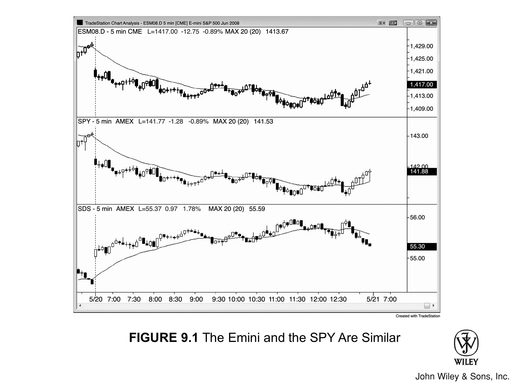
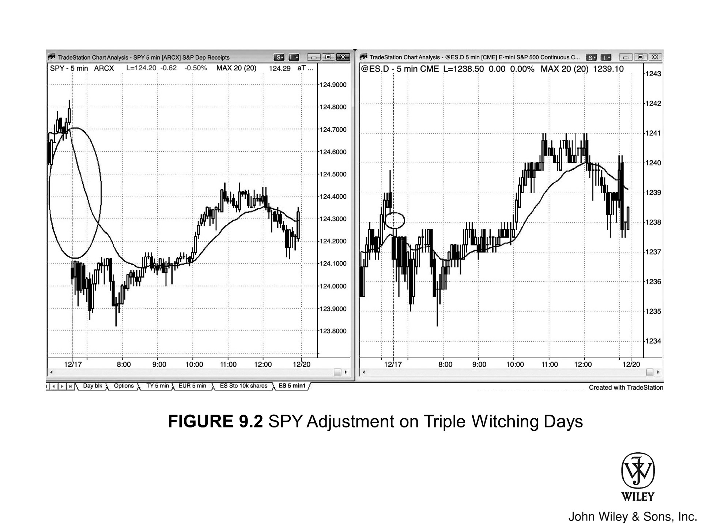

有时，只需微调图表设置，价格行为便会豁然开朗。你可以尝试以下调整：

*   切换为 K 线图或线图；
*   改用基于成交量或 tick 的图表；
*   调整时间周期的大小；
*   甚至干脆把图表打印出来看。

此外，某些交易所交易基金 (ETF) 也能提供帮助。例如，SPDR S&P 500 ETF (SPY) 的走势形态与 Emini 几乎如出一辙，且有时其价格行为反而更为清晰。

### 逆向审视图表

逆向审视图表往往大有裨益。若你看到一个牛旗，却感觉有些不对劲，不妨参考 ProShares UltraShort S&P 500 (SDS)。这是一种基于 SPY 的反向 ETF（两倍杠杆）。观察 SDS，你可能会发现：

1.  **形态差异**：原本在 Emini 和 SPY 上看到的牛旗，在 SDS 上却呈现为圆弧底。
2.  **应对策略**：若果真如此，明智之举是放弃买入 Emini 的旗形，转而静待后续价格行为演变（例如等待突破，若突破失败再行做空）。

有时，其他股指期货（如 Emini Nasdaq-100）或其 ETF (QQQ)，乃至其双倍反向 ETF (QID) 的形态或许更为清晰。但这通常不值得分散精力，最好还是专注于 Emini，偶尔辅以 SDS 即可。

### ETF 的特性与偏差

ETF 既然是基金，基金公司自然以盈利为目的，这意味着它们会从 ETF 中抽取费用。因此，ETF 并不总是能精准锚定对标市场。

*   **偏差示例**：在“三巫日”（Triple witching days），SPY 的开盘缺口往往远大于 Emini，这是 SPY 自身价格调整所致。
*   **实际影响**：尽管如此，SPY 全天走势依然会与 Emini 几乎逐 tick 同步，交易者无须顾虑此类偏差。

**[Figure 9.1]** Emini 与 SPY 走势相近

如图 9.1 所示，上方的 Emini 图表与中间的 SPY 图表走势基本一致。

*   不过，SPY 的 **价格行为** 有时读起来更轻松，因为它的 tick 值更小，形态往往显得更清晰。
*   下方图表则是 SDS，这是一种与 SPY 走势相反的 ETF（两倍杠杆）。有时候，参考一下 SDS 图表，会让你对 Emini 的盘面解读产生新的看法。

***

**图 9.2 三巫日的 SPY 价格调整**

如图 9.2 所示，每逢“三巫日”（Triple Witching Days），SPY 的价格都会进行调整。

*   这通常会造成开盘出现 **缺口**，且幅度往往比 Emini 大得多（左图为 SPY，右图为 Emini）。
*   不过，开盘之后，两者的走势几乎就是 tick 级同步，与平日无异。
*   因此，不必对这个 **缺口** 过分担忧，待行情展开，专注于当下的 **价格行为** 交易即可。
