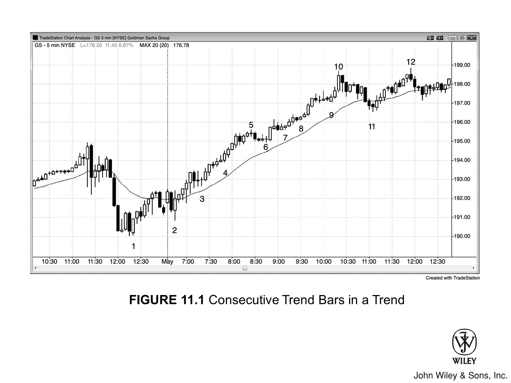

## 迟入场策略导论

看任何一张图表，如果你判断当初只要入了场、现在手里应该还留着**波段**仓位，那就直接按市价入场。市场有清晰的 **Always In** 方向，你需要参与这波趋势——赚钱的概率很高。

但入场的手数或合约数，只能等于你当初入场后到现在还会持有的量，止损也要沿用同一套**跟踪止损**逻辑。由于此时止损距离通常比**剥头皮**更大，要相应缩减仓位，把美元风险控制在同一水平。

### 仓位规模示例

比如你看到 GS 正在走一波强趋势，假设当初以 300 股入场，到现在只会剩 100 股、**保护性止损**挂在 1.5 美元的位置——那你现在就该按市价买入 100 股，挂 1.5 美元的保护性止损。

从逻辑上讲，现在买入**波段规模的仓位**，和当初入场后一路持有到现在，没有任何区别。有人觉得带着浮盈的仓位是在拿"别人的钱"冒险，情感上或许更好受，但事实并非如此。那是你自己的钱，你承担的风险和现在入场、挂同样 1.5 美元的止损完全一样。

明白这一点的交易员会毫不犹豫地入场。如果做不到，要么是他们根本不相信自己当初进了场、现在还会留有仓位，要么就是这个情绪问题需要下功夫去解决。

## 连续趋势K线的分析

**图 11.1** - 趋势中的连续趋势K线

一旦市场开始出现连续 4 根以上、幅度又不算过大（因此不太可能属于**高潮**性质）的**多头趋势K线**，交易员就应该至少按市价买入一小部分仓位，而不是继续等**回调**。

### GS 图表的建仓形态

如图 11.1 所示，GS 昨天尾盘经历了一波强劲的两段式**下跌**，但 2 号K线出现了强势的**多头反转K线**。这里正在形成一个**更高低点对空头低点的测试**，以及一个**多头趋势日**的建仓形态。

如果交易员大约在 4 号K线才开始关注这张图，他们会看到一系列多头趋势K线和一波强劲的多头趋势。这时他们多半会后悔，觉得自己至少应该还留着波段仓位才对。

### 迟入场的执行方式

如果他们平时交易 300 股，而当初若在 3 号K线上方入场、到现在只会剩 100 股，那就应该按市价买入 100 股，止损也和当初在 3 号K线上方入场时一样。

由于只剩波段仓位，止损应设在**盈亏平衡点**，或大约放在 3 号K线高点下方 10 美分处。同时也要留意**暂停K线和回调**，见机加仓。在 6 号K线上方加仓后，可以把整体仓位的止损移到 **6 号信号K线**下方一个 Tick，之后随行情继续跟踪上移。

### 核心原则

迟入场、沿用原始止损，与持有原始仓位的**波段**部分、挂着同一个**保护性止损**，在本质上完全相同。

## 深入解读本图

### 逐K线分析

图 11.1 的第一根K线突破了前一收盘的**波段高点**，在均线附近构成了小型**双顶熊旗**的做空建仓形态。但从 1 号K线开始形成的这个熊旗，第二次向下突破的尝试失败了。

**2 号K线**强势向上反转，形成**两K线反转**。下一根是**多头内包K线**，是做多**始于开盘的趋势**的良好**信号K线**，同时也是从昨天最后四根K线构成的小型**双底**跌破处反转上来。

### 趋势线与缺口分析

回调至 11 号K线的**均线缺口K线**跌破了**多头趋势线**，后续应该会出现对多头高点的 **HH 测试或 LH 测试**，之后市场通常会形成更大或更复杂的回调。

但到 10 号K线为止的这波上涨处在极窄的通道中，说明多头力量异常强劲。这整段上涨在**高时间周期**图表上很可能只是一段**急速**行情，后续大概率会在那张图上接续一段**向上的通道**，然后 5 分钟图才会出现像样的回调。

另外，11 号K线这根均线缺口K线同时也是一根 **EMA 20 缺口K线回调**。在 EMA 20 缺口K线回调之后出现第一个新高，市场通常会再次回调、然后重新测试高点——因此这根均线缺口K线的作用更接近 **EMA 20 缺口K线建仓形态**，而不是普通的均线缺口K线建仓形态。
