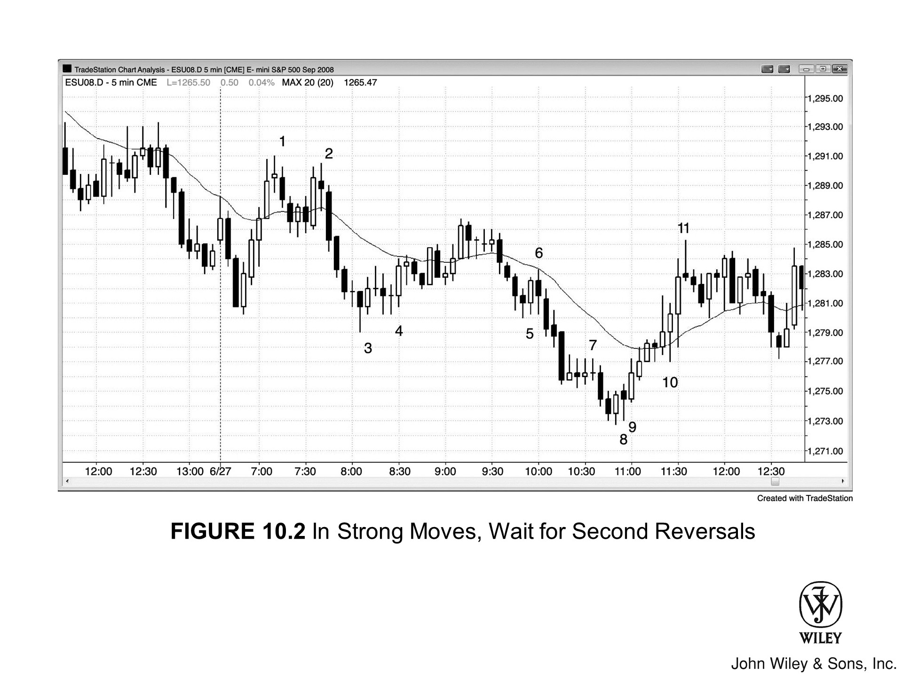

只要动能强劲，最好等第二次反转策略（Setup）出现再逆势进场（见 [Figure 10.2]）。

*   **Bar 1 与 Bar 2**
    Bar 1 跟在 5 根多头趋势 K 线后面，上涨动能太强，第一次向下试探时绝非做空良机。聪明的交易者会耐心等待，看多头第二次尝试反弹会不会失败，然后再进场做空——Bar 2 出现的第二次做空入场，正是这种情况。

*   **Bar 3 与 Bar 4**
    Bar 3 虽然创了当日新低，是第一次做多机会，但前面连着 6 根 K 线都没收出阳线（多头收盘），这时候还是等第二次做多入场更明智，也就是后来的 Bar 4。

*   **Bar 5**
    Bar 5 跟在 4 根空头趋势 K 线后面，下跌动能太猛，不宜买入。后来第二次入场一直没出现，聪明的交易者因为愿意等待，成功躲过一劫。

Bar 10 之前的 6 根 K 线低点持续抬升，且仅有两根是小实体阴线。这显示多头势头过强，不宜做空。Bar 11 是空头反转 K 线，提供了第二次入场机会。

### 本图深度解析

如图 Figure 10.2 所示，市场在昨日收盘前向上突破空头通道，但在均线处受阻失败，形成做空形态。今日市场跌破昨日低点，但随着第 4 根 K 线反转向上，该突破宣告失败。这次反转可视为一次创新低的“突破回调”，其背景是当日第 1 根 K 线向上突破了小型空头通道。

市场未能创出更高高点，反倒是趋势性空头通道得以延续。交易者理应在 Bar 6 双顶下方做空，因为市场未能突破前一个更低的高点，“开盘趋势”尝试宣告失败。高低点逐步下移的趋势仍在继续。

以下是关键 K 线的详细演变：

*   **Bar 3 相关：** Bar 3 前一根 K 线结束了一波空头急速，随后的回调形成“低 4”做空策略，并于太平洋标准时间 (PST) 上午 9:35 被一根空头趋势 K 线触发。此次空头突破随后演变为一波 4 根 K 线的空头急速。
*   **Bar 5：** 是“高 2”形态，但因紧随 4 根空头趋势 K 线之后，故不宜买入。
*   **Bar 6：** 开启了一波 4 根 K 线的空头急速。
*   **Bar 7：** 是 ii 形态，可能是最终旗形。Bar 7 引发了两根 K 线的空头急速。在自该“低 4”做空点起始的下跌通道中，这三个空头急速构成了连续的抛售高潮。一旦出现三个高潮，市场出现至少两段式反弹的概率极高。
*   **Bar 8 与 Bar 9：** 交易者可在 Bar 8 反转 K 线之后，于 Bar 9 做多，预期在最终旗形和持续已久的空头趋势之后，至少会有两段上涨。Bar 8 是微型双底（买入策略），因为市场在 Bar 8 处下探，且两根 K 线之前也曾下探（当时为一根空头 K 线）。

### Bar 10 分析
*   **市场状态**：Bar 10 虽是低 1（Low 1），但多头气势太盛，做空显然不是好主意。
*   **交易逻辑**：更合理的逻辑是寻找更高低点买入，甚至直接在前一根 K 线下方挂限价单接货。
*   **后续预期**：既然上涨动能如此充沛，市场极大概率至少会去测试这波上涨腿的高点。

### Bar 11 分析
*   **K 线形态**：Bar 11 紧随一根大号多头趋势 K 线之后，收成了一根十字星反转 K 线。
*   **购买高潮（Buy Climax）**：若在连续 5 到 10 根多头趋势 K 线后，再拉出一根大阳线，这往往属于购买高潮。随后市场很可能进入横盘或下跌，调整约 10 根 K 线甚至更久，多头才会卷土重来。

### 市场背景与交易心理
*   **潜在形态**：该位置恰好处于此前空头趋势最后一个更低高点的区域，这就构成了潜在的双顶熊旗。
*   **交易者博弈**：
    *   **多头**：鉴于多头势头正劲，大多数交易者都认定市场会走出更高低点，但面对这个双顶熊旗，他们还是选择在此获利了结。
    *   **空头**：一些做空的剥头皮者也在此入场，博的就是行情至少回踩测试移动平均线。
*   **结论**：毕竟这波拉升包含如此密集的多头趋势 K 线，买方攻势显而易见，市场形成更高低点是大概率事件。
