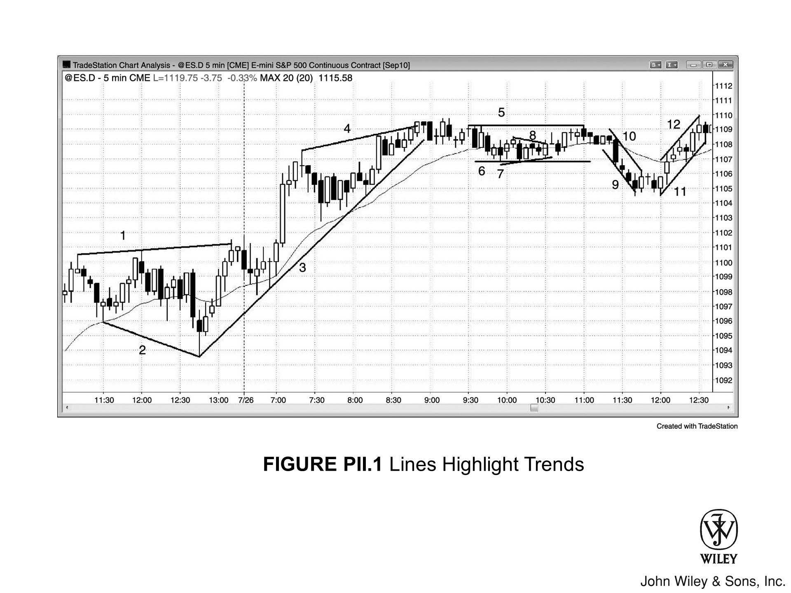

## 概述

很多交易员把所有线都叫做**趋势线**，但区分几种子类型对实际操作更有帮助。**趋势线**和**趋势通道线**都是包含价格行为的对角直线，分别位于通道的两侧。

**多头趋势**中，**趋势线**在低点下方，**趋势通道线**在高点上方。**空头趋势**中，**趋势线**在高点上方，**趋势通道线**在低点下方。

构成通道的两条线通常**平行**或大致平行，但有两种例外：
- 楔形和大多数三角形中，两线**收敛**
- 扩张三角形中，两线**发散**

**趋势线**最常用来寻找顺势交易的**建仓形态**，**趋势通道线**则主要用于发现可交易的**逆势**机会。曲线和带状指标主观性太强，快速下单时要考虑的东西太多，不实用。

## 交易区间与通道类型

通道可以向**上**、向**下**，也可以**横盘**（即**交易区间**）。横盘时，两条线变为水平线：
- 上方的线是**阻力**线
- 下方的线是**支撑**线

一些股票交易员把**阻力**线理解为派发区，也就是交易员卖出多头的地方；把**支撑**线理解为吸筹区，也就是交易员加仓多头的地方。但现在机构做空和做多的力度不相上下：
- **阻力**线同样可能是机构建立新空头的地方
- **支撑**线同样可能是机构平仓或派发空头的地方

## 图 PII.1：划线凸显趋势

在图表上画线，可以把价格行为的结构凸显出来，让建仓和管理交易都更简单（见图 PII.1）。

### 各线说明

**线 1** 是扩张三角形上方的**趋势通道线**，**线 2** 是扩张三角形下方的**趋势通道线**。由于通道在扩张，市场没有趋势，也就没有**趋势线**。

**线 3** 是**多头趋势**中位于K线下方的**趋势线**，同时也是**支撑**线；**线 10** 是**空头趋势**中位于高点上方的**趋势线**，同时也是**阻力**线。

**线 4** 是**多头趋势**中的**趋势通道线**，位于高点上方；**线 9** 是**空头趋势**中的**趋势通道线**，位于低点下方。

**线 5** 和**线 6** 是**交易区间**（即横盘通道）中的水平线：
- **线 5** 在高点上方，是**阻力**线
- **线 6** 在低点下方，是**支撑**线

**线 3** 和**线 4** 构成的通道**收敛且上升**，因此是一个**楔形**。

**线 7** 和**线 8** 是小型对称三角形中的**趋势线**，构成一个**收敛通道**。对称三角形内部同时存在小**空头趋势**和小**多头趋势**，所以通道由两条**趋势线**构成，没有**趋势通道线**。**收敛三角形**还可以细分为对称、上升和下降三种类型，但交易方式完全相同，这些名称实际上用不上。

## 图表深度解读

图 PII.1 中，当日第一根K线突破了前一日高点，但**突破**随即失败。前一日最后六根K线都是**多头趋势K线**，所以此时只能考虑做空的**二次入场点**，但没有出现合理的信号。

开盘后前七根K线构成了一个小**交易区间**，市场处于**突破模式**。此时交易员的操作是：
- 在开盘区间高点上方一个 tick 挂**买入突破单**
- 在开盘区间低点下方一个 tick **做空**

市场随后向上突破，最小目标是向上的**测量移动**，幅度等于扩张三角形的高度。
