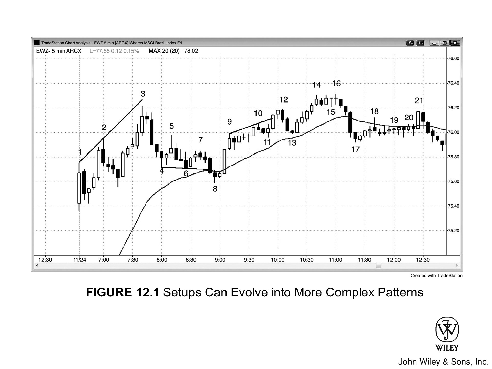
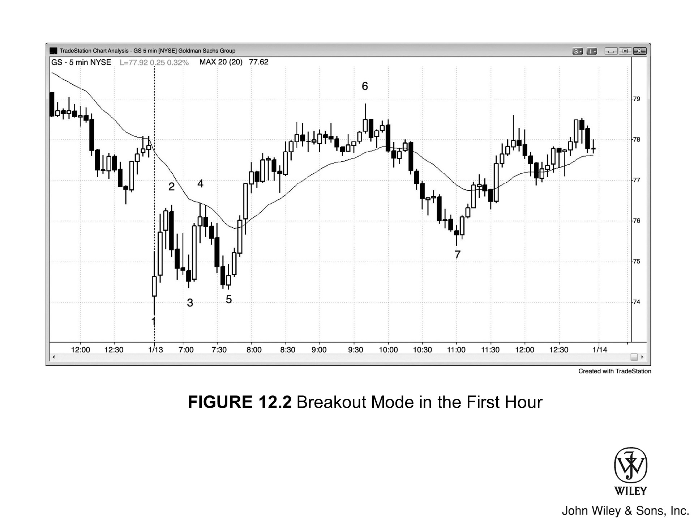

永远要记住，眼下的这根 K 线，随时可能引爆一波大行情，方向或涨或跌。随着价格行为逐步展开，你必须盯紧盘面，看原有的形态是否正在变异，进而酝酿出反向的交易机会。

形态往往会变形，要么化作另一种形态，要么演变成更大的级别。无论哪种情况，都可能带来同向延续或反向转折的交易机会。

*   多数情况下，只要你对价格行为解读无误，原始形态至少能让你赚到一笔剥头皮的利润。同理，演变后的大形态也是一样。
*   至于你把这个大形态看作原始形态的扩展版，还是别的什么，根本无关紧要。叫什么名字从来都不重要。
*   关键在于读懂眼前的盘面并果断下单，至于几根 K 线前那个已经走完的形态，忘掉它吧。

***

形态变形最典型的例子就是“失败”：形态没能走出剥头皮的利润，反而掉头反转，给出了反方向的信号。

*   这会让做错方向的交易者被套牢。当这些人被迫止损离场时，他们的单子就成了“燃料”，推动市场向反方向至少再走出一个剥头皮的利润。
*   任何形态都可能发生这种情况，毕竟，凡是形态皆有失败的可能。

如果形态失败后，行情只是横盘整理了若干根 K 线，随后才形成新形态，那么更合理的逻辑是：

1.  把新形态看作完全独立的个体。
2.  直接忽略第一个形态吧，因为这时候场内已经没剩多少被套的交易者了，也就指望不上他们止损离场来推动行情了。

此时此刻，你不必强求熟记书中所有形态。到了后续章节，你会看到形态演变的种种常态：

*   **扩散三角形：** 有时会“生长”，从 5 条腿扩充到 7 条腿。
*   **微型趋势线：** 其突破往往以失败告终，随即演变为突破回调。
*   **最终熊旗：** 一旦未能扭转市况，通常会变形为突破回调卖出策略。随后，它往往扩张成楔形反转策略，或是演变为更大的交易区间，进而构筑出更大级别的最终旗形。
*   **多头急速转通道：** 这种趋势形态通常先转化为交易区间，再演变成双底牛旗。
*   **开盘首小时：** 双顶熊旗常摇身一变成为双底牛旗，反之亦然。

若你风格激进，正参与该市场的博弈，那么这两个入场机会都不应放过，且应保留部分仓位做波段。因为无论哪一个形态，其后往往都蕴藏着大行情。

Figure 12.1 入场策略可演变为更复杂的形态

即便是可靠的形态，也有约 40% 的时候会失效。失效后，它们往往演化为更大的形态，并在多空任一方向酝酿出入场机会。Figure 12.1 展示的是 iShares MSCI 巴西指数基金（代码：EWZ）的 5 分钟图表：

*   **K线 2：** 下方的低 2 做空策略宣告失败，但形态随即演变为更大的楔形顶，入场点位于紧随 K线 3 之后的 K线下方。
*   **K线 19：** 处的低 2 熊旗，演化成了更为复杂的低 2 做空策略，入场点位于 K线 21 形成的双 K 线反转下方。其中，K线 18 是第一段向上推动。

### 图表深度解析

在 Figure 12.1 中，K线 6 之后的高 2 形态演变为楔形牛旗，入场点位于均线处的 K线 8 上方。这同时也是一个空头急速转通道形态。K线 8 是通道内的第三次向下推动，这通常意味着通道走向终结。

- 鉴于 **Bar 9** 之前的急速（Spike）上涨势头强劲，**Bar 10** 处的低2（Low 2）很可能会失败。低1入场点位于 **Bar 10** 之前的两根 K 线处。到了 **Bar 11**，该形态演变为“低2失败”的买入信号，随后在 **Bar 12** 形成急速转通道（Spike and Channel）的顶部；通道在此处止步于第三次上推，这是常见现象。

- **Bar 15** 的高2（High 2）宣告失败，形态演变为在当日新高处的第二次向下反转尝试。入场点位于紧随 **Bar 15** 之后的那根高2入场 K 线下方。

**Figure 12.2 开盘首小时的突破模式**

开盘首小时内，往往会同时出现双顶和双底，致使市场进入突破模式（Breakout Mode）。

在 Figure 12.2 中，GS 的双顶演变成了双底牛旗。此形态颇为常见，你应当把握这两个入场机会（**Bar 4** 下方做空，随后 **Bar 5** 上方做多），并留出部分仓位做波段（Swing）。因为无论是第一个还是第二个形态，其后往往紧接着大幅波动。

请记住，当日极值之一通常会在首小时内形成，这意味着在随后数小时的大部分时间里，市场通常会远离该价位；若当日演变为趋势日，这种偏离可能会持续整天。此例中的具体走势如下：

*   **GS** 大幅跳空低开，跌破了昨日的趋势通道线，但在当日首根 K 线即反转向上。
*   市场在 **Bar 4** 处下行的移动平均线附近形成低2和双顶熊旗，结果却在 **Bar 5** 的双底牛旗处反转向上。
*   随后市场一口气上冲 **3 美元**，直抵 **Bar 6** 的当日高点。

### 关于此图表的深入探讨

大幅跳空开盘往往演变为趋势日，方向或涨或跌。如图 12.2 所示：

*   **多头强势启动**：前三根 K 线强劲上扬，预示多头趋势的可能性更大，尤其是行情刚从昨日空头趋势通道的过冲（overshoot）中反转向上之后。
*   **空头尝试反击**：空头试图在均线处恢复跌势，但当市场下探至 Bar 5 时，在 Bar 3 低点附近再次遭遇强劲多头。
*   **二次筑底成功**：Bar 4 制造空头趋势日的第二次尝试宣告失败；随着 Bar 5 二次筑底成功，市场随即展开了一个多头通道。

***

市场出现了上攻至 Bar 2 和 Bar 4 的多头急速（bull spikes），以及下杀至 Bar 3 和 Bar 5 的空头急速（bear spikes）。这种情形往往导致交易区间，因为多空双方都在持续博弈，试图构建有利于自己的通道。

在此，市场从 Bar 5 开始形成了一波极强的五根 K 线多头急速，随后走出一段上行至 Bar 6 的三推通道。对此，交易者往往有两种解读：

1.  **解读一**：认为上涨至 Bar 2 是急速，随后至 Bar 5 的交易区间是回调（pullback），正是这波回调引出了通往 Bar 6 的通道。
2.  **解读二**：认为从 Bar 5 开始的这波急速才是当天的主旋律，多头通道始于这波五根 K 线的急速结束之时。

这没有标准答案，两种解读均成立。**关键在于要看出，Bar 1 和 Bar 5 启动的多头急速强于 Bar 2 和 Bar 4 引发的空头急速，因此，形成多头通道的概率更大。**

***

这本可能是一个“开盘即趋势”的多头趋势日，但最终演变成了一个“趋势型交易区间日”。Bar 7 向下测试了下方交易区间，随后反转向上直至收盘，收于上方交易区间的高点附近。
