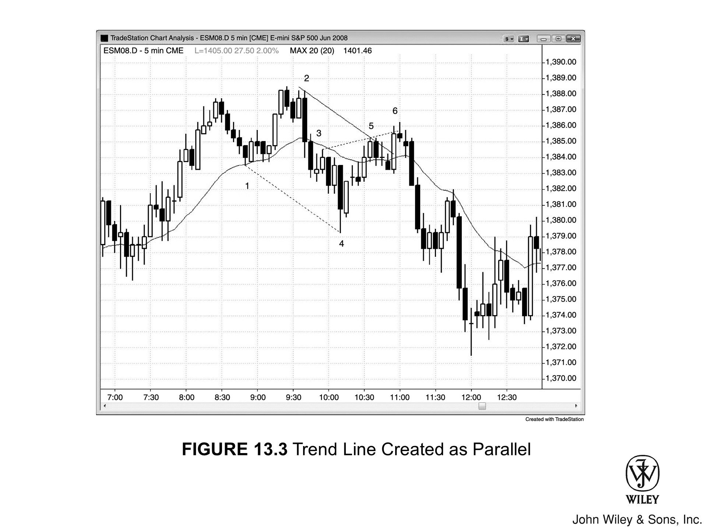
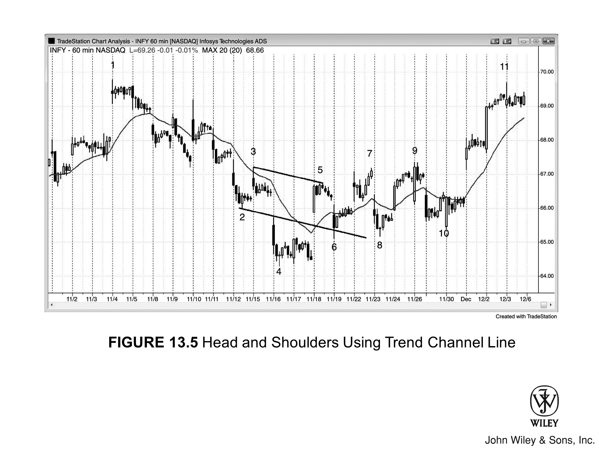
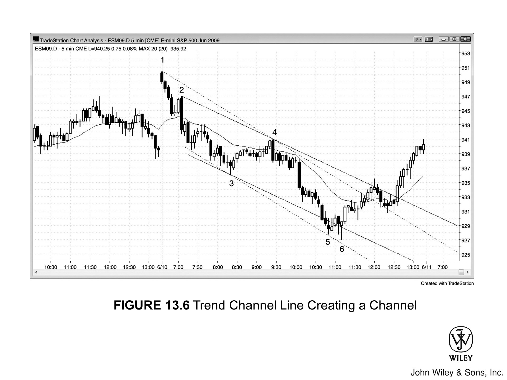
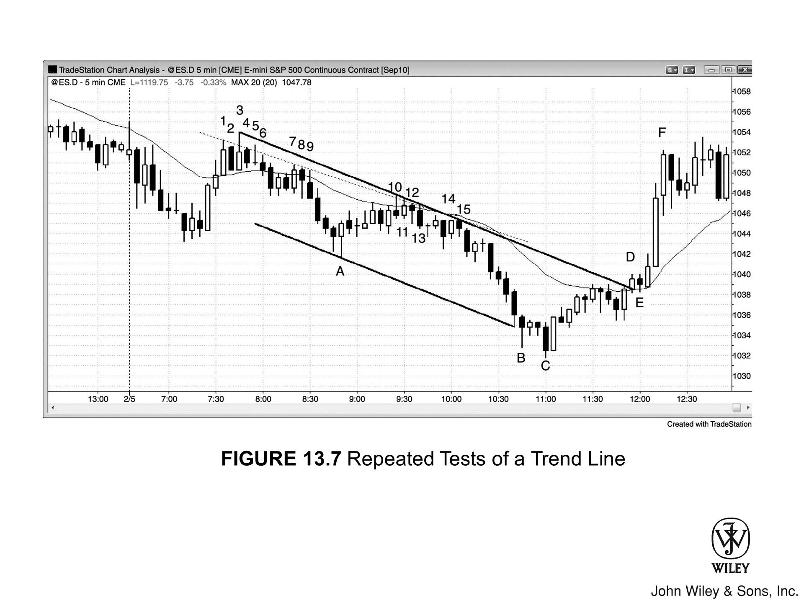

## 概述

**多头趋势线**沿多头趋势的低点绘制，**空头趋势线**沿空头趋势的高点绘制。**趋势线**最主要的用途有两个：一是趋势线未被突破时，在**回调**中寻找顺势入场机会；二是趋势线被突破后，寻找反向入场机会。

趋势线可以用**波段点**来画，也可以借助线性回归等最优拟合方法，或者直接目测画一条近似线。还有一种做法是先画出**趋势通道线**，再将其平移到K线趋势线一侧——但这种方法几乎用不到，因为通常用**波段点**就能直接画出一条合用的趋势线。

有时候，最优拟合趋势线只取K线实体来画，忽略**影线**。楔形形态常用这种方法，因为此类形态往往没有标准的楔形轮廓。当趋势线位置一目了然时，不画出来也无妨。如果画了，通常在确认市场已经测试过该线之后就可以擦掉，因为图表上线条太多反而分散注意力。

## 用趋势线交易

一旦趋势通过一系列趋势性高低点得以确立，在**趋势线**被突破之前，顺势交易的胜算最高。每当市场回调至趋势线附近——无论**不及**还是**过冲**——都要留意趋势线附近能否形成**反转**，再顺势入场。

即便趋势线已被突破，只要此前维持了几十根K线，极端价格被回测的概率依然很高。回测之后，趋势可能延续，可能反转，也可能进入**交易区间**。

**趋势线被突破**最重要的含义是：市场不再由单边（买方或卖方）主导，**双向交易**的概率大幅上升。每次趋势线被突破后，都会形成新的**波段点**，可以据此画一条新的趋势线。一般而言，后续每条趋势线的斜率都愈发平缓，说明趋势动能在减弱。到某个节点，反向趋势线变得更为重要，市场主导权也从空头转向多头，或反之。

## 反复测试与突破

如果市场在较短时间内反复测试某条**趋势线**，却始终无法远离，通常会出现以下两种结果之一。多数情况下，市场会穿越趋势线，尝试反转趋势。但偶尔恰恰相反——交易员放弃突破尝试后，市场反而迅速远离趋势线，趋势加速而非反转。

**趋势线突破**的力度反映了**逆势**交易员的强弱。逆势走势越大、越迅猛，**反转**的概率就越高——不过通常会先测试趋势的极端价格，例如以**低高点**或**高高点**的形式测试多头趋势的高点。

## 缺口开盘与大型趋势K线

**缺口开盘**和任何**大型趋势K线**都可以视为**突破**，将其看作单根K线构成的趋势。突破经常失败，因此一旦出现建仓形态，就要做好押注失败的准备。随后几根横盘K线会打破这段陡峭趋势。通常，这些横盘K线构成**旗形**，之后出现顺势离开旗形的走势；但有时突破也会失败，市场就此反转。

由于横盘K线已经打破了陡峭的趋势线，一旦出现合适的**信号K线**，就可以考虑押注反转。

## 图 13.1：所有趋势线都重要

哪些趋势线有效？图中能看到的每一条都可能带来交易机会。找出所有能看到的**波段点**，尝试用更早的**波段点**连出一条**趋势线**，然后将线延伸到右侧，观察价格触及或穿越该线时的反应。注意后续每条趋势线的斜率如何逐渐趋平，直到某个节点，反向趋势线开始占据主导。

实际操作中，如果发现一条可能的趋势线，但不确定当前K线距它有多远，可以先画出来确认市场是否已经触及，随后迅速擦掉。交易时，图表上的线条最好只保留几秒钟，不要让它分散注意力。重点是盯住K线在靠近趋势线时的表现，而不是盯着那条线本身。

随着趋势不断延伸，**逆势**波动会反复突破趋势线，但这些**突破**大多以失败告终，反而创造出顺势入场的机会。每一次突破失败，都为画出新趋势线提供了第二个锚点——新趋势线更长、斜率更平缓。最终，某次突破失败后未能触及新的**趋势极值**，便形成了一次**回调**，有可能演变为反向的新趋势，此时就可以朝反方向画趋势线了。主要趋势线一旦被突破，反方向的趋势线就变得更加重要，趋势多半已经反转。

## 图13.2：月线趋势线

图13.2 说明了一个所有人都必须接受的现实——想成为成功的交易者，就必须先认清：**大多数突破都会失败！** 市场总是带着极强的动能冲向趋势线，人们很容易被眼前这根K线的力道牵着走，而忽略过去20根K线里真正发生的事情。

举个例子：市场处于上升趋势时，常常出现大幅急跌，价格快速跌向**多头趋势线**。新手会误以为趋势已经反转，于是在趋势线附近偏上、正好或偏下的位置做空，心想：跌势这么猛，顺着这波浪潮一定能赚大钱，而且几乎是从**空头趋势**的起点入场。最坏的情况不过是反弹一下，之后至少还会有第二段下跌，让他们在**盈亏平衡点**出场。

做出这个逆势决策时，他们满脑子只想着一件事：潜在的回报。却忽略了每笔交易必须评估的另外两个关键因素：**风险**和**成功概率**。下单之前，三者缺一不可。

新手在多头趋势线附近追着急跌做空时，有经验的交易者做的恰恰相反——他们在趋势线附近或稍低的位置挂好**限价单**准备买入，或者直接用**市价单**入场。急跌过程中，市场通常会跌破趋势线一小段，去"试探"后续究竟是卖家更多还是买家更多。大多数时候买家占优，多头趋势随之重新启动——但在此之前，往往会出现一次明显跌破趋势线的动作，随后再来一波反弹去测试之前的多头高点，形成**HH**（如图所示）或**LH**。

**趋势线**在所有时间周期上都很重要，包括道琼斯工业平均指数（INDU）的月线图。可以注意到，1987年的崩盘在K线3处结束，恰好测试了由K线1和K线2画出的**趋势线B**。2009年的熊市从**趋势线A**处反转向上，这条线连接的是1987年崩盘低点与1990年低点。不过，由于2009年的空头趋势极其强劲，市场再次测试B线的概率依然不低。市场完全回落到**C线突破**位置的可能性较小——那次突破恰好与1994年共和党赢得参众两院控制权同时发生。

通常，**突破**之后如果出现一段持续较长的趋势，价格不太可能重新触及突破点，但一般都会回来测试一下。这条线当时没有被充分测试，因此或许仍有一定的磁吸力，将市场往下拉。不过那毕竟是很多根K线之前的事了，这种吸引力可能已经减弱甚至消失。

顺便说一句，市场方向通常只有约50%的确定性，因为多空双方大多数时候处于平衡状态。但当趋势很强时，交易者往往能有60%甚至更高的方向把握。2009年那次崩盘力道极强，因此在历史高点被突破之前，先去测试崩盘低点的概率大约是60%。空头大概率会把当前的多头反弹看作潜在的**头肩顶**右肩、与2007年高点构成的**双顶**，或者**扩张三角顶**（如果市场能创出历史新高的话）。价格行为交易者则把这些形态都视为同一件事：对这个长达12年的交易区间顶部的测试。

## 图13.3：以平行线方式画出的趋势线

**趋势线**可以借助**趋势通道线**的**平行线**来画，但这种方法很少能提供其他常见**价格行为分析**方法发现不了的交易机会。

在图13.3中，先画出连接K线1到K线4的**空头趋势通道线**，再以此为基准画一条平行线，然后将这条平行线拖到价格的另一侧，锚定在K线2的高点（这样才能把K线1到K线4这段趋势通道线起止范围内的所有价格都包含进来）。

K线6是突破该线后反转失败的第二次尝试，因此是一个不错的**做空建仓形态**。

这条以K线1到K线4**趋势通道线**平行线方式画出的趋势线，与直接从K线2高点和K线5高点画出的趋势线（图中未显示）几乎没有区别，对寻找做空机会的交易者来说并无额外价值。这里展示出来，只是为了完整呈现这种方法。

### 图 13.3 深入解析

图 13.3 中，K 线 6 同时也是对 K 线 3 与 K 线 5 所形成的**趋势通道线**的一次**过冲**失败，因此 K 线 6 处做空属于典型的**双线交汇**交易。这种形态出现在回调段或通道某一腿上的**趋势通道线**与通道趋势线在某处相交的位置。具体来说，回调至趋势线的过程呈**楔形熊旗**形态，由 K 线 3、5、6 共同构成。

## 图 13.4：趋势通道线构建通道

经过最初几次上推之后，有时可以利用这几次推动所形成的**趋势通道线**来构建一条**通道**。图 13.4 是俄罗斯通信公司移动通讯系统（MBT）的日线图。

上推至 K 线 6 的力度很强，随后又出现第二次强势上涨，推至 K 线 8。K 线 4 形成**楔形底**之后，市场可能正在酝酿一次**趋势反转**，演变为一条**多头通道**。交易员可以用 K 线 6 到 K 线 8 的**趋势通道线**作为平行基准，将其拖拽至两者之间的 K 线 7 波段低点，从而构建出一条通道。然后观察从 K 线 8 开始的下跌，看价格是否会在通道底部出现向上反转。K 线 9 的**多头反转K线**就是做多的**建仓形态**。

类似地，K 线 10 处于 K 线 1 高点附近，交易员需要警惕可能出现**双顶**。K 线 11 跳空低开后继续下跌，形成第二腿，跌至 K 线 12 低点。交易员可以画一条**趋势通道线**连接这两个低点，再将其拖拽至两者之间的高点——即 K 线 11 的顶部。之后等待从 K 线 12 低点展开的反弹，观察反弹是否会在这条潜在**空头通道**的顶部遭遇阻力。当 K 线 13 出现强劲的**空头反转K线**时，交易员可以做空，判断市场可能正在进入向下运行的通道走势。

## 图 13.5：用趋势通道线辅助判断头肩顶

如图 13.5 所示，当一个可能的**头肩顶**形态正在形成时（K 线 4 附近区域为头部），沿**颈线**（K 线 3 和 K 线 5）画出**趋势通道线**，拖拽至**左肩**（K 线 2）之后，有时能大致预判**右肩**可能形成的位置（K 线 6）。当市场跌至该水平时，交易员便开始寻找做多的**建仓形态**，例如 K 线 6 的**卖出高潮**之后出现的那根强劲**多头内包K线**。不过这仅供参考，因为在判断入场方向上，最近几根K线始终比此类辅助工具更为重要。

这是印度领先软件公司 Infosys Technologies（INFY）的 60 分钟图。

## 图 13.6：趋势通道线构建通道

图 13.6 中，那条从 K 线 3 低点延伸至 K 线 5 低点略下方的虚线**趋势通道线**，是以横跨 K 线 1 和 K 线 4 高点的虚线**空头趋势线**为基准平行复制而来。虽然 K 线 5 和 K 线 6 都没有实际触及这条线，但已足够接近，许多多头会认为通道底部已得到充分**测试**，因而可以入场做多。不过，不少交易员更倾向于等待价格**穿透**通道线之后，再寻找向上的反转，并以突破通道上沿作为最低目标。

当一条**趋势通道线**斜率极陡，价格测试之后却未能突破时，应该考虑是否还有其他画法——或许市场正在揭示你尚未注意到的信息。由于**空头趋势**实际上是从 K 线 2 那根大**空头趋势K线**开始真正发力的，以它作为趋势线起点是合理的。如果画一条趋势线连接 K 线 1 和 K 线 4，再平行复制并拖拽至 K 线 3 低点，就会发现 K 线 6 是从该通道底部**过冲**后向上**反转**的第二次机会（K 线 5 是第一次）。市场随后如预期般上涨，突破通道上沿，回调之后进一步走高。

### 图 13.6 深入解析

图 13.6 中，当天以**跳空高开**方式突破前一天高点，但**突破**随即失败。市场随后连续四根K线下跌，形成**始于开盘的趋势**式**空头趋势**。K 线 2 是第一次**回调**，通常是**空头趋势**中可靠的入场点。这次下跌属于向下的**突破**，构成一段**急速下跌**，随后形成**空头通道**，以三次下推至 K 线 3 低点收尾。由于**急速与通道**形态本质上是一种**高潮**，反转后通常会出现两段式上涨，涨势一般会**测试**通道顶部，并在那里形成**双顶熊旗**做空机会，此处亦如此。

K 线 4 是另一次**急速下跌**，大约八根K线之后出现了一波更大的**空头急速**下跌。随后形成一条**空头通道**，其顶部被一段**多头急速与通道**上涨所测试，上涨在太平洋时间下午 12 点过后结束。之后四根K线的下跌测试了该**多头通道**底部附近，形成**双底牛旗建仓形态**，随后强势上涨并测试 K 线 4 高点。这构成了一个潜在的**双顶熊旗建仓形态**，延续至次日。

当天的平均日内波动幅度约为 20 点，因此当市场从开盘价下跌约 20 点时，这也给了交易员另一个寻找反弹的理由。

## 图 13.7：趋势线反复被测试

如图 13.7 所示，那条虚线**空头趋势线**被反复测试了约 15 次，多头最终放弃。这条趋势线是沿各高点画出的最佳拟合线，用以呈现所有对**阻力线**的测试。多头最终停止尝试——他们平掉多头仓位，加大了**抛压**，并停止做多，直到市场又下跌了更多K线之后才重新考虑介入。市场因此呈现极度单边的态势，空头得以持续加速下行。

通常情况下，市场反复测试某条**趋势线**却无法脱离时，最终会向上突破。但有时，就像此处一样，反而会出现加速下跌并在通道底部附近形成**高潮**。横跨 K 线 3 和 K 线 15 高点的**趋势线**涵盖了所有高点，将其作为通道顶部是合理的选择。以 K 线 A 低点为锚点画出平行线，K 线 B 和 K 线 C 都向下突破了通道底部，随后反转向上。当 K 线 C 及其后一根K线形成的**两K线反转**确认信号之后，这波上涨行情的第一个目标便是**测试**并突破通道顶部。K 线 D 出现**突破**，随后一根K线的暂停构成一种**回调**形式。市场在**空头趋势线**处非但没有遭遇阻力和卖方，反而吸引到强劲买盘，出现强劲的**多头突破**，一举突破**空头通道**。

### 图 13.7 深入解析

图 13.7 中，当天测试了**均线**，随后跌破前一天的**波段低点**。交易员可以在第一根K线低点下方做空，因为这是一个**低 2 做空**（即一次向 EMA 的小型两段式回调），也可以在当天第四根K线下方做空。但第 2、3、4 根K线都相对较大，且几乎完全重叠——这是不确定性的信号，也是**交易区间**的典型特征之一。这意味着在第四根K线低点下方做空后，更可能出现**突破**却走不远的情况，价格很快便会被那个窄**交易区间**的磁力拉回。

市场在**交易区间**内横盘震荡数小时后向下突破，创出当天新低。**双向力量**持续主导市场，随后市场反转向上直至收盘，全天基本收于开盘附近。

---

**第 13 章完**——趋势线是价格行为交易的基础，在所有时间周期上都能提供关键的入场和出场信号，同时充当阻力和支撑位。
