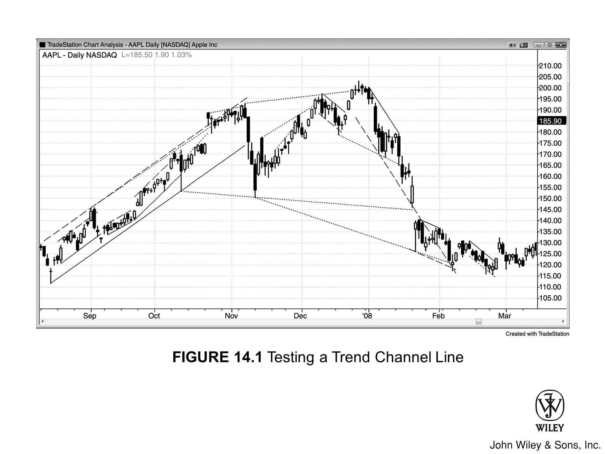

## 趋势通道线概述

**趋势通道线**位于多头或空头通道中价格行为的对侧，与**趋势线**斜率相近。多头趋势中，**趋势线**位于低点下方，**趋势通道线**位于高点上方，两条线均向右上方延伸。**趋势通道线**是一个实用工具，用于**押注**走得过急过快的趋势会**失败**。重点关注**过冲**后的反转，尤其是第二次触及通道线后出现的反转。

## 通道形态与突破行为

**趋势通道**的两条边线可以大致平行，也可以收敛或发散。当两线收敛且通道向上或向下倾斜时，便形成**楔形**，往往触发**反转交易**。一般来说，任何向右上方倾斜的通道都可视为**熊旗**，价格很可能向下**突破**通道底部。**突破**后，市场可能出现**趋势反转**，也可能进入**交易区间**，随后再向上或向下突破。有时市场会加速上行、突破通道顶部——这通常属于**高潮**式上涨，随后回落至通道内，甚至跌穿通道底部；当然也可能成为更强多头趋势中新一**浪**上涨的起点。

向右下方倾斜的通道则可视为**牛旗**，价格很可能向上**突破**通道。这可能是**趋势反转**的开始，也可能演变为**交易区间**。若价格跌穿下行通道底部，该**突破**通常会在约五根K线内失败并反转，但也可能成为新一轮更强空头行情的起点。

## 如何画趋势通道线

### 绘制方法

**趋势通道线**有多种绘制方式：将**趋势线**作平行线后拖到价格行为的对侧；直接连接通道对侧的多个高低点；像**线性回归线**那样画拟合线；或凭目测画出最佳拟合线。

多头趋势中，**趋势线**连接两个低点。若以这条**趋势线**的平行线来创建**趋势通道线**，则将平行线拖到趋势的对侧即可。目标是让这条线位于两个锚定K线之间所有K线高点的上方，拖到刚好触及某根K线高点处。有时将锚定点选在这两根K线范围之外，反而能更准确地呈现趋势走势。总之，怎样最能凸显趋势走势就怎样画。

### 处理通道内的尖峰

通道内偶尔会出现一根孤立的急速上冲K线，而其余走势十分紧凑。遇到这种情况，通常最好忽略这根K线，用其他K线来定位**趋势通道线**。但需留意：市场之后可能会"认定"通道线就该穿过那根尖峰。若后续市场波幅扩大，且每次高点都恰好止步于以那根尖峰为锚点的通道线附近，则应改用这条更宽的通道。

### 独立画法

**趋势通道线**也可以独立绘制，无需依赖**趋势线**的平行线。在**空头波段**中，**趋势线**向右下倾斜、位于高点上方；**趋势通道线**斜率相近，连接波段内任意两个**波段低点**即可。最好让这条线位于波段内所有其他K线的下方，因此需选取能达到这一效果的锚定K线。

## 趋势通道线过冲与楔形

### 过冲与楔形的关系

**趋势通道线过冲**与**楔形**密切相关，两者可视为同一类现象来分析和交易。大多数**楔形反转交易**的触发点，正是失败的**趋势通道线突破**；同样，大多数**趋势通道线过冲**后的反转也属于**楔形反转**——尽管**楔形**形态未必明显，或形状并不标准。当**趋势通道线**作为**趋势线**的平行线来绘制时，**楔形**形态不那么清晰、也不那么容易辨认，但通常仍然存在。

### 楔形中的紧迫性

通道呈**楔形**，根本原因在于紧迫性。以**楔形顶**为例，**趋势线**的斜率大于**趋势通道线**的斜率。**顺势交易者**在**趋势线**处入场，**逆势交易者**在此处离场；而在**趋势通道线**处则相反。**趋势线**斜率更大，意味着多头在更浅的**回调**幅度就开始买入，空头也在更小的下跌幅度就提前离场。

### 从第二次回调识别楔形

区分**楔形**和平行通道的关键在于第二次回调。当第二次上推开始向下反转时，交易者可以画出一条**趋势通道线**，再作一条平行线，将其拖到第一次回调的低点，就得到了**趋势线**和**趋势通道**。这告诉**多头**和**空头**，**支撑**在哪里——**多头**会在那里寻找买入机会，**空头**会在那里止盈。

但如果**多头**在该水平上方就提前买入，**空头**也提前平掉空仓，市场就会在尚未触及**趋势线**之前便掉头向上。双方之所以这么做，是因为都有紧迫感，担心市场不会真的跌到那个**支撑**位。这说明双方都认为**趋势线**应该更陡，上涨趋势比预想中更强。

### 楔形形成过程中的趋势线重画

市场掉头向上后，交易者可以重画**趋势线**。新的**趋势线**不再以**趋势通道线**的平行线为准，而是用前两次回调的低点来画。这条新线比上方的**趋势通道线**更陡，交易者开始相信市场正在形成**楔形**——而楔形往往是**反转形态**。交易者会对这条更陡的新**趋势线**作平行线，并将其拖到第二次上推的高点，以防市场走的是更陡的平行通道而非**楔形**。

接下来，**多头**和**空头**都会观察：究竟是原来那条较平缓的**趋势通道线**压住了这轮反弹，还是市场最终冲破了那条更陡的新线。如果原线压住了反弹，市场开始向下，交易者会认为：虽然第二次回调时买盘带有更强的紧迫感，但这种紧迫感没能延续到第三次上推。**多头**在原来那条较平缓的**趋势通道线**处止盈，意味着他们比本可以的时机退出得更早。他们原本期待市场冲到更陡的那条**趋势通道线**，对此难免失望。

**空头**急于做空，担心市场无法到达那条更高、更陡的**趋势通道线**，便提前在原线处开始做空。此时局势反转：**空头**变得更有紧迫感，**多头**反而开始畏缩。当交易者看到市场从**楔形顶部**向下反转，大多数人会等待至少两段下跌，再寻找下一个主要的买卖形态。

### 楔形形成后的市场走势

市场完成第一段下跌后，会跌破**楔形**下轨。在某个位置，**空头**会止盈，**多头**会再次进场买入，试图让**楔形顶部**形成失败突破。当市场反弹去测试**楔形顶部**时，**空头**会再度做空。如果**多头**开始止盈，说明他们认为自己无力将市场推过前高。一旦止盈卖出叠加**空头**的新开仓，合力达到临界点，就会压垮剩余买家，市场随即展开第二段下跌。

之后**多头**会再度回归，**空头**止盈，双方都能看到这个**两段式回调**，并开始思考**多头趋势**是否会恢复。至此，**楔形**已完成使命，市场将寻找下一个形态。

## 理解趋势通道线反转

### 为什么过冲后常常发生反转

既然大家都知道**趋势通道线过冲**后常常反转，为什么反转还是频繁发生？提前入场的交易者难道不会阻止价格触及那条线吗？

惯常的解释是：站在错误方向的新手交易者死扛亏损，直到实在无法承受，然后集体平仓，形成**爆发**或**抛物线式高潮**。以**多头通道**为例，市场缓慢上涨到某个**阻力**位，即使那个位置并不显眼，价格仍会刺穿过去——这让最后一批**空头**再也无力承受痛苦，只能认输平仓。

这些**空头**集体回补的瞬间，一些情绪高涨、缺乏经验的**多头**看到价格急速拉升，随即跟进买入，进一步助推了突破**趋势通道线**的那根尖刺。这次急速上涨又逼出更多残存**空头**被迫平仓，而夸张的涨幅又吸引更多缺乏经验的**多头**新开仓——如此形成自我强化的循环。

但到了某个节点，可供平仓的**空头**已经不足以推动价格继续上涨。那些靠情绪而非逻辑交易的亢奋**多头**，一旦发现市场突然停止加速、开始停顿并向下转，便会陷入恐慌。他们这才意识到自己是在可能的**高潮**顶部买入的，随即迅速出场。买家枯竭，加上被套的新**多头**争相卖出平仓，市场瞬间变得一边倒，只剩卖方主导，价格只能向下走。

这是惯常的解释，但它是否真实并不重要。实际上，在**Eminis**这样由机构主导、大多数交易都可能由程序生成的巨型市场里，这套逻辑很可能根本不是驱动反转的主要力量。

### 聪明的交易者如何在过冲中布局

**聪明的交易者**轻易不做逆势交易，除非出现以下两种情况之一：强趋势线被突破后市场出现**回调**，或者价格在**趋势通道线**过冲后发生反转。以**多头趋势**为例，聪明钱会持续买入，将价格一路推过**多头趋势通道线**，然后才开始**止盈**。此过程中可能出现几次反转尝试但均告失败，市场随之继续加速上涨，形成更陡的**趋势通道线**。

顺便说一句，如果你发现自己在不断重画**趋势通道线**，这通常意味着你站错了方向——你一直在等反转，趋势却越走越强。这时候应该顺势交易，而不是死盯着反转找机会。

### 耐心等待趋势反转

市场终会在某条**趋势通道线**上形成真正的反转，届时你会看到一次令人信服的转向。在那之前，要耐心顺势操作，趋势未明确反转之前绝不逆势交易。

止盈盘涌出的同时，不少人会直接翻转做空；另一些原本空仓观望的交易者也会进场**做空**；还有一些**聪明的交易者**会等图表上出现反转信号后才入场——无论是 1 到 5 分钟图、成交量图还是 Tick 图，各种图表类型上都会有人在反转信号处建仓。

一旦判断顶部已经确立，这些聪明钱就不再考虑买入。他们持有**空头**仓位，而且大多数人即便持仓浮亏、市场创出新高，也不会轻易离场——因为他们相信顶部已经到位或即将到位。不仅如此，很多人还会在高点上方继续加仓**做空**：一来摊低均价，二来借此助推市场下行。大资金脑子里只有一个方向，只有极少数情况才会迫使他们认输出场——比如二次入场信号失败，或者出现大幅不利波动（例如在 **Emini** 上逆着持仓方向运行了三个点）。买盘已经耗尽，市场只剩一个方向可走。

## 成交量与机构交易

成交量在判断是否入场时参考价值有限，因为它实在太不稳定。但在关键转折点，尤其是底部，成交量往往会异常放大。每一笔成交背后，都有一家或多家机构在买，另一家或多家机构在卖。

市场底部的主要买方，是正在**止盈**的**空头**和新建**多头**仓位的机构。那么，为什么会有机构在**空头市场**的最低点卖出？每家机构都有一套经过严格回测、已被证明能盈利的策略，但任何策略都难免在 30% 到 70% 的交易上亏损。在最低点卖出的那些机构，实际上在整个**空头趋势**下跌过程中一路持续做空，早期建立的大量空单早已盈利丰厚，他们不过是继续沿用同一套策略，直到趋势明确反转才会停手。

没错，他们会在**空头市场**最终低点的那笔**空单**上亏损，但前期累积的利润足以覆盖这笔损失。还有一些**高频交易**公司，即便在**空头市场**最低点，也会做剥头皮交易，哪怕只为赚一个 Tick。需要记住的是，底部永远在某个**支撑**位上形成，而很多**高频交易**公司会在**支撑**位上方一两个 Tick 处做空，试图捕捉最后那一个 Tick 的利润——前提是他们的系统显示这套做法具有正期望值。

还有一些机构的卖出是为了对冲其他市场的敞口（股票、期权、债券、外汇等），因为在他们看来，对冲后的**盈亏比**更为合算。这些成交量与散户关系不大——在重大转折点，散户贡献的成交量不足 5%。

### 价格行为与市场本质

**过冲**处的反转之所以必然发生，是因为这已经深植于机构交易的集体意识之中。就算某家机构根本不看图表，他们也有其他判断标准来告诉自己市场已经走得太远、该退出或翻转了——而这些判断与**价格行为**交易者在图表上看到的内容几乎总是吻合的。**价格行为**是无法逃避的现实印记：无数聪明人各自独立地在市场中追逐最大利润，最终在价格上留下了共同的轨迹。在体量足够大的市场里，**价格行为**无法被操控，呈现出来的规律始终大体相同。

## 补充观察

最后一个细节：趋势末端**最终旗形**的斜率，往往能大致预示新趋势的斜率。这对实际交易决策的参考价值有限，因为入场时还有许多更重要的因素需要考量，但作为一个有趣的观察值得留意。

## 图 14.1：趋势通道线的测试

趋势通道线与趋势同向延伸，但位于趋势线的对侧。将其向右延伸，观察价格触及通道线时的反应：是反转，还是趋势加速、无视该线继续运行？

趋势通道线通常有两种画法。第一种是以趋势线为基础画一条平行线（图14.1中的虚线，趋势线为实线），将其拖至行情的另一侧，使其恰好触及绘制趋势线所用两根K线之间的某个波段点——选取标准是让趋势线与通道线之间的所有K线都被包含在内。第二种（图14.1中的点线）是直接跨波段点连线，与趋势线相互独立。也可以用最优拟合方式来画，但这种画法在实际交易中通常没什么用处。

## 图14.2：最终旗形的斜率

图14.2中，多头趋势最终旗形的斜率为随后的空头趋势提供了方向参考。连接K线1和K线2的线性回归趋势线，大致成为延续至次日下跌行情的空头趋势通道线。这条线对K线7处的买盘可能有一定参考意义，但在K线7入场做多，本质上基于两个理由：一是当天第一小时交易形成的趋势线被向下突破，二是市场第二次尝试反转K线5开盘低点的突破。一般来说，如果近期价格行为已经提供了入场理由，就应该据此下单，而不是回头参考30根甚至更多K线之前的形态。

事后来看，多头趋势实际上在K线1就已经结束了，尽管K线2之后市场还创出了更高的高点。从K线1跌向K线2的这段下跌，是空头通道的第一段腿。

### 深度分析

图14.2中，昨日最后几个小时市场处于空头通道，因此首次向上反转尝试成功的概率并不高。趋势通道线被向下突破后，当天第一根K线——一根多头趋势K线——将其反转向上，但这次失败突破仅持续了几根K线，随后便形成了突破回调的做空形态。

## 图14.3：较长的趋势通道线

图14.3中，以K线2和K线3绘制的趋势线为基础，将其平行线拖至K线1并向右延伸，形成趋势通道线。K线6并未突破这条趋势通道线。另外，这条线的锚定点是K线1，而K线1并不在绘制原趋势线所用的K线2和K线3之间。不过，交易员应该始终留意每一种可能性——如果当时出现了突破再反转，那么从K线5低点展开的两段式反弹概率会更高。

由K线1低点和K线5低点连成的简单趋势通道线被K线6突破，但这并不是理想的逆势交易依据，原因在于：K线1与K线5相距太远，而K线5与K线6又靠得太近。趋势线最有效的情形是被第三段腿测试。这里，K线5和K线6基本上还属于同一段腿（三次向下推进：K线4、K线5、K线6）。不过这笔交易仍然值得参与，因为K线6实体较小，盈亏比合理。同时，这里还形成了缩梯形态（后文会详细讲解，指一系列更低的低点，但每次突破幅度都比前一次小），表明空头动能正在减弱，支持做多。

### 深度分析

图14.3中，开盘的大跳空缺口本身就是一次突破——所有大缺口都是——当天从一开始便走出了始于开盘的空头趋势日。开盘区间很小，市场进入突破模式，随即出现一根大空头趋势K线。不过，空头趋势运行了较长距离后出现异常巨大的空头趋势K线，通常意味着卖出高潮，之后至少会出现一次横盘到向上的两段式回调，持续至少10根K线。K线1是一根强势多头反转K线，为失败突破的做多形态提供了信号。之后出现了两段式横盘回调，以K线3对窄幅交易区间的失败突破告终，并与K线2形成近似双顶。尽管大部分时间都在横盘震荡，当天依然开盘接近最高点、收盘接近最低点。这是一个趋势性交易区间日，上下各有一个交易区间。
