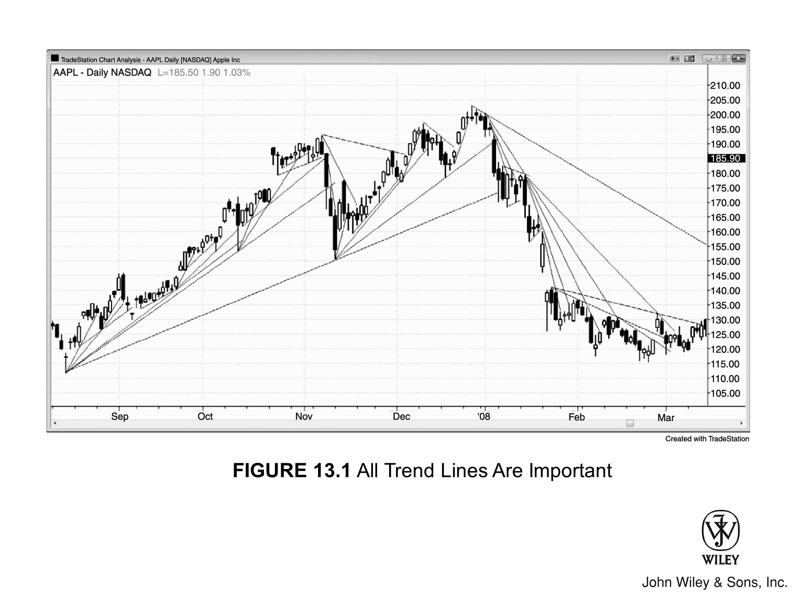
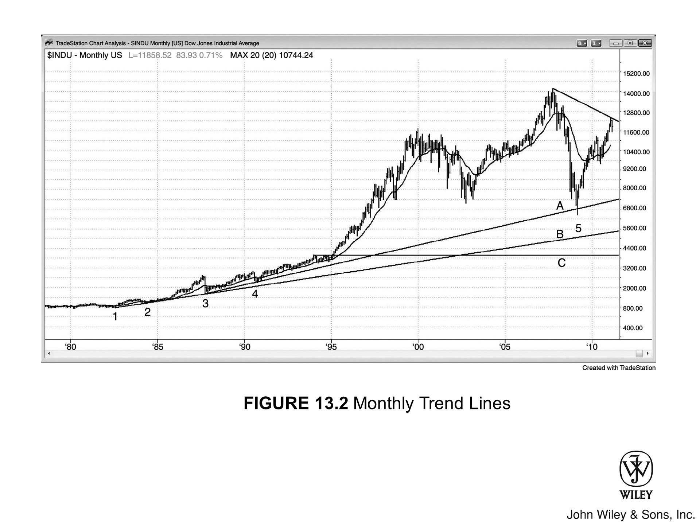
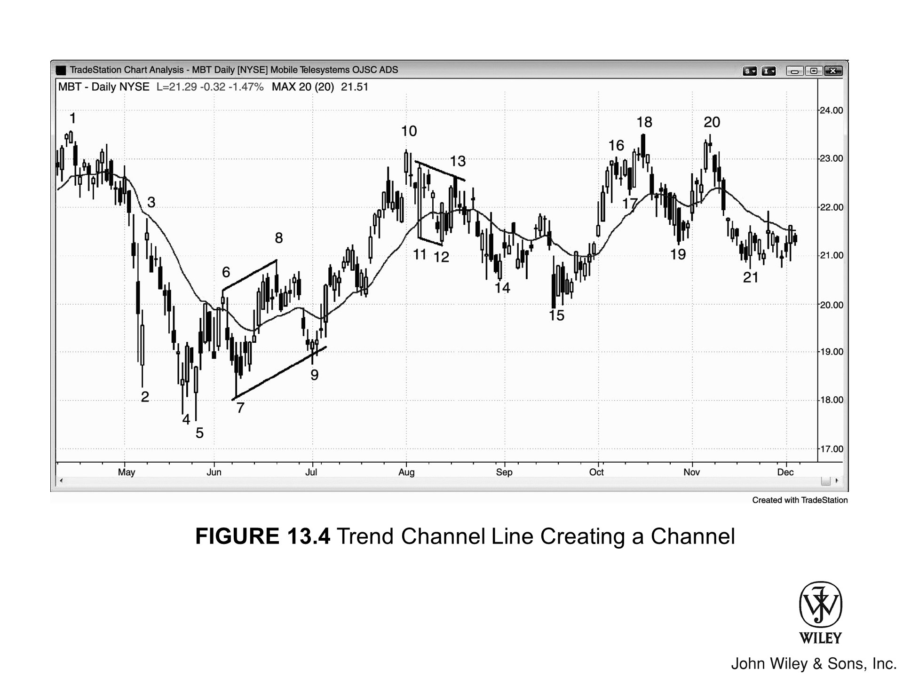

多头趋势线（Bull trend line）连结的是多头趋势中的低点，而空头趋势线（Bear trend line）连结的则是空头趋势中的高点。

趋势线之妙，主要在于两处：
1.  一是在回调中寻找顺势入场的良机；
2.  二是在趋势线被突破后捕捉反向操作的信号。

画线之道，既可以利用波段点（swing points），也可以采用“最佳拟合（best fit）”法——这既包括严谨的线性回归计算，也包括凭感觉快速画出的近似线。

*   虽然理论上也可以先画一条趋势通道线（trend channel line），再复制一条平行线拖到 K 线的另一侧（即趋势线一侧），但这招实属多余，因为光靠波段点通常就能画出合格的趋势线了。
*   有时为了追求最佳拟合，画线时会“舍影线而取实体”，只连结 K 线实体；这种情况在楔形（wedge）形态中尤为常见——毕竟，许多所谓的楔形，长得并不像标准的楔子。

若趋势线一目了然，大可不必画在图上。即便画了，一旦确认市场完成测试，也应随即擦除。

> 切记，图表上线条纵横交错，只会扰乱视线，分了心神。

### 趋势确立与顺势交易策略

一旦高低点依次推进确立了趋势，只要趋势线未破，顺势交易便是利润最丰厚的策略。每当市场回调 (pullback) 至趋势线附近——无论价格是悬而未触 (undershoots) 还是短暂刺破 (overshoots)——都要寻找依托趋势线的反转信号，进而顺势入场。

即便趋势线被突破，只要该线此前已维系了数十根 K 线，市场回调后测试趋势极值的概率依然很高。测试过后，无非三种结局：
*   趋势延续
*   趋势反转
*   或转入交易区间 (trading range)

---

### 趋势线突破的核心意义

关于趋势线突破，最核心的一点在于：这是市场不再由单边（买方或卖方）独控的 **首个信号**，意味着后续出现双向交易 (two-sided trading) 的概率大幅提升。

*   每次趋势线突破后，都会形成一个新的波段点 (swing point)，可据此绘制新线。
*   通常，后续趋势线的斜率会逐级变缓，表明趋势动能 (momentum) 正在衰竭。
*   终有一刻，随着市场控制权在多空之间易手，反向趋势线将取而代之，占据主导地位。

---

### 频频测试趋势线的两种情形

若市场在短短若干 K 线内频频测试趋势线，且价格始终无法脱离该线区域，那么极可能出现以下两种情况之一：

1.  **突破反转**
    多数时候，市场会突破趋势线并试图反转。

2.  **加速运行**
    但有时，市场会反其道而行之——随着交易者放弃突破尝试，价格会迅速远离趋势线。此时，趋势非但未反转，反而加速运行。

### 突破力度与反转概率

突破趋势线的力度，折射出逆势交易者的强弱。

*   逆势行情的幅度越大、速度越快，反转的概率就越高。
*   不过，市场通常会先去测试趋势的极值（例如在测试多头趋势的高点时，做出一个更低的高点或更高的高点）。

### 单 K 线趋势与横盘处理

不妨将开盘缺口和任何大实体趋势 K 线都视为实质性的突破，并把它们当作“单 K 线趋势”来处理。

*   **押注失败 (Fade)：** 既然是突破，就常有失败的可能；一旦出现入场策略，你要随时准备进场押注失败。
*   **横盘打破趋势：** 随后几根 K 线若出现任何横盘走势，都会打破这一趋势。
    *   通常，这些横盘 K 线是在构筑旗形，随后市场会顺势突破旗形延续原有方向；
    *   但有时突破也会失败，引发市场反转。
*   **进场时机：** 既然横盘已经打破了那条陡峭的趋势线，一旦出现优质的反转信号 K 线，你就可以寻找机会进场，押注趋势失败。

---

> **[Figure 13.1] 所有的趋势线都很重要**
>
> 

---

### 趋势线的识别与演变

**哪些趋势线有效？**
实际上，你目力所及的每一条线都潜藏着交易机会。

1.  试着找出每一个摆动点，看能否与更早的点连成一线。
2.  随后将其向右延伸，观察价格在触碰或穿越该线时的反应。
3.  **请注意：** 随着行情发展，后续生成的趋势线往往会趋于平缓，直到某个临界点，反向的趋势线开始占据主导地位。

### 实战绘图技巧

实战中，若发现潜在趋势线却拿不准它距离当前 K 线有多远，建议采取以下步骤：

*   **即画即擦：** 不妨先画出来，确认市场是否触及，随即迅速擦除。
*   **避免干扰：** 交易时，别让线条在图表上停留超过几秒，以免干扰视线。
*   **锁定焦点：** 你的焦点应当锁定在 K 线上，观察价格逼近趋势线时的行为表现，而非死盯着那条线。

随着趋势的延续，逆势行情常会试探并击穿趋势线。但这类突破多半以失败告终，反倒构成了顺势入场的良机。

在此过程中，趋势线的演变通常遵循以下逻辑：

*   **趋势线的调整**：每一次突破未果，都为绘制新的趋势线提供了第二个锚点。由此生成的新趋势线，不仅跨度更长，斜率也更平缓。
*   **趋势的反转**：终有一刻，突破失败后的行情无力再创极值。这其实是潜在反向新趋势中的一次回调，借此可以画出一条反向趋势线。一旦主要趋势线被打破，反向趋势线的地位便取而代之，这往往意味着趋势已经反转。

***

**[Figure 13.2] 揭示了一个至关重要的真相，若想成为成功的交易者，就必须接受这一现实——绝大多数突破都会失败！**

市场常带着巨大的动能直扑趋势线，看着眼前的 K 线气势如虹，很容易让人一叶障目，忘了过去 20 根 K 线搭建的大背景。比如在多头趋势里，常有猛烈的抛盘将价格瞬间打压至多头趋势线附近。

**新手往往误判，以为趋势已反转：**

1.  **急于进场**：于是，他们急忙在趋势线附近——无论是上方、触点还是下方——进场做空。
2.  **盲目自信**：他们坚信，凭着这股下杀的狠劲，自己能抄在新空头趋势的起跑线上，大赚一笔。
3.  **侥幸心理**：心想就算运气最差，行情反弹一下后至少还有第二腿下跌，总能保本全身而退。

当他们押注新趋势开启而逆势操作时，满脑子想的只有利润，却把交易天平另一端的两个砝码抛诸脑后：**风险**与**成功率**。下单前，这三要素缺一不可。

当新手看到多头趋势线附近出现强劲抛售，往往急于做空；而经验丰富的老手却反其道而行之。老手们会在趋势线处或略下方挂入买入限价单，或者干脆直接市价买进。

在急速抛售中，市场通常必须跌破趋势线一点点，以此来探寻虚实。市场需要摸清，到底是卖盘更重，还是买盘更强。多数情况下，买方会占据上风，多头趋势得以延续。但这通常发生在一个过程之后：

*   价格先是大幅跌破趋势线；
*   随后反弹测试旧的多头高点，形成一个更高的高点（如本例所示）或是一个更低的高点。

***

**Figure 13.2 月线趋势线**

***

无论在哪个时间周期，趋势线都至关重要，道琼斯工业平均指数 (INDU) 的月线图自然也不例外。请看 Figure 13.3：

*   **1987 年的崩盘（K线 3）**：在测试趋势线 B 后终结，而这条线是连接 K线 1 和 K线 2 画出来的。
*   **2009 年的熊市**：在触及趋势线 A 后反转向上（该线连接了 1987 年崩盘点与 1990 年低点）。但鉴于 2009 年的空头趋势极为强劲，市场很有可能会再次去测试趋势线 B。
*   **关于趋势线 C 的突破点**：
    *   市场一路跌回趋势线 C 突破点的可能性不大，当年该突破发生时，正值 1994 年共和党拿下参众两院控制权。
    *   通常情况下，如果突破之后紧接着一段漫长的趋势，价格不太可能再次触及该突破点，但往往会对该点位进行测试。
    *   由于该点位从未经过充分测试，它可能仍像磁铁一样，吸引市场向下运行。不过，鉴于这已是多根 K线 之前的陈年旧事，其磁力效应很可能已经减弱，甚至完全消失。

顺便说一句，市场方向通常只有约 50% 的确定性，因为多空双方在绝大多数时间里都势均力敌。不过，一旦强趋势形成，交易者对方向的把握往往能达到 60% 甚至更高。

鉴于 2009 年的崩盘如此剧烈，大概有 60% 的把握可以确信：市场在突破历史高点之前，会先去测试那次崩盘的低点。对此，不同视角的解读如下：

*   **空头视角**：可能会将当前的这波熊市反弹视为头肩顶潜在的右肩，或是针对 2007 年高点的双顶；如果市场创出历史新高，他们则可能将其视为扩散三角形顶部。
*   **价格行为交易者视角**：所有这些形态不过是对长达 12 年的交易区间顶部的测试罢了。

***

**[Figure 13.3] 利用平行关系绘制趋势线**

我们确实可以利用趋势通道线的平行线来绘制趋势线，但这种方法很少能提供额外的交易机会——因为通过其他更常见的价格行为分析，这些机会通常早已显而易见。

在 **[Figure 13.4]** 中，具体分析如下：

1.  **绘制方法**
    我们利用连接 K线 1 至 K线 4 的空头趋势通道线生成了一条平行线。随后，将这条平行线平移至价格的另一侧，锚定在 K线 2 的高点（这样做是因为它包含了趋势通道线起点 K线 1 与终点 K线 4 之间的所有价格）。

2.  **交易信号**
    K线 6 是对该线向上突破的第二次反转尝试，因此构成了一个很好的做空策略。

3.  **价值评估**
    这条基于 K线 1 至 K线 4 趋势通道线生成的平行趋势线，与连接 K线 2 和 K线 5（图中未显示）高点的趋势线几乎重合，难以区分。因此，对于寻找做空机会的交易者而言，它并没有提供额外的价值。在此展示仅仅是为了保证内容的完整性。

### 关于此图表的深入讨论

图 13.4 中，Bar 6 再次尝试过冲 Bar 3 与 Bar 5 连成的趋势通道线，结果失败。这次失败，让 Bar 6 的做空成为了“决斗线交易”的教科书案例。

*   **所谓决斗线**，就是回调走势或通道某一“腿”里的趋势通道线，与主通道的趋势线发生了交汇。
*   **本例中**，这波向趋势线的回调走出了楔形熊旗形态，由 Bar 3、5 和 6 共同构成。

**图 13.4 趋势通道线构建出的通道**

---

市场几波推进之后，有时仅凭由此生成的趋势通道线，就能构建出一个通道。图 13.5 是俄罗斯通信公司 Mobile Telesystems (MBT) 的日线图。

冲向 Bar 6 的上涨势头强劲，随后攻向 Bar 8 的第二波上冲也同样有力。鉴于 Bar 4 走出了楔形底，市场当时可能正在酝酿趋势反转，进而发展出多头通道。

*   交易者可以连接 Bar 6 和 Bar 8 画出趋势通道线，再做一条平行线，将其平移至中间的波段低点 Bar 7，以此构建通道。
*   接着，交易者紧盯从 Bar 8 开始的抛售，观察价格是否会在通道底部反转向上。Bar 9 是一根多头反转 K 线，给出了买入策略。

同理，Bar 10 逼近 Bar 1 高点区域，交易者开始警惕潜在的双顶形态。市场在 Bar 11 跳空低开，随后走出第二段下跌腿，直抵 Bar 12 低点。

*   交易者可以连接低点画出趋势通道线，再将平行线拖至中间的高点——恰好是 Bar 11 的顶部。
*   随后，他们静待价格从 Bar 12 低点反弹，观察其是否会在这个潜在新空头通道的顶部遇阻。
*   一旦看到 Bar 13 这根强劲的空头反转 K 线，交易者便可进场做空，预期市场可能正在进行通道式下跌。

### [Figure 13.5] 借助趋势通道线判断头肩形态

如图 13.6 所示，当潜在的头肩形态初具雏形时（K 线 4 附近为头部），我们可以连接颈线（K 线 3 和 5）画出趋势通道线，并将其平移至左肩（K 线 2）。这条线往往能大致框定右肩（K 线 6）可能形成的位置。

一旦市价回落至此，交易者便会伺机寻找买入策略——比如 K 线 6 卖出高潮之后，紧跟的那根强多头孕线。不过，这种预测仅供参考：

*   在决定何处入场时，眼前的几根 K 线永远比预测更具分量。
*   本图为 Infosys Technologies (INFY) 的 60 分钟图表，这是印度的一家软件巨头。

***

### [Figure 13.6] 由趋势通道线构成的通道

在图 13.7 中，构建通道的步骤如下：

1.  先连接 K 线 1 和 4 的高点画出一条虚线空头趋势线。
2.  随后以此为基准做平行线，从 K 线 3 低点延伸至 K 线 5 低点略下方，便构成了图中的虚线趋势通道线。

尽管 K 线 5 和 6 并未触及该线，但已近在咫尺：

*   **多头观点**：在许多多头看来，这足以说明通道底部经受住了测试，可以进场做多。
*   **其他观点**：然而，也有许多交易者更倾向于等待价格先刺破通道线，再去寻找向上反转的机会，并预期反转后的价格至少能突破通道顶部。

若趋势通道线过于陡峭，价格虽经测试却未跌破，明智之举是另寻画法。市场或许看到了某些你尚未察觉的端倪。

*   既然空头趋势是伴随 Bar 2 这根巨大的空头趋势 K 线才真正确立的，将其视为趋势线起点合情合理。
*   若连接 Bar 1 与 Bar 4 绘制趋势线，再做一条平行线移至 Bar 3 低点，你会发现：Bar 6 其实是通道底部过冲后的第二次向上反转（Bar 5 为第一次）。
*   不出所料，市场随即反弹并突破通道顶部，稍作回调后，便进一步上攻。

### 关于此图表的深入探讨

在 [Figure 13.7] 中：

*   **开盘走势**：今日跳空高开突破昨日高点，但突破失败。市场随后连跌 4 根 K 线，形成了“开盘即跌”的空头趋势。
*   **Bar 2**：这是首个回调，通常是介入空头趋势的可靠入场点。这是一个向下突破，因此也是一个向下急速，随后衔接了一个空头通道，该通道包含三段向下推动，终结于 Bar 3。
*   **形态原理**：由于“急速转通道形态”属于一种高潮，随后的反转通常包含两段向上的腿，且反弹往往会测试通道顶部。此处常会形成双顶熊旗的做空机会，本例正是如此。
*   **Bar 4 及后续**：Bar 4 是另一个向下急速，而在 8 根 K 线之后，又出现了一个规模更大的空头急速。随后是一个空头通道，一波多头“急速转通道”行情测试了该通道顶部，这波多头行情在太平洋标准时间（PST）中午 12:00 刚过时结束。
*   **尾盘演变**：紧接着是一波 4 根 K 线的抛售，回测了该多头通道底部附近，构筑出双底牛旗，随后强劲反弹并测试了 Bar 4 的高点。这形成了一个潜在的双顶熊旗形态，延续至次日。

平均日波幅约为 20 点，因此一旦市场跌至开盘价下方约 20 点处，交易者就多了一个寻找反弹的理由。

**[Figure 13.7] 趋势线的反复测试**

如图 [Figure 13.7] 所示，那条虚线空头趋势线被反复测试了约 15 次，多头最终放弃。这条趋势线是穿过各高点的最佳拟合线，旨在展示对阻力线的所有测试。

*   **多头放弃与加速下跌**
    多头终于停止了尝试。他们多单平仓，加剧了抛压，并且在市场继续下跌许多根 K 线之前，不再寻求买入。市场因此呈现一边倒的态势，空头得以推动趋势加速下行。

*   **市场惯性与高潮**
    通常，当市场反复测试趋势线却跌不下去时，往往会向上突破。但也有像本例这样的时候，市场加速下跌，最终在通道底部附近以高潮告终。

*   **通道构建**
    连接 bar 3 和 bar 15 高点的趋势线包含了所有高点，因此将其作为通道顶部是合理的。一条平行线锚定在 bar A 的低点，随后 bar B 和 bar C 都跌破了通道底部并反转向上。

*   **反转确认**
    一旦反转得到 bar C 及其后一根 K 线形成的双 K 线反转确认，这波反弹的首要目标就是测试通道顶部上方。

*   **强力突破**
    Bar D 发生突破，随后停顿了一根 K 线，这是一种回调形式。市场并未在空头趋势线处遭遇阻力或卖盘，反而涌现出强劲买盘，形成了一波向上突破空头通道的强力多头突破。

## 本图深入探讨

如图 13.7 所示，今日行情先是测试了移动平均线，随即跌破了昨日的摆动低点。

*   **交易者可在第 1 根 K 线下方做空**，理由是该处构成了低 2 做空形态（即针对 EMA 的小型两段式回调）；
*   **也可以选择在当天的第 4 根 K 线下方进场**。

但要注意，**第 2、3、4 根 K 线** 不仅波幅巨大，且彼此高度重叠。这种形态暗示着市场充满不确定性，正是交易区间的典型特征。

因此，若在 **第 4 根 K 线** 下方做空，即便随后出现突破，往往也难以延续，很快就会被该窄交易区间的“磁力”拉回。

随后几小时，市场一直维持在交易区间内震荡，直到后来向下突破，创出日内新低。多空双方依然势均力敌，市场在临近收盘时向上反转，最终收盘价几乎回到了开盘价附近。
