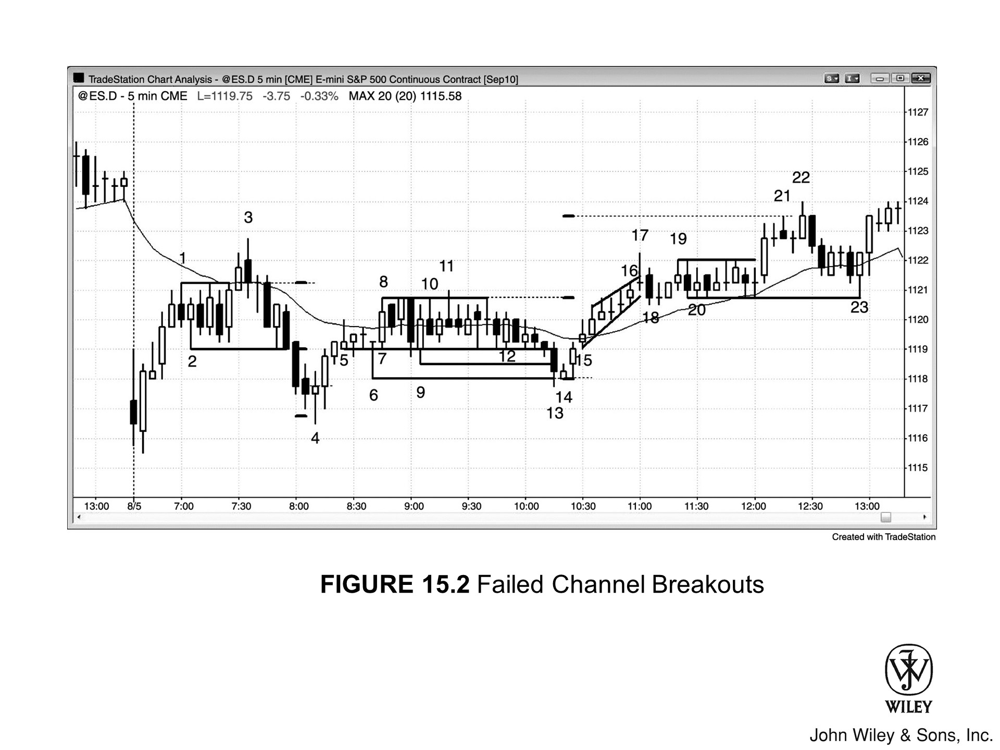
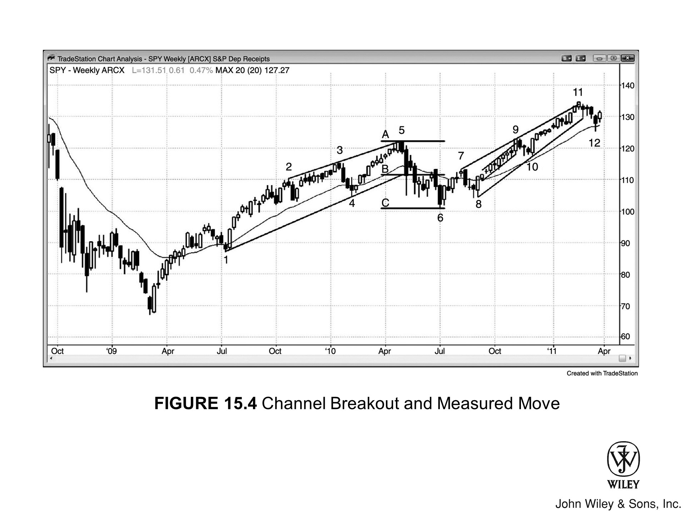

## 通道简介

价格走势大致被限制在两条线之间时，就形成了**通道**。只要仔细去找，市场随时都处于某种通道之中，而且通常同时处于好几个通道里——换个时间周期来看尤其明显。**趋势通道**是斜向延伸的通道，由**趋势线**和**趋势通道线**共同界定。以**空头通道**为例，上方是一条向下倾斜的趋势线（即**空头趋势线**），下方是一条向下倾斜的趋势通道线（即**空头趋势通道线**）。**交易区间**则夹在下方的水平**支撑**线和上方的**阻力**线之间。交易区间有时会略微上倾或下倾，但这种情况更适合理解为一段弱势趋势通道。

**三角形**也是通道，因为它同样是被两条线限定的价格运动区域。三角形要么有更高的高点，要么有更低的低点，要么两者兼具（**扩张三角形**的情况），所以它既有趋势特征，又有交易区间特征。**扩张三角形**由两条发散的线界定，技术上两条线都是趋势通道线：下方那条连接依次更低的低点，位于空头趋势之下，因此是趋势通道线；上方那条连接依次更高的高点，因此是**多头趋势通道线**。**收缩三角形**由两条趋势线界定——市场同时处于带有更低高点的小型空头趋势和带有更高低点的多头趋势之中。**上升三角形**上方是阻力线，下方是多头趋势线；**下降三角形**下方是支撑线，上方是空头趋势线。**楔形**是趋势线与趋势通道线相互收敛的上升或下降通道，属于三角形的一种变体。多头趋势中的**ABC 回调**是一段小型空头通道；空头趋势中的 ABC 回调则是一段小型多头通道。

在强趋势中，**均线**经常充当支撑或阻力，许多交易员也会基于均线及其他各种因素画出弯曲的通道和带状指标。但直线型趋势线和趋势通道线始终能提供更可靠的建仓形态和更稳定的盈利机会。

## 多头通道在不同市场状态下的表现

**多头通道**可以出现在交易区间、**多头趋势**或**空头趋势**中，也可以出现在空头趋势可能的底部——也就是市场开始向上反转的时候。处于交易区间时，在区间下半段买入是合理的，但随着通道向上半段延伸，成功概率会逐渐降低。

通道处于多头趋势中时，价格继续上涨的确定性更强，交易员应在通道底部附近寻机做多。只要通道还没有出现明显的抛压，也没有触及重要阻力位，做多的成功概率就依然不错。

如果通道特别窄——也就是趋势线与趋势通道线靠得很近、回调幅度极小——说明趋势相当强劲，放到高时间周期图表上看可能就是一根**急速**K线。之后往往会跟出一个更宽的通道，目标可能对应于窄通道高度的**测量移动**。如果通道窄到几乎没有回调，或只有一两次极小的回调，那就是**微型通道**，下一章会专门讨论。

## 多头通道作为熊旗

**多头通道**出现在空头趋势中时就是一面**熊旗**，交易员应在通道顶部附近或向下突破后的回调处寻机做空。有时空头趋势开始向上反转，最初的5到10根K线会走出一段弱势多头通道，K线大量重叠，期间出现一次或多次向下突破熊旗的尝试，但都失败了，随即快速向上反弹。

**低 2** 或**低 3** 失败之后，市场有时会向上突破熊旗，**Always In** 方向突然转为多头，**多头反转**由此展开。当交易员怀疑熊旗可能是多头趋势的起点时，很多人会在**低 1**、**低 2**、**低 3** 信号K线的下方买入，预期这些信号会失败、市场随后向上反转。

## 通道的形成与结构

通道形成过程中，交易员并不确定最终走出来的究竟是真正的通道，还是只会走一段**两腿式**走势然后反转。实际上，通常要等到市场从两腿走势开始反转、反转再次失败、第三腿启动之后，才能画出通道线。

举个例子：假设市场刚完成两段上涨后开始反转，如果这段上涨不是强势多头趋势，许多交易员会在反转时做空。但如果下跌结束后发现跌幅与第一段下跌（即第一段上涨之后的那段下跌）大体相当，随后价格再次向上反转，交易员就会判断这是一段多头通道，而不是向下的空头腿。

第二腿结束后，交易员会从第一段下跌的底部到第二段下跌的底部画一条趋势线，并向右延伸。每当市场回到趋势线附近，他们就会寻机买入。同时还会过第一段上涨的顶部作一条平行线——这就是通道的初始雏形。

每当市场反弹触及趋势通道线，交易员便会了结多头止盈，同时开始寻找做空机会。多头通道至少需要两段下跌才能确认通道结构，而市场通常还会再测试第二段上涨的高点，因此多头通道往往至少形成**三连推**。交易员通常要等到第三段上涨出现后，才开始预期反转和向下突破通道。一旦第三段上涨形成——尤其是出现趋势通道线的**过冲**以及强烈的**空头反转K线**——交易员便会积极做空，因为此时向下突破成功的概率已明显提升。正因如此，很多多头通道在第三段上涨后便告结束。同理，很多空头通道也在第三段下跌后结束。

## 真空效应

为什么市场会加速冲向通道的上下边界？这是**真空效应**在起作用。以多头通道为例：当某一段上涨接近上方趋势通道线时，交易员会认为市场很可能触及这条线，甚至可能超出一两个Tick。正因为预期价格还会再涨一点，所有人都在克制自己的卖盘。

多头想等价格涨上去再卖出止盈，空头想等价格涨上去再做空建仓。当前卖盘的相对缺失制造了**买入失衡**，只要出现失衡，市场就会快速运动。最终结果是：市场测试通道顶部时，往往出现一两根较大的**多头趋势K线**。这常常吸引过于激进的多头在急拉顶部追入，以为市场正在形成更强的新一段多头行情。但**突破**尝试大多以失败告终，这一次也不例外。

为什么？因为机构交易员始终在场。强势空头想做空，但他们同样预期市场会触及上方趋势通道线，所以一直在等待。价格到位后，他们大举做空，压倒多头。他们反而乐于看到强烈的多头趋势K线——正因为确信市场会下跌，而此时多头情绪最为高涨，也就意味着最佳的空头入场价格。市场在多头趋势K线的顶部可能短暂出现一根小K线，多空双方都在观察突破是否会失败，但随后通常迅速下跌——机构多头和空头都很清楚，绝大多数突破尝试都会失败。

## 机构交易动态

强势机构多头此时会怎么做？他们停止买入，迅速卖出手中的多头仓位，锁定一段短暂但可观的利润。他们知道这种机会稍纵即逝——市场不会在极端位置停留太久，退出之后，至少在接下来一两根K线内不会考虑再度买入。

机构多头的缺席加上机构空头的积极做空，迫使市场迅速跌向通道底部，在那里又会上演反向的过程。多空双方都预期下方趋势线会被测试：空头持续做空直到价格到达支撑位，然后回补止盈；多头则在价格到达支撑位之前按兵不动。由此形成了一段短暂而急促的下跌，吸引初学者在此追空、期待**空头突破**——但他们的操作方向恰好与机构相反。

**记住：你的任务是跟着机构走，而不是去猜他们接下来会做什么，更不能与他们的操作方向对着干。**

每一次这样的小幅回调，都是一次**微型卖出真空**。当市场接近通道底部时，多空双方都预期价格会触及多头趋势线，因此暂时按兵不动，不急于买入。价格到位后，多头入场建立新的多头仓位，空头回补平掉**剥头皮**的空仓，双方都预期市场将再次创出通道新高并测试通道顶部，整个过程就此循环往复。这一机制在所有通道中都会上演，包括交易区间和三角形形态。

## 通道中的双向交易

即便在趋势通道内，也始终存在**双向交易**，这本质上是交易区间的行为方式。从某种角度看，趋势通道就是一个**倾斜的交易区间**。当斜率较陡、通道较窄时，市场表现更接近趋势，只应顺势交易；当斜率较缓、通道内波动幅度较大且每次波动持续五根甚至十根K线时，市场更像交易区间，可以双向操作。

和所有交易区间一样，通道中间区域存在一种**磁力吸引**，会持续把市场拉回区间内。市场为什么会停留在通道里，而不是突然加速突破？因为和所有交易区间一样，不确定性太强了。

## 分批加仓

以多头通道为例：多头想继续买入，但希望价格再低一点；**弱势空头**则希望市场下跌，这样平仓出场时能少亏一些。双方都担心市场不会给出足够深的**回调**，让他们在更好的价位买到足量筹码（弱势空头买回的是亏损的空头仓位），因此他们选择随着市场上涨分批买入，这本身也在持续推高买压。每当出现小幅下跌——比如跌到前一根K线低点下方、均线附近或通道底部趋势线附近——他们会用**限价单**更积极地买入。

## 通道的交易策略

### 顺势交易

通道刚开始形成时，通常更适合顺势交易；随着价格逼近目标区域、双向交易的迹象逐渐增多，有经验的交易者会开始考虑**逆势**入场。因此在多头通道初期，在K线低点下方买入是更优的选择；但当通道临近阻力区、K线大量重叠、**空头K线**增多、回调加深、上下影线越来越明显时，就应该转而考虑在K线高点上方做空，而不是继续在低点买入。

### 新手的交易策略

对于刚入门的交易者，一旦识别出通道形态，就只做顺势方向，能不交易就不交易。通道随时都在尝试反转，回调频繁，新手很容易被搞晕，连续亏损是常事。

如果是多头通道，只关注买入机会。最可靠的买入信号是：在均线附近出现带**多头信号K线**的**高 2**形态，且入场点不能离通道顶部太近。这种完美的**建仓形态**并不多见，新手应该耐心等待最好的机会，哪怕最终错过了整段趋势，也比盲目进场强。

经验稍丰富的交易者可以在弱势卖出信号下方、均线附近或通道底部附近挂**限价单**买入。如果还做不到稳定盈利，在多头通道里就不要做任何卖出操作，哪怕出现看似像样的小**LH**也一样。市场处于 **Always In** 多头方向，就不应该考虑做空，即便图上出现很多看起来像样的做空信号。

要等到市场明确转为 **Always In** 空头方向，再去考虑做空。通常需要一根强势的**空头急速**K线跌破通道和均线，有**跟随**确认，然后形成一个带**空头信号K线**的 LH。如果建仓形态比这还弱，新手就老老实实等着，只做回调中的买入机会。

**不要陷入均值回归的思维定式**，觉得通道已经弱成这样，反转早就该来了。市场可以把这种"撑不住"的走势延续到远超你账户所能承受的程度。

## 加仓策略

很多多头会在市场上涨过程中**分批加仓**，几乎会用到他们能想到的各种合理方法。有的在**回调**到均线时买入，有的在前一根K线低点下方买入，有的按固定间隔买入，比如 AAPL 每从近期高点下跌 50 美分就加一次仓；还有的选择在市场看起来即将恢复上行时买入，比如每从前低上涨 25 美分就买一次。你能想到的方法，程序员也能想到；只要在数学上能证明有效，他所在的机构就很可能真的会去用。

## 通道衰竭与反转

多头和**被套空头**都希望价格能跌下来，又都担心等不到，于是双方持续买入，直到买入动力彻底耗尽。这个时刻通常出现在某个磁力区附近，比如**测量移动**目标位、高时间周期趋势线或趋势通道线。

通道往往走得比大多数交易者预期的更远。趋势通常会越过一个又一个明显的阻力位，一直走到某个位置——足够多的强势多头和强势空头都认为已经涨得差不多，不太可能再涨多少。到那时买压耗尽，强势多头开始**止盈**平仓，强势空头则更积极地介入做空，市场随之反转，进入更深的**回调**或走出反向趋势。

多头趋势常以**突破**通道顶部的方式结束——最后绝望的空头争相回补，那些一直等低点却始终没等到的弱势多头也终于放弃等待，直接用市价单买入。强势空头早就预判了这一幕，他们往往等这波强势突破出现后才开始持续做空。在他们看来，这是一个能在极高价位做空的短暂窗口，市场不会在这里停留太久。

强势多头把这根**急速上涨**K线视为天赐良机，立刻平掉多头仓位。此后，只有等市场出现至少持续10根K线的**两段式回调**，他们才会考虑重新做多。通常他们会等价格跌回通道起点附近——也就是当初建仓的位置——再重新入场。强势空头深知这一点，于是会把止盈目标设在强势多头准备重新买入的那个价位。最终结果往往是反弹一下，然后陷入**交易区间**，因为多空双方对下一步走势都没有把握。这种不确定性本身就意味着市场进入了**交易区间**。

## 机构行为模式与高潮

当然，以上只是常规逻辑，实际情况可能远比这复杂，也更难以捉摸。所有机构都熟悉这套模式，它们的程序员也一直在寻找从中获利的方法。其中一种可能的做法是：机构主动制造**买入高潮**。假设某机构一路买涨，此时已准备止盈，但想先确认顶部已经形成，就可能突然大手笔买入最后一批仓位——哪怕这笔单子可能小亏，目的是在图表上制造一根**高潮性反转**K线。一旦操作成功（当多家机构同时运行类似程序时，成功概率会更高），该机构就能把全部多头仓位出清，其中大部分都锁定了利润，甚至还可以反手做空，因为此时可以确信空方已经掌控了市场。

### 读图

这种情况是否每次高潮出现时都会发生？无从判断，也不重要。你的目标是跟着机构走，而机构的行为已经反映在图表上了。至于背后运行的是哪种程序，完全不需要知道——机构自己也不清楚其他机构在跑什么程序，每家机构只了解自己的策略。但市场要走出一段行情，通常需要大量机构同时朝同一方向交易，而且规模要大到足以压倒朝反方向操作的其他机构。

绝大多数机构会同时站在同一边的时刻只有一个——强趋势的**急速阶段**。而这种情况在图表上出现的频率不足5%。

## 做空策略：分批建仓

随着通道持续上行，参与交易的不只是多头和弱势空头。**强势空头**也在上涨过程中持续卖出、**分批加仓**，因为他们判断上方空间有限，最终会有利可图。他们的卖出开始制造**抛压**：出现**空头实体**的K线越来越多，空头实体也越来越大，上影线增多，低点频繁跌破前一根K线的低点。

他们盯着通道的**向下突破**，期待价格回测通道起点。为了尽量在高位做空，他们选择边涨边卖，而不是等反转发生再入场——因为一旦反转来临，往往又快又猛，届时只能在远低于通道顶部的位置做空，盈利空间会大打折扣。

加仓方式有很多种：

- 在前一根K线高点上方或通道内小波段高点上方挂**限价单**卖出
- 每次价格测试通道顶部趋势通道线时卖出
- 在**测量移动**目标价位卖出
- 按固定间隔卖出（例如AAPL每上涨50美分加一次空仓）
- 在每个潜在顶部卖出

一旦市场反转，他们可能持有全部仓位等待大幅回调，也可能设定**止盈目标**离场——例如在通道底部趋势线处平仓，或在第一笔做空的入场价附近平仓（这个位置通常接近通道起点）。若如此操作，第一笔仓位就是**盈亏平衡**出局，后续在更高位建立的仓位则全部有利润。

## 通道内分批做空的时机

如果要在多头通道里分批建空，最好把操作集中在交易日前三分之二的时段内。不要让自己在日内后半段还重仓持空，而**盈亏平衡入场价**却远在下方——一旦时间不够，连无亏出场都难，更别说拿到大利润。总体而言，交易日后半段操作通道时，最好只做顺势单，比如在前一根K线低点之下买入，或在均线处的**多头反转K线**上方买入。

## 动量交易与高潮性反转

如果市场继续上涨、超出空头的预期，他们会全部平仓止损——这很可能是通道末端有时出现**高潮性向上突破**的重要原因之一。空头不再指望会有回调让自己以更好的价格买回，只好直接市价平仓，每一笔空单都认亏离场。由于其中很多人本就是**动量交易者**，不少人会直接转头做多。

所有追涨的多头都会在市场加速上行时积极买入，因为他们知道数学站在自己这边——下一个 Tick 向上的概率超过 50%，这就是优势所在。哪怕这次突破转瞬即逝、随后反转剧烈，只要逻辑成立，买入程序就会持续执行。

不过，这就像抢椅子游戏：音乐一停，所有人都抢着坐椅子——也就是说，他们会非常迅速地平掉多头仓位。多头卖出平仓的同时，激进的空头也在做空，由此形成对空头极为有利的强烈**失衡**。一旦空头掌控局面，抛售通常会持续至少 10 根K线，市场往往会反转跌回趋势通道线以下、重新进入通道，随后完成向下的**突破**。

## 媒体与技术分析

电视评论员会把这次剧烈的上行**突破**归因于某条新闻，而市场上永远不缺现成的新闻可供引用。他们的视角仅限于传统股票交易——也就是基本面。他们根本不明白，很多市场走势，尤其是一两个小时内发生的那些，跟基本面毫无关系，不过是大量程序化资金同时做同一件事，对基本面完全视而不见。

等市场在**高潮式飙升**后迅速反转，他们便转移到下一个故事。他们从不反省刚才那番解读有多幼稚，对短线驱动市场的强大技术力量依然一无所知。每隔几年出现一次极端的日内大幅行情，大概是他们唯一愿意承认技术因素存在的时候——而且几乎总是把责任推给程序化交易，仿佛那些程序只是偶尔冒出来一下。

其实没什么好推卸的。日内价格走势绝大部分都由程序化资金驱动，但这些记者完全搞不清楚状况，眼里只有财报、季报和利润率。

## 通道内的突破失败

通道本质上是**倾斜的交易区间**，和其他交易区间一样，从顶部或底部突破的尝试大多会失败。没错，一侧力量更强，但基本原理与任何交易区间并无二致。比如在多头通道里，多空双方都在积极交易，只是多头更强，通道才会向上倾斜。

双方都乐于在通道中部建仓。但当市场靠近通道顶部时，多头开始担心**上行突破**会失败；一旦他们认为失败的可能性较大，就会卖出部分多头仓位。空头在通道中部就已乐于做空，靠近顶部时性价比更好，入场也更加激进。

当市场靠近区间底部时，空头对低价做空的兴趣减退，而多头——此前还在更高价格买入——反而会在这里更积极地加仓。由此带来一波沿趋势线的反弹。市场运行过程中通常会一次或多次刺破通道下沿，你需要不断重画趋势线，最终通道会变得稍宽、坡度也稍缓。

最终，**下行突破**会足够强劲，之后形成**LH**，再形成**LL**，届时交易者就会开始画空头通道——即便原来那个多头通道仍然存在，只是已经变得宽很多了。

## 多头突破失败与买入高潮

多头通道向上的**多头突破**大多会失败，这一点至关重要。就算多头真的突破成功、压倒了空头，通常也只能维持几根K线。到那时，多头会觉得市场涨得太过头了，开始止盈；他们不会再买，要等市场回调一段时间后才会重新介入。

通道中部的**磁力效应**通常会把市场拉回通道，令突破失败，使这次突破沦为一次**买入高潮**。回到通道之后，市场通常至少要向下刺破通道底部。

买入高潮之后，市场通常会经历一段**两段式回调**，历时约 10 根K线，往往会跌破通道。**下行突破**一旦发生，若抛售延续，下一个目标就是大约等于通道高度的**测量移动**。空头也清楚买入高潮之后很可能跟随一段回调，会积极做空。多头卖出平仓，叠加空头的做空，市场承受强劲的**抛压**，回调幅度可以很深，甚至演变为**空头趋势**。

## 成功突破与测量型缺口

有时候，多头通道的**向上突破**足够强势，不会在几根K线内就失败。这种情况下，市场通常会涨向**测量移动**目标位，突破本身也就变成了**测量型缺口**。举个例子：假设多头通道呈楔形，先向下突破，但几根K线内向下突破失败，市场随后快速拉升并突破楔形顶部，那么上涨幅度通常约等于楔形高度。突破楔形上沿的那根或那几根**趋势K线**，就成了测量型缺口。关于缺口、测量移动和突破的详细内容，见第2册。

## 其他突破情形

如果发生的不是向上突破，而是**向下突破**，并且之前没有经历向上突破失败、买入高潮和**空头反转**，市场通常会先横盘一段时间。之后可能形成一个**LH**，再走第二腿下跌；也可能交易区间演变成**牛旗**，引发多头趋势的延续。较少见的情况是出现强力**急速**下跌和强势**空头反转**。以上规律对空头通道同样适用，只是方向相反。

## 通道即旗形

趋势通道本质上是一段**倾斜的交易区间**，因此通常起旗形的作用。无论多头通道坡度多陡、持续多久，终究会在某个时刻发生**向下突破**，所以可以把它理解成**熊旗**——哪怕之前根本没有空头趋势。

强势多头在某个时刻会止盈离场，之后只愿意等市场大幅**回调**后再重新买入。这个回调往往要一路跌回通道起点，也就是他们最初开始买入的位置。这也是通道经常回落至底部的原因——而那里通常会出现反弹。

强势空头与强势多头同样精明。强势多头一旦停止买入，强势空头往往就开始积极做空，而且不会被随后的上涨轻易止损出局。相反，价格越高，他们反而觉得越值得做空，会进一步加仓。那他们在哪里止盈？就在通道底部附近——也是强势多头可能重建多头仓位的地方。

## 把通道当旗形来交易

**多头通道**的行为像**熊旗**，就应该按熊旗来交易。同理，**空头通道**应当视为**牛旗**。之前是否有多头趋势并不重要，不影响判断。有时候高时间周期存在多头趋势，但在5分钟图上看不出来，这时空头通道在该图上就会呈现为牛旗形态。

高时间周期的趋势确实可以提高向上突破的概率及力度，但即便不考虑高时间周期的多头趋势，空头通道大幅向上突破的情况也非常常见。把空头通道当牛旗来交易，不必非要等高时间周期确认。多头通道的情况正好相反，它们本质上是熊旗。

## 通道突破的形态

多头通道本质是**熊旗**，所以最终通常会出现**向下突破**。但有时也会向上突破通道上沿。多数情况下，这类突破带有**高潮**性质，难以持续——可能只持续一两根K线，有时能撑五根甚至更多，然后市场就往下反转了。更少见的情况是多头趋势以极强势头延续下去。

如果发生反转，市场通常会**重回通道内**。凡是重回通道的突破，一般都会测试通道的另一侧。多头通道顶部向上突破失败后，由于属于高潮行为，随后的回调至少应有两腿、持续至少10根K线，并且往往会演变成**趋势反转**。空头通道的**向下突破**情况则相反——那通常是**卖出高潮**，之后会反转回通道内，并出现至少两腿的上涨。

## 通道的终结

所有通道最终都以**突破**告终，突破可以很剧烈，也可以毫无动能。**趋势通道**的持续时间往往远超大多数交易员的预期，常常让人过早入场做反转而被套。多数通道在结束前至少会走出**三腿**——这在**三角形**中尤为明显，在**楔形**中更是如此。三角形的突破通常已经迫在眉睫，但方向往往不清晰。

## 通道强度与动能

通道坡度越陡、两条线靠得越近，通道越强、动能也越大。当通道既陡又窄时，就形成一种特殊形态，称为**窄通道**。如果通道是水平的，则称为**窄交易区间**，详见第2册。

通道强劲时，第一次逆势突破的风险很高，整个通道在高时间周期图上很可能只是一段**急速**行情。因此，如果出现陡峭的空头通道，且通道内的回调大多只有一根K线，最好不要在某根K线突破前一根高点时贸然买入，即便它突破了空头趋势线也一样。更好的做法是等待**突破回调**出现——可以是**LL**，也可以是**HL**。

如果反转向上的走势看起来强劲（比如最近几根K线中出现了两三根大实体的**多头趋势K线**），可以考虑买入突破回调。如果市场没有回调就直接向上冲，说明后续继续上涨的概率不低，可以耐心等待回调——通常五根K线之内就会出现。

多头能否盈利，很大程度上取决于两点：这波上涨能否突破均线，以及第一次回调能否守住均线。守得住，说明多头有力量；守不住，第一次回调就跌到均线下方，则多头偏弱，走出第二段上涨腿的概率也更低。若上行突破后市场持续下跌，则意味着突破失败，空头趋势恢复。

## 通道强度与趋势延续

当市场可能处于反转过程中时，通道的强度至关重要。举个例子：一波强劲的多头趋势之后，出现一波猛烈的下跌，且跌破了**多头趋势线**，此时交易员会密切关注接下来的反弹。他们想判断的是：这波反弹究竟只是在测试**多头高点**，还是会强力突破该高点，进而延续多头趋势、再走出一段上涨腿？

其中最关键的观察点，是反弹测试多头高点时的**动量**。如果反弹走势处于一个非常**窄而陡峭的通道**中，K线之间几乎没有重叠，而且在出现任何暂停或回调之前就已大幅超越多头高点，则说明动量强劲——尽管之前出现过强劲的下跌并跌破了多头趋势线，多头趋势恢复的概率依然较高。

**窄且持续的通道**在首次被突破时，通常会失败。随后趋势恢复，往往会突破至新的极值，并走出一段**测量移动**，幅度大约等于首次突破的幅度。

相反，如果反弹K线大量重叠，夹杂着几根大实体的**空头趋势K线**，出现两三次明显回调，甚至呈**楔形**走势，而且斜率明显弱于原来的多头趋势和之前那波下跌，那么测试多头高点的结果很可能是形成一个**更低的高点**或仅略高的高点，随后再度向下。市场可能正在反转为**空头趋势**；退一步说，至少演变为**交易区间**也是大概率的结果。

## 测量通道突破目标

任何**通道**发生突破后，如果价格反转回到通道内，市场都会尝试测试通道的另一侧，通常还会试图向那一侧突破，哪怕只是略微超出。若任一方向的突破成功，最低目标是一段**测量移动**，幅度大约等于通道本身的高度。

以**双顶**为例：双顶本质上是一个水平通道。若向下成功突破，最低目标是等于通道高度的一段测量移动；但突破也可能演变为**趋势反转**，实际走势可能远超这个目标。若改为向上突破，目标同样是等于双顶高度的一段向上测量移动。

假设 AAPL 正在形成双顶，顶部比底部高 5 美元。向上突破的初始目标就是顶部再往上 5 美元；向下突破的初始目标则是形态低点下方 5 美元。楔形底的逻辑相同：第一目标是测试楔形顶部；若市场继续上涨，下一目标是向上的测量移动；若涨势延续，市场可能就此进入**多头趋势**。

即便通道是倾斜的，初始目标依然是等于通道高度的一段移动。以多头通道为例，任取一根K线，量出它正上方与正下方通道线之间的垂直距离，这个距离就是测量移动的预测幅度。测量移动目标只是近似值，但市场常常在精确触及该目标后才暂停、回调或反转。若市场大幅超越目标，则很可能已开启新的趋势。

## 突破后的跟随分析

和所有突破一样，后续无非三种走法：突破成功，价格继续沿突破方向运动；突破失败，演变为小型**高潮**式反转；或者市场横盘，形态演变为**交易区间**。大多数突破都会在几根K线之内遭遇反转尝试。

若**反转K线**相比**突破K线**更为强劲，则突破失败、反转成功的概率较高。若反转K线弱于突破K线，则反转尝试大概率会失败，并在一两根K线内形成**突破回调**，突破行情随即恢复。

如果突破与反转的力度旗鼓相当，交易员就要密切关注**反转信号K线**之后的那根K线。举个例子：一根强势**多头趋势K线**突破了某个**牛旗**，紧接着出现了一根同样强劲的**空头反转K线**，那么再下一根K线就至关重要。如果价格跌破这根空头反转K线的低点，说明突破至少暂时失败了。若该K线随后收出强势**阴线**，形成强势**空头趋势K线**，反转继续下行的概率便会上升。反之，若该K线是一根强势**多头反转K线**，那么失败的突破大概率不会逆转成功，这根多头反转K线便成为**突破回调**买入的**信号K线**，入场点在其高点上方一个 tick。突破的相关内容将在第2册中详细讨论。

## 图 15.1：嵌套通道

通道在所有图表上都很常见，较小的通道往往嵌套在更大的通道之内。图 15.1 中要注意，画线时并不需要把通道内所有高点和低点都纳入。采用最佳拟合线来画，通道走势会更加清晰，也更容易提前识别信号。由于大部分交易来自机构并由程序执行，每一段小而紧密的通道背后，很可能都是程序化交易在驱动。市场上同时运行着大量程序，一段通道的形成，大概需要几家机构的程序同向运行，且买卖量足以压制反向程序，才能推动价格朝一个方向持续运动。比如从 K 线 4 开始的下行通道，卖出程序的力量足以压制买入程序，市场随之下行。当买卖程序的力量基本平衡时，市场就横盘震荡，形成窄幅交易区间——也就是水平方向的通道。

多头通道与熊旗在形态上无法区分，空头通道则应当作牛旗来理解。当通道像 K 线 2 到 K 线 3 这段一样非常紧密时，买家应等到出现向下的失败突破并反转向上后再考虑做多，就像 K 线 3 处的情况。也可以等突破后的回调再买入，比如在 K 线 3 之后第 5 根小K线高点上方买入。在上述条件成立之前，只应做空。当通道的波段较宽，比如 K 线 3 到 K 线 8 这段，双向交易都可以考虑，因为它更像一个斜向的交易区间，而交易区间属于双向市场，买卖信号都会出现。

图中大多数通道都很紧密，其中几段没有回调，或只有一到三个 tick 的单K线微小回调，持续时间也在 10 根K线左右，属于微型通道。

## 图 15.2：通道突破失败

价格突破通道后若随即反转回到通道内，市场通常会测试通道的另一侧，往往还会至少小幅突破另一侧。若突破后有跟随，第一目标是等于通道高度的测量移动。图 15.2 中，K 线 3 向上突破交易区间顶部后反转下行，跌穿通道底部，K 线 4 的低点仅比完美的测量移动目标低了一个 tick。

K 线 11 向上突破交易区间顶部，随后市场在 K 线 13 测试了区间底部。有时候画线时可供选择的K线不止一根，通常值得把所有可能性都记在心里，因为要等几根K线之后才能判断哪条线最准确。最宽的通道通常最可靠。

K 线 13 之后出现的多头内包K线，构成了突破失败的买入建仓形态。由于市场再次反转回到通道内，第一目标是测试通道顶部。顶部突破成功后，下一目标是向上的测量移动。K 线 22 高出该目标一个 tick。趋势一旦启动，走势有时会远超目标。

K 线 17 向上突破了多头微型通道或楔形，下一根K线即反转下行。由于通道非常紧密，测试通道低端的目标在同一根K线上就已达到，但盈利空间太小，不构成可交易的做空机会。

由 K 线 19 和 K 线 20 构成的通道向上突破的测量移动目标，与由 K 线 6 和 K 线 10 定义的交易区间向上突破的测量移动目标处于同一价位。当多个目标集中在相近价位时，该处出现的任何反转成功率都会显著提升。K 线 21 是有效的做空建仓形态，但入场后下一根K线即告失败。K 线 22 下方出现了二次入场点，随后市场测试了通道底部。底部出现多头反转K线后，市场随之又测试了通道顶部。

### 对本图的深入分析

图 15.2 中，市场大幅缺口低开，跌破了一段收盘价构成的交易区间，但第一根K线相对较大，上下影线都不小，是典型的交易区间行为，无论做多还是做空，都不算一根好的信号K线。第二根K线是强势多头反转K线，预示此前的向下突破已告失败，市场将走出始于开盘的多头趋势，可以入场做多。随后市场在均线下方进入窄交易区间，形成一个最终旗形，突破失败后反转下行。K线3跌破前一根K线低点时，交易员即可做空，但更稳妥的做法是等K线3收盘、确认收出阴线后，再在其低点下方做空。

从低点到K线1的上涨走势处于一个微型通道中，因此K线2向下突破后，不太可能直接走远——中间必有一次回调。当市场重新升回K线2突破那根K线的高点上方时，向下突破即宣告失败。此后市场横盘整理，多空双方争夺主导权。空头希望看到K线2突破后出现HH或LH形态的回调，多头则期待突破失败后市场再度上攻。

最终空头取胜，市场在一个微型通道中下行至K线4，随后形势逆转。K线5是突破失败的信号K线，但四根K线组成的多头急速走势力度很强，足以让交易员相信市场可能继续走高，事实上市场确实一路涨至K线8。

从K线14到K线17是另一段多头微型通道，K线18实现突破。此后市场横盘整理，小级别趋势随后恢复，一路上行至K线22。

## 图 15.3：多头通道出现在牛市与熊市中

多头通道可以在任何市场形态下出现。图 15.3 中，左图是 Emini 5 分钟图，多头通道形成于强势多头趋势中：市场跳空高开，走出始于开盘的多头趋势日，回调幅度很小，全天持续上行。由于当天是强势多头趋势日，交易员会在小幅回调时买入，比如在前一根K线低点附近或低点下方入场。

中图的多头通道是熊市趋势中的一段楔形熊旗，交易员不应寻找做多机会。可以在K线18处的 ii 形态低点下方做空，也可以在随后多根K线中逐步入场，因为市场已转为 Always In 做空。

右图的多头通道是过度下跌的熊势中的一段小熊旗。它形成于开盘那根大阴线之后——那根K线是第三次向下推进。K线26（见插图）在前一日低点处形成了强势两K线反转，做多信号明确。从K线26到K线29前那根K线构成的通道，形态上虽是熊旗，但交易员已判断市场正在反转向上，因此在前一根K线低点下方买入，预期低 1 和低 2 的做空建仓形态会失败。K线29是强势多头趋势K线，突破了熊旗顶部，市场明确转为 Always In 做多。并非所有熊旗都会向下突破——有些会成为熊势的最终旗形，随后向上突破，引发多头趋势，此处正是如此。

## 图 15.4：通道突破与测量移动

市场成功突破任何通道后，第一目标价位都是测量移动。图 15.4 是 SPY 周线图。趋势线连接K线1与K线4的低点，趋势通道线从K线2与K线3的高点画出，延伸至K线5处被触及。这是一段多头通道，两条线轻微收敛。水平线 A 画在K线5的高点处，水平线 B 是K线5正下方通道底部的位置，水平线 C 是从 A 到 B 的距离向下投射所得的测量移动目标。K线6在测量移动目标附近找到支撑，随后市场展开反弹。

用安德鲁斯叉也能得出类似目标，但基本价格行为分析已经能给出相同结果，这就够用了。K线6低点附近，空头止盈、激进多头买入，背后的具体原因可能数不清，但这些原因本身并不重要——我们永远无法知道每一笔交易背后投入了多少资金、出于什么动机。我们知道的是：图表是所有资金出于无数原因交易后的提炼结果，掌握反复出现的形态规律，就能判断何时该止盈、何时该考虑反转交易。

市场下行至K线1，是首次跌破一段紧密的强势多头通道，因此这次突破大概率会失败。当第一次突破失败、趋势恢复时，往往会延伸至一个测量移动目标，该目标大致等于初始反转尝试的幅度。此处市场上涨的幅度远超这一目标。

K线1多头急速之后形成的通道同样非常紧密，下探至K线4是第一次强劲突破，但反转失败，趋势恢复。多头尝试将反弹延伸至一个测量移动目标——该目标等于K线3到K线4的幅度加上K线3顶部——但市场最终略微未能触及。

K线7 的上涨突破了延伸至 K线6 的两段式牛旗，K线8 是突破后的回调，也是另一段多头通道的起点。随后价格下跌至 K线12，跌破通道，跌幅大约等于一个测量移动目标——依据是通道本身的高度以及第一段下跌的高度（K线11 和其后一根K线）。K线3、5、7 构成了头肩顶形态，但和大多数反转形态一样，最终演变成了一个大型牛旗，而非真正的反转。

### 图表深入分析

图 15.4 中，K线6 前面那根K线既是突破回调的做空建仓形态，也是均线附近的低 2 做空信号。K线5 之后那根K线带有很长的影线，随后几根K线亦然。均线下方的这段交易区间构成了铁丝网形态，这种形态往往会演变成最终旗形，这里也不例外。

图表最低点附近出现了单根K线的急速上涨，紧接着是一段极窄的通道。事实上，整段上涨过程中出现了三到四段窄通道（有些交易员把 K线1 到 K线3 的第二段急速上涨看作一段陡峭的通道或急速，也有人看作两段）。通道很窄时，往往表现得像一根急速K线，后面会跟着一段通道。K线1 回调之后出现了两根K线的急速上涨，随后又是一段通道，这段通道同样窄到很可能被当作初始急速的一部分。K线2 回调之后，向上的通道中出现了几根空头实体，这是抛压积聚的信号。结果便是一段强劲的四根K线急速下跌，直打至 K线4。抛压持续累积，多头在测试高点时很可能已经开始止盈。尽管 K线4 之后向上的通道很窄、有可能是另一段急速，但急速也可以是高潮。这已是连续第三或第四次买入高潮（每一段急速，无论单根还是多根K线，都是一次高潮），而且出现在一段强劲的空头急速之后。连续高潮通常会引发更大幅度的回调，这里也不例外。

## 图 15.5：空头通道的高潮式向下突破

空头通道向下突破后，可能迎来更强的空头趋势，但这种突破通常很快就会变成高潮，之后一般至少会有两段上涨，如图 15.5 所示。K线4 跌破空头通道后，如预期般成为卖出高潮，随后走出两段式反弹，在 K线7 结束。

K线14 出现了一段急速上涨，随后在 K线15 回调，接着发展成一段楔形通道。价格跳空上涨至 K线17 时向上突破，但这次突破不过是一次买入高潮，随即反转回到多头通道内，之后又向下突破。这次回调分两段完成，在 K线18 结束。很多通道在反转前会有三推，K线14、16、17 就是三次向上的推进。

从 K线12 起步的小型多头通道出现了向上突破，力度非常强。所有突破都是高潮，但高潮不一定导致反转。有些突破会发展成非常强劲的行情，就像这里一样。一旦回调最终结束、趋势重新启动，动能通常会减弱（斜率变小），K线之间的重叠也会增多，这是双边交易增加的信号。

多头趋势强劲时，交易员会在均线测试处买入，比如 K线13 和 K线15。均线因此起到了约束趋势的作用，功能上相当于通道的下边界。虽然可以用指标画出趋势线的平行线并放置于高点上方来构建通道，但弯曲的通道线或任何形式的带状区域，通常都不如直线通道线那样能提供可靠的交易机会。

### 图表深入分析

图 15.5 中，K线13 到 K线14 的强劲上涨几乎垂直，所有强劲的多头突破都应被视为向上急速和买入高潮。当这段急速由两根或多根大型多头趋势K线组成时，力度尤其强，在出现明显回调之前，价格更有可能走出测量移动。计算测量移动时，取急速第一根K线的开盘价或最低价，以及最后一根K线的收盘价或最高价，这些价位往往是多头部分或全部止盈的好位置，有时也是空头开始建仓做空的好位置。K线13 底部没有影线，收盘接近最高价，是多根多头趋势K线中的第一根，因此它的底部便是这段急速的起点。用 K线13 的开盘价和 K线14 顶部最高价计算，测量移动目标恰好指向通道的精确高点，即 K线17 的最高价。

K线7 是空头趋势中的二次入场均线缺口K线做空建仓形态，这类形态往往会引发空头趋势在更大级别反转前的最后一段下跌。上涨至 K线7 的过程突破了空头趋势线，随后在 K线8 形成了更低低点的趋势反转。

K线10是前一段交易区间的又一个低点，同时构成了扩张三角形的底部。扩张三角形通常会反弹至新高，形成扩张三角形顶部。K线14处市场尝试这样演绎，但彼时上行动能极为强劲，想做空的交易员必须等待二次入场点，而这个机会始终未曾出现。在如此强劲的多头突破之后，与其寻找做空机会，不如盯住回调买点。扩张三角形顶部如预期失败，趋势通道线顶部及前一日K线9高点被突破后，市场随即走出两段式横盘突破回调，于K线15处回归均线。

## 图15.6：在趋势线处的反转

一旦市场明显进入趋势状态，就要把所有可能的趋势线和趋势通道线都梳理出来，因为这些都是市场可能反转的区域。交易员画线的方法各异——连接波段点、绘制平行线、拟合最佳拟合线。图15.6展示了一些较为显著的线，但实际远不止于此。有些线基于相关市场（如现货指数），还有些来自成交量图和Tick图等不同类型的图表。空头可以在趋势通道线附近的通道底部测试处部分止盈，激进的多头也可以在此发起剥头皮多单。在空头通道顶部，多头会了结剥头皮仓位，空头则会在此发起波段做空和剥头皮做空。

由K线3和K线7高点连成的趋势线A，在K线7之后第6根K线处被精确测试，此后又在K线10和K线11处再度被测试，成功压制了所有上行价格行为。这表明该线在当日具有重要意义。正因如此，以它为基础绘制平行线B，并将锚点落在能容纳全部下行波段低点的位置，就很可能形成一条交易员认为有参考价值的通道。K线6是最合理的锚点选择。

K线14向下突破通道底部后，交易员会以突破时的通道高度来测算目标位。这一移动在次日开盘时已超越该目标。当空头通道向下突破而非向上突破时，即便如本例般突破凌厉，通常也只会多走几根K线便告反转。K线17反转回通道内后，目标便转为向上刺穿通道，这一目标在K线19处实现。

从K线13到K线16的下跌走势连续出现10根空头趋势K线，重叠极少、实体大、影线小，这些都是空头强势的标志。但这种状态难以为继，本质上属于高潮性行为——放到高时间周期图表上，它必然表现为一根异常大的空头趋势K线，尽管刻意去寻找对应哪个时间周期并无实际意义。任何大的空头趋势K线都是一段急速、一次突破，也是一次卖出高潮。从K线13起的大跌与随后涨至K线19的强劲反弹，在某个高时间周期图表上必然构成两K线反转，在更高时间周期上甚至会形成一根多头反转K线。不要失去大局观，也不要被异常猛烈的抛售吓住。确实，巨大的空头急速是强烈的卖出高潮，其后通常跟随一段漫长的空头通道，但它也可能代表衰竭、引发大幅反转，正如本例所示。

市场通常会因为真空效应而迅速冲向通道的顶部和底部。以K线7为例，它是一根强劲的多头趋势K线，其前两根中也有一根强劲的多头K线。弱势多头看到三根K线构成的急速以及当日强势的向上反转，便在K线7形成过程中、收盘时以及三根K线后的高1处买入。强势多头则选择在空头通道顶部的测试处了结多单。

在明显由空头主导的空头趋势日里，市场为何会被如此猛烈地向上吸升？原因在于，空头相信趋势线迟早会被测试，随着价格越来越接近，他们对"价格很快就会触及空头趋势线"的信心也越来越强。既然相信几分钟后还能在更好的价位做空，他们当然没有动力提前入场。最强势空头的缺席制造了一种向上的吸力，把市场迅速拉升至趋势线附近。动量交易员持续追涨，而愿意做空的空头越来越少，市场便快速上行至空头认为值得入场的价位。一旦到达那里，此前一直等待测试的空头就开始积极做空。整个交易日他们都在压制多头——从空头趋势日的走势可以看出——多空双方都清楚空头掌控着全局。当时存在空头通道，市场大部分时间都运行在均线以下。

几乎所有交易员——新手除外——都清楚，任何试图向上突破趋势线的尝试大概率会失败，因此这里是做空的绝佳位置。在多头最强势的时候做空，空头反而拿到了极好的入场点。他们看到市场已经过度延伸，继续上行的空间非常有限。正是基于市场可能再也涨不动的判断，他们终于重新入场，大举且毫不停歇地做空——尽管此前已在场外观望了好几根K线。多头则借这次测试来了结剥头皮仓位。多空双方都清楚市场不会在通道顶部停留太久，因此都行动迅速。多头赶紧平掉多仓，不愿冒市场快速回落、跌破自己平均成本价的风险；空头则大举做空，一路空到通道底部的测试位置。到了那里，部分人选择部分止盈，其他人则继续持有空仓，等到强趋势反转信号出现再离场——而那个信号直到第二天才出现。

### 图表深度解读

图 15.6 中，K线 2、4、6 构成楔形熊旗。市场一旦跌破旗形，便直接下行至测量移动目标位，在收盘前三根K线触及该位置。

当天开盘小幅跳空低开，但第一根K线是十字星，作为失败突破的做多建仓形态，信号偏弱。到K线 3 时，当天已形成交易区间，在K线 3 低点之下做低 2 空头入场是合理的——尤其是当天的高低点通常在第一小时内确立，此处存在当日高点已形成的可能性。市场可能正在形成更低高点，且未能守住均线上方。

K线 5 是对K线 3 低点之下做空的交易员保护性止损位的一次测试，同时也在均线处构成另一个低 2 空头建仓形态。市场正在形成更低高点与更低低点，可能处于空头趋势的早期阶段。

## 图 15.7：通道始终在尝试反转

市场处于通道中时，反转建仓形态往往看起来不够纯粹，总有些不对劲。这是因为它们根本不是反转建仓形态，只是旗形回调的起点。图 15.7 中，Emini 完成了一个楔形牛旗，一路回调至K线 12，略微跌破 60 分钟图（插图）上某个前期低点几个 tick，进而形成一个大型双底牛旗建仓形态。交易员认为市场在以下位置翻转为 Always-in 多头：K线 12 之后那根K线、K线 14 处，或者K线 18 信号K线上方突破时——其中K线 15、17、18 构成三连推下跌。

多头趋势要么处于急速阶段，要么处于通道阶段。既然市场没有强烈的急速走势，交易员便判断当前处于多头通道中，意味着回调在所难免。任何看起来像低 1 或低 2 信号K线的位置都是买入信号。在这些K线低点之下不会出现做空，反而会有更多买家在信号K线低点附近及以下入场承接。K线 17 之后那根低 1 空头信号K线正是如此。交易员在空头内包K线低点之下买入突破，因为他们认为市场处于 Always-in 多头状态，处于多头通道而非空头段中。他们想在K线 18 前一根K线低点附近及以下买入，预期低 2 卖出信号将以失败告终。

不过，多头急于入场，把限价买单挂到了那根K线低点上方一个 tick 的位置。他们担心剩余空头力量不足以将市场压到卖出信号K线低点之下，不想在自己看来的多头趋势早期阶段被套在场外。他们认定市场处于 Always-in 多头状态，空头方向是错的，任何卖出信号都会失败。在他们看来，任何回调以及任何逢低买入的机会都只是转瞬即逝的。他们乐于见到空头趋势K线出现，尤其是可能套住空头的低 1 或低 2——被套的空头随后将被迫回补亏损的空仓，推动市场反弹，而且这些空头在接下来几根K线内也不敢轻易再做空。如此一来，市场将单边偏向买方，至少能给多头带来剥头皮利润，甚至可能是波段利润。

K线16之前的三连推构成一段紧密的多头通道，很多交易员把这整段上涨视为一根"大急速K线"，等待回调形成多头旗形后再介入。由于此前三次回调的幅度都在5到9个tick之间，多头会挂限价单买入同等幅度的回调。K线20的回调是7个tick，K线22的回调是8个tick，K线24的回调同样是8个tick。还有一些交易员干脆在通道内用限价单挂在前一根K线低点下方1到3个tick处，止损设在最近波段低点下方。比如，他们在K线20跌破前方那根小十字星低点、或跌破K线19时买入，保护性止损放在K线17下方。这在新手眼里看起来不合常理，但在老手眼中正是机会所在。他们知道向下突破通道底部的尝试有八成会失败，在市场发起突破尝试时买入，胜率站在他们这边。

空头把从K线12开始的整段上涨看成一次过度延伸的空头反弹，对以下位置做空信号之弱感到失望：K线13、K线15前一根、K线16、K线19后一根、K线21前一根、K线23，以及K线25后一根。在相对窄的通道里持续向上运动时，所有卖出信号看起来都很差——因为它们根本不是真正的卖出信号，不过是小型多头旗形的起点。强势多头在前一根K线低点下方挂限价单买入，位置大概在最近波段高点下方5到10个tick处。在这个位置做空，恰好是在跟强势多头对赌，成功率极低。在窄幅多头通道里，除非通道顶部出现强烈的高潮式反转突破，否则几乎不适合做空去追跌破某根K线低点的走势——即便出现了这种情况，通常也要等到一波下杀之后形成更低的高点，再去做空才更稳妥。记住，市场的始终持仓方向是做多，在没有翻转为始终持仓做空之前，只买不卖是更明智的选择。从通道形态上看空很容易，看着K线12之前那波下跌也容易以为空头还会卷土重来，但你交易的是眼前这张图，不是刚刚结束的那段行情，也不是你觉得"应该"快来的那段。

当通道里的K线相对较小、影线明显、且夹杂着反向趋势K线时，即便整体仍处于趋势之中，也说明双边交易的力度不小。这给逆势剥头皮者创造了机会。从K线18开始的上行通道就是典型案例。空头会在多头趋势K线超越前一个波段高点时于该K线收盘做空，比如K线22后面那根，以及紧随其后的小多头K线收盘价（如K线23），目的是剥头皮。很多人还愿意在更高位置分批加仓（分批建仓在第二册详细讲解）。比如，如果他们在K线20后面那根多头趋势K线的收盘价做空，并在随后几根小多头K线的收盘价或第一次入场价上方约一个点的位置再度加仓，那么他们会在原始入场价附近全部止盈。如此一来，第一笔交易达到盈亏平衡点，后续加仓的部分则赚到了剥头皮的利润。这批获利出场的空头剥头皮者在K线22的低点买回平仓，因为那根K线的低点跌破了他们第一笔入场价（即K线20后面那根多头趋势K线的收盘价）。那根K线同时也测试了均线，因此除了空头止盈离场，还有追涨的多头在均线测试处买入。多头的止盈目标各不相同：可能是K线20后面那根多头趋势K线的收盘价，可能是均线，可能是K线16高点的突破回测位，也可能是K线20后面那根十字星高点下方5个tick（如第二册所述，那根十字星是一个弱信号K线，空头会在它的高点挂限价单做空，并在低一个点的位置剥头皮出场；这意味着市场需要下跌5个tick，而K线22的低点恰好达到了这个位置）。在每一个tick上、每一天里，始终都有无数交易员因为各种各样的理由在进场和出场。同方向叠加的理由越多，市场沿这个方向运动的可能性就越大。

## 图15.8：在通道中用限价单入场

除了用突破单入场，当市场处于任何类型的通道中（包括三角形和交易区间），用限价单（或市价单）入场也是一种有效策略。图15.8中，市场急速上涨至K线3的过程中连续出现8根多头趋势K线，回调后很可能再次测试该高点。虽然空头在K线3这根空头反转K线的下方做空，但多头已在该K线低点下方分批挂好了限价买单。部分多头将限价买单挂在K线3低点，但下一根是强势空头趋势K线，卖盘压力更大。其他多头则将限价买单挂在均线上方一个Tick处，因为市场可能只是触碰均线，恰好挂在均线上的买入限价单未必能成交。部分多头在更低位继续加仓，比如每隔一个点各买一批。如此操作后，他们可以在第一笔买入的成本价附近、或略低于K线3低点处挂限价单平仓，将两笔仓位一并了结。K线5时他们被成交，第一笔达到盈亏平衡点，第二笔则有盈利。这些多头的止盈操作，是K线5形成空头反转K线的推手之一。

交易者注意到K线3后那根空头趋势K线之后出现了一根十字星内包K线，许多人认为这不是好的做空建仓形态。既然判断在该K线下方做空很难获得剥头皮利润，部分交易者转而在其低点或低点下方一到多个Tick处挂限价买单。这些买盘促成了K线4底部的下影线。K线4是连续第4根下跌K线，这种强度的空头动能足以让交易者在其高点上方入场时心存顾虑——尽管他们相信市场会测试K线3高点。他们预期第一次上冲很可能失败，宁愿等两段式回调完成后再买入。空头看准了这一点，认为在K线4高点上方做多的交易者很可能亏钱，因此在K线4高点或高点上方用限价单做空是一笔合理的剥头皮交易。当K线6下跌至K线4高点下方5个Tick时，他们止盈平仓。K线6低点为何恰好在K线4高点下方5个Tick？很大程度上是因为那些空头剥头皮者止盈时转为买方，他们的买盘促成了K线6底部的下影线。

大多数交易者仍然认为市场应当测试K线3高点，因此他们还在寻找买入机会。从K线1到K线3的急速上涨中，市场明显已转为始终持仓做多状态，且尚未出现明确的翻转信号，因此始终持仓方向仍然偏多。他们认为在K线5低点下方做空并非好交易。既然判断做空会亏损，许多交易者反其道而行，在K线5低点或低点以下挂限价买单。这些买盘，加上此前在K线4高点上方做空的剥头皮者止盈时的买回，共同促成了K线6底部的下影线。

K线6是从K线3高点以来的两段式横盘回调，许多交易者在K线6上方用突破单买入，以参与对K线3高点的测试。与此同时，许多在K线5下方买入的交易者在反弹中获利出场，完成了一笔剥头皮交易。

虽然市场在K线7形成了双顶，但许多交易者并不预期趋势反转，而是预期市场将进入交易区间、再形成多头通道——因为在这种强势急速上涨之后，通常就是这个走法，况且当天有充分理由认为K线1很可能是当日低点。K线7与前一根K线构成两K线反转形态，更好的入场点是在两根K线中较低那根的下方。但在K线7这根空头K线低点下方入场有个问题：市场经常出现一个Tick的空头陷阱——即跌破空头K线低点一个Tick，却未破两K线反转形态的整体低点，随后便反转上涨。若在两根K线整体低点下方才入场，这种风险会小很多，这也正是市场随后在下方6个Tick处向上反转的原因。空头在信号K线低点下方5个Tick处挂止盈限价单买回，而这通常要求市场至少下跌6个Tick。K线8的低点恰好在两K线反转形态底部下方6个Tick处。

如果当时是强势空头趋势，交易者可以在K线4前波段低点下方用突破单做空。但多数交易者认为当日低点已经出现、市场很可能形成多头通道，因此他们觉得在K线4低点下方做空是个坏主意。这意味着其低点以下反而可能是好的做多机会——尤其是在允许视情况于更低位加仓的前提下。另外，市场很可能形成一个可以持续数小时的通道，此价位未必还有机会再见，这些多头可以将部分或全部仓位作为波段交易持有。

另一部分多头则把K线8看作从K线3顶部下来的第二段下跌中的低点（K线4是第一段），于是挂突破单在K线8高点上方一个tick买入。K线8之后那根是十字星，说明市场仍在双向博弈。K线8本身并非强势的多头反转K线，加上K线7之后连续两根急速下跌，交易员开始怀疑市场是否正在反转。此时需要判断：K线9究竟是即将引发空头通道的较低高点回调，还是 Always-in 方向依然做多、市场只是处于多头通道的早期阶段？

认为底部已经确立的交易员，把K线9视为糟糕的做空建仓形态，因此挂限价单在K线9低点及以下买入。许多多头还计划在市场跌破K线8低点时加仓。那些在K线9下方做空的空头，在市场反弹突破K线10入场K线后回补了空单。多头也趁势买入，认为这次做空失败进一步印证了多头通道正在形成。

通道内回调不断，多头不会因此被止损出场。他们会在前一根K线低点或以下挂限价单买入，例如K线9和K线11的下方。通道内双向交易持续进行，只要通道不太窄、斜率不太陡，空头就会在波段高点或以上做空。例如，K线12突破K线7高点时会有空头进场，另有一些空头会在再高一个tick的位置加仓——这也是K线13高点恰好比K线7高出5个tick的原因之一。市场上涨至K线17、突破K线13高点时，空头同样会做空。甚至有些空头在市场急速拉升至K线30、突破K线17高点时也入场做空，并在更高一个tick的位置加仓。随后市场回落至K线31，他们可以在最初入场价附近平仓：第一笔空单达到盈亏平衡，加仓那笔赚了一个点。

多头会把涨至K线29的这段行情看作一波具有趋势性高点、低点与收盘价的强势上涨，因此会挂突破单在K线17高点上方一个tick加仓，并在K线30止盈出场。突破交易能够盈利，是趋势强劲的信号。不过这并非铁律——今天市场大部分时间处于交易区间，未必能持续跟随。

全天双向交易贯穿始终，多空双方都在用限价单和突破单入场。比如，当 Always-in 方向在K线17楔形顶部翻转做空（楔形反转后面会讲）之后，空头开始在前一根K线高点上方做空，例如K线18、K线20以及K线24之后那根K线的上方；多头则在前期波段低点下方买入，例如K线20和K线23的下方。这一天还有许多其他建仓形态，每一天都是如此，但这张图的重点不在于逐一列举所有可能的交易机会。真正要说明的是：市场处于多头通道时，多头在前一根K线低点下方买入，空头在波段高点上方卖出；处于空头通道时则相反——多头在波段低点下方买入，空头在前一根K线高点上方做空。
