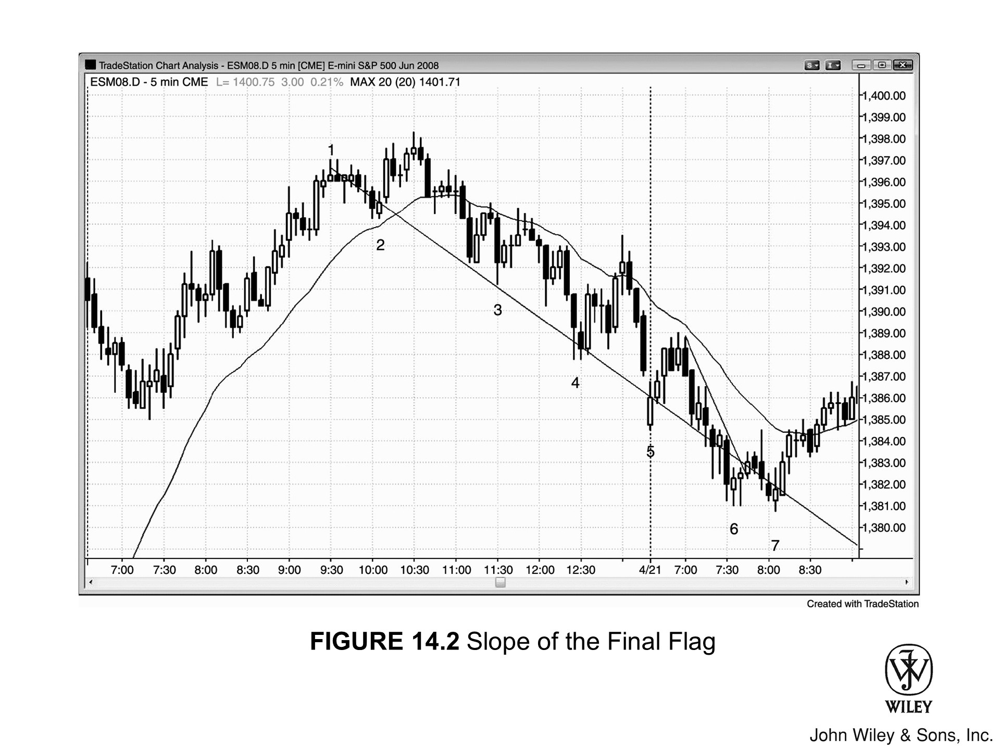
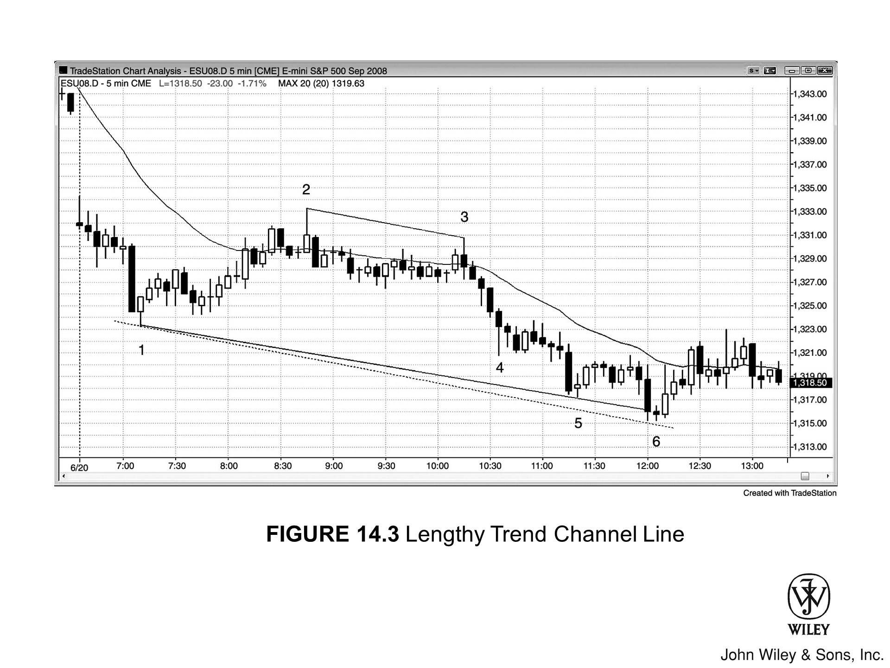

无论是在多头还是空头通道中，**趋势通道线**（Trend Channel Line）都位于价格行为相对于**趋势线**（Trend Line）的另一侧，且两者的斜率大体一致。处于**多头趋势**时，趋势线托住低点，趋势通道线压住高点，双双向右上方延伸。

一旦趋势走得太急、太远，趋势通道线便是**押注失败**（Fade）的利器。此时要留意**过冲**（overshoot）后的反转信号，若这是第二次穿越后的反转，胜算更佳。

趋势通道的两条边界线既可能大致平行，也可能呈现收敛或发散之势。当通道处于上升或下降途中，若双线逐渐收敛，便形成了**楔形**（Wedge），这往往预示着反转交易的良机。

通常而言，凡是向右上方倾斜的通道，皆可视为**熊旗**：

*   价格很可能会向下突破通道底部。这种突破可能引发趋势反转，也可能演变为**交易区间**，随后再选择向上或向下突破。
*   有时，市场会加速上行，直接冲破通道顶部。这种情况通常属于**高潮**（Climax）式上涨，随后行情往往反转回通道内，甚至经常跌穿通道底部；不过，这偶尔也标志着更强劲**多头趋势**中新一段上涨**腿**（Leg）的开始。

同理，向右下方倾斜的通道可视为**牛旗**：

*   市场很可能会向上突破。这既可能是趋势反转的开端，也可能演变为**交易区间**。
*   若市场跌穿下降通道的底部，这种突破通常会在 5 根 **K线** 左右宣告失败并引发反转，但也可能是新一轮更强劲下跌**腿**的起点。

### 趋势通道线的绘制方法

趋势通道线通常是趋势线的平行线。画好趋势线后，可以通过以下方式确定通道线：

*   **复制平行线**：复制一条平行线，将其拖向价格行为的另一侧即可。
*   **连接极点**：直接连接通道另一侧的“急速”高点（或低点）来绘制。
*   **最佳拟合**：像线性回归线那样，画一条“最佳拟合线”，哪怕只是凭肉眼估算大概位置也行。

---

### 多头趋势中的应用

在多头趋势中，我们连接两个低点画出趋势线。若要以此为基准创建趋势通道线，只需做一条平行线，将其推向趋势的对侧。

*   **包容原则**：这条线需要包容（即位于上方）界定趋势线的那两个低点之间所有的 K 线。
*   **具体做法**：找到中间最高的那根 K 线，将平行线拖到它的高点处，使其仅与这一根 K 线接触。
*   **灵活调整**：偶尔，将锚点选在上述两根 K 线范围之外，反而能更清晰地反映趋势。总之，怎么画最能突显趋势特征，就怎么画。

---

### 特殊情况：处理“急速”形态

有时，在一个原本相当紧凑的通道中，会突然出现单根向上的“急速”。

1.  **初步处理**：这种情况下，通常最好忽略这根突兀的 K 线，依据其余 K 线来确定趋势通道线的位置。
2.  **后续观察**：不过也要留心，市场最终可能会“认定”那根“急速”才是通道线的真正边界。
3.  **确认调整**：如果后续市场波动幅度变大，且高点都刚好止步于以那根“急速”为锚点的通道线处，那么你就应该采纳这个更宽的通道。

---

### 空头波段与独立绘制

趋势通道线不必非得是趋势线的平行线，也可以独立绘制。

在空头波段中，趋势线向下倾斜，位于价格高点之上。趋势通道线的绘制要点如下：

*   **斜率**：通常与趋势线相近。
*   **连接点**：它是连接空头波段中任意两个波段低点画出来的。
*   **有效性**：最有效的通道线应该能包容（即位于下方）波段内的所有其他 K 线，因此在选择锚点时，应以能达到此效果为准。

趋势通道线过冲（Trend channel line overshoots）与楔形（Wedges）关系极密，本质上可视作同一回事，交易手法也应一视同仁。

*   绝大多数楔形反转，都是由趋势通道线突破失败触发的；
*   反之，绝大多数趋势通道线的过冲反转，本质上也是楔形反转，哪怕形态不够完美，或者一眼看去并不明显。

如果趋势通道线是画成趋势线的平行线，楔形可能没那么显眼，出现的概率也低些，但依然常能找见。

***

通道之所以走出楔形，全因市场情绪紧迫。试举一例：在楔形顶（Wedge Top）中，趋势线比趋势通道线更陡峭。

*   **趋势线处**：顺势者进场，逆势者离场；
*   **趋势通道线处**：情形恰好倒置。

若趋势线斜率更大，便意味着多头迫不及待，回调（pullbacks）稍现即买；空头亦是如此，抛售（sell-offs）刚起便逃。

***

要区分楔形和平行通道，首要线索在于第二次回调。一旦第二段上冲（push up）掉头向下，交易者便可按以下逻辑操作：

1.  **确立形态**：画出趋势通道线，再复制出一条平行线。将这条平行线平移至第一次回调的底部，趋势线与趋势通道便由此确立。
2.  **识别支撑**：此线指明了支撑所在，多头拟于此处买入，空头亦欲在此止盈。
3.  **观察反应**：若多头在支撑位上方抢先买入，空头也提前平掉空单（shorts），行情便会在触及趋势线前掉头向上。

双方之所以如此，皆因紧迫感作祟，唯恐市场跌不到支撑位便绝尘而去。这意味着双方共识已成：趋势线理应更陡，上涨趋势实则更强。

市场一旦回升，交易者便可重绘 **趋势线**。此时无需再用 **趋势通道线** 的平行线，而是连接前两次 **回调** 的底部画出新线。

他们会发现，这条新线比上方的 **趋势通道线** 更为陡峭。这让人意识到市场正在构筑 **楔形**——众所周知，这往往是反转形态。为防市场并非形成 **楔形**，而是走出一个更陡峭的平行通道，交易者会基于这条新线做一条平行线，并将其平移至第二次上冲的顶部。

此时，多空双方都会密切关注：究竟是原先的 **趋势通道线** 能压制住反弹，还是价格能触及那条更陡的新线。若价格在原通道线处受阻回落，交易者便会判定：尽管第二次 **回调** 时买盘一度表现急切，但这股势头并未延续至第三次上冲。

*   **多头**选择在原先较平缓的 **趋势通道线** 处获利了结，意味着他们提早离场了。他们本寄望于市场能冲上那条更陡的 **趋势通道线**，如今却大失所望。
*   **反观空头**，他们急于做空，生怕价格摸不到那条更高、更陡的线，于是迫不及待地在原通道线处就开始进场。

如今，急切的一方变成了空头，而多头开始心生畏惧。目睹价格从 **楔形** 顶部回落，大多数交易者会按兵不动，等待至少 **两腿** 下跌，才会去寻找下一个主要形态的交易机会。

-   市场一旦走出向下第一腿，便会跌破楔形。行至某处，空头获利了结，多头重新入场，意图破坏楔形顶。

-   当市场反弹测试楔形顶时，空头会再度抛售。若多头开始获利了结，那是因为他们认定自己无力将价格推过前高。

-   一旦多头的获利盘与空头的新增抛压形成合力，达到临界规模，便会压垮剩余买家，迫使市场掉头向下，走出第二腿。

-   最终，多头回归，空头止盈，双方都看清了这是个“两段式回调”，并开始揣测多头趋势能否恢复。至此，楔形形态演绎完毕，市场将去寻找下一个形态。

既然人人都知道 **趋势通道线** 过冲后往往会反转，为何这种反转还是频频发生？难道那些抢跑的入场者不会拦住价格，让它根本碰不到通道线吗？

坊间通俗的解释是：那些站错队的新手死扛亏损单，直到痛苦到了极限，然后突然集体“投降”离场。这种集中出逃制造了行情的“喷出”或抛物线 **高潮**。

举个例子，在 **多头通道** 中，行情的演变过程通常如下：

1.  市场一路震荡上行，摸到了某个阻力位——哪怕这个阻力位并不起眼——然后一举刺破。这成了压垮骆驼的最后一根稻草，仅存的空头再也扛不住了，瞬间缴械投降。
2.  最后的空头刚一争相回补，许多头脑发热、缺乏经验的多头见状便兴奋追涨，火上浇油，助推价格猛烈突破 **趋势通道线**。
3.  这波 **急速** 拉升逼得更多残余空头回补，而惊人的涨幅又诱惑更多天真的多头进场做多，整个过程自我强化，愈演愈烈。
4.  但紧接着，能靠回补推高价格的空头已经所剩无几。当市场突然不再加速，转而停顿并开始掉头向下时，那些凭情绪而非逻辑交易的狂热多头瞬间慌了神。
5.  他们猛然醒悟，自己可能买在了潜在 **高潮** 的最高点，于是争先恐后地离场。随着买家绝迹，被套的新多头恐慌抛售，市场瞬间变得一边倒，完全由卖家主宰，价格唯有下跌一途。

这就是传统的逻辑，至于真假，其实并不重要。事实上，在 Eminis 这种由 **机构交易者** 主导、且大部分交易可能由计算机生成的庞大市场里，上述心理因素很可能对反转起不到什么实质作用。

聪明的交易者不会轻易逆势操作，除非看到以下两种信号之一：

*   要么是强 **趋势线** 被突破后出现 **回调**；
*   要么是 **趋势通道线** 过冲后出现了反转。

试举一例：在多头趋势中，聪明钱 (Smart Money) 会不断买进，直至将价格推升穿过趋势通道线，随后获利了结。期间或许会出现几次失败的反转尝试，市场甚至可能加速上攻，形成更为陡峭的趋势通道线。

顺带一提，若你发现自己不得不反复重画趋势通道线，这通常是个信号：**你的方向做反了**。
*   你苦寻反转，趋势却愈发强劲。
*   此时理应顺势而为，而非执迷于捕捉反转。

***

最终，市场会对哪一条才是“终极”趋势通道线达成共识，届时你将看到一次确凿有力的反转。

*   **操作建议**：请保持耐心，在此之前只做顺势；除非趋势已清晰反转，否则切勿逆势操作。
*   **市场动态**：就在获利盘兑现离场的同时，许多人会反手做空，大量原本空仓的交易者也会进场开空。
*   **入场信号**：其他聪明的交易者会等待图表出现反转信号——无论是在 1 到 5 分钟图，还是任意规格的成交量图或 tick 图上，各类图表中都会有交易者在反转确立时入场。

***

一旦认定见顶，这些聪明钱 (Smart Money) 便不再考虑买入：

1.  **坚持持有**：他们手握空单，即便价格再创新高，即便当前头寸出现浮亏，大多数人仍会坚持持有——因为他们坚信顶部已成，或已近在咫尺。
2.  **加仓做空**：事实上，许多人会在新高上方加仓，既为摊低空单均价，亦为助推市场下行。
3.  **离场条件**：这些大资金玩家一心做空，不会轻易被吓退，除非遇到极罕见的“二次入场失败”或巨大的失败（例如在 Emini 中价格反向超过其入场点 3 个点）。

**买盘已竭，市场唯有下跌一途。**

尽管成交量极不可靠，决定是否交易时无需关注，但在关键转折点——尤其是底部——成交量往往巨大。每一笔交易，本质上都是一家或多家机构在买入，同时有一家或多家机构在卖出。市场底部的主要买家，既包括获利了结的空头，也包括新进场的多头。

既然如此，为什么还会有机构在熊市的最低一个 tick 处卖出呢？

*   **策略惯性：** 每家机构使用的策略都经过严密测试，被证实有利可图，但即便如此，它们仍有 30% 到 70% 的交易是亏损的。那些在最低 tick 卖出的机构，正是熊市一路下跌中不断在创新低时卖出的同一批机构。它们之前的许多次入场都赚到了钱，因此只是机械地沿用这些策略，直到趋势反转变得清晰可见。没错，在熊市最终底部的那个 tick 做空确实会让它们亏损，但凭借之前所有空单积累的利润，它们最终依然是盈利的。
*   **高频交易（HFT）：** 还有一些高频交易公司，哪怕只有一个 tick 的利润也要剥头皮，这种操作会一直持续到熊市的最低点。请记住，低点总是位于支撑位。如果系统显示有利可图，许多高频交易公司会在支撑位上方一两个 tick 处做空，试图抓取最后这一个 tick 的利润。
*   **对冲需求：** 另一些机构的卖出行为，则是为了在其他市场（股票、期权、债券、货币等）进行对冲。因为它们认为，加上这笔对冲后，整体的盈亏比（reward-to-risk ratio）会更优。

这些巨大的成交量并非来自小型散户，因为在主要转折点，散户贡献的成交量不足 5%。

过冲（overshoot）之后之所以发生反转，是因为这种模式已在机构交易心理中根深蒂固，反转是必然的结果。即使机构不看图表，也会有其他标准提示它们市场已经走得太远，是时候离场或反手了。而这一时机，必然与价格行为（Price Action）交易者眼中的信号不谋而合。

别忘了，无数 **聪明钱** (Smart Money) 各自为战，都在竭尽所能地从市场中获利，而 **价格行为** 正是这一过程留下的不可磨灭的足迹。在一个足够大的市场中，价格行为无法被操纵，其本质也始终如一。

最后提一个次要的观察点：**最终旗形** 的斜率，往往能大致预示随后新 **趋势** 的斜率。这一点对交易者的实战价值有限，毕竟下单前还有更多关键因素需要考量，但这仍是一个有趣的现象。

***

**[图 14.1] 测试趋势通道线**

**趋势通道线** 的指向与趋势一致，但位于 **趋势线** 的对侧。将其向右延伸，观察价格穿越该线时的反应：是发生反转，还是无视该线、趋势反而加速？

绘制趋势通道线通常有两种方法：

1.  **平行法**（见 [图 14.1] 中的虚线）
    基于趋势线（实线）做一条平行线，将其平移至价格走势的另一侧。落点应选在用来绘制趋势线的那两根 **K线** 之间的某个摆动点上。
    *   **选点标准**：必须确保该线与趋势线之间的所有 K 线，都被完整包裹在两条线之内。

2.  **直接连接法**（见 [图 14.1] 中的点状线）
    直接连接各摆动点，独立于趋势线。

> 当然，你也可以随手画一条“最佳拟合线”，但这通常对实战没什么帮助。

***

**[图 14.2] 最终旗形的斜率**

在 Figure 14.2 中，多头趋势最终旗形的斜率，为随后的空头趋势指明了方向。连接 K 线 1 和 2 的线性回归趋势线，构成了随后抛售行情的粗略空头趋势通道线，这波抛售一直延续到了次日。

这条线可能促成了 K 线 7 处的买盘，但 K 线 7 的做多理由其实很简单：
*   既是对开盘首小时趋势线的突破；
*   也是对跌破 K 线 5（开盘低点）后的第二次反转尝试。

如果最近的价格行为已给出交易依据，那么据此下单通常远好过回溯 30 根甚至更多的 K 线。

> 事后来看，尽管 K 线 2 之后市场创出新高，但多头趋势实际上在 K 线 1 就已终结。跌至 K 线 2 的这波走势，是空头通道中的第一条下跌腿。

***

### 关于此图表的深入探讨

在 Figure 14.2 中，昨日最后几小时市场处于空头通道内，因此第一次向上反转尝试的成功率并不高。

跌破趋势通道线的走势在当日首根 K 线（一根多头趋势 K 线）处向上反转，但这一反转仅持续寥寥数根 K 线，随即构筑出突破回调做空形态。

***

### Figure 14.3 跨度很长的趋势通道线

在 Figure 14.3 中，基于 K 线 2 和 3 绘制趋势线，并取其平行线平移至 K 线 1，向右延伸。

*   **形态观察：**
    *   K 线 6 并未刺穿这条趋势通道线。
    *   此外，该线锚定于 K 线 1，而 K 线 1 并不在 K 线 2 和 3（绘制原始趋势线的基准点）之间。

*   **交易逻辑：**
    *   交易者应时刻审视各种可能性。
    *   若当时发生刺穿并反转，那么从 K 线 5 低点开启两段式反弹的胜算便会增加。

连接 K线 1 和 5 的低点画出一条简单的趋势通道线，虽然 K线 6 刺穿了这条线，但这并不是做逆势交易的好依据。原因很简单：K线 1 和 5 隔得太远，而 5 和 6 又挨得太近。

趋势线最好是等到有“第三条腿”测试时才最有效。眼下，K线 5 和 6 其实还在同一条腿里（K线 4、5、6 构成了向下的三推）。不过这笔交易还是值得做的，理由如下：

*   **盈亏比划算**：因为 K线 6 很小。
*   **形态支持**：这里还走出了一个“收缩阶梯”形态（后面会细讲，简单说就是低点不断创新低，但突破幅度一波比一波小）。这意味着空头动能正在衰竭，支持进场做多。

### 图表深度解析

Figure 14.3 的大幅跳空低开就是一个突破——凡是大缺口皆为突破——当天开局便是“开盘即跌”的空头趋势日。

开盘区间狭窄，市场进入突破模式，紧接着出现了一根巨大的空头突破 K线。但是要注意：
*   当空头趋势已经走了很远，突然出现一根异常巨大的空头趋势 K线，这通常是**抛售高潮**。
*   这种高潮之后，往往会接一个至少包含两段结构、持续至少 10 根 K线的横盘或向上回调。

随后的走势细节如下：

*   **K线 1**：是强劲的多头反转 K线，搭建了“突破失败做多”的架构。
*   **K线 3**：随后的横盘回调走了两段，在 K线 3 处结束——K线 3 试图突破窄交易区间但失败了，并且和 K线 2 构成了近似的双顶。
*   **整体形态**：尽管盘中大部分时间都在横盘，但全天来看，开盘在最高点附近，收盘在最低点附近。这是一个典型的“趋势型交易区间日”，分为上下两个交易区间。
