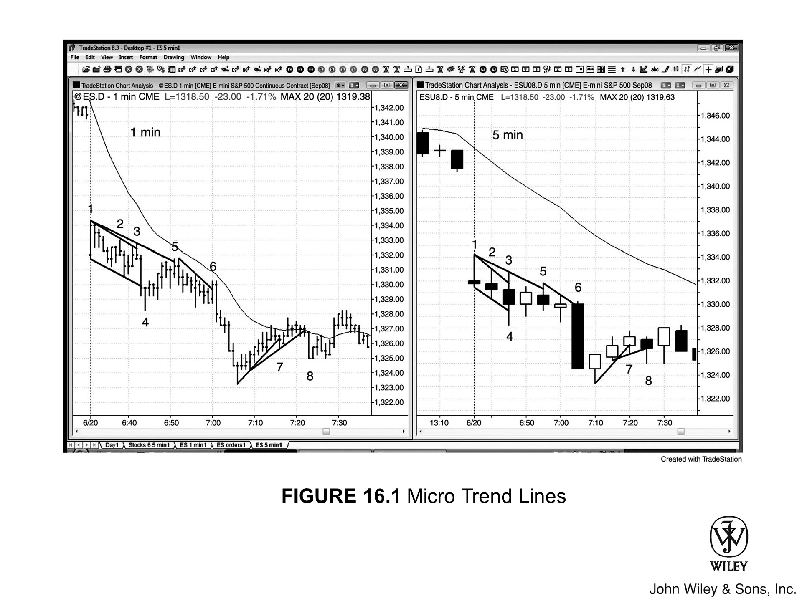
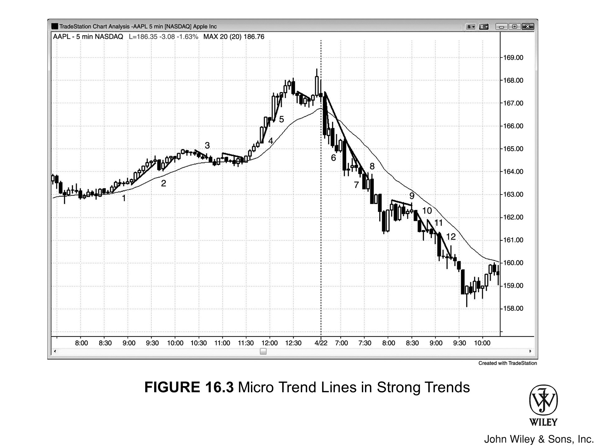
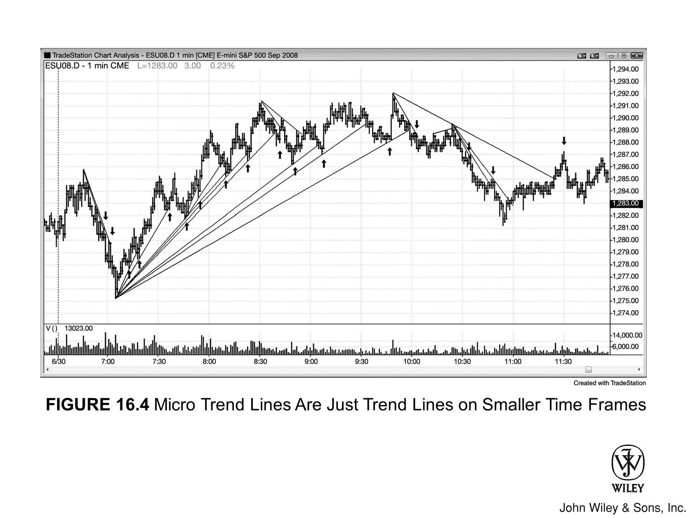

## 微型通道简介

**微型趋势线**可以画在任何时间周期上，跨度通常在 2 到约 10 根K线之间，大多数K线会触及或接近这条趋势线，而且这些K线通常相对较小。一般来说，沿着这些K线的另一侧端点也能画出一条**趋势通道线**，由此形成的极窄通道就叫作**微型通道**。与普通通道中常见的回调不同，微型通道几乎没有回调，即使偶尔出现也幅度极小，因此是一种极为紧密的通道。

K线数量越多、K线越强（比如实体大且方向与微型通道一致的趋势K线）、影线越短，微型通道就越强，首次回调也就越难反转趋势。微型通道有时能延续 10 根K线以上；有时走约 10 根K线后出现一次小幅回调，然后再续走约 10 根。不管你把它看成一个大的微型通道（微型通道本质上是窄通道的一种）、两段被小幅回调分隔的连续微型通道，还是一个大型窄通道，交易方式都是一样的。趋势非常强劲，交易员会预期反转尝试失败并演变为回调，趋势继续运行。

### 程序化交易与微型通道

十年前，交易员把微型通道看作程序化交易的信号。如今绝大多数交易都由计算机完成，再说"微型通道是程序化交易的信号"已毫无意义——因为图表上每一根K线都是程序化交易的产物。微型通道只是程序化交易的一种特定形式，背后可能是多家机构同时运行相同策略。起初由一家或几家机构发起，一旦动能形成，**动能型程序**就会识别并顺势交易，进一步强化趋势。当趋势开始突破阻力位时，**突破型程序**随之介入。其中一部分顺势交易，另一部分则开始逆势分批建仓，或分批了结此前在低位买入的多头仓位。

### 突破与通道发展

最终，总会有一根K线穿透趋势线或趋势通道线，形成**突破**。**多头微型通道和空头微型通道**可以出现在多头趋势、空头趋势以及交易区间中，所处环境决定了具体的交易方式。多头通道和空头通道都可能向上或向下突破。和所有突破一样，后续无非三种结果：突破成功并向该方向延续，突破失败形成小幅高潮式反转，或市场转为横盘、形态演变为交易区间。

和任何突破一样，交易员要么顺着**突破**方向入场、预期趋势跟随，要么反向入场、押注突破失败。**突破、失败的突破和突破回调**这三者关系密切，详见第二册。作为参考原则：交易员会对比突破的强度与反转尝试的强度，哪边明显更强，市场就更可能往那个方向走；若两者强度相当，则需要等待更多K线出现，再判断下一步方向。

## 趋势中的微型通道交易

### 牛旗与熊旗

当**空头微型通道**出现在多头趋势中，通常构成一面**牛旗**或牛旗的最后一腿。交易员会等信号K线出现，然后在其高点上方挂**买入突破单**，借助空头微型通道和牛旗的突破入场做多。当**多头微型通道**出现在空头趋势中，通常构成**熊旗**或熊旗的最后一腿，交易员会在任意信号K线下方做空。

### 多头趋势中的上升微型通道

如果多头趋势中形成的不是空头微型通道充当旗形，而是**上升微型通道**（多头微型通道），那么首次向下突破（即首次回调）通常走不远，会被积极买入。多头微型通道的K线越多，空头突破反转多头趋势的可能性就越低。举例来说，如果多头趋势中出现一段 5 根K线的多头微型通道，那么在第 5 根K线低点附近及以下，买方数量很可能远超卖方。一旦市场跌破第 5 根K线低点，该K线便对多头通道构成了**空头突破**，但后续抛压很可能只持续一两根K线，因为多头会急于在这段强势微型通道多头趋势的首次回调中买入。

要记住，许多交易员已经盯着这段上涨行情看了 5 根K线，一直在等任何回调机会入场做多。他们会积极地在第 5 根K线下方买入，也会在回调K线高点上方买入——那是一个**失败突破买入信号K线**（即**高 1 买入建仓形态**）。如果多头仓位触发后，在一两根K线内出现**空头反转K线**，就形成了**微型双顶卖出信号**的建仓形态。也可以把它理解为多头微型通道向下突破后的回调，即便该K线的高点高于微型通道的最高K线也是如此——那样的话，它就是一次**更高高点反转**，相当于主要趋势反转（MTR）的微型版（反转详见第三册）。

### 微型通道中的激进交易策略

交易员不必非得等回调才做多，这一点很重要。许多有经验的交易员在多头趋势中看到牛市微型通道的第二根或第三根K线时，就已经判断出市场正处于一轮极强买盘程序的早期阶段——**动量买盘程序**也在积极买入。他们会试着复制程序的做法：每根K线收阳就买，同时在每根K线收盘价下方一两个 tick、以及前一根K线低点上方一两个 tick 挂**限价单**。如果微型通道里最大的回调只有 5 个 tick，他们就会在 3 到 4 个 tick 的回调处挂单买入。他们预期：第一次跌破前一根K线低点时，反而会吸引更多买盘进场——所以尽管出现了回调，最近一笔买入大概率仍会盈利。一路涨上来都在赚钱，就算最后一笔入场在回调来临时小亏或打平出场，也无所谓。

### 不同市场环境中的微型通道

和其他通道一样，**牛市微型通道**可以出现在**交易区间**中，也可以出现在多头或空头趋势中。出现在多头趋势里时，价格继续上涨的确定性更高，交易员应在前一根K线的中部或底部附近寻找买入机会。当微型通道特别紧密时，在高时间周期图表上看可能就是一段**急速**走势；随后可能跟着一个更宽的通道，目标位可以参考该紧密微型通道高度所对应的**测量移动**目标。牛市微型通道若出现在空头趋势中，则构成**熊旗**，交易员应等待下行**突破**或突破后的回调再做空。若牛市微型通道出现在空头趋势可能的低点之后，它可能演变为空头趋势的**最终旗形**，届时向上突破而非向下，这一突破本身就可以成为引发多头趋势的急速走势。多头突破出现时，通常是在一次**低 1、低 2 或低 3 失败**之后。

### 止盈与突破失败

微型通道本质上是一个倾斜的窄交易区间，因此具有很强的**磁力效应**，会阻止突破走远。它也足够紧密，有时表现得像一段**急速**走势，随后跟着更宽的通道，形成**急速与通道**趋势。微型通道的突破通常只持续一两根K线，主要驱动力是**止盈**。举个例子：牛市微型通道（向上倾斜的微型通道）中，某根K线跌破前一根K线的低点，这就是微型通道的下行突破。主要是多头在止盈，也有少量空头在做空。一两根K线内，新的买家进场，部分空头平仓，市场通常随即涨过前一根K线的高点。

有些交易员会将此视为微型通道的**突破失败**，在市场涨过前一根K线高点时买入——对他们来说，这是一个**高 1 买入建仓形态**。另一些交易员则认为趋势正在向下反转，他们会等接下来几根K线形成 **HH** 或 **LH 的突破回调**，然后在前一根K线低点下方做空。整体**背景**能提供线索，帮助判断哪种结果概率更大。例如，若市场处于强空头趋势，牛市微型通道只是一次**回调**，那么微型通道下行突破后继续下跌的概率更高。如果市场涨回突破K线上方，空头会在前一根K线低点下方挂**突破单**做空。反之，若牛市微型通道是多头市场中从**交易区间**向上突破后形成的，那么微型通道的下行突破大概率只是多头趋势中的一次回调，多头会在前一根K线高点上方一个 tick 处挂买入订单。

## 基于微型通道的入场建仓形态

### 顺势入场建仓形态

趋势线的突破为**顺势入场**提供机会。举例来说，若牛市微型通道中市场处于 **Always-in** 做多状态，某根K线低点跌破微型牛市趋势线，那么在该K线高点上方买入就是一笔可靠的交易。这是一个小型但强势的**单K线牛旗**（即**高 1 买入建仓形态**），也是一个**突破失败买入信号**。在低时间级别图表上，它可能表现为一次**两段式回调**，但最好不要去看——信息量太大，短时间内难以处理，反而容易误操作或错过这笔交易。

### 交易决策依赖背景

如果多头微型通道处于交易区间或空头趋势中，而非强势多头趋势中，那么在空头突破失败后买入之前，需要考量的因素更多。若通道位于交易区间顶部，通常不应买入失败的突破，而应等待观察——向上的反转是否会在此停滞，并形成突破后的 **HH 回调**。若仅上涨一两根K线便出现**空头反转K线**，在临近交易区间顶部的位置，这往往是一个可靠的做空**建仓形态**（**微型双顶**，将在第三册中介绍）。

如果多头微型通道是**均线**下方的**熊旗**，就只应寻机做空——空头的抛压大概率会压过买回调的多头。等通道向下突破，再等失败，再等最后一次向上推进。若那次向上的反转在一两根K线内于均线处形成**空头反转K线**，通常就是一个可靠的**突破回调做空建仓形态**（**低 2**）。市场从多头微型通道下方突破后回调至略高的高点，最终向下反转，便完成了熊旗下方的突破**建仓形态**。

### 多次入场尝试的管理

与任何多头通道向下突破的情形一样，之后可能出现一次回调，随后卖压恢复。那次回调可以是 **LH**，也可以是 **HH**（HH 指K线高点超过最近一个波段高点，通常是多头通道中最高的那根K线）。由于大多数趋势反转尝试都会失败，**空头突破**失败、转变为多头趋势中的一次回调后继续上涨的概率更高。交易者应在突破K线高点上方一个 Tick 挂买入突破单，以备空头突破失败、多头趋势恢复。

不过要意识到，这次做多可能是**多头陷阱**，会将自己套入亏损的多头仓位。记住，虽然多数反转尝试会失败，但也有成功的。市场未必从空头突破中急速拉回，有可能只是短暂回调，形成小幅 HH 或 LH，随后卖压重新接管，演变为成功的**趋势反转**，进入空头腿或空头趋势。因此，若整体价格行为显示反转信号合理，交易者必须准备好在多头入场K线低点下方反手做空——此时这就是一个**突破回调做空建仓形态**。每当一次突破失败，这次失败本身就形成了顺原有趋势方向的交易机会。若这次也失败，它便成为最初空头突破的**突破回调**（两次相反方向的失败构成突破回调），同时也是向下反转趋势的第二次尝试。

### 被套交易者策略

若**突破回调做空**触发（即K线跌破前一根K线低点一个 Tick，前一根通常是多头突破K线），就观察最近几根K线实体的大小。若这些K线是**多头或空头趋势K线**，那么这次第二次失败很可能演变为成功的二次入场做空机会。第一次失败是空头在向下突破失败中亏损，被套在场外；第二次失败是多头被套入亏损的多头仓位，而这笔仓位正是由通道下方空头突破失败所诱发的。若市场此时重新向下，便出现了**空头被套在场外、多头被套在场内**的局面。一般来说，多空双方同时被套时，下一个**建仓形态**的成功概率更高。若这些K线更像**十字星**，市场大概率会进入交易区间，但向下突破的概率仍然更高。若判断不确定，就等待——大多数交易者此时也会拿不准，交易区间通常随之而来。

### 在低时间级别操作

绝大多数**微型趋势线突破**在1分钟图上表现为一两段式回调，但应避免在1分钟图上交易，否则大概率亏钱。多数交易者无法把握全部信号，结果总是接入太多亏损信号、错过太多盈利信号。最好的交易往往形态快、触发快，因而很容易错过；而许多亏损交易形态缓慢、入场从容，反而将交易者引入错误方向。

### 向上突破的情形

多头微型通道也可能向上突破趋势通道线，试图形成更陡的多头趋势。若失败并出现强势**空头反转K线**，这次**买入高潮**便是一个潜在的做空**建仓形态**。

## 延伸微型趋势线与高潮行为

当**微型趋势线**延伸至约10根或更多K线时，出现可交易**反转**的概率会大幅提升。这类趋势不可持续，本质上是一种**高潮**，之后通常有回调或反转。在这种高潮行为之后，应准备好在**突破回调**处入场。这是反转趋势的第二次尝试——第一次尝试是原始趋势线的突破。

## 强趋势中的微型趋势线

**微型趋势线突破**不只在微型通道中重要——只要当前存在明显的强趋势，它同样关键。假设市场处于强劲的空头趋势中，连续出现大的**空头趋势K线**，相邻K线几乎没有重叠，四五根K线都没有回调，你自然想找机会做空。这时要盯紧每一条**空头微型趋势线**，一旦某根K线向上刺穿它，就在那根K线低点下方卖出。任何对趋势线的刺穿都构成一个**突破失败的做空建仓形态**，入场点在突破空头微型趋势线那根K线低点下方一个 tick（即**低1做空建仓形态**）。

### 两K线趋势线

即便只用相邻两根K线画出的短小陡峭趋势线，也常常能产生**顺势交易**的建仓形态。趋势足够陡峭时，一根小回调K线或**暂停K线**有时会轻微刺穿这条极短的**微型趋势线**，刺穿之后便可作为顺势入场的**信号K线**。在 Emini 中，有些刺穿幅度甚至不足一个 tick，但仍然有效。

## 回调中的微型趋势线

趋势之后出现回调时，回调段里往往能看到**微型趋势线**。以多头趋势的回调为例：回调段形成一段持续约 3 到 10 根K线的**空头微型趋势**，随后价格向上突破该空头微型趋势线。理论上这构成一个突破失败的做空形态，但关键在于——这一切发生在多头趋势途中，而且几乎总在**均线**附近或上方。此时做空并不合适：你实际上是在多头趋势中、上升均线附近、**多头旗形**底部持有空仓，这是一个概率极低的交易。

既然此处做空大概率失败，不如提前预判，准备好在失败发生的那一刻买入——也就是在**被套空头**出场的位置入场。这样的多头入场属于**突破回调买入**：市场向上突破空头微型趋势线后小幅回调，形成略低的低点或更高的低点，随后重新上涨，方向与突破方向一致，也与当天的主要趋势一致。

### 微型趋势线交易的核心原则

必须牢记：**微型趋势线只应用于寻找顺势建仓形态**。不过，一旦趋势发生反转——比如出现**多头趋势线突破**，随后从**更高高点**反转向下——即便价格在均线附近甚至略高于均线，也应该开始寻找**微型趋势线做空建仓形态**。

## 从时间周期角度看微型通道

和所有图表形态一样，**微型通道**在低时间级别与高时间周期图表上呈现出截然不同的面貌。微型通道或其他窄通道中的趋势K线通常幅度不大、相邻K线重叠较多，但趋势强度足以在高时间周期图表上表现为一根大的趋势K线或一组趋势K线。这意味着它在高时间周期上往往呈现为一段**急速走势**，之后通常跟随一个较宽的通道，如同典型的**急速与通道**趋势结构。此外，微型通道内部虽然看不到回调，但切换到足够低的时间级别后，便能看到大量回调。

---

## 图 16.1：微型趋势线

### 图 16.1 解析

小趋势线全天可以产生大量**剥头皮**机会，在 1 分钟图上尤为明显——尽管 1 分钟图很少值得单独用来交易。图 16.1 中，左侧是 1 分钟 Emini 图表，数字对应右侧 5 分钟图上相同的K线。两张图都说明：小趋势线的突破失败可以带来有利可图的**押注失败**交易。图中省略了 1 分钟图上的其他交易机会，因为这张图的重点在于展示：5 分钟图上的微型趋势线对应 1 分钟图上更明显、更长的趋势线。只要能读懂 5 分钟图，就不必再额外盯着 1 分钟图下单。这些交易中，很多在 1 分钟图上都可以做成有利可图的剥头皮。

注意，5 分钟图上有几处**微型趋势线**突破很容易被忽视，幅度甚至不足一个 tick。例如，K线 3、5、6、7 都是 5 分钟图上微型趋势线的突破失败，大多数交易员根本不会察觉。其中 K线 5 处的突破失败尤其值得关注，带来了一次不错的做空剥头皮机会——那是第二次尝试向上突破**空头趋势线**（K线 3 是第一次）。

K线 7 处，多头微型通道向下的**突破失败**构成一个做多机会，但风险较高，最多也只是一次剥头皮。由于当时处于回调到均线附近的**空头旗形**中，更合理的预判是上涨动能将会停滞，形成**突破回调的做空建仓形态**，而最终也确实如此演变。

价格行为交易的逻辑在最细微的层面同样成立。看1分钟图上的K线8——它构成了一个**突破回测高点**的多头建仓形态（测试的是熊市低点那根K线的最高点）。入场后两根K线，市场确实下探测试了K线8信号K线的低点，但保护性止损设在信号K线下方，不会被触发。同样值得注意的是，这段1分钟图里还藏着一个更小的主要反转形态：市场从图表低点向上拉出了一段微型多头趋势，形成一条向上的**多头微型趋势线**；K线7处这条趋势线被跌破，随后出现**高点测试**，测试的是这段微型多头趋势的极端高点。由于形态太小，从高点回落至K线8的这次下跌只能算一次剥头皮行情，这在预期之中。

在5分钟图上，K线8并不构成多头建仓形态——因为它只是**空头趋势**中的一次回调，空头趋势日里不应该在回调顶部做多。正确的做法是：当你看到**微型趋势线买入触发信号**出现时，要做好准备押注它会失败，在被套多头被迫止损出场的位置精准做空。

---

## 图16.2：微型趋势线突破失败

### 图16.2 解析

在陡峭趋势中，就算只用两三根连续K线画出来的趋势线，只要小幅突破后立即反转回来，同样能形成有效的**顺势入场**机会。每一次新的突破都会成为一条更长、更平坦趋势线的第二个锚点，直到反方向的趋势线开始占据主导，趋势就此完成反转。

图16.2中，K线1向下刺穿一条三K线趋势线后立即反转向上，在前一根K线高点上方一个Tick处形成做多入场。

K线2跌破一条六K线趋势线。交易员会在其高点上方挂**买入突破单**；若未成交，则将突破单移至下一根K线高点，最终在K线3处成交。这是一个**高1做多入场点**。在多头趋势中，**多头微型通道**遭遇的**空头突破**大多以失败告终，转化为**高1做多建仓形态**。由于微型通道通常是在突破某个前期高点的过程中向上延伸的（此处正是突破了当日第一根K线的高点），这个**高1**通常也同时是一个**突破回调做多建仓形态**。顺带一提，K线2的前一根K线曾构成潜在的做空形态，依据是**微型趋势通道线**（图中未标出）的失败突破——该通道线与从K线1之前延伸上来的三K线微型趋势线平行。不过当时向上动能太强，没有二次入场信号不宜贸然做空；但这恰好说明**微型趋势通道线**确实能形成**逆势交易**机会。

K线4是一根小的**内包K线**，向下刺破了一条两K线趋势线（刺穿部分图中未标出）。可在这根小内包K线高点上方一个Tick处挂买入突破单入场。

K线5突破了当日的**主要趋势线**（持续约一小时的趋势线意义更为重要），因此交易员会预期接下来更可能出现**两段式回调**。K线5之后那根K线向上突破**空头趋势线**，随即在K线6的**LH**处触发做空信号。当K线5之后的K线都是小**十字星**时，通常最好等更大的**趋势K线**出现再入场；尽管如此，这些趋势线反转仍然在亚马逊（AMZN）上带来了30到50美分的可盈利剥头皮机会。K线5是相对紧凑多头通道的第一次突破，此时不宜做空，应等**突破回调**出现后再考虑入场。

K线6构成了一个合理的**LH突破回调做空入场点**，目标是向下剥头皮至均线附近。这不是一笔好的**趋势反转**交易，因为此时既没有先测试均线，也没有再测试多头趋势高点。

K线6是多头趋势中的一次**微型趋势线做空**信号。若信号出现在均线附近，这种交易通常不划算。但此处情况不同——向下到均线还有充足空间，加上之前刚走出**楔形顶部**，接下来大概率会走出**两段式回调**。

普通通道里回调频繁，**微型通道**则截然不同——**缺乏回调**正是它的核心特征之一。以K线8之前那根K线开始的多头微型通道为例：第一腿在出现小幅回调的K线9处结束。有些交易员把后续四根K线看作同一通道的延续，认为K线9只是一次回调；另一些交易员则把K线9视为第二段**微型通道**的起点。其实两种看法都无所谓——因为随后向K线10的横向走势已将两者全部跌破。

#### 图表深度解析

图16.2中市场**跳空高开**，突破了昨日收盘价，第一根K线是**多头趋势K线**。实体比较强，下方带有影线，两者都显示出买压。昨日收盘时也出现了几根多头实体，同样体现出多头的强势，所以这根K线本身并不构成强力的**信号K线**，不足以将其当作可能的失败突破建仓形态来做空。第二根K线带有空头实体，跌破了第一根K线的低点，形成合理的**突破回调多头建仓形态**，暗示当日可能走出**始于开盘的趋势**多头日。随后连续出现4根**多头趋势K线**，形成一段向上的**急速**走势，但最后一根K线振幅很大，可能预示一定程度的衰竭。由此产生了第一个**回调多头建仓形态**，K线3是一根强势的入场K线，同时也是突破开盘高点之后的**突破回调**多头入场机会。由于当天第一根K线的振幅异常大，后续走出大约一倍的**测量移动**上涨是合理的，事实也确实如此。

---

## 图16.3：强趋势中的微型趋势线

### 图16.3解析

强趋势中，即便只用相邻K线画出的小趋势线，其**失败突破**往往也能提供不错的**顺势**入场机会。其中很多在1分钟图上表现为**两段式回调建仓形态**（**ABC回调**），但只要你在5分钟图上看到了这些**假突破**，根本不需要切换到1分钟图。

实际交易时，大多数情况下不需要真的在图上画出趋势线，因为趋势本身足够明显，肉眼就能辨别。

图16.3中，AAPL的5分钟图出现了许多基于**微型趋势线****失败突破**的**顺势**入场机会。趋势坡度较陡时，应该只找**顺势**交易机会，不要做小反转。比如K线3虽然向上突破了一条**空头微型趋势线**，但这段空头走势实际上是强多头趋势中的一面**多头旗形**——市场已经在均线上方运行了超过20根K线。此时应该只找买入机会，不能做空，尤其不能在刚好位于均线上方的位置做空。

K线2向下突破了一条**多头微型通道**，而这发生在强多头趋势中，预期该突破会失败。这构成了可靠的**高1买入建仓形态**。

K线10和K线12都是陡峭窄通道向上的**首次突破**，因此都不是好的多头入场点。虽然K线12是下跌途中第二次向上突破，但从K线10开始的下跌持续了数根K线且坡度很陡，形成了一条新的小**微型通道**，而K线12只是首次尝试突破这条新通道（K线10和K线12都是**低1卖出信号K线**）。

K线9是一根**空头反转K线**，也是小**三角形**向下突破的**信号K线**。**三角形**是一种以横盘为主的交易区间，在一个或两个方向上各有3次或以上的推进。K线9前一根K线完成了向下的第三次小幅推进，这个交易区间正是在那根K线处演变为三角形。由于当天第一根K线起市场就处于非常紧密的**空头通道**中，认为这个三角形是可靠的多头建仓形态是不合理的。事实上，大多数交易员此时尚未将其识别为三角形，仍在持续寻找做空机会。等到K线9这根**空头反转K线**完成第三次向上推进，交易员才确认这是空头趋势中的**三角形**形态，构成可靠的卖出建仓形态。K线9虽然带有多头实体，但其实是一根小**十字星**，买压并不强。不过，由于收盘价位于自身中点以下，仍然算是一根**反转K线**。如果K线9带有空头实体，信号会更强。

K线8之后第三根K线结束前，这段紧密的**空头通道**内部还嵌套了几条更小的**微型通道**。交易员把这段下跌看作一条带有几次小回调的大**微型通道**、三条连续的微型通道，还是一条大的窄空头通道，其实并不重要——交易方式都是一样的。这段下跌非常强劲，在高时间周期图表上很可能表现为强劲的**急速**走势。聪明的交易者一直在寻找任何回调来做空，预计回调只是空头**止盈**，之后价格会继续下行而非出现趋势反转。在这种强趋势中，交易员会在前一根K线高点上方做空，也会在任何回调低点下方做空，比如在K线9、10、12的低点下方入场。

许多多头趋势的回调幅度很小，但最终带来了可观利润，同时也孕育着**低概率的做空建仓形态**。比如，K线 10 和 K线 12 都是**十字星**，附近的其他K线也带有影线，这正是**双向交易**的信号。市场一旦出现双向交易的迹象，往往意味着正在向**交易区间**演化——在这种情况下，在低位做空、押注正在形成中的交易区间会被向下突破，成功概率就很低了。向下波段交易的成功概率可能只有 40%。不过，由于潜在回报是风险的数倍，交易者方程依然显著为正。偏好高概率交易的交易员不会在 K线 10 或 K线 12 下方入场做空，而是会等待高概率的**反转**信号再做多（比如日内低点处经历连续**卖出高潮**后出现的**多头反转K线**；反转形态在第三册中讨论），或者等**回调**出现再做空（比如 K线 9 的三角形形态），又或者等强劲的**空头急速**走势出现再做空（比如 K线 11 收盘价所在位置——这是向下突破**楔形底**；K线 11 前一根K线的低点与 K线 12 的高点之间形成了**测量型缺口**，这一概念在第二册中讨论）。

#### 图表深度解读

图 16.3 中，昨日以一根强劲的**多头趋势K线**收盘，突破了漫长多头趋势之后形成的大致水平的**多头旗形**。这是一个**最终旗形做空建仓形态**，并在今天第一根K线处触发。交易员可以在多头趋势K线下方、第一根K线（带有小空头实体）下方，或最终旗形底部下方入场做空。入场K线形成一根大**空头急速**K线，之后跟随的是一个窄幅且因此极为强劲的**空头通道**。当日形态为**始于开盘的趋势**（空头趋势日）。

**微型通道**的首次反转尝试通常源于**止盈**盘。举例来说，K线 2 前面那根空头K线跌破**多头微型通道**，主要就是多头在止盈。但由于整体处于多头趋势中，有其他多头迫不及待地想要进场——他们用**限价单**在那根空头趋势K线跌破前一根K线低点时买入，还有人在低点下方一到数个 Tick 处挂单买入。部分交易员在那根空头K线收盘时买入，押注它将形成**失败的突破**。限价单入场在第二册中讨论。偏好突破单入场的交易员则会在 K线 2 构成的**两K线反转**上方买入，这同时也是**高 1** 形态和**突破回调**的买入建仓形态。

---

## 图 16.4：微型趋势线不过是更小时间周期上的趋势线

### 图 16.4 解读

5 分钟图上看起来像是**微型趋势线建仓形态**的结构，在 1 分钟图上通常对应的是 **3 到 10 根K线的回调**（见图 16.4）。1 分钟 Emini 全天都在持续提供入场机会——**趋势线测试**、**趋势通道线过冲**以及**反转**形态接连不断。许多穿透幅度不足一个 Tick，但依然有意义。图中画出的只是部分趋势线，实际上还有很多可以画出来的。复盘时看 1 分钟图觉得简单，并不意味着实盘也能轻松赚钱——事实恰恰相反。几乎每次都是这样：最好的建仓形态看起来并不理想，却触发太快，根本来不及进场；而那些亏损的交易反倒给足了时间让你入场。结果就是做了太多差交易，错过的好交易又不足以弥补亏损，最终当天亏钱。

图 16.4 中，每一条后续**趋势线**的斜率都比前一条更平缓，直到反方向的趋势线开始主导价格行为。

**微型通道**在高时间周期图表上通常就是一根**趋势K线**（即**急速**），而在更小时间周期图表上则是一段带有多次回调的通道。

---

## 图 16.5：道指暴跌 700 点时的微型趋势线

### 图 16.5 解读

图 16.5 所示当天，Emini 出现了大量**微型趋势线**和**通道**交易机会（图中仅标注了 4 个），那是异常罕见的一天——道指盘中跌幅超过 700 点，但随后尾盘拉升，收复了一半跌幅。

K线 5 是一次**微型趋势通道线过冲**，同时成为**两K线反转**的第一根K线。通道线是 K线 1 到 K线 4 的**微型趋势线**的平行线，也可以用低点来画（K线 1 后一根K线的低点与 K线 3 的低点）。这里出现了一个极好的 **ii 建仓形态**，两根K线均以多头收盘——在**押注**一段强劲空头趋势**失败**时，这始终是最理想的条件。K线 5 后面那根K线与 K线 5 共同构成了**两K线反转**。

当**微型通道**延伸到 5 到 10 根K线时——比如从开盘延续至 K线 5 的这段通道——称之为**通道**也完全准确。称谓本身并不重要，因为微型通道本质上就是通道，之所以单独区分，只是因为微型通道在趋势中往往能可靠地设置**顺势剥头皮**机会。

K线 7 和 K线 9 都是**微型趋势线失败突破做空剥头皮**，随后立即出现失败的失败，触发了**突破回调做多建仓形态**（尽管两者都形成了**LL**）。K线 7 是向上突破**微型通道**的第一根K线，因此不构成理想的做多建仓形态，反而成了向下的**外包阴线入场**信号。你也可以等K线 7 收盘确认出现空头实体后，再于K线 7 **外包阴线**低点下方的突破处做空剥头皮。

K线 11 是一个典型的**陷阱**，意在将你从强势上涨中震出去。若被震出场，需在K线 11 **微型趋势线假突破**上方的**高 1** 处重新做多。K线 9 向上突破了**空头微型通道**，K线 10 是**LL 突破回调**，交易员开始思考更大级别的上涨是否即将展开。K线 10 实体较小且偏空，但下一根是强势**多头趋势K线**，再下一根也是多头实体，买压持续积聚。这使得第三根多头K线成为一个弱势**低 1 做空建仓形态**，交易员预期这次做空会失败，于是在其低点及低点之下买入。他们当时并不知道随后会形成多头趋势，但判断市场至少会反弹到足以完成一次多头剥头皮的幅度。K线 11 之后一两根K线内，交易员便将市场定性为 **Always In 做多**，把剩余多单转为波段持仓，甚至继续加仓。

当天许多K线的波动幅度超过 6 到 8 点。稳妥的做法是将仓位缩减至一半或更少，止损扩大至 4 点，盈利目标设为 2 点。除此之外，这不过是又一个走势规范的价格行为交易日。

#### 图表深度分析

图 16.5 当天开盘大幅**缺口向下**，但第一根K线是强势**多头反转K线**，基于前一天收盘价以下的**失败突破**，构成了**始于开盘的趋势买入信号**。第三根是强势空头K线，形成了一次**急速下跌**，但市场也可能只是在形成**HL**后继续上涨。然而，市场在高于该低点的位置运行一段后，随即以**外包K线下行**（K线 1）的方式向下反转，触发了**突破回调做空入场**。**缺口向下**就是那次突破，随后失败的上涨尝试成为**突破回调**，延续了**空头突破**。当K线走出**外包阴线**时，交易员随即翻空。其他交易员在外包阴线低点下方做空，还有人在当天第一根K线（**多头反转K线**）低点下方做空。当天最终演变为大幅**始于开盘的趋势空头日**，市场在窄通道中一路下行至K线 5。这段通道过于紧密，实质上就是一次**急速下跌**。随后市场回调至**均线**，接着展开**空头通道**，一路延伸至K线 10 当日低点。

大多数**失败的微型趋势线交易**，在空头趋势中表现为**低 1 入场**，在多头趋势中表现为**高 1 入场**。K线 9 是**低 1 做空建仓形态**，K线 11 是**高 1 做多建仓形态**——它是新多头腿的第一个**HL**，而在可能**反转**为多头趋势之后出现**HL**，是良好的做多建仓形态。K线 11 之前的**低 1 信号K线**是一根**十字星**，出现在两根**多头趋势K线**之后，其中第一根强势**多头趋势K线**可能已将 **Always In** 方向切换为做多（它与K线 9 之后那根K线构成**两K线反转**，出现在K线 9 的**一根K线最终旗形**之后）。激进的多头会在低 1 信号K线的低点以**限价单**买入，押注做空将会失败。

带有**HH**或**LL**的**突破回调交易**，属于小型的**最终旗形反转**。以K线 9 为例：它向上突破了**微型趋势线**，但突破失败，随后下跌至K线 10 的**LL**。K线 10 可以理解为从K线 9 突破处展开的**回调**，回调至更低的低点——突破回调有时确实会跌破突破起点。由于随后向上反转，K线 9 便成为**一根K线多头最终旗形**。

下跌至K线 5 的过程走的是窄通道，但力度之强，在较高时间周期图表上必然呈现为一次**急速下跌**。随后市场反弹至**均线**，在那里出现了 **20 根均线缺口K线卖出信号**，接着进入漫长的**通道**下行至K线 10，完成了**空头急速与通道形态**。反转的第一个目标是第一个强力做多建仓形态的顶部，即K线 5 处**两K线反转**的高点。之后，下一个目标是空头通道的起点，也就是 8:30 的均线测试位置。

---

## 图 16.6：多头趋势中的微型趋势线

### 图 16.6 分析

在强势**多头趋势日**，应避免做空，包括**微型趋势线做空**，尤其是在**均线**附近或均线上方。在图 16.6 中，于K线 1、2、3 处做空，等于在均线附近或均线上方逆势操作。诚然，**向下倾斜的微型趋势线**说明存在小幅**空头趋势**，但这些信号都出现在强势多头趋势的**回调**过程中，此时你本该只寻找做多机会。这些形态都是**牛旗**，且位于均线上方，体现了多头的强势。当时并未出现重要**多头趋势线**遭到破坏、随后从**HH**或**LH**对多头高点的测试中向下反转的信号。在多头趋势日里，**空头微型趋势线**唯一的用途，是提醒你在**微型趋势线做空失败**后，买入随之形成的**突破回调**。换言之，在K线 1、2、3 处不要做空，而是在空头理应止损离场的位置做多。失败后会形成小幅**LL**（如K线 2 和 K线 3 微型趋势线突破失败之后），或小幅**HL**（如K线 1 失败突破之后），这些都只是**空头微型趋势线**向上突破后的**回调**，即**突破回调做多建仓形态**。

**顺势微型趋势线入场**属于**高概率交易**，如K线 4 和 K线 5 处的做多。

#### 图表深度分析

图 16.6 是一个**始于开盘的趋势多头日**，应避免做空，包括**微型趋势线做空**，尤其是在**均线**附近或均线上方。市场虽向下突破均线，但随即以**失败突破**的形式向上反转。空头试图在均线处将这次上涨转化为**突破回调做空**，但上涨过程中出现了多根强势多头实体K线，这意味着交易员只有在出现二次入场信号时才应做空——而那个二次入场信号始终未曾出现。随后的下跌短暂即止，演变为**HL**。
