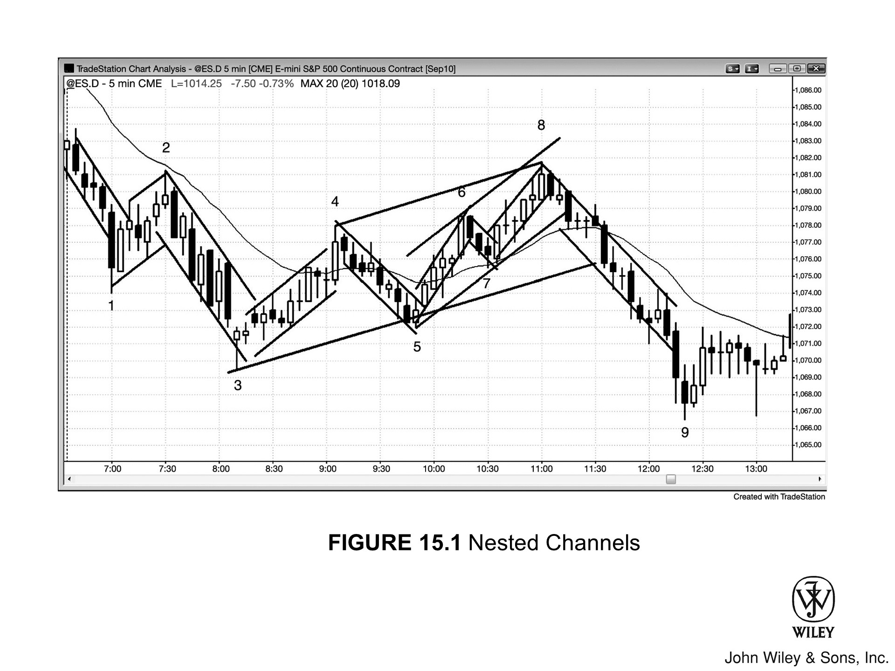
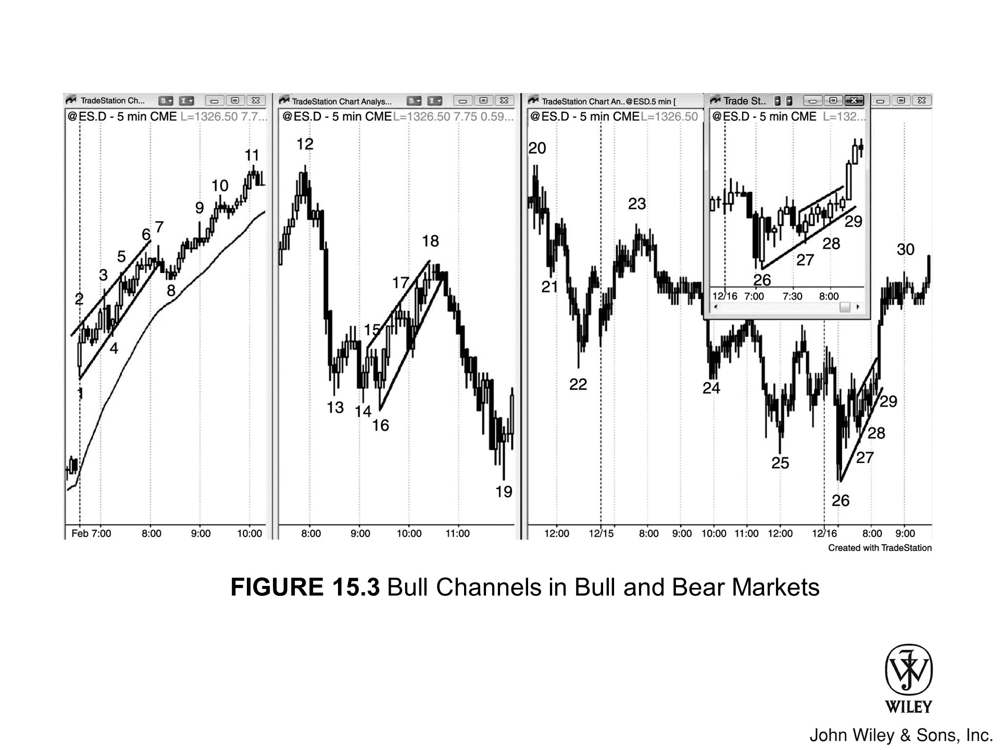
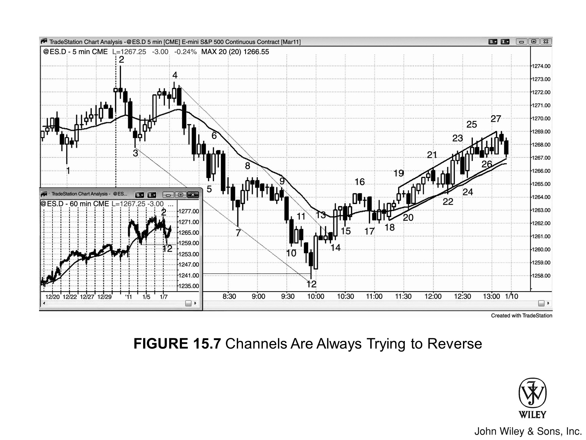
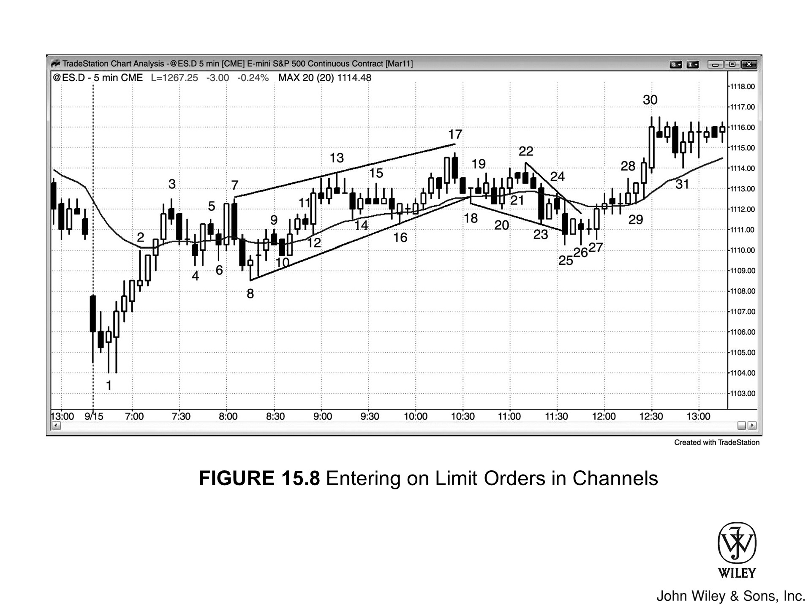

只要交易主要受限于两条线之间，便是通道。只要细心寻找，你会发现市场无时无刻不处于某种通道之中；通常，它还同时身处多个通道，若结合其他时间周期观察，这一点尤为明显。

*   **趋势通道**：即倾斜的通道，由一条趋势线和一条趋势通道线界定。例如，空头通道上方为下降趋势线（空头趋势线），下方为下降趋势通道线（空头通道线）。
*   **交易区间**：则不同，它被夹在下方的水平支撑线与上方的水平阻力线之间。有时交易区间会略微倾斜，呈缓升或缓降之势，此时将其视为弱趋势通道更为妥当。

三角形也是通道，毕竟其价格行为同样受限于两条线之间。由于会出现更高的高点或更低的低点（扩散三角形则两者兼备），三角形除了表现出交易区间的特征外，还带有某种趋势行为：

*   **扩散三角形**：夹在两条发散的线之间，从技术角度看，这两条线均为趋势通道线。下方连线穿过更低的低点，位于空头趋势之下，故为趋势通道线；上方连线穿过更高的高点，故为多头趋势通道线。
*   **收敛三角形**：则受限于两条趋势线之间，这是因为市场正同时经历高点降低的小型空头趋势，以及低点抬高的小型多头趋势。
*   **上升与下降三角形**：上升三角形上方为阻力线，下方为多头趋势线；下降三角形下方为支撑线，上方为空头趋势线。

此外，还有以下变体：

*   **楔形**：是一种趋势线与趋势通道线相互收敛的上升或下降通道，属于三角形的变体。
*   **ABC 回调**：多头趋势中的 ABC 回调本质上是小型空头通道；反之，空头趋势中的 ABC 回调则是小型多头通道。

在强趋势中，移动平均线往往充当支撑或阻力，许多交易者也习惯基于均线及其他因素构建曲线通道或波带。然而，笔直的趋势线与趋势通道线始终更胜一筹，它们提供的入场策略更可靠，获利机会也更丰厚。

多头通道可能出现在各种背景下：
*   交易区间内
*   多头趋势中
*   空头趋势中
*   甚至是空头趋势的潜在底部——即市场开始向上反转之时

针对不同背景的交易策略：

*   **若通道位于交易区间内**，价格处于区间下半部时可考虑买入；但随着通道向上延伸至区间上半部，成功的胜算便会降低。
*   **若通道处于多头趋势中**，价格上涨的确定性更高，交易者应着眼于在通道底部附近买入。做多的胜算会一直保持良好，直到通道内涌现出显著卖压，或价格逼近重要阻力位为止。

关于通道的紧凑程度与形态：

*   **当通道特别紧凑**——即趋势线与趋势通道线贴得很近，且回调幅度很小——这是趋势强劲的信号。在更大周期的图表上，这种形态往往表现为一根急速（Spike）。随后可能会演变为更宽的通道，其目标位通常基于此前窄通道的高度进行测量移动计算。
*   **若通道紧凑到完全没有回调**，或仅有一两次极微小的回调，则被称为微型通道，我们将在下一章对此详述。

空头趋势中出现的多头通道，本质就是熊旗。交易者应：
*   在顶部附近寻机做空；
*   或者在向下突破后的回调中进场。

有时，空头趋势初现反转，头 5 到 10 根 K 线会走出一个弱势多头通道。其间：
*   K 线重叠严重；
*   市场虽有一两次尝试向下跌破熊旗，但均告失败并迅速反转向上。

随着 **低 2** 或 **低 3** 失败，市场有时会直接从熊旗向上突破，状态瞬间转为 **Always-in 多头**，多头反转正式开启。

当交易者怀疑这个熊旗其实是多头趋势的起点时，许多人会在 **低 1、低 2 或低 3** 信号 K 线下方买入，预期这些信号失效，进而推动市场向上反转。

通道形成之初，交易者往往拿捏不准：这到底会走出真正的通道，还是仅仅是个两段式移动 (Two-legged move) 随即反转？事实上，通常只有当市场从两段式移动中反转，且反转失败、第三段腿 (Leg) 开启之后，你才画得出通道线。

举个例子，如果市场刚走完两段上涨并开始掉头向下：

*   只要此前的上涨算不上强多头趋势，许多交易者就会做空这次反转。
*   然而，如果这段下跌腿结束时，其幅度与第一段下跌腿（即第一段上涨后的那一腿）相当，且随后再次向上反转，交易者就会转而认为多头通道正在形成，而非向下反转进入空头腿。

一旦第二段下跌腿结束，交易者便会采取以下步骤：

1.  **绘制趋势线**：连接第一段下跌腿的底部与第二段的底部，并向右延伸。此后，每当市场回踩这条趋势线，他们就会伺机买入。
2.  **绘制通道线**：做一条该线的平行线，将其平移至第一段上涨腿的顶部，至此，通道初具雏形。每当市场上涨触及那条趋势通道线，交易者就会多单止盈，并寻找做空机会。

由于多头通道至少需要前两段下跌腿来确认其存在，且随后市场通常会向上测试第二段上涨腿的高点，因此，多头通道通常至少包含三段向上的推动 (Pushes)。

*   **在第三段上涨腿形成之前**：交易者通常不会预期反转或通道向下突破。
*   **一旦第三段形成**：特别是如果过冲 (Overshoot) 了趋势通道线并收出一根强空头反转 K 线，交易者就会大举做空，因为向下突破成功的概率已然增加。

正因如此，许多多头通道会在第三次向上推动后终结。同理，许多空头通道也会在第三次向下推动后告终。

### 核心机制：真空效应

市场为何会加速冲向通道的上下边界？这全是“真空效应”（vacuum effect）在作祟。

### 案例解析：多头通道中的加速

举个例子，在多头通道中，若有一段行情（腿）正逼近上方的趋势通道线，市场通常会经历以下过程：

1.  **惜售心理**
    交易者通常笃定市场会摸到那条线，甚至向上刺破一两个 tick。既然认定价格至少还能再涨一点，他们自然会选择惜售。

2.  **买方失衡（Buy Imbalance）**
    多头想平仓获利，空头想进场做空，双方最终都要卖出。但眼下卖盘稀缺，造成了买方失衡。

3.  **加速冲顶**
    一旦供需失衡，行情就会加速运行。于是，在市场测试通道顶部时，往往会拉出一两根巨大的多头趋势 K 线。

### 市场陷阱与机构博弈

**散户的误判**
这种涨势常引得急不可耐的多头在“急速”（spike）高点追涨，误以为一段更强劲的新行情正在启动。然而，突破大多以失败告终，这一次恐怕也不例外。

**机构的视角**
为什么？因为机构交易者在盯着：
*   **按兵不动**：强势空头想做空，但他们确信价格会碰到上方的趋势通道线，所以按兵不动。
*   **大举做空**：一旦价格到位，他们便大举做空，彻底压倒多头。
*   **最佳点位**：他们乐见强劲的多头趋势 K 线出现，因为坚信后市必跌，而在“极度看涨点”（point of maximum bullishness）做空，价格最为划算。

### 最终结局

市场可能会在那根多头趋势 K 线顶部稍作停顿，收出一根小 K 线，这是多空双方在博弈突破是否失败。

但随后，行情通常会迅速下跌，因为机构多头和空头都心知肚明：**绝大多数突破尝试，注定失败。**

那么，那些强势的机构多头会怎么做？

*   他们会收手不买，迅速平掉手中的多单，将这笔短暂的暴利落袋为安。
*   他们深知良机易逝，市场绝不会在极端高位久留，于是果断离场，而且至少在一两根 K 线内，绝不回头再买。

机构多头一撤，机构空头趁势猛攻，两股力量迫使市场急速下挫，直奔通道底部。到了那里，剧情正好反转。多空双方都盯着下方的趋势线，预期它必受测试：

*   **空头**：会一路做空，直到价格触线，然后买回平仓，获利了结；
*   **多头**：也是不见兔子不撒鹰，不到位置绝不出手。

这引发了一波短暂却剧烈的下跌，诱使新手交易者入场做空，妄想会有空头突破。殊不知，他们的操作与机构完全背道而驰。

> **记住，你的任务是紧跟机构的步伐。不要去做你 *希望* 他们即将要做的事，更绝对不要跟他们 *正在* 做的事对着干。**

每一次这种小幅回调，都是一个微型卖盘真空。一旦市场逼近通道底部，多空双方都预期价格会碰触多头趋势线，所以在触线之前，谁都不会买入。一旦触线：

1.  **多头**：便进场建立新多单；
2.  **空头**：则把做空的剥头皮单子平仓获利；
3.  **预期**：双方都预期价格会创出通道新高，去测试通道顶部，届时这一过程又将重演。

所有的通道莫不如此，包括交易区间和三角形。

即便是在趋势通道中，多空双向交易也从未停止，这本质上就是**交易区间**的特征。其实，不妨把趋势通道看作一个**倾斜的交易区间**。

### 1. 通道形态与市场属性

*   **窄通道（斜率陡峭、形态紧凑）：**
    市场表现更接近**趋势**，此时只应顺势操作。
*   **宽通道（斜率平缓、宽幅震荡）：**
    有些波段甚至长达 5 到 10 根**K线**，市场就更像**交易区间**，此时多空双向皆可交易。

和所有**交易区间**一样，区间中部仿佛有磁力，总想把价格吸住，限制在区间内。为什么市场老是待在通道里，而不突然加速？原因和所有**交易区间**如出一辙：不确定性太高。

### 2. 市场心理（以多头通道为例）

*   **多头：** 想加仓，但想等价格再低点。
*   **弱势空头：** 盼着抛售发生，好让自己少亏点离场（买入是为了平掉亏损仓位）。

多空双方都担心**回调**迟迟不来，导致无法以更优价格买足筹码。因此，随着行情上涨，他们只能不断分批买入，这进一步推升了买盘压力。一旦有微小回落，他们就会更激进地买入，通常会在以下位置挂出**限价单**：
1.  上一根**K线**低点下方；
2.  均线处；
3.  通道底部的**趋势线**附近。

### 3. 交易策略的演变

一般来说，通道初成时，最好顺势而为；而当通道逼近目标区，且双向交易特征愈发明显时，老手们往往开始尝试**逆势**操作。

*   **通道初期（顺势）：**
    良策是在**K线**低点下方买入。
*   **通道后期（逆势）：**
    随着通道触及阻力区，并开始出现更多**K线重叠**、**阴线**、更深的**回调**以及明显的**影线**时，思路就该变了——与其继续在低点下方买入，不如考虑在**K线**高点上方做空。

不过，对新手而言，一旦看到 **通道**，要么只顺 **趋势** 交易，要么干脆不做。**通道** 极难操作，因为行情总是试图 **反转**，且 **回调** 频发。这容易迷惑新手，导致接连亏损。

若是 **多头通道**，只应寻找买入机会。最可靠的信号是位于 **移动平均线** 处的 **高2**，需具备 **多头信号K线**，且入场点离 **通道** 顶部不太近。

这种完美的 **入场策略** 并不多见。新手应耐心等待这种最佳时机，哪怕因此错过整段 **趋势** 也在所不惜。

*   **经验丰富的交易者**：则可在疲弱的卖出信号下方，于 **移动平均线** 附近及 **通道** 底部挂 **限价单** 买入。
*   **若尚未稳定盈利**：在 **多头通道** 中应回避一切卖出信号，即便出现了微小的 **更低的高点**。此时市场处于 **Always-in** 多头状态，切勿尝试 **做空**，哪怕许多信号看似可行。

请务必等待市场明确转为 **Always-in** 空头后，再考虑 **做空**。这通常需要：

1.  一波强劲的 **空头急速**，跌破 **通道** 及 **移动平均线** 并伴有 **后续**；
2.  随后还要出现一个带有 **空头信号K线** 的 **更低的高点**。

若 **入场策略** 稍弱于此，新手便应观望，只寻找 **回调** 买入机会。

> 别陷入“均值回归”的思维陷阱，臆断 **通道** 看似疲软，**反转** 已是迟早之事。当你逆势押注那看似疲弱的 **趋势** 时，你会发现，市场维持这种“不可持续”状态的时间，往往比你账户资金能支撑的时间更长。

随着市场走高，许多多头会分批加仓，为此他们会运用一切合乎逻辑的手段：

*   **回调至均线时买入**：有人会在价格回调至均线附近时进场；
*   **跌破前低时买入**：有人会在跌破上一根 K 线低点时买入；
*   **固定间隔回调买入**：还有人按固定间隔的回调买入——比如交易 AAPL 时，在最近高点下方每跌 50 美分买进一次；
*   **恢复上涨趋势时买入**：另一些人则会在市场看似要恢复通道上涨时进场，比如在上一低点上方每涨 25 美分买进一次。

只要你能想到的策略，程序员也能想到；一旦她能从数学上证明该策略有效，她的公司大概率就会尝试交易。

多头想逢低加仓，被套的空头想逢低止损，虽然双方都盼着价格回调，却又担心机会渺茫。于是，两者只能不断追涨，直到弹尽粮绝。这种买盘枯竭通常发生在某个“磁铁”效应显著的位置，例如：
*   测量移动（Measured Move）目标位；
*   或是更高时间周期的趋势线与趋势通道线附近。

由于通道延伸的幅度往往远超大众预期，趋势通常会惯性上冲，接连突破一道或数道明显的阻力关口。直到抵达某个临界点，强多头与强空头才达成共识：行情已成强弩之末，上涨空间所剩无几。此时，买压耗尽：
*   **强多头**：获利了结，清仓离场；
*   **强空头**：趁势入场，大举做空；
*   **市场反应**：随之反转，要么陷入更深幅度的回调，要么直接开启反向趋势。

多头趋势往往终结于对通道顶部的突破。此时市场各方反应如下：
1.  **绝望的空头**：崩溃止损，回补仓位；
2.  **最弱势多头**：苦苦等待回调，最终按捺不住，直接市价追高；
3.  **强空头**：对此早有预判，往往耐心等待这种强突破出现，随即开始毫不手软地大肆做空。在他们看来，这是在极高价位做空的短暂良机，市场绝不会在此久留。

强多头则将这波急速（Spike）上冲视为天赐良机，借机获利了结。他们离场后会保持观望，直到市场满足特定条件后，才会考虑再次买入：
*   出现至少持续 10 根 K 线的两段式回调（Two-legged pullback）；
*   价格跌回通道起点——也就是当初建立盈利仓位的成本区。

强空头对此心知肚明，也会选择在强多头准备接盘的位置精准止盈。这种共振通常会引发反弹，随后往往演变为交易区间（Trading Range），因为多空双方对下一步的方向都充满了不确定性。而不确定性，通常就意味着市场进入了交易区间。

至少，通常的逻辑是这么讲的。但真相恐怕要复杂得多，既精密深奥，又难以知晓。这种模式，所有 **机构交易者** 都烂熟于心。你可以确信，他们的程序员正挖空心思，试图从中牟利。

机构可能会玩的一手，就是人为制造 **买入高潮**。

*   假设某机构一路买进，正准备获利了结，但又想确认顶部确已形成，它可能会突然再砸进最后一大笔买单。
*   它明知这笔单子可能会亏点小钱，但意在 **图表** 上制造出 **高潮**，从而引发反转。
*   如果这招奏效了——只要有其他几家机构也在运行类似的程序，往往就能奏效——它便能从容平掉所有 **多头** 仓位（大部分都赚了钱），甚至直接反手 **做空**，因为它确信卖方已掌控了市场。

***

每次 **高潮** 背后都是如此吗？这既无从知晓，也无关紧要。你要做的，就是紧跟 **机构交易者** 的步伐，而这一切迹象都明明白白地写在 **图表** 上。你根本无需了解形态背后的程序逻辑，就连机构自己，也搞不清对手在运行什么程序。它们只懂自家的算法。

然而：

*   除非许多机构在同一时间朝着同一方向合力交易，且筹码规模足以碾压反向操作的对手，否则市场很难走出大行情。
*   绝大多数机构立场一致的唯一时刻，就是 **强趋势** 中的 **急速** 阶段。
*   这种情况，在 **图表** 所有 **K 线** 中占比还不到 5%。

通道还在持续上行，但场内交易的可不光是多头和那些心里没底的弱势空头。强势空头也没闲着，他们趁着价格走高一路做空，分批加仓。在他们看来，上涨空间已经不大，这笔买卖迟早能赚。

这种抛售开始形成卖压，盘面上看得很清楚：
*   阴线实体越来越多、越来越大；
*   K 线频频探出上影线，而且一根接一根；
*   低点不断下移。

他们盯着的是通道向下突破，甚至指望价格能一路跌回通道起点去测试支撑。为了拿到最好的做空价位，他们选择在上涨途中出手，而不是干等反转。道理很简单：反转往往来得又快又猛，真等到那时候再进场，位置就离通道顶部太远了，利润空间会被大幅压缩，甚至无利可图。

强势空头的加仓手法花样繁多：
*   有的在前一根 K 线高点上方，或是通道内微型波段高点上方挂限价单；
*   有的专挑价格测试通道顶部的趋势通道线时出手；
*   有的盯着测量移动的目标位；
*   有的按固定间距加码（比如做苹果股票，每涨 50 美分加一次）；
*   还有的逢顶必空。

市场一旦真的反转，他们要么握紧全部仓位，博一波大的；要么在预设的目标位止盈离场——比如价格回踩通道底部的趋势线时，甚至跌回第一笔空单的入场价时（通常就在通道起点附近）。

真走到这一步，他们第一笔单子正好保本，而上面加的那些仓位都能获利。

若要在多头通道中分批做空，最好只在当天的前三分之二时段操作。你绝不想陷入这种困境：身处多头通道却持有重仓空头，保本价位远在下方，而收盘将至，剩余时间根本不够你全身而退，更别提获利丰厚了。

通常而言，若在后半场交易通道，**顺势而为才是上策**，例如：
*   在前一根 K 线低点下方买入；
*   或在移动平均线处出现多头反转 K 线时，在其上方买入。

---

如果市场持续上涨，超出了空头的预期极限，他们就会认赔回补全部仓位。这很可能是通道末端有时会出现高潮性上行突破的重要推手：

1.  **空头回补**：他们不再指望短期内会有回调，能让自己以更好的价格离场，而是直接市价买入，认赔平掉所有空头头寸。
2.  **反手做多**：由于许多人属于动能交易者，他们往往会反手做多。随着市场加速上行，所有动能多头都会激进买入，因为他们深知数学概率站在自己这一边。
3.  **概率优势**：下一个 tick 走高而非走低的概率超过 50%，因此他们占据优势。

尽管突破可能短暂且反转剧烈，但只要逻辑成立，他们的买入程序就会持续买进。然而，这就像“抢椅子”游戏；一旦动能的音乐戛然而止，所有人都会迅速抢占椅子——这意味着他们会极快地平掉多头仓位。

就在他们抛售多头头寸时，激进的空头也在大举做空，这可能导致力量对比严重失衡，从而有利于空头。一旦空头掌控局面，通常会发生以下情况：
*   抛售通常会持续至少 10 根 K 线；
*   价格通常会反转回到趋势通道线下方并重回通道内；
*   随后向下突破通道。

电视上的股评家总爱把急剧的向上 **突破** 归因于某条新闻——反正这类素材多如牛毛，随手就能抓一把。之所以这么做，是因为他们完全局限于传统基本面交易者的视角。

他们根本不懂，许多市场波动——尤其是那种一小时内的短线行情——跟基本面半毛钱关系都没有。这纯粹是大型程序在同一时间执行相同指令的结果，而这些程序压根儿就不在乎什么基本面。

一旦市场在 **高潮** 式的喷出（climactic blow-off）后迅速反转，他们的反应往往如下：

*   **立马换个话题**，接着讲下一个故事；
*   **绝口不提** 刚才那番幼稚可笑的解说；
*   **视而不见** 那些在短期内驱动市场的强大技术力量，对此更是全然不知。

每隔几年，市场总会出现一次惊人的日内巨震。大概也只有在这种时候，他们才会勉强承认：确实是技术因素在起作用。实际上，他们总是把锅甩给“程序”，仿佛这些程序是突然冒出来似的。

其实这有什么好怪的？

1.  绝大多数日内价格走势本来就是程序跑出来的，只是这帮记者对此一窍不通罢了。
2.  他们的眼里，永远只有财报、季度销售额和利润率。

通道本质上就是倾斜的 **交易区间**。既然是 **交易区间**，规律便如出一辙：无论是向上还是向下，绝大多数的 **突破** 尝试终将铩羽而归。

诚然，通道中某一方的力量确实更强，但这并不改变其作为 **交易区间** 的运行逻辑。以多头通道为例，多空双方虽都活跃，但多头略胜一筹，这正是通道向上倾斜的缘由。

身处通道中部时，多空双方交易起来都得心应手。可一旦行情逼近边界，市场心态便大不相同：

*   **逼近通道顶部**：多头便开始担忧向上 **突破** 失败；只要他们认为失败的概率极大，就会抛售手中的部分多单。同样，空头在通道中部就敢于做空，到了顶部，面对更优的价格（Value），出手只会更加凶狠。
*   **回落至区间底部**：低价让空头意兴阑珊；反观多头，刚才在高位尚且买入，如今价格更低，买进自然更加积极。这种合力会导致价格在 **趋势线** 处受到支撑，向上反弹。

在通道构筑的过程中，行情演变往往遵循以下路径：

1.  行情往往会一次或多次向下刺破通道，迫使你重画 **趋势线**。结果通常是通道演变得更加宽阔、坡度更加平缓。
2.  终有一刻，向下 **突破** 的动能将强劲到足以制造出一个更低的高点，紧接着创出更低的低点。
3.  一旦这一幕发生，交易者就会着手绘制空头通道——哪怕原本的多头通道依然存在，也已变得极为宽阔了。

必须认清一点：多头通道（bull channel）向上突破（bull breakouts），绝大多数都会失败。即便多头能制造突破并压倒空头（bears），这种强势通常也维持不了几根 K 线（bars）。

### 1. 突破失败的情形（大多数情况）

届时，多头会认为行情过度延伸（overdone），于是获利了结（take profits）；在市场回调（correction）一段时间前，他们不愿再买入。此时，通道中部的磁吸效应通常会将价格拉回通道内，致使突破失败，进而演变为买入高潮（buy climax）。

一旦重回通道，市场演变如下：

*   **最小目标：** 通常是刺破通道底部。
*   **回调形态：** 这种买入高潮通常引发两段式回调（two-legged correction），持续约 10 根 K 线（bars），且往往会跌破通道。
*   **后续目标：** 一旦向下突破发生且抛售持续，下一个目标便是测量移动（measured move），幅度约等于通道高度。

空头深知买入高潮后极可能出现回调，因此会大举做空（short aggressively）。随着多头平仓离场，抛压沉重，市场向下回调，甚至可能转为空头趋势（bear trend）。

### 2. 突破成功的情形（少数情况）

不过，有时多头通道向上突破势头强劲，未在寥寥几根 K 线内失败。此时，市场通常会上涨至测量移动目标位，该突破随之成为测量型缺口（measuring gap）。

**实例说明：**

> 例如，若多头通道呈楔形（wedge）并向下突破，但这波突破在几根 K 线内失败，随后市场急速拉升并突破楔形顶部，那么这波上涨通常会完成一段测量移动，幅度约等于楔形高度。
>
> 突破楔形顶部的趋势 K 线（trend bars）随即成为测量型缺口。

（关于缺口、测量移动和突破，将在第二本书中详述。）

若市场未向上突破，反而向下突破，且未伴随“失败的向上突破”、“买入高潮”或“空头反转”，行情通常会横盘整理若干 K 线。随后可能：

*   形成更低的高点，走出下跌的第二腿；
*   亦或该交易区间演变为牛旗，推动多头趋势恢复。

较少见的情况是，市场出现强烈的向下急速行情，并伴随强劲的空头反转。对于空头通道，上述逻辑完全相反。

***

趋势通道本质上就是倾斜的交易区间，因此其作用通常类似于旗形。对于多头通道，无论其走势多么陡峭或持久，终归会在某个时刻向下突破，因此即便此前并无空头趋势，也可将其视为熊旗。

*   **强多头**终将获利了结，且唯有在市场出现大幅回调后，才愿再次入场买入。这种回调往往需深至通道起点，即多头最初建仓之处。正因如此，通道后的回调常会一路跌至通道底部（此处通常会有反弹）。
*   **强空头**与强多头一样精明。通常，就在强多头收手之际，强空头便开始大举做空，且不会因价格走高而被震仓出局。事实上，他们视高价为更优的价值，进而加仓做空。

空头头寸何处止盈？就在通道底部附近——这正是强多头可能尝试重新做多的位置。

### 通道与旗形的本质关系

*   **多头通道（Bull Channel）**：本质上就是熊旗（Bear Flag），操作时自然也该按熊旗处理。
*   **空头通道（Bear Channel）**：反之亦然，任何空头通道都应视作牛旗（Bull Flag）。
*   **注**：至于此前是否存在多头趋势，其实无关紧要。

### 时间周期与交易依据

有时，更高的时间周期（Higher Time Frame）上确实处于多头趋势，只是在 5 分钟图表上未必显眼；此时若看大周期图表，该空头通道便是一面牛旗。

*   诚然，大周期趋势能提升多头突破（Bull Breakout）的概率，也能让突破更强劲、走得更远。
*   但即便不看大周期，空头通道引发大幅多头突破的情形也比比皆是。

**结论**：要像交易牛旗那样交易通道，完全没必要非得去寻找大周期的多头趋势作为依据。多头通道则恰恰相反，其功能等同于熊旗。

### 多头通道的突破特性

既然多头通道即是熊旗，最终往往会迎来空头突破（Bear Breakout）。然而，有时也会出现向上突破通道的多头突破，其特征如下：

1.  **性质**：通常属于高潮（Climactic）性质，难以持续。
2.  **持续时间**：这种突破可能仅维持一两根 K 线（Bar），有时也能坚持五根以上，随后市场便掉头向下。
3.  **例外**：只有在少数情况下，多头趋势才会极其强劲地延续下去。

### 反转与回测机制

一旦发生反转，价格通常会重回通道内部；而凡是突破后又跌回通道的，往往会去测试通道的另一侧。

*   **多头通道顶部突破失败**：
    因其本质属于高潮形态，随后的反转理应至少包含两段（Legs）下跌，且持续至少 10 根 K 线，这往往会演变为趋势反转。

*   **空头通道向下突破**：
    情形则与之相反。这通常构成抛售高潮（Sell Climax），随后价格会反转至通道上方，并走出至少两段（Legs）上涨。

- 所有通道最终都会被突破，其势头或迅猛剧烈，或动能寥寥。

- 趋势通道延续的时间，通常远比大多数交易者预想的要长，而且常设下陷阱，引诱人们过早入场做反转。

- 大多数通道通常至少包含三条腿，才会宣告终结。这一点在三角形中尤为明显，在楔形中更是如此。

- 至于三角形，突破往往迫在眉睫，但方向却常常不明朗。

斜率越陡，线距越窄，通道便越强，动能也越足。这种既陡峭又紧凑的形态，特称为“窄通道”（Tight Channel）。若是横向延伸，便是“窄交易区间”（Tight Trading Range），这部分留待第二卷细说。

通道一旦强势，贸然交易第一次逆势突破风险极大；在更大周期的图表上，这整个通道往往只是一根“急速”（Spike）。

因此，面对陡峭的空头通道：

*   若多数回调（Pullback）仅有一根 K 线，**切勿急于在前一根 K 线高点上方买入**——哪怕价格看似已经突破了空头趋势线。
*   **上策是静候“突破后的回调”（Breakout Pullback）**，看它是否走出更低的低点，或是更高的低点。若回调出现且反转向上势头强劲（比如近几根 K 线中夹杂着两三根饱满的多头趋势 K 线），这时才可考虑买入。
*   **若市场不回调反而急速上冲**，意味着后市看涨概率极高。此时只需耐心等待，通常不出 5 根 K 线，回调自会到来。

如果这波上涨冲破了均线（Moving Average）：

*   且随后的首次回调能稳守均线之上，那便是**强势信号**，做多胜算大增。
*   反之，若首次回调落到均线之下，则表明**多头示弱**，再走第二腿（Leg）上涨的机会就小了。
*   倘若向上突破后市场持续遭到抛售（Sell off），那便是**突破失败**，空头趋势卷土重来。

市场若有反转之势，**通道** 强弱便至关重要。试想，先是一波强劲 **多头趋势**，随后遭遇猛烈抛售，价格大幅跌破 **多头趋势线**，此时交易者必会审慎研判随后的反弹。

> **焦点在于：**
> 这波反弹究竟只是对 **多头** 高点的测试，还是会强力 **突破** 前高，进而开启 **多头趋势** 的下一段强劲上涨 **腿**？

研判的关键，在于测试 **多头** 高点时的动能：

*   **若反弹形成极窄且陡峭的通道**
    中途既无 **回调**，**K线** 亦少有 **重叠**，且一口气远超前高才稍作停顿，便足见动能之强。
    *   哪怕此前抛售猛烈、**多头趋势线** 已破，**多头趋势** 恢复的概率依然大增。
    *   通常，延绵的 **窄通道** 首度被 **突破** 时往往失败。随后 **趋势** 恢复，往往再创新高，其 **测量移动** 的目标位，大约等同于最初那波 **突破** 的高度。

*   **反之，若反弹中 K线 频频重叠**
    夹杂数根大实体 **空头趋势K线**，且伴随两三次清晰 **回调**，甚至走出 **楔形** 形态；加之斜率（动能）明显逊于原 **多头趋势** 及抛售段，那便是另一番光景。
    *   此时测试 **多头** 高点，极可能只形成“更低的高点”或“略高的高点”，随即招致新一轮抛售。
    *   市场或许正反转为 **空头趋势**，但底线是：大概率会进入 **交易区间**。

- **无论何种通道**，一旦突破后又反转回到通道内，市场就会去测试通道的另一端。通常，价格不仅会测试，还会试图突破那一侧，哪怕只是稍微刺破一点。
- **若通道在任一方向成功突破**，接下来的最小目标位便是一段“测量移动”，其幅度大约等同于通道高度。

---

### 具体形态举例

*   **双顶（水平通道）**
    *   **举例来说，双顶本质上就是水平通道。** 若能成功向下突破，最小目标就是一段等于通道高度的测量移动。不过，此类突破有时会演变为趋势反转，后续的行情幅度可能远不止于此。反之，若是向上突破，目标同样是一段向上的测量移动，幅度即为双顶的高度。
    *   **假设 AAPL 正在构筑双顶**，且顶部比底部高出 $5.00。一旦向上突破，初始目标位就在顶部上方 $5.00 处；若向下突破，初始目标位则在形态低点下方 $5.00 处。

*   **楔形底**
    *   **楔形底也是同理。** 第一目标是测试楔形顶部。若市场继续上行，下一目标便是一段向上的测量移动。若涨势得以延续，市场可能就此进入多头趋势。

*   **倾斜通道**
    *   **哪怕是倾斜通道，初始目标位依然取决于通道高度。** 以多头通道为例，任选一根 K 线，观察其正上方与正下方的通道线，量出两线间距，这便是测量移动的预测幅度。

---

> 测量移动的目标位虽是估算，但市场往往会精准触达，随即停顿、回调或反转。若行情远超该目标，则很可能意味着一波新趋势正在展开。

和所有突破一样，随后的剧本无非三种：

1.  **突破成功**，顺势交易接踵而至；
2.  **突破失败**，演变为小级别的高潮反转；
3.  **市场陷入横盘**，形态演化为交易区间。

大多数突破发生后，没过几根 K 线，市场就会尝试反转。

***

若反转 K 线相对于突破 K 线表现不同，后续走势也会不同：

*   **若表现强势**：那么突破失败且反转成功的胜算就很高。
*   **若表现疲软**：那么反转尝试很可能会失败，这反而会在一两根 K 线内形成突破回调，随后突破走势将延续。

***

若突破力度与反转力度旗鼓相当，交易者就要紧盯反转信号 K 线之后的那根 K 线。

**试举一例：**
一根强多头趋势 K 线突破了牛旗，紧接着却收出一根同样令人印象深刻的空头反转 K 线，此时，随后的那根 K 线便成了关键。

*   **如果价格跌破该空头反转 K 线**：
    突破即告失败——至少暂时如此。如果这根 K 线还是根强空头趋势 K 线，且收盘价极低（强空头收盘），那么反转继续向下的概率随之增加。

*   **反之，如果这是一根强多头反转 K 线**：
    则意味着刚才的“突破失败”大概率无法得逞。此时，这根多头反转 K 线就变成了信号 K 线，预示着突破回调买入的机会，入场点就在其高点上方一个 tick 处。

关于突破的详细讨论，请见第二卷。

***

**Figure 15.1 嵌套通道**

通道在各类图表中屡见不鲜，大通道里往往还套着小通道。看 [图 15.1] 就会发现，画通道线不必非得把所有高低点都囊括在内。使用“最佳拟合线”，不仅能让通道特征更清晰，往往也更有利于预判信号。

如今市场由机构主导，绝大多数单子都是计算机程序下的。因此有理由认为，每一个窄幅小通道，都是程序化交易的产物。全天运行程序的机构众多：

*   大概只有当多家机构方向一致，且量能足以压倒反向操作的程序时，通道才会形成。比如 K线 4 开始的下行通道，卖盘程序的力度盖过了买盘，市场便一路走低。
*   而一旦买卖力量大体均衡，市场就会在窄交易区间内横向整理，这便是水平通道。

多头通道与熊旗无异，空头通道则应视为牛旗。面对 K线 2 到 3 这种窄通道，在这两种情形出现前，交易者只宜做空。想做多的买家得沉住气，可选择以下时机：

1.  等到“突破失败”且向上反转后再动手，K线 3 就是个例子。
2.  另一种选择是等待突破后的回调，比如 K线 3 之后的第 5 根 K线（一根小 K线），在其高点上方买入。

如果通道宽幅震荡（如 K线 3 到 8），那就多空皆宜。因为它更像是一个倾斜的交易区间，而交易区间属于双向市场，买卖信号都会出现。

一旦通道突破后反转回到通道内，市场通常会测试通道对侧，且往往会从另一侧突破，哪怕幅度极小。如果突破具有延续性（follow-through），第一目标位便是基于通道高度的测量移动。

如图 Figure 15.2 所示：

*   **Bar 3 与 Bar 4**
    Bar 3 向上突破交易区间顶部后随即反转向下。跌破通道底部后，Bar 4 的低点刚好落在完美测量移动目标位下方 1 个 tick 处。

*   **Bar 11 与 Bar 13**
    Bar 11 向上突破交易区间顶部，随后市场以 Bar 13 回测区间底部。画线时，有时会有好几根 K 线可供取点。通常值得关注所有可能性，因为可能要等几根 K 线之后，才能确定哪条线最佳。最宽的通道确定性最高。

*   **Bar 13 与 Bar 22**
    Bar 13 突破后紧跟一根多头孕线，形成了突破失败的买入形态。由于市场再次反转回通道内，第一目标位是测试通道顶部。这一次顶部突破成功，下一目标是向上的测量移动。Bar 22 到达该目标位上方 1 个 tick 处。有时，趋势会由此展开并延续得更远。

*   **Bar 17**
    Bar 17 向上突破了一个多头微型通道（或楔形），但在下一根 K 线便反转向下。由于通道非常窄，测试通道底部的目标在下一根 K 线就已达成，但因没有足够的做空获利空间，不应入场交易。

由 K线 19 和 20 构成的通道被突破后，其向上测量移动的目标位，恰好与 K线 6 至 10 定义的交易区间的测量目标位重合。当多个目标位在同一价格附近发生共振时，该处发生反转的成功率会显著增加。

*   **K线 21**：虽是有效的做空形态，但入场后紧接着的一根 K线便宣告失败。
*   **K线 22**：下方出现了二次入场机会，随后市场下探通道底部。在此处，行情形成了一根牛市反转 K线，随即反身向上测试通道顶部。

### 本图深度解析

如图 15.2 所示，市场大幅跳空低开，跌破了一个收盘交易区间。

*   **第一根 K线**：实体较大，且上下影线都很长。这是典型的交易区间行为，若想据此交易“开盘趋势”策略（无论做多还是做空），这都不是一根理想的信号 K线。
*   **第二根 K线**：是一根强劲的牛市反转 K线，发出了做多信号，预示着突破失败并可能开启开盘多头趋势。

随后，市场在均线下方紧贴处进入窄交易区间，该区间演变为最终旗形，在经历一次向上突破失败后，反转下跌。

*   **交易策略（K线 3）**：尽管交易者可以在 K线 3 跌破前一根 K线低点时立即做空，但更稳妥的做法是等待收盘，确认该 K线收成阴线实体后，再在其低点下方做空。

关于早盘的微观结构分析：

1.  **形态背景**：涨至 K线 1 的反弹处于微型通道内，因此 K线 2 的向下突破若无回调配合，往往难有持续性。
2.  **突破失败**：当价格涨破 K线 2 这根突破 K线的高点时，宣告突破失败。此时多空双方激烈争夺控制权，市场随之陷入横盘。
3.  **博弈心理**：
    *   **空头**：指望 K线 2 突破后能出现回调，形成高点降低或高点抬高的形态以便再次做空。
    *   **多头**：只想看到突破失败，进而推动行情再向上一腿。

空头胜出，市场沿微型通道一路跌至 Bar 4，随后行情反转。Bar 5 是这次突破失败的信号 K 线，但此前四根 K 线构成的多头急速势头强劲，足以让交易者确信市场将向上测试。事实也的确如此，行情随后一路上行至 Bar 8 完成了测试。

Bar 14 到 Bar 17 形成了另一个多头微型通道，Bar 18 则是对该通道的突破。此后市场进入横盘，直至小趋势恢复，价格推升至 Bar 22。

**[Figure 15.3] 多头市场和空头市场中的多头通道**

无论何种市场类型，都可能出现多头通道：

*   **强多头趋势（左侧图表）：**
    如图 [Figure 15.3] 左侧的 5 分钟 Emini 图表所示，这是一个强多头趋势中的多头通道。当天市场大幅跳空高开，形成“开盘即趋势”的多头行情。全天回调幅度很浅，价格持续走高。既然是强多头趋势日，交易者便会逢小幅回调买入，比如在前一根 K 线低点或更低的位置挂单进场。

*   **空头趋势（中间图表）：**
    中间图表里的多头通道，实则是空头趋势下的楔形熊旗，交易者不应在此尝试做多。随着市场转为 Always-in 空头方向，交易者可以在 Bar 18 的 ii 形态下方，或是随后的几根 K 线处进场做空。

右侧的多头通道出现在一段过度延伸的空头趋势中，本质上是个小型熊旗。它形成于开盘那根巨大的空头趋势 K 线之后，这根 K 线代表了第三次向下推动。

Bar 26（见插图）基于昨日低点，确立了一个强劲的向上双 K 线反转形态。尽管从 Bar 26 到 Bar 29 之前这段通道是熊旗形态，但交易者认定市场正在向上反转，预期低 1 和低 2 做空策略将会失败，因此在前几根 K 线的低点下方买入。

Bar 29 是一根强劲的多头趋势 K 线，一举突破熊旗顶部，确立了明确的 Always-in 多头状态。并非所有熊旗都会向下突破。有些会演变成空头趋势的最终旗形，随后向上突破并开启多头趋势，本例便是如此。

### [图 15.4] 通道突破与测量移动

一旦市场成功突破通道，首要目标位便是测量移动。如图 15.4 所示 SPY 周线图：

*   **通道结构**：趋势线连接 Bar 1 与 Bar 4 的低点；基于 Bar 2 和 Bar 3 高点绘制的趋势通道线，则在 Bar 5 处被触及。这是一个多头通道，上下两条线略呈收敛状。
*   **测量基准**：水平线 A 标示了 Bar 5 的高点，线 B 位于 Bar 5 正下方的通道底部。
*   **目标位**：线 C 是基于线 A 到线 B 距离向下的测量移动目标位。
*   **结果**：Bar 6 在测量移动位置获得支撑，随后行情上涨。

若使用 Andrew's Pitchfork，也能测算出类似的目标位。但既然基础的**价格行为**（Price Action）分析便能殊途同归，这就足矣。

### 市场心理与交易逻辑
- **获利了结与进场**：**空头**在 **K线** 6 低点附近**获利了结**，激进**多头**进场买入，理由或许千千万万。
- **图表的本质**：这些理由皆不重要，因为你永远无法知晓，究竟有多少资金是基于哪个理由在交易。你只需明白，图表是所有资金基于无数理由交易后的最终沉淀。
- **交易启示**：理解那些反复出现的形态，你便能洞悉何时应当**止盈**，何时可以考虑反转交易。

### 关键价格行为分析

*   **跌向 K线 1 的走势**
    *   这是价格首次向下**突破**那个紧凑且强劲的**多头通道**，因此该**突破**极易失败。
    *   当首次**突破**失败、**趋势**恢复时，行情通常会延续一个“**测量移动**”（Measured Move）的距离，其高度约等于最初那次反转尝试的幅度。而在本例中，反弹延伸得要远得多。

*   **K线 1 至 K线 4 的演变**
    *   **K线** 1 **多头急速**（Bull Spike）后开启的**通道**同样非常紧凑，随后跌向 **K线** 4 的**急速**（Spike）构成了第一次强力**突破**。
    *   反转失败，**趋势**恢复。**多头**试图将涨势延续约一个**测量移动**。
    *   该**测量移动**的目标位，是将 **K线** 3 到 **K线** 4 的高度叠加在 **K线** 3 高点之上，但市场并未完全触及该目标。

*   **K线 7 至 K线 12 及形态识别**
    *   至 **K线** 7 的上涨向上**突破**了跌向 **K线** 6 的**两段式**（Two-legged）**牛旗**，而 **K线** 8 则是此次**突破**后的**回调**。这也标志着另一个**多头通道**的开启。
    *   随后跌向 **K线** 12 的走势跌破了该**通道**，幅度约为一个**测量移动**——该距离基于**通道**高度及第一段下跌（**K线** 11 及其后一根 **K线**）的高度测算而来。
    *   **K线** 3、5 和 7 构成了头肩顶形态，但正如大多数反转形态那样，它最终演变成了一个巨大的**牛旗**，而非反转。

***

**关于此图表的深入探讨**

在 Figure 15.4 中：

*   **Bar 6** 前一根 K 线既是突破回调做空形态，也是均线处的低 2 做空策略。
*   **Bar 5** 之后那根 K 线带有长影线，随后的几根也是如此。
*   这段位于均线下方的交易区间属于铁丝网形态，而铁丝网常演变为最终旗形，本例即是如此。

***

图表最低点处出现了一根单 K 线急速上涨，随后紧接一个极窄的通道。事实上，这波上涨包含三四个窄通道（有些交易者将 Bar 1 到 Bar 3 的第二段急速视为单一的陡峭通道或急速，另一些人则视作两段）。当通道很窄时，往往表现得像急速，随后会接上另一个通道。

具体演变分析如下：

*   **Bar 1**：回调至 Bar 1 后，紧接着是一个两 K 线急速，随后又是另一个通道；该通道依然极窄，很可能仍充当初始急速的一部分。
*   **Bar 2**：Bar 2 回调后的上涨通道内出现了数根阴线实体，这是抛压积聚的迹象。结果是一波强劲的四 K 线空头急速，直抵 Bar 4。
*   **Bar 4**：随着抛压累积，多头很可能在测试高点时获利了结。虽然 Bar 4 开始的上涨通道很窄，可能属于另一段急速，但急速也可以充当高潮。

这是连续第三或第四个买入高潮（每一段急速，无论是一根还是多根 K 线，都是高潮），且紧随在一波强劲的空头急速之后。连续高潮通常引发更大幅度的回调，本例即是如此。

***

Figure 15.5 熊市通道的高潮式空头突破

熊市通道若跌破底部，有时会引发更猛烈的空头趋势。但这种突破往往很快演变为高潮，随后通常会出现至少两腿向上的反弹，如图 Figure 15.5 所示。

*   **Bar 4** 跌破了熊市通道，但不出所料，这只是个卖出高潮，随后引发了一波两腿反弹，至 **Bar 7** 告终。

市场先是一波多头急速（Spike）涨至 **Bar 14**，随后回调至 **Bar 15**，接着走出了一个楔形通道：

1.  价格跳空高开至 **Bar 17** 形成向上突破，但这只是个买入高潮，随即反转跌回多头通道内部，紧接着又向下突破。
2.  这波回调分两腿展开，终结于 **Bar 18**。
3.  许多通道在反转前往往包含三次推动，**Bar 14**、**16** 和 **17** 便是这三次向上的推升。

始于 **Bar 12** 的小型多头通道向上突破，势头非常强劲。凡是突破皆是高潮，但高潮未必总引发反转。有些高潮会演变为极强的突破，正如本例所示。待回调结束、趋势恢复后，动能往往减弱（斜率变缓），且 K 线重叠现象增多，这标志着双向交易的增加。

在强劲的多头趋势中，交易者会在价格回踩移动平均线时买入，**Bar 13** 和 **15** 即是如此。因此，移动平均线包容着趋势，起到了类似通道下轨的作用。

*   你可以编写指标，生成趋势线的平行线并置于高点之上以构建通道。
*   但通常而言，无论是曲线通道还是各类包络带，其提供的可靠交易机会往往不如直线通道线多。

### 关于此图表的深入探讨

在 图 15.5 中，市场展现了如下走势：

*   **急速形态（买入高潮）：**
    *   K线 13 至 14 的上涨势头极猛，近乎垂直。凡是强劲的**多头突破**，都应视为向上的**急速**形态，也就是**买入高潮**。
    *   若**急速**由两根以上的大**多头趋势K线**构成，走势便格外强劲。通常市场会先完成某种**测量移动**上涨，之后才会出现大幅**回调**。
    *   K线 13 底部无**影线**（光脚），且收于高位；作为随后一连串**多头趋势K线**的首根，它构成了**急速**的底部。

*   **测量移动目标位：**
    *   我们可以取**急速**起点的开盘价或低点，配合终点的收盘价或高点来测算目标位。这些位置往往是多头部分或全部获利了结的良机，有时也是空头进场做空的理想区域。
    *   若以 K线 13 开盘价为起点，K线 14 **急速**顶部的最高价为终点，计算出的**测量移动**目标位，恰好就是**通道**的最高点——即 K线 17 的高点。

---

在此之前的**空头趋势**与反转过程：

*   **K线 7（二次入场）：** 出现在**空头趋势**中，是一个**均线缺口K线**的二次入场做空信号。这种形态往往预示着**空头趋势**的**最后一腿**，随后便会引发更大级别的反转。
*   **趋势反转：** K线 7 之前的反弹突破了**空头趋势线**，紧接着 K线 8 创出更低的低点，形成了**趋势反转**。

---

随后市场进入**交易区间**并尝试突破：

1.  **扩散三角形底部（K线 10）：**
    K线 10 再次创出新低。虽然当时市场处于**交易区间**，但这根 K线同时也构成了**扩散三角形**的底部。**扩散三角形**通常会反弹创出新高，进而形成**扩散三角形**顶部。

2.  **做空失败与多头强劲（K线 14）：**
    市场试图在 K线 14 处重演这一幕，无奈上涨动能太强，想做空的交易者必须等待二次入场信号，但这信号始终未现。面对如此强劲的**多头突破**，明智的做法是等待**回调**买入，而非逆势做空。

3.  **突破与回调（K线 15）：**
    不出所料，**扩散三角形**顶部形态宣告失败。市场一举突破了**趋势通道线**上轨及前一日 K线 9 的高点，随后转为**两段式**的横盘**突破回调**，最终在 K线 15 处回踩**均线**。

图 15.6 线上的反转

只要市场显露趋势迹象，就应找出所有可能的趋势线和趋势通道线，因为市场 **可能** 在这些位置反转。交易者会穷尽各种技法来画线，比如连接波段点、做平行线，或是使用最佳拟合线。

图 15.6 标出了一些较明显的线条，但实际存在的远不止于此。有些线条可能源自现货指数等相关市场，另一些则基于成交量图或 Tick 图等不同类型的图表。

当价格测试通道边界时，交易者的操作逻辑如下：

*   **测试通道底部、逼近趋势通道线时：** 空头可以部分获利了结，激进的多头则可在此入场做多剥头皮。
*   **在熊市通道顶部：** 多头会平掉剥头皮仓位获利，空头则会进场做空，进行波段或剥头皮交易。

***

**关于线 A 与线 B 的分析：**

*   **线 A：** 是连接 K 线 3 与 K 线 7 高点的熊市趋势线。K 线 7 之后的第 6 根 K 线对该线进行了精确到 tick 的测试，随后 K 线 10 和 11 又再次测试。这条线压制了所有的上行价格行为，清楚表明它在当日行情中举足轻重。
*   **线 B：** 正因线 A 的重要性，若创建一条平行线（线 B）并将其锚定在包容了所有抛售行情的波段低点上，很可能会构建出一个交易者眼中有分量的通道。K 线 6 正是该锚点的逻辑首选。

***

**后续行情的演变：**

1.  **向下突破：** 一旦 K 线 14 跌破通道底部，交易者便会根据突破时的通道高度，向下寻找 **可能的** 测量移动目标。次日开盘，价格便超越了这一目标。
2.  **突破特性：** 当熊市通道向下而非向上突破时——即便如本例这般势头犀利——通常也只会延续几根 K 线便发生反转。
3.  **反转与新目标：** 一旦价格在 K 线 17 反转重回通道内，随后的目标便是向上刺破通道，该动作发生在 K 线 19。

K 线 13 到 16 的这波抛售，连拉 10 根空头趋势 K 线。这些 K 线重叠极少，实体饱满，影线短小，尽显空头强势。这种走势不可持续，因而属于**高潮（Climactic）**性质；若切换到某个更高的时间周期，这必然是一根异常巨大的空头趋势 K 线，尽管特意去寻找那个“完美周期”并无益处。

任何巨大的空头趋势 K 线：
*   既是**急速（Spike）**；
*   也是**突破（Breakout）**；
*   更是**抛售高潮（Sell Climax）**。

随后直到 K 线 19 的强力拉升，与始于 K 线 13 的那波下跌相结合，在更高周期图表上必然构成**两 K 线反转（Two-bar Reversal）**；若周期再大一级，甚至就是一根多头反转 K 线。

永远要有大局观，切莫被异常猛烈的抛售吓破了胆。没错，巨大的空头急速（Spike）确实是强烈的抛售高潮，其后续走向通常有两种：
*   往往随后会演变成漫长的空头通道；
*   但它同样可能意味着**衰竭（Exhaustion）**，从而引发大幅反转——本例便是如此。

受**真空效应（Vacuum Effect）**牵引，市场通常会加速冲向通道的顶部或底部。比如 K 线 7 是一根强劲的多头趋势 K 线，而此前两根 K 线处，也出现过一根强多头 K 线。

面对这三根 K 线构成的急速（Spike）以及当天强劲的向上反转，多头表现各异：
*   **弱势多头**：看到这种走势便急于进场——无论是在 K 线 7 形成期间、收盘时，还是三根 K 线后的高 1（High 1）点位，他们都在买入。
*   **强势多头**：则趁着测试空头通道顶部之机，平仓离场。

> **明明是空头全天控盘的空头趋势日，市场为何还会被一股强劲的吸力猛然拉起？**

**究其原因，是空头认定趋势线必受测试。**

*   价格越是逼近，他们就越确信：触碰空头趋势线就在眼前。
*   既然笃定几分钟后能以更好的价格做空，谁还会急着现在出手？此刻做空毫无动力。

**这种最强力空头的暂时收手，在盘面上形成了真空，产生一股上升气流，将价格瞬间吸向趋势线。**

*   动能交易者一路追涨，直至动能衰竭；
*   而由于此时愿意做空的对手寥寥无几，市场便毫无阻力地冲到了空头眼中的“价值高地”。

**价格一到位，那些早已在此等候测试的空头便凶猛砸盘，激进做空。**

毕竟这是个空头趋势日，空头全天都在碾压多头。这一点，多空双方心知肚明：大局尽在空头掌控之中。此时盘面呈现空头通道形态，且全天大部分时间，价格都被压制在均线下方。

除了新手，大家都心知肚明：任何试图向上突破趋势线的尝试，失败概率极高，因此这里是建立空头头寸的绝佳位置。此外，趁多头势头最盛之时做空，反而给了空头极好的入场机会。

*   **空头心态**：空头视市场为过度延伸（Overextended），认为上涨空间已所剩无几。既然认定市场可能连一个 Tick 都涨不动了，空头终于大举杀回，毫不手软地猛烈做空，哪怕此前他们已作壁上观了好几根 K 线。
*   **多头心态**：多头则借这次测试之机，将剥头皮（Scalp）仓位止盈离场。多头快速平仓获利，不愿冒行情急转直下、跌破入场均价的风险。

多空双方都清楚，市场在通道顶部只是短暂停留，因此出手都极为果断。空头开始大举做空，并一路持续抛售，直至市场测试通道底部。在此处，部分交易者选择落袋为安，其他人则继续持有空单，等待强劲的趋势反转——然而这种反转直到次日才出现。

# 本图深度解析

如图 [Figure 15.6] 所示，市场利用 K 线 2、4、6 构筑了一个楔形熊旗（Wedge Bear Flag）。跌破旗形后，行情随即开启向下的测量移动（Measured Move），并在收盘前三根 K 线处抵达目标位。

**详细走势分析：**

*   **开盘阶段**：当日小幅跳空低开（Gap Down），但首根 K 线收为十字星（Doji），若据此操作“失败的突破”做多（Failed Breakout Long），形态强度很弱。
*   **K 线 3 入场逻辑**：至 K 线 3 时，日内走势已演变为交易区间（Trading Range），因此在 K 线 3（Low 2）下方做空是可以接受的。
    *   日内高低点通常在首小时内形成，而此处很可能就是当天的最高点。
    *   市场当时可能正在形成更低的高点（Lower High），且无力站稳均线之上。

Bar 5 测试了在 Bar 3 下方入场空头的保本止损，并依托均线构筑了又一个 Low 2 做空形态。市场高低点依次降低，或许正处于空头趋势的早期阶段。

**[Figure 15.7] 通道总在试图反转**

身处通道之中，反转形态往往看着有些别扭。究其原因，它们并非真正的反转形态，不过是旗形回调的开端罢了。

在 [Figure 15.7] 中，Emini 走出一个楔形牛旗并在 Bar 12 结束。该 K 线向下刺破了 60 分钟图（见插图）的前低几个 tick，进而构筑出一个大型双底牛旗。

交易者判定市场翻转为 Always-in 多头的时机有三：

1.  Bar 12 之后的 K 线；
2.  Bar 14；
3.  向上突破 Bar 18 信号 K 线之时——此处也是对一个小三角形的多头突破（Bar 15、17 和 18 构成了向下的三推）。

多头趋势若非处于急速阶段，便是处于通道之中。既然市场并未表现出强劲的急速特征，交易者便假定其处于多头通道，这意味着回调将会出现。

此时，任何看似 **低1** 或 **低2** 的信号 K 线，实则都是买入信号。与其在这些 K 线下方做空，不如预期在信号 K 线的低点或更低处，会有更多买家进场。

**Bar 17** 之后的 **低1** 做空信号 K 线正是如此，交易者的具体操作如下：

*   **买入突破：** 交易者买入了那根空头孕线（bear inside bar）下方的突破，因为他们认定市场处于 **Always-in** 多头状态及多头通道中，而非处于空头腿（bear leg）里。
*   **调整计划：** 他们原本打算在 **Bar 18** 前一根 K 线的低点或更低处买入，预期 **低2** 卖出信号会失败。然而，多头做多心切，竟将买入限价单（buy limit orders）挂在了该 K 线低点上方一个 tick 的位置。

交易者之所以采取上述行动，是基于对市场心理的深层考量：

*   **避免踏空：** 他们担心剩余的空头力量不足以将市场推低至卖出信号 K 线的低点下方，也不愿在眼看多头趋势刚起步时被甩下车（trapped out）。
*   **坚定看多：** 他们视市场为 **Always-in** 多头，坚信空头看错了方向，且任何卖出信号终将失败。
*   **利用陷阱：** 他们预期任何抛售——以及随之而来的低价买入良机——都将转瞬即逝。他们乐见任何空头趋势 K 线出现，尤其是 **低1** 或 **低2**，因为这可能会套住空头；一旦市场反转向上，这些空头将被迫买回亏损的空单。

这些空头随即转化为买家，助推市场上涨，且在至少几根 K 线内，不敢轻易再次做空。这将使市场呈现有利于买家的一边倒态势，为其带来至少剥头皮（scalper's）的利润，甚至可能是波段（swing）利润。

直到 K线 16，这三段上攻形成了一个窄多头通道。因此，许多交易者将该楔形视为单次向上的急速（Spike），并预期回调结束后，行情会转为多头通道。

在此前的涨势中，三次回调的幅度均在 5 到 9 个 tick 之间，多头自然会在这一深度挂限价单承接。实际情况是：
- K线 20 回调了 7 个 tick；
- K线 22 回调了 8 个 tick；
- K线 24 也是 8 个 tick。

另一些交易者则在通道内前一根 K线低点下方 1 到 3 个 tick 处挂限价单买入，风险控制在最近的波段低点之下。例如：
- 当 K线 20 跌破前一根小十字星（或跌破 K线 19）时，他们随即买入；
- 并将保护性止损设在 K线 17 下方。

新手觉得这反直觉，老手却视其为机会。他们心里清楚，向下突破通道底部的尝试有 80% 会以失败告终，所以趁着市场试图突破时买入，很可能是一笔好交易。

有些空头认定从 K线 12 开始的这波上涨只是“涨过头”的空头反弹。但这帮人现在肯定苦不堪言，因为一路上出现的做空信号都太弱了——无论是：

*   K线 13、15 的前一根、16；
*   K线 19 的后一根、21 的前一根、23；
*   亦或是 25 的后一根。

只要市场是在相对窄的通道里震荡走高，所有的卖出信号往往都“没眼看”。原因很简单：它们压根就不是卖出信号，充其量只是小型牛旗的雏形。

强势多头正在前一根 K线低点下方接货，甚至在低于最近波段高点约 5 到 10 个 tick 的位置挂限价单买入。既然多头主力都在这些位置买进，你非要对着干去空，这显然是胜算极低的赌注。

身处窄牛通道，操作原则如下：

*   **一般情况**：在 K线低点下方做空绝非明智之举。
*   **唯一的例外**：是价格突破通道顶部后出现了强劲的高潮反转。
    *   即便真的发生了这种情况，通常也最好按兵不动，等市场先跌一波，反弹形成一个更低的高点之后，再尝试在 K线下方做空。

> 请记住，当前市场处于 Always-in 多头状态。在风向彻底转为 Always-in 空头之前，只做多，永远是上策。

乍看之下，这个通道似乎摇摇欲坠；回顾跌至 K线 12 的那波抛售，你也容易误以为空头即将卷土重来。但是，你必须交易眼前的市场——而不是那个已经谢幕的旧市场，更不是那个你臆想中即将开演的新市场。

如果通道内 K 线相对较小，且带有长影线，甚至出现了反向的趋势 K 线，这说明即便整体趋势仍在，市场中也存在着激烈的双向交易。这种环境正是逆势剥头皮交易者的良机。

**Bar 18 开始的上升通道便是例证：**

*   空头会在位于前期波段高点上方的多头趋势 K 线（如 Bar 22 之后的那根）收盘时做空；
*   也会在随后的微型阳线（如 Bar 23）收盘时进场，以此博取剥头皮利润；
*   许多交易者愿意在更高位加仓（关于分批入场，第二本书有详述）。

**试举一例：**

1.  假设他们在 Bar 20 之后的多头趋势 K 线收盘时做空；
2.  随后又在后续的一根或多根小阳线收盘时加仓，或者在初次入场价上方约 1 个点处加仓；
3.  当价格回落至初次入场价时，他们便会平掉所有仓位。

如此一来，首单保本，加仓单则赚取了剥头皮利润。这些获利了结的空头剥头皮者会在 Bar 22 的低点买入平仓，因为该低点已跌破其首笔入场价（即 Bar 20 后那根多头趋势 K 线的收盘价）。

**Bar 22 同时也测试了移动平均线，因此出现了多空共振：**

*   **多头买入：** 除了那些因达到止盈目标而离场的空头剥头皮者外，多头也会在此买入。
*   **空头止盈：** 空头的止盈目标五花八门，包括：
    *   Bar 20 后多头趋势 K 线的收盘价；
    *   均线；
    *   对 Bar 16 高点的突破测试；
    *   Bar 20 后十字星高点下方的 5 个 tick（如第二本书所述，那是一个弱买入信号 K 线，空头会在其高点挂限价单做空，并计划在低 1 个点处剥头皮离场；这意味着市场必须下跌 5 个 tick，而 Bar 22 的低点恰好满足了这一条件）。

---

交易日内，每一个 tick 的跳动背后，总有无数交易者出于千奇百怪的理由进进出出。当指向同一方向的理由产生共振时，市场走出趋势行情的概率便会大增。

### Figure 15.8 通道内的限价单入场

只要市场处于任何类型的**通道**中（包括三角形和**交易区间**），除了使用**突破单**（stops）入场外，利用**限价单**（或**市价单**）也是行之有效的策略。

在 Figure 15.8 中，市场走出了一波强劲的**多头急速**，直抵 **bar 3**，其中包含 8 根连续的**多头趋势K线**。这预示着市场在**回调**之后，很可能会去测试高点。

尽管空头在 **bar 3** 这根**空头反转K线**下方做空，多头却在利用**限价单**在该 K 线低点下方**分批加仓**：

*   有些多头直接在 **bar 3** 的低点挂**限价单**买入，但随后的 K 线是一根强**空头趋势K线**，这说明卖单的数量远多于买单。
*   另一些多头则选择在均线上方 1 个 tick 处挂**限价单**买入，因为市场可能只是触碰一下均线，如果**限价单**正好挂在均线价格上，可能无法成交。
*   还有些多头在更低的位置**分批加仓**，或许是每隔 1 个点买入一次。

如果这样操作，他们可以设定一个**限价单**，将离场目标定在第一笔订单的入场价（即 **bar 3** 低点或略下方），从而同时平掉两个仓位。这些订单会在 **bar 5** 成交，第一笔入场**保本**，第二笔入场获利。正是这些多头的获利了结，促成了 **bar 5** 这根**空头反转K线**的形成。

### Bar 3 与 Bar 4 的多头博弈

Bar 3 之后是一根空头趋势 K 线，紧接着出现了一根十字星孕线（doji inside bar）。许多交易者看到这一幕，认定这并非理想的做空形态。他们相信，在这根孕线下方做空很难通过剥头皮获利，因此：

*   部分交易者反其道而行，选择在低点或低点下方 1 个或数个 tick 处挂限价单买入。
*   正是这些买盘，造就了 Bar 4 底部的下影线。

### Bar 4 动能与空头剥头皮策略

Bar 4 已是连续第 4 根下跌 K 线，空头动能犹存。尽管交易者仍相信市场会去测试 Bar 3 的高点，但面对这种动能，他们对于在 Bar 4 高点上方买入仍心存犹豫。他们预期首次上攻很可能会失败，因此更倾向于等待两段式回调出现后再行买入。

空头看穿了这一点，认为那些在 Bar 4 高点上方买入的交易者大概率会亏损。因此：

1.  在 Bar 4 高点或略上方挂限价单做空，就成了一笔合理的剥头皮交易。
2.  当 Bar 6 跌至 Bar 4 高点下方 5 个 tick 时，他们正好拿下 1 个点的利润离场。

### Bar 6 价格行为解析

**为何 Bar 6 的低点恰好比 Bar 4 的高点低 5 个 tick？**

很大程度上是因为那些做空的剥头皮交易者在此处获利了结，转而成为买家。正是这些买盘，助推形成了 Bar 6 底部的下影线。

### 宏观背景与 Bar 5 的交易逻辑

鉴于大多数交易者仍坚信市场应会测试 Bar 3 的高点，他们依然在寻觅买入良机。市场在 Bar 1 至 Bar 3 的急速（Spike）行情中已明确进入 Always-in 多头状态，且尚未出现清晰的空头反转信号，因此 Always-in 的方向依然看多。

故而，他们并不认为在 Bar 5 低点下方做空是明智之举。既然认定做空会亏损，许多交易者便反向操作，在 Bar 5 的低点或更低处挂限价单买入。

**结论：** 他们的买盘，叠加那些从 Bar 4 上方做空并在此处获利了结的空头回补，共同造就了 Bar 6 底部的下影线。

Bar 6 是自 Bar 3 高点回落后的 **两段式侧向回调**（two-legged sideways correction）。市场动态如下：

*   许多交易者在 Bar 6 上方挂入 **突破单**（stop order）做多，博弈价格测试 Bar 3 高点。
*   与此同时，许多在 Bar 5 下方买入的交易者借反弹之机卖出平仓，锁定了一笔 **剥头皮**（scalp）利润。

尽管 Bar 7 形成了 **双顶**，但许多交易者并不预期 **趋势反转**。相反，他们预判市场将先转入 **交易区间**，随后演变为 **多头通道**。理由在于，经历了如此强劲的 **急速**（spike）行情，且有充分理由相信 Bar 1 **很可能** 守住 **当日低点**，市场通常都会按此路径演化。

Bar 7 与前一根 K 线构成 **双 K 线反转**（two-bar reversal），更佳的入场点位应设在两根 K 线中低点更低的那一根下方：

*   若仅在 Bar 7 这根 **阴线** 低点下方入场，隐患在于市场常会出现“1 tick 空头陷阱”——即价格虽跌破阴线 1 个 tick，却未击穿 **双 K 线反转** 形态的整体低点，随即涨势重启。
*   若选择在两根 K 线的最低点下方入场，风险便会降低，这也解释了为何市场在下跌 6 个 tick 后反转向上。

空头在 **信号 K 线** 低点下方 5 个 tick 处挂出了获利回补的 **限价单**（limit order），这通常要求市场下跌 6 个 tick 才能成交。Bar 8 的低点恰好比 **双 K 线反转** 的底部低了 6 个 tick。

倘若当时处于 **强空头趋势**，交易者本可在 Bar 4 这一 **前波段低点** 下方，利用 **突破单** 做空。然而，鉴于多数交易者判定 **当日低点** 已现，且市场极可能形成 **多头通道**，他们视 Bar 4 低点下方的做空为不智之举。这意味着：

*   在其低点下方买入或许是极佳的做多机会，尤其是当交易者准备好在必要时于更低位 **加仓**（scale in）。
*   此外，既然市场很可能形成持续数小时的 **通道**，且价格或许不再重回此低位，这些多头便可选择将部分或全部仓位进行 **波段持有**（swing）。

另一些多头把 K线 8 看作是从 K线 3 开始的第二段下跌腿（第一段是 K线 4），于是他们在 K线 8 高点上方挂突破单买入。

**市场背景与心理博弈**

*   **双向博弈：** K线 8 之后跟了一根十字星，说明市场仍处于双向博弈之中。
*   **多头疑虑：** K线 8 算不上强劲的多头反转 K线，加上从 K线 7 开始的那两根 K线急速下跌，让交易者心里犯嘀咕：市场是不是要反转了？

**关键决断：K线 9 的性质**

此时交易者必须决断：
*   K线 9 到底是一个会引发空头通道的“更低的高点”回调？
*   还是说 Always-in 方向依然做多，市场正处于多头通道的初期？

**交易者的应对策略**

*   **多头策略（限价单）：**
    那些认定底部已现的交易者相信，K线 9 是个糟糕的做空策略，因此他们在 K线 9 低点及下方挂限价单买入。如果行情跌破 K线 8 低点，许多这类多头原本还会继续加仓。

*   **空头溃败与多头确认：**
    至于那些在 K线 9 下方做空的空头，一旦行情在 K线 10 这根入场 K线 上方反转，便纷纷买回平仓。多头也趁机买入，认为这次做空失败进一步印证了多头通道正在形成。

通道内回调频现，多头绝不甘心因回调而被震荡出局。恰恰相反，他们会在前一根 K 线低点或更低处挂限价单买入，K 线 9 和 11 下方的操作便是如此。

通道属于双向交易市场，只要通道不过窄、不过陡，空头就会在波段高点或其上方进场做空：

*   **K 线 12 与 7**：譬如，当 K 线 12 涨破 K 线 7 高点时，他们便会做空，有些甚至会在高出一个点（point）的位置加仓。这也正是为何 K 线 13 的高点恰好比 K 线 7 高出 5 个 tick 的原因之一。
*   **K 线 17 与 13**：同理，当行情上冲至 K 线 17 并越过 K 线 13 高点时，他们也会出手做空。
*   **K 线 30 与 17**：有些空头甚至敢于做空 K 线 30 那波急涨，一旦价格突破 K 线 17 高点便入场，并在高出一个点处加仓。待到市场跌至 K 线 31，他们便可在原始入场价回补这两笔空单。如此一来，原始空单保本，加仓部分则获利一个点。

在多头眼中，涨至 K 线 29 的这波行情，高点、低点、收盘价依次抬高，走势显得颇为强劲。有些人会在 K 线 17 高点上方 1 个 tick 处，利用突破单（stop）加仓。随后，他们便可在 K 线 30 获利了结。

> 凡是突破交易能获利，皆是趋势强劲的信号。但这并非绝对；若市场大体处于交易区间（如今日这般），后续往往缺乏跟进（follow-through）。

全天交易呈现双向特征，多空双方都在利用限价单和突破单建仓。

举个例子，当 Always-in 状态在第 17 根 K 线的楔形顶处转空后（楔形反转稍后详述）：

*   **空头**便开始在前一根 K 线的高点上方做空，典型的例子包括第 18 根、第 20 根，以及第 24 根之后的那根 K 线。
*   **多头**则选择在前期波段低点下方买入，比如第 20 根和第 23 根 K 线的下方。

当然，这一天还有许多其他的入场策略，毕竟每个交易日都机会众多，但本图并非为了罗列每一笔潜在交易。其核心意图在于阐明一个逻辑：

*   **在多头通道中**，多头会在前一根 K 线低点下方买入，空头会在波段高点上方卖出。
*   **而在空头通道中**，操作正好相反——多头在波段低点下方买入，空头则在前一根 K 线高点上方做空。
