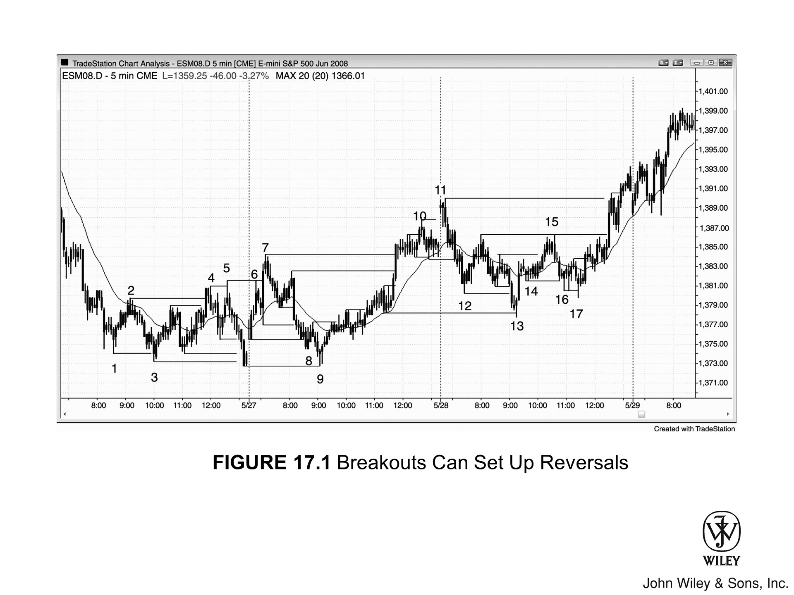
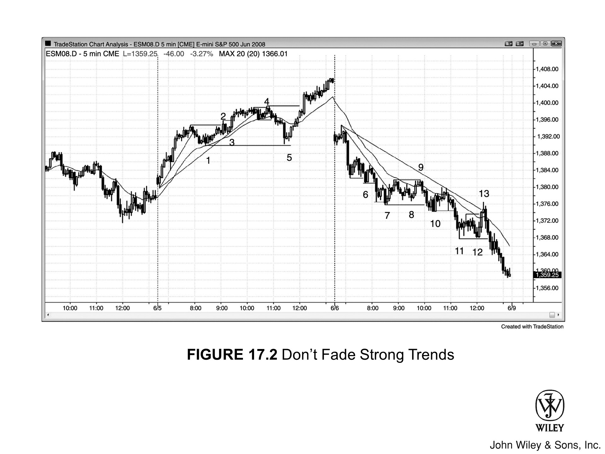

## 水平线：波段点与关键价格位

大多数交易日都是**交易区间日**，或者至少存在大量交易区间行为。在这类行情中，横跨**波段高点**和低点的水平线往往构成明显的阻力位，反复导致**突破失败**，进而推动**反转**。预期**波段高点突破**会失败，形成**HH 反转建仓形态**；**波段低点突破**也会失败，形成**LL 反转建仓形态**。有时失败本身也会失败，即出现**突破回调建仓形态**，市场在此基础上走出更极端的 **HH** 或 **LL**。逆势做第二次 HH 或 LL 建仓形态的成功率更高，因为这已是市场第二次尝试反转，而**第二次信号**在交易区间日里本身就是不错的建仓形态。

在**趋势日**，水平线通常只用于**回调**入场。以**多头趋势日**为例，市场强势向上突破交易区间后，往往会在几根K线后回调至突破位附近。如果回调时出现**多头反转建仓形态**，就是一个不错的**突破回调买入建仓形态**。

---

## 图 17.1：突破可能形成反转建仓形态

大多数交易日并非强趋势日。在这类行情中，交易员应该时刻关注所有既有的**波段高点**和低点，观察市场是否形成**突破失败**，进而产生**反转入场机会**。**第二次信号**是最佳选择。在交易区间日，日内中段像磁铁一样吸引价格，因此更极端的位置更有可能带来至少剥头皮级别的利润。如图 17.1，K线 5 就是在 K线 2 之上形成的**第二次 HH**。

K线 9 是跌破开盘低点后的**第二次向上反转尝试**，同时与前一日低点构成**双底**。

### 图 17.1 深入解析

在图 17.1 中，K线 5 也是从 K线 3 低点起的**三连推**。尽管形态上不像标准**楔形**，但**三连推形态**通常表现与楔形一致，可以视为楔形的变体。

K线 9 是一个**扩张三角形底部**的第七个顶点（尽管它与前一日低点构成**双底**而非更低低点，但两者价位相近，足以视为同一情形）；K线 11 则是对应的**扩张三角形顶部**。局部来看，这里还有一个更小的扩张三角形：K线 10 是第二次向上推，距第一次大约五根K线。

K线 13 是一个较大的**双底回调**。双底的参照底部有多个可选项，其中 K线 3 和 K线 9 最具代表性。同时，由于此前经历了两段大型、复杂的下跌腿，K线 13 也是一个**高 2 买入建仓形态**。K线 9 到 K线 11 构成一段**多头通道**，本质上是一面**熊旗**，因此 K线 13 也是对该熊旗的**突破失败**。此外，K线 10 前后的小波段低点是第一次向下推，K线 12 是第二次向下推，合在一起构成一个较大的**楔形牛旗**。

K线 15 是一个**双顶熊旗**，但随后一根大阳线突破了其高点，市场明显转强，这一熊旗形态就此失败。

K线 17 是低于 K线 14 的**第二次 LL**，同时也是低于 K线 16 的 **LL**。它与 K线 14、K线 16 共同构成一个**楔形牛旗**，也是突破 K线 11 至 K线 13 牛旗之后的**突破回调**，形成了一个 **HL**。

---

## 图 17.2：不要在强趋势中逆势做

在**强趋势日**，只有当价格先完成一次有效的**趋势线**突破、同时出现强势**反转K线**时，才考虑在**多头趋势**中逆势做**波段高点**回落，或在**空头趋势**中逆势做波段低点反弹。如图 17.2，两个交易日都是强趋势日，行情在开盘附近触达一个极端之后，超过两小时没有出现回调到均线的机会（期间连续出现 20 根**均线缺口K线建仓形态**）。K线 4 是一根**空头反转K线**，在一段小型向上反转突破交易区间之后再度向下反转；K线 8 是一个小型**两K线反转**的第一根，其上方还有一个高于 K线 7 的 **HL**。不过，这些都是逆势交易，且趋势线突破时的逆势动能相当有限，因此信号较弱，只能做**剥头皮**。更重要的是，如果这些逆势机会让你分心、错过了**顺势入场点**，就得不偿失——顺势仓位才应该持有较大的波段比例。

### 图 17.2 深入解析

在图 17.2 中，当日开盘价直接向下**突破**了前一日最后一小时形成的**多头通道**。**多头通道**始终要理解为一面**熊旗**。第一根K线收阴，表明空头在开盘时占据优势；但第二根K线立刻向上反转，试图形成**突破失败**，走出一个始于开盘的多头趋势日。然而，这次失败的反转本身也失败了，随后在第四根K线低点下方形成**突破回调做空机会**，并在开盘区间低点下方再度触发做空信号。之后走出一段强劲的**两K线空头急速**，随即进入一段漫长的**空头通道**。

K线 1 与 K线 5 构成**双底牛旗**，K线 9 是**双顶熊旗**的组成部分，K线 8 则是另一个小型**双底牛旗**。记住，**双底牛旗**往往就是一个形成双底的 **HL**。

K线 4 是**急速与通道多头日**中通道顶部的可能位置，市场随后向下测试到 K线 1（通道起点），由此形成一个**双底牛旗买入建仓形态**。

K线 5 和 K线 13 都是**均线缺口K线建仓形态**，两者均出现在上午 11:30 之后——这个时间段经常出现一段较强的逆势行情，把交易员从趋势中甩出去，或引导他们做错方向。这反而为**顺势交易**提供了可靠的入场机会，通常会走出新的极端，而且往往能一路持续到收盘。
