所谓**微型趋势线**，是指在任意时间周期上，跨越 2 到 10 根左右 **K 线**所画出的**趋势线**。这些 **K 线**大多紧贴或触及**趋势线**，且波幅通常较小。通常，我们也能沿 **K 线**的另一端画出一条**趋势通道线**，从而形成一个极窄的通道，即**微型通道**。

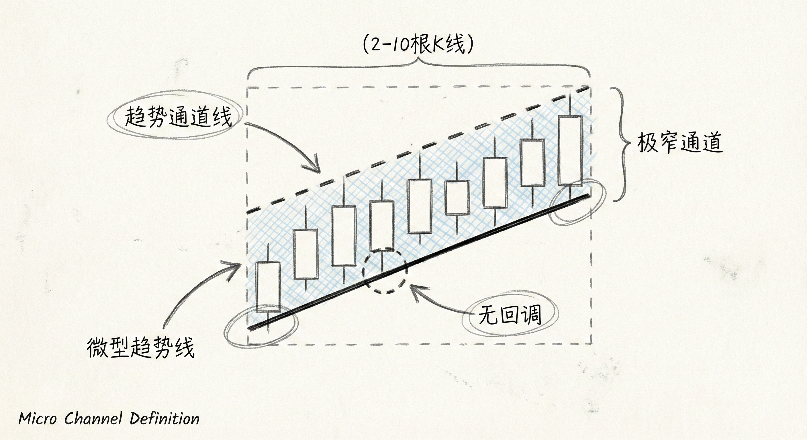

常规通道往往伴随**回调**，而**微型通道**则截然不同：它在推进时几乎没有**回调**，即便有也极少且幅度微小，这使其成为一种极端的**窄通道**。

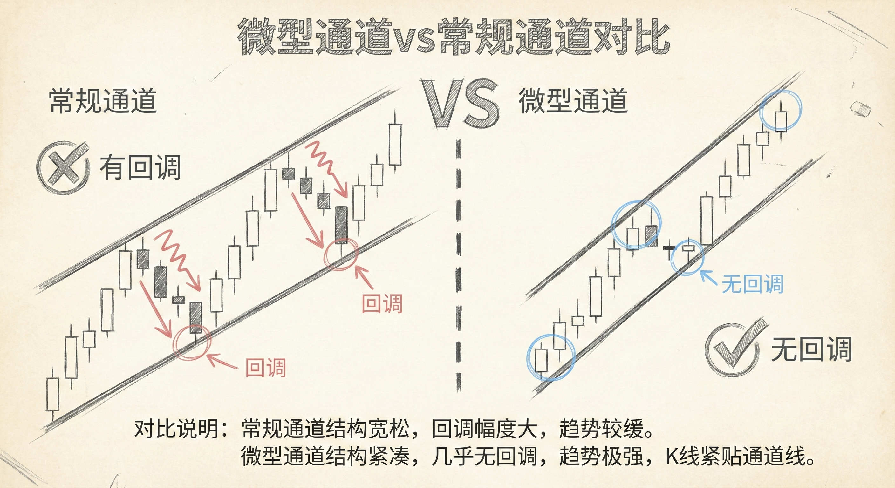

**K 线**数量越多、走势越强（例如顺着**微型通道**方向出现大实体**趋势 K 线**）、**影线**越短，**微型通道**就越强劲。这也意味着，首次**回调**想要**反转**趋势，失败的概率极大。

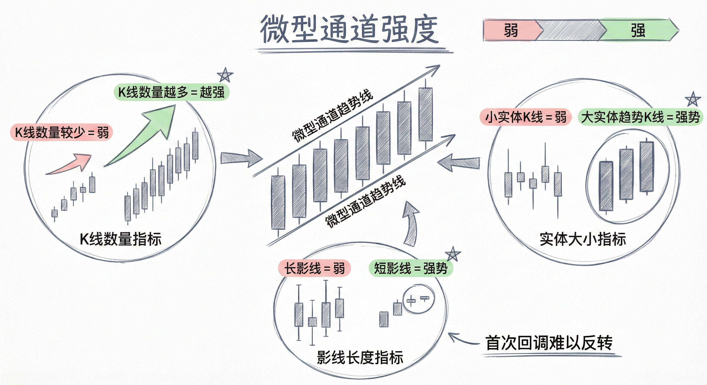

**微型通道**有时能持续 10 根 **K 线**以上；有时则是先运行约 10 根，经历一次小幅**回调**，随后再延续 10 根左右。无论你将其视为：

*   一个巨大的**微型通道**（**微型通道**本就是**窄通道**的一种）；
*   还是看作被小幅**回调**隔开的两段连续**微型通道**；
*   亦或干脆视为一个大的**窄通道**；

其实都无关紧要——因为你的交易手法完全相同。此类**趋势**极为强劲，交易者只会预期**反转**尝试失败并转化为**回调**，进而推动**趋势**继续延展。

十年前，交易者视微型通道为程序化交易的信号。如今，绝大多数交易均由计算机执行，再强调微型通道是程序化交易的迹象已无甚意义，因为图表上的每一根 K 线，本质上都是程序化交易的产物。

微型通道不过是程序化交易的一种特定形态，往往是多家机构同时运行程序的结果。最初可能由一家或几家机构发起，但一旦动量确立，动量程序便会侦测到这一动向并开始同向交易，进而增强趋势的力度。当趋势开始突破阻力位时，突破程序随即入场。有些程序会顺势交易，另一些则开始逆势分批建仓，或者将低位买入的多头头寸分批减仓。

最终，某一根 K 线会刺穿趋势线或趋势通道线，引发突破。无论是在多头趋势、空头趋势，还是交易区间中，都可能形成多头或空头微型通道。如何交易这些通道，取决于它们所处的市场背景。多头和空头通道既可能向上突破，也可能向下突破。

正如所有突破一样，随后的演变不外乎三种情况：
1.  突破成功，引发该方向上的持续交易；
2.  突破失败，演变为小级别的高潮反转；
3.  市场转入横盘，形态演化为交易区间。

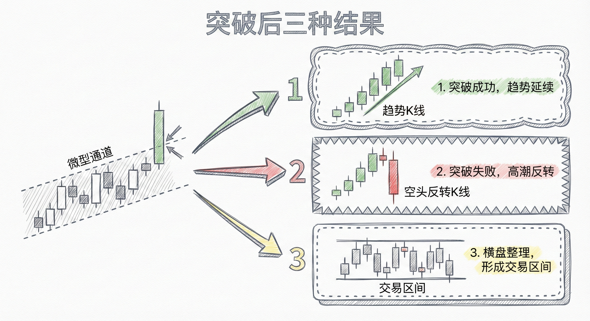

面对任何突破，交易者只有两种选择：
*   要么顺势交易，期待行情延续；
*   要么反向交易，押注突破失败。

突破、突破失败以及突破回调之间关系密切，将在第二本书中详述。作为指引，交易者会比较突破的强度与反转尝试的强度：
*   若一方明显占优，市场便很可能朝该方向运行。
*   若两者势均力敌，交易者则需等待更多 K 线走出，再研判市场的后续走向。

### 微型通道与旗形形态

*   **多头趋势中的空头微型通道：** 通常意味着牛旗，或是牛旗的最后一腿。交易者会寻找一根信号 K 线，在其高点上方挂出买入突破单，等待价格突破该微型通道及牛旗时进场。

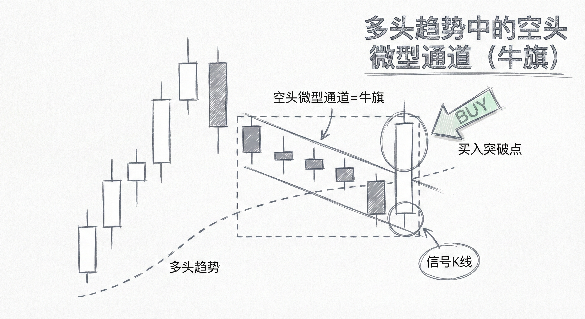

*   **空头趋势中的多头微型通道：** 往往是熊旗或熊旗的最后一腿，交易者会在任意信号 K 线下方做空。

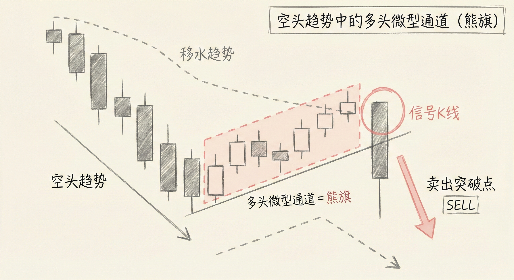

### 同向微型通道的首次突破

如果情况并非牛旗中的空头微型通道，而是多头趋势中本身就存在一个上升的微型通道（即多头微型通道），那么其首次向下突破（即第一次回调）通常跌幅有限，且会被激进买入。多头微型通道包含的 K 线越多，随后的空头突破就越难扭转多头趋势。

**例如，若多头趋势中出现一个由 5 根 K 线组成的微型通道：**

1.  **市场结构：** 在第 5 根 K 线的低点及其下方，买家很可能远多于卖家。一旦市价跌破第 5 根 K 线，便构成了对该多头通道的空头突破。然而，抛售不太可能持续超过一两根 K 线，因为多头会急于买入这波强劲微型通道趋势后的第一次回调。
2.  **交易心理：** 请记住，许多交易者眼看着这 5 根 K 线连续上涨，一直在苦等回调进场。他们会急于在第 5 根 K 线下方买入，也会在回调 K 线的高点上方买入——这根回调 K 线本质上是一根突破失败的买入信号 K 线（即 High 1 买入策略）。

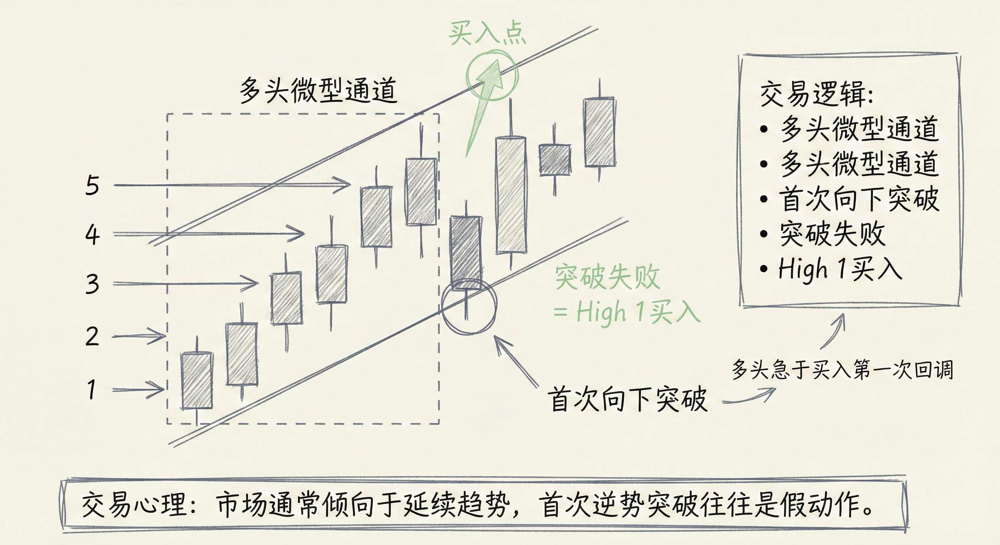

### 微型双顶卖出信号

如果市场触发做多，却在随后一两根 K 线内形成空头反转 K 线，这就构成了微型双顶卖出信号。

这种情况也可视为对"向下突破多头微型通道"这一动作的回调，即便其高点已经超过了微型通道中的最高 K 线。这仅仅是一个"更高的高点反转"（Higher High Reversal），也就是主要趋势反转的微缩版（关于反转将在第 3 册详述）。

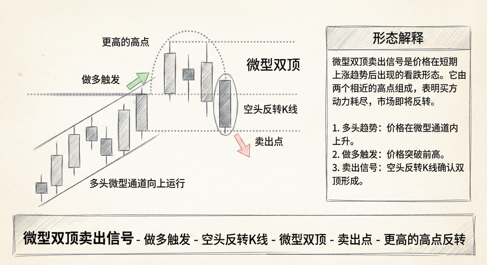

交易者务必明白，做多不必非等回调不可。在多头趋势中，一旦牛市微型通道走出两三根 K 线，许多老手便心知肚明：市场正处于极强买入程序的初期，动量型程序也在大举扫货。

这些交易者会跟随计算机的操作：
*   **逢阳线收盘即买入**；
*   在每根 K 线收盘价下方 1 到 2 个 tick 处挂限价单；
*   在前一根 K 线低点上方 1 到 2 个 tick 处也挂单接货；
*   若微型通道内的最大回调仅为 5 个 tick，他们便会在回调 3 或 4 个 tick 的位置挂限价单吸筹。

他们预期，价格首次跌破前一根 K 线低点时，必将引来更强的买盘。因此他们确信，即便遭遇回调，最近这笔买单仍大概率能够获利。既然这一路已经获利丰厚，即便回调最终来临，他们也不介意最后一单是保本离场还是小亏出局。

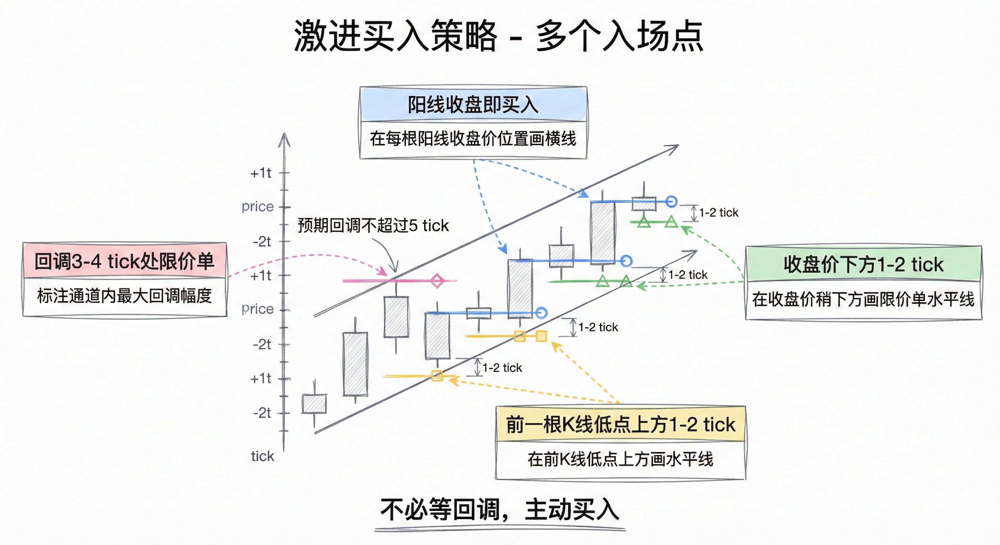

***

和任何通道一样，牛市微型通道既可能出现在交易区间内，也可能形成于多头或空头趋势中：

1.  **若处于多头趋势中**
    上涨确定性更高，交易者应寻求在前一根 K 线的中部或底部附近买入。当微型通道极窄（tight）时，在大周期图表上往往表现为一根急速（Spike）；随后可能演变为更宽的通道，并基于该窄微型通道的高度，触及测量移动的目标位。

2.  **若处于空头趋势中（作为熊旗）**
    当牛市微型通道出现在空头趋势中，它便是熊旗，交易者应寻找机会做空向下突破，或在突破后的回调中进场做空。

3.  **若处于空头趋势中（作为最终旗形）**
    若空头趋势中出现潜在低点，随后形成牛市微型通道，该通道可能演变为空头趋势的最终旗形，进而向上而非向下突破；此突破可能成为开启多头趋势的急速（Spike）。多头突破发生时，往往紧随在失败的低 1、2 或 3 之后。

### 微型通道的定义与特性

微型通道本质上是一个倾斜的窄交易区间（sloping tight trading range），因此它具有强大的磁力，往往能拉住价格，阻止其大幅突破。

这种通道通常非常紧凑，有时甚至可以直接充当"急速"（spike），随后可能演变为更宽的通道，从而形成"急速转通道形态"（spike and channel trend）。

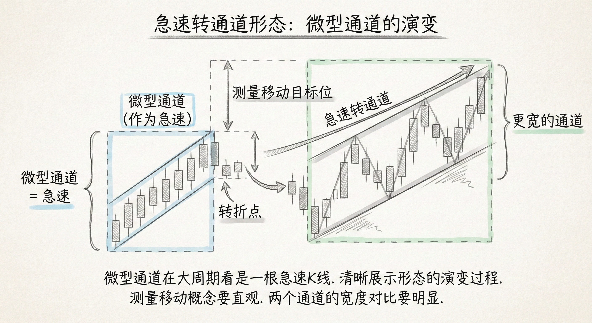

### 微型通道的突破机制

当微型通道出现突破时，通常只持续一两根 K 线，且主要是因为获利了结。例如，假设存在一个多头微型通道（即向上倾斜的微型通道），如果某根 K 线跌破了前一根 K 线的低点，这就是对微型通道的向下突破。这种下跌主要是多头获利了结所致，尽管也有部分空头在尝试做空。

在随后的那一两根 K 线里，新的买家会进场，部分空头会离场，市场通常会涨破前一根 K 线的高点。此时，市场参与者会有不同的反应：

*   **做多视角：** 一些交易者会将此视为微型通道的突破失败，当市场涨破前一根 K 线的高点时，他们会买入。对他们而言，这就是一个高 1 买入策略（high 1 buy setup）。
*   **做空视角：** 另一些人则认为趋势正在反转下跌；他们会等待市场在接下来几根 K 线中形成一个突破回调（breakout pullback）——无论是形成更高的高点还是更低的高点——然后在前一根 K 线的低点下方做空。

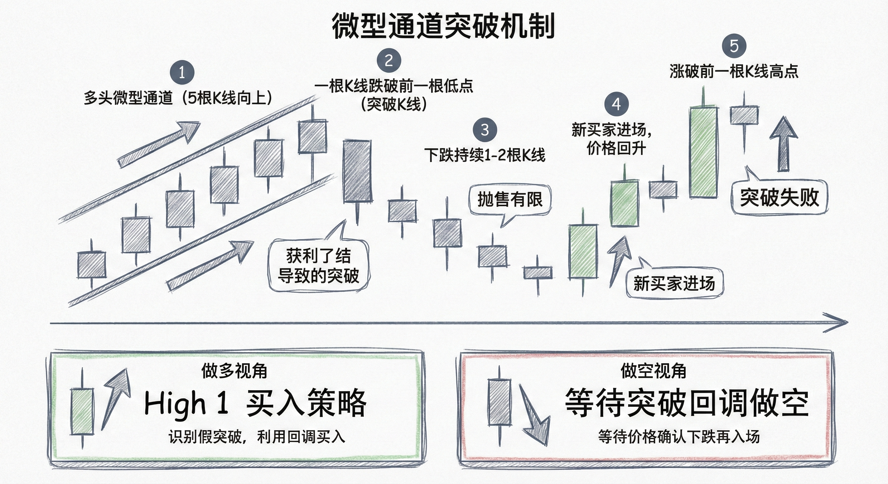

### 整体背景（Context）的影响

整体背景（context）能提供线索，暗示哪种结果的可能性更大：

*   **强空头趋势背景：** 例如，如果市场处于强空头趋势（strong bear trend）中，而该多头微型通道仅仅是一个回调，那么概率偏向于：跌破微型通道后，会有更多的抛售。如果市场涨破了那根突破 K 线，空头会在前一根 K 线的低点下方放置做空的突破单（stop orders）。

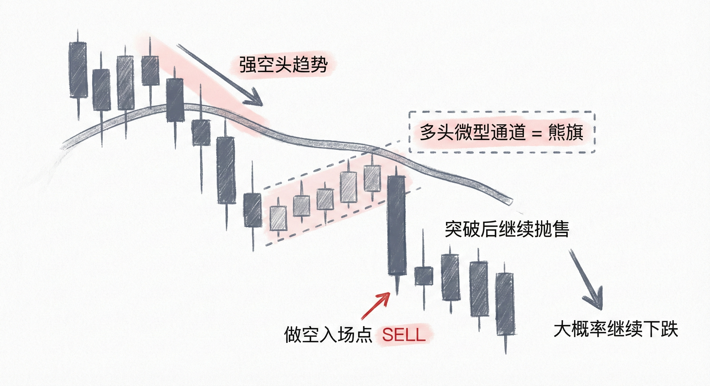

*   **牛市突破背景：** 相反，如果该多头微型通道是在牛市中作为交易区间的突破而形成的，那么概率偏向于：微型通道下方的突破将成为多头趋势中的一次回调，多头会在前一根 K 线高点上方一个 tick 处放置买单。

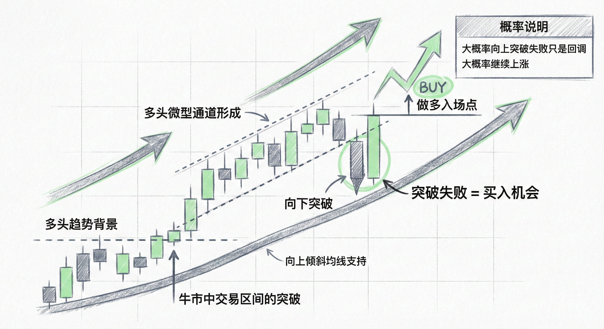

突破趋势线，便搭建起顺势入场的架构。试举一例：

*   **若市场处于 Always-in 多头状态**
    且走出一个多头微型通道，随后出现一根 K 线，其低点跌破了微型多头趋势线，那么在该 K 线高点上方买入，往往是一笔可靠的交易。这既是一个微小却强劲的单 K 线牛旗（高 1 买入策略），也是一个失败突破买入信号。
    > 在小周期图表上，这或许表现为两段式回调；但建议最好别去看，因为短时间内涌入的信息量过大，容易让你手忙脚乱，导致管理失误甚至错失入场机会。

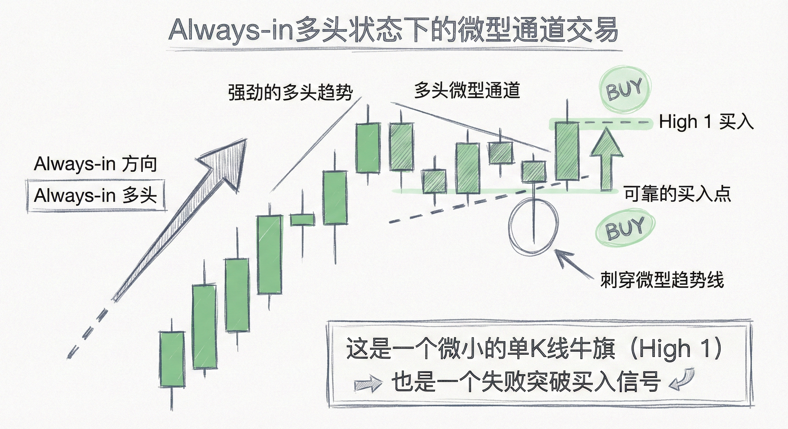

如果多头微型通道并非处于强多头趋势中，而是身处交易区间或空头趋势之内，那么在买入这个失败的空头突破之前，你还需斟酌其他因素。

*   **若通道位于交易区间顶部**
    通常最好放弃买入那个失败突破，不妨耐心等待，观察向上的反转是否会停滞，并演变为相对于突破点的更高高点回调。如果价格仅上涨一两根 K 线便形成看跌反转 K 线，且位置靠近交易区间顶部，这便构成了一个可靠的做空策略（即微型双顶，详见第三卷）。

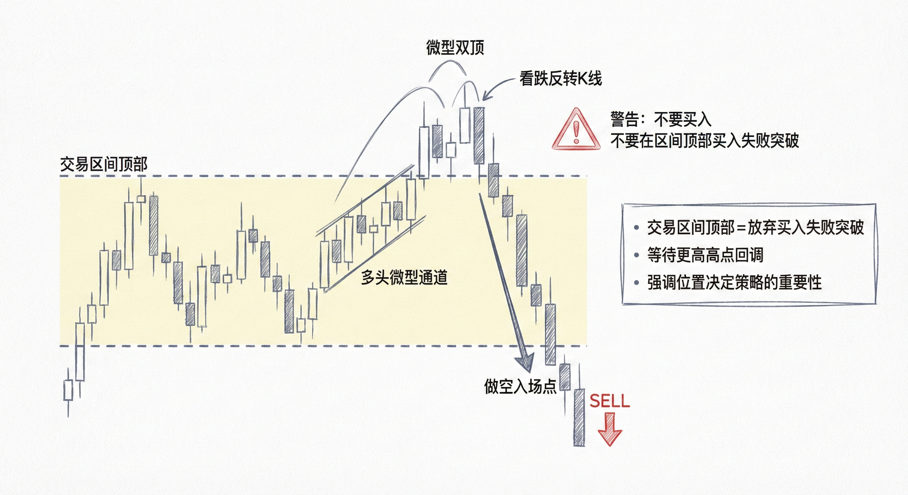

*   **如果多头微型通道是紧贴均线下方的熊旗**
    你应该只寻觅做空良机，因为从概率上看，空头的抛压终将压倒那些买入回调的多头。此时应等待价格向下跌破通道，随后观察突破失败以及随之而来的再一次上推。
    *   如果这次向上反转在一两根 K 线内，于均线处形成看跌反转 K 线，这通常便是一个可靠的突破回调做空策略（低 2）。
    *   这意味着市场向下跌破了多头微型通道，随后回调并形成了一个小幅的更高高点。
    *   最后，一旦价格反转下跌，便构成了对这个已演变为熊旗形态的向下突破。

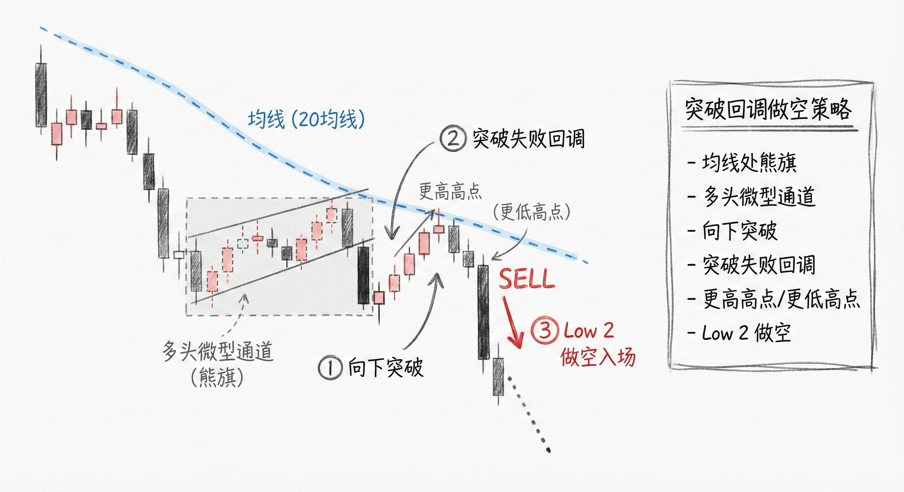

凡是向下跌破多头通道，行情往往不会一蹴而就：市场常会先有一波回调，随后抛售才会卷土重来。这波回调可能形成：

*   **更低的高点**
*   **更高的高点**（所谓"更高的高点"，指的是这根 K 线的高点超越了最近的波段高点——通常也就是多头通道的极值点）。

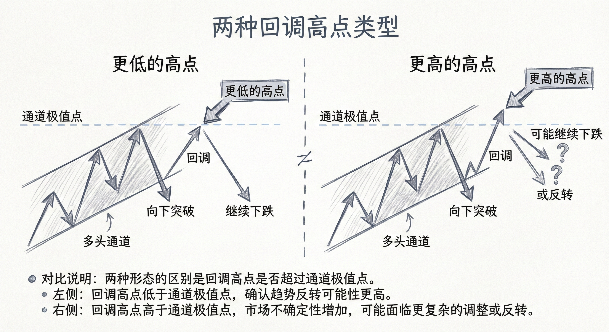

---

### 1. 多头应对思路

既然大多数趋势反转的尝试终将失败，那么当下的空头突破，大概率也会无疾而终，最终沦为多头趋势中的一次回调，随后多头卷土重来。

*   **操作建议**：交易者应在突破 K 线高点上方 1 tick 处挂单做多，一旦空头突破失败、多头趋势恢复，便能顺势入场。

### 2. 潜在风险与空头陷阱

但切记，这笔多单也可能是个“**多头陷阱**”，一不小心就会被套牢在亏损的仓位里。别忘了，虽说反转难成，但并非绝无可能。此时的向下突破未必是假突破，市场也许只是针对这波空头突破做个短暂回调，形成一个小幅的“更高的高点”或“更低的高点”，随即抛售再度袭来。

这可能演变成一次成功的趋势反转，进而开启一段空头腿，甚至引发新的空头趋势。

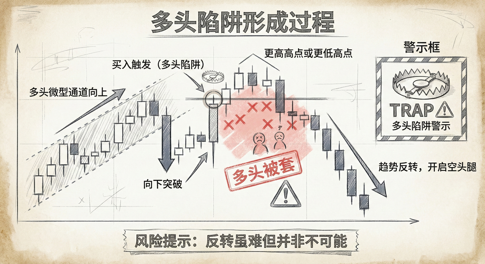

### 3. 反手策略：突破回调做空

正因如此，如果整体价格行为显示反转确有道理，交易者必须做好准备：

*   一旦跌破做多入场 K 线，立即**反手做空**。
*   这种情形，便是所谓的"**突破回调做空策略**"。

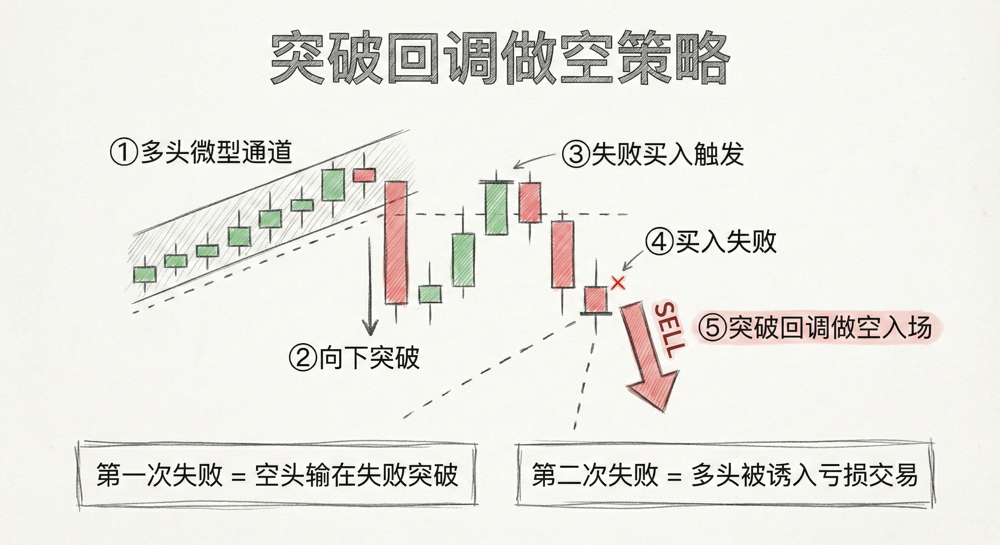

### 4. 底层逻辑

这里有个底层逻辑：

1.  凡是突破失败，往往都意味着顺原趋势方向的入场良机。
2.  而如果这笔顺势交易也宣告失败，那它就演变成了针对最初空头突破的“突破回调”（反向的失败构成了突破回调），这也标志着市场第二次尝试将趋势反转为下跌。

如果**突破回调做空策略**被触发（也就是价格跌破前一根 K 线低点 1 个 tick，这根 K 线通常是**多头突破 K 线**），就要看看最近几根 K 线的**实体**有多大：

*   **如果它们是多头或空头趋势 K 线**
    那么这次“第二次失败”演变为成功的**第二次入场做空**的胜算就很高。
    *   **市场逻辑**：第一次失败是空头输在了失败的**向下突破**上，导致他们的空头仓位被震出局。第二次失败则是多头被诱入了一笔亏损交易，而这笔交易源于**通道**下方那个失败的**空头突破**。
    *   **当前局面**：如果市场此刻再次掉头向下，局面就是空头刚被震出，多头刚被套牢。通常来说，如果多空双方都中了陷阱（一方被套，一方被震），下一个**入场策略**的成功率就会提升。

*   **如果 K 线看起来更像十字星**
    市场很可能会进入**交易区间**，但概率上仍然倾向于**向下突破**。

*   **如果拿不准**
    那就**等待**。因为大多数交易者很可能也同样拿不准，随之而来的通常就是**交易区间**。

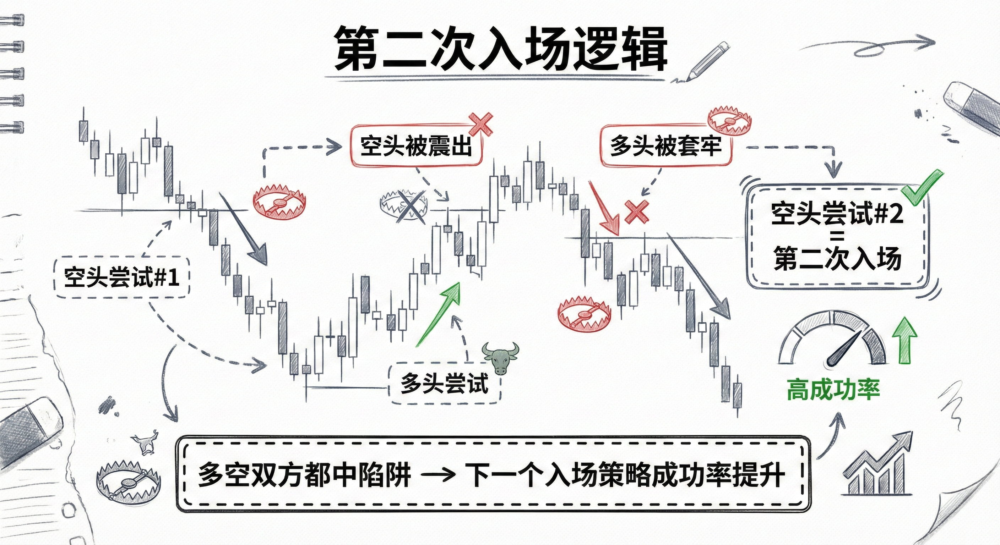

---

关于 **1 分钟图表**的交易警示：

*   **现象**：尽管在 **1 分钟图表**上，绝大多数**微型趋势线**的突破都属于单腿或**双腿回调**。
*   **建议**：你应该**避免**在那张图上交易，因为很可能会亏钱。
*   **原因**：
    *   大多数交易者没法抓住所有信号，结果总是难免挑中太多亏损的单子，却错过了足够多盈利的机会。
    *   最好的交易往往成型快、触发也快，所以很容易错过。
    *   许多亏损的交易往往成型缓慢，给了交易者充足的时间入场，最终把他们套在错误的方向上。

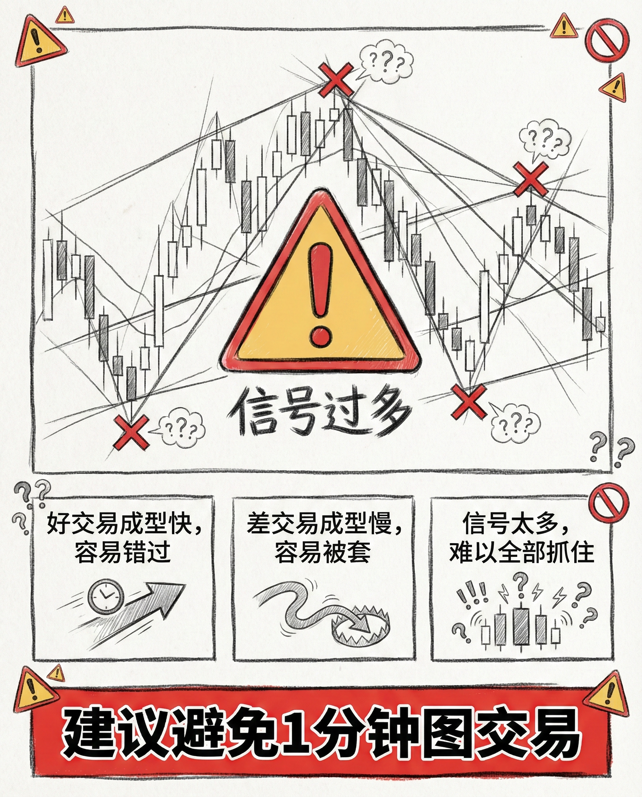

---

那个**多头微型通道**也可能转而**向上突破**，越过**趋势通道线**，试图走出一个更为陡峭的**多头趋势**。如果突破失败，并且出现了一根强劲的**空头反转 K 线**，那么这个**买入高潮**就是一个潜在的做空**入场策略**。

- **微型趋势线若延续了 10 根或更多 K 线**，短期内出现可交易反转的概率便会显著提升。这种走势难以维系，本质上属于一种高潮，随后往往终将迎来回调或反转。
    - 高潮过后，要随时准备捕捉"突破回调入场"的机会。
    - 这是反转趋势的第二次尝试——最初对趋势线的突破则是第一次。

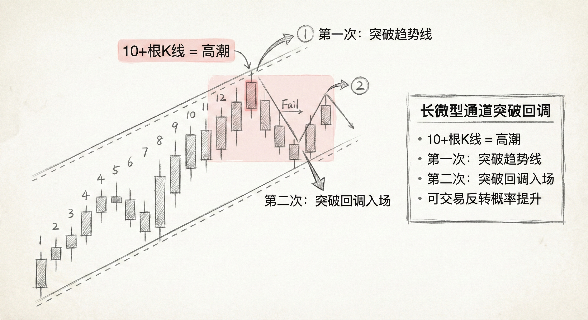

- **微型趋势线的突破不仅在微型通道中意义重大，在任何强趋势行情中也同样关键**。假设市场处于强空头趋势，空头趋势 K 线实体巨大，K 线间重叠极少，且连续四五根 K 线未见回调，你大概会急不可耐地想要做空。此时应寻找空头微型趋势线，一旦有 K 线向上刺穿该线，就在其低点下方卖出。
    - 这种上穿动作往往构成突破失败的做空策略。
    - 具体做法是：在那根向上突破空头微型趋势线的 K 线下方 1 个 tick 处进场（即低 1 做空策略）。

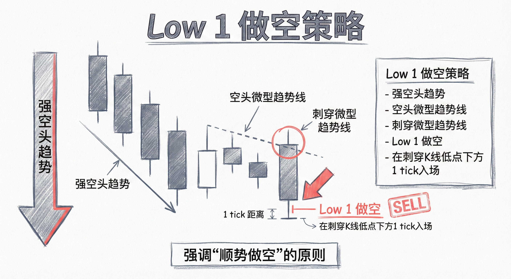

- **那些短促陡峭的趋势线，哪怕只由连续两根 K 线连成，也常能提供顺势交易的良机**。
    - 若趋势陡峭，有时一根小回调 K 线或停顿 K 线便足以穿透极短的微型趋势线。此时，该 K 线便可作为顺势入场的信号 K 线。
    - 在 Eminis 市场中，有些穿透幅度甚至不足 1 个 tick，但依然有效。

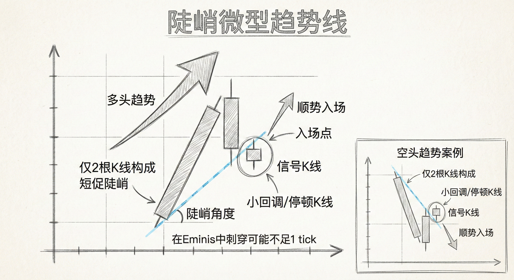

趋势一旦回调，往往能画出一条微型趋势线。

**试举一例：**

*   在多头趋势的回调中，走出一波持续 3 到 10 根 K 线的空头微型趋势。
*   随后，价格向上突破了这条微型趋势线。
*   理论上，这似乎构成了一个做空策略——即押注这次突破会失败。

**但千万别上当。**

大背景是多头趋势，且价格几乎总是位于移动平均线附近或上方，此时绝不该做空。否则，你就是身处多头趋势，在紧贴上行移动平均线的牛旗底部持有空单。这种交易，胜率极低。

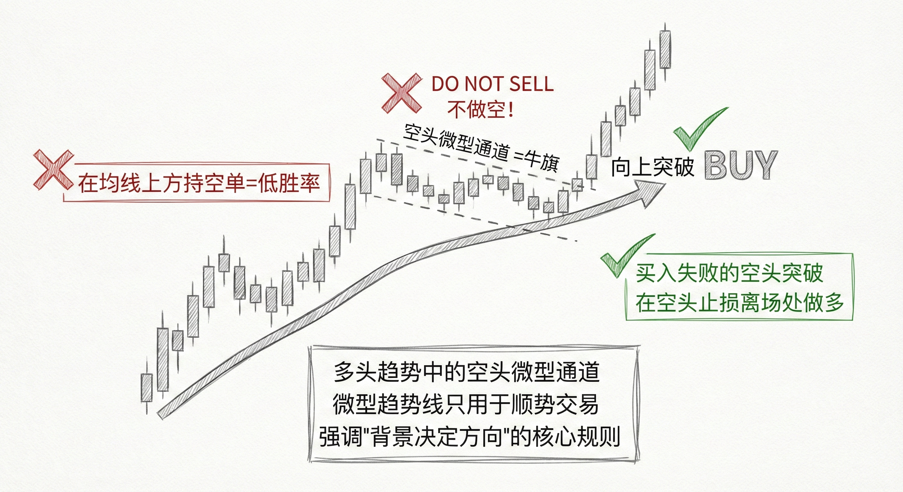

既然做空大概率会失败，你就该提前预判，准备好"买入失败"——进场点就选在那些被套空头止损离场的位置。

你的这笔多单，本质上属于“**突破回调买入**”。逻辑很清晰：

1.  市场先是向上突破空头微型趋势线；
2.  随后回调形成一个微幅的更低低点或更高低点；
3.  紧接着重拾升势，回归当天的主要趋势方向。

> **切记：**微型趋势线只能用来寻找顺势交易策略。

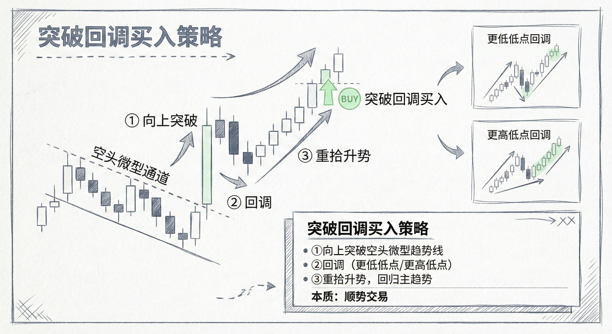

不过，一旦趋势确立反转——比如跌破多头趋势线后，又从更高的高点向下反转——情况便截然不同。此时，你就应该利用微型趋势线寻找做空策略，哪怕价格此时正处于或略高于移动平均线。

正如任何图表形态一样，微型通道在小周期和大周期图表上的样貌截然不同。尽管在微型通道（或其他类型的窄通道）中，趋势 K 线通常实体不大，且相邻 K 线间重叠较多，但其趋势强度却不容小觑。

**微型通道的特征与演变：**

*   **高周期表现**：在更高周期的图表上，这往往表现为一根巨大的趋势 K 线，或者一连串的趋势 K 线。
*   **形态演变**：这意味着它经常充当"急速"（spike）的角色，随后往往会演变为更宽的通道，这与任何其他的"急速转通道"趋势如出一辙。
*   **内部结构**：虽然微型通道内部看似没有回调，但若切换到足够小的时间周期去观察，你会发现其实充满了回调。

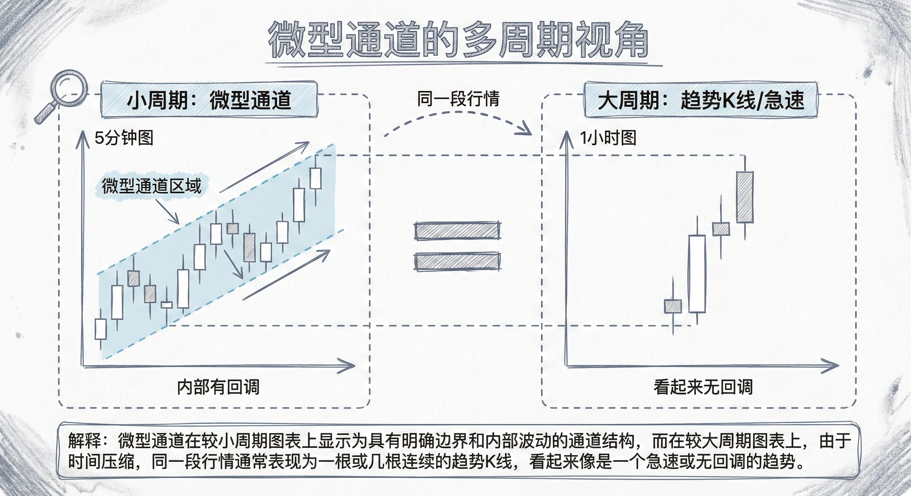

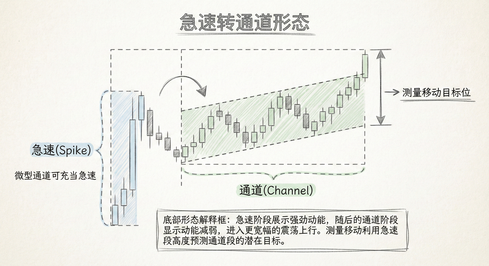

***

**[图 16.1] 微型趋势线**

日内交易中，小趋势线能提供许多剥头皮的机会，尤其是在 1 分钟图上——尽管 1 分钟图通常不值得去交易。在 [图 16.1] 中：

*   **左侧**：Emini 的 1 分钟图。
*   **右侧**：5 分钟图。
*   **标记**：图中的数字标记对应的是同一根 K 线。

两张图都表明，对微小趋势线的突破一旦失败，往往能带来有利可图的“押注失败”（fade）交易机会。

1 分钟图上还有其他交易机会未在图中展示。本图的意图仅在于说明：**5 分钟图上的微型趋势线，对应着 1 分钟图上更明显、更长的趋势线。** 因此，只要你能读懂 5 分钟图，就不必为了下单而额外去盯着 1 分钟图看。这些交易中，有许多在 1 分钟图上本来都可以做成获利的剥头皮交易。

**关于微型趋势线突破的细节：**

请注意，5 分钟图上有些微型趋势线的突破非常容易被忽视，因为其幅度甚至不足 1 个 tick。大多数交易者根本看不出这些细节：

*   **K 线 3、5、6 和 7**：都是 5 分钟图上微型趋势线的失败突破。
*   **K 线 5**：此处的突破尤为重要，它引发了一笔极佳的做空剥头皮交易。这是向上突破空头趋势线的第二次失败尝试（K 线 3 是第一次）。

Bar 7 跌破多头微型通道后突破失败，以此做多风险很高，顶多只能剥个头皮。由于这只是向均线回调的熊旗，更合理的预期是上涨受阻，演变成突破回调做空形态——事实也确实如此。

价格行为交易在最微小的级别同样适用。看 1 分钟图：

*   **Bar 8 形态**：这是一个“更高高点突破测试”做多形态（它测试了形成空头趋势低点的那根 K 线的高点）。
*   **入场后续**：虽然入场两根 K 线后，市场回落测试了 Bar 8 信号 K 线的低点，但并未触及信号 K 线下方的保护性止损。
*   **微观结构**：1 分钟图这段走势里甚至包含了一个更微小的主要反转。先是一段微小的多头趋势（由底部向上的多头微型趋势线可见），随后 Bar 7 跌破趋势线，紧接着是对该微小多头趋势极值的“更高高点测试”。
*   **结论**：由于形态太小，正如预期，向下反转至 Bar 8 的这波走势只是一笔剥头皮交易。

回到 5 分钟图，Bar 8 并未构成做多形态。为什么？

*   **趋势背景**：因为这是空头趋势中的回调。在空头趋势日，不应在回调高点买入。
*   **操作策略**：相反，一旦看到微型趋势线买入信号触发，就要准备做空该失败形态，在被套多头被迫亏损离场之处精准进场。

**[图 16.2] 微型趋势线的失败突破**
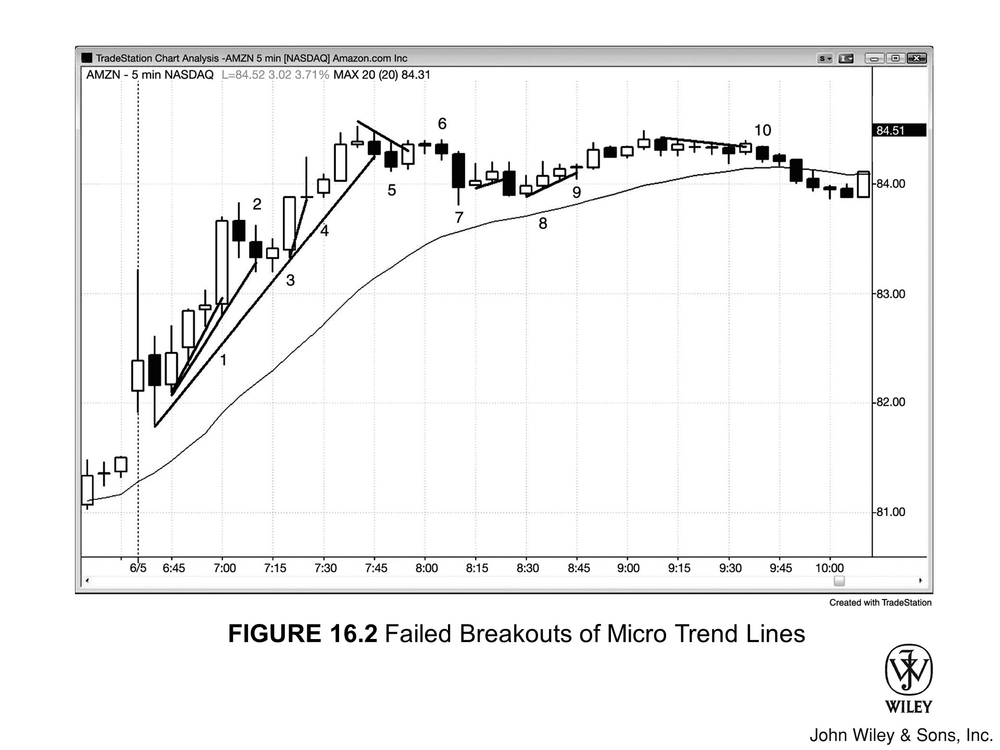

在陡峭趋势中，即便仅由两三根连续 K 线构成的趋势线，只要出现微小突破并随即反转，也能构成顺势入场形态。每一次新的突破都会成为一条更长、更平缓趋势线上的第二个点，直到最终反向趋势线变得更为重要——此时，趋势便已反转。

在 Figure 16.2 中：

*   **K线 1**
    下探至一条 3 K线趋势线下方后反转向上，在前一根 K线高点上方 1 个 tick 处给出了做多入场信号。

*   **K线 2 与 K线 3**
    *   K线 2 下探至一条 6 K线趋势线下方。交易者会在其高点上方挂买入突破单。若未成交，他们会将买单移至下一根 K线高点，最终在 K线 3 处成交。这是一个高 1 买入点。
    *   在多头趋势中，针对多头微型通道的空头突破大多会失败，从而转化为高 1 买入策略。由于微型通道通常是在向上突破某些关键位（如前高）——本例便是如此，价格突破了当天的第一根 K线——因此这个高 1 通常也是个突破回调买入策略。

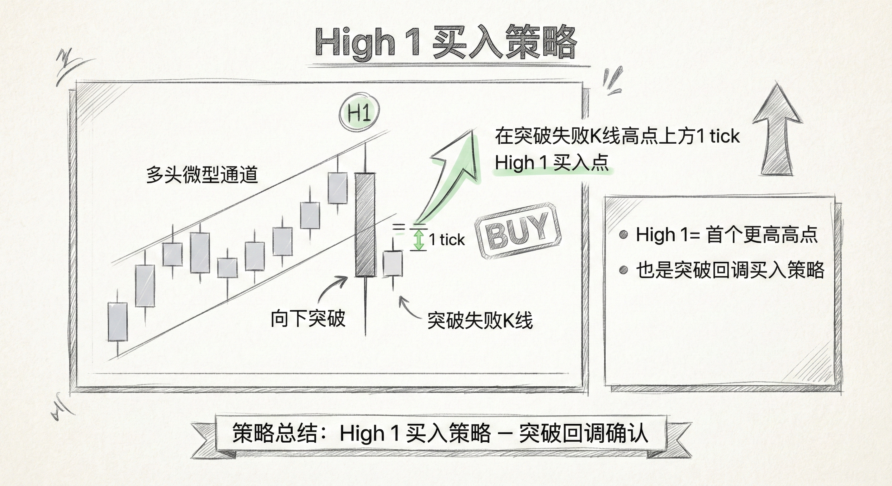

    *   顺带一提，K线 2 之前的那根 K线是一个潜在的做空形态，依据是微型趋势通道线（未画出）的突破失败，该通道线与延伸至 K线 1 的 3 K线微型趋势线平行。虽然上涨动能太强，若无二次入场不宜做空，但这展示了微型趋势通道线如何构建逆势交易机会。

*   **K线 4**
    是一根小孕线，下探至 2 K线趋势线下方（刺破部分未显示）。买点位于这根小孕线高点上方 1 个 tick 处的突破单。

*   **K线 5 与 K线 6**
    *   K线 5 跌破了当天的主要趋势线（任何持续约一小时的趋势线都更具分量），因此交易者会认为两段式回调发生的概率更高。
    *   K线 5 之后的那根 K线向上突破了空头趋势线，随后在 K线 6 的更低高点处触发了做空信号。
    *   当出现像 K线 5 之后那种小十字星时，通常最好等待更大的趋势 K线出现再入场。不过，在亚马逊 (AMZN) 的这个案例中，这些趋势线反转仍然带来了 30 到 50 美分的剥头皮利润。
    *   由于 K线 5 是对相当窄的多头通道的首次突破，不宜直接做空，而应等待突破回调后再进场做空。

### 本图深入解析

**K线 6** 是个合理的做空入场点，形态上属于更低高点的突破回调，目标是向下剥头皮至移动平均线。但这并非一笔优质的趋势反转交易，因为市场尚未测试移动平均线，随后也未去测试多头趋势的高点。

**K线 6** 是多头趋势中的微型趋势线做空：
*   若此类形态紧贴移动平均线出现，通常是一笔糟糕的交易。
*   但在这里，向下至移动平均线仍有充足的空间；加之它紧随楔形顶之后，因此很可能是向下两段式回调的一部分。

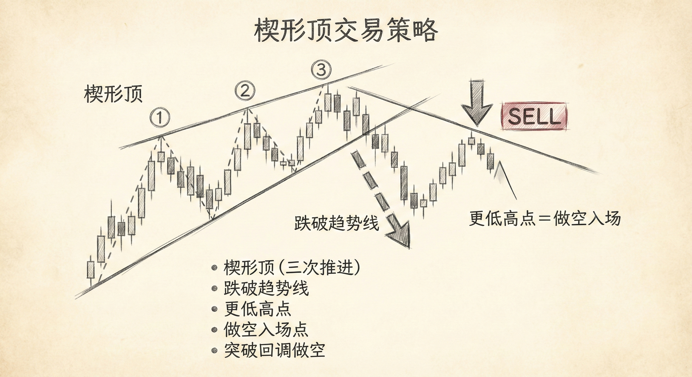

***

传统通道里回调司空见惯，微型通道则不同，“缺乏回调”恰恰是其标志性特征。例如，始于 **K线 8** 前一根 K线的多头微型通道，其第一段终结于 **K线 9** 的小幅回调。

*   有些交易者把随后的四根 K线看作同一通道的延续，视 **K线 9** 为回调；
*   另一些人则认为 **K线 9** 开启了第二个微型通道。

但这其实无关紧要，因为随后至 **K线 10** 的横盘走势，已经向下突破了这两种结构。

如图 Figure 16.2 所示：

*   **市场开盘与第 1 根 K 线**：市场跳空高开，突破了昨日收盘价，且第 1 根 K 线是一根多头趋势 K 线。这根 K 线实体相当强，下方带有影线，两者均显示出买压。昨日收盘时出现了一些多头实体，再次印证了多头的强势。因此，如果想基于潜在的失败突破策略做空，这并不是一根强力的做空信号 K 线。
*   **第 2 根 K 线**：收出空头实体，并跌破了第 1 根 K 线的低点；如果预期会出现“开盘即涨的多头日”趋势，这是一个合理的突破回调做多策略。
*   **后续走势与 Bar 3**：随后连收 4 根多头趋势 K 线，形成一波急速上涨，但最后一根 K 线波幅巨大，可能暗示某种程度的衰竭。这引发了第一次回调做多策略，Bar 3 是一根强劲的入场 K 线。从突破开盘高点的角度看，这也是一个突破回调做多策略。
*   **测量移动**：由于当天第 1 根 K 线异常巨大，它可能引发——事实上也确实引发了——一段大约为测量移动幅度的上涨。

***

### Figure 16.3 强趋势中的微型趋势线

*   在强趋势中，即使是基于相邻 K 线画出的小趋势线，其突破也往往会失败，而这些失败的突破恰恰构成了极佳的顺势入场点。
*   在 1 分钟图上，这类形态许多都是两段式回调策略（ABC 回调），但只要你在 5 分钟图上看到了这种假突破，就不必再去查看 1 分钟图。
*   交易时，你不必频繁地在图表上真的画出趋势线，因为大多数趋势即便不画线也一目了然。

如图 Figure 16.3 所示，在这张 AAPL 的 5 分钟图上，基于微型趋势线突破失败的原理，出现了许多绝佳的顺势入场机会。当趋势陡峭有力时，你应当只做顺势，切勿贪图那些微小的反转。

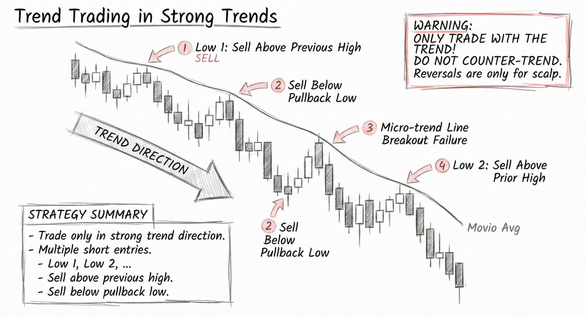

具体分析如下：

*   **Bar 3**
    举例来说，Bar 3 虽然向上突破了一条空头微型趋势线，但这波下跌实则是强多头趋势中的牛旗——毕竟市场已在移动平均线之上运行了 20 多根 K 线。此时你的思路只能是买入而非做空，尤其当价格悬于移动平均线正上方时，做空更是大忌。

*   **Bar 2**
    Bar 2 是强多头趋势中对多头微型通道的向下突破，这种突破理应失败。这便构成了一个可靠的高 1 买入策略。

*   **Bar 10 和 12**
    Bar 10 和 12 都是对陡峭窄通道的首次向上突破，因此并非做多的良机。尽管 Bar 12 是下行途中的第二次向上突破，但始于 Bar 10 的这波下跌不仅持续了数根 K 线，而且走势陡峭；这实际上形成了一个新的小型微型通道，而 Bar 12 不过是突破该新通道的首次尝试（Bar 10 和 12 其实都是低 1 卖出信号 K 线）。

**K线 9** 既是一根看跌反转 K线，也是这个小三角形向下突破的信号 K线。

*   **关于三角形：** 本质上是主要呈横盘走势的交易区间，其特征是在单侧或双侧方向上有三次或更多次的推进。
*   **形态确立：** K线 9 的前一根 K线构成了三次小幅向下推进中的第三推，正是此处，该交易区间确立为三角形。

鉴于市场自开盘第一根 K线起便处于极窄的空头通道中，若指望该三角形能成为可靠的买入策略，显然不合情理。事实上，当时大多数交易者尚未看出这是三角形，仍在持续寻找做空机会。

随着看跌反转 **K线 9** 形成第三次向上推进，交易者才确信该形态属于空头趋势中的三角形，是一个可靠的做空策略。关于 K线 9 的具体形态：
*   尽管带有阳线实体，但它只是一根小十字星，因此缺乏买盘压力。
*   不过，由于收盘价位于中点下方，它仍算作一根反转 K线。
*   若 K线 9 是阴线实体，信号强度会更高。

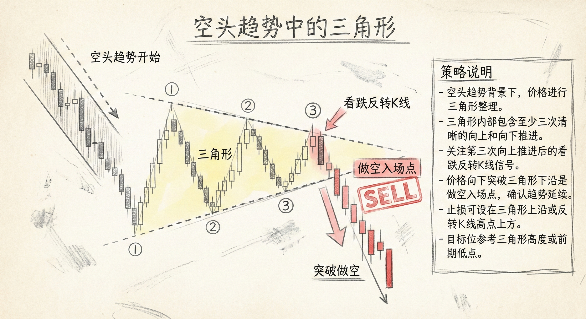

那个在 **K线 8** 后三根 K线处结束的窄幅空头通道，内部其实嵌套了几个更小的微型通道。无论交易者将其视为以下哪种形态，都无关紧要，因为操作手法如出一辙：
1.  带有几次小回调的大型微型通道；
2.  三个连续的微型通道；
3.  一个大型窄幅空头通道。

这波下跌势头极猛，在大周期图表上，很可能表现为一根强劲的急速（Spike）。**聪明钱（Smart traders）** 正伺机在任何回调处做空，因为他们预期回调不过是空头的获利了结，随后价格必将走低，而非趋势反转。

身处此类强趋势，交易者会采取以下策略：
*   在前一根 K线高点上方做空；
*   或在任何回调低点下方做空，例如 **K线 9、10 和 12** 的下方。

许多多头趋势虽然回调微弱，却能带来丰厚利润，但在这种行情下，做空形态的胜率往往很低。

例如，Bar 10 和 Bar 12 都是十字星，且周围 K 线多带影线，这表明市场出现了双向交易的迹象。
*   一旦市场显露双向交易迹象，通常意味着正在演变为交易区间。
*   此时若在区间低点附近做空，寄希望于向下突破，胜率极低。
*   这种下跌波段交易的成功率可能仅有 40%。不过，由于潜在回报是风险的数倍，交易者方程依然非常正向。

只做高胜率交易的交易者不会在 Bar 10 或 Bar 12 下方做空，而是会等待以下机会：
1.  **高胜率的做多反转**：例如当日低点经历一系列卖出高潮后出现的多头反转 K 线（反转详见第三册）；
2.  **回调做空**：如 Bar 9 的三角形；
3.  **强劲的空头急速做空**：如 Bar 11 收盘价入场，因为这是对楔形底的突破（Bar 11 前一根 K 线的低点与 Bar 12 的高点形成了测量型缺口，详见第二册）。

***

**关于此图表的深入探讨**

在 [图 16.3] 中，昨日收盘是一根强劲的多头趋势 K 线。此前是一段漫长的多头趋势，随后形成大致水平的牛旗，该 K 线正是对此牛旗的突破。

这是一个最终旗形做空策略，并在今日第一根 K 线处触发。交易者可以选择：
*   在那根多头趋势 K 线下方做空；
*   也可以在今日第一根 K 线（带有小空头实体）下方做空；
*   或者在最终旗形的底部下方做空。

入场 K 线是一根巨大的空头急速线，随后形成窄通道，因此这是一个极强的空头通道。当日属于“开盘即趋势”的空头趋势日。

微型通道的首次反转尝试，通常源于获利了结。比如，**Bar 2** 之前那根空头 K 线向下跌破多头微型通道，主因便是多头在兑现利润。既然身处多头趋势，其他多头自然急于进场：

*   **限价单入场**：当那根空头趋势 K 线跌破前一根 K 线低点时，他们便挂限价单买入；还有人选择在低点下方 1 到数个 tick 处接盘。另一些人则在该空头 K 线收盘时买入，预期突破会失败。（关于限价单入场，第二册会有详述。）
*   **突破单入场**：偏好突破单的交易者会在 **Bar 2** 上方买入，此处既是双 K 线反转，也是高 1 和突破回调买入策略。

***

**Figure 16.4 微型趋势线本质上就是小周期图表上的趋势线**

*   **周期对应**：5 分钟图上的微型趋势线形态，在 1 分钟图上往往表现为 3 到 10 根 K 线的回调（见 Figure 16.4）。
*   **入场机会**：1 分钟 Emini 图表全天都在提供基于趋势线测试、趋势通道过冲及反转的入场机会。许多刺破幅度虽不足 1 个 tick，却依然意义重大。图中画出的趋势线仅是冰山一角，实际上还有许多条。

***

收盘复盘 1 分钟图时或许觉得简单，但这并不代表实盘交易赚钱容易。事实绝非如此：

1.  **最好的入场策略**：往往卖相难看，且成型与触发极快，令人措手不及；
2.  **亏损的交易**：反倒是那些亏损的交易，会给你留出充足的入场时间；
3.  **最终结果**：你做了太多烂交易，抓到的好交易又不足以抵消亏损，最终当天以亏钱收场。

**其他观察：**

*   在 Figure 16.4 中，后续的每一条趋势线都愈发平缓，直至反向趋势线开始主导价格行为。
*   微型通道通常对应大周期图表上的一根趋势 K 线（急速），而在小周期图表上，则表现为包含多次回调的通道。

# [图 16.5] Dow 下跌 700 点时的微型趋势线
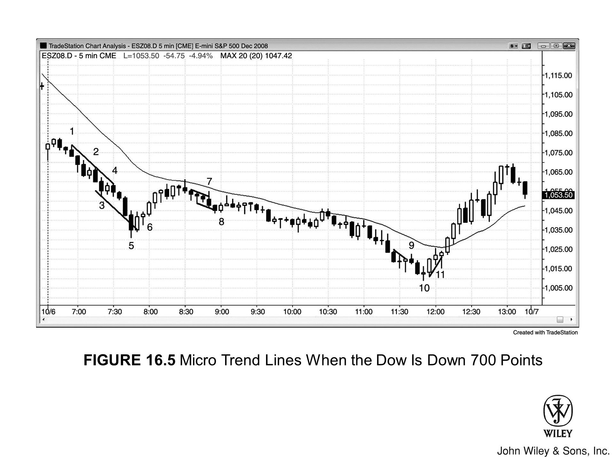

在 [图 16.5] 展示的这一天，Eminis 出现了许多基于微型趋势线和通道的交易机会（图中仅标出四处）。这是极不寻常的一天：Dow 指数一度暴跌超 700 点，却在收盘前强劲反弹，收复了一半的跌幅。

### K线 5 的形态分析
K线 5 过冲了微型趋势通道，随后构成了双 K 线反转的第一根 K 线。

*   **通道绘制**：该通道线是基于 K线 1 至 K线 4 的微型趋势线所做的平行线。当然，你也可以连接低点（K线 1 后一根 K 线的低点与 K线 3 的低点）来绘制通道线。
*   **交易策略**：此处出现了一个极佳的 ii 策略，且两根 K 线均为阳线收盘。在逆势对抗（fading）强空头趋势时，这种形态总是理想的。K线 5 之后的那根 K 线与 K线 5 共同完成了双 K 线反转。

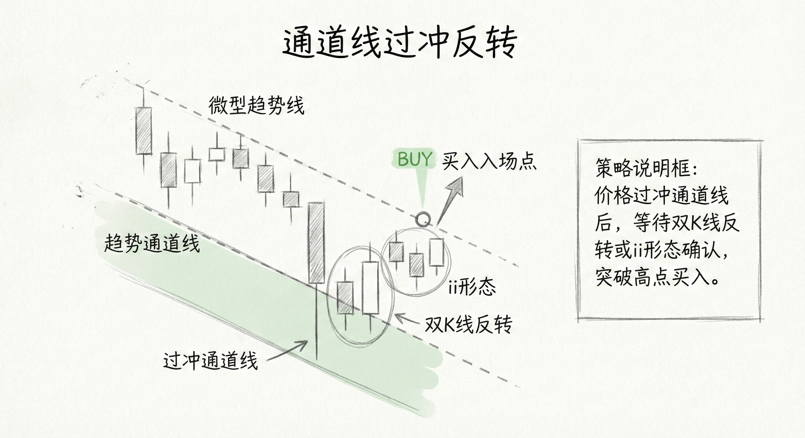

### 关于"微型通道"的定义
当微型通道延续了 5 到 10 根 K 线时——例如从开盘一直延伸至 K线 5 的这段走势——你完全可以直接称之为“通道”，这同样准确。

术语叫法其实无关紧要，因为微型通道本质上就是通道；之所以要将其与更大的通道区分开，唯一的理由是微型通道往往能在趋势中提供可靠的顺势剥头皮机会。

### K线 7 与 K线 9 的交易逻辑

**1. 突破回调买入策略（K线 7 和 K线 9）**
这两处最初是微型趋势线突破失败后的做空剥头皮交易，但随着这些“失败”本身也宣告失败，两者迅速转变为买入剥头皮交易，从而构成了突破回调买入策略（尽管两处都创出了更低的低点）。

**2. K线 7 的特殊情况**
*   **做多视角**：K线 7 是对微型通道的第一次向上突破，因此并非理想的做多策略。
*   **做空视角**：相反，它演变成了一个外包下跌（outside down）的做空入场点。你也可以等待 K线 7 收盘，确认其拥有阴线实体，随后在价格跌破这根外包下跌 K 线（K线 7）时进场做空剥头皮。

K线 11 是个典型的诱空陷阱，目的就是把你从强劲的涨势中洗出去。如果你被震出局了，就必须重新买入，入场点就在 K线 11 微型趋势线假突破上方的高 1 位置。

**市场走势分析：**

*   **K线 9 与 K线 10：** K线 9 向上突破了空头微型通道，紧接着 K线 10 走出了一个低点降低的突破回调，这让交易者开始盘算：是不是要来一波更大的涨势了？
*   **买压积聚：** K线 10 只是根小实体阴线，随后便是一根强劲的阳线趋势 K线，再后面那根依然收阳。买压层层积聚，使得那第三根阳线虽然构成了低 1 做空策略，但显得非常疲弱。

**交易者心理与操作：**

*   **逢低买入：** 交易者料定这个做空形态会失败，于是逢低买入（在其低点或更低处）。虽然当时没人知道后面会走出多头趋势，但大家相信，这波反弹至少能给多头剥头皮留出足够的利润空间。
*   **确立多头：** K线 11 之后没过一两根 K线，交易者就确信市场已转为 Always-in 多头状态，于是拿住剩余的多头仓位做波段，甚至顺势加了仓。

**日内风控建议：**

*   今天很多 K 线的波幅都超过了 6 到 8 个点。
*   稳妥起见，最好把仓位减半甚至降得更低，同时把止损放宽到 4 个点，止盈目标设为 2 个点。
*   除此之外，这不过是又一个规规矩矩的价格行为日罢了。

***

### 本图表的深入探讨

如图 [16.5] 所示，当日大幅跳空低开（Gap down），但第一根 K 线却是强劲的多头反转 K 线。

*   **买入信号**：这构成了一个“开盘即趋势”的买入信号，其逻辑在于市场跌破昨日收盘价后突破失败。
*   **急速形态**：第三根 K 线为强劲空头 K 线，形成向下急速（Spike）。此时看来，市场或许只是在构筑一个更高的低点，随后便会恢复涨势。

然而，价格虽一度升破该潜在低点，却随即反转下跌，收出一根向下外包 K 线（Bar 1），触发了“突破回调”做空信号：

1.  **形态逻辑**：向下缺口即为突破，而此前的“突破失败”形态及反弹尝试均告落空，反而演变为“突破回调”，预示着空头突破的延续。
2.  **交易行为**：随着该 K 线走出向下外包形态，交易者纷纷反手做空。另一些交易者选择在向下外包 K 线低点下方做空，还有人则在多头反转 K 线（当日首根 K 线）低点下方进场。

当日演变为大幅下跌的“开盘即趋势”空头日，走势如下：
*   价格沿窄通道一路下行至 Bar 5。该通道极为紧凑，实质上等同于一段急速（Spike）。
*   随后市场回调至均线，接着展开空头通道，直至跌至当日最低点 Bar 10。

---

**关于微型趋势线交易与具体 K 线分析：**

大多数失败的微型趋势线交易，在空头趋势中即为低 1 入场，在多头趋势中则为高 1 入场。

*   **Bar 9（做空）**：Bar 9 是低 1 做空策略。
*   **Bar 11（做多）**：Bar 11 则是高 1 做多策略；它是新一段多头腿（Leg）中的首个更高低点。在潜在的多头趋势反转后，出现的更高低点往往是优质的买入策略。

**Bar 11 的背景细节：**
*   Bar 11 之前的低 1 信号 K 线为十字星，紧随两根多头趋势 K 线之后。
*   其中第一根多头 K 线势头强劲，可能已将 Always-in 的方向扭转为多头（它与 Bar 9 之后的 K 线构成双 K 线反转，且出现在 Bar 9 这一单 K 线最终旗形之后）。
*   激进的多头会在该低 1 信号 K 线低点处挂限价单买入，押注此次做空必将失败。

如果突破回调交易（Breakout Pullback Trades）创出了更高的高点或更低的低点，那它其实就是一种小型的最终旗形（Final Flag）反转。

以 **Bar 9** 为例，其具体演变逻辑如下：
*   **突破失败**：Bar 9 向上突破了一条微型趋势线，但突破失败，随后遭到抛售，跌至 **Bar 10** 创出新低。
*   **回调性质**：不妨把 Bar 10 看作是对 Bar 9 突破的回调——这种回调打出更低低点的情况，在突破回调中时有发生。
*   **形态确认**：既然行情随后向上反转，Bar 9 便成了一个单 K 线最终旗形。

跌向 **Bar 5** 的这波抛售虽然走的是窄通道（Tight Channel），但势头极猛，若放在更高周期的图表上看，这肯定是一根向下的急速（Spike）K 线。随后行情发展如下：
1.  **反弹测试**：行情反弹至均线，触发了一个 20 Gap Bars 卖出信号。
2.  **通道形成**：紧随其后的是一段漫长的下行通道，一直跌到 Bar 10，这就走完了一个完整的空头急速转通道形态（Bear Spike and Channel）。

反转开启后，目标位依次如下：
*   **首个目标位**：看至第一个强买入策略（Strong Buy Setup）的顶部，也就是 Bar 5 的双 K 线反转（Two-bar Reversal）。
*   **下一个目标**：拿下该位置后，目标便是空头通道的起点，即 8:30 对均线的那次测试。

***

**[图 16.6] 多头趋势中的微型趋势线**
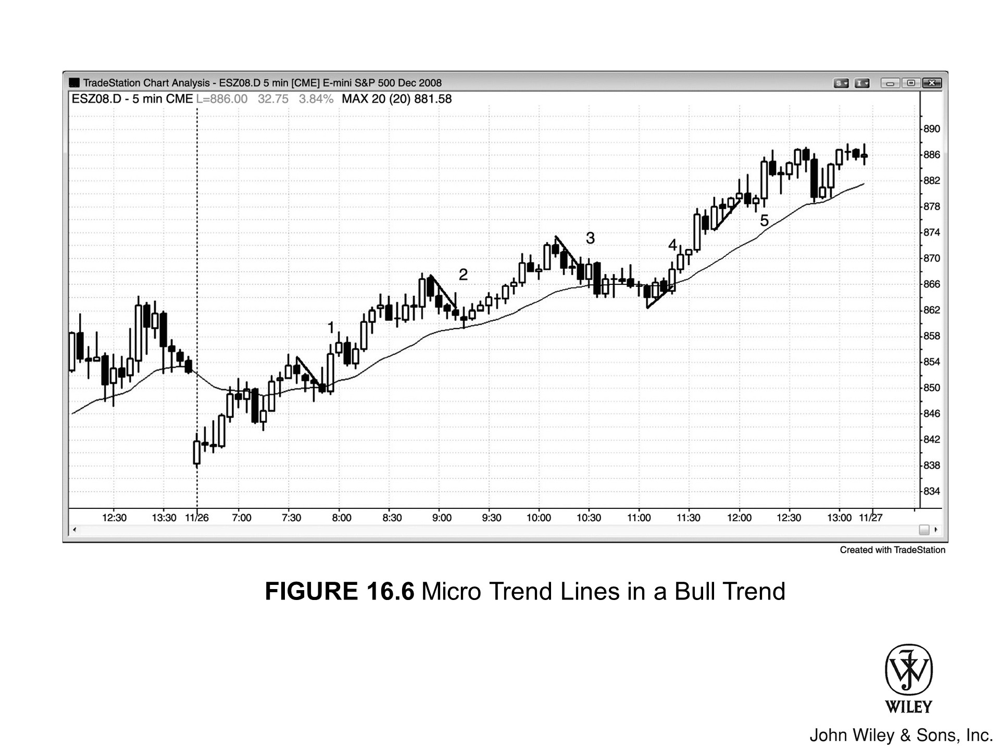

在强多头趋势日，应坚决避免做空，包括微型趋势线做空，尤其是在均线附近或上方时。

*   **如图 16.6 所示**，若在 K 线 1、2 和 3 处做空，无异于在均线区域或上方逆势抛售。
*   诚然，向下倾斜的微型趋势线显示存在小型空头趋势，但它们仅仅是极强多头趋势中的回调，你的眼里应该只有买入机会。这些形态本质上是牛旗，且位于均线上方，彰显了多头的强势。
*   市场并未跌破重要的多头趋势线，也没有在随后测试多头极值点（无论是更高的高点还是更低的高点）时发生向下反转。

在多头趋势日，熊市微型趋势线的唯一价值，就是提示买入：一旦微型趋势线做空失败，随之形成的突破回调便是入场良机。

*   换言之，切勿在 K 线 1、2 和 3 处做空，反之，应在空头止损离场的位置做多。
*   这种失败形态可能会形成一个微小的更低低点（如 K 线 2 和 3 微型趋势线突破失败后），或一个微小的更高低点（如 K 线 1 突破失败时）。
*   这本质上是多头突破熊市微型趋势线后的一次“突破回调”（即突破回调做多策略）。

顺势微型趋势线入场属于高胜率交易，例如 K 线 4 和 5 处的做多机会。

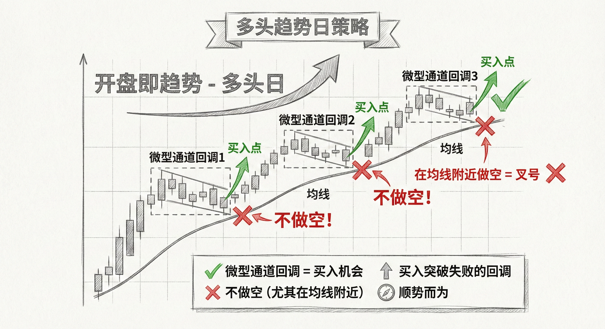

### 关于此图的深入探讨

图 16.6 展示了一个“开盘即趋势”的多头日，因此应避免做空，包括微型趋势线做空，尤其是在均线附近或上方时。

*   市场虽一度向下突破均线，但随即反转向上，构成了突破失败。
*   空头试图在均线处将反弹转化为“突破回调做空”，但反弹中出现了数根强阳线实体，这意味着交易者必须等待二次入场（Second Entry）方可做空。
*   然而信号并未出现。抛售转瞬即逝，最终演变为一个更高低点。
