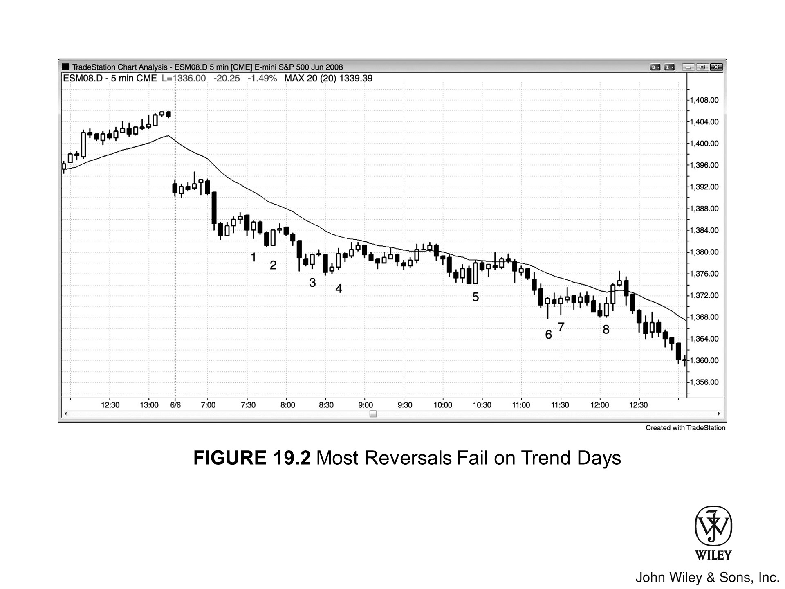

## 概述

**强趋势**有很多特征。最直观的一个是：价格从图表的一角斜穿至对角，途中只有小幅回调。不过在趋势初期，同样有一些信号能帮助判断这波行情是否强劲、能否持续。这类信号越多，就越应该专注于**顺势入场**。至于**逆势建仓形态**，只应把它当作绝佳的顺势入场机会——等逆势交易员被迫止损出场时，正好就是你用突破单入场的位置。

**趋势日**有一个有趣的现象：在很多这样的日子里，最像样的**反转K线**和最大的**趋势K线**往往出现在逆势方向，专门把交易员诱入错误的方向。与此同时，顺势方向很少出现好的信号K线，这让交易员开始怀疑自己的判断，最终只能追涨杀跌，慢了一步才进场。

一旦确认市场处于强趋势中，就不必等待建仓形态。只要愿意，随时可以市价入场，止损设得相对小一些。建仓形态存在的唯一意义，就是把风险压到最低。

## 强趋势的特征

以下是强趋势中常见的一些特征：

- 当天出现**大幅缺口开盘**。
- 高点和低点持续创出新高或新低，形成**趋势性高点或低点**（波段结构）。
- 大多数K线都是顺势方向的**趋势K线**。
- 相邻K线实体之间重叠极少。以**多头急速上涨**为例，很多K线的最低点恰好落在前一根K线收盘价处，或仅低一个 tick。有些K线的最低点刚好等于前一根收盘价而不低于它，这意味着挂在前一根收盘价处的限价买单根本无法成交，只能以更高的价格买入。
- 部分K线上下影线极小甚至没有，显示出强烈的紧迫感。以**多头趋势**为例，如果一根多头趋势K线开盘即在最低点、随后持续上涨，说明前一根K线刚一收盘，交易员就迫不及待地买入了；如果收盘接近最高点，说明买盘持续强劲，大家预期收盘后还会有新的买家涌入——他们宁愿在快收盘时就买入，也不愿等到K线收盘后再买，因为那样可能要多付一两个 tick。
- 偶尔出现**实体之间的缺口**（例如在多头趋势中，某根K线的开盘价高于前一根K线的收盘价）。
- 趋势起点出现一根强势趋势K线，形成**突破型缺口**（趋势K线本身即是一种缺口，详见第二册）。
- 出现**测量型缺口**：回测未能覆盖突破点。例如，多头突破后的回调没有跌破突破发生时那根K线的最高点。
- 出现**微型测量缺口**：一根强势趋势K线前后两侧均存在缺口。例如在多头趋势中，紧跟一根强多头趋势K线之后的那根K线，其最低点等于或高于该趋势K线前一根K线的最高点，这就构成缺口，同时也是对突破的回测，属于强势信号。
- 没有明显的**高潮**出现。
- 大K线不多，就连大趋势K线也很少见。往往最大的趋势K线反而出现在逆势方向，专门把交易员引向逆势交易、错失顺势机会。逆势建仓形态看起来几乎总比顺势建仓形态更诱人。
- 没有明显的**趋势通道线过冲**，偶尔出现的小幅过冲也只引发横盘整理，不会逆转趋势。
- **趋势线被突破**后，市场以横盘方式修正，而非向反方向展开。
- 出现**楔形失败**以及其他反转失败形态。
- 出现连续 20 根以上不触及均线的 **20周期均线缺口K线**序列（详见第二册）。
- 几乎找不到有利可图的**逆势交易**机会。
- **回调**幅度小、次数少，且多以横盘方式呈现。例如，如果 Emini 的日均波幅为 12 点，那么每次回调很可能都不超过 3 至 4 点，而且经常连续 5 根或更多K线都不出现回调。
- 整个过程弥漫着一种紧迫感：你一直在等，盼着出现一个像样的顺势回调入场机会，却始终等不到，而市场不紧不慢地沿趋势方向继续推进。
- 回调出现时，**建仓形态**质量扎实。例如在多头趋势中，**高 1** 和**高 2** 回调的信号K线往往是强多头反转K线。
- 在最强的趋势中，回调的信号K线反而往往**偏弱**，很多交易员不敢进场，只能被迫去追市场。例如在空头趋势中，**低 2 做空**的信号K线经常是两三根小幅多头急速中的小多头K线，而且入场K线有时是外包阴线。这种趋势中，收盘价、高点、低点、实体的方向全都连贯地指向同一个趋势方向。
- **两段式回调反复出现**，不断制造顺势入场机会。
- 没有连续两根**趋势K线**收盘在均线的另一侧。
- 趋势运行距离很远，接连突破多个阻力位，包括均线、前期波段高点和趋势线，且每次突破幅度都达到许多个 tick。
- 逆势方向的急速**反转尝试**没有后续跟随，最终失败并演变为顺势方向的旗形。

## 处理失控趋势

趋势进入**失控模式**后，很多K线内都不会出现回调，每根K线都是体型较大的趋势K线，影线普遍偏小。想在趋势延续中持续剥头皮，又想守住波段仓位，可以考虑切换到3分钟图寻找额外的顺势建仓形态。3分钟图通常有更多**暂停K线**（逆势的内包K线和单K线回调），便于顺势入场。1分钟图也有顺势入场机会，但同时夹杂一些逆势建仓形态，只想顺势做单时容易受到干扰。再加上1分钟图读盘速度极快，失控趋势中容易带来过大压力，影响实际执行。因此，失控趋势中最好只盯5分钟图操作，确保不错过每一个顺势入场点。等经验和成绩都稳定之后，再考虑加入3分钟图。

## 趋势衰减与演变

趋势会随时间推移逐渐减弱——**双边交易**的迹象越来越多，强势信号开始消退。以多头趋势为例：交易员开始在前一根K线高点和波段高点上方止盈，激进空头也开始在K线高点和波段高点上方做空并逐步加仓。强势多头最终只会在回调时买入。最初的多头急速阶段被**多头通道**取代，最终演变为**交易区间**。

---

## 图19.1：多头行情日的大幅高开缺口

大幅**缺口**开盘若未在早盘反转，通常标志着当天强趋势的开始，收盘价往往在当天高点附近（空头行情则在低点附近）。如图19.1所示，5分钟Emini高开11点，幅度极大，第一根K线就是**多头趋势K线**。而且超过两小时均线都未被测试，同样是强势信号。注意全天几乎没有情绪化行情（没有大幅K线、没有高潮、没有大幅震荡）。波动偏小、小K线居多、十字星频繁出现的平静行情，往往孕育最强的趋势。

这类行情中，机构有大量买单需要消化，希望在更低的价格买入，但低价迟迟不来，只能全天分批成交，价格越买越高。即便他们看出趋势行情已经形成，知道可能要持续追涨，也不会一次性把买单全部砸进去——那样容易触发高潮式急速拉升，进而引发反转，跌破他们的平均成本价。于是他们分批建仓，全天越买越高，心里清楚市场大概率还会继续上涨。强势行情如此，接下来一到数天价格通常也会更高。

### 深入解读本图

图19.1中，市场突破了前一日高点，但K线2的强多头急速K线之后跟出一根空头内包K线，市场跌破该内包K线低点，突破演变为**假突破**。大幅高开缺口行情往往会测试开盘低点，并形成小型**双底牛旗**。开盘区间如此之窄时，市场进入**突破模式**，交易员会顺着突破方向入场。大幅高开缺口行情中，向上突破的概率占优。激进多头可以在K线3上方基于双底形态入场，但不少多头选择在K线2的开盘区间高点上方挂**突破单**入场。当天是**始于开盘的趋势**多头行情日，也是**趋势恢复**多头行情日。

市场形成了一段向下至K线3的小型**两段式移动**：第一段由一根空头趋势K线和两根十字星组成；第二段由一根顶部带大空头影线的空头趋势K线（该影线正是第一段下跌结束时的回调）加一根十字星组成。这种形态在低时间级别图表上会呈现出两段清晰的下跌腿，构成**ABC回调**买入信号。交易员可以在K线3上方一个tick买入。这同时也是对缺口的测试，与K线1低点形成双底。由于当天可能是趋势行情日，走势可能远超大多数人的预期，聪明的交易者会将部分甚至全部仓位作为波段持有。注意当天开盘价与全天低点非常接近，这本身就是强势信号——始于开盘的趋势行情，若开盘价距全天低点仅几个tick，往往在距全天高点几个tick处收盘，而且通常尾盘还会持续推升。

K线5是强势上涨（四根多头趋势K线）后的**高1突破回调**建仓形态，在强多头趋势的急速阶段，高1始终是好的买入机会。K线4的**低1**跌破趋势线并从新高反转，但这里不是做空点，哪怕只是剥头皮也不行。其实这里用"低1"这个术语本身就不准确——**低1**是交易区间和空头趋势中的建仓信号，不适用于强多头趋势。经历如此强势的上涨之后，聪明的交易者只会寻找买入机会，除非出现**二次入场点**，否则不会考虑做空。

第6根K线是**低2**，构成二次做空信号，也是多头趋势中交易区间顶部的潜在建仓形态。但在强多头趋势中，空头在这里只能做剥头皮——除非之前已有一段强下跌行情明确突破了一条重要趋势线（至少跨越约20根K线），否则不会考虑波段做空。就算入场做空，也要快进快出，之后转而寻找多头方向的波段建仓形态。强趋势中**顺势入场**的绝大多数仓位应作为波段持有，只拿出小部分用于剥头皮。错过了顺势入场机会，就不要再去找逆势剥头皮，应该专注于等待下一个顺势建仓形态。趋势日里必须抓住每一次顺势信号，因为那才是最稳定的盈利来源。

第6根K线的入场K线是一根强空头趋势K线，因此构成**突破**，也是一根**急速**K线。急速K线之后通常跟随**通道**，并至少形成两段额外推进；但如果急速K线出现在强趋势的反方向，往往只有一段推进，随后演变为**两段式多头旗形**。不管怎样，急速下跌之后出现至少一段跟随下跌的概率相当高。

第7根K线是**低2做空**的入场K线，进入第二腿下跌。但经过六根K线的窄交易区间整理之后，任何方向的**突破**都很可能走不远就失败。

第8根K线是**两段式回调**，也是强多头趋势中首次回踩均线，是非常好的买入机会。当价格连续20根或更多K线远离均线（即**EMA 20缺口K线买入建仓形态**），说明趋势极强，回踩均线时遇到买盘的概率很高。

第9根K线在波段新高处形成**反转**，但之前七根K线中没有出现任何空头趋势K线，因此不能直接做空，除非后续出现**二次入场点**。

第10根K线是**二次入场**信号，但在多头趋势的窄交易区间里，做空最多只是剥头皮，跳过这笔交易可能更好。多头趋势中的横盘走势通常是**牛旗**，大概率向趋势方向突破。外包K线可靠性较低，但**二次入场**信号本身可靠性较高，可以小仓剥头皮做空。均线附近出现了三根小十字星，形成一个窄小的紧凑交易区间，具有磁吸效应，任何方向的趋势K线突破大概率都会失败。空头持仓，止损设在约4个Tick之上。第11根K线的多头趋势K线突破不出所料地失败了，空头在下一根K线顺利锁定4个Tick的剥头皮利润。

第13根K线是**突破回测**，回测位置刚好比触发第8根K线做多后强势上涨行情的信号K线最高点低一个Tick。从第9根到第13根K线的下跌走势非常疲软，基本呈横盘状态，市场勉强下探才完成回测，说明空头缺乏信心。第13根K线同时构成均线下方的**高4入场**建仓形态，也是当天首根**均线缺口K线**（最高价位于EMA之下的K线）。这是强趋势中的**均线缺口K线建仓形态**，预期价格会测试多头趋势的高点，形成较低高点或更高高点。强趋势中的均线缺口K线往往预示着趋势最后一腿的启动，之后才会出现更深、持续时间更长的回调，回调甚至可能演变为**趋势反转**——这或许就发生在随后的下一个交易日。第13根K线形成了比第8根K线更高的**HL**，紧接着第9根K线的HH，属于**趋势性波段**的组成部分，实质上与第8根K线构成了**双底牛旗**。

第14根K线是**高2突破信号K线**，前一根K线即为**高1**。

第15根K线是**最终旗形做空**的信号K线，但价格始终未跌破信号K线低点，做空信号未被触发。不过这根空头趋势K线本身构成了一段小幅下跌。下一根K线是多头趋势K线，再下一根又是空头趋势K线——这第二根空头趋势K线形成了小幅的第二腿下跌，因此构成**高2买入建仓形态**。

第17根K线是强多头日中**多头微型通道**的首次突破，因此在其最高点上方一个Tick设置买入。该通道具有**楔形**轮廓，尽管此处不会做空，但理论上空头的保护性买入突破单应设在楔形高点上方一个Tick。随后出现的大阳线一路穿越这些买入突破单，显示出对空头的强力拒绝。这根K线之所以如此强劲，是因为预判第17根K线做空会失败的多头早已在其高点上方挂好买入突破单等待入场，同时此前空头的保护性止损也集中在第16根楔形顶部高点上方一个Tick——两股买盘力量叠加，推动了这根强势大阳线的形成。

第18根K线向上突破了**多头趋势通道线**，形成**低2做空信号**。然而在强趋势日里，聪明的交易者只有在先出现一段有力的空头腿、并且该腿已跌破趋势线之后，才会考虑做空。否则，他们会把所有做空建仓形态都视为做多机会，在弱势空头被迫回补的价位挂单做多——也就是第17和第19根K线高点上方一个Tick的位置。

第19根K线是一次失败的**单K线趋势线突破**，失败本身即构成买入建仓形态。随后出现的**两K线多头反转**，成为多头入场的信号K线。

---

## 图 19.2：趋势日里大多数反转都会失败

如图 19.2 所示，**趋势日**有一个奇特的现象：看起来最像样的**反转K线**和**趋势K线**，往往恰恰是逆势方向的，会把交易者引诱进错误方向的亏损仓位（第1至第8根K线）。注意，整整一天都没有出现过一根像样的空头反转信号K线，然而这却是一波巨大的空头趋势。看看均线就能明白——在第8根K线那波反弹顶部出现缺口K线之前，市场连续两根K线都无法在均线上方收盘。既然是空头趋势，每一次反弹都应该视为**做空建仓形态**。只需把入场挂单设在多头**保护性止损**的位置，等多头平仓时，他们自己就会驱动市场下跌。

**做空信号偏弱**，正是趋势得以持续的关键原因。空头一直在等一根强信号K线，好满仓做空；被套的多头则一直在等趋势强度的明确信号，好决定是否立即离场。然而这个信号始终没有出现，多空双方就这样僵持等待。他们看着图表，发现大量多头趋势K线以及两三根K线组成的多头急速，便以为这股买压很快会推出一波更大的反弹。尽管市场一直在均线下方挣扎、回调也极为短浅，他们仍然对这些强趋势信号视而不见，继续幻想多头能把市场拉升到一个让自己更有底气做空的位置。然而这一幕始终没有出现。于是，空头和被套的多头整整一天都在分批卖出，只是为了以防万一——万一他们期待的那波反弹永远不会来。这种持续不断的抛售，再加上强势空头把这轮行情视为最强空头趋势而发起的积极做空，让市场全天一路下滑，始终没有出现像样的回调。

---

## 图 19.3：没有回调，说明趋势强劲

如果交易者用**限价单**在前一根K线的收盘价挂单买入却无法成交，说明趋势非常强劲。如图 19.3 所示，第1根K线收在最高点之后，部分交易者会立刻在该收盘价挂限价买单，希望在第2根K线开盘后几秒内成交。但第2根K线的最低点始终没有跌破第1根K线的收盘价，因此这笔限价单很可能根本没有成交，买家只好不断追价买入。第3、4、5根K线同样强劲；不过第3根K线收盘后，若有交易者在该收盘价挂限价买单，第4根K线开盘后几秒内最低点确实跌破了第3根K线收盘价一个Tick，买单应该能够成交。通常，出现一系列这样的强K线会形成一段**急速**，之后市场往往进入**多头通道**。

不过，情况并不总是如此。次日，第6至第9根K线同样强劲，但最终只走出了一个**更低高点（LH）**。前一天是**急速与通道多头趋势日**，通道起点理应在当日受到测试。这就是市场的下行磁力——开盘便跌破了前日多头趋势线，第6至第9根K线急速之后形成的更低高点，最终引发了一次向下的**趋势反转**。

股票交易者会把前日高点之前的这段多头通道描述为**拥挤交易**——想买的人都已经买了，再没有新的买家进场。一旦市场开始下跌，通道里所有多头迅速陷入亏损，大家争相出逃，力求把损失压到最低、保住部分利润，结果就是市场急速下挫。

### 本图深入解析

如图 19.3 所示，开盘跌破前日急速与通道形态的**多头通道**，第6根K线是一根**多头趋势K线**，构成**突破失败做多**的建仓形态。这次突破失败随即演变为更低高点，并形成**突破回调做空**建仓形态，**二次入场点**位于太平洋时间早上7:05空头急速之后那根多头K线的下方。
