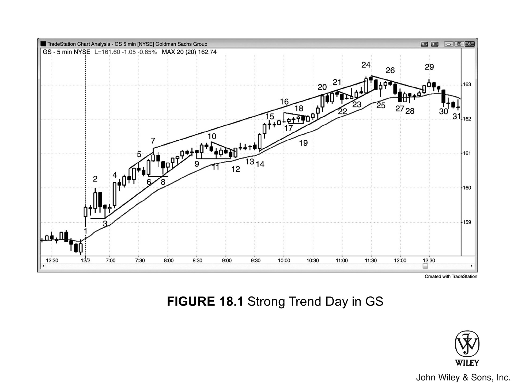

只要市场处于趋势中，交易者就应寻找一切理由入场。仅凭“趋势存在”这一点，就足以让你以 **市价** 至少开个小仓位。若使用 **突破单** 进场，以下是几种合理的策略：

- **多头趋势** 中，买入回调至均线的 **高2**。
- **空头趋势** 中，卖出回调至均线的 **低2**。
- **多头趋势** 中，买入 **楔形牛旗** 回调。
- **空头趋势** 中，卖出 **楔形熊旗** 回调。
- **多头趋势** 中，牛旗突破后，买入 **突破回调**。
- **空头趋势** 中，熊旗突破后，卖出 **突破回调**。
- **多头趋势** 现 **强多头急速** 时，买入 **高1** 回调，但切忌在 **买入高潮** 后入场。
- **空头趋势** 现 **强空头急速** 时，卖出 **低1** 回调，但切忌在 **卖出高潮** 后入场。
- **多头趋势** 极强时，在前一 **波段高点** 上方挂 **突破单** 买入。
- **空头趋势** 极强时，在前一 **波段低点** 下方挂 **突破单** 卖出。

使用 **限价单** 入场更考校读图功力，因为你是在市场朝交易反方向运动时逆势入场。不过，经验丰富的交易者在面对以下潜在 **入场策略** 时，完全可以稳妥地使用 **限价单** 或 **市价单**：

- **在强多头突破的急速行情中买入。** 具体方式包括：市价买入、在急速中每根多头趋势 K 线收盘时买入，或使用限价单在前一根 K 线的低点或更低处挂单买入（急速行情入场需设置更宽的止损，且行情转瞬即逝，这种组合对许多交易者而言颇具难度）。

- **在强空头突破的急速行情中卖出。** 具体方式包括：市价卖出、在急速中每根空头趋势 K 线收盘时卖出，或使用限价单在前一根 K 线的高点或更高处挂单卖出（急速行情入场对许多交易者而言颇具难度）。

- 买入多头急速中**首根空头 K 线的收盘价**。

- 卖出空头急速中**首根多头 K 线的收盘价**。

- 在多头趋势中，于**多头趋势线**或**前一波段低点**（潜在的双底牛旗）处买入。

- 在空头趋势中，于**空头趋势线**或**前一波段高点**（潜在的双顶熊旗）处卖出。

- 当强力向上反转可能开启新多头趋势，或处于交易区间底部时，在**低 1** 或 **低 2** 弱信号 K 线的低点或更低位置，挂限价单买入。

- 当强力向下反转可能开启新空头趋势，或处于交易区间顶部时，在**高 1** 或 **高 2** 弱信号 K 线的高点或更高位置，挂限价单做空。

- 在均线附近的**平静牛旗**中，使用限价单在前一根 K 线的低点或更低处买入。

- 在均线附近的**平静熊旗**中，使用限价单在前一根 K 线的高点或更高处做空。

- 当多头 K 线向上突破牛旗时，在其**低点下方买入**，预期将出现突破回调。

- 当空头 K 线向下突破熊旗时，在其**高点上方卖出**，预期将出现突破回调。

- 在多头趋势中尝试波段交易时，于**突破测试处**买入或加仓；此类测试往往是市场试图扫掉早期多头入场的保本止损。

- 在空头趋势中尝试波段交易时，于**突破测试处**卖出或加仓；此类测试往往是市场试图扫掉早期空头入场的保本止损。

- 在多头趋势中，于高点下方固定 **tick** 数处买入。

-   举个例子，假设 Emini 正处于 **多头趋势**：
    -   若日均波幅大概是 12 个点，那就去买那种 **回调** 了 2、3 或 4 个点的机会。
    -   此外，如果开盘头几个小时内最大的回调幅度是 10 个 tick，那你就在回调约 8 到 12 个 tick 时买入。

-   到了 **空头趋势**，就在价格从低点反弹固定 tick 数时卖出。拿高盛（GS）来说：
    -   如果日均波幅是 2.00 美元，那就等它反弹 50 美分时做空。
    -   要是头几个小时内最大反弹幅度是 60 美分，就在反弹 50 到 70 美分这个区间卖出。

-   当行情走势与你的持仓相反时，顺着趋势方向 **分批进场**。但这有个前提：
    -   必须提前算好每一笔单子下多大，确保总风险别超过平时一笔常规交易的水平。
    -   这招很容易让你仓位过重，且 **保护性止损** 挂得太远，务必格外小心。

-   在 **多头趋势** 里，如果价格已经连续 20 根甚至更多 K 线没有回调触及移动平均线，可以直接在均线处挂 **限价单** 买入，并在更低的价格分批加仓。
    -   比如 Emini 处于强劲 **多头趋势**，价格在均线之上悬了 20 多根 K 线。这时，在均线上方 1 个 tick 处挂限价单买入。接着，在价格下跌 1 点、2 点甚至 3 点的位置继续买。
    -   既然是 **分批进场**，通常第一笔入场价回本了就该全部平仓；但如果多头势头极强，也可以拿一拿，等到价格 **测试** 前高时再跑。

-   同理，在 **空头趋势** 中，如果价格已经连续 20 根甚至更多 K 线没有反弹触及移动平均线，可以在均线处挂 **限价单** 做空，并在更高的价格分批加仓。
    -   比如 Emini 处于强劲 **空头趋势**，价格被压在均线之下超过 20 根 K 线。你可以在均线下方 1 个 tick 处挂限价单做空。随后，在价格上涨 1 点、2 点甚至 3 点的位置继续加空。
    -   如果是 **分批进场**，一般考虑在第一笔入场价的位置把所有仓位平掉；除非空头趋势特别猛，那就可以试着拿到价格 **测试** 前低时离场。

- 在 **强多头趋势** 中，一旦首根收盘价低于均线的 **空头趋势 K 线** 出现，收盘即买。
- 在 **强空头趋势** 中，一旦首根收盘价高于均线的 **多头趋势 K 线** 出现，收盘即卖。

**强多头趋势** 下，回调本质上就是一个小型的空头趋势。多头笃定，在这个小型空头趋势中，跌破前一波段低点的尝试必将失败，故而会在此处挂 **限价单** 买入。

同理，**强空头趋势** 下，回调本质上就是一个小型的多头趋势。空头笃定，在这个小型多头趋势中，突破前一波段高点的尝试必将失败，遂在此处挂 **限价单** 做空。

***

交易者的状态不外乎三种：做多、做空、空仓。但在趋势行情中，赢家之道，只取其二：

*   身处多头趋势，赢家只 **做多** 或 **空仓**。
*   身处空头趋势，赢家只 **做空** 或 **空仓**。

逆势交易且能持续获利者，凤毛麟角，你应当默认自己绝非此类“天选之子”。可叹多数新手入行数年，仍执迷不悟，自认身怀绝技，结果月复一月持续亏损，却还纳闷症结何在。

如今，你已洞悉答案。

无论哪种市场形态，总有办法让交易变得棘手。市场里挤满了绝顶聪明的脑袋，他们想掏空你账户的劲头，和你想要赚他们钱的渴望一般无二，所以这世上没有轻松的交易。即便是在强趋势中获利，也绝非易事。

**当市场处于强趋势，伴随着巨大的趋势 K 线时：**

*   **风险其实很大**：因为保护性止损往往必须设在“急速”行情的起点之外。
*   **行情来势迅猛**：许多交易者被突破的幅度与速度震慑，根本来不及调整仓位或放宽止损，只能眼睁睁看着趋势飞奔，心里苦苦祈祷回调出现。

**一旦趋势进入“通道”阶段，看起来总是一副要反转的样子：**

*   比如在多头趋势中，反转尝试层出不穷，但几乎都会迅速演变为牛旗。
*   大多数多头通道里的买入信号 K 线都很弱，迫使多头不得不在弱通道的顶部追高买入。哪怕市场还在持续上行，这依然是一笔低胜率的做多交易。

**面对此类行情，两类交易者的表现截然不同：**

*   **波段交易者**
    那些乐于在弱多头通道顶部接受低胜率入场的波段交易者，却对这种价格行为情有独钟。因为其潜在获利倍数于风险，这不仅足以弥补相对较低的胜率，更是绰绰有余。然而，要在弱多头通道顶部买入这种低胜率形态，对大多数交易者而言实在太难。

*   **高胜率交易者**
    那些只求高胜率的交易者，往往只能袖手旁观，看着趋势一根接一根 K 线地缓慢蹭涨，因为可能连续 20 根甚至更多 K 线都无法给出一个高胜率入场点。
    *   **结果**：眼看市场上涨，内心渴望做多，最终却踏空了整个趋势。
    *   **心态**：他们只想要高胜率机会，比如回踩均线的“高 2”回调。若等不到满意的回调，他们便会一直等待，继续踏空。这也无可厚非，因为交易者本就该始终待在自己的舒适区里。

如果他们只习惯做高胜率的突破单，那耐心等待是对的。通道终有尽头，合意的入场策略很快就会出现。

老练的交易者会：
*   在前期 K 线低点附近或下方挂限价单买入；
*   有时甚至会在多头通道中做空剥头皮。

只要阻力位出现强烈的看跌反转 K 线，且有理由相信回调迫在眉睫，这两种操作——包括做空——都可以是高胜率的交易。

赚钱的门路千千万，为何大多数交易者还是在亏钱？无他，只因犯错的坑更多。最常见的一个毛病就是：**入场时是一套计划，进场后却换了另一套打法。**

**举个例子：**

*   假设某人刚做了两笔多头 **波段交易**，都亏了。现在他买入第三笔，因为成了惊弓之鸟，太怕再亏，稍微有点利润就当成 **剥头皮** 跑了。
*   结果呢？只能眼睁睁看着行情走出一波大 **趋势**。
*   **波段交易者** 指望的就是这种大赚的机会来填补亏损，毕竟 **波段交易** 的胜率往往不到 50%。如果拿不住波段，就抓不到必需的大利，最终只能是赔钱。

**剥头皮交易者** 面临的则是另一种截然相反的陷阱：

*   他们可能刚做完一笔赚钱的 **剥头皮**，结果行情演变成了大 **趋势**，自己却已经下车，只能在场外干瞪眼，心里懊悔不已。
*   紧接着，又一个 **剥头皮** 机会来了。他们进场了，价格也到了止盈位，可这回他们不走了——心想这次没准也能像上次那样变成 **波段交易**，于是死拿着不放。
*   没过几分钟，市场掉头回来，打掉 **止损**，盈利变亏损。
*   原因在于，大多数 **剥头皮** 属于高胜率交易。当优势既大又明显时，行情往往短平快，通常并不是大波段的起点。

想赚钱，最好的法子就是定好一套靠谱的策略，然后雷打不动地执行。

*   对大多数新手而言，首选计划应该是做 **波段交易**。
*   因为想靠 **剥头皮** 成功，对胜率的要求极高，绝大多数人根本无法长期维持。

一旦建仓，交易者就必须决定如何管理。最关键的决策在于：**是做剥头皮，还是做波段交易？**这两者以及交易管理，在第二本书中都有详尽探讨。

只有经验最丰富的交易者才应考虑剥头皮，因为这种交易有时风险会超过潜在回报。这意味着胜率必须维持在 **70 %** 左右——除了极少数顶尖高手，这对常人而言绝无可能。你应该假设自己永远达不到那种境界，因为现实就是如此。

不过，你依然可以成为一名获利丰厚的交易者。在交易 Eminis 时，若平均日波幅约为 10 到 15 点，通常需要承担约 2 点的风险。譬如：

*   若在多头趋势中买入，保护性止损应设在入场价下方约 2 点处。
*   或者，也可以将止损设在信号 K 线低点下方 1 个 tick 处，通常这也相当于约 2 点的距离。

如果确信趋势终将恢复，有些交易者会在波段交易中承担 5 点甚至更多的风险。对于理解“交易者方程”的人来说，这可能是一种盈利之道：

> 只有当 **“成功概率 × 潜在回报”** 显著大于 **“失败概率 × 风险”** 时，才出手交易。

所谓剥头皮，通常是指在一笔交易中赚取 1 到 3 个点。不过，有些剥头皮交易者眼界更严，他们把 2 到 3 个点的利润视为“小波段”，认定只有 1 个点的交易才叫剥头皮。

虽然每天都有很多机会，但市场中存在两种情况：
*   能让你冒 2 个点的风险去赚 1 个点，且胜率高达 80%；
*   但同样存在许多看起来极其相似的**入场策略**，胜率却只有 50%。

大多数交易者的死穴，就在于分不清这两者。哪怕一天只看错一两次，最终结果是赚是赔，往往就差在这里。绝大多数人根本无法在盘中实时做出精准判断，如果硬要做剥头皮，结局多半是亏损。

当然，如果交易者每天只抓那两三个最完美的**入场策略**做剥头皮，而且仓位足够大，或许能以此谋生。但他可能会发现这很难：
*   既要连续盯盘数小时；
*   又要在那些稀有且短暂的**入场策略**展开时，随时准备迅速下单。

新手想赚钱，做 **波段交易** 是正途。

*   **入场**：既可以一次性买定，也可以顺势 **加仓**、乘胜追击——也就是看着之前的单子有了浮盈，再继续往里进。
*   **离场**：也一样，既可以一把清仓，也可以顺着行情 **分批离场**。

***

举个例子，如果在 **多头趋势** 初期买入，初始止损设 2 个点。只要你确信这单能成，那就意味着 **成功率** 至少有 60%。

正因如此，利润没跑到 2 个点以上，就别急着止盈。这背后的数学原理，我会在第二本书里细讲。离场的时机，必须满足一个条件：

> 即“**成功率**（此处 ≥60%）× 潜在回报”显著大于“失败率（此处 ≤40%）× 风险”。

既然 **保护性止损** 设在入场价下方 2 个点，风险便是 2 个点。这意味着，只有回报也达到 2 个点以上，**交易者方程** 才开始对你有利。

***

所以，如果只贪图蝇头小利，长期下来必亏无疑——除非你能把 **成功率** 做到 80% 左右，但这极少发生。

*   真要有这本事，老手确实可以在获利 1 个点时 **剥头皮** 减仓，哪怕止损是 2 个点，照样能赚钱。
*   但对大多数人来说，切记：冒的风险绝不能超过预期的回报。

那么，在这个多头趋势中，交易者该如何进行波段交易？这个问题将在第二本书中详述。收盘后复盘看图表，波段交易似乎很简单，但实盘操作却要难得多。

### 入场策略的心理博弈

波段交易的入场策略（Setups）往往呈现出一种矛盾的状态：
*   要么模糊不清；
*   要么虽然清晰却令人心生畏惧。

一旦看到合理的入场策略，交易者必须进场。但这些策略看起来几乎总是不如剥头皮策略（Scalp setups）那样确凿，这种较低的胜率往往导致交易者犹豫观望。

### 趋势反转与错失良机

趋势始于突破，这可能源自交易区间，也可能源自当前趋势的反转。当潜在反转出现且伴随强劲的信号 K 线时，旧趋势通常正处于一段强劲、快速且处于末端的急速（Climactic spike）行情中。

新手往往因此错失了趋势反转的早期入场良机，原因在于：
1.  总是认定旧趋势依然有效；
2.  加之当天很可能已在之前的逆势交易中连连亏损，不想再赔钱，从而产生了抵触心理。

### 进退两难的入场时机

**在突破 K 线形成期间或收盘后入场极具挑战：**
因为突破急速（Breakout spike）往往幅度很大，交易者必须迅速决断，承担远超平时的风险。结果，他们往往选择等待回调。即使降低仓位（Position size）以使金额风险（Dollar risk）与其他交易持平，但一想到止损距离是平时的两三倍 ticks，恐惧依然挥之不去。

**在回调时入场同样艰难：**
因为所有回调都始于次级反转（Minor reversal）；他们担心这可能是深度回调（Deep correction）的开端，会导致止损被扫，资金受损。

---

于是，他们一等再等，直到收盘将至。当他们终于确信趋势明朗时，交易时间已所剩无几。

**趋势会想方设法将交易者拒之门外，唯有如此，才能引得交易者整日苦苦追逐。**

当 **入场策略**（Setup）简单明了——意味着胜率极高时，随后的行情通常只够做一波短平快的 **剥头皮**（Scalp）。

反之，若行情志在长远，走势必然晦涩难懂、让人无从下手，只有这样才能把交易者晾在场外，逼着他们去追逐 **趋势**（Trend）。

---

**多头趋势**（Bull Trend）的特征便是高低点不断抬升。因此，交易者应遵循以下原则：

*   **移动止损**（Trailing Stop）：每当市场创出新高，交易者都应将 **保护性止损**（Protective Stop）上移，设在最近一个低点下方 1 个 **tick** 处。
*   **获利了结**：若获利颇丰，当市场突破前高时，交易者也应考虑部分获利了结。

正因许多人都在这样做，**趋势** 往往在创新高后便会出现 **回调**（Pullback）。

---

这种 **回调** 极易跌破原始入场价，不同经验的交易者会采取不同的应对方式：

1.  **缺乏经验的波段交易者（Swing Traders）**
    往往早已将止损收紧至 **保本**（Breakeven）价，结果只能被震出局，眼睁睁错过一波绝佳的 **趋势** 行情。

2.  **大多数交易者**
    一旦市场回测原始入场价并再创新高，就会把止损至少上移至入场价——理由很简单：既然市场已经回测过一次并创了新高，他们绝不希望看到它再回来测第二次。

3.  **另一些人**
    则会将止损设在刚刚回测原始入场价的那段 **回调** 的低点下方。

只要确信多头趋势的大前提依然有效，有些交易者就能容忍价格回调跌破信号 K 线。

举例来说，假设 Emini 近期的平均波幅在 10 到 15 点左右，交易者在 5 分钟图的多头趋势中，借由 **高 2** 回调入场做多：

*   **持仓策略**
    倘若信号 K 线的高度只有 2 个点，即便价格随后跌破了该 K 线的低点，他们也愿意继续持仓。这是因为他们预判回调可能演变成 **高 3**，也就是楔形牛旗买入形态。

*   **离场与重进**
    另一些交易者则会选择在价格跌破信号 K 线时先行离场，等到出现强有力的 **高 3** 买入信号时，再重新进场。有些人甚至会直接上双倍仓位，因为他们视强有力的二次信号为更可靠的机会。

*   **仓位管理**
    实际上，许多此类交易者在最初面对 **高 2** 买入信号时，若感觉信号成色不足，可能只进了半仓。他们是在为 **高 2** 失败留有余地，防备其演变成楔形牛旗——这种形态往往看起来更为强势。一旦行情果真如此演变，他们就会放心地打满常规仓位。

另一些交易者若觉得信号存疑，只会进半仓。如果**保护性止损**被打掉，而随后的第二个信号很强，他们再全仓杀入。

那些逆势加仓的交易者，显然不会把**信号 K 线**的极点作为初始**保护性止损**；许多人甚至专门盯着别人**保护性止损**被打掉的位置，正好在那里加仓。

也有人干脆使用宽止损。以 **Emini** 为例：

*   当平均日波幅不足 15 点时，**趋势**中的**回调**很少会超过 7 点。
*   有些交易者认为，除非市场跌幅达到平均日波幅的 50% 到 75%，否则**趋势**依然有效。
*   只要**回调**还在容忍范围内，他们就会坚定持仓，假定自己的预判没错。

针对**多头趋势**中的**回调**买入，根据入场位置不同，策略也有所区别：

*   **入场点位于当日高点下方 3 点：**
    *   他们可能会给出 5 点的风险额度。
    *   既然相信**趋势**未改，他们便认为至少有 60% 的概率能走出一波等距行情。
    *   这意味着他们有至少 60% 的把握，确信市场在下跌 5 点打到**保护性止损**之前，会先上涨至少 5 点，这就构成了一个有利可图的**交易者方程**。

*   **初始买入信号出现在高点下方 5 点：**
    *   他们可能只冒 3 点的风险，并计划在市场**测试**高点时平掉多单。
    *   由于**回调**幅度较大，**趋势**可能略显疲软，这可能会促使他们在**趋势**高点下方就获利了结。
    *   他们会争取利润至少覆盖风险，但如果担心市场正演变为**交易区间**，甚至反转为**空头趋势**，他们也愿意在旧高点下方一点就离场。

到了某个节点，卖压终将强到足以把趋势转化为交易区间，这意味着回调可能会跌破最近的低点。老练的交易者对市场从趋势向区间的转换有着敏锐的嗅觉，一旦察觉变盘在即，许多人会平掉剩余的仓位。

之后，他们可能会采取以下策略：
*   切换到区间交易模式，即只博取较小的差价（这一点会在第二本书中讨论）。
*   或者，拿住部分多单直到收盘，或是等到市场翻转为 Always-in 空头方向。

若真发生翻转，他们要么平多，要么反手做空。极少有交易者能做到稳定反手，大多数人宁愿先平掉多单，重新研判市场，甚至休息片刻，再去找做空的机会。

***

**Figure 18.1 GS 的强趋势日**

***

面对任何一天的行情，交易手法都有无数种，但当出现像 Figure 18.1 中 GS 这样的多头趋势时，交易者应尝试至少留一部分仓位做波段。

多年前，我曾与一位极擅长此类行情的交易者深谈过。他的打法是：

1.  **入场与初始风控**：尽早入场，确定初始风险（即保护性止损距入场价的幅度）。
2.  **分批止盈**：一旦获利达到初始风险的两倍，他就平掉半仓。
3.  **持有余仓**：余下半仓一直持有，直到出现明确的反转。如果始终未见强劲反转，他就在收盘前几分钟离场。
4.  **移动止损**：每当价格创出新高，他就会把止损收紧至最近一个更高的低点下方。
    *   这是因为只要趋势能持续走出更高的高点和低点，就依然强劲。
    *   一旦它不再创出更高的低点，趋势便开始走弱了。

在这种行情下，有一条必亏无疑的路，所有交易者都心知肚明。成功交易者避之不及，新手却不由自主地深陷其中。

**在他们眼中，市场总是“涨过头”了：**

*   最新的 K 线总是顶在屏幕最上沿，看起来上方已无空间，而下方显然深不见底。
*   此外，他们知道趋势总有回调，何不逢反转就做空剥个头皮，等回调后再反手做多？即便亏损，代价也不大。
*   他们视 K 线 7、10、18、20、21 和 24 为反转信号，认为它们既可能是日内高点，又可能跌得够深，至少能赚取一笔剥头皮的利润。

**可当回调真的来临，他们却不敢买了：**

*   因为担心市场可能反转为空头趋势，且做多的入场策略（Setup）看起来不够强势。
*   此外，由于手握空单且尚未达到剥头皮的止盈位，他们还在给市场“加油助威”，盼着再跌一点点。
*   因此，他们既不预期、实际上也不希望回调就此结束。

**然而，老练的交易者深知，80% 的反转尝试终将失败并演变为牛旗（Bull Flags）：**

*   **老练的交易者：** 因此，他们坚定持有做多仓位，或兑现部分前期利润，或随着回调深入而继续加仓。
*   **新手：** 不接受这一前提，结果整日不断小额止损，直到收盘才惊觉亏损竟如此惨重。

***

他们在其他领域一生顺遂，聪明过人。看着电视上的交易大师，觉得这些人与其说是劲敌，不如说像小丑或二手车推销员。

*   于是他们自信满满，认定自己至少能比这些所谓专家做得更好。
*   他们对这些名嘴的能力评估确实精准，但错就错在误以为这些人是成功的交易者。

他们本质上是表演者。电视网雇佣他们，是为了吸引观众，进而赚取广告费。电视网也是公司，和所有企业一样，它们的目标是盈利，绝非真心实意地想要帮助观众。

新手想要止损，首先得管住手：
*   别在 **多头趋势** 里总想着做空（也别在 **空头趋势** 里试图抄底）。
*   只有当他们打心底里接受“每一个顶部都不过是 **牛旗** 的起点”时，盈利的大门才会向他们敞开。

后文涉及的部分内容将在第 2 册和第 3 册中展开详述，之所以在此处提前引入，是因为它们对于 **趋势交易** 至关重要。

大级别的 **波段** 往往始于看似疲弱的 **入场策略**，比如图中始于第 3 根 K 线的双 K 线反转。这两根 K 线都是不起眼的小 **十字星**，且紧随在一个巨大的双 K 线反转顶部之后。

*   引发 **突破** 的 **入场策略** 通常看起来很弱，弱到足以让交易者不敢进场。
*   交易者往往想等 **突破** 确认后、出现更高胜率的 **入场策略** 再动手，结果却错失了最初的 **突破**。

其实，无论是在低胜率 **入场策略** 时果断进场，还是等 **突破** 后在高胜率 **入场策略** 时追进，这两种方法在数学逻辑上都是成立的。

至 Bar 2 或 Bar 4 时，多数交易者已确立 Always-in 方向向上。既认定身处多头趋势，众人便致力寻找合理的买入理由——而此类良机可谓俯拾皆是。

*   **买点可选在** Bar 4 突破 Bar 2 之际，或于 Bar 4 收盘时，亦可在其最高价上方 1 个 tick 处扫单入场。
*   **交易者亦可利用限价单**，挂于次根及随后数根 K 线之最低价或更低处，此类挂单将于 Bar 5 下方成交。另有部分人博弈小幅回调，于前一 K 线中点下方约 20 美分处挂单吸纳。
*   **逢阴线收盘买入亦是良策**，因交易者坚信反转难成。Bar 4 至 Bar 5 走势呈窄通道，向下突破多半无功而返。故可在 Bar 5 下方买入，或在随后的小空头趋势 K 线收盘时进场，亦可视作多头微型通道向下突破失败，于该 K 线上方追入。

Bar 7 虽现突破回调做空信号，但市场预期这仅是回调。此前跌破 Bar 5 之举打破了多头微型通道，随后的反弹至 Bar 7 构成了突破回调后的更高高点。

交易者料定反转必败，部分人已在下方约 50 美分、即 Bar 6 最低价区域埋伏限价单，博弈双底牛旗。

*   **至于保护性止损**，多设于 Bar 6 下方。盖因其为强多头趋势 K 线，强势之中，鲜有跌破此类基石者。因此，紧贴其最低价上方买入，实乃低风险、高回报之举，胜算至少五成。
*   **此外，Bar 8 之后的多头反转 K 线亦是绝佳买点**，此乃双底牛旗形态，兼具高 2 做多良机（Bar 6 为高 1）。

### Bar 9：微型通道突破失败
Bar 9 再次向下击穿牛市微型通道，交易者预期此次突破必将失败。

*   **限价买入**：鉴于微型通道持续延伸，部分交易者早已在前一根 K 线低点挂好限价买单，并在 Bar 9 顺利成交。
*   **停止买入**：另一些人则视其为对牛市微型通道的突破失败，选择在 Bar 9 高点上方买入。

### Bar 11 至 Bar 12：横盘整理与三角形
Bar 11 形成了又一个高 2 买入形态，但此时市场已横盘整理超 10 根 K 线，且波幅逐渐收窄。

*   **观望心态**：虽说这也是个双底买入信号，但窄交易区间恐将延续，许多交易者选择按兵不动，静待第三次向下推动出现，计划在楔形牛旗上方买入。
*   **三角形视角**：由于形态走势偏横向而非下行，部分交易者也将其看作三角形。这批交易者在 Bar 12 当根或其上方做多进场。

### Bar 13 至 Bar 14：牛旗突破后的机会
牛旗突破后，市场横盘数根 K 线，接连给出入场机会：

1.  **Bar 13**：先在 Bar 13 上方形成突破回调买入点。
2.  **Bar 14**：随后又在 Bar 14 给出机会——这是一根外包强多头趋势 K 线。
    *   Bar 14 属于高 2 入场 K 线：Bar 13 是高 1 入场，随后的回调跌破了下一根 K 线低点，在这持续 4 根 K 线的窄交易区间内构成了第二腿下跌。

### 趋势延续与后续买点
随着市场向上突破 Bar 10，部分交易者进场买入，视其为多头趋势下的交易区间突破。

*   **Bar 14 进场**：交易者也会在 Bar 14 的收盘价或突破其高点时买入。
*   **强势跟进**：次根 K 线后续行情良好，彰显多头强势，因此交易者继续买入其收盘价及高点上方。
*   **Bar 15 回调**：随后市场停顿了两根 K 线，形成小型突破回调牛旗，交易者便在 Bar 15 之后那根 K 线的上方突破处买入。

- **Bar 16 至 Bar 19：早期回调与高 2 策略**
    - **Bar 16 分析**：虽收出十字星顶，但此前空头势弱，抛压寥寥。相较于 Bar 14 的多头急速，这根 K 线显得微弱渺小。
    - **交易行为**：交易者预期反转必败，遂在其低点及下方挂入限价单买进。
    - **形态演变**：Bar 17 构成了顶部失败后的买入信号，随后的 Bar 19 走出第二段小幅下推，从而形成高 2 买入策略。
    - **进场信号**：价格一旦涨破 Bar 19 及其后阳线的高点，交易者便进场做多——后者即为两 K 线反转买入策略。

- **Bar 20 阶段：多头急速与买入高潮**
    - **趋势背景**：涨至 Bar 20 的过程，走出了又一波强劲的多头急速。
    - **买入点位**：交易者会在前一 K 线低点及下方买入，在多头趋势 K 线收盘时买入，甚至在第一根空头趋势 K 线（如 Bar 20 之后那根）收盘时也会买入。
    - **后续预期**：Bar 20 身处成熟趋势之中，且是一根巨大的多头趋势 K 线，这种买入高潮足以引发更深幅度的回调，或横盘整理，或回踩均线。
    - **多头策略**：多头不再急于追涨，而是静待高 2 或三角形形态的出现。

- **Bar 21 至 Bar 23：牛旗演变与多重解读**
    - **Bar 21**：试图构成单 K 线最终旗形反转，但上涨动能依旧强劲。交易者预期行情将走出新的牛旗，而非反转。部分人于其低点下方买入，其他人则选择观望，等待高 2、楔形牛旗或三角形形态确立。
    - **Bar 22**：再度形成双底，构成高 2 买入策略。交易者在其高点上方，以及随后那根孕线的高点上方，挂出突破单做多。
    - **Bar 23**：
        1.  有人视其为高 2 买入策略，将 Bar 20 后的 K 线看作高 1 信号；
        2.  也有人视其为楔形牛旗，将 Bar 20 后的阴线看作第一次向下推动；
        3.  此外，这也是一个突破回调买入策略，针对的是前一根 K 线对牛旗的突破。

### K线 24 举足轻重

这是自 K线 14 急速上涨以来的第三次上推，也是连续第三个买入高潮（急速行情的顶点算作第一推）。在急速转通道的多头趋势里，通道行情往往终结于第三次上推，随后便展开回调。况且，在多头趋势延续已久的背景下，K线 24 是一根极强的多头趋势 K 线。

这正是强势多空双方苦候已久的那根 K 线：

*   **信号共识**：双方都视其为趋势暂时终结的信号，认为在更深幅度的回调形成前，这是短暂的卖出良机。
*   **结构预期**：双方都预期回调至少包含两段结构，持续 10 根 K 线以上，并且会击穿均线。
*   **交易动机**：多头卖出是为了落袋为安，空头卖出则是为了进场做空。
*   **卖出时机**：K线 24 收盘时、高点上方、下一根 K 线收盘时，以及低点下方，双方都在卖出。

---

### K线 28 与后续发展

多头认为市场可能正在转为交易区间，自己很有机会在低位重新接回筹码。

*   **高 2 买入形态**：K线 28 是针对均线的两段式回调，因此构成了高 2 买入形态。
*   **20 缺口 K 线买入形态（20 gap bar buy setup）**：这也是全天首次触碰均线，因而属于此形态，后续极有可能去测试多头高点。

空头在此获利平仓，多头则买入进场，博取下一段上涨。

自 **K线 3** 启动涨势以来，当日最大的回调发生在 **K线 8**，幅度为 75 美分。部分交易者预期当日最大回调将出现在上午 11:00 左右，因此在最近波段高点下方 75 美分处挂限价单做多。他们可能会在更低 75 美分处加仓，并准备承担略高于首次回调幅度两倍的风险，即大约 1.60 美元。

全天交易中，交易者普遍预期后续回调幅度将小于第一次，因此会挂限价单，准备买入约为首次幅度一半（约 40 至 50 美分）的回调。

**K线 11** 的回调仅 40 美分，这意味着试图在 50 美分回调处买入的交易者未能如愿。
*   当他们在 **K线 12** 前一根 K 线上二次尝试买入仍未成交时，便决定向上追涨，在 **K线 12** 高点上方买入。
*   另一些交易者识别出 **K线 9** 和 **11** 构成的双底，于是挂限价单在略高于低点处买入，该位置约比高点低 30 美分。

随后，交易者必须确定最坏情况下的保护性止损位置。选定的价位应当是：一旦触及，便不再持有做多理由。
*   **K线 8** 低点下方是一个显而易见的位置。
*   因为多头趋势由一系列更高的高点和更高的低点组成，每创新高后，多头都预期回调将守住最近那个更高的低点。

既然计划在 161.05 美元（高点下方 30 美分）做多，且风险位在 160.35 美元左右（低 70 美分），他们需确定仓位大小：
*   若单笔交易常规风险限额为 500 美元，则可买入 600 股 GS。

既然承担了 70 美分的风险，且回报至少应与风险相当，其获利目标应设在入场价上方至少 70 美分处。此时显然已是强趋势日，因此成功概率至少为 60%，甚至更高。

在这种强趋势日，放宽止盈目标才是上策。除非行情至少跑出两倍风险的距离，即高于入场价 $1.40，否则不应急于止盈。

交易者可采取以下具体的仓位管理步骤：

*   **挂单减仓**：交易者可在 $162.45 挂出一张限价单，平掉半仓。
*   **Bar 12 跟进**：当 Bar 12 这根强多头趋势 K 线向上突破三角形（也有人视其为楔形牛旗）后，可将保护性止损上移至该 K 线低点下方的 $161.05，将风险压缩至 20 美分以内。
*   **Bar 14 跟进**：待 Bar 14 强多头趋势 K 线突破后，止损再次跟进至其低点下方，此时风险仅剩 1 分钱。
*   **Bar 20 获利**：300 股的止盈限价单会在 Bar 20 成交，落袋 $420。
*   **后续管理**：此时，保护性止损可进一步收紧至 Bar 19 下方，也就是最近这波多头急速（bull spike）的起涨点。若止损被扫，剩余 300 股约能获利 80 美分。此刻只需持仓不动，静待明确的向下反转，或一直拿到收盘。

手握丰厚利润时，明智的做法通常是：在收盘前一小时左右，一旦遇到可能引发大幅回调的入场策略（setup）便离场；待两段式回调（two-legged pullback）走完，再伺机做多。

*   **Bar 24 信号**：Bar 24 处的空头反转 K 线代表第三次上推，且紧随一根买入高潮 K 线（buy climax bar）之后，这意味着市场总算准备好回调至移动平均线了。
*   **离场对比**：
    *   若交易者在其低点下方离场，余下 300 股可获利 $2.00，即 $600。
    *   若坚持持有至收盘，这部分仓位则获利 $375。

市场甚至从未明确转入 Always-in 空头状态。

- **当 K线 27 回踩移动平均线时**，许多交易者会在均线上方一个 tick 处埋伏限价单。这属于 20 gap bar 买入策略，入场后他们会坚定持仓，博取对高点的测试。

- **另一些交易者选择在 K线 27 收盘那一刻买入**，毕竟这是第一根收盘价跌破均线的空头趋势 K线。
  - 尽管 K线 27 构成了双 K线空头急速的第二根，且向下击穿了 K线 25，但空头若想确信市场已反转为 Always-in 空头，还急需后续行情的跟进（Follow-through）。
  - 然而事与愿违，下一根 K线却收成了多头孕线。

- **此处既是正在演变的交易区间底部，也是对上涨通道起点的回测。**
  - 追溯该通道，它始于 K线 22 的回调，而该回调又源自此前一波直抵 K线 20 的四 K线多头急速。

- **紧随 K线 27 之后的多头 K线**，收盘价重新站上均线。
  - 部分多头会在收盘时买入，其余人则会在其高点上方一个 tick 处进场。
  - 相比之下，他们的入场晚了三根 K线。

- **此外，交易者还会在 K线 28 之后的孕线高点上方买入。**
  - 这是一个高 2 买入信号，意味着从当日高点开始的两段式下跌已然终结。
  - 从形态上看，这也是一个小型楔形牛旗，其中 K线 25 为第一推，K线 27 为第二推。

回调是逆势而行的次级趋势。交易者通常预期它只是昙花一现，主趋势很快就会恢复。

当 GS 从 bar 24 高点开启第二腿 (leg) 下跌时，在 bar 26 形成了一个更低的高点。

*   要想让市场确信趋势已经反转为下跌，空头必须加把劲，制造出一连串不断降低的高点和低点才行。
*   因此，当价格跌破 bar 25 的波段低点 (swing low) 时，部分交易者进场做空，指望随后能砸出一连串实体巨大的空头趋势 K 线 (bear trend bars)。
*   结果事与愿违，bar 25 只是一根很小的空头趋势 K 线，且后续缺乏跟进 (follow-through)。

事实上，随后的上涨表明，大多数交易者反而在 bar 25 跌破时选择了买入：

1.  **买入逻辑**：因为他们认定这波抛售不过是个回调，想把主趋势扭转为空头趋势，注定是徒劳的尝试。既然大多数反转尝试都会以失败告终，那么在强多头趋势 (strong bull trend) 中，包含第二腿下跌的首次回调，一旦跌破前一个波段低点，通常会引来激进的买盘。
2.  **多头表现**：许多多头确实买入了这一次回调，虽说他们费了好几根 K 线才把行情重新推上去。这表明多头的积极程度其实有所保留，并不像他们本可以做到的那样强势。
3.  **潜在信号**：这向交易者传递了一个信号：该回调可能会演变成一个更大的交易区间 (trading range)，而最终结果也确实如此。

许多交易者靠趋势线来决定进出场：

*   **Bar 7**：当价格冲过趋势通道线时，有些人在高点附近部分止盈。
*   **Bar 9**：此外，Bar 9 一度跌破多头趋势线，但只要价格随后升破 Bar 9 的高点，他们也会买入，理由很简单：他们把 Bar 9 看作一次失败的通道突破。
*   **Bar 12**：向上突破了一条小型空头趋势线。一旦价格越过这条线，交易者就会买进，认定回调已经结束，多头趋势即将恢复。

**Bar 14** 启动了两根 K 线的急速行情，随后进入通道阶段，**Bar 24** 则是通道内的第三次上推。

*   哪怕 Bar 24 收盘表现十分强劲，只要价格冲过趋势通道线，仍有交易者会选择多单止盈。
*   这根 K 线硕大无比，是典型的多头趋势 K 线，也是 Bar 14 以来连续第三次多头高潮。这意味着市场很可能面临更复杂的回调。
*   试想，在连续第三次买入高潮中，价格借着买入真空效应去测试趋势通道线，还有比这更完美的止盈点吗？

随后行情下行至 **Bar 28**，不仅击穿了多头趋势线，还在下方盘整了多根 K 线。交易者不禁起疑：是不是要开始更大级别的回调了？这种疑虑促使许多人加速止盈。

**Bar 28** 之后的反弹没能走出任何强劲的多头趋势 K 线，交易者据此判断市场可能已转入交易区间。因此：

*   当 **Bar 29** 测试 **Bar 26** 形成的次高点时，他们果断止盈。这是一个潜在的双顶熊旗，也是次高点趋势反转形态。
*   紧随其后的是一根空头趋势 K 线，这信号很明确：多头攻势渐弱，空头力量转强。

当多头趋势极强时，只要止损设得足够宽，交易者几乎可以用任何理由买入。许多人偏爱在突破前期波段高点时进场。不过，在突破前买入回调通常意味着：回报更高、风险更小、胜率更大。突破交易者会在旧高点上方一个 tick 处挂买入突破单（buy stops），一旦市场突破旧高点，他们便会被卷入多头仓位。

交易者之所以错失回调买入机会，最常见的原因是期待回调幅度更大，或形态更完美。许多回调包含看跌信号 K 线，或者紧随两三根 K 线的看跌急速之后，这让交易者误以为多头趋势需要更多修正才能恢复。

然而，在强劲多头趋势中，做多至关重要。当趋势极强时，交易者应在前期波段高点上方挂买入突破单，以防回调短暂、趋势迅速恢复。合理的入场点包括：

*   第 4 根 K 线突破第 2 根 K 线高点；
*   第 10 根 K 线之前的上涨突破了第 7 根 K 线；
*   第 14 根 K 线形成的急速突破了第 10 根 K 线；
*   以及第 20 根 K 线形成的急速突破了第 16 根 K 线。

这些旧高点往往对应更高时间周期（如 15 或 60 分钟图）K 线的高点，因此，这种入场本质上是在大周期图表上突破前一根多头趋势 K 线的高点。由于大周期图表的 K 线幅度更大，且初始保护性止损设在信号 K 线下方，风险随之增加。除非只做快速的小幅剥头皮，否则交易者应降低仓位。

随着趋势延续，回调幅度会加深，持续的 K 线数量也会增加。一旦双向交易特征明显：
*   强势多头便不再建立新仓，而是开始在波段高点上方获利了结；
*   与此同时，随着市场涨破旧高点，强势空头开始分批做空。

- 举例来说，K 线 20 之后的空头 K 线以及 K 线 22，都暗示抛压已经浮现。因此，当价格突破 K 线 21 高点时，大多数交易者会选择获利了结，而非继续追高。

- 市场演变至某一阶段，大多数交易者不再仅仅把新高看作止盈区，而是将其视为做空的良机。

- 尽管许多交易者在 K 线 24 之后的空头 K 线下方进场做空，但主流观点依然看涨，认为回调之后，市场将再度测试多头高点。

- 除非空头爆发强劲走势，一举跌破并大幅远离多头趋势线，否则强空头通常难以主导市场。

既然是趋势日，最理想的操作是：留一部分仓位拿波段，沿途落袋为安，每逢回调再把仓位打满。然而，大多数人没那个本事，既拿得住波段底仓，又能用剩下的仓位反复剥头皮。

与其这样，不如尽早满仓进场，后续信号一概不理，只管趁着行情走高，分批止盈离场。具体手法多种多样。举个例子，假设早早买入，承担了约 $1.00 的风险（实际可能更低）：

*   **赚到 $1.00 时**：先出 1/4；
*   **赚到 $2.00 时**：再出 1/4；
*   **到了 $3.00 时**：也许再出 1/4；
*   **最后剩下的 1/4**：一直拿着，直到出现强烈的卖出信号，或者干脆拿到收盘。

不过，**更好的办法是沉住气**，等市场涨了 $2.00（也就是两倍初始风险）再做第一次止盈。毕竟，冒了 $1.00 的风险，总得确保拿到足够的回报才划算。具体怎么做不重要，重要的是上涨途中得落袋一部分利润，以防行情突然掉头向下。

可是，既然担了风险，就得管住手，别赚点蝇头小利就想跑。只要趋势没坏，最好的策略就是忍住不止盈，直到行情跑出的距离至少达到初始风险的两倍。如果已经出了一半货，随后又看到强烈的买入信号：

1.  或许可以把那一半仓位加回来一部分甚至全部，哪怕只做个剥头皮也好；
2.  但对大多数人来说，还是老老实实按原计划行事，坐享利润奔跑比较好。

面对如此密集的买入信号，如果交易者见信号就加仓，多头头寸很快就会大到让人心里发慌——这显然是错误的做法。正确的做法是：

*   要么**坚定持仓**，直到趋势可能终结（如 Bar 24）；
*   要么在价格创新高但 K 线收盘疲软时（如 Bar 16、21 或 24），**平掉部分仓位做剥头皮**。随后，一旦出现新的买入信号，再把这部分剥头皮的仓位加回来。
*   至于**波段仓位**，则应一直持有至趋势结束。

***

交易者是何时认定这天是趋势日的？激进多头认为，跳空高开配合强劲的多头趋势 K 线，很有可能引发“开盘即涨”的趋势日行情。因此：

*   他们可能会在 Bar 1 收盘价，或高点上方 1 tick 处直接买入。
*   初始保护性止损设在 Bar 1 低点下方 1 tick。
*   他们计划持有部分或全部仓位直到收盘，除非出现明确的做空信号。

另一些交易者习惯在跳空高开时寻找双底：

*   他们会在始于 Bar 3 的两 K 线反转上方买入，因为这里与 Bar 1（或紧随其后的十字星低点）构成了近似双底。

***

Bar 4 是一根强劲的多头趋势 K 线，它向上突破了开盘区间，收盘价高于 Bar 2 高点。

*   **进场点位**：有些交易者在 Bar 2 高点上方 1 tick 处买入，另一些则在 Bar 4 收盘时，或其高点上方 1 tick 处进场。
*   **市场状态**：这根突破 K 线是多头的宣言，表明他们已掌控全场。此时，大多数交易者都确信市场已进入 Always-in 多头状态。
*   **止损与风控**：此时，最佳的保护性止损位在 Bar 4 低点下方 1 tick。但由于止损幅度接近 1 美元，交易者必须控制仓位大小，确保风险在心理承受范围内。

行至 K线 5 或 7 时，大多数交易者已看出这是个多头趋势日，甚至早在 K线 4 收盘时便已确信。一旦认定是趋势日，空仓者就该建立轻仓，无论是直接市价买进，还是趁任何小回调吸纳，皆无不可。

具体的进场策略如下：

*   **挂限价单**：交易者当时可以挂限价单，在前一根 K线 低点下方接货，或者在价格下跌一定幅度（如 20、30 或 50 美分）时买入。
*   **寻找 高 2 机会**：另一些人则会寻找 高 2 机会，利用突破单在上方买入，或是等待均线回调时进场。
*   **特定形态买入**：在 K线 8 的两 K线反转上方买入，是合理的做多操作；K线 12 处的楔形牛旗（也有人看作三角形）同样值得买入，该形态也是以两 K线反转告终。

关于风险控制与止损设置：

*   此时，**保护性止损**仍应设在 K线 4 低点下方，或许也可设在其中点下方。交易者必须控制仓位规模，确保风险处于自己通常的承受范围内。
*   还有些交易者将**止损放在 K线 6 和 8 的双底下方**。假如不幸被止损出局，但市场随后又给出买入信号，只要他们相信多头趋势未改，便会再次进场。

交易者必须强迫自己迈出最重要、却往往也最艰难的一步：一旦确信当日处于**趋势**之中，就必须至少建立一个小仓位。具体操作原则如下：

*   **止损设定**：必须判定“最坏情况”下的**保护性止损**位在何处（通常距离较远），并以此作为止损点。
*   **仓位管理**：由于止损幅度较大，若是进场较晚，初始仓位应保持微小。
*   **加仓时机**：一旦行情朝有利方向发展，且止损可以收紧，便可伺机加仓，但切记：绝不可超出常规的风险限额。

***

当满世界都在盼着**回调**时，它往往迟迟不来。这是因为大家都相信市场很快会涨得更高，却未必认为它近期会跌下来。市场参与者的心理博弈如下：

*   **聪明的交易者**：深谙此道，因而开始分批买入。由于必须以**急速**行情的底部作为止损基准，他们下单极轻。若风险空间是平时的三倍，他们便只买平时仓位的三分之一，从而将总的资金风险控制在常规区间内。
*   **强势多头**：当强势多头持续小单买入，便构成了买盘压力，进而阻碍**回调**的形成。
*   **强势空头**：也看清了**趋势**，同样确信市场很快会涨得更高。既然认定价格即将走高，他们便不再寻求做空。如果觉得再过几根**K线**就能卖个更好的价格，那现在做空显然毫无道理。

于是，强势空头按兵不动，而强势多头唯恐**回调**久候不至，正在分批买入。结果如何？市场持续走高。

***

既然你要效仿聪明交易者的做法，就必须至少买入一点点：

1.  **进场方式**：无论是**市价单**进场，还是在回撤 1 到 2 个 **tick** 或 10 到 20 美分时买入。
2.  **止损位置**：将止损设在**急速**行情的底部（多数交易者选在第 4 根**K线**低点，也有人会放在第 3 根**K线**低点下方）。

哪怕 **回调**（Pullback）从下一个 **tick** 就开始，大概率也跌不深，因为 **聪明的多头**（Smart bulls）会视其为价值并激进买入。

*   **市场心理**：记住，所有人都在等着买回调，所以当它终于出现时，往往幅度很浅且转瞬即逝。那些一直在苦候买点的交易者，都会视此为梦寐以求的机会。
*   **结果**：你的仓位很快就会重回浮盈。

一旦市场涨幅足够，你可以考虑部分止盈，或者在回调时加仓——加仓价大概率会高于你最初的入场价。重点在于，一旦你认定“买入回调”是个好主意，就该效仿强力多头的做法，至少先用 **市价单**（Market Order）买入少量仓位。

***

当市场涨破 **K线 7** 高点后，许多交易者会将 **保护性止损**（Protective Stops）跟进上移至最近的波段低点下方，即 **K线 8** 处。

*   只要市场能守住最近的波段低点，**趋势**（Trend）就很可能依然强劲。
*   若价格开始创出更低的低点，市场可能正演变为 **交易区间**（Trading Range），甚至转为 **空头趋势**（Bear Trend）。

无论哪种情况，交易者的操盘手法都会改变，不再像对待单边市场（即趋势）那样去交易。

***

多头会全天持续买入回调，并在市场创出新的波段高点后，将保护性止损上移至最近的波段低点下方。例如，一旦市场突破 **K线 16** 高点，交易者就会收紧止损，移至 **K线 19** 低点下方。

一旦回调测试了入场价且随后市场再创新高，许多交易者就会把止损移至 **保本**（Breakeven）位：
*   他们不希望市场二度跌回入场价；
*   若真如此，他们便会认定趋势已不再强劲。

Bar 24 是 Bar 15 那波急速行情（Spike）后的第三次上推（Bar 21 是第二次）。

*   既然是三推，市场很可能会回调，通常会走两段（legs），要么横盘，要么下跌。
*   随后收出的是一根空头孕线（Bear Inside Bar），此时市场可能反转下跌，况且这还意味着向上突破趋势通道线失败。
*   当天早些时候，市场已经试过几次想回调到均线，所以完全有理由相信，这次多半能成。

针对不同交易者的应对策略：

*   **对于波段多单而言**，这里是获利了结的绝佳位置。
*   **激进的交易者**或许会进场做空，抢个剥头皮（Scalp）。
*   **但大多数人**会选择观望，看均线附近是否会出现 20 Gap Bar 买入信号。

***

交易者非要把这些入场机会统统抓住吗？绝无此理。

*   不过，如果你正空仓观望，苦于找不到进场点，那么上述任何一个策略都站得住脚。
*   只要能抓住其中一到三次波段机会，任务就算圆满完成，完全没必要为了错过的机会而患得患失。
