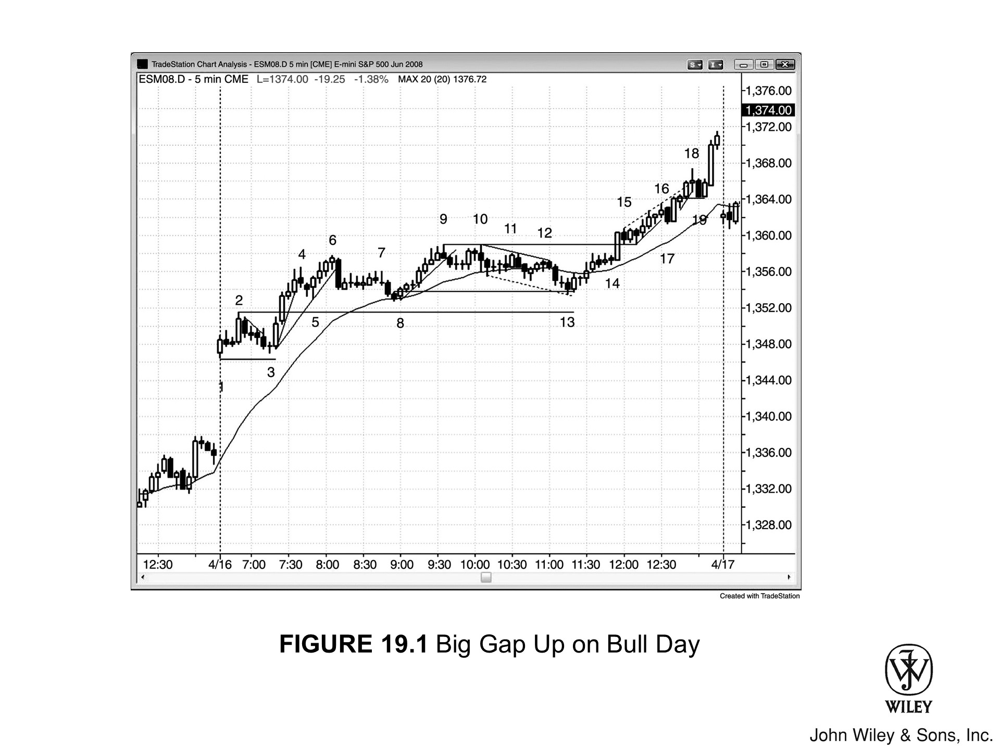
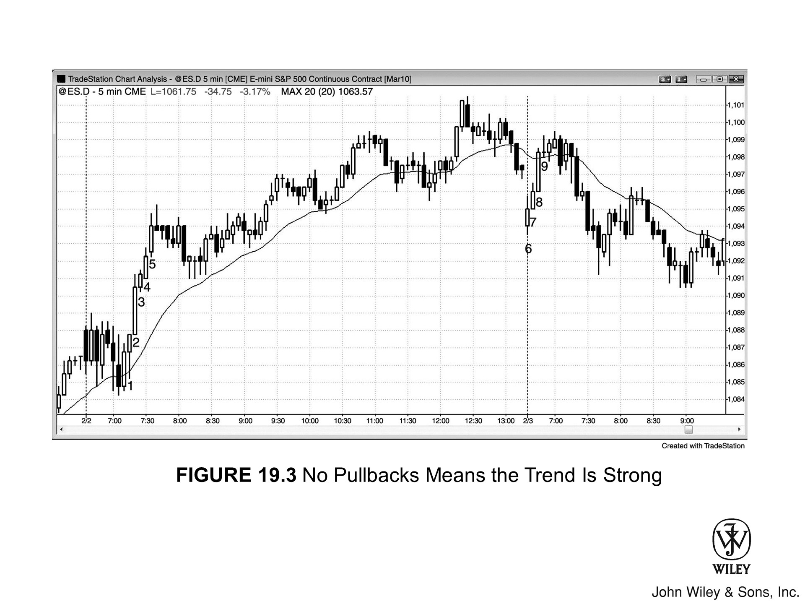

强趋势特征众多。最显眼的一点，便是 K 线从图表一角径直奔向对角，途中仅有微小回调。不过，在趋势初起之时，便会有种种迹象表明行情强劲，且后劲十足。此类信号出现得越多，你就越应心无旁骛，专注顺势入场。

此时，眼中的**逆势策略 (countertrend setups)** 应当统统被视为绝佳的顺势良机——你要做的，是在逆势交易者被迫止损离场的精确点位，利用**突破单 (stop)** 果断进场。

**趋势日里有个有趣的现象：**

*   很多时候，形态最完美的反转 K 线和实体最大的趋势 K 线，往往都是**逆势的**。这其实是个陷阱，诱骗交易者站错队。
*   此外，由于缺乏漂亮的顺势信号 K 线，交易者往往会对入场犹豫不决，最终不得不追单，导致入场过晚。

**最后，一旦认清市场处于强趋势中，进场便不再拘泥于特定的入场策略 (setup)：**

*   全天任何时刻，你皆可随时以**市价单 (at the market)** 切入，只需带上相对较小的止损即可。
*   此时寻找入场策略，唯一目的只在于将风险降至最低。

以下是强趋势的一些常见特征：

- **当日开盘大幅跳空。**

- **波段高低点呈现明显的趋势特征。**

- **绝大多数 K 线均为顺势的趋势 K 线。**

- **相邻 K 线实体间鲜有重叠。**
    - 例如在多头急速行情中，许多 K 线的低点紧贴前一根 K 线的收盘价，或仅低一个 tick。
    - 有些 K 线的低点触及却未跌破前一根 K 线的收盘价，导致试图在前一根收盘价挂限价单做多的交易者未获成交，被迫追高买入。

- **K 线无影线或影线极短，凸显行情急迫。**
    - 例如在多头趋势中，若一根多头趋势 K 线开盘即最低并随即上行，表明前一根 K 线刚收盘，交易者便争相买入。
    - 若收盘价处于或接近最高点，说明买盘持续强劲，因为交易者预期 K 线收盘后会有新买家入场。
    - 他们愿在收盘前买入，是唯恐等到收盘后，被迫在这一两个 tick 的更高位追涨。

- **实体间偶现缺口**（例如多头趋势中，某 K 线开盘价高于前一根 K 线收盘价）。

- **突破缺口表现为趋势启动时的一根强趋势 K 线**（如第二册所述，趋势 K 线本身即为一种缺口）。

- **当突破测试未与突破点重叠时，形成测量型缺口。**
    - 例如，多头突破后的回调，未跌破突破 K 线的高点。

- **若强趋势 K 线的前后 K 线之间留有缺口，即构成微型测量缺口。**
    - 例如在多头趋势中，若强多头趋势 K 线之后一根 K 线的低点，等于或高于该趋势 K 线之前一根 K 线的高点，这既是缺口，也是突破测试，更是强势信号。

- **未出现大幅高潮。**

- **巨型 K 线并不多见**（即便是大的趋势 K 线也少有）。

很多时候，最大的趋势 K 线反而是逆势的。这往往是个陷阱，引诱交易者寻找逆势机会，从而错失顺势交易。逆势的入场策略看起来几乎总是优于顺势策略。

*   趋势通道线未出现明显过冲，即便有轻微过冲，也仅引发横盘回调。
*   趋势线突破后的回调呈横盘走势，而非逆势走势。
*   出现失败的楔形及其他失败的反转形态。
*   出现一连串的 20 根均线缺口 K 线（即连续 20 根或更多 K 线不触碰移动平均线，详见第二卷）。
*   鲜有能盈利的逆势交易机会。
*   回调幅度小、频率低，且多为横盘。例如，若 Emini 平均波幅为 12 个点，回调往往不足 3 到 4 个点，且市场常连续运行 5 根或更多 K 线而无回调。
*   市场透着一种紧迫感。你苦等无数根 K 线，期盼一个像样的顺势回调，但它迟迟不来，而市场却在缓慢延续趋势。
*   回调具备强势的入场策略。例如，多头趋势中的高 1 和高 2 回调，其信号 K 线往往是强势的牛市反转 K 线。
*   在最强的趋势中，回调的信号 K 线通常较弱，致使许多交易者不敢进场，最终迫使他们追逐市场。例如，在空头趋势中，低 2 做空的信号 K 线往往是处于两三根 K 线多头急速中的小阳线，且部分入场 K 线是外包下行 K 线。市场呈现出“任何要素”皆趋势的特征：无论是收盘价、高点、低点还是实体。
*   反复出现的两段式回调构筑了顺势入场策略。
*   未曾出现连续两根趋势 K 线收盘于移动平均线异侧的情况。
*   趋势延伸极远，并突破多重阻力位，如移动平均线、前期波段高点及趋势线，且突破幅度均达许多个 tick。

逆势急速（Spike）形态的反转尝试往往缺乏后续跟进（follow-through），最终失败并演变为顺势方向的旗形（Flag）。

当趋势处于 Runaway mode 时，往往连续多根 K 线都没有回调（Pullback）。这些 K 线通常是实体饱满的趋势 K 线（Trend Bar），且影线（Tail）很短。既然你想在趋势延续期间持有波段（Swing）底仓，同时又想通过更多剥头皮（Scalp）交易来增厚利润，不妨参考以下时间周期的处理方式：

*   **3 分钟图**：不妨看看 3 分钟图，寻找额外的顺势入场策略（Setup）。3 分钟图上通常会有更多“停顿 K 线”（即逆势孕线 [Inside Bar] 和单 K 线回调），提供了顺势入场的机会。
*   **1 分钟图**：虽也有顺势入场点，但也包含一些逆势形态，当你一心只想做顺势交易时，这些信号容易造成干扰。这种困惑加上极快的读图要求，会在 Runaway mode 期间制造巨大的心理压力，进而影响你的交易发挥。
*   **交易建议**：既然你需要确保抓住每一个顺势入场机会，那么在 Runaway mode 中，最好只盯着 5 分钟图做交易。等你积累了经验并能稳定盈利后，再考虑兼顾 3 分钟图。

随着时间推移，趋势逐渐减弱；双向交易（Two-sided trading）的迹象愈发明显，而强势特征开始消退。例如，在多头趋势中：

1.  交易者开始在前 K 线高点上方及波段高点（Swing High）上方获利了结；
2.  激进的空头也开始在这些高点上方做空，并准备在更高位加仓（Scale in）；
3.  强势多头最终将只在回调（Pullback）时买入。

最初的多头急速（Spike）转变为多头通道（Channel），并最终演化为交易区间（Trading Range）。

***

Figure 19.1 牛市日的大幅跳空高开 (Big Gap Up)

开盘若现大 **缺口** 且早盘未见 **反转**，往往预示当日将开启一段 **强趋势**。此类日子，收盘价常逼近当日最高点（若是 **空头趋势**，则为最低点）。

如图 [Figure 19.1] 所示：

*   **盘面形态**：5 分钟 Emini 盘面跳空高开 11 个点，**缺口** 巨大，且首根 **K线** 即为 **多头趋势K线**。此外，市场长达两小时未 **测试** 均线，尽显强势。
*   **市场特征**：请留意，盘面鲜有情绪化特征（如巨型 **K线**、**高潮** 或大幅震荡）。这种由大量小 **K线**（且多为 **十字星**）构成的“安静”市场，往往孕育着最大级别的 **趋势**。

此类行情下，**机构交易者** 的行为逻辑如下：

1.  **入场困境**：机构手握巨额买单，虽渴望低价但苦等不来，只能全天分批入场，被迫在不断走高的价位上成交。
2.  **风险控制**：眼见 **趋势** 日确立，虽预知全天不得不追高买入，他们仍不会一次性抛出所有买单。因为这可能引发 **高潮** 式的 **急速** 上涨，随后的 **反转** 恐将跌破其平均持仓成本。
3.  **执行策略**：他们甘愿全天拆单，以可控的节奏分批成交。虽明知越买越贵，但他们心里清楚，市场大概率还会涨得更高。
4.  **后市指引**：此外，此类强势日通常意味着未来数日还将创出新高。

### 本图深度解析

如图 19.1 所示，市场向上突破了昨日高点。但在 bar 2 的强多头急速（spike）之后，紧跟了一根空头孕线。当市场跌破这根孕线并掉头向下时，此前的突破宣告失败。

大幅跳空高开后，行情常会回测开盘低点，从而构筑出一个小型的双底牛旗。像这种开盘区间很窄的情况，市场便处于突破模式，交易者会顺势入场。既然是大幅跳空高开，概率自然偏向于向上突破。

**多头的入场选择：**

*   **激进的多头：** 可能会依据双底形态，在 bar 3 上方入场；
*   **更多的多头：** 选择在开盘区间 bar 2 的高点上方，挂突破单（stop order）进场。

这一天既属于“开盘即涨”的多头趋势日，也是趋势恢复型的多头日。

***

市场向下走了一波小型的两段式运动，抵达 bar 3。具体结构如下：

1.  **第一腿：** 由一根空头趋势 K 线和两根十字星构成。
2.  **第二腿：** 包含一根带有长上影线的空头趋势 K 线（该影线即为结束第一腿下跌的回调），随后是一根十字星。

这种两段式运动的变体，若放在更小周期的图表上，必会呈现出两条清晰的下跌腿，从而形成 ABC 买入信号。

**交易策略与执行：**

*   **入场点位：** 交易者可在 bar 3 上方一个 tick 处买入。此举也是对缺口的测试，并与 bar 1 的低点构成了双底。
*   **波段交易：** 既然这可能是一个趋势日，其延伸幅度往往远超大众预期，因此聪明的交易者会对部分或全部仓位进行波段交易（swing）。

**关键信号提示：**

请注意，当日开盘价非常接近当日最低价，这是强势的信号。对于“开盘即涨趋势日”而言，如果开盘价位于当日最低价的几个 tick 之内，其收盘价往往也会收在当日最高价的几个 tick 之内，且趋势经常会一直持续到收盘。

- **Bar 5**：是强劲上涨（4 根多头趋势 K 线）后的高 1 突破回调。在强多头趋势的急速阶段，高 1 永远是绝佳买点。

- **Bar 4**：其低 1 跌破趋势线并从新高反转，但这绝非做空信号，哪怕是剥头皮也不行。
    - 其实，这里用“低 1”这个词都不准确，因为低 1 是用于交易区间和空头趋势的策略，而非强多头趋势。
    - 经历如此强劲的上涨，聪明的交易者只会一心做多，除非出现二次入场信号，否则绝不考虑做空。

---

- **Bar 6**：是低 2，即二次做空入场，也可能是多头趋势中交易区间的顶部。但在强多头趋势面前，空头只能做剥头皮。
    - 想要做波段空单，前提是必须先有一波强劲下跌，并跌破关键趋势线（跨度或许达 20 根 K 线以上）。
    - 一旦进场做空，他们会快进快出，随即寻找做多形态，转手做波段交易。
    - 强趋势中的顺势单应以波段为主，仅平掉小部分仓位做剥头皮。如果你发现错过了顺势入场，切勿寻找逆势剥头皮机会，而应专心等待顺势形态。在趋势日，你必须尽量抓住每一个顺势信号，因为这是最稳健的获利来源。

- **Bar 6 入场 K 线**：是强空头趋势 K 线，这既是突破，也是急速（Spike）。
    - 急速之后通常会接一个至少包含两段推进的通道；但当急速逆着强趋势出现时，往往只有一段推进，从而演变成两段式牛旗。
    - 无论如何，向下急速发生后，大概率至少还有一段下跌。

---

- **Bar 7**：是开启第二段下跌的低 2 做空入场 K 线，但在经历了 6 根 K 线的窄交易区间后，无论向哪个方向突破，往往都难以延续，最终失败。

- **Bar 8**
  既是强多头趋势中首次回踩均线，又是两段式回调，买点极佳。一旦市场远离均线达 20 根 K 线以上（即“20 根 K 线缺口买入策略”），就意味着趋势极强，均线附近大概率会有买家进场。

- **Bar 9**
  虽在新的摆动高点反转，但此前 7 根 K 线里连一根空头趋势 K 线都没有，所以除非出现第二次入场信号，否则无法做空。

- **Bar 10**
  - 虽是第二次入场信号，但在多头趋势的窄幅交易区间里，做空顶多只能算剥头皮，最好还是放弃这笔交易。多头趋势中的侧向价格行为通常是牛旗，往往会顺着原有趋势的方向突破。
  - 外包 K 线虽然可靠性稍差，但既然第二次入场信号非常可靠，你也可以考虑做空剥个头皮。
  - 均线处连续出现了三根小十字星。这是一个小型窄幅交易区间，因而具有磁吸效应。无论向哪个方向出现趋势 K 线突破，极大概率都会失败。
  - 交易者持有空单，承担约 4 个 tick 的风险。不出所料，Bar 11 的多头趋势 K 线突破失败，交易者得以在下一根 K 线拿下 4 个 tick 的剥头皮利润。

### Bar 13：突破测试与均线缺口

*   **突破测试**：Bar 13 是一次突破测试，向下刺穿了此前那根信号 K 线的高点一个 tick。正是那根信号 K 线，引发了始于 Bar 8 的强劲上涨。
*   **市场情绪**：Bar 9 至 Bar 13 的下跌势头羸弱，走势近乎横盘。市场跌得相当勉强，好不容易才回测了突破点，这说明空头信心不足。
*   **入场策略**：Bar 13 在均线正下方形成了一个高 4 入场策略，而就在它之前，当天第一根均线缺口 K 线（高点低于 EMA）刚刚出现。
*   **趋势含义**：这是一个强趋势中的均线缺口 K 线策略，理应引发对多头高点的测试，结果要么是形成次高点，要么创出新高。强趋势下的均线缺口 K 线，往往预示着趋势的最后一段（Leg）行情，随后通常会有更深、更持久的回调，甚至演变为趋势反转。次日的走势或许正应验了这一点。
*   **结构形态**：继 Bar 9 创出更高高点后，Bar 13 走出了一个更高的低点（相对于 Bar 8），延续了多头趋势的波段节奏。本质上，它与 Bar 8 构成了一个双底牛旗。

### Bar 14：高 2 突破

*   Bar 14 是一根高 2 突破信号 K 线，前一根 K 线即为高 1。

### Bar 15：最终旗形与微型下跌腿

*   **做空信号失效**：Bar 15 是最终旗形的做空信号 K 线，但价格始终未跌破其低点，因此入场从未触发。
*   **微型结构分析**：
    1.  不过，作为一根空头 K 线，它本身就算是一段微型下跌腿。
    2.  随后的 K 线是多头趋势 K 线，紧接着又是一根空头趋势 K 线。
    3.  这第二根空头趋势 K 线构成了第二段微型下跌腿，从而确立了一个高 2 买入策略。

- **Bar 17**
  发生在强多头日，是多头微型通道的首次突破，因此构成了一个买入策略，买点位于其高点上方一个 tick。
  - 该通道呈楔形，尽管交易者此时不会做空，但理论上，空头的保护性买入止损位就在楔形高点上方一个 tick。
  - 随后，一根巨大的多头趋势 K 线一举扫过这些止损位，表明市场强烈否定了空方观点。
  - 这根 K 线之所以如此强劲，动力源于两方：
    1. 多头预期 Bar 17 的做空企图将失败，因此在其高点上方挂入买入止损单准备做多；
    2. 空头在楔形顶部（Bar 16）上方一个 tick 处被迫止损出局。

- **Bar 18**
  向上突破了多头趋势通道线，并给出了低 2 做空信号。
  - 然而，在强趋势日，聪明的交易者只有在先看到一段跌破趋势线的强空头腿后，才会考虑做空。
  - 否则，他们会将所有的做空策略视为买入策略，并恰恰在弱势空头被迫回补的位置（例如 Bar 17 和 Bar 19 高点上方一个 tick 处）挂单做多。

- **Bar 19**
  是一次失败的单 K 线趋势线突破，因此构成了买入策略。此处形成的双 K 线多头反转，成为了做多的信号。

---

**Figure 19.2** 趋势日里大多数反转都会失败

如图 Figure 19.2 所示，趋势日有个诡异之处：形态最完美的**反转 K 线**和**趋势 K 线**往往都是逆势的。

*   **诱多陷阱**：这种假象会诱使交易者在错误方向上下注，从而被套（见 K 线 1 到 8）。
*   **趋势特征**：请注意，全天连一根像样的**空头反转信号 K 线**都没出现，但这却是一个极强的**空头趋势**。这一点从**移动平均线**上就能看出来——市场始终无法连续两根 K 线收盘于均线上方，直到 K 线 8 启动的那波反弹见顶，出现**缺口 K 线**为止。

**交易策略：**
既然是**空头趋势**，任何看似买入的机会，其实都应被视为**做空入场策略**。直接把入场单挂在多头放置**保护性止损**的精确位置，借他们平仓之力推动市场下跌。

***

卖出信号疲弱，恰恰是趋势如此坚韧的关键所在：

1.  **多空观望**
    空头苦等一根强**信号 K 线**，以便全仓**做空**；被套的多头也在苦等确凿证据，证明趋势极强、必须立即离场。然而信号迟迟不来，多空双方只能继续观望。

2.  **无视现实**
    他们审视走势，看到许多**多头 K 线**以及两三根 K 线组成的**多头急速**，便臆测并寄望这种**买压**能很快引发更大级别的反弹。哪怕明知市场无力突破**移动平均线**，且所有**回调**都微不足道，他们仍选择无视这些**强趋势**迹象，继续寄望多头能把价格推高，好让他们在更舒适的位置**做空**。

3.  **最终结局**
    但这终究是奢望，空头和被套多头只能整日分批抛售，以防期待的反弹永远缺席。这种源源不断的抛压，加上那些认定这是最强**空头趋势**的强势空头激进且无情的打压，迫使市场全天逐级走低，没有任何**大回调**。

***

**Figure 19.3 没有回调意味着趋势很强**

若交易者想在前一根 K 线收盘价挂限价单买入却无法成交，这便意味着趋势极强。

如图 19.3 所示，不同阶段的 K 线表现如下：

*   **K线 1 与 K线 2**：K线 1 收于最高点。一旦收盘，部分交易者会立即按此价格挂出限价买单，指望在下一根 K线（K线 2）开盘的头几秒内成交。但由于 K线 2 的最低价从未低于 K线 1 的收盘价，这张限价单大概率无法成交。买家别无选择，只能不断提高报价追涨。

*   **K线 3、4 和 5**：同样强势，但细节略有不同：K线 3 收盘后，若有人按收盘价挂限价买单，在 K线 4 开盘头几秒内便能成交，因为 K线 4 的最低价下探到了 K线 3 收盘价下方 1 个 tick 处。通常，此类连续强力 K 线会构成“急速”（Spike），随后市场往往演变为多头通道。

*   **K线 6 至 9（次日）**：然而事无绝对。次日，K线 6 至 9 虽依然强势，最终却只形成了一个更低的高点。鉴于昨日是“急速转通道”的多头趋势日，今日理应回测通道起点。该位置成了市场下方的磁力点（Magnet）。当市场开盘于昨日多头趋势线之下，紧随 K线 6 至 9 急速之后的那个更低高点，便引发了向下的趋势反转。

股票交易者会将这种推升至昨日高点的多头通道称为“拥挤交易”（Crowded Trade）。其市场演变过程如下：

1.  想买的人都已买入，场内再无剩余买家。
2.  随着行情开始下跌，通道内的多头迅速陷入亏损。
3.  为了止损或保住部分利润，所有人争相离场。
4.  结果，市场快速下挫。

> 关于此图表的深入讨论

如图 19.3 所示，昨日走出了急速转通道形态，今日开盘向下突破了其中的多头通道。

- 第 6 根 K 线是一根多头趋势 K 线，构成了失败突破做多的形态。
- 但这波失败突破最终演变成了一个更低的高点，转化为突破回调做空形态。
- 这是第二入场点，入场位就在太平洋标准时间上午 7:05 空头急速后的那根多头 K 线下方。
