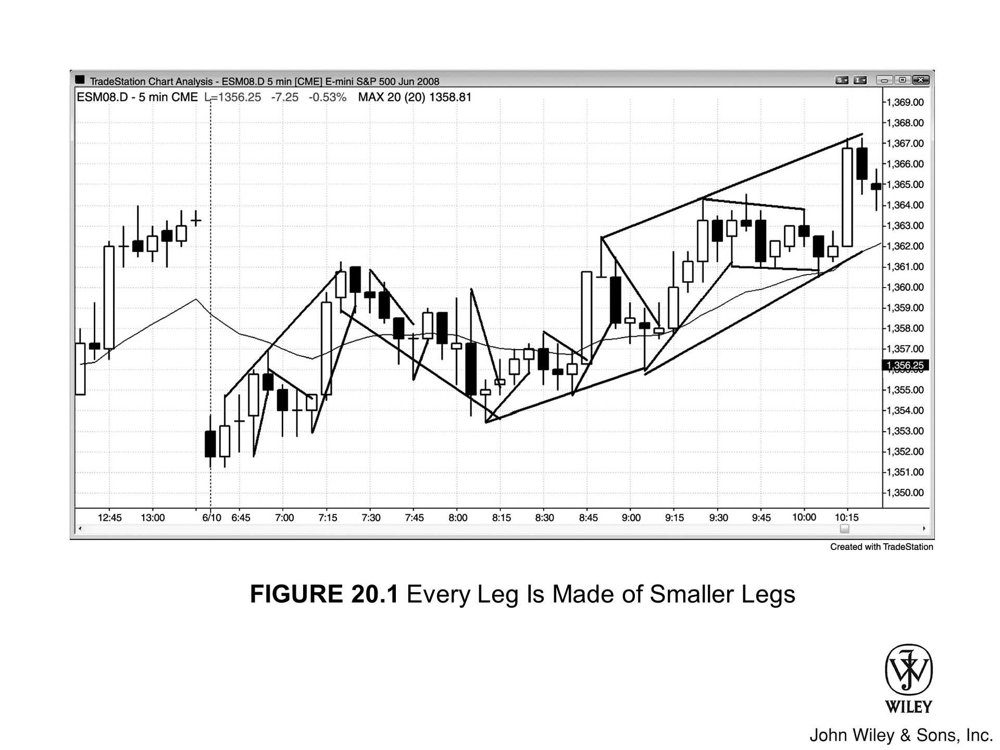

市场总爱把事情做两遍，正因如此，所有的行情波段往往都会拆解成两段更小的走势。顺势也好，逆势也罢，概莫能外。

*   如果两次尝试都碰壁，市场通常会掉头反向试探；
*   可一旦成了，趋势往往就会顺势延展。

***

大家对趋势中的 ABC 回调都不陌生，这是典型的“三步走”：

1.  先是一波逆势；
2.  接着一波小幅顺势，通常过不了趋势的极值点；
3.  最后再来一波逆势，往往比第一波探得更深。

趋势本身也倾向于细分为两条更小的腿（Legs）。Elliott Wave 的信徒看趋势，眼里是三波顺势浪。但更好的视角是：

*   把第一条强劲的顺势腿看作动能（Momentum）的爆发点（即 Elliott Wave 3），哪怕前面已经有过一波顺势行情或波浪（即 Elliott Wave 1）。
*   那段强劲的顺势行情，内部通常又能拆解成两段更小的顺势波。
*   而在随后的回调之后，趋势往往会再发起两波冲刺去测试极值（这两推构成了 Elliott Wave 5）。

***

对交易者来说，这种“两条腿”的视角显然更有道理，因为它逻辑过硬，交易机会也多。相比之下，Elliott Wave 理论对绝大多数想在市场里赚钱的交易者而言，基本毫无用处。

### 趋势突破与两段式结构

趋势线的突破，往往意味着反方向新的一腿（Leg）由此开启。每当新趋势确立，或是某一方出现投降式抛售，行情通常至少会走出**两段式结构**。

这种形态既可见于趋势的回调、突破或主要反转之中，也会出现在任何交易者认为势头足够强劲的时刻——强到值得进行第二次尝试（测试），以此验证是否会演化出一段持续的趋势。

此时，多空双方看法一致：**当前动能强劲，在任何一方建立坚定信念之前，市场必须先经历一次测试。**

---

### 实例解析：空头趋势中的两段式反弹

试举一例，在空头趋势的反弹过程中：

*   **多头操作**：会在第一腿高点上方获利了结。
*   **空头操作**：新空头顺势入场；而那些在第一段上涨中就已做空的空头，一旦见第二段上涨突破了前一腿的高点，也会立即加仓。
*   **市场演变**：若这些空单的力量压倒了在第一腿上方追涨突破的交易者，市场便会转头向下，随后进入交易区间或开启新一轮空头阶段。

---

### 关于时间周期的考量

有些复杂的两段式走势可能历经数十根 K 线，若切换至更高时间周期的图表查看，形态往往一目了然，清晰简单。然而，这种做法存在风险：

1.  **错失机会**：交易者一旦将视线从当前的交易图表移开，错过重要交易机会的风险便随之增加。
2.  **效率低下**：更高周期的图表或许一天仅给出一个信号，若仅为捕捉这寥寥一次的机会而频繁切换查看，绝非交易上的明智之举。

两段式结构最为理想，但它与“三推形态”之间存在某种重叠。

*   **双顶或双底：** 当出现清晰的双顶或双底时，第二次推进就是对之前市场反转价位的测试；如果价格在该价位再次受阻，反转或回调就很可能发生。
*   **对极值点的测试：** 但如果第一波走势并不像是趋势明确的终点，市场往往会随后对那个极值点进行一次“两段式”的测试。
    *   有时，这两段走势都会超出之前的极值，形成清晰的三推形态。
    *   而在其他时候，只有第二段超出了之前的极值，从而在多头趋势末端形成可能的“两段式更高高点”，或在空头趋势末端形成“两段式更低低点”。

***

有时，两推走势中的一段（或两段）是由两个**更小的腿**组成的，因此整体走势**实际上包含**三条腿。

1.  **形态辨析**
    许多三推形态便是如此，其中两次推进实际上只是一条腿的一部分。不过，如果你仔细观察那条包含两个**小腿**的腿，并思考当下的局势，你会发现，这条包含两个**小腿**的结构，在强度、持续时间或整体形态上，与另一条仅包含单一走势的腿是相当的。

2.  **交易心理与原则**
    对于追求完美形态的交易者来说，这既困难又令人沮丧；但交易总是置身于“灰色迷雾”之中，绝无绝对清晰之事。
    *   **入场准则：** 只要你对自己的解读缺乏信心，就不要入场——用不了多久，总会出现另一笔对你而言清晰得多的交易。
    *   **风险控制：** 你最重要的目标之一，就是避开任何令人困惑的入场策略（Setup），因为亏损难以挽回。你肯定不想把剩下的一整天都耗在为了回本（breakeven）而苦苦挣扎上，所以务必保持耐心，只做那些让你感到踏实的交易。

***

**[Figure 20.1] Every Leg Is Made of Smaller Legs**

*   每一次趋势线突破，每一次回调，都是一条“腿”，而且大级别的腿由小级别的腿构成（见 Figure 20.1）。

*   “腿”是一个非常宽泛的术语，简单来说就是指运动方向发生了改变——至于如何判定这种改变，标准完全由你自选。
