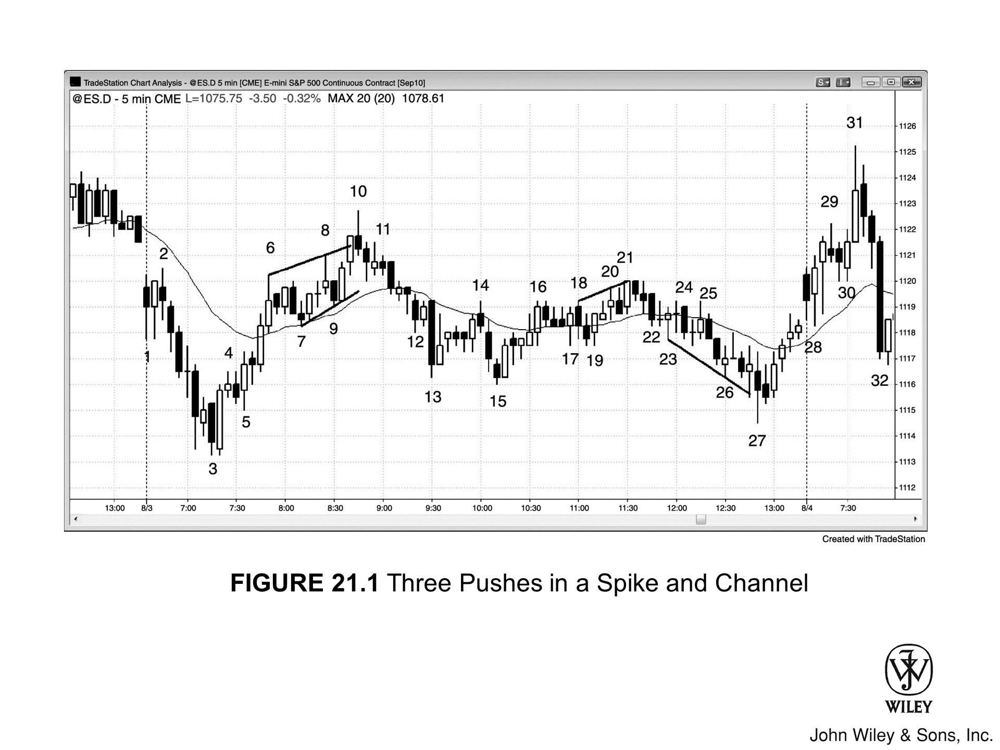
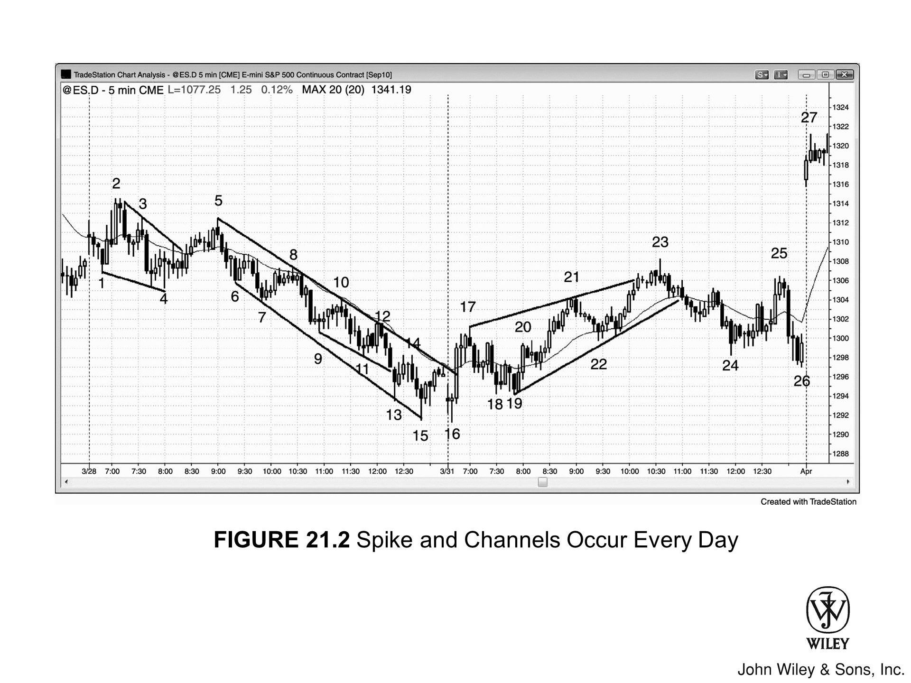
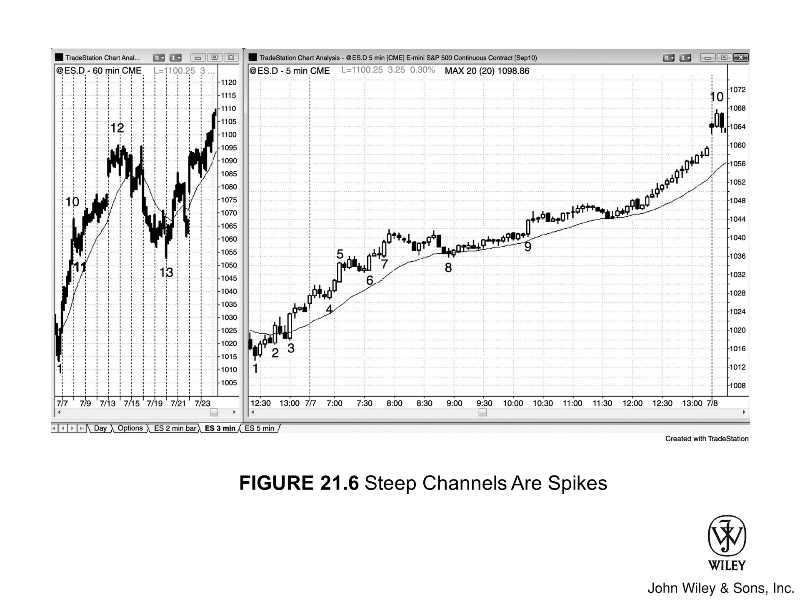
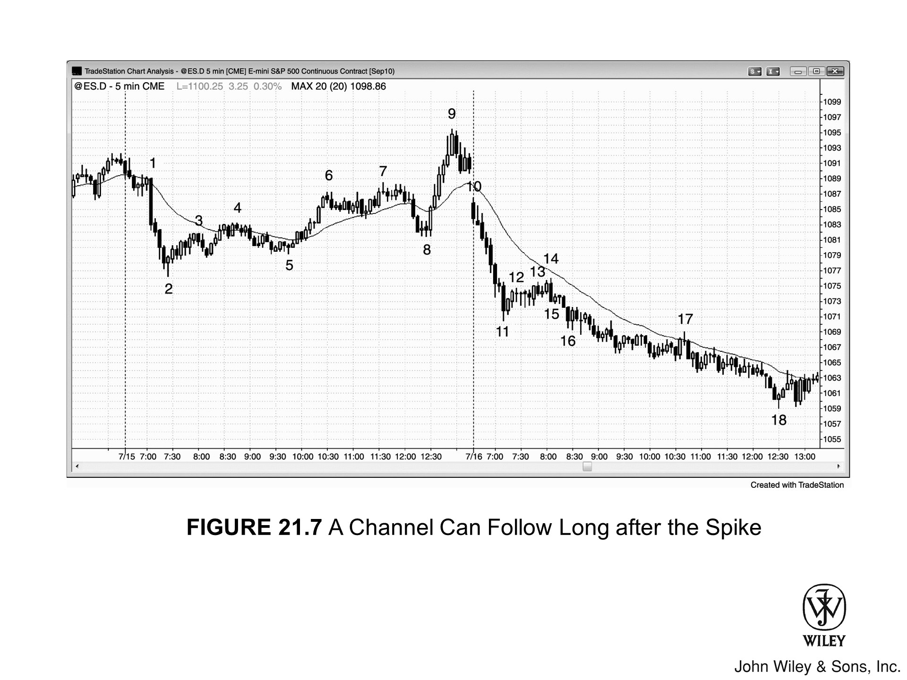
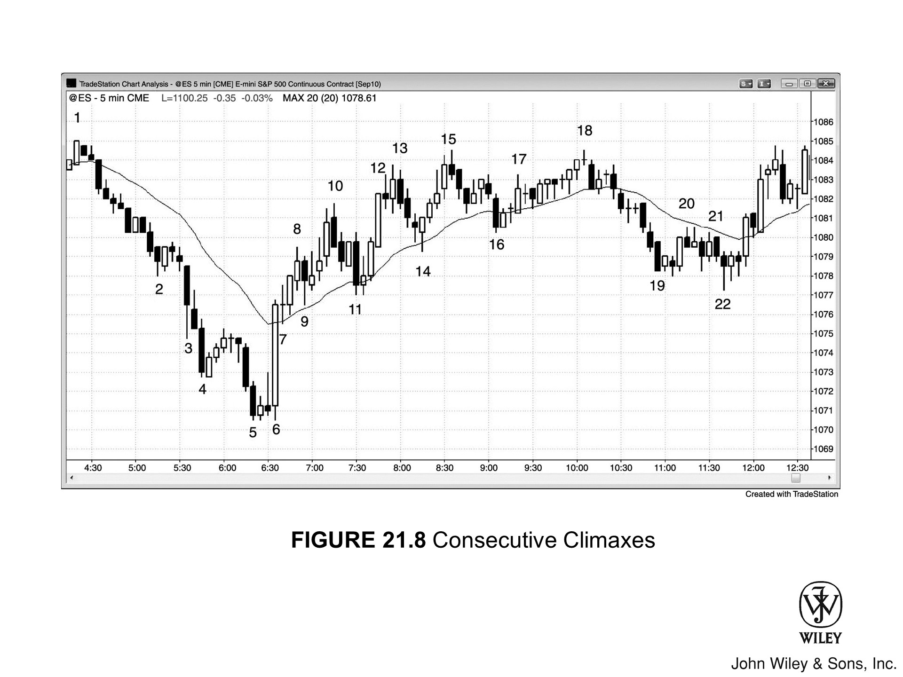
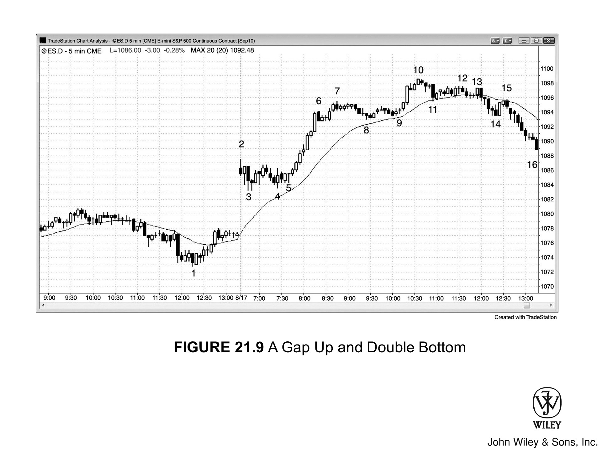

## 急速与通道趋势日的核心特征

- 行情出现由一根或多根趋势K线构成的**急速**，标志着市场突破进入明确的 **Always In** 状态。急速阶段带有强烈的紧迫感，交易员纷纷追涨加仓。急速本质上是一种**离远型缺口**（详见第2册）。

- 急速通常在当天第一个小时内形成，很多时候出现在开盘头几根K线。

- **突破**越强，后续越可能以**通道**形式延续，通道也会走得越远（参见第19章关于趋势强度的内容，以及第2册第2章关于突破强度的内容）。

- 突破足够强时，往往可以据此推算**测量移动**目标位——通道可能在该目标位附近结束，届时可以考虑部分或全部止盈。

- 急速之后紧接着是一段**回调**，短则一根K线，长则可达数十根。

- 回调结束后，趋势以**通道**形式恢复。通道阶段有别于急速阶段，由于双边交易持续存在，市场弥漫着担忧与不确定的情绪。

- 市场处于通道行情时，更适合按**趋势性交易区间**的方式操作。以多头通道为例：最好在前一根K线低点下方买入，并持有部分仓位做波段；若做空，则在波段高点或前几根K线高点上方卖出，以剥头皮为主。

- 通道很少沿顺势方向突破，即便突破，通常也会在五根K线内失败并随即反转。

- 通道往往在某个**测量移动**目标位附近结束，且常以**第三次推进**告终。

- 通道向逆势方向突破是最常见的最终结局。遇到这种情况，不要直接追突破入场，要等回调再进。以多头急速与通道为例：若市场跌破通道，应等待反弹形成较低高点后再做空。

- 市场通常会回调至通道起点，相当于对**缺口**的测试——急速和所有急速形态一样，本质上就是一个缺口。

- 之后行情会沿原趋势方向至少反弹25%，尝试构建交易区间。在多头急速与通道中，这段回调往往与通道底部形成**双底牛旗**——通道底部正好是急速上涨后那波回调的低点。

- 若整体力度偏弱，更可能演变为**趋势性交易区间日**（详见下一章）。

## 急速与通道形态概述

**急速与通道趋势**是最常见的趋势类型，几乎每天、每段趋势中都会以某种形式出现。它的变体数不胜数，大结构内部往往嵌套着多个小结构。正因为它主导着大量的价格行为，交易员必须彻底理解这一形态。这是一个两阶段形态：每段趋势都包含**急速阶段**和**通道阶段**，任何时刻必处于其中之一。

### 急速阶段

首先出现的是由一根或多根K线构成的**急速**，行情快速移动，带有强烈的紧迫感，所有人都相信趋势还会继续。急速是一种离远型缺口——市场迅速从一个价格区间跳至另一个区间。

### 回调

随后出现**回调**，短则一根K线，长则数十根，有时甚至会回撤至急速起点之前。比如多头急速之后，偶尔回调会跌破急速低点，之后通道才正式开始。

### 通道阶段

回调结束后，趋势转入**通道**阶段。这一阶段紧迫感消退，取而代之的是担忧与不确定——这正是财经媒体时常提到的"忧虑之墙"。所有人都能看到**双边交易**在进行，趋势看起来随时要结束，却一直在延伸。交易员倾向于快速止盈，但趋势持续不断，他们又反复重新入场或加仓，因为没人确定趋势何时结束，都想确保自己不会错过。

### 次级急速与失败突破

极少数情况下会出现第二段急速，然后再跟一段通道，但通常第二段急速会演变成**失败突破**，行情随即进入回调。以多头急速加低动能多头通道为例：行情可能从通道顶部再度急速突破，但极少会跟出另一段多头通道，更多时候这次急速沦为失败突破，行情随即向下回调。

## 认识急速

当市场出现一连串K线大幅拉升（或下跌）而几乎不回调时，这段强劲的走势就叫**急速**。急速可以是单根趋势K线，也可以是一组几乎没有重叠的趋势K线，有时甚至表现为一段极窄的通道。从这个角度看，某一时间周期上的急速，在更低时间级别上就是一段陡峭的窄通道；反过来，陡峭的窄通道在更高时间周期上就是一段急速。第一根暂停K线或回调一旦出现，急速即宣告结束——但如果一两根K线内趋势再度发力，它就变成了第二段急速，或者在更高时间周期上仍算作一段完整的急速。急速的规模差异很大，小到只有一根中等体量的趋势K线，大到延续十根甚至更多K线。

**急速**、**高潮**与**突破**本质上是同一件事，书2的突破章节会有更深入的讨论。在向上急速中，市场形成了一种共识：当前价位对空头而言没有价值，因此价格必须继续上行，直到找到多空双方都愿意交易的区域。行情会持续快速上涨，直到多头开始止盈、不再积极追涨，同时空头也开始入场做空——此时出现停顿或回调，这是**双边交易**开始的第一个信号。向下急速的逻辑与此相反。

几乎所有趋势都以急速开头，哪怕只是单根趋势K线——只是往往要在很多根K线之后回头看，才能认出它是趋势的起点。因此，几乎所有趋势都是**急速与通道**趋势的变体。不过，当一段趋势更明显地呈现出本章其他类型趋势的特征时，应该按那种类型来操作，以提高胜率。

## 急速结束后的市场走向

从定义上讲，急速在第一根**暂停K线**或**回调**出现的前一刻结束，因为正是暂停标志着急速的终结。此后市场通常有三种走向：趋势延续、进入**交易区间**、或趋势反转。第一种最为常见——市场回调几根K线，多则十余根，随后趋势再度启动。这段回调本质上是**突破回测**（急速本身就是一次突破），也是通道的起点。

### 趋势延续

趋势重启后，动能通常不及急速阶段——表现为更多的K线重叠、斜率趋缓、出现回调，以及零星的反向趋势K线。这就是**通道**，整体结构由此形成**急速与通道趋势**。

### 进入交易区间

第二种情况是回调延续超过十根K线，演变为**交易区间**，之后可向任意方向突破。总体而言，交易区间沿原趋势方向突破的概率更高。如果交易区间持续时间较长，在更高时间周期图表上通常只是一面**旗形**（例如，5分钟图上多头急速之后出现的一个持续三天的交易区间，在60分钟图上往往只是一面牛旗，向上突破的概率更大）。这属于**趋势延续形态**，本章后面会专门讨论。

多数情况下，趋势会在当天收盘前恢复，当天成为**趋势延续日**。但也有例外：交易区间的突破偶尔会失败，或在几根K线内反转（**最终旗形反转**在书3的反转章节中讨论）。极少数情况下，交易区间会延续数小时甚至数天，且波动极小（这就是**窄交易区间**，在书2的交易区间章节中讨论）。与任何交易区间一样，突破方向两边都有可能，但稍微倾向于沿原趋势方向突破。

### 趋势反转

第三种情况是趋势反转。只要急速之后的回调力度还不足以翻转**始终持仓**的方向，市场就大概率延续原趋势，而且延续形式几乎都是通道。较少见的情况是市场反向发出一段急速，形成反方向的急速。这种情况下，市场通常随后进入**交易区间**，多空双方争夺主导权。

多头持续买入，试图在牛市急速之后形成**多头通道**；空头持续做空，试图在熊市急速之后形成**空头通道**。交易区间可能持续到收盘，但通常一方最终胜出并完成突破。突破后，要么形成通道，当天演变为急速与通道趋势日；要么突破后很快又陷入新的交易区间，形成**趋势性交易区间日**（下一章讨论）。

除了反向急速，市场也可能通过另一种方式实现反转：急速之后先形成交易区间，再从区间底部向下突破。例如，牛市急速后进入交易区间，大约三分之一的情况下，市场会向下突破区间底部，而非向上突破顶部。向下突破有时表现为强烈的大幅**空头急速**，但更多时候只是一根普通的空头趋势K线，随后跟着一段**空头通道**。

## 通道阶段的交易方法

如果形成了**通道**，最好只顺着趋势方向交易。有时通道内的波动幅度较大，随着通道推进，可能出现**逆势刮头皮**的机会。要注意，通道持续的时间可能远超预期，而且过程中随时都像要反转。途中会有很多回调，把交易者套在错误的方向上。通道内通常有大量带影线的K线、大量反向的趋势K线，以及大量相互重叠的K线——但它仍然是趋势，过早逆势交易的代价极高。

### 通道的动能变化

有些交易日会在早盘走出一段强劲的动能行情（**急速**），之后趋势在较为平缓的通道里延续全天。不过，通道有时会加速，走出**抛物线**轨迹而非线性路径；有时则会失去动能，形成更平缓的曲线。无论哪种情况，通道起点通常会在当天晚些时候、或之后一两天内被回测，随后市场可能进入交易区间，也可能朝任意方向形成新的趋势。

### 窄通道与宽通道

关键在于：如果通道较窄，就只适合做顺势方向，因为回调幅度不够大，逆势交易赚不到钱。相对少见的情况是通道波动幅度较大，这时才可以双向交易。

当通道出现**逆势方向的突破**后，要做好准备寻找逆势入场机会，因为逆势行情很可能一路回测到通道起点，并尝试形成交易区间。

### 通道即旗形

记住，任何通道，无论坡度多陡，从反方向看都是一个**旗形**。**多头通道是熊旗，空头通道是牛旗**。通道虽然是一个倾斜的交易区间，但也是更大交易区间的第一段腿，反转目标通常在通道起点附近。

举个例子：如果市场先是急速上涨，然后回调，再形成多头通道，那这个多头通道通常就是尚未展开的**交易区间**的第一段腿。市场随后通常会回落到通道底部，在那里与通道底部形成**双底牛旗**。这通常会引发一波反弹，成为交易区间的第三段腿。反弹之后，交易者就该开始寻找其他形态了，因为急速与通道形态到这个阶段的可预测性已经结束。

### 缺口回测

**急速**是一种**突破**，也就是说，突破点与第一次回调（即通道起点）之间会形成一个**缺口**。回测到通道底部，就是对这个**缺口的回测**，也是一次**突破回测**。

## 拥挤交易的概念

股票交易者常把**多头通道**尾声描述为"拥挤交易"，他们认为所有对这只股票感兴趣的人都已经做多，市场上再也找不到新的买家。他们随后预期价格会快速跌回通道起点，因为所有在通道内买入的人都会选择离场。在股价快速下跌的过程中，他们认为这段空头行情是由大批入场较晚、持有浮亏的多头争相平仓造成的——为了把损失控制在最小，他们蜂拥出逃，引发了这波又快又深的下跌。每一次行情显然受很多因素影响，但当市场出现大幅回调并直奔通道起点时，这种机制很可能是其中的重要成因。

## 急速与通道形态中的反转建仓形态

急速与通道形态的第二段是**通道**，所以通道阶段的行为特征跟其他任何通道都一样。几乎所有急速与通道多头形态最终都会向下**突破**通道底部，并回测到通道底部附近。最容易识别的反转建仓形态是：通道内出现**三连推**，整体呈**楔形**，第三推**过冲****趋势通道线**后以强劲的**反转K线**收场，尤其是当出现**二次入场点**时。

不过，多数时候反转不会那么清晰，等**突破回调建仓形态**出现再入场更稳妥。比如，多头通道向下突破后，等市场回调至 **HH** 或 **LH** 的位置，如果出现好的空头建仓形态，就做空。如果下跌触及通道底部并出现做多信号，那就寻找机会做多，等待**双底牛旗**的反弹行情。

## 强劲的急速与通道建仓形态

只要出现一段强劲的**急速**，随后有任意形式的回调——哪怕只是一根K线——然后趋势继续，那就大概率会走出**急速与通道趋势**。举个例子：如果一段强劲的向上急速突破了交易区间，之后出现一根**内包K线**，再之后有一根K线跌破内包K线低点但随即反转形成**多头反转K线**，交易者就会在那根K线上方用**突破单**入场买入，预期接下来形成**多头通道**。只要市场突破那根多头反转K线的高点，通道就正式启动。

它可能只有一次**急速**推升（持续一到几根K线，即**最终旗形反转**，将在第三册讨论），随后便反转进入空头腿；也可能经过两段或更多段之后才反转。如果向上的通道恰好形成于反转概率较高的位置，例如交易区间顶部附近，那么可能走了几段就已反转，根本来不及画出清晰的通道线。但如果通道形成于多头趋势概率较高的位置，例如从强力底部形态反转向上，通常至少会有**三连推**，甚至更多。

## 测量移动目标位

通道究竟能走多远？在强趋势中，通常远超大多数交易员的预期。不过，如果急速段幅度较大，有一种计算**测量移动目标位**的方法：取急速段第一根K线的开盘价或最低价到急速段最后一根K线的收盘价或最高价之间的距离，从急速段终点向上等距投射。另一个目标位是**第一腿等于第二腿**的**测量移动**，即以急速段为第一腿、通道段为第二腿。当通道到达测量移动目标位时，留意反转形态是否开始出现。

此外，通常还能看到其他**测量移动投射**、**趋势线**和**趋势通道线**目标位，但大多数目标位都会失效，尤其在趋势非常强的时候。即便如此，这些目标位仍值得关注，因为反转最终出现时，往往就在这些**阻力位**附近，届时做反转交易的信心也会更足。总体而言，测量移动目标位更适合作为止盈参考，而非反转入场依据。

只有当建仓形态足够强时，才应考虑反转交易，相关内容在第三册详细讨论。有经验的交易员会在测量移动目标位**逆势剥头皮**，有时市场走反还会**分批加仓**（分批加仓将在第二册讨论），但能持续盈利的交易员极少，大多数人尝试之后只会亏损。

## 价值与均衡

强势**急速**段意味着市场正在快速移动至一个新价位——在那里，多空双方都认为有**价值**下单。市场通常会过冲**价值区间**，然后回调，最终形成一个**交易区间**。由于多空双方在这个新区间内都能接受当前价格，等距上涨与等距下跌的概率大致各占50%——也就是说，市场先涨 X 个 Tick 还是先跌 X 个 Tick，机会大致相当。这种不确定性正是交易区间的典型特征。

市场为何趋势运行并不重要，重要的是它在快速移动。可以把这段走势理解为一次**突破**——远离某个前期价位，也可以理解为向某个**磁铁**靠近。磁铁可以是一个关键价位（比如前期急速高点）、一个**测量移动**目标位，或一条**趋势线**。也可以将突破理解为向**中性区**的移动——在那里，方向性概率将重新回到50%左右。

这种情况始终发生在**交易区间**中：一旦方向性概率降至50%，交易区间就会清晰呈现。**趋势**本质上就是市场从一个交易区间移动到另一个交易区间的过程，而在新的交易区间内，多空双方都在布局，等待他们所判断的下一次**突破**方向。这一点在第二册的交易数学章节中有更详细的讨论。

举个例子：当市场处于**多头通道**中时，等距上涨的方向性概率开始下降，并在某个未知点触及50%。这个点最终将成为交易区间的中心，但没有人事先知道它在哪里——市场通常需要向上和向下各自过冲，才能找到中性区。通道上行期间，交易员会默认方向性概率仍高于50%，直到明显跌破50%为止。

这种明朗化通常发生在某个**磁铁**位置，届时所有人都会意识到市场已经涨过头了。那里大致就是交易区间的顶部，方向性概率转为对空头有利，市场随后下行寻找中性区，但通常又会再次过冲——因为中性区从来不会一目了然，反倒是过冲显而易见。等市场跌至某个磁铁（第二册有详细讨论），交易员会判断跌过头了，于是反弹向上。随着交易员不断锁定**中性区**，区间会越来越窄——中性区就是多空双方都认为有价值下单的价位，双方力量趋于平衡，市场进入**突破模式**。随后，市场的价值认知再次改变，必然再度突破，去寻找新的价值区间。

## 窄通道内不要做逆势交易

一旦确认当前处于**急速与通道**趋势，就不要试图做**逆势交易**，指望**ABC 回调**能走出足够空间来剥头皮。原因很简单：此前通常根本没有**趋势线**被有效突破，通道本身又太窄，逆势交易在这种环境下注定亏损。这些失败的逆势剥头皮反而是很好的**顺势建仓形态**。只需在逆势交易者触发**保护性止损**离场的价位挂**突破单**入场即可。

## 激进的通道交易方式

激进的交易者会在**通道**内用**限价单****顺势**做单，直到**双向交易**明显增多，此后才开始考虑**逆势**方向。举个例子：如果出现**空头急速**，随后形成通道，空头就会在前几根K线高点附近或高点之上挂限价单做空。随着通道向支撑位靠近，他们会观察几个信号：K线是否开始大量重叠、**多头趋势K线**是否增多且力度增强、**十字星**是否变多、**回调**幅度是否加大。双向交易的迹象越多，多头越愿意在前几根K线低点及**波段低点**附近或下方挂限价单买入，空头则越不愿意在K线上方或下方做空。

趋势运行一段时间后，空头会在**测量移动**目标位或其他支撑位附近分批止盈离场。多头则在相同区域开始分批建立多仓。买盘增加、卖盘减少，最终推动价格向上**突破****空头趋势线**。

账户规模足够大的机构和交易者可以**分批加仓**逆势头寸，期待市场回测通道起点，但大多数交易者应坚持**顺势**操作，直到出现明确的反转信号。在下半交易日分批建立逆势头寸风险很高，因为时间往往不够用，最终很容易发现自己拿着越来越大的亏损仓位，不得不在收盘前大亏离场。

空头在分批加仓时，有些人会等一根有力的**多头趋势K线**向上突破前一个**波段高点**。他们把这看作即将形成的**交易区间**顶部可能出现的**衰竭**顶，于是在该K线收盘价及高点上方挂限价单做空——因为他们认为这段通道是**交易区间**的第一段，而在交易区间顶部区域押注**多头急速**失败，正是标准的交易区间交易手法（详见第二册交易区间部分）。交易区间形成之后，回头看会发现**多头通道**正是该区间的起点。经验丰富的交易者甚至能在通道形成过程中就开始运用交易区间的交易手法——前提是他们判断市场已处于即将形成的交易区间顶部附近。

## 急速与通道的内在逻辑

**急速**阶段在图表上呈现为一段**薄区**（相邻K线几乎没有重叠，属于一种**突破**或**测量型缺口**，详见第二册），说明多空双方对当前价格达成了共识：价格被错误定价，因此市场迅速穿越这个区域。双方都在推动价格快速离开急速阶段的价格区间，共同寻找一个**均衡点**——这个均衡点预计会在通道开始形成后显现。没错，趋势依然存在，因为一方仍占主导，但终于出现了一定程度的**双向交易**。

**通道**阶段通常有大量**重叠K线**和**回调**，本质上是一个斜率较陡的**窄交易区间**。这类价格行为代表着双向交易，因此合理的预期是：无论趋势有多强，通道的起点迟早会被回测。以**急速与通道**的空头趋势为例，那些在空头通道一开始就入场做多的多头，押的是急速会演变为**失败的突破**，而当价格回调至该区域时，他们的多仓总算回到**盈亏平衡点**附近。这会让回调形成类似**双顶**的结构。这些多头会在早期多仓接近盈亏平衡时选择离场，且除非价格再度下跌，否则不会轻易买入。这很可能是通道顶部被回测之后市场通常还会继续向下运动的重要原因之一。

任何**通道**通常都是**交易区间**的第一段，后面往往跟着一波**逆势**运动，回测通道起点，从而揭示出交易区间的轮廓。此后，交易区间一般会在时间上进一步延伸，并至少朝原通道方向走出一段局部行情。从那时起，市场就进入了交易区间状态，处于**突破模式**（交易者等待突破），而**突破**进入新趋势可以朝任意方向发展。

## 抛物线通道

有时通道坡度极陡，走势加速形成**抛物线**。虽然连续K线之间的重叠极少，看起来不像典型的通道，但这种抛物线走势在功能上等同于通道阶段，因此是**急速与通道趋势**的一种变体。这种抛物线走势往往包含一根大趋势K线。举个例子：如果先出现**空头急速**（即一根或多根大**空头趋势K线**），然后稍作暂停，接着再出现一波空头急速，就形成了**连续的卖出高潮**。

每一根大**趋势K线**都应该被看作一次**急速**、一次**突破**、一次**缺口**，同时也是一次**高潮**。当市场出现**连续高潮**（中间仅有短暂停顿或小幅回调），随后通常会出现一段**两段式回调**，回测第一次高潮之后的那段停顿区域。第二次高潮可以理解为急速与通道形态中的通道阶段，尽管它本身又是一次急速，而非低动能的通道。不过，由于后续走势与标准**急速与通道**形态高度一致，连续高潮本质上就是这一形态的变体。极少数情况下，市场甚至会出现第三次连续高潮，之后才进入更复杂的回调。

## 连续高潮之后为何会有较大幅度的回调

**连续卖出高潮**之后，市场为什么倾向于出现较大幅度的回调？当**卖出高潮**出现时，市场中存在**恐慌性抛售**。弱势多头觉得必须不惜一切代价平掉手中的多单；弱势空头则被强劲的动能所吸引，担心踏空大行情，纷纷以市价做空，唯恐入场太迟。如果市场短暂停顿后又出现一根大阴线，第二次卖出高潮同样意味着一批急迫的卖方再度涌入——他们不愿等待回调。

等到弱势多头悉数离场、弱势空头全部入场，低位便再也没有人愿意继续做空，**买方失衡**随之形成。市场缺乏足够的空头来承接买单，只能向上寻找愿意做空的交易者来消化这些买盘。**连续买入高潮**的情形恰恰相反——它同样源于一种迫切感：市场快速上涨时，交易者担心以后不会再有低价买入的回调机会，于是纷纷以市价追买。

等到这些情绪化的弱势空头和弱势多头（追高入场的多头属于弱势多头）都在高位买够了，便再也没有人继续买进，市场不得不向下寻找更多买家。结果就是一段**回调**，通常分为两段，持续时间至少在十根K线左右。

## 急速与高潮形态的变体

**急速与高潮趋势**是另一种强劲的通道形态。在急速结束后的停顿之后，市场再次形成一次急速。所有**急速**本质上都是**高潮**，当市场出现**连续高潮**时，通常会引发较大幅度的回调，往往回到第二次急速的起点。这正是急速与通道形态的运行逻辑，因此它属于该形态的一种变体——只不过第二段不是通道，而是又一次急速。有时候高潮以急速的形式出现，而急速反而更像通道。比如先出现一段**多头通道**，之后突然出现一根大**多头急速K线**，这就可能演变为**急速与高潮反转**。即便结构上是先通道后急速，走势依然遵循标准**急速与通道形态**的逻辑。

## 缺口开盘作为急速

任何大幅垂直移动都可以充当**急速**，**缺口开盘**也不例外。以标准普尔（S&P）现货指数为例，在 Emini 大幅跳空高开的当天，现货指数的第一根K线并非缺口，而是一根大**多头趋势K线**——开盘价接近昨日收盘价，收盘价接近 Emini 第一根K线的收盘价。若随后出现停顿或回调，再形成通道，这便构成了一段**缺口急速与通道趋势**。

## 不同时间周期下的急速与通道

当**通道**极为陡峭时，**急速与通道**合在一起，在高时间周期图表上往往只呈现为一次急速，而高时间周期上的那次急速，通常随后会发展出一段**通道**。也有些时候，急速延续了数根K线却始终没有出现通道，但仔细观察就会发现，急速末端的几根K线之间实际上存在重叠，在更低时间级别的图表上，那里确实存在一段**通道**。

## 相互冲突的急速

有时市场会出现一根大**多头趋势K线**（向上急速），紧接着又出现一根大**空头趋势K线**（向下急速）。若这发生在持续了一段时间的**多头趋势**中，市场通常会进入**交易区间**——多头试图推动形成**多头通道**，空头则努力建立**空头通道**。最终会有一方获胜：要么趋势延续，要么市场形成**急速与通道空头趋势**。空头趋势中的情形则相反：同样先出现大阴线，再出现向上急速。

如果紧随其后出现了**多头急速K线**，市场通常会横盘整理，多空双方围绕通道方向展开博弈。空头胜出则**空头趋势**延续；多头胜出则形成反转。有时一方看似通过第二次急速取得了优势，但很快在一两根K线内便宣告失败，并引发**反方向通道**的形成。

## 急速与通道形态的交易方法

**急速与通道形态**由两个部分构成，两部分的最佳交易方式有所不同。**急速**本质上是一次**突破**，按突破的方式交易即可，具体方法在第2册中有详细论述。总体原则是：若突破看起来力度很强，且背景也支持突破成功，可以在急速形成过程中直接以市价入场，或在小幅**回调**时入场。由于急速同时也是**高潮**，在某个时点必然会出现回调，这为**顺势**入场提供了额外的机会。

**通道**本身和其他通道没什么区别。如果是**窄多头通道**，可以在**回调**时顺势入场，比如回调到**趋势线**或**均线**时买入，或用**限价单**挂在前一根K线低点以下，又或者在英特尔（INTC）交易于20美元时每下跌10美分买一次。如果通道摆幅较大、**双向博弈**更强，可以双向都做。通道本质上是反方向的**旗形**，一旦开始反转，就可以顺着做**反转交易**。价格通常会回到通道起点附近，可以在测试该起点时入场——在急速与通道多头回调中，这构成**双底牛旗**；在急速与通道空头回调中，这构成**双顶熊旗**。

## 弱通道与强通道

**通道**内相邻K线**重叠**多、反向**趋势K线**多、**回调**频繁且持续多根K线，就是弱通道。通道越弱，机构**逆势交易者**的力度就越大。举个例子：**空头急速**之后出现**弱空头通道**，强势多头会随着市场下跌不断**加仓买入**。各路机构会用一切能想到的理由来买：每根K线低点以下买、每一个前**波段低点**以下买、谷歌（GOOG）交易于500美元时每跌1美元买一次、每次触及**趋势通道线**时买、低时间级别图表上出现每一根**反转K线**时买、GOOG每从低点反弹1美元就买——因为随时可能就是底部反弹的起点。

如果市场没有从通道顶部突破，而是从底部强势向下突破，形成延续数根K线的强**空头急速**，这些多头就不得不**平仓**了结多单。他们卖出多单的同时，也在为**空头突破**推波助澜，甚至可能反手做空，顺势做一笔**动量交易**。但多数情况下，向下突破走不了多远：最后那批忍痛离场的多头一旦出清，就没有人愿意在这么低的价格继续做空了。市场通常会走出至少两段反弹、至少10根K线，向上寻找一个更高的价格区域，让空头重新愿意在那里建仓。

## 逆势急速与趋势过渡

市场处于强趋势中，突然出现反向**急速**，这根急速多数情况下只是一次**回调**（即**旗形**），之后趋势继续。但这已经是一个信号：认为市场可能反转的交易者开始愿意建仓了。如果在接下来的10到20根K线里又出现一两次这样的反向急速，这些急速的**逆势力量**是**累积**叠加的，市场正在向更强的**双向博弈**过渡，有可能演变为**交易区间**、**更大幅度的回调**，甚至**趋势反转**。

### 示例：多头趋势过渡

假设存在一个非常强的**多头趋势**——不限于急速与通道多头，只要市场连续20根以上K线持续在**均线**上方运行，且处于高位，趋势就非常强劲。此时突然出现一根中等大小、高开低收的**空头趋势K线**，这就是一次**空头急速**。不管它是**空头反转K线**、空头反转K线下方的入场K线，还是**内包K线**，都无所谓。这第一次向下急速，几乎必然只会形成一个**多头旗形**。等多头趋势恢复后，继续观察下一次**空头急速**。终究会有一次急速之后带来**回调至均线**的走势。第一次回调到均线之后，通常会有一次**测试多头趋势高点**的反弹。

这次测试可能是**更高高点（HH）**、**双顶**，也可能是**更低高点（LH）**。不过，回调到均线本身通常已经足以打破至少一条**多头趋势线**，随后的反弹很可能就是行情最后一次冲高，之后将面临较大幅度的回调甚至反转。

### 多次急速的累积效应

如果在新高处出现第三次、且力度更强的**空头急速**，出现至少**两段式回调**的概率就大幅上升，急速之后的下跌通常会形成某种**通道**。市场有没有忽略之前那两次空头急速？市场从不忽略任何东西。虽然这次急速看起来才是那个"决定性事件"，但前两次急速同样有**累积效应**。事实上，如果第二次空头急速力度特别强，之后市场却反弹创了新高，然后第三次急速力度并不大却直接引发了回调，就需要换一个角度来理解刚才发生的事情。

第二段空头急速很可能才是更关键的那一段，才是下跌行情真正的起点——此后反弹至新高的走势，不过是对那段急速的**回调**。理解这一点很重要：任何**突破回调**都可以以**更低高点**、**双顶**或**更高高点**的形式测试原有极值，而那次测试往往就是**空头通道**的起点。表面上看，那段小幅空头急速下跌是熊市的开端，随后的通道是第一个空头通道——但有时候，更早那段急速的影响力反而更大。它的通道可以从多头趋势的高点算起，以那段小幅空头急速下跌为起点。那段小空头急速之后的通道，实际上嵌套在一个更大的通道之内——而那个更大的通道，早在小空头急速形成之前，就已经从多头高点处开始了。

## 有竞争性急速走势的交易区间

市场处于**交易区间**时，往往同时出现**多头急速**和**空头急速**。多空双方随即展开争夺，各自试图形成**通道**。最终，其中一方会取得主导，建立起**趋势通道**。这个过程通常以一次**突破**为开端，而这次突破本身就是第二段急速。两段急速共同构成了通道的基础。

## 通道即旗形

**多头通道是空头旗形，空头通道是多头旗形**。和所有**旗形**一样，它们是**持续形态**，通常顺着趋势方向**突破**。不过有时也会反向突破，演变为**趋势反转**。反向突破本身是一段急速，因此市场形成的不是"急速与通道"趋势，而是"**通道与急速**"趋势——这与急速与通道形态无关。但通常情况下，急速之后会跟随通道。

举个例子：假设当前是**空头趋势**并出现了**回调**，这段回调是一个上升通道，也就是**熊旗**。有时通道会向上突破。向上**突破**的那根K线是**多头趋势K线**，也是一段急速——如果突破成功，后续跟随的就是通道。多头趋势从这段急速起步，急速加上后续通道构成**急速与通道多头趋势**。之前那个通道是空头趋势的最终旗形，虽然它向上突破了，但与随后的急速与通道多头趋势并无关联。急速改变了市场格局，是新视角的起点——此后交易者会忽略之前那个熊旗，只关注急速之后的走势。

## 失败的楔形反转

类似的情形也出现在**楔形反转**失败时。比如，**楔形顶**是一个上升的多头通道，也是**熊旗**，通常向下突破。如果反而向上突破，这次**突破**就是一段**急速**，之后可能跟随**通道**以及向上的**测量移动**。突破始终会重置交易者的认知框架，应被视为**新趋势**的起点。在这个例子里，趋势方向仍然是**多头趋势**，与楔形之前一致，只是现在变成了更强的多头趋势。

向上**突破**通常在5到10根K线内就会反转，转为**持续较长的两段式回调**或**反向趋势**。这类突破代表极度**高潮式**的买入，属于过度行为，处于行为钟形曲线的尾端。机构的各类指标都会提示多头趋势过度、需要修正。每家机构衡量**过度**的标准各不相同，但通常会有足够多的机构认为这波反弹过头，它们押注市场下跌的仓位很快就会压过多头，**反转**随即到来。

## 常见变体

**急速与通道的行为模式**是图表上最常见、也最重要的现象之一。**变体**无数，每种形态都有多种解读方式。有时急速只有一根K线，但**暂停**之后会出现形态更完整的急速。**通道**可以陡峭到几乎充当急速的一部分，而整个急速与通道在更高时间周期上看可能就是一段急速。通道相对于急速可以非常小，也可以非常大。趋势强劲时，通道内通常会出现多段**急速**，整个通道可以细分为更小的**急速与通道形态**。保持开放的心态，因为所有这些变体都可能带来盈利的交易机会。

## 图 21.1：急速与通道中的三连推

多头急速与通道有时会以三连推向上、过冲趋势通道线加强势空头反转K线收尾，但大多数反转没那么教科书。图 21.1 中，K线 6 是两K线向上急速的组成部分，但从 K线 5 低点开始的上行坡度极陡，也可以把 K线 5 视为急速的起点。这个界定并不重要，因为开盘时出现强势向上反转后，后续跟随买盘的概率很高，多套买入程序会基于不同的起始判断各自介入。这里，后续走势演变为三连推向上的通道，呈楔形结构。通道在第三推完成后往往会回调。K线 10 过冲趋势通道线后反转向下，形成空头反转K线，构成做空机会。多头楔形通常会向下回调两段，目标位在楔形底部附近；而急速与通道多头结构中的通道部分，通常也会向下回调两段，目标位在通道起点，即 K线 7 的低点。

急速可以累积叠加。K线 7 之前的那根K线是一根空头急速，但只是推动了对均线的测试。K线 9 是第二次空头急速。这两次急速说明空头正在努力夺取市场控制权，市场开始呈现双向态势。K线 10 是两K线空头急速的第一根，K线 11 之后又接了一段空头急速。不能因为最后那次急速向下突破了楔形、明显引发了空头腿，就认为是它单独完成了趋势反转。之前那些急速同样是过渡阶段的组成部分，不应被忽视。在它们形成的过程中，你就应该意识到市场正在转向，开始双向寻找机会，而不是只寻找做多的建仓形态。

K线 16 是单K线急速，但向上的急速也可以被视为从 K线 15 开始。市场在 K线 17 处回调，随后三小推向上到 K线 21，市场在此反转。

K线 15 之后的那根K线是单K线急速，其后四根K线构成一段小通道，收于 K线 16；从低点上行至 K线 16 的整段走势同样是一段急速。

K线 22 是一段向下急速，随后横盘整理至 K线 25，从 K线 25 开始形成向下通道，延伸至 K线 27。K线 27 是急速之后的第三推（K线 23 和 K线 26 为前两推），过冲了趋势通道线，收盘于K线中部。这不是一根强信号K线，其后跟着的空头内包K线也同样偏弱，但市场最终在收盘前反转上行。

### 图 21.1 深度分析

图 21.1 中，市场在昨日收盘时向下突破了均线和交易区间。由于那段交易区间内出现了大量空头趋势K线，且今日第一根K线带有强势空头实体，因此面对今日第二根K线构成的向上突破失败做多建仓形态，合理的选择是不去追进，而是等待第二次信号再做多。虽然第二根K线是一根强势多头反转K线，但并没有什么值得反转的结构，因为它完全包含在前一根K线之内。这只是一段小交易区间，不构成有效反转。所有向下缺口都是空头急速，之后可能跟随空头通道。K线 2 套住了多头，随后成为突破回调做空的建仓形态，引发了通向 K线 3 的急速与通道趋势。K线 3 向下突破单K线最终旗形后，成为强势两K线反转的第一根，同时形成了当日最低点。从技术角度说，这次多头反转可以描述为向上突破失败，但更准确的说法是空头通道末端的向上反转。

K线 6 之前的那根多头趋势K线，标志着交易者放弃了"K线 3 以来的反弹只是熊旗"这一预判。那根K线是市场从"空头趋势"切换到"多头趋势"的突破口。这个判断在 K线 6 得到确认，大多数交易者此时最终认定市场已转为 Always In 做多。许多人在 K线 6 之前那根多头趋势K线收盘时就认为市场已向上反转，那根K线同时也是急速、突破K线和缺口。紧随其后的K线（即 K线 6）的低点构成缺口下沿，突破点的高点构成缺口上沿——具体来说，K线 5 以及紧随其后的那根小空头内包K线共同构成了突破点。由于 K线 6 之前那根K线形成了缺口，而缺口本身具有磁吸效应，在未来约 10 根K线内被测试的概率较高。K线 7 完成了这一测试，并成为随后跟随急速向上的通道底部。部分交易者认为急速从 K线 6 之前的趋势K线开始，另一些人则认为从 K线 5 或 K线 3 之后的多头K线开始。K线 12 是通道高点之后的向下回调，符合急速与通道形态的预期——回调再次测试缺口区域，并尝试与 K线 7 的通道底部（K线 10 是通道顶部）形成双底。这次尝试失败了。

K线 12 是对 K线 7 多头通道底部的测试——那个通道在 K线 10 结束——但下跌到 K线 12 的走势处于窄通道中，因此很可能只是两段式下跌的第一段。正因如此，K线 12 之后那根多头内包K线上方的双底牛旗做多信号始终没有触发。结果 K线 13 是一根很大的空头趋势K线。由于它出现在一段相对较长的空头腿末端，更可能是一次衰竭性高潮，之后至少应该出现 10 根K线、两段式的横盘到向上回调。我经常用"10 根K线、两段式"这个说法，意思是这次回调会比一次小回调持续更长、结构更复杂，通常至少需要 10 根K线和两条腿。

上涨到 K线 14 是第一腿，随后回调到 K线 15 创出更低低点，之后第二腿上涨到 K线 21。K线 15 也可能是从 K线 10 高点开始的第二腿下跌，但事实上回调的结构变得更复杂，第二腿一直延伸到 K线 27 才结束——K线 27 与 K线 5 形成双底牛旗，也与 K线 15 形成双底牛旗。选哪个并不重要，因为含义相同。有些程序会用这个，有些会用那个，但两类程序都会按测量移动做多。它们在等待从 K线 3 低点出发的第二腿上涨，形式是第一腿等于第二腿：第一腿是 K线 3 到 K线 10，第二腿是 K线 27 低点到 K线 31 高点。在高时间周期图上，K线 27 是一个简单的高 2 做多建仓形态，因为它是从 K线 10 那波上涨回调下来的两段式走势。这是强势上涨之后的两段式更高低点，由此形成的回调最终带来了测量移动，上涨到 K线 31。涨到 K线 31 时略微过冲了测量目标几个 Tick，但已经足够接近，多头在此止盈，随后市场回落到 K线 32 低点。

下跌到 K线 15 的走势是一个楔形牛旗，前两次推低分别止于 K线 7 和 K线 13。K线 10 是对 K线 6 的 HH 测试而不是 LH，这无关紧要，因为楔形旗形中本来就常见这种情况。

K线 21 是一个楔形熊旗，这在双顶向上突破失败后很常见。K线 16 和 K线 18 形成双顶，但市场没有向下突破，而是向上突破。随后市场经历两小腿上涨到 K线 21，在此反转，突破失败。K线 16、18、21 就是楔形熊旗的三次推高。

## 图 21.2：急速与通道每天都在上演

某种形式的急速与通道趋势每天都会出现。图 21.2 中，第一天 3 月 28 日是一个空头急速与通道日：开盘先有一根急速阳线，随后从 K线 2 开始反转为三K线急速下跌，然后从 K线 3 再次急速下跌。K线 3 处市场试图与前一天末尾的波段低点形成双底。K线 2 到 K线 4 之间的两根大空头趋势K线，任意一根都可以被视为空头趋势的初始急速段。K线 8 与 K线 6 之后那个小熊旗顶部形成双顶，随后市场全天在窄通道内缓慢下漂，在均线附近出现多次不错的做空入场机会。

次日市场以急速上涨的形式向上突破通道，上涨至 K线 17。由于通道起点通常会被回测，交易员此时可以开始寻找做多建仓形态，目标是回测 K线 5 附近的区域。K线 5 是空头通道的起点，后来被 K线 23 回测到，又被再下一天 K线 27 的跳空高开超越。

下跌到 K线 15 的通道走势略带抛物线特征——它跌破了由 K线 9 到 K线 11 构成的空头趋势通道线，说明下跌斜率加大——这属于高潮性行为，长期不可持续。交易员也可以将 K线 5 到 K线 8 的趋势线做一条平行线，然后锚定到 K线 6 或 K线 7 的低点，画出趋势通道线，K线 13 和 K线 15 同样会过冲那条线。

下跌过程中，空头以各种可能的理由分批做空，并剥头皮获利。比如，他们可能在每次反弹 2 点时做空，或在前一根K线高点上方做空，就像 K线 9 上方以及 K线 9 之后连续五根创出更高高点的K线各自高点上方。他们会在均线和趋势线处做空，比如 K线 10 那里。每次价格小幅突破趋势线上方，他们就顺势做空，比如 K线 11。他们也会在每根回调K线低点下方做空，比如 K线 10 低点下方。另一些空头则会在价格触及通道顶部后固定下跌一定幅度时做空，比如下跌 1 到 2 点，押注下行动能会带来跟随。由于这轮空头趋势在所有其他小时间级别图表和各类图表类型上都清晰可见，交易员也会基于这些图表以及高时间周期图表持续做空。

激进的多头会在这段空头通道中持续买入。有些人做剥头皮交易，比如每次测试趋势通道线时就买入，像 K线13 和 K线15 的低点处。另一些人则分批建仓，认为市场当天或次日应该会测试 K线8 或 K线10 的通道顶部。他们可能在每次测试趋势通道线时买入，也会在每个新的波段低点买入。比如，市场跌破 K线11 低点急速下探至 K线13 期间，他们可能挂限价单买入——有人买在低点，有人买在低点下方几个 tick，也有人买在低点下方几个点。还有些人会在下跌至 K线13 的卖出高潮刚出现停滞迹象时就介入。他们把熊K线实体收窄、影线变长解读为衰竭信号，认为接下来很可能出现一段可交易的反弹。部分交易者会分批加仓，每次加仓量是上一笔的 2 到 3 倍。还有人会在低点上方 2 个点挂突破单，将这种幅度的反弹视为反转已经启动的信号。另一些人则基于更小或更大的时间周期图表，或者以 tick 和成交量为基础的图表来操作。这波下跌可能是回调至 60 分钟或日线均线的位置，也可能是回踩高时间周期图表上的强多头趋势线。每位交易者都有自己的理由，也在用各自不同的方式分批进出。只要他们清楚自己在做什么，都能赚到钱。

不过，对大多数人来说，在交易日最后几个小时的空头通道中分批做多，风险很高。他们很容易陷入持有大额亏损仓位的困境，被迫在收盘前割肉离场。在空头通道中，寻找做空的建仓形态比硬扛分批做多更容易赚到钱，尤其是在交易日最后几个小时。

急速上涨至 K线17 之后，市场走出一段楔形通道，上涨至 K线23，随后出现回调，次日又跳空大涨。这个跳空上涨的走势可能仍属于上升通道的延伸。任何缺口本身也是一段急速，之后还可以再形成新的通道。

从 K线8 跌至 K线9 的走势同样是一段急速，而从 K线10 到 K线15 的空头通道被随后涨至 K线21 的行情完全回收。K线10 和 K线21 构成的双顶熊旗引发下跌，最终在 K线22 结束，那里恰好是均线的测试位。鉴于此前趋势已经反转为多头，且涨至 K线21 的走势相当强劲，不应该预期会出现强力下跌。前 8 根K线中有 7 根是多头实体，高点、低点和收盘价都在趋势性抬升。

### 图 21.2 深度解析

图 21.2 中的 K线4 是一个楔形牛旗做多建仓形态，随后的上涨在双顶熊旗（K线3 和 K线5）处结束。

空头通道五次测试空头趋势线，但每次向下的延伸幅度都很有限。当市场反复测试某条线却无法显著跌破时，通常最终会向上突破。

底部由 K线13、K线15 和 K线16 的三连下推构成。虽然形态本身不是标准的楔形，但含义完全相同。

急速上涨至 K线17 突破了空头趋势线。K线17 是一根均线缺口K线，这类K线往往标志着趋势出现更大级别反转之前的最后一段走势。

这根均线缺口K线之后的下跌以更高的低点 K线18 测试了空头低点，从而与 K线19 形成双底牛旗，同时也与 K线15 和 K线16 的双底形成双底回调建仓形态。双底牛旗本质上就是一个更高的低点，只不过有两次向下的测试。

通道往往在第三次上推之后出现回调。涨至 K线23 的行情低于昨日空头趋势的顶部，许多交易者将其视为空头反弹，打算在这里做空。楔形熊旗加上 K线23 的空头反转K线，构成了一个不错的做空建仓形态，预计至少会走出两段式下跌，持续约 10 根或更多K线，可能测试 K线22 或 K线19 的低点。下跌至 K线24 虽然有两段，但跌势之急让交易者开始怀疑这是否只是第一段中的一个复杂结构，由此引发了收盘前跌至 K线26 的续跌。K线26 测试了多头通道底部附近的位置，在那里与 K线18（或 K线19）形成了双底牛旗。

K线17 的跳空高开几乎是楔形顶部之上的一个测量移动，市场突破楔形顶部时出现这种情况很常见。

K线24 到 K线25 之间形成了一个小型楔形熊旗。

从 K线4 涨至 K线5 的走势同样是一个楔形熊旗。

以 K线22、K线24 和 K线26 为支撑点，形成了一个大型楔形牛旗，尽管涨至 K线25 的走势破坏了楔形的外观。大多数三连推形态的运作方式与楔形完全相同，都应视为楔形的变体。

## 图 21.3：急速与通道趋势极为常见

图 21.3 是 IBM 的 5 分钟图，图中出现了多个急速与通道形态，有些还互相嵌套——大形态内部细分为更小的形态，这很常见。通道起点通常会在一两天内被测试，因此即便到了第二天，也要留意逆势建仓形态。图中每个通道起点（K线 2、5、8）都经历了测试，唯一的例外是最后一个（K线 12）。K线 13 试图引发一轮抛售来测试 K线 12，但随即快速失败并强势向上反转。

K线 1 之前是一段急速上涨，之后走出的不是典型的通道，而是几乎垂直、带有轻微抛物线特征的走势，一路直奔 K线 3。这是急速与通道趋势的一种变体。K线 11 的急速上涨以及 K线 12 之后的通道上行，也是同样的情形。当通道如此陡峭时，在高时间周期图表上通常表现为一段急速走势。

从 K线 2 或图表低点到 K线 3 的涨幅太过陡峭，本身就构成一段大型急速。事实上，它在 60 分钟图上形成了一根四K线的多头急速，随后跟随一轮大型两段式回调，在 K线 10 结束（K线 6 是第一段的终点）。此后市场在接下来两周持续上涨，几乎精确到达测量移动目标位——大约是图表低点到 K线 3 顶部的高度，叠加在 K线 3 的高点之上，对应约 128.83 美元。

K线 7 向下的急速看起来是空头腿的明显起点，但还有另一种解读，两种解读或许都对市场产生了影响。注意 5 月 5 日开盘时那根大型空头急速K线——尽管市场随后短暂创出名义上的更高高点，这根空头急速仍然至关重要，可以视为引发后续通道下行的急速起点。此后创出的更高高点，也可以理解为只是空头急速之后的更高高点回调，并将其视为空头通道的起点。

---

## 图 21.4：陡峭的抛物线型微型通道

图 21.4 是前一张图的局部放大，清晰呈现了通道的抛物线特征。K线 8 到 K线 9 处于一个陡峭的微型通道中，但随后市场向上突破该通道，形成一个更陡的多头通道，从 K线 10 延伸至 K线 11。斜率持续加大形成了抛物线形状，这种走势不可持续，属于一种高潮。不过高潮持续的时间，往往比你的账户扛得住的时间还长，所以即便你知道这种趋势终将结束，也绝对不要尝试做空如此强劲的多头趋势。

尽管看起来不太可能，市场在次日确实下探并测试到了 K线 3 处通道起点低点以下。

当市场走出约 10 根或更多强趋势K线，相互之间几乎没有重叠、影线也很短时，说明正处于极强趋势中，交易员正在以市价买入。他们为什么不等回调？因为他们非常确定价格很快会更高，却不确定近期是否会出现回调，所以不愿等一个可能根本不会来的回调。就算真的出现回调，他们也相信幅度会很浅、只持续几根K线，然后就创出新高。

从 K线 1 到 K线 2 的走势是急速与高潮趋势。K线 1 是急速，但市场没有走出通道，而是在 K线 2 形成了第二段急速。连续高潮之后通常会有更深的回调，往往会跌到第二段高潮的底部，此处正是如此。由于这与急速与通道的运行方式完全一致，急速与高潮应当被视为急速与通道趋势的另一种变体。

从 K线 7 到 K线 11 虽然是微型通道，但走势足够紧密，交易员有理由预期它在高时间周期图表上会呈现为一段急速。从 K线 3 到 K线 15 的整段走势同样足够紧密，也可以被视为一段急速。事实上，市场在接下来三天回调至该急速底部附近，随后跟随了一段为期七天的多头通道，并到达以急速高度为基准的测量移动目标位。

K线 12 到 K线 14 的上涨处于一个通道中，随后跟随了一段由两根多头趋势K线构成的急速突破，将价格推至 K线 15 的高点。这里出现了通道之后跟随急速的情形，在急速与通道形态的急速与高潮变体中有时确实如此——K线 14 之前的通道充当"急速"角色，K线 15 的急速充当"通道"角色，整个组合的运行方式与传统的急速与通道形态一致。

K线 21 之前那段三K线多头急速看起来非常强劲，但如果把时间周期缩得足够小——比如 10 tick 图——几乎可以肯定它其实是一段窄通道，大多数急速都是如此。

### 图 21.4 深度解读

K线 1 是一根强劲的多头突破K线，向上突破了前一日收盘时的空头通道，也突破了均线。它的开盘价几乎贴近最低 tick，是一根多头急速K线，大概率会跟随多头通道。K线 2 形成了第二段多头急速，这两次连续的买入高潮之后，市场出现了八根K线的回调，跌回均线附近。K线 3 在回调至 K线 1 之后的回调低点时形成双底牛旗建仓形态，提供了做多机会。

截至第9根K线的四根多头趋势K线，大小相当均匀，涨幅不算极端，没有高潮迹象，整体包在一条微型通道里。这种力度之后几乎一定还会继续上涨，交易员可以把它当作多头急速来操作——在高时间周期图表上，它大概率就是一段急速。最直接的做法是在其中任意一根K线收盘时买入，保护性止损放在急速底部下方，也就是第8根K线之后第二根多头趋势K线的低点以下。只要市场仍在强势上涨、尚未出现高潮，有经验的交易员就会一路小量加仓做多。由于保护性止损距离较远、风险较大，每次建仓规模会偏小，但他们会随着市场上行持续加码。第12根K线是第一次试图反转通道，大概率会失败，但多头随后开始在跟随的空头趋势K线上陆续止盈，比如第13根K线之后那根，以及第14根K线。剩余仓位则在上冲至第15根K线的两K线买入高潮、之后的几根小空头内包K线，以及紧随其后的那根强空头趋势K线上全部了结——买入高潮之后，大概率至少会走出一段两段式回调。

第15根K线是一根大型多头趋势K线，出现在一段旷日持久的趋势末端。它有可能是一次突破、新一轮上涨腿的起点，但更可能是买入真空效应。强势多头与强势空头都在等这样一根K线出现，准备在其收盘附近做空。这类K线总是刚好形成在一个或多个阻力位略下方。当价格逼近该区域时，空头入场做空，很多多头也选择退场观望。那些偏好在强势上涨中追买的多头一时没有对手盘压制，迅速把价格推到了目标位。随后强势多头止盈离场，强势空头入场做空，双方都预判买入高潮之后会跟随一段更深、更复杂的回调——届时他们都会重新站到多头一侧：空头回补平仓，多头重新建仓做多。

## 图 21.5：缺口急速与通道日

有时缺口本身就可以充当急速，形成缺口急速与通道日（见图 21.5）。左图是标普现货指数，右图是 Emini 图表。Emini 图上的高开缺口，在现货指数上不过是一根大型多头趋势K线，也就是一段上行急速。从这个角度看，把 Emini 上的缺口理解为一根大型趋势K线是完全合理的。

第2根K线是通道的起点，次日被测试（第4根K线）。通道上行至第3根K线时动能已在衰减，顶部开始圆弧形弯曲向下。

### 图 21.5 深度解读

图 21.5 中，从第1根到第2根K线形成的多头旗形引出了后续通道，同时这段旗形也起到了最终旗形的作用——只不过在第3根K线反转向下之前，突破持续了相当长的时间。在高时间周期图表上，它可能就是一个最终旗形。

## 图 21.6：陡峭通道即急速

市场有时会接连形成一系列急速，通道坡度极陡，在高时间周期图表上直接变成急速（见图 21.6）。右图 Emini 5分钟图上出现了多次上行急速，其中第8根至第10根K线的通道陡到始终没有出现一次回调去测试通道起点。结果整段从第8根到第10根K线的急速与通道形态，在左图60分钟图上变成了一段急速。60分钟图上的第10根K线对应5分钟图上的第10根K线。60分钟图随后形成了一条上行通道，延伸至第12根K线，市场最终在第13根K线回调至该通道底部。

5分钟图上最清晰的急速是第4根至第5根K线构成的三K线急速，但当天还有其他几段急速，如第2、3、6、7、9根K线，每一段都有可能引出后续的上行通道。向下到第8根K线的三K线下行是一段下行急速，理论上可能引出一段下行通道，回测第4根或第6根K线处上行通道的起点——但多头趋势实在太强，这段下跌直接形成了 EMA 20 缺口K线买入信号，随后演变为一段旷日持久的上行通道。

### 图 21.6 深度解读

图 21.6 中，昨日以小幅多头趋势收盘，今日开盘向上突破了昨日收盘处的两K线多头旗形。第4根K线是这轮始于开盘的趋势日中的突破回调多头入场点。

## 图 21.7：通道可以在急速阶段结束很久之后才出现

如图 21.7 所示，强势急速走势并不总是能直接引出通道，比如跌向 K 线 2 的急速下跌，以及涨向 K 线 9 的急速上涨。但趋势几乎总是从某种形式的急速走势开始——只是有时不容易察觉。同一段走势在高时间周期和低时间周期图表上，急速阶段与通道可能呈现出截然不同的形态，但你无需切换图表去确认，从 5 分钟图上就能推断出来。乍看像一段大型急速走势的结构，放到低时间周期上，很可能是一段坡度极陡、通道难以辨认的急速与通道形态。反过来，5 分钟图上看似陡峭的急速与通道，在高时间周期图上可能只呈现为一段急速走势。

从 K 线 1 跌到 K 线 2 的走势，表面上像一段急速，但市场实际上把 K 线 1 视为急速阶段，把此后延续到 K 线 2 的四根 K 线视为通道——这在低时间周期图上应该更容易看出来。整段下跌到 K 线 2 的走势，也可以理解为一段急速下跌，随后回调至 K 线 9 创出更高高点，接着通道下跌才正式开始。有时候，急速走势结束后的回调会超过急速起点，通道在那之后才展开。

K 线 9 到 K 线 11 是这段通道下跌的第一段，构成一次急速；之后从 K 线 14 到 K 线 18 是对应的通道。K 线 10 之前的缺口加上 K 线 10 本身，共同构成一段急速下跌，随后跌至 K 线 11 的走势则是通道。

一旦掌握了识别急速与通道形态的细节，你就能更准确地评估潜在交易的概率，也会发现更多交易机会。

## 图 21.8：连续高潮

连续高潮是急速与通道趋势形态的一种变体。每一根大型趋势 K 线都应该被理解为一次突破、一段急速，也是一次高潮。图 21.8 中，K 线 3 是空头趋势中的一根大型空头趋势 K 线，也是一次抛售高潮。但高潮本身并不意味着市场会反转，它只是说明价格走得太快太远，可能暂停一根或几根 K 线。之后趋势可能继续延伸，也可能转为横盘，甚至反转。

这次高潮之后，市场用一根内包 K 线的空头 K 线暂停了一根 K 线的时间，随即出现 K 线 4，又是一次抛售高潮。K 线 4 之后经过三根 K 线的回调，迎来了第三次连续抛售高潮，标志着空头趋势的低点。最后这次抛售高潮是跌至 K 线 5 低点的两根 K 线走势。那两根 K 线实体大、影线小、K 线间几乎没有重叠，但这些特征并不影响判断——高潮通常会引发回调。这些交易员急于做空，连等一次反弹、在更好的价位入场都不愿意。当这批弱势交易员卖完之后，再没有人愿意继续做空，买方随即占据主动，推动市场上行。K 线 3 的高潮之后是一根 K 线的回调，K 线 4 的高潮之后是三根 K 线的回调，K 线 5 的高潮之后则是一次主要趋势反转。通常来说，连续出现两次高潮，至少会触发一次两段式回调；连续出现三次，反转幅度一般更大——这里正是如此。

连续高潮是急速与通道趋势的变体，所以可以把 K 线 3 理解为急速阶段，把 K 线 4 理解为通道——尽管这里并没有典型通道中那种带影线、相互重叠的小 K 线序列。之后，K 线 4 又成为下跌到 K 线 5 这段通道的急速阶段。

K 线 6 是一段多头急速，在 K 线 8 处结束的通道是它的配套结构。K 线 6 到 K 线 8 的上涨坡度极陡，完全可以视为一段急速；在高时间周期图上，它们很可能就构成了急速阶段。K 线 7 到 K 线 10 是 K 线 6 急速之后的通道。此时，K 线 6 急速所产生的突破缺口存在两个突破点：一个是 K 线 4 之后小幅反弹的高点，另一个是 K 线 6 前一根 K 线的高点。不同交易员各有侧重，但两个都很重要。K 线 11 对通道底部构成了测试，也是对缺口的测试，因此形成了一次突破回测，并与 K 线 7 或 K 线 9 的多头通道起点共同构成双底牛旗——这是常见的形态。市场重新上行后，多头不希望它再次回测下方，一旦回测，多头会将其视为弱势信号，后续强劲上涨的概率就会大幅降低。

K 线 10 处于一段四根 K 线抛物线式上涨的末端。将 K 线 9 到 K 线 10 各根 K 线的高点依次连接，所形成的线段呈抛物线形——在 K 线 9 后两根 K 线处斜率加大，而在最后两根 K 线之间斜率又有所减小。K 线 7 到 K 线 10 的通道坡度极陡，因此从 K 线 6 到 K 线 10 的整段走势在高时间周期图上很可能只是一段急速。

K 线 12 结束了一段两根 K 线的急速，K 线 15 结束了一段抛物线通道。

K线 7 到 15 形成了一个更大的通道，共有三次推进。

K线 17 是三K线急速下跌，之后跟随一段抛物线式的通道上涨至 K线 18。

K线 19 之前是一段三K线急速下跌，随后跟随一段小通道下跌至 K线 22。K线 21 和 22 形成了一段小型急速下跌，构成第二次卖出高潮（跌至 K线 19 的走势是第一次），因此出现向上回调的概率较高。

### 图 21.8 深入分析

刚入门的交易员在日线结束后看图 21.8，第一眼就会认定从 K线 7、9 或 11 附近开始进入了交易区间。在 K线 7 到 15 的多头通道形成过程中，他们大概没有意识到：急速与通道行情中的多头通道，通常只是交易区间的起点。有经验的交易员清楚这一点，因此每到前波段高点上方就开始做空，很多人还会分批加仓。他们在 K线 22 附近止盈平空——K线 22 形成了双底，测试了多头通道底部（K线 9 或 K线 11 附近）。K线 22 看起来也可能是最终旗形反转形态，同时构成正在发展中的交易区间底部的做多二次入场建仓形态。此外，K线 20 向上突破了跌至 K线 19 的空头微型通道，而 K线 22 是该突破之后出现的两段式较低低点回调。

涨至 K线 15 的楔形同时也是缩梯形态的多头通道：第二个峰比第一个峰高 8 个 tick，第三个峰只比第二个峰高 3 个 tick，动能明显在衰减。

楔形之后通常会出现两段式回调，但楔形较大时，每一段往往还会进一步细分。跌至 K线 16 的走势包含在一段相当窄的空头通道里，因此即便它本身已细分为两段，大概率仍只是第一段下跌——其中包含的K线数太少，不足以充分修正这个量级的楔形。跌至 K线 18 的低动能走势是一次回调，随后引出最终的第二段下跌，终点在 K线 22。K线 18 与 K线 15 楔形顶完全等高，构成精确的双顶；当市场在双顶测试楔形高点时反转向下，交易员会更加确信短期顶部已经确立，随后的卖出通常力度较强，且至少会走出两段。K线 22 测试了 K线 9 和 K线 11 所在的通道底部，并与之形成双底多头旗形。由于 K线 20 向上突破了跌至 K线 19 的微型通道，K线 22 便成了该突破之后的两段式较低低点回调。从 K线 22 开始的两K线反转，因此构成了一个合理的做多建仓形态，至少可期待一段小幅波段上涨。

K线 6 到 K线 15 的走势非常强劲，随后跌至 K线 22 所形成的交易区间，大概率会向上突破，并可能走出一段第一腿等于第二腿的测量移动（第一腿从 K线 6 到 K线 15，第二腿从 K线 22 开始，终点尚未形成）。

大多数交易区间的突破都会失败，因此当走势跌至 K线 19 并接近交易区间底部时，交易员预期后续不会有太多跟随。如果他们在 K线 21 做空低 2，预期的是最终旗形（K线 19 至 21）以及从交易区间底部出现的反转上涨。

由于 K线 6 是一根大幅多头急速K线，交易员应当关注基于该急速K线的测量移动目标位，寻机止盈。具体做法是：看K线的开盘价或最低价，量至收盘价或最高价，然后以此为基础推算目标。这里，急速阶段的顶部是 K线 7 的十字星——这不是一个显而易见的参考点，但最好把每种可能性都考虑进去。K线 15 楔形的高点，恰好是从 K线 6 最低价到 K线 7 最高价这段距离、从 K线 7 高点向上等距投影后的精确目标位。

## 图 21.9：跳空高开与双底

开盘大幅跳空高开后，往往会先走出两段式横盘或下跌，然后上涨趋势才真正启动。只要开盘区间（开盘后大约前 5 到 10 根K线）的振幅低于日均波幅的 30%，当天就处于突破模式——交易员会在上方买入突破，也会在下方做空突破。如果这个窄区间出现在大幅跳空高开之后，当天走出趋势日（不管涨跌）的概率相当高。

图 21.9 中，K线 5 到 K线 6 前一根K线的上涨是一段强劲的多头急速走势。之后市场横盘回调至 K线 9，再走出一段买入高潮式的急速上涨至 K线 10，完成了急速与高潮类型的急速与通道多头趋势。

K线 6 是强势多头趋势中的第一根空头急速K线，如预期一样，随后出现了多头旗形（iii 形态）。

一旦交易员看到 K线 11 这根强劲的空头急速K线，他们就开始怀疑可能出现趋势反转——因为这是在最终多头旗形突破后、于 K线 9 上方形成更高高点之后的向下反转，并且已经跌破了陡峭的多头趋势线。它紧随 K线 9 之后一段强劲的急速上涨出现。当市场在几根K线内连续出现方向相反的两段强力急速走势时，通常会随后进入横盘震荡，多空双方开始争夺通道的方向——多头希望通道向上，空头希望通道向下。这里市场确实进入了横盘，但最终空头急速走势占了上风。

市场横盘期间，K线12处形成了一个小型双顶低点，随后回调至K线13。K线13是一根多头趋势K线，它将多头骗入做多仓位，同时也是两K线反转的第一根K线，后续引发了大幅下跌。

交易区间内通常会出现一个向下的急速和一个向上的急速，这往往使市场进入突破模式。多头希望后续形成多头通道，空头则希望形成空头通道。K线9带来了两K线的多头急速，回调从K线11的空头急速开始，有可能引发多头通道——与此同时，空头也在寻找空头通道的机会。市场随后进入窄交易区间，多头试图以K线13的多头趋势K线开启自己的通道，但空头压制住多头，最终将市场拖入空头通道。

### 图21.9 深度解析

图21.9中，市场大幅缺口高开，突破前一天高点，但第一根K线是空头反转K线，形成了突破失败的做空建仓形态。市场随后横盘，并在K线4的外包阳线处形成双底。部分交易者会在K线4突破前一根K线高点时反手做多——因为许多大幅缺口高开的日子都会形成小型双底，随后展开强劲多头趋势。另一些交易者则在K线5突破回调建仓形态上方买入（内包K线是一种暂停形态，因此也是一种回调），还有些交易者会等到价格突破开盘区间上沿，即K线2上方，才考虑入场。

K线5是双底（或高2，由K线3和K线4构成）突破之后的突破回调买入建仓形态。K线3、4、5在大幅缺口高开之后构成了一个三角形。大幅缺口高开本身就是一段急速，而这个三角形很可能是牛旗——因为多头趋势中的交易区间大多会向上突破。

K线6、8、9构成了一个三角形（也可以称为楔形牛旗），多头趋势中的任何交易区间都是牛旗。K线9同时也是前一根K线从K线6和K线8双底突破后的单K线回调。

尽管K线6、8、9构成的三角形后来演变成了一个大型最终旗形，但从K线12开始的四根下跌K线，以及K线11与K线12后第三根K线构成的双底牛旗，同样也是一个最终牛旗。多头向K线13高点的突破非常短暂，甚至未能超越K线12的更低高点，但它依然是一个最终旗形——多头试图恢复趋势的最后一次尝试，然而仅仅一根多头突破K线之后便立刻反转下跌。

## 图21.10：急速与高潮

急速与通道形态有一种变体叫做急速与高潮，其结构往往是急速和通道颠倒过来的。图21.10中，市场从K线2到K线3形成了一段通道，随后出现了一根大型多头趋势K线。这段通道在功能上充当了向上的急速，而那一根急速K线则充当了通道的角色。

### 图21.10 深度解析

图21.10中，市场从K线5的当日高点反转向下，这也是一次最终旗形反转，其中K线4是单K线最终旗形。高潮之后，尤其是最终旗形反转之后，市场通常会经历两段式回调，这意味着高1甚至高2都可能失败。如果你在K线5下方做空，就需要预判后续会有回调，并将保护性止损设在K线5高点上方，持有到市场完成第二段下跌为止。

市场跌破支撑下行至K线11时，交易者普遍认为抛压还会持续——这意味着该突破已将市场转为始终持仓做空方向。因此，突破K线很可能引发一段测量移动下跌，并可能出现测量型缺口。K线8突破点与K线11回调点之间的缺口，正是那个测量型缺口。

由于向上的急速走势剧烈、具有明显的高潮特征，K线6上方的高1很可能失败。激进的交易者会在K线6高1信号K线高点附近以及K线7高2信号K线高点附近挂限价单做空。

K线8是楔形牛旗（高3），是一个合理的剥头皮机会，但前提是你在多头止盈的同时，心理上已准备好反手做空——因为第二段下跌的可能性很高，而下行至K线8的走势是一段通道，很可能只是第一段。

开盘区间约为日均波幅的一半，因此当日很可能演变成趋势性交易区间日，最终也确实如此。上方区间从K线2低点延伸至当日高点，下方区间大致从K线12附近延伸至K线22。随后市场再度向下突破，从K线24的窄交易区间最终旗形区域形成通道，下行至K线26的当日低点——尽管双向交易极为有限，收盘前市场便迅速反弹回中间区间。

这一天也演变成了一个急速与通道的空头趋势日：从K线5到K线12的走势构成急速，随后三次下推至K线12、K线18和K线26，形成了一个抛物线式的高潮型通道。

市场从通道下轨K线26低点的突破处反转向上后，下一个目标是刺穿通道上轨，收盘时市场确实完成了这一目标。

---

**第21章结束：急速与通道趋势**
