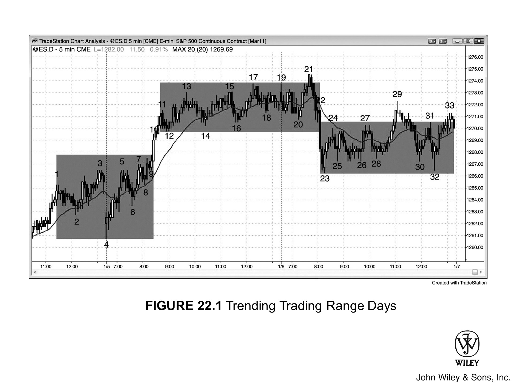
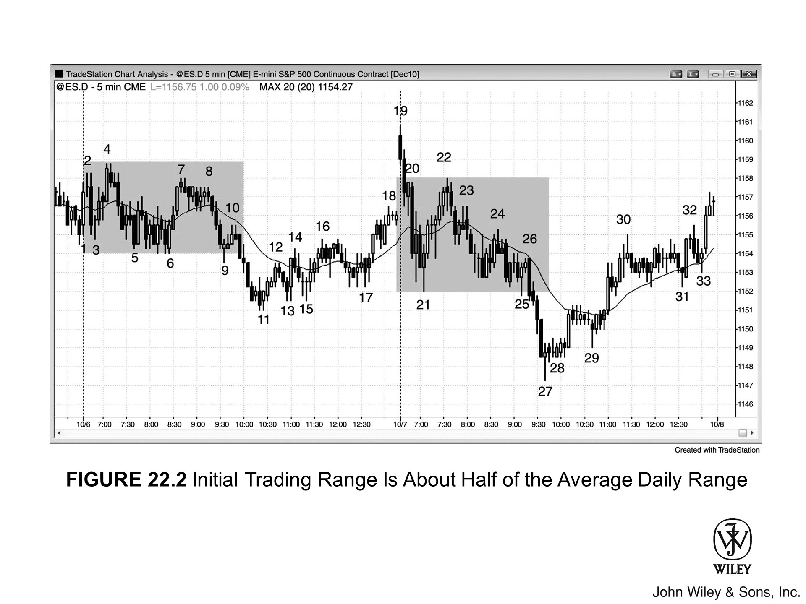
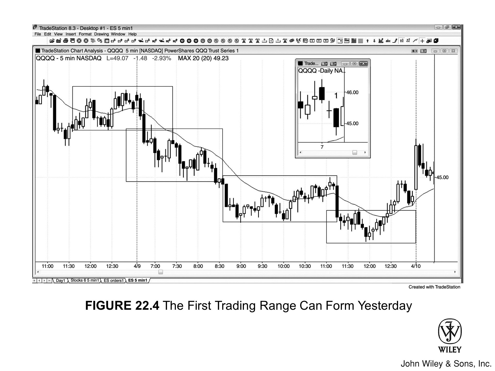
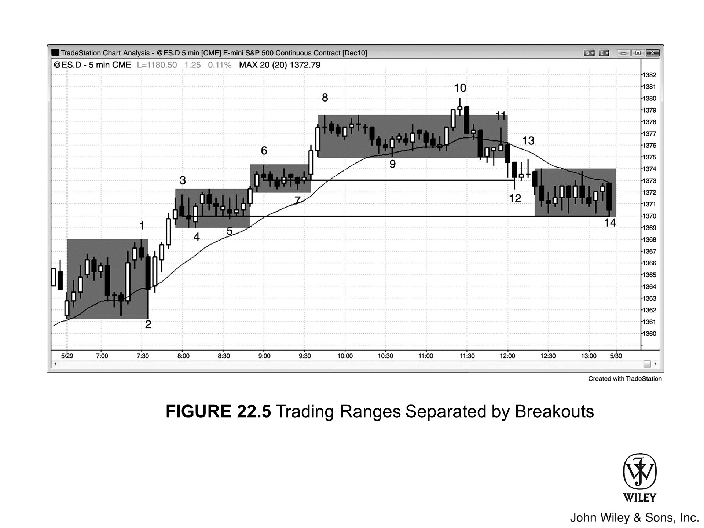
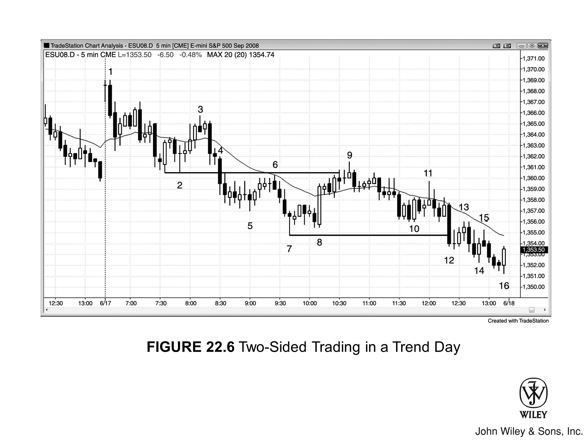
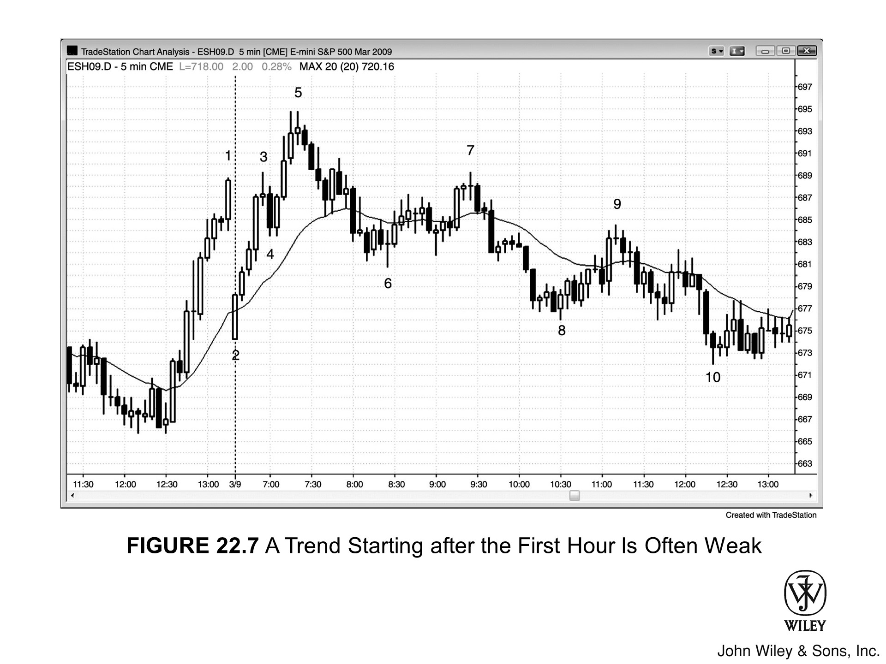
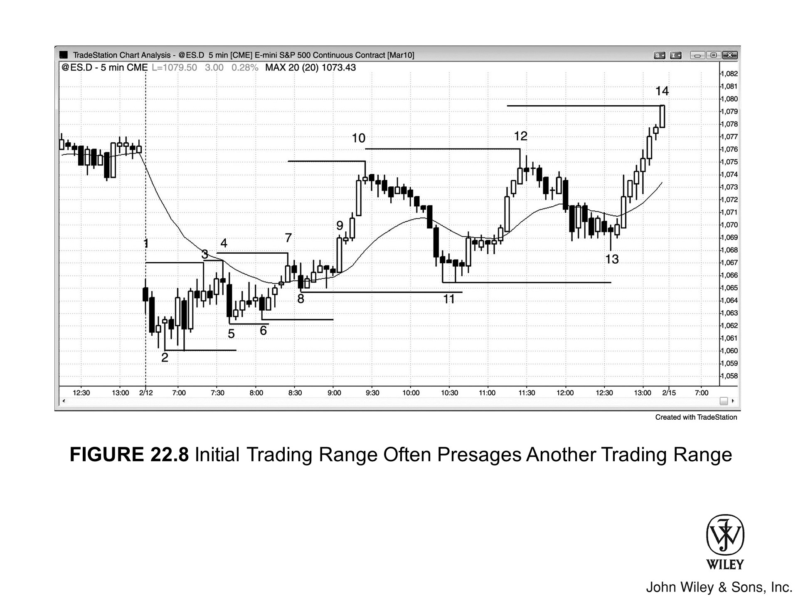
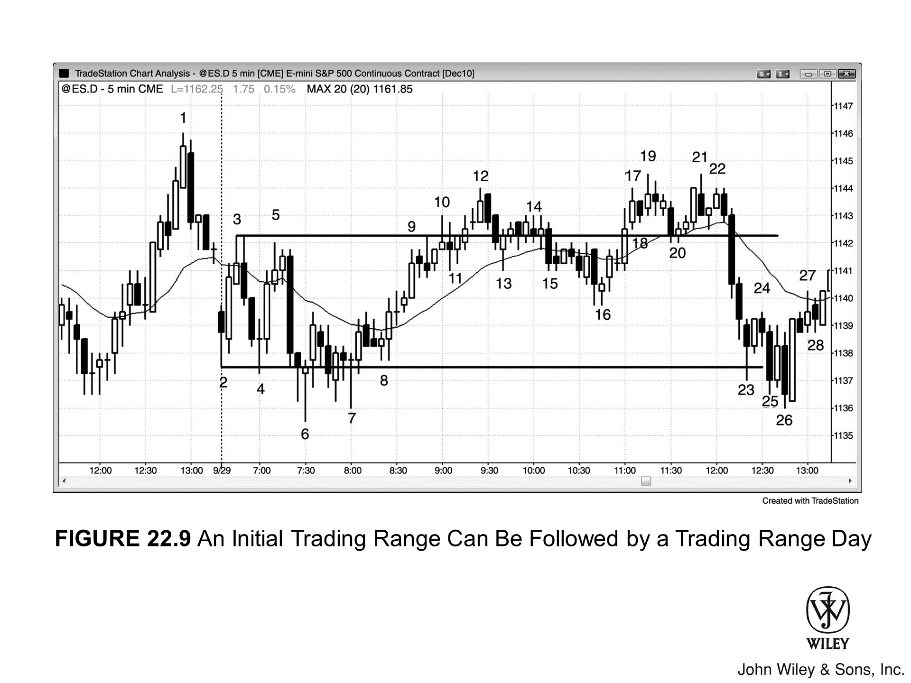
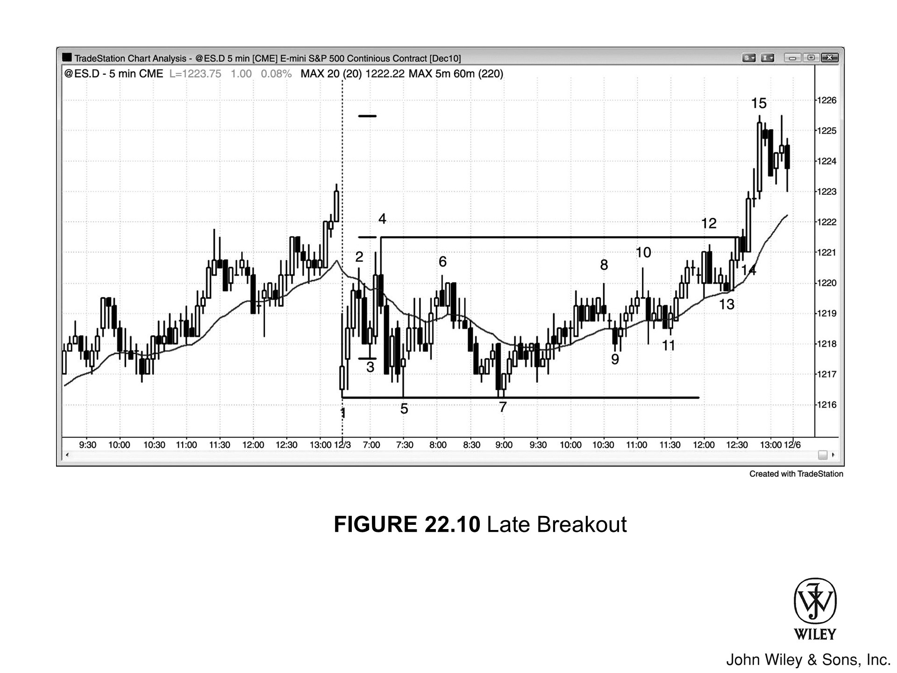

## 趋势性交易区间日的主要特征

- 开盘区间大约是近期日线区间的三分之一到一半。
- 经过一两个小时后出现突破，随后市场形成另一个**交易区间**。
- 由于存在交易区间，通常双向都有交易机会。
- 有时会出现多次突破和多个交易区间，但这种情况下，通常最好把当天当作更强的**趋势日**来对待，只做顺势交易。
- 第二个交易区间开始形成后，通常会有一次**回调**来测试前一个交易区间。
- 这次测试往往会重新打回到前一个区间内。如果价格接近但未能穿透前一个区间，说明**趋势**稍强一些。
- 有时价格会完全穿透前一个区间，当天演变成**反转日**。
- 大多数反转日一开始都是趋势性交易区间日。
- 突破力度越强，当天越可能演变成**弱急速与通道趋势**。

## 理解趋势性交易区间日

每一段趋势都有回调，回调本身就是小型交易区间，所以每个趋势日都包含某种形式的趋势性交易区间；趋势性交易区间每周至少有几天会成为主导形态。如果开盘区间大约是近期平均日线区间的三分之一到一半，就要留意**突破**的出现，以及日内区间大约翻倍的可能性。这类趋势日由两个（偶尔更多）交易区间构成，中间被短暂的突破隔开，有时乍看之下并不像交易区间。但在日线图上，当天明显是趋势日——开盘在K线一端附近，收盘在另一端附近。

当市场出现**趋势性波段**、但当天看起来又不像清晰的趋势日时，多半就是趋势性交易区间日。另外，如果前一两个小时的日内区间只有近期平均日线区间的三分之一到一半，就要留意突破的出现、大致等幅的**测量移动**，以及剩余时间内第二个交易区间的形成。这种趋势形态每周有几天都会以某种面貌出现，但通常更适合归类为其他类型的趋势，甚至是大型交易区间。

## 趋势性交易区间日与急速与通道趋势的区别

许多交易日既可以归为**急速与通道趋势**日，也可以归为趋势性交易区间日，取决于趋势的强度——趋势越强，当天越像急速与通道趋势日。区分两者的意义在于交易方式不同。

当天更偏向急速与通道趋势日时，说明是**强趋势**，交易员应该聚焦于**顺势交易**和**波段交易**，除非出现明确的转型迹象（切换到交易区间或反向趋势），否则不要做**逆势**交易。

当天更偏向趋势性交易区间日时，通常双向都可以交易，更多地找**剥头皮**机会。在行情演变过程中，有些线索可以帮助判断：突破之后更可能走出强趋势日（比如急速与通道趋势日，甚至小回调趋势日），还是趋势性交易区间日。

交易区间比强趋势更常见，趋势性交易区间日尤其如此——出现频率大约是急速与通道趋势日的2倍，尽管每天至少都有一段急速与通道式的波段走势。急速与通道趋势日中的**急速**阶段最可能在当天早段启动，通常从第一根K线就开始，或伴随大幅缺口向上或向下跳空。而且通常会大幅突破昨日K线，或从突破位置强势反转，比如大幅低开的当天，从第一根K线就展开急速拉升。

趋势性交易区间日中的急速段是从交易区间内突破出来的，但通常仍在前一天的区间之内。

## 开盘交易区间的特征

开盘交易区间通常持续一到三个小时，大小约为平均日线区间的一半。这种不紧迫的走势表明当天演变成强趋势日的可能性较低。开盘交易区间本身也有**磁吸效应**——任何交易区间都有这个特性——这会阻碍突破走得太远，使价格更容易回调并形成另一个交易区间。

**急速与通道趋势**日的突破通常幅度大、速度快。急速段可以连续出现三根甚至更多大型**多头趋势K线**，影线极短，K线之间几乎没有重叠。趋势性交易区间日的急速段通常只有一到三根K线，而且这些K线往往更小、影线更长、重叠更多。

如果急速段之后的回调只有一根K线，而从回调处突破后又出现一段急速（即便更小、只有一根K线），当天更可能是急速与通道趋势日。如果回调横盘走了5到10根K线，或者从回调处突破后形成的是K线重叠、夹杂反向趋势K线的弱通道，当天更可能是趋势性交易区间日。

如果急速段之后的回调足够强，让交易员对**Always-in 的方向**产生不确定，那么交易区间比趋势通道更可能出现，这时应该找剥头皮机会，而不是波段机会。

## 趋势性交易区间日的入场策略

大多数情况下，直接在交易区间突破时入场的胜率偏低。更好的做法通常是等待**突破回调**，或者在区间对侧的早期反转点入场。不过，如果交易员有充分把握判断当天正在演变成趋势性交易区间日，且突破力度较强，也可以考虑在突破K线形成过程中入场，在该K线收盘附近入场，或者等下一根K线收盘后再进——前提是这根K线同样强势。关于特殊情况的处理，会在第二册交易区间章节中专门讨论。

突破后的急速行情通常会衔接一段通道，但价格往往在**测量移动**目标区附近止步，随后市场开始构建新的交易区间。行情从一个区间突破，又在另一个区间内横盘。少数情况下，一天之内会出现三到四个小交易区间，但一旦出现这种情况，当天更应该按更强的趋势日来理解和操作，比如急速与通道趋势日或小回调趋势日。

交易员应把注意力集中在**顺势建仓形态**上，最好全程只做顺势方向。如果市场随后回调至前一个区间，往往会一路走到该区间的另一侧。这意味着突破之后，市场会在新区间内整理，形成**双向交易**，反复测试新区间的上下两侧，并随时可能向任意方向再次突破。

一旦市场到达测量移动目标区，大概率会过渡到第二个交易区间。此时交易员也应跟着切换——从趋势交易模式转入交易区间交易模式。举例来说，如果当天是多头趋势性交易区间日且趋势已开始走弱，交易员应在大约等于下方交易区间高度的测量移动目标区附近止盈，因为市场通常接下来会向下测试突破区域，并在那里形成新的交易区间。

## 趋势性交易区间日的风险管理

一旦判断市场处于趋势性交易区间状态，就不要再把**保护性止损**挂在**波段低点**下方，因为那个位置的止损通常会被触发。在市场形成上方区间、价格走强时主动止盈，远比等到价格下跌后被动出场更合理。记住：在交易区间里，要**低买高卖**。

激进的交易员会在测量移动目标区附近，对大幅度的趋势K线做**押注失败**（fade）操作。例如在多头趋势性交易区间日中，当市场接近测量移动目标时，空头会盯住大幅度的多头趋势K线。一旦这根K线出现，他们往往在其收盘价或略高于最高价处做空；如果市场继续上涨，则分批加仓空头。他们认为这根大幅多头趋势K线属于**衰竭**性的买入高潮，之后市场终将向下测试缺口区域——即从下方交易区间突破时形成的两到三根多头趋势K线区域——甚至可能回落到下方交易区间的顶部。

由于他们预期上方交易区间即将形成，便在急速拉升的顶部、也就是市场可能构筑上方区间顶部的位置做空，入场价格极具优势。这部分内容在第二册交易区间章节中有更详细的讨论。即便市场继续上涨，赔率也非常有利于价格最终回落至他们的入场价以下。如果他们在更高位置分批加仓，可以先将第一笔仓位平仓至盈亏平衡点，再把更高位置那笔仓位的止损移至盈亏平衡点，持仓等待市场向下测试缺口区域。

## 双向交易与反转

整个交易日都存在**双向交易**，因此收盘前一到两小时内，行情至少穿越一个交易区间发生反转是很常见的。每一个交易区间内都有双向交易，多空双方都把这一区域视为价值区间。这种共识形成了**磁力效应**，会将突破行情重新拉回区间内。

## 识别可靠的逆势交易机会

理解这类趋势日的意义在于：其中的反转是一种**可靠的逆势交易**，因为市场通常会形成**突破回测**。正因如此，当突破到达大约的测量移动目标区、趋势交易员开始止盈时，其他交易员会留意反向交易机会，目标是在突破回测时出场。

有经验的交易员会在测量移动目标区附近，对强势趋势K线做**押注失败**（fade）操作，押注回调会测试突破缺口。举例来说，当 Emini 的平均日振幅约为 10 点时，如果市场在某几个小时内形成交易区间后向上突破，强势空头会在下方区间上方约 4 到 6 点处开始分批加仓空头，目标是等待回调测试突破区域，甚至回到下方交易区间的顶部。

如果行情反转回前一个区间，大概率会测试该区间内**逆势信号K线**所在的位置。比如：空头趋势反转向上后，行情会尝试触及前期失败的多头信号K线高点。如果反弹延伸到交易区间上方甚至突破该区间，并且当天就收在那个高位，日线图上就会形成一根**反转日**——当天先跌后涨，最终收在日内高点附近。大多数反转日最初都表现为趋势性交易区间日（第三本书"反转日"章节有对应案例），所以交易者一旦识别出某天是趋势性交易区间日，就要随时准备好：尾盘可能出现一笔**反转波段交易**，而且这笔交易可能演变成覆盖全天振幅的大型日内趋势交易。

## 即将突破前的细微信号

趋势性交易区间日往往会给出**突破**将至的微妙暗示。如果你看到一个看似普通的交易区间日正在形成，但每个**波段高点**都比前一个稍高，每个**波段低点**也都比前一个高，那么市场可能已经悄然启动趋势运动，即便表面上还在区间里震荡。一旦足够多的参与者意识到这一点，行情就会向上突破，快速拉升至更高位置，然后再次进入双向博弈，构建另一个交易区间。

## 关于测量移动的假设

初始突破发生时，不要想当然地认为**测量移动**一定会走完，觉得行情必然会走出平均日振幅那么大的空间。大约三分之一的情况是：行情从一侧突破后只走了一点点，随即反转，从另一侧突破再走一点点，最终形成的只是一个平静的区间震荡日。

## 尾盘突破

有时候交易区间的高度大约只有近期平均日振幅的一半，而且在最后一小时之前一直保持狭窄。比如：Emini 进入最后一小时时，当天振幅只有 5 点，而近期平均日振幅是 12 点，过去 12 个月里只有两天的收盘振幅在 5 点或以下——这时就要做好尾盘突破的准备。

每一天在某个时刻都会有 5 点的振幅，哪怕只是开盘第一分钟。大多数趋势性交易区间日，如果初始振幅只有 5 点，通常会在前两三个小时内完成突破；但每年也有几次，全天都维持这样的窄幅，直到最后一两个小时才动。碰到这种情况，多数时候会有一次突破来扩大振幅，但通常不会一路冲到近期日均振幅的水平。

不要放弃这一天，不要以为它就是个 5 点振幅的平淡日——90% 的情况下，收盘前振幅会扩大，你往往可以在那一小段突破行情里做出利润。由于突破出现得很晚，时间往往不够让行情再形成像样的交易区间，但正因为这一天从早到晚都像是趋势性交易区间日，放在这里讨论是合适的。

## 图示与分析

### 图 22.1：趋势性交易区间日

趋势性交易区间日中，两个区间之间通常会夹着一根大号趋势K线。如图 22.1 所示，昨天收盘前数小时市场处于区间震荡（K线 1 至 K线 3），这个区间延续到了今天开盘后的头几个小时。K线 10 是一根大号**多头趋势K线**，突破了区间上轨，同时也突破了由 K线 5、K线 7、K线 9 构成的**楔形**顶部。紧随其后的那根同样是多头趋势K线，确认了这次突破（大幅提升了行情继续上行、走出某种测量移动的概率）。随后市场立刻进入窄幅区间，一直维持到当天收盘。

这个区间一直延续到第三天。任何交易区间都对行情有**磁吸效应**，这让大多数突破尝试以失败告终。K线 11 至 K线 19 之间的区间是这轮上涨中最后一个**多头旗形**，而向 K线 21 方向的突破失败了。随后市场以 K线 22 这根大号**空头趋势K线**向下突破了上方区间，跌势测试了前一天区间的顶部，并形成了另一个交易区间。K线 29 是下方区间顶部的一次失败突破，也是第三次上推，而下方区间的磁力强于上方区间。行情随即穿越整个下方区间，在 K线 32 处测试了区间底部，最终收在下方区间顶部附近。

从 K线 8 到 K线 13 的多头急速上冲幅度很大，但 K线 12 至 K线 17 的后续通道走势与之明显不成比例——太小了。K线 9 处下方区间顶部与 K线 12 处上方区间底部之间的突破缺口，相对于上方区间的高度来说相当大，这增加了行情回头测试缺口强度的概率。K线 23 至 K线 33 的区间大部分落在 K线 9 与 K线 12 之间的突破缺口内——这是很常见的走法。

K线 4 至 K线 9 构成的初始区间，高度大约是日均波幅的一半，交易员因此预期整体波幅会扩大约一倍。当交易区间的高度只有日均波幅一半时，最常见的扩展方式就是发生突破，进而演变为趋势性交易区间日。

第三天 K线 19 至 K线 21 的开盘区间大约只有日均波幅的三分之一，交易员预期会有突破。由于当时也预期市场会回测前一天的缺口，加上向上突破已经失败，向下突破的概率更高——随后向下的急速跌至 K线 23 印证了这一点。这段跌势力度强劲，市场本有可能演变为急速与通道空头趋势日，但 K线 23 测试了前一天交易区间提供的支撑（即 K线 3、K线 5、K线 7 的高点），同时也大致走出了一个测量移动的下跌距离，还测试了一条三日趋势线（图中未画出）。这说明此次下跌或许只是一个真空效应——强势多头与强势空头同步撤离，等市场跌到支撑区之后再集中买入。

K线 23、K线 25 和 K线 26 发出的多头急速反弹，K线 25 至 K线 26 之间形成的**双底牛旗**，以及 K线 28 的双顶回调，都显示出不断累积的买压，市场甚至在向 K线 29 的急速上冲中翻转为 **Always-in 多头**。这不是急速与通道空头趋势日里、急速之后的回调该有的表现，趋势性交易区间的概率因此进一步上升。如果这真要走成急速与通道空头趋势日，K线 23 急速之后的回调不会有这么强的买压——对照空头急速的力度就知道了。买压带来的不确定性，让市场走成交易区间的可能性更高，而不是短暂回调后拖入漫长的空头通道。不确定性是交易区间的标志，不是空头旗形（即将进入空头通道的回调）的标志。

急速与通道趋势日和趋势性交易区间日之间的分界并不总是清晰，有时也不重要。从 K线 12 开始形成的交易区间让这一天成为趋势性交易区间日，但该区间同时存在逐步抬高的低点和高点，本质上就是一个弱势多头通道。通道就是倾斜的交易区间，两者都是双向博弈的区域。倾斜越小，行为越接近交易区间，双向交易也越安全。

### 图 22.2：初始交易区间约为日均波幅的一半

如图 22.2 所示，两天的前几个小时波幅都大约是近期日均波幅的一半，这提醒交易员留意双向**突破**的可能性。当突破来得比较晚、开盘区间没有明确方向、且初始区间约为日均波幅一半时，突破后通常不会走出强劲的单边走势——比如**急速与通道趋势**。更常见的情形是：突破后出现回调，市场在低位形成另一个交易区间。低位区间可能重新突破回到上方区间，也可能再次向下突破，形成第三个甚至第四个交易区间。

低位交易区间比强势空头趋势更有可能出现，因此应以**双向**思维参与，市场通常会回到突破位附近。一旦突破向下延伸超过日均波幅的约三分之一，交易员就会开始寻机做多，目标是**波段**反弹回上方区间的底部。他们会在 K线 11 上方的第二次反弹尝试时买入，也会在 K线 28 上方买入；同样会在 K线 5 的**双底**和 K线 29 的 **HL** 处买入。

一旦市场重新突破进入上方区间并站稳，往往会向上测试上方区间的顶部，第二天就是这样走的。如果当天收盘在上方区间顶部附近或突破其上，这一天就变成了**反转日**。激进的多头会在 K线 27 之前那根大**空头趋势K线**收盘时买入，预期这是一次**衰竭**性抛售高潮，随后会向上测试上方交易区间的底部。部分交易员会在从上方交易区间高度计算的**测量移动**低点附近挂限价单买入——做法是量出 K线 22 顶部到 K线 21 或 K线 25 底部的点数，再从 K线 21 或 K线 25 的低点向下减去同等距离，然后在该价位附近分批建仓，可能从目标价上方一两个点开始，一直到目标价下方几个点。

也有交易员会在第一次出现双向交易迹象时买入，比如 K线 27 收盘时，或者 K线 27 从低点开始反转时。假设日均波幅约为 10 点，部分多头会在 K线 25 上方区间底部下方 4 到 6 个点处分批买入，目标是在回调进入突破缺口时（即 K线 25 下方的空头趋势K线区域）赚取 3 到 6 个点。

从第19根K线到第21根K线的抛售虽然急促，但随后涨到第22根K线的反弹同样凌厉。正因双方势头相当，开盘区间的方向高度不确定，急速与通道趋势日的概率下降，趋势性交易区间日的概率上升。

### 图 22.3：趋势性交易区间构成一段趋势

有些交易日，大部分时间都在交易区间内震荡，但整体仍然是趋势日。图 22.3 就是这样一天——从日线缩略图（今天是第1根K线）来看，这确实是一个趋势日，由一系列趋势性小交易区间构成，表面上并不像典型的趋势日。这类交易日往往在尾盘最后两小时左右反转，至少回撤最后一段交易区间。

#### 图 22.3 深度解析

有些交易日会有一个小时甚至更长时间没有可靠的建仓形态。图 22.3 中，今日开盘在一条走平的**均线**附近，价格处于昨日最后一根K线的区间内——昨日收盘段本已处于小交易区间，今日开盘头两根K线延续了这种震荡。这两根K线相对于交易区间的高度来说偏大，作为信号K线风险较高。虽然在第二根K线下方做空在技术上可行——因为这是一个**两K线反转**空头建仓形态，同时也是均线下方的**楔形熊旗**——但入场点接近交易区间低点，位置欠佳。更稳妥的做法是等突破后再找突破回调入场。几根K线后确实出现了回调，但当时处于一个窄小的交易区间内，K线影线很长，交易可靠性不高。

更好的入场机会在上午8:00（太平洋时间）的**两K线反转**之后，价格回调到均线附近，形成**低 2 做空**信号。

11:45 出现了**均线缺口K线做空**机会，随后对空头低点的测试以 **HL** 的形式呈现，也可以将其视为**双底牛旗**。

当天是趋势性交易区间日。当价格开始在 185 美元附近企稳，交易员可以在这个区域做多，目标是测试上方交易区间的底部（约 186 美元上方）。市场出现两段式下跌直至 185 美元，第二腿的跌幅近似于一次**测量移动**。上午交易区间的中部约在当日高点下方 2 美元处，而10:15的大型**两K线反转**又在其下方约 2 美元处，因此交易员开始入场做多。空头在回补空单，多头也在买入，等待测试上方交易区间的底部。随后市场进入窄交易区间，出现三小波下推，最终在11:05以一根大型**空头趋势K线**结束。紧接着，11:30出现 **HL**，信号K线带有多头实体。这个 HL 同时也是**高 2**，因为它前一根和前两根K线都是空头实体。这属于非常微观的分析，大多数交易员实时操作时不会依赖这种信号，但有经验的交易员始终在寻找市场可能转向的迹象，这些细微线索能帮助他们建立足够的信心入场做多。

如果在11:30低点上方买入，可以把**保护性止损**设在低点下方约50美分处，目标是向上约1美元测试上方交易区间。

虽然等距移动的方向概率无法精确判断，但只要你感到存在失衡，就应该假设概率至少达到60%。在这里，合理的估计是：如果你在约 185 美元买入，并在入场点等距下方设置**保护性止损**，测试 186 美元的概率至少有 60%——也就是说，赚到 1 美元的概率大于亏掉 1 美元（约 60%）。在11:40多头急速上涨后的**十字星内包K线**处，可以先部分止盈；若突破失败则在**盈亏平衡点**出清剩余仓位。12:25市场**双底**确认后，可以再次尝试相同的做多操作，这次会成功。从双底起算，理论上存在 2 美元的测量移动空间，但当天剩余时间有限，实现的概率不大。

### 图 22.4：第一个交易区间可能形成于前一日

图 22.4 也是一个趋势性交易区间日，第一个交易区间从前一日就已开始形成。日线缩略图显示这是一个**空头趋势**日（第1根K线）。

最后一个交易区间向上反转，市场测试了其上方较高交易区间的顶部附近。这种情况很常见——双向博弈意味着趋势力度不如其他趋势日那么强，力度较弱的趋势日收盘于当日低点的概率较低。交易员清楚这一点，因此会在临近收盘时寻找**反转**交易机会。

#### 图 22.4 深度解析

图 22.4 中，今日开盘同样基本持平，价格接近走平的**均线**。三根K线构成的**空头急速**大幅提升了**空头趋势**日的概率。这段急速突破了昨日最后一小时形成的交易区间下沿。昨日那个交易区间本身是一段**两腿上涨**，即一个**熊旗**，因此本次向下突破也可以理解为跌破了熊旗底部的**多头趋势线**。

交易员可以在第一次回调低点下方做空，也可以在均线测试处再次做空——那里同时也是**两段式回调**到均线的横向位置，构成一个近似的**双顶熊旗**建仓形态。

### 图 22.5：被突破隔开的多个交易区间

如图 22.5，第一个小时走出了一个 7 点的区间，但近期日均波幅约为 20 点，因此交易员预计区间大概率会扩大一倍左右。如果趋势在开盘一小时后才形成，当天往往会演变成趋势性交易区间日——部分原因是第一个小时本身就是一个交易区间，从定义上就已经决定了格局。收盘前市场经常会回落到早先的一个或多个低位交易区间内，本图就是如此。

#### 图 22.5 深入讨论

当天行情如图 22.5 所示，形成了多个趋势性交易区间，交易员应专注于**顺势交易**。做多机会只在 K线2 的**两K线反转**到 K线9 的**EMA 20 缺口K线高 2**之间寻找；做空机会只在 K线10 的**最终旗形反转**建仓形态处考虑。

K线10 之前出现了一根**多头趋势K线**，许多多头会在这根K线的收盘价附近或高点以上止盈，激进空头则会在此做空。市场从 K线3 急速上涨，随后走出通道或一系列小型交易区间，其中从 K线8 开始的那段区间相对窄且水平——这是强烈的**双边交易**区域，对市场有磁吸效应，突破后往往会被拉回。日内收盘前市场也经常会回测前一个交易区间，加上美国太平洋时间上午 11:30 是常见的反转时点，突破失败与最终旗形反转的概率相当高。

回调最远可能测试到**多头通道**起点 K线4，因此空头乐意在大阳线突破**波段高点**兼潜在**最终旗形**高点处做空。许多空头会分批向上加仓，认为市场有 70% 或更高的概率在收盘前至少回测到他们第一笔空单的入场价，这样就能把初始空单平到**盈亏平衡点**，再决定是在更高位止盈离场，还是把**保护性止损**移至**盈亏平衡点**后继续持仓等待下跌。

K线2 是**两K线反转**的第一根K线，从可能的**低 2** 失败（即**双重或三重底**）处向上反转，标志着**多头趋势**的起点。交易员意识到市场随时可能突破拉升。突破后，市场从 K线4 到 K线6 形成了一个更高的区间，内含两段窄小的交易区间。K线5 上方的**高 2 做多**是一个合理的**突破回调**入场机会，尽管有铁丝网形态的干扰。这次突破同时源自两个层面：K线3 到 K线4 的小型**牛旗**，以及 K线3 到 K线5 的整个交易区间——后者是突破 K线1 之后的**两段式横向回调**。

市场随后突破进入第三个区间（K线8 到 K线9）。再次突破后，K线10 处出现失败（**最终旗形反转**），回调穿越第三区间底部，最终跌至第二区间底部。**空头急速**之后，K线11 下方出现**突破回调做空**机会，但铁丝网形态增加了风险。在两根空头K线构成的急速段于 K线12 结束后，K线13 下方出现第二个**突破回调做空**机会。

*区间*一词本身就暗示市场在某个时点会测试区间低点，尽管也可能继续上行。当市场回撤一段强势行情时，第一目标始终是之前的逆势入场点。在本例中，市场突破顶部区间后，最近的空头入场点是最近一根**空头信号K线**（K线6）的低点。突破顶部区间后向下冲入下一个较低的区间，K线13 跌破了那根**空头信号K线**的低点。

收盘时，市场已测试到第二区间中 K线3 最低**空头信号K线**的低点。

### 图 22.6：趋势日中的双边交易

如图 22.6，当天开于最高点、收于最低点，理论上是**始于开盘的空头趋势**日，但前两小时横盘太多，实际走势并不像典型的始于开盘趋势日。始于开盘趋势日通常不会有多少显著的可交易**逆势波段**，而趋势性交易区间日则不同——它是趋势日中较弱、较难预判的一种形式。初始交易区间在 K线4 处向下突破，进入更低的区间，从而形成趋势性交易区间日。

K线3 之前，当天波幅仅约为近期日均波幅的一半，因此交易员已经意识到可能形成更低的交易区间。

K线6 是回调至均线的**突破回调**，同时也是对上方区间底部 K线2 的**突破回测**，提供了一个合理的做空入场机会。

K线9 是对上方区间的**突破回测**，也是这个较低区间顶部突破失败的信号，再次给出做空机会。

K线12 向下突破进入第三个区间，但此时距收盘时间不多，已不足以让市场回测到 K线13 的区间顶部。

#### 图22.6 深度解析

图22.6中，昨日收盘价跌破**均线**，今日跳空高开，开盘价高于昨日收盘价和均线，形成一根**多头突破**。当日第一根K线是**十字星**，做空信号的可靠性较低。K线1是一根强势**空头趋势K线**，在其低点下方1 tick做空是合理的建仓形态，目标是测试**均线**乃至昨日收盘价。由于大缺口开盘往往引发趋势行情，而这根空头K线体现出空头的急迫性，今日有可能发展成**空头趋势日**——交易员应尽早做空，对部分仓位做波段操作，持仓直到出现强力**多头反转**信号或收盘为止。

形成**两K线空头急速**之后，交易员预期会出现**空头通道**，开始在回调时做空。第一次回调做空机会是**低2**，由7:00 a.m. PST之后不久的**外包阴线**触发；第二次做空机会在K线3**空头反转K线**低点下方。这是一个**对决线做空**建仓形态，与前一次回调构成**双顶**，同时也形成**楔形熊旗**（第一次向上推进出现在K线2前面的两根K线）。

K线14是**多头反转K线**，但与前两根K线重叠过多，可靠性不足。加上K线12空头急速之后的通道相对紧密，在空头趋势中做多，最好等待突破回调形成更高低点后再入场。这本身就是一个偏弱的做多建仓形态，一旦失败，反而可能成为不错的做空机会。K线15是一个**失败的高2**——在空头趋势中，**均线**附近带**空头反转K线**的**低2**是概率极高的做空建仓形态，因为在**高1**和**高2**趋势反转尝试中做多的交易员，通常会在低2时止损出场。市场连续两次尝试扭转当日新低，第二次在K线15多头入场后的下一根K线宣告失败。市场两次尝试做同一件事都失败时，往往随后就会朝反方向运动。

### 图22.7：第一个小时之后才启动的趋势通常偏弱

只要市场在第一个小时之后才开始形成趋势，就应该默认这一天会演变成**趋势性交易区间**日，或者表现得像这类交易日——双向寻找剥头皮机会。图22.7中，虽然开盘后出现了**多头趋势**，但在K线5形成**急速与高潮**后反转向下，演变为趋势性交易区间式的空头趋势。这也可以理解为一轮**急速与通道空头趋势**：K线5到K线6的下跌构成**空头急速**，随后K线7到K线8的下跌，以及三根K线向下突破至K线10，都可视为额外的急速段。向下的通道足够宽，两次突破后的回调均与前一个波段低点重叠，因此这同时也是一个**空头楼梯形态**。

#### 图22.7 深度解析

图22.7中，市场低开后在更高位置止跌，可能形成始于开盘的**多头趋势**。这既是对均线的测试，也是对前一日尾盘强势急速拉升所形成的**多头通道**向下突破的失败测试。

两段式上涨在K线5形成**最终旗形做空**建仓形态。随后出现四根K线的**空头急速**，并延伸成更大的急速段，至K线6结束。这波下跌跌破了开盘以来的**多头趋势线**，因此后续形成的**更低高点**有可能引发向下的趋势反转。

两段式**更低高点**在K线7形成，提示交易员行情可能继续向下。K线7是**对决线形态**：它与下行至K线6的**楔形空头通道**顶部构成**双顶**（该通道起始于四根K线空头急速跌破K线5之后形成的小型更低高点），同时也是一个**楔形熊旗**（第一次向上推进结束于K线6前一根K线，K线7是第三次向上推进）。

此后市场在当日剩余时段都表现为趋势性交易区间式的空头趋势。K线1和K线5的强势**多头动能**分别构成向上的急速，后续一两天内有可能跟随**多头通道**。K线6、8、10共同形成了一个大型**楔形牛旗**，测试K线5高点的行情有可能发生。K线4也可以视为该**空头通道**的一部分。实际上，次日（图中未显示）跳空高开至K线7高点附近，并发展成强势的**始于开盘的趋势**多头日。

### 图 22.8：初始交易区间往往预示着另一个交易区间的形成

图 22.8 中，前几个小时的波动幅度大约是平均日波幅的一半，这提醒交易员注意可能出现**突破**，进而形成更高或更低的**交易区间**，最终演变成**趋势性交易区间**日。在 K 线 9 发生**突破**之前，**多头趋势**就已经相当明显。注意观察：K 线 5 的**波段低点**高于 K 线 2 的低点，K 线 6 的低点高于 K 线 5 的低点，K 线 8 的低点高于 K 线 6 的低点。K 线 3、4、7 的**波段高点**也呈现同样的走势。虽然市场在头两个半小时处于**交易区间**震荡，但**波段高点**和**波段低点**都在持续上移，说明**交易区间**内部已经存在**多头趋势**。这提醒交易员密切关注**突破**，而突破最终在 K 线 9 出现。这个更高的**交易区间**一直维持到 K 线 13 反转向上引发**突破**为止。K 线 11 和 K 线 13 都是**突破回测**。K 线 11 的**双底**下探进入了较低的**交易区间**，而 K 线 13 的低点则精确地测试了较低**交易区间**的顶部（即 K 线 7 的高点）。回调无法跌破**突破**点，这是多头强势的体现。

#### 图 22.8 深度解析

图 22.8 中，市场开盘就跌破了昨日收盘价，第 1 根 K 线收出阴线实体，这让市场有可能演变成**始于开盘的空头趋势**日。不过，K 线 1 的上下都有影线，这提高了形成初始**交易区间**的概率，交易员应当先观望。K 线 2 形成了**微型双底**，但两根 K 线都是**十字星**，因此算不上强趋势的**建仓形态**。即便是 K 线 4 在均线附近形成的**楔形熊旗**，建仓信号也偏弱，因为它属于 6 根 K 线组成的窄**交易区间**的一部分，且每根 K 线都带有影线。影线代表不确定性，而不确定性正是**交易区间**的典型特征。交易员本可以在 K 线 5 之后那根**多头内包K线**的上方买入，但在 K 线 4 那个**楔形熊旗**出现之后，市场理应再出现一次向下的二次测试。这次测试发生在 K 线 6，与 K 线 5 共同构成**双底**，也为当日低点（K 线 2 及其后三根 K 线）处的双底形成了**双底回调**建仓形态。更稳妥的做法是等到多头进一步表现出强势信号后再买入，比如 K 线 7 之前出现的**四根 K 线的多头急速**。不过，K 线 2 之后出现了几根强劲的**多头趋势K线**，这已经足以说明多头强势，可以开始在**回调**时建立多头仓位。大型**多头趋势K线**是买压的体现，而买压是可以积累的。一旦买盘达到临界规模，多头就会掌控市场，行情随之上涨。

多头急速上冲至 K 线 7 之后，K 线 8 之后那根**多头内包K线**的上方出现了**突破回调买入**建仓形态，这同时也是一个失败的**低 2 做空信号**。之后出现了**高 2 做多**建仓形态，最终引发了 K 线 9 的强劲**多头突破**。

### 图 22.9：初始交易区间后市场可能仍是交易区间日

前几个小时的波幅约为平均日波幅的一半，并不意味着市场一定会**突破**进入**趋势性交易区间**日。大约三分之一的情况下，市场会同时突破当日高低点，波幅随之扩大，图 22.9 就是这种情况。市场在 K 线 4 和 K 线 6 的当日新低处反转向上，在 K 线 3、10、12、19、21 的当日新高处反转向下。开盘区间大致在 K 线 5 反转向下时结束，此时当日波幅约为近期日均波幅的一半。这提醒交易员注意向上或向下**突破**的可能，随后的**测量移动**可能使当日波幅大致翻倍。但是，直接在**交易区间**突破时入场是亏损策略，因为市场始终存在**惯性**，大多数从**交易区间**转换为趋势、或从趋势转换为**交易区间**的尝试都会失败。

K 线 6 突破当日新低之后，并没有出现像样的做空机会。实际上，三次下推（K 线 2、4、6）之后 K 线 7 形成的**更高低点**（HL），以及 K 线 8 的**突破回调**，都是测试当日高点的合理买入信号。

K 线 10 突破当日新高后反转向下，但市场处于窄幅**多头通道**中，因此这不是好的做空**建仓形态**。向上的动能并不算特别强，所以 K 线 11 的**突破回调**买入最多只能做**剥头皮**交易。K 线 12 出现了**两K线反转**，市场再次转头向下。在**交易区间**日，**二次入场反转**通常能可靠地做出至少**剥头皮**级别的行情。

市场在 K 线 16 的**楔形牛旗**之后冲上当日新高，但在 K 线 19 和 K 线 21 再度失败。一旦确认向上的**突破**无法持续，市场就会再次尝试从另一端**突破**。**交易区间**日常见的规律是，收盘往往回到区间中部。

当开盘区间的顶底有多种划定方式时，选哪个通常并不重要，因为市场本身也没有达成共识。寻找**止盈**的**测量移动**目标位时，先用最小的开盘区间来计算，比如 K 线 2 到 K 线 3。如果市场在该区域没有停顿，再看更大一级的区间，比如 K 线 3 到 K 线 4，或 K 线 3 到 K 线 6。由于今天最终收成**交易区间**日而非**趋势性交易区间**日，那些明显的**测量移动**目标位没有被触及。但每一次反转背后都有基于某种测量的电脑算法在运作，几乎总有某种形式的**测量移动**在其中，即便表面上看不出来。

### 图 22.10：尾盘突破

有时初始**交易区间**的幅度约为平均日波幅的一半，但**突破**直到最后一小时才出现。在图 22.10 中，尽管剩余时间不多、难以形成完整的上方区间，但全天都在酝酿向**趋势性交易区间**日演变的**建仓形态**。突破前的区间仅有 5.25 点，过去 11 个月里只有两天的收盘波幅在 5.25 点或以下。这意味着今年其他曾在日内出现过 5.25 点区间的交易日，最终收盘前都扩大了波幅——因此今天也很可能在尾盘出现向上或向下的**突破**。由于市场在 K 线 7 的**三重底**和三角形之后一直处于上升趋势，且 K 线 9 到 K 线 12 之间收阳的 K 线数量较多，买压持续存在，向上**突破**的概率较高。交易员会在 K 线 14 **突破** K 线 4 当日高点时买入，并在 K 线 14 那根强**突破K线**收盘时再次买入，以及在其高点之上再度入场。

从 K 线 3 到 K 线 4 的初始**空头急速**产生了一个**测量移动**目标，指向当日高点。交易员永远不知道多头会在哪个**测量移动**目标位**止盈**，但提前知道各种可能的目标位，就能趁市场快速上涨时及时**止盈**，而不是等到随后的回落才以更低价格离场。市场也可能在基于 K 线 1 低点到 K 线 2 高点、或 K 线 5 低点到 K 线 4、6、10、12 高点的**测量移动**目标位见顶。
