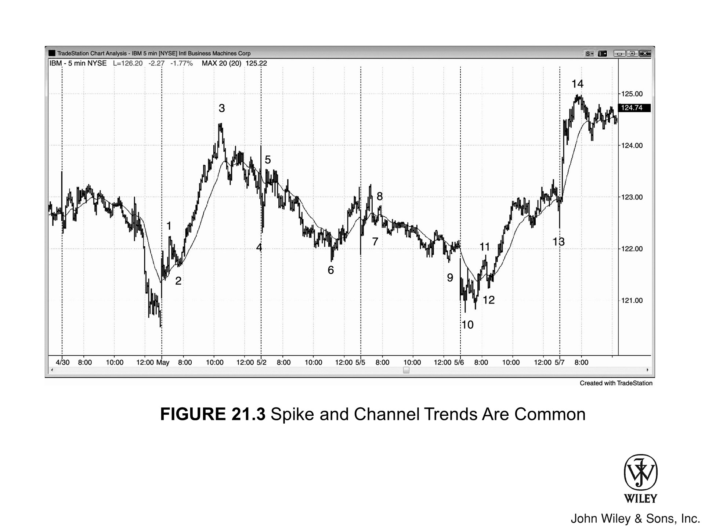
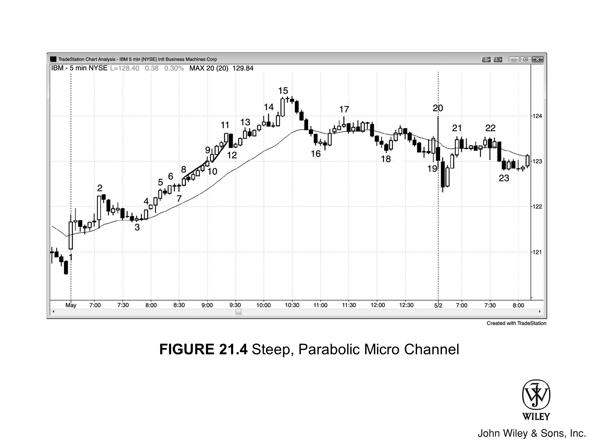
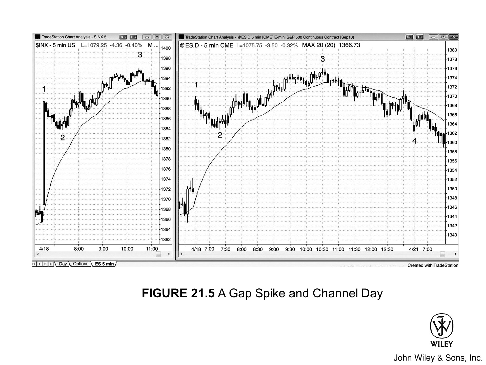

急速与通道趋势日的主要特征如下：

*   **急速启动**：行情始于一段“急速”，由一根或多根趋势 K 线组成，标志着市场进入明确的 Always-in 状态。急速阶段伴随着强烈的紧迫感，交易者急于进场，顺势加仓。此急速本质上即为突破缺口（详见第二卷）。

*   **形成时间**：急速通常形成于开盘首小时内，甚至往往就在当日最初几根 K 线中。

*   **突破强度**：突破越强劲，后续演化为通道的概率越高，且通道延伸的距离也往往越远（参见第 19 章关于趋势强度的部分，以及第二卷第 2 章关于突破强度的部分）。

*   **测量移动**：强劲突破往往构成“测量移动”的基准，通道常于测量目标位终结，交易者可在此处部分或全部获利了结。

*   **随后回调**：急速之后紧随回调，其持续时间短则一根 K 线，长则二十余根。

*   **通道延续**：随后趋势以通道形式延续。通道阶段因存在双向交易，市场充斥着焦虑与不确定感。

*   **操作策略**：市场处于通道时，操作上宜将其视为“趋势型交易区间”。例如，在多头通道中，宜在前一根 K 线低点下方买入，并保留部分仓位做波段；若要尝试做空，则应在波段高点或前一根 K 线高点上方卖出，且主要以剥头皮为主。

*   **顺势突破**：通道罕见顺势突破；即便发生，通常也会在 5 根 K 线内失败，随后市场反转。

*   **终结方式**：通道通常在某个测量移动目标位终结，且往往止步于第三次推升。

*   **反向突破**：若通道向反趋势方向突破（此为最终常态），切勿在突破时追单，而应等待回调。例如，在多头急速转通道形态中，若市场向下突破通道，应寻找机会做空“更低的高点”。

- 市场通常会回调至通道起点，以此测试缺口（急速与所有急速一样，本质即缺口）。
- 随后，市场会顺势反转至少 25%，试图构筑交易区间。

在多头急速转通道形态中：

1.  这波回调常与通道底部构成双底牛旗——所谓的通道底部，即紧随急速上涨之后那次回调的低点。
2.  若走势更弱，当日大概率会演变成趋势型交易区间日（下一章将详述）。

### 急速转通道形态

急速转通道形态是最常见的趋势类型，几乎每一天、每一段趋势中，它都以某种形式存在。其变体无穷无尽，且往往是大形态中嵌套着许多小形态。正因为它主宰着大部分的价格行为，交易者必须透彻理解这一形态。

这种形态由两部分构成。每一段趋势都包含 **急速阶段** 和 **通道阶段**，且任何趋势在任何时刻，都处于这两种模式之一，非此即彼。

#### 一、 急速阶段
首先是急速阶段，由一根或多根 K 线组成，市场运动迅猛。
*   **市场氛围**：此时场内弥漫着一种紧迫感，所有人都确信行情远未结束。
*   **本质特征**：急速本质上就是一个突破缺口，价格在此期间迅速从一个台阶跃升至另一个台阶。

#### 二、 回调与过渡
紧接着是回调。它短则一根 K 线，长则数十根，甚至可能回撤至急速起点之下。
*   **示例**：在多头急速中，回调偶尔会跌破急速的底部，但这之后，通道便开始了。

#### 三、 通道阶段
回调落定，趋势演变为通道。此时紧迫感消退，取而代之的是忧虑与迷茫。
*   **担忧之墙**：这就是你常听电视评论员提到的“担忧之墙”。每个人都看得到多空双方在进行双向交易，趋势看起来总是摇摇欲坠、即将终结，但它却顽强地不断延伸。
*   **交易心理**：交易者急于落袋为安，但眼看趋势不止，又不得不返身入场或加仓——因为他们不确定终点在哪，而谁也不想踏空。

---

**特殊情况：第二波急速**

极少数情况下，会出现第二波急速，继而形成新的通道；但通常，这第二波急速会演变成失败的突破，随之而来的是回调。

*   **示例**：先是一个多头急速，接着是动能减弱的多头通道，市场可能会再次爆发多头急速，向上突破通道顶部。

急速之后，接续另一个多头通道的情况并不多见。更常见的情形是，急速演变为“失败的突破”，随后市场向下回调。

当市场连续出现一系列 K 线，价格大幅推进且几乎没有回调时，这种强劲的趋势便称为“急速”。

*   **形态表现**：急速既可以是一根趋势 K 线，也可以是一组重叠极少的趋势 K 线，有时甚至表现为极窄的通道。
*   **周期关系**：事实上，本周期的急速，往往是小周期上陡峭的窄通道；反之亦然，陡峭的窄通道到了大周期上，往往就构成了急速。
*   **持续规模**：急速的规模不一，短至一根中等幅度的趋势 K 线，长则可持续 10 根 K 线乃至更多。
*   **本质定义**：急速、高潮和突破本质上是同一回事，关于这一点，第二本书的“突破”章节会有详述。

急速通常终结于第一次停顿或回调。但若趋势在一两根 K 线内恢复，这便构成了第二波急速，或者可视作大周期上的一波急速。

在向上急速中，市场共识是：当前价格对空头毫无价值。因此：

1.  价格必须继续上涨，直到找到多空双方都愿意交易的位置。
2.  市场将持续快速冲高，直到多头开始获利了结且买入意愿减弱，同时空头开始进场做空。
3.  这会导致停顿或回调，标志着显著的双向交易首次出现。
4.  向下急速的逻辑与此相反。

几乎所有趋势都始于急速。哪怕这急速只是一根趋势 K 线，且往往要等到许多根 K 线之后，人们才意识到那是趋势的起点。因此，几乎所有的趋势都是“急速转通道形态”的变体。

不过，如果趋势特征更偏向于本章讨论的其他类型，你就应该按那种类型去交易，这样胜算最大。

顾名思义，**急速**（Spike）止步于第一根停顿 K 线或**回调**（Pullback）之前，因为正是这停顿宣告了**急速**的终结。随后，市场面临三种显而易见的去向：**趋势**（Trend）延续、转入**交易区间**（Trading Range），或是发生反转。

### 1. 第一种情形：趋势延续（最为常见）

市场**回调**两三根 K 线，甚至十几根，随后**趋势**恢复。

*   **性质界定**：这段**回调**既是对**缺口**（Gap）的测试（切记，**急速**本身即**缺口**），也是**通道**（Channel）的开端。
*   **形态特征**：**趋势**一旦恢复，力度通常减弱：K 线重叠增多，斜率趋缓，**回调**频现，且夹杂反向**趋势 K 线**（Trend Bars）。
*   **最终演化**：这便是**通道**，整个形态也就演化为“**急速转通道形态**”（Spike and Channel trend）。

### 2. 第二种情形：转入交易区间（回调超过 10 根 K 线）

此时，它已演变为**交易区间**，可能向任意方向**突破**（Breakout）。总体而言，概率总是倾向于**交易区间**的**突破**方向与原**趋势**一致。

*   **更高周期的旗形**
    若**交易区间**旷日持久，它往往只是更高时间周期图表上的旗形（例如，5 分钟图上一段紧随多头**急速**、长达三天的**交易区间**，通常不过是 60 分钟图上的多头旗形，概率依然支持向上**突破**）。这属于**趋势**恢复的情境，本章稍后详述。

*   **突破的成败与反转**
    尽管**趋势**通常会在收盘前恢复，使当日定性为“趋势恢复型趋势日”，但**交易区间**的**突破**有时会失败，或在寥寥几根 K 线内反转（关于**最终旗形**（Final Flag）的反转，留待第 3 册反转章节讨论）。

*   **窄幅交易区间**
    极少数情况下，**交易区间**持续数小时甚至数天，且波幅极窄——这便是窄幅**交易区间**，将在第 2 册关于**交易区间**的内容中探讨。与任何**交易区间**无异，其**突破**方向未定，但顺势**突破**的可能性略胜一筹。

第三种可能是市场反转。只要急速后的回调不够强，没能把 Always-in 的方向彻底扭转，趋势大概率还会延续，而且几乎总是以通道的形式延续。

偶尔，市场会反转并反向打出一个急速。这时，多空双方都要争夺后续的跟进（follow-through），市场往往会因此陷入交易区间：

*   **多头不停买**，想在多头急速后走出多头通道；
*   **空头不停卖**，想在空头急速后走出空头通道。

虽然震荡有时会持续到收盘，但通常总有一方会胜出并实现突破。此时：

1.  **要么走出通道**，全天定性为“急速转通道趋势日”；
2.  **要么突破后很快又进入新的交易区间**，变成“趋势型交易区间日”（这部分下一章细说）。

除了靠反向急速来反转，急速后如果接的是交易区间，市场也可能反转。比如，多头急速后进入交易区间，大约三分之一的情况是向下突破区间底部，而非向上突破。

这种突破可能是：

*   一根猛烈的大空头急速；
*   但更多时候，只是一根平平无奇的空头趋势 K 线，随后便走出了空头通道。

一旦市场形成通道，**顺势而为方为上策**。虽说随着通道延伸，偶尔会有大幅摆动，给出逆势剥头皮的机会，但心里要有数：
*   通道的寿命往往长得超乎想象；
*   而且总是一副即将反转的假象。

沿途回调不断，专门诱人站错队。你会看到以下现象：
*   大量带影线的 K 线；
*   反向的趋势 K 线；
*   以及密密麻麻的 K 线重叠。

**千万别被迷惑，趋势依然健在。** 这时候要是急着做逆势，代价会非常惨重。

***

有些日子，开盘就是一波强劲的动能爆发（急速），随后趋势放缓，变成坡度较平的通道一直走到收盘。不过，通道的演变形式多种多样：
*   **加速形态**：有时会突然加速，不再走直线，而是拉出一道抛物线；
*   **衰竭形态**：也有时候动能衰竭，走势变得愈发平缓。

无论怎么走，通道的起点通常会在当天晚些时候，或者随后一两天内迎来回测。测完之后，市场可能转为交易区间，也可能向任意方向突破形成新趋势。

**关键要明白一点：**

1.  **如果是窄通道，那就只能顺势做。** 因为这种行情下，回调太浅，逆势交易根本没油水可捞。
2.  除非遇到极少数的大幅宽幅摆动，才值得双向交易。

一旦通道被逆势突破，就要准备寻找反向进场的机会。因为这波逆势行情极大概率会一路回测通道起点，并试图在此构筑交易区间。

*   **切记**，通道再陡，本质上也是反向旗形。多头通道即熊旗，空头通道即牛旗。
*   **此外**，通道虽是倾斜的交易区间，却也是更大级别交易区间的第一条腿。一旦反转，价格通常会回到通道起点附近。

试举一例：

1.  先是一波向上 **急速（Spike）**，接着回调，随后走出多头通道。此时，这个多头通道往往就是未来交易区间的第一条腿。
2.  市场通常会回调至通道底部，并试图在此构筑双底牛旗。
3.  随后的反弹，便是该交易区间的第三条腿。
4.  反弹过后，急速转通道形态的可预测性已告终结，交易者应转而寻找其他形态。

> **关于急速（Spike）与缺口**
>
> 急速（Spike）即突破，这意味着突破点与第一次回调（即通道起点）之间存在缺口。回测通道底部，既是对该缺口的测试，也是对突破本身的测试。

股票交易员常说，**多头通道**走到尽头，往往是一笔“拥挤交易”。道理很简单：凡是看好这只票的人都已经**做多**进场，市场上早已没了接盘侠。一旦通道内的买家集体离场，预期中便会发生一波快速**抛售**，价格直坠通道起点。

股价急跌时，这波**空头腿**背后的逻辑是：
*   那些进场太晚、手握**浮亏**的**多头**，为了止损正在夺路而逃。
*   正是这群**多头**争相涌向出口的踩踏效应，造就了**抛售**的速度与深度。

诚然，左右行情的因素众多，但当市场急剧**回调**至通道起点时，上述心理往往是关键推手。

***

既然形态的后半段是**通道**，其走势特征自然与其他通道别无二致。几乎所有的**急速转通道**多头形态，最终都会向下**突破**通道下沿，并去**测试**通道起点的底部区域。

具体操作上，可关注以下几种情形：

*   **反转策略**
    最容易识别的**反转策略**，是通道内呈现**楔形**的三推形态：第三推刺破**趋势通道线**，随即收出一根强**反转 K 线**。若能配合**二次入场**，信号则更为确切。

*   **突破回调策略**
    然而，大多数时候反转信号并不明朗，此时最好耐心等待**突破回调策略**。举个例子，若**多头通道**向下**突破**，不妨等待行情**回调**，形成**更高的高点**或**更低的高点**；一旦出现优质的**空头策略**，果断**做空**。

*   **做多博反弹**
    反之，若**抛售**一路跌至通道底部并给出买入信号，则可寻求**做多**，博取**双底牛旗**的**反弹**行情。

只要出现强力急速，随后稍作回调——哪怕只有一根 K 线——紧接着趋势恢复，市场大概率会演变为**“急速转通道”**趋势。

举个例子，一段强力向上的急速突破了交易区间，随后收出一根孕线。
*   紧接着，下一根 K 线虽跌破孕线，却掉头向上，收成一根**多头反转 K 线**。
*   此时，交易者会在该 K 线高点上方挂单买入，博弈多头通道的出现。
*   一旦价格突破这根多头反转 K 线，通道便正式确立。

这个通道的形态与持续时间各不相同：
*   它可能只有一次上冲，持续一到几根 K 线（即“最终旗形反转”，详见第三册），随即反转形成空头腿；
*   也可能包含两段甚至更多段腿，之后再发生反转。
    *   如果上升通道出现在**容易反转的区域**（例如交易区间顶部附近），可能上涨两三段腿后就会反转，此时甚至连清晰的通道线都还没来得及画出。
    *   反之，如果它形成于**利于多头趋势的环境中**（例如从强底部形态向上反转），通常至少会有三次上推，甚至更多。

通道到底能延伸多远？若处于强趋势中，其延续的距离往往远超大多数交易者的预期。不过，如果急速幅度巨大，可以利用**测量移动**来寻找目标位：
1.  量出急速第一根 K 线的开盘价（或低点）到最后一根 K 线的收盘价（或高点）之间的距离，然后向上投射等距的点数。
2.  另一个测量移动目标则是基于“腿 1 = 腿 2”的原理，此时将急速视为腿 1，通道视为腿 2。

一旦通道抵达测量移动目标位，就要密切留意是否开始构筑反转形态。

此外，你常会看到其他的测量移动预测位，以及基于趋势线和趋势通道线的目标位。

> **但要注意**：尤其是在强趋势中，这些目标位大多都会失效。

尽管如此，关注它们依然至关重要。因为一旦反转最终成型，往往就发生在这些阻力区；有了这一层确认，你进场做反转时的底气也会更足。

通常而言：

*   把测量移动目标位视为**获利了结**的区域，远比将其视为反转交易的入场点要明智。
*   只有当入场策略十分强劲时，才应进场做**反转**（关于反转交易的讨论见第 3 册）。

经验丰富的老手常会在测量移动目标位处逆势剥头皮，若行情反向运行，有时还会加仓（加仓见第 2 册）。

> **但极少有人能靠此法持续获利，大多数尝试者最终只会亏钱。**

强劲的 **急速** 是一个信号，意味着市场正火速奔向新的价格水平。到了那里，**多头** 和 **空头** 都觉得有交易价值。市场通常会冲过头，偏离价值区域，随后回调，演变成 **交易区间**。

在这个新区域里，**多头** 和 **空头** 对价格都挺满意。因此，身处 **交易区间** 中部时，向上或向下走同样距离的概率，各占 50%。也就是说，先涨 X 个 **tick** 还是先跌 X 个 **tick**，机会几乎均等。这种不确定性，正是 **交易区间** 的标志。

市场为何走出 **趋势** 并不重要，重要的是它动得很快。你既可以把这波走势看作 **突破**，也就是正在远离之前的价格；也可以看作它正奔向某个磁吸点。这个磁吸点可能是某个关键价位，比如：

*   之前的 **急速** 高低点
*   **测量移动** 的目标位
*   或者是 **趋势线**

或者，你也可以把 **突破** 理解为回归中性——在这个状态下，方向概率又变回了 50%。**交易区间** 里总是如此。所以，一旦方向概率降到 50%，**交易区间** 也就成型了。

所谓 **趋势**，不过是从一个 **交易区间** 迁移到另一个 **交易区间** 罢了。一旦进入新的 **交易区间**，**多头** 和 **空头** 便会纷纷入场，押注自己眼中的下一次 **突破**。关于这一点，第 2 册的交易数学章节会有详述。

### 市场演变机制：寻找中性点

举例来说，若市场处于 **多头通道（bull channel）** 中，价格向任一方向运行等距离的概率（方向概率）会开始下降，并在某个未知的节点降至 50%。这个点最终会成为交易区间的中心，但目前尚无人知晓其确切位置。

市场在寻找 **中性点（neutrality）** 的过程中，通常不得不向上下两端 **过冲（overshoot）**：

1.  **上行阶段**
    当市场在通道内上行时，交易者会默认价格继续走高的概率仍高于 50%，直到这一概率明显跌破 50% 为止。这种确定性通常出现在某个 **磁力点（magnet）** 附近，届时所有人都看得很清楚：市场已经涨过头了。这里将构成交易区间顶部的大致区域，而在区间顶部，方向概率对空头有利。

2.  **下行阶段**
    结果是，市场会向下运行以寻找中性点，但通常会再次跌过头——因为中性点往往模糊不清，而“过度”却显而易见。一旦市场触及某个磁力点（详见第 2 册），交易者会意识到跌幅过大，市场随即反转向上。

3.  **平衡与突破**
    最终，随着交易者逐渐锁定中性点，区间会不断收窄。所谓中性点，就是多空双方都认可具有交易价值的价格水平。双方力量达到平衡，市场随即进入 **突破模式（breakout mode）**。不久之后，市场对价值的认知会发生改变，价格必须再次突破，去寻找新的价值区域。

---

### 交易策略：急速转通道趋势

一旦识别出 **急速转通道趋势（spike and channel trend）** 正在运行，**切勿** 进行逆势交易。

*   **风险提示**
    不要指望 **ABC 回调（ABC pullback）** 会延伸得足够远，能让你赚到 **剥头皮（scalp）** 的利润。因为在此之前，必然尚未出现过任何趋势线突破，而且通道极其紧凑，这注定了逆势交易必输无疑。

*   **顺势机会**
    这些逆势剥头皮交易的失败，恰恰构成了极佳的顺势 **入场策略（setup）**。就在逆势交易者触发 **保护性止损（protective stops）** 离场的位置，直接使用 **突破单（stop order）** 进场。

激进交易者在通道 (Channel) 中偏爱使用限价单。起初他们顺势而为，但只要双向交易的迹象一明显，操作风向就会立刻转为逆势。

> **举个例子**
>
> 如果行情先是一波空头急速 (Bear Spike)，随后转入通道，空头就会在前一根 K 线的高点或更高位置，挂限价单入场。

当通道逼近支撑位时，他们会紧盯盘面变化：

*   K 线重叠 (Overlapping) 是否越来越严重？
*   多头趋势 K 线是否变多、变强？
*   十字星 (Dojis) 是否频繁出现？
*   回调 (Pullbacks) 的幅度是否在加深？

随着行情的演变，市场将经历以下过程：

1.  这类双向博弈的信号越多，多头的底气就越足，敢于在前一根 K 线低点或 Swing Lows (波段低点) 及其下方，挂限价单接盘；与此同时，空头也意兴阑珊，不再愿意在 K 线附近做空了。
2.  当趋势延续了一段时间，价格触及测量移动 (Measured Move) 目标位或其他支撑区时，空头会开始分批获利了结 (Scale out)，而多头则会在同一区域开始分批逆势建仓做多 (Scale into longs)。
3.  买盘涌入，卖盘衰竭，最终推动价格向上突破空头趋势线。

### 市场参与者的策略差异与风险

*   **机构和资金雄厚的大户**：可以逆势分批建仓，博弈市场回测通道起点。
*   **大多数人**：除非反转信号确凿，否则只能顺势而为。

此外，在后半个交易日的通道中逆势加仓极其危险，因为时间往往不够用了。你会发现手中的亏损单越滚越大，最后不得不赶在收盘前巨亏离场。

### 空头分批建仓的操作逻辑

空头分批建仓时，通常遵循以下步骤与逻辑：

1.  **观察信号**：紧盯那些突破前期波段高点的大型多头趋势 K 线。在他们看来，这往往是潜在的衰竭顶，预示着交易区间即将成型。
2.  **执行操作**：在这根 K 线的收盘价处及高点上方挂限价单做空。
3.  **核心理由**：理由很简单，他们把这段通道视为交易区间的第一条腿，而在区间顶部区域做空多头急速，属于标准的交易区间战法（详见关于交易区间的第二本书）。

### 交易区间的识别与进场

一旦交易区间形成，回过头看，那个多头通道正是区间的起始部分。然而，经验丰富的老手不必等到事后——只要判定市场处于潜在区间的顶部区域，哪怕通道还在形成过程中，他们就已经开始运用交易区间的手法进场操作了。

**急速**出现在**通道**形成之前，它是图表上的一个“稀薄区域”（相邻 **K线** 极少重叠，正如第二本书所讲，这属于一种**突破**或**测量型缺口**）。

在这个区域，**多头**和**空头**达成共识：市场**定价错误**。正因如此，价格才会快速穿越该区域。
*   双方都在推动价格迅速远离**急速**区的价位，试图寻找某种平衡；
*   一旦**通道**开始形成，我们就可以推断这种平衡已经确立。

没错，市场依然处于**趋势**中，毕竟一方仍占据主导，但双向交易终于出现了。

***

**通道**本身通常包含大量重叠 **K线** 和**回调**，本质上，它就是一个倾斜陡峭的**窄交易区间**。既然这种**价格行为**代表了双向交易，那么无论之前的**趋势**有多强，我们都有理由预期：该形态的起点不久后就会受到测试。

举个例子，在一个**急速转通道空头趋势**中：

*   有些早期**多头**在熊市**通道**刚开始时就买入（他们以为**急速**会演变成失败的**突破**）。
*   当市场**回调**至该区域时，这些人终于回到了**保本**位，这将使该次**回调**起到**双顶**的作用。
*   这些**多头**会在早期多单的**保本**位附近离场，而且除非市场再次回落，否则他们大概率不会想再买入。

这很可能是一个重要原因，解释了为什么在**通道**顶部被测试后，通常至少会出现一些向下运动。

***

任何**通道**通常都是**交易区间**的第一条**腿**，随后最常出现的是一波逆趋势运动，去测试**通道**的起点，从而让**交易区间**显露真容。到了那个阶段：

1.  **交易区间**的持续时间通常会拉长，并且至少会有一段顺着原**通道**方向的走势。
2.  此后，市场表现得就像一个**交易区间**，并进入**突破模式**（交易者们都在寻找**突破**），而开启新**趋势**的**突破**可能发生在任一方向。

有时，**通道**会陡峭得近乎垂直，甚至加速走出抛物线形态。虽然连续 **K 线**之间重叠甚微，看着不像典型的**通道**，但这波抛物线运动起到的作用与**通道**阶段无异，因此，它属于**急速转通道形态**的一种变体。这种抛物线走势中，往往包含一根大**趋势 K 线**。

举个例子：先是一波**空头急速**（由一根或多根大空头**趋势 K 线**构成），随后稍作停顿，紧接着又是另一波**空头急速**——这就构成了**连续抛售高潮**。

每一根大**趋势 K 线**，本质上都应被视为：
*   一次**急速**
*   一次**突破**
*   一个**缺口**
*   以及一个**高潮**

一旦出现**连续高潮**（中间夹杂停顿或小幅**回调**），后续走势通常具有以下特征：

*   后市通常会走出**两段式回调**，回踩测试第一个**高潮**后的停顿区。
*   此时，尽管第二个**高潮**表现为另一段**急速**，而非动能减弱的**通道**，但仍应将其视为**急速转通道形态**中的“通道阶段”。
*   不过，鉴于其后续走势通常与标准的**急速转通道形态**别无二致，**连续高潮**便构成了该趋势形态的一种变体。
*   极个别时候，甚至会出现第三次**连续高潮**，随后才开始更复杂的**回调**。

### 为什么连续出现卖出高潮后，市场往往会迎来幅度更深的回调？

卖出高潮意味着恐慌性抛售：
*   **弱势多头**：感到大势已去，必须不计代价地平仓逃命。
*   **弱势空头**：眼见动能强劲，唯恐踏空这波大行情，于是争相市价做空，确保能够上车。

如果市场稍作喘息，随即又收出一根巨大的 **熊势 K 线（Bear Bar）**，这第二次卖出高潮再次体现了卖方的急迫——他们不想等待那个可能永远不会到来的回调。

一旦弱势多头认赔离场，弱势空头追单入场，低位便再无做空力量，买卖天平随之向买方倾斜。由于缺乏足够的空头作为对手盘，市场不得不上涨，去寻找愿意做空的交易者来撮合买单。

***

**连续买入高潮的情形则恰恰相反，这代表了买方的急切：**

*   随着市场急速上行，交易者感到不得不市价追涨，因为他们担心市场根本不会回调，从而失去以更优价格入场的机会。
*   一旦这些情绪化的弱势空头和多头（后知后觉的多头即为弱势）在高位买入殆尽，市场上便再无买盘支撑，市场必须下跌以吸引新的买家。

最终的结果通常是一波回调，结构上往往包含 **两条腿（Legs）**，持续时间至少在 **10 根 K 线（Bars）** 左右。

还有一种强通道，见于“急速接高潮”的趋势中。在此形态下，第一波急速稍作停顿，市场紧接着又拉出第二波急速。

*   **本质与特征**：急速本质上就是高潮。一旦市场连续出现高潮，通常会引发更深幅度的回调，目标往往直指第二波急速的起点。
*   **形态归属**：这恰恰符合“急速转通道”的特征，所以它属于该形态的变体——只不过是用第二波急速替代了通道。

***

有时情况反过来，高潮表现为急速，而原本的急速段却像个通道。

*   **形态描述**：举个例子，市场先走出一个多头通道，随后突然爆出一根巨大的多头趋势 K 线作为急速。这可能演变为“急速接高潮反转”。
*   **逻辑一致性**：虽然顺序是先通道后急速，但其走势逻辑与传统的“急速转通道”如出一辙。

***

既然任何强劲的垂直运动都能视作急速，开盘缺口自然也不例外。

*   **缺口即急速**：假如某天 Emini 大幅跳空高开，此时若观察 S&P 现货指数，你会发现其第一根 K 线并非缺口，而是一根巨大的多头趋势 K 线：开盘价紧贴昨日收盘，收盘价则对齐 Emini 首根 K 线的收盘。
*   **形态确认**：随后若有停顿或回调，并接续一个通道，这便是“缺口急速转通道”趋势。

***

此外，急速与通道的关系在不同周期的图表上表现不同：

*   **大周期视角**：当通道极为陡峭时，急速与通道两部分在更大周期的图表上，往往合二为一，构成单根急速；而在那个大周期上，这根急速随后通常会接出一个通道。
*   **小周期视角**：另有一些情况，急速持续了数根 K 线，却未见通道跟随。通常，这波急速末端的几根 K 线会出现重叠，若切换到更小周期的图表，你会发现那里其实藏着一个通道。

有时，市场会先现一根巨大的多头趋势 K 线（即向上急速），随即紧跟一根巨大的空头趋势 K 线（即向下急速）。若此事发生在延续良久的多头趋势中，市场往往会转入交易区间。

此时多空角力：
*   多头试图走出多头通道；
*   空头则力图构建空头通道。

最终必有一方胜出——要么原趋势恢复，要么演变为急速转通道形态的空头趋势。

***

空头趋势中亦复如是，只是方向相反：先是一根巨大的空头趋势 K 线，若随后不久便出现一根多头急速 K 线，市场通常会陷入横盘，因为双方都在争夺通道的主导权。

*   一旦空头胜出，空头趋势将恢复；
*   若多头得手，市场则迎来反转。

***

有时，某一方看似凭借第二次急速取得了胜利，却往往在一两根 K 线内宣告失败，进而引发反向的通道行情。

急速转通道形态包含两部分，二者打法各异，最好区别对待。

**急速即突破**
按常规突破手法操作即可（详见第二卷）。通常，若突破势头强劲且背景有利，成功率较高：
*   你可以在急速形成时直接市价追入，或趁小幅回调上车。
*   鉴于急速也是一种高潮，行情终有回调之时，这便是顺势入场的良机。

**至于通道阶段**
其操作与普通通道别无二致：
*   **若是窄牛通道**：可趁回调顺势做多——例如回踩趋势线或移动平均线时；也可在前一 K 线低点下方挂限价单接货；甚至像交易 Intel (INTC) 那样，在 $20 的价位上，每跌 10 美分便买入。
*   **若通道波幅较宽**：多空博弈更激烈，此时不妨双向操作。

**通道本质上是反向旗形**
一旦行情开始掉头，即可进场博取反转。价格通常会回撤至通道起点附近，当价格测试该区域时，便是入场时机：
*   在多头急速转通道的回调中，这构成双底牛旗；
*   而在空头急速转通道的回调中，则形成双顶熊旗。

若通道内相邻 K 线重叠严重，反向趋势 K 线频现，且夹杂着数次持续数根 K 线的回调，这便是**弱通道**。通道越弱，机构逆势交易者就越激进。

试想，若空头急速（Spike）之后跟着一个弱空头通道，随着市场走低，强力多头便会分批进场。机构买入的理由五花八门：

*   有的在每根 K 线低点下方接盘；
*   有的在前期波段低点吸纳（比如 Google (GOOG) 股价在 500 美元时，每跌 1 美元就买进）；
*   有的在测试趋势通道线时出手；
*   有的盯着小周期图表上的反转 K 线；
*   甚至在 GOOG 从低点反弹 1 美元时就买入，生怕错过了向上反转的启动。

假如市场非但没有向上突破通道顶部，反而强力跌破底部，形成一波持续数根 K 线的强劲空头急速，这些多头就不得不平仓离场。随着多单抛出，空头突破的势头得到加强，他们甚至可能反手做空，顺势做一笔向下的动能交易。

然而，多数情况下这种向下突破往往走不了多远。一旦最后那批绝望的多头清仓完毕，就再没人愿意在如此低位继续做空了。市场通常会反弹：

*   至少两条腿（Legs）；
*   持续至少 10 根 K 线。

以此向上寻价，寻找空头愿意再次出手的点位。

当市场处于强趋势时，若反向突然出现 **急速（Spike）**，通常只会引发回调（旗形），随后趋势仍将延续。不过，这也是一种宣言：那些押注市场反转的交易者，此刻已愿入场博弈。

若随后的 10 到 20 根 K 线内，市场又接连出现一两次急速，这种逆势力量便会叠加，推动市场向 **双向交易** 过渡。届时，行情可能演变为：
*   交易区间；
*   更深幅度的回调；
*   甚至直接反转。

***

**试举一例：**

假设市场处于极强的多头趋势中（不限于急速转通道形态），价格维持在均线之上已逾 20 根 K 线，且正处高位，足见多头势头之猛。此时若突发一根实体中等的空头趋势 K 线，开盘近高点，收盘近低点，这便构成了 **空头急速**。

*   这根 K 线既可是空头反转 K 线，也可是跌破前者后的入场 K 线，甚至是孕线——具体形式无关紧要。
*   这第一波向下急速，几乎总是只能带出一个 **牛旗**。

***

待多头趋势恢复后，需警惕是否会出现第二个空头急速。终有一次急速之后，行情会回调触及均线。这首次回踩均线，通常会引发对多头趋势高点的测试。测试的结果可能是：
1.  更高的高点；
2.  双顶；
3.  亦或是更低的高点。

然而，这波回踩均线通常足以跌破至少一条多头趋势线；随后的上涨，很可能是大幅回调甚至反转来临前的 **最后一波攻势**。

如果在创新高时出现了第三次、且幅度更大的空头急速（bear spike），那么：
*   市场出现“至少两段式回调”的概率就会增加；
*   而且在这根急速之后的下跌，往往会以某种通道的形式展开。

***

市场会忽略前面那两次空头急速吗？市场从不忽略任何事。尽管大家可能把这根最新的空头急速视为引发变局的“起始事件”（seminal event），但之前的空头急速同样存在累积效应。

事实上，如果第二次空头急速特别强，随后市场反弹创出新高，而接下来的空头急速虽然温和却引发了回调（correction），你就必须换个角度来解读刚才的行情：

1.  有可能第二次空头急速才是更关键的一笔，是下跌走势真正的起点；
2.  而随后创出新高的反弹，仅仅是针对那根急速的回调（pullback）。

这一点至关重要：任何突破回调（breakout pullback）都可能通过以下方式去测试旧极值（old extreme），而这次测试往往就是空头通道的开端：
*   次高点（lower high）
*   双顶（double top）
*   新高（higher high）

表面上看，似乎是那根向下的小急速开启了空头趋势，随后的通道也是第一个空头通道，但有时，较早出现的那根急速反而更具影响力。它的通道可以始于多头趋势的高点，并以那根从高点向下的小急速作为开端。也就是说，紧随那根小空头急速出现的通道，实际上位于一个**更大的通道内部**，而这个大通道始于多头高点，即那根小空头急速形成之前。

***

当市场处于交易区间（trading range）时，往往会同时出现多头急速（bull spike）和空头急速（bear spike）。随后，多空双方展开争夺，试图建立通道。最终，一方将占据主导，并成功形成趋势通道（trend channel）：

*   这种通道通常始于一次突破，而这次突破便构成了第二个急速。
*   这两个急速共同促成了通道的形成。

### 通道与旗形的定义

*   **多头通道即熊旗，空头通道即牛旗。**
*   既为旗形，便属中继形态，通常会沿原趋势方向突破。

---

### 反向突破与趋势形态

然而，有时它们也会反向突破，从而引发趋势反转。突破本身就是一段急速行情，因此：

*   此时市场走出的是“先通道，后急速”的走势；
*   此时并非标准的“急速转通道”趋势，二者并无关联。

不过，急速行情之后，通常紧随其后的还是通道。

---

### 实例解析：熊旗反转

试举一例：空头趋势中出现回调，若回调表现为上升通道，那它就是熊旗。有时，这个通道会选择向上突破。

1.  **突破构成**
    此次突破由一根多头趋势 K 线和一段急速行情构成。

2.  **后续演变**
    若突破成功，后续走势往往会演变为通道。

3.  **趋势确立**
    多头趋势始于这段急速行情。正是这段急速行情，与其后的通道一起，构成了“急速转通道多头趋势”。

---

### 市场格局的转变

原先那个通道虽是空头趋势的最终旗形，且发生了向上突破，但它与随后形成的“急速转通道多头趋势”毫无瓜葛。

*   这段急速行情彻底改变了市场格局，开启了交易者的全新视角。
*   自此，之前的熊旗便不再重要，会被交易者抛诸脑后。

楔形反转失败时，也会出现类似局面。例如，楔形顶本质上是上升的多头通道，因而也是熊旗，通常会向下突破。若它反向向上突破，该突破即构成“急速”行情，随后可能接续一个通道，并走出向上的测量移动。

这种突破总是会重置思维定势，应视其为新趋势的起点。此时，尽管趋势仍为多头趋势（与楔形前一致），但强度已远超从前。通常，此类向上突破延续不超过 5 到 10 根 K 线，随后便会反转，演变为漫长的两段式回调，或直接反转为反向趋势。

这种走势代表了极端的高潮，昭示着买盘已然过度：

*   **统计学上**，此类行为处于钟形曲线的极端尾部。
*   **机构交易者**的各类指标都会示警：多头趋势已过度，回调理所应当。虽各家机构衡量过度的标准不一，但通常会有足够多的机构视此轮上涨为过激，它们押注下跌的筹码将迅速压倒多头，反转随之而来。

***

“急速转通道”是图表上最常见、因而也是最重要的现象之一。每个形态都有无数变体，解读方式也多种多样：

*   有时，“急速”仅为一根 K 线，但在短暂停顿后，会出现形态更为完美的“急速”。
*   通道可能极度陡峭，实质上充当了“急速”的一部分；而在更高的时间周期上，整个“急速转通道”形态可能仅仅是一段“急速”。
*   相对于“急速”，通道可能极小，也可能极大。
*   强趋势中，通道内部通常包含几段“急速”，且该通道可进一步细分为更小的“急速转通道”形态。

对所有可能性保持开放心态，因为它们都潜藏着获利良机。

**[Figure 21.1] 急速转通道形态中的三推 (Three Pushes)**

### 牛市急速转通道形态的终结

有时，牛市急速转通道形态的终结非常标准：三次上推，刺破趋势通道线，再接一根强劲的空头反转 K 线，行情就此终结。但大多数反转并没有这么干脆利落。

在图 21.1 中，Bar 6 属于双 K 线急速上涨的一部分。不过，鉴于从 Bar 5 低点起始的涨势极为陡峭，将 Bar 5 视为这段急速的起点也未尝不可。

### 起点、结构与目标位

起点定在哪儿其实无关紧要。关键在于，开盘阶段只要出现强劲的向上反转，往往都会引发后续买盘（Follow-through），而程序化交易无论基于哪种解读都会进场。

此处的行情走出了一个通道，包含三次上推，呈楔形结构。通常来说，通道一旦完成第三次上推，回调便随之而来。Bar 10 刺破趋势通道线后向下反转，收成一根空头反转 K 线，这就给出了做空机会。

关于回调的目标位，通常遵循以下规律：
*   **楔形牛旗**：通常会分两腿回调，目标位在楔形底部附近。
*   **牛市急速转通道形态**：通道部分的回调通常也是两腿，目标指向通道起点，即本例中的 Bar 7 低点。

### 急速的累积效应与市场过渡

急速具有累积效应。接连出现的急速表明，空头正试图夺取控制权，市场正逐渐转为双向市场：

*   **Bar 7**：前面那根 K 线虽是空头急速，但仅引发了对移动平均线的一次测试。
*   **Bar 9**：这是第二个空头急速。
*   **Bar 10**：是双 K 线空头急速的首根 K 线。
*   **Bar 11**：之后紧接着又是一个空头急速。

尽管最后的这个急速跌破了楔形，并明确引发了一段下跌腿，但这并不意味着扭转市场的功劳全归它所有。早期的那些急速同样是过渡过程的一环，不容忽视。

当它们形成时，你应当读懂市场的暗示：**行情正处于过渡期**。此时，你的目光应转向双向交易机会，而不能再死盯着做多策略。

### 后续行情演变

Bar 16 是单 K 线急速，但这波急速上涨也可视为始于 Bar 15。随后行情回调至 Bar 17，接着出现三次小幅上推直至 Bar 21，市场随即在此反转。

- **Bar 15 附近走势**：Bar 15 之后的那根 K 线是一个单 K 线急速（spike），随后的四根 K 线形成了一个小型通道，止于 Bar 16；而截至 Bar 16 的整段走势，本身也是一个急速。

- **Bar 22 至 Bar 27 走势**：
    - Bar 22 是一个向下急速，随后横盘修正至 Bar 25。
    - 从 Bar 25 开始，行情进入下行通道并跌至 Bar 27，这是急速之后的第三次向下推动（push）（前两次分别是 Bar 23 和 Bar 26）。
    - Bar 27 刺穿（overshot）了趋势通道线，但收盘价回到了 K 线中部。这并不是一根强势的信号 K 线，随后的看跌孕线也不强，但市场最终在收盘前反转向上。

### 关于此图表的深度探讨

如图 [Figure 21.1] 所示，针对该图表的详细分析如下：

*   **开盘策略分析**：昨日收盘时，市场向下突破了移动平均线和交易区间。由于该交易区间内包含许多看跌趋势 K 线，且今日第一根 K 线是大实体阴线，因此，即便今日第二根 K 线构成了“突破失败”的做多形态，合理的做法也是暂不买入，而是等待第二个信号出现后再做多。
*   **Bar 2 的性质**：尽管第二根 K 线是一根强势的看涨反转 K 线，但它与前一根 K 线完全重叠，实际上并没有“反转”任何东西。这只是一个小型交易区间，算不上优质的反转。
*   **缺口与通道**：所有的向下缺口（down gaps）本质上都是看跌急速，随后往往会演变为看跌通道。
*   **Bar 2 至 Bar 3 的演变**：Bar 2 套住了多头，并演变为一个“突破回调做空策略”（breakout pullback short setup），开启了通往 Bar 3 的“急速转通道”看跌趋势。
*   **Bar 3 的反转确认**：Bar 3 向下突破了一个单 K 线最终旗形（final flag），构成了强势“双 K 线反转”的第一根 K 线，并确立了当天的最低点。虽然这个看涨反转可以被描述为“突破失败”，但更准确的说法是：这是看跌通道末端的向上反转。

Bar 6 前的那根多头趋势 K 线一出，交易者便彻底死心，不再幻想 Bar 3 以来的上涨仅仅是个熊旗。这根 K 线不仅是价格的突破，更是观念的突破：市场不再由空头主导，而是已经翻转进入多头趋势。这一看法在 Bar 6 得到确认，绝大多数交易者终于确信，市场已进入 **Always-in 多头阶段**。

许多人认定，早在 Bar 6 前那根 K 线收盘时，反转就已经确立。那根多头趋势 K 线身兼数职：
*   既是急速（Spike）
*   又是突破 K 线
*   同时还是个缺口

**关于缺口的构成：**
*   **下沿**：随后那根 K 线（本例中为 Bar 6）的低点。
*   **上沿**：突破点的高点。此处的突破点，指的是 Bar 5 及其后那根小实体空头孕线。

既然 Bar 6 前的那根 K 线形成了缺口，它便有了磁吸效应，很可能在未来 10 根 K 线左右引发回测。Bar 7 完成了这次回测，并确立了急速上涨后通道的底部。

**至于这段急速行情的起点，看法不一：**
*   有人看作 Bar 6 前的那根趋势 K 线；
*   有人认为是 Bar 5；
*   也有人追溯到 Bar 3 之后的那根多头 K 线。

Bar 12 是始于通道高点的回调。正如“急速转通道形态”的典型走势，这次回调再次回测了缺口，并试图与 Bar 7（即延伸至 Bar 10 的通道底部）构筑双底。但在本例中，这一尝试失败了。

- **K线 12** 测试了 K线 7，也就是 K线 10 结束的那段多头通道的底部。但跌向 K线 12 的走势呈窄通道形态，因此这很可能只是两腿下跌中的第一腿。正因如此，虽然 K线 12 之后出现了一根多头孕线（bull inside bar），但在其上方，双底牛旗的做多信号从未触发。

- 相反，**K线 13** 是一根巨大的空头趋势 K 线。由于它出现在一段相对漫长的下跌腿末端，这更可能是一次衰竭性高潮。随之而来的，应该是一波至少持续 10 根 K 线、包含两腿结构的横盘或向上修正（correction）。

    > 我常挂在嘴边的“10 根 K 线，两腿结构”，意在说明这种修正会比小幅回调（pullback）持续更久、结构更复杂。要达到这种程度，通常至少需要 10 根 K 线和两腿。

- 上涨至 **K线 14** 是第一腿，随后回调并在 **K线 15** 创出新低，紧接着第二腿上攻至 **K线 21**。K线 15 本可能是 K线 10 高点下来的第二腿，但结果显示，修正变得更为复杂，第二腿最终结束于 **K线 27**。这根 K 线既与 K线 5 构成了双底牛旗，也与 K线 15 构成了双底牛旗。

- 具体看作哪一种并不重要，因为其市场含义并无二致。有些程序盯着前者，有些盯着后者，但这两类程序都会进场买入，目标都是一波测量移动（measured move）上涨。它们在寻找始于 K线 3 低点的第二腿上涨，结构为 **Leg 1 = Leg 2**：
    - **Leg 1**：K线 3 到 K线 10。
    - **Leg 2**：从 K线 27 低点涨至 K线 31 高点。

- 在更高时间周期的图表上，**K线 27** 是一个简单的高 2（High 2）买入策略，因为它是 K线 10 上涨之后的两腿下跌。这是强劲上涨后出现的两腿更高低点，正是这波回调，引发了随后涨至 **K线 31** 的测量移动。
    - 涨至 K线 31 的行情超越了测量目标几个 tick，但这已足够接近，足以让在此处获利了结的多头满意离场。
    - 随后市场抛售，跌至 **K线 32** 低点。

### 楔形旗形与双顶形态分析

*   **Bar 15（楔形牛旗）：**
    下行至 Bar 15 的走势形成了一个楔形牛旗（Wedge Bull Flag），其前两次推动分别终结于 Bar 7 和 Bar 13。Bar 10 虽是对 Bar 6 的更高高点测试（Higher High Test），而非更低的高点（Lower High），但这无关紧要，因为这种情况在楔形旗形中司空见惯。

*   **Bar 21（楔形熊旗）：**
    Bar 21 处是楔形熊旗（Wedge Bear Flag），这种形态常出现在双顶（Double Top）向上突破失败之后。
    *   Bar 16 和 Bar 18 构筑双顶，市场非但没有向下突破，反而向上突破。
    *   随后，市场走出两段向上小腿（Legs）至 Bar 21，随即反转，突破宣告失败。
    *   Bar 16、18 和 21 构成了该楔形熊旗的三次向上推动。

---

### Figure 21.2 急速转通道形态每日可见

某种形式的急速转通道趋势（Spike and Channel Trend）每天都会出现。在 Figure 21.2 中，第一天（3 月 28 日）属于空头急速转通道日：

1.  **急速阶段（Spike）：**
    开盘先是一波向上急速（Spike），但随即反转，形成三根 K 线的向下急速——始于 Bar 2，Bar 3 处再次发力。市场试图在此处与前一日尾盘的波段低点（Swing Low）构筑双底（Double Bottom）。Bar 2 至 Bar 4 之间的任意一根大空头趋势 K 线（Bear Trend Bars），均可视作该空头趋势的初始急速（Initial Spike）。

2.  **通道阶段（Channel）：**
    Bar 8 与 Bar 6 之后的小型熊旗顶部形成双顶，随后市场全天在窄通道（Tight Channel）内缓慢下跌（Drifted down），均线附近涌现数次绝佳做空机会。

**次日走势：**

*   一波向上急速直抵 Bar 17，突破了该通道。
*   鉴于通道起点通常会受测试，交易者此时可着手寻找做多形态（Long Setups），博取对 Bar 5 区域的测试。
*   Bar 23 测试了空头通道起点 Bar 5，次日 Bar 27 跳空高开（Gap Up）并超越了该点位。

跌至 K线 15 时，通道走势略呈抛物线状（价格跌破了连接 K线 9 与 11 的空头趋势通道线，意味着下跌斜率变陡）。这属于高潮行为，难以长期维系。

交易者还有另一种画法：取 K线 5 至 8 趋势线的平行线，锚定于 K线 6 或 7 的低点。如此一来，K线 13 和 15 同样会刺穿这条线。

在这波抛售中，空头会找尽一切理由分批做空，进行剥头皮交易。举例来说：

*   **反弹与破高：** 每逢 2 个点的反弹，或是价格升破前一根 K线高点，他们就会卖出。
*   **连续高点：** K线 9 的高点上方就是一例；此后紧随的 5 根 K线中，只要高点超越前一根，空头便会在其上方做空。
*   **关键位：** 均线处也好，趋势线处也罢（如 K线 10），都是做空点。
*   **微幅突破：** 哪怕是对趋势线的微幅突破（如 K线 11），他们照空不误。
*   **回调低点：** 此外，每一根回调 K线的低点下方（如 K线 10 低点之下），也是做空的位置。
*   **通道顶部：** 另一些空头则会在价格测试通道顶部后，向下一定距离（如 1 或 2 个点）挂单做空，押注下跌动能将会延续。
*   **多周期共振：** 既然这波空头趋势在各类小周期图表或其他类型图表上都一目了然，交易者自然也会依据这些图表，甚至参考更高时间周期的图表来做空。

激进的多头会在这个空头通道中买入：

*   **剥头皮交易**：有些人是为了剥头皮，比如在每次测试趋势通道线时买入，就像在 Bar 13 和 Bar 15 的低点那样。
*   **分批进场**：另一些人则会分批进场，他们坚信市场今天或明天总会去测试由 Bar 8 或 Bar 10 构成的通道顶部。只要价格测试趋势通道线，或者创出新的波段低点，他们就可能买入。
    *   例如，当市场向 Bar 13 急速下跌并跌破 Bar 11 低点时，他们可能早已挂好了买入限价单。他们可能就在低点成交，也可能在低几个 tick 或低几个点的位置接货。

还有些人，一旦看到向 Bar 13 的抛售高潮出现停滞迹象，就会买入：

*   **信号识别**：他们将较小的阴线实体和长影线视为衰竭信号，认为这预示着随后很可能出现一波可交易的反弹。
*   **仓位管理**：有些交易者加仓时会放大头寸，规模可能是前一笔仓位的两到三倍。
*   **入场方式**：另一些人会在低点上方 2 个点处挂突破单买入，他们认为这种幅度的反弹意味着反转已经开始。
*   **多周期分析**：还有人会参考更小或更大的时间周期图表，或者依据 tick 图和成交量图来交易。这波抛售可能只是回踩 60 分钟或日线图的移动平均线，或者是回踩更高周期图表上的强多头趋势线。

---

市场里，交易者出于各种能想到的理由买进卖出，用尽各种能想象到的手法分批进出。只要心中有数，他们都能赚到钱。

**然而，对大多数交易者而言，在收盘前最后几小时的空头通道中分批做多，风险极大：**

1.  他们往往会陷入持有巨额亏损仓位的窘境，最终被迫在收盘前亏损离场。
2.  在空头通道中，尤其是尾盘时段，寻找做空形态（short setups）远比试图分批做多更容易获利。

涨至 K 线 17 的行情属于急速形态，随后衔接了一个楔形通道延伸至 K 线 23，紧接着发生回调，次日更是大幅向上跳空。这段跳空上涨可能仍是该上升通道的一部分。凡是缺口皆为急速，随后可能演化出另一个通道。

从 K 线 8 到 K 线 9 的下跌也是急速，而 K 线 10 到 15 的空头通道已被随后至 K 线 21 的反弹完全收复。K 线 10 和 21 构成了双顶熊旗，由此引发的下跌止步于 K 线 22，此处也是对均线的一次测试。

此时不应期待强劲的空头行情，因为趋势已反转为多头，且涨至 K 线 21 的势头十分强劲。此前 8 根 K 线中有 7 根收出阳线实体，且高点、低点和收盘价均呈趋势性排列。

### 本图深度解析

*   **[Figure 21.2]** 中的 K 线 4 属于楔形牛旗买入策略，随后的反弹终结于双顶熊旗（K 线 3 和 5）。
*   该空头通道五次测试空头趋势线，却始终无法大幅加速下行。每当市场反复测试某条线却未能大幅回落远离时，通常最终会向上突破。
*   底部由 K 线 13、15 和 16 的三次向下推动构成。尽管该形态形状不像楔形，但其含义完全相同。
*   涨至 K 线 17 的急速行情向上突破了空头趋势线。K 线 17 是一根均线缺口 K 线，这类 K 线通常标志着趋势最后一腿的开始，随后往往发生更大级别的反转。
*   始于均线缺口 K 线的抛售行情测试了之前的空头低点，并在 K 线 18 处形成了一个更高的低点；该低点既与 K 线 19 构成双底牛旗，同时也与 K 线 15 和 16 组成的双底构成了双底回调。双底牛旗本质上就是一个包含两次下探的更高低点。

通道通常在第三次推高后出现回调。

*   **关于 K线 23 的做空逻辑：**
    由于 K线 23 的反弹高点未能突破昨日空头趋势的顶部，许多交易者将其视为空头反弹，伺机做空。这里的楔形熊旗配合 K线 23 的空头反转 K线，构成了一个绝佳的做空策略（Setup），预期至少会有两段式下跌。

*   **市场预期与实际走势：**
    交易者预计跌势将持续约 10 根 K线或更久，并可能测试 K线 22 或 19 的低点。跌至 K线 24 的过程虽有两段，但走势陡峭，令交易者生疑：这会不会其实只是一段复杂的“第一段”？

*   **后续反应与结果：**
    这种疑虑引发了后续抛售，直至收盘时的 K线 26。K线 26 测试了多头通道底部附近，并在此与 K线 18（或 19）构筑出双底牛旗。

---

**其他形态观察：**

*   **K线 17：** 其跳空高开幅度几乎等同于突破楔形后的测量移动（Measured Move）。当市场向上突破楔形顶部时，此类走势颇为常见。
*   **K线 24 到 25：** 两者之间形成了一个小型楔形熊旗。
*   **K线 4 至 5：** 这段反弹同样也是楔形熊旗。
*   **K线 22、24 和 26：** 构成了一个大型楔形牛旗，尽管 K线 25 的反弹破坏了标准的楔形外观。大多数“三推”形态的作用与楔形无异，均应视为楔形的变体。

---

Figure 21.3 急速转通道趋势司空见惯

在 Figure 21.3 的 IBM 5分钟图上，数个交易日呈现出“急速转通道”形态。其中部分形态相互嵌套，大形态中包含小形态，这在市场中很常见。

*   **交易策略提示：** 由于通道起点常在一两天内被测试，因此切记关注逆势策略（Setup），即便次日也不例外。
*   **形态测试情况：** 除最后一个起点（K线 12）外，其余通道起点（K线 2、5 和 8）均被测试。
*   **K线 13 的表现：** 曾试图开启抛售去测试 K线 12，但很快失败，随即强力反转向上。

Bar 1 急速拉升后，市场并未进入典型的通道，而是直冲 Bar 3，走势近乎垂直且略带抛物线形态。这是急速转通道趋势的一种变体。Bar 11 的急速以及 Bar 12 开启的上涨通道，也是同样的情形。

> 当通道陡峭至此，若切换到更大时间周期的图表，它们通常就表现为急速。

无论起算点是 Bar 2 还是图表最低点，冲向 Bar 3 的这波涨势都极其陡峭，本质上就是一个巨大的急速。实际上，在 60 分钟图上：

*   这表现为由 4 根 K 线构成的多头急速；
*   随后衔接了一个大型两段式回调，止于 Bar 10（Bar 6 为第一条腿的终点）。

此后两周，市场持续上攻，目标位精准得惊人——几乎正好打到 $128.83 的测量移动位置（计算方法：将图表最低点至 Bar 3 顶部的高度，叠加到 Bar 3 的高点之上）。

***

跌至 Bar 7 的急速乍看之下似乎是空头腿起点的首选，但市场还存在另一种解读，且两者很可能共同左右了走势。请留意 May 5 开盘时那根大幅向下的急速：

*   尽管随后市场反弹并创出了名义上的更高高点，但这根空头急速至关重要，完全可以视为引发后续空头通道的源头。
*   那个所谓的新高，或许仅仅是针对该空头急速的一次“更高高点回调”，因而可被视作空头通道的真正起点。

**[Figure 21.4] 陡峭的抛物线微型通道**

图 21.4 是上一张图表的局部特写，旨在展示该通道的抛物线特征。

*   **K线 8 到 9**：市场运行在一个陡峭的微型通道内。
*   **K线 10 到 11**：市场随后向上突破该通道，并在此期间形成了一个更为陡峭的多头通道。

斜率变陡构成了抛物线形态，这种走势难以持续，因此本质上属于一种高潮。然而，高潮持续的时间，往往比你账户资金能扛的时间更长。因此，**切勿试图做空这种强劲的多头趋势，哪怕你知道它终将结束。**

尽管看似不太可能，但在次日，市场还是下探测试了通道起点（K线 3）低点的下方。

---

每当市场连续形成约 10 根或更多强劲的趋势 K线，且具备以下特征时，便意味着趋势极强，交易者们正在市价买入：
*   K线之间重叠少；
*   影线短。

**为何不等回调？**
因为他们笃定价格很快会更高，却不确定回调何时出现，所以不愿空等一个可能根本不会来的回调。即使真有回调，他们也相信幅度极浅，且仅持续几根 K线便会再创新高。

---

**K线 1 到 K线 2 的走势属于急速接高潮趋势：**

1.  **K线 1** 是急速（Spike），但随后市场并未形成通道；
2.  **K线 2** 处形成了第二个急速。

连续高潮之后，通常紧随更深幅度的回调，往往会回撤至第二个高潮的底部，本例便是如此。既然这种表现与急速转通道形态如出一辙，那么急速接高潮形态也应被视为急速转通道形态的一种变体。

Bar 7 到 Bar 11 虽然是个微型通道，但走势非常紧凑，交易者会预期它在更高的时间周期图表上就是一波急速。从 Bar 3 到 Bar 15 的整段行情同样紧凑，也可以视作急速。

事实上，接下来的三天里，市场确实回调到了这波急速的底部附近。随后是一个持续 7 天的多头通道，其涨幅达到了基于该急速高度的测量移动目标。

Bar 12 到 Bar 14 的上行是个通道，随后是一波急速突破，由两根多头趋势 K 线构成，直抵 Bar 15 高点。此处急速出现在通道之后。

*   在“急速转通道”形态中，有一种变体叫“急速与高潮”，这种情况时有发生。
*   在这种变体中，截止 Bar 14 的通道充当了“急速”，而截止 Bar 15 的急速则充当了“通道”，两者的组合在行为特征上与传统的急速转通道形态无异。

尽管至 Bar 21 的三根 K 线多头急速非常强劲，但在足够小的时间周期上（例如 10 tick 图），它几乎肯定是个窄通道——大多数急速都是如此。

### 图表深度解析

在 [Figure 21.4] 中：

*   **Bar 1：** 是一根强劲的多头突破 K 线，既突破了昨日收盘阶段的空头通道，也突破了移动平均线。它几乎开在最低 tick 处，属于多头急速，预示着随后很可能接一个多头通道。
*   **Bar 2：** 处出现了第二个多头急速。在这两个连续的买入高潮之后，市场出现了 8 根 K 线的回调，回踩移动平均线。
*   **Bar 3：** 测试了 Bar 1 之后那波回调的低点，并构筑了一个双底牛旗做多形态。

截至 Bar 9，连续四根多头趋势 K 线大小均等，幅度适中而非高潮，且运行在一个微型通道内。这种强势几乎确定会带来更高的价格，交易者完全可以将其视为**多头急速（bull spike）**来交易——在大周期图表上，这很可能就是一根急速 K 线。

具体交易逻辑如下：

*   **入场与止损**：交易者可以在任意一根 K 线的收盘价直接买入，并将保护性止损置于急速形态底部之下，也就是 Bar 8 之后的第二根多头 K 线下方。
*   **仓位管理**：每当市场处于强趋势且尚未出现高潮时，经验丰富的交易者会沿途小仓位买入。由于保护性止损距离较远，风险偏大，因此单笔仓位较小，但随着市场上涨，他们会不断加仓。
*   **后续演变与离场**：
    *   **Bar 12**：这是对通道的第一次反转尝试，很可能会失败，但多头开始在随后的空头 K 线（如 Bar 13 后的一根 K 线及 Bar 14）处获利了结。
    *   **Bar 15**：随后，他们在截至 Bar 15 的双 K 线买入高潮、其后的小空头孕线（inside bars），以及紧接着的那根强空头趋势 K 线处平掉了剩余仓位；这根强空头趋势 K 线预示着，买入高潮之后很可能出现至少两段式的回调。

***

Bar 15 是一根巨大的多头趋势 K 线，出现在一段漫长趋势的末端。尽管这可能是一次突破并开启另一段上涨（leg up），但更可能是**买盘真空（buy vacuum）**。

其形成机制与市场博弈如下：

*   **市场心理**：强势的多头和空头都在等待这样一根 K 线，以便在其收盘价附近卖出。这种 K 线总是形成于一个或多个阻力位下方，当市场逼近该区域时，空头和许多多头会离场观望。
*   **价格推升**：那些喜欢追涨的多头在没有对手盘的情况下，迅速将价格推升至目标位。
*   **后续操作**：强势多头获利了结，强势空头进场做空。双方都预期买入高潮之后会出现更深、更复杂的回调，并计划届时买入。最终，空头将平掉空单获利，多头将重新建立多单。

# 图 21.5 缺口型急速转通道日

有时，缺口本身即为那个“急速”，从而构成了“缺口型急速转通道日”（见图 21.5）。

- **现货与期货的对应：** 观察左侧的标普现货指数图表可见，右侧 Emini 图表上的向上缺口，对应到现货指数上其实就是一根巨大的多头趋势 K 线，也就是一段向上的急速。
- **结论：** 既然如此，将 Emini 上的缺口视为一根大趋势 K 线，合情合理。

通道始于 Bar 2，次日市场回测了该位置（Bar 4）。上行至 Bar 3 的这段通道动能渐失，随着顶部形态变得圆润，走势开始向下弯曲。

### 关于此图的深入探讨

- 在图 21.5 中，Bar 1 至 Bar 2 的牛旗引发了随后的通道，该牛旗同时也起到了最终旗形的作用。
- 然而，在 Bar 3 反转下跌之前，突破过程显得相当漫长。这或许意味着，它是更高时间周期上的最终旗形。

***

# 图 21.6 陡峭通道即急速

有时，市场会连续形成一系列急速，若随后的通道极其陡峭，在更高时间周期的图表上，它们便会呈现为单根急速（见图 21.6）。

- **5 分钟图表（右侧）：** 向上急速频现。Bar 8 至 Bar 10 的通道陡峭异常，以至于未出现任何回调来测试通道起点。
- **60 分钟图表（左侧）：** 实际上，截至 Bar 10 的整个“急速转通道”形态，在左侧 60 分钟图上仅仅表现为一根急速。两张图表上的 Bar 10 相互对应。
- **后续走势：** 随后，60 分钟图走出一段通道，上行至 Bar 12，紧接着市场回调，于 Bar 13 跌回该 60 分钟通道的底部。

尽管 K 线 4 到 5 连拉三根，构成了当天 5 分钟图上最清晰的一波急速，但图中其实还有好几处急速，例如 K 线 2、3、6、7 和 9，它们后面都有可能接上一段上升通道。

跌至 K 线 8 的三根 K 线属于向下急速，这波下跌本可能引发一段下降通道，去回测 K 线 4 或 6 处上升通道的起点。然而，多头趋势实在太强，这次下跌最终只形成了一个“20 缺口 K 线买入信号”（20 gap bar buy signal），随后便开启了一段漫长的上升通道。

### 图表深度解析

如图 Figure 21.6 所示，昨日收盘呈现为小型多头趋势。今日一开盘，价格便向上突破了昨日收盘形成的双 K 线牛旗。

这是一个“开盘即涨的多头趋势日”（trend from the open bull trend day），而 K 线 4 正是该趋势中的突破回调做多入场点。

**Figure 21.7 急速之后，通道可能姗姗来迟**

如图 Figure 21.7 所示，强劲的急速并不总是紧接着通道，跌至 K 线 2 的急速和涨至 K 线 9 的急速就是例子。然而，趋势几乎总是始于某种急速，哪怕它很容易被忽略。

有时，急速和通道在更高或更低的时间周期图表上，形态会截然不同。但只要你能透过 5 分钟图推断出其本质，就没必要特意去查看其他周期的图表：

*   乍看之下的一个大急速，若放到更小的时间周期上看，其实可能是一个“急速转通道形态”；只不过因为走势太陡，让人很容易忽略通道的存在。
*   反之，看起来陡峭的“急速转通道形态”，在更高的时间周期图表上，可能仅仅表现为一个急速。

从 Bar 1 到 Bar 2 的下跌乍看像是一段急速（Spike），但在市场眼中，其实际结构如下：
*   **Bar 1** 本身才是急速；
*   随后跌至 **Bar 2** 的四根 K 线则是通道。

若切换到更小周期的图表，这种结构往往一目了然。**Bar 2** 之前的整段下跌也可被视为一段下行急速，随后行情回调，在 **Bar 9** 创出更高的高点（Higher High），紧接着下行通道展开。有时，在通道开启前，针对急速的回调甚至会涨破急速的起点。

在该下行通道中，结构可以进一步细分：
*   **第一部分：** **Bar 9** 到 **Bar 11** 的急速；
*   **后续部分：** **Bar 14** 到 **Bar 18** 的下行通道；
*   **细微结构：** **Bar 10** 及其前方的缺口共同构成了一段下行急速，而随后跌至 **Bar 11** 的走势则构成了通道。

一旦你能洞悉急速转通道形态（Spike and Channel）中的这些细微之处，你就能修正对潜在交易的概率评估，并发现更多的交易机会。

***

**[Figure 21.8] 连续高潮 (Consecutive Climaxes)**

**连续高潮（Consecutive Climaxes）** 是急速转通道趋势形态的一种变体。每一根大实体趋势 K 线（Trend Bar）都应被视为突破（Breakout）、急速（Spike）和高潮（Climax）。

在 **Figure 21.8** 中：
*   **Bar 3** 是空头趋势中的一根大实体空头趋势 K 线，它就是一个卖出高潮（Sell Climax）。

然而，“高潮”并不意味着市场即将反转。它仅代表行情走得太远、太快，可能会停顿一根或数根 K 线。随后，趋势可能有以下几种演变：
1.  延续趋势；
2.  进入横盘（Sideways）；
3.  发生反转。

这次高潮后出现了一根 K 线的停顿（这是一根空头孕线）作为回调，随即 K 线 4 再次形成抛售高潮。K 线 4 之后紧跟三根 K 线的回调，随后出现连续第三次抛售高潮，创下空头趋势的新低。这最后一次抛售高潮由两根下杀至 K 线 5 低点的 K 线组成。

哪怕这些 K 线是实体大、影线短、重叠少的强空头 K 线，也无关紧要。高潮过后，通常就是回调：
*   这些交易者急于抛售，根本不敢冒险等待反弹去卖个好价钱。
*   一旦这些弱势交易者卖出，卖盘便告枯竭，控制权转入买方手中，进而推高市场。

***

不同阶段高潮后的市场反应如下：
*   **K 线 3 高潮后**：仅有一根 K 线的回调；
*   **K 线 4 高潮后**：有三根 K 线的回调；
*   **K 线 5 高潮后**：演变为大反转。

通常，连续出现两次高潮时，至少会引发两段式回调。若出现三次高潮，反转幅度通常更大，正如本例所示。

***

由于连续高潮其实是急速转通道形态的一种变体，你可以按以下方式理解：

1.  将 **K 线 3** 视为急速；
2.  将 **K 线 4** 视为通道（尽管此处并没有典型通道中常见的那种带影线、相互重叠的小 K 线序列）；
3.  随后，**K 线 4** 又转化为急速，开启了跌向 **K 线 5** 的通道。

# 本图深度解析

- **Bar 6 与 Bar 8**
  Bar 6 是多头急速 (bull spike)，其走势终结于 Bar 8 的通道形态。上攻至 Bar 8 的行情极为陡峭，以至于 Bar 6 到 8 本身便可视作一个急速 (spike)，且在更大周期的图表上，它们很可能就是急速。Bar 6 急速之后，Bar 7 到 10 走出了一个通道。

- **突破缺口 (Breakout Gap)**
  此时，Bar 6 急速留下的突破缺口 (breakout gap) 有两个突破点，交易者侧重虽有不同，但两者皆不可忽视：
  1. 一是 Bar 4 后那波小幅反弹 (rally) 的顶点；
  2. 二是 Bar 6 前一根 K 线的高点。

- **Bar 11**
  Bar 11 测试了通道底部，也就顺带测试了缺口。这让 Bar 11 成了突破测试 (breakout test)，并按惯例与多头通道起点的 Bar 7 或 Bar 9 构成了双底牛旗 (double bottom bull flag)。
  > 一旦行情重启升势，多头绝不希望价格再回头向下。若真发生回测，多头会视其为示弱信号，强力上涨的概率也将大打折扣。

- **Bar 10**
  Bar 10 终结了一段由 4 根 K 线组成的抛物线式上涨。
  - 若连接 Bar 9 到 10 连续 K 线的高点，连线将呈抛物线状。其斜率在 Bar 9 后的两根 K 线变陡，却在最后两根 K 线间变缓。
  - Bar 7 到 10 的通道极为陡峭，以至于 Bar 6 到 10 的走势在更大周期的图表上，很可能就是一个急速 (spike)。

- **Bar 12 与 Bar 15**
  Bar 12 结束了一个 2 根 K 线的急速，Bar 15 则结束了一个抛物线通道 (parabolic channel)。

- **Bar 7 到 15**
  Bar 7 到 15 构成了一个更大的通道，内含三推 (three pushes)。

- **Bar 17**
  Bar 17 是个 3 根 K 线的急速，随后接一个上行至 Bar 18 的抛物线通道。

- **Bar 19 到 22**
  跌至 Bar 19 的 3 根 K 线急速后，紧接一个下行至 Bar 22 的小型通道。Bar 21 和 22 形成了一个小型急速及第二个抛售高潮 (sell climax)——此前跌至 Bar 19 为第一波——因此，这很可能引发一波向上回调 (correction)。

### 新手与老手的视角差异

*   **新手视角**
    收盘复盘时，新手看一眼图 [Figure 21.8]，立马就能认出那个始于 K线 7、9 或 11 附近的交易区间。但在 K线 7 到 15 的多头通道形成之时，他们恐怕没意识到：在“急速转通道”的日子里，多头通道往往就是交易区间的序幕。

*   **老手视角**
    老手们却深谙此道。他们开始在每一个前期波段高点上方挂单做空，不少人甚至越涨越卖，分批加仓。直到 K线 22 出现，他们才平掉空单。这根 K线是对多头通道底部（K线 9 或 11）的双底测试。

### 关键 K线与形态分析

**1. K线 22 的多重技术含义**

同时，K线 22 具备以下特征：
*   既像是一个潜在的“最终旗形”反转；
*   又在这个逐渐成型的交易区间底部构成了“第二次做多入场策略”；
*   此外，K线 20 刚刚向上突破了下行至 K线 19 的空头微型通道，K线 22 正是这次突破后的“更低低点”回调。

**2. 上行至 K线 15 的楔形形态**

上行至 K线 15 的楔形也是一个“收缩阶梯”多头通道。理由很简单：
*   第二个高点只比第一个高出 8 个 tick；
*   而第三个高点仅高出 3 个 tick。

这显然是动能衰竭的信号。

楔形通常伴随两段式回调，但若楔形形态较大，回调腿往往会发生细分。

*   **跌至 Bar 16 的走势**：受限于一个相当紧凑的熊市通道，尽管其内部细分为两段，但这很可能只是下跌的第一条腿。面对如此规模的楔形，这段走势历经的 K 线太少，不足以构成充分的修正。
*   **升至 Bar 18 的走势**：动能不足，这只是引发第二段下跌的回调，随后的下跌终结于 Bar 22。Bar 18 与楔形顶部的 Bar 15 形成精确双顶。当市场在测试楔形高点形成双顶并向下反转时，交易者会更加确信：短期顶部已经确立。随后的抛售通常势头强劲，且至少包含两段。
*   **Bar 22 的位置**：测试了通道底部的 Bar 9 和 11，与之共同构筑了一个双底牛旗。鉴于 Bar 20 向上突破了跌至 Bar 19 的微型通道，Bar 22 便是针对该通道突破的一次两段式回调，且创出了更低的低点。

因此，始于 Bar 22 的两 K 线反转是一个合理的买入策略，预期至少能捕捉到一个向上的小波段。

---

从 Bar 6 到 Bar 15 的走势极为强劲，这意味着随后的交易区间（至 Bar 22）很可能会向上突破，并可能引发 Leg 1 = Leg 2 的向上测量移动（Leg 1 为 Bar 6 至 15，Leg 2 始于 Bar 22，终点尚未形成）。

交易区间突破大多以失败告终。由于 Bar 19 已接近交易区间底部，交易者预期这段下跌将缺乏延续性。如果他们在 Bar 21 处做空该低 2 形态，那是因为他们预期这里会形成最终旗形（Bar 19 至 21），随后市场将从交易区间底部向上反转。

K6 是一根巨大的多头急速 K 线，交易者应以此为基准，在潜在的测量移动目标位止盈。测量方法很简单：从 K 线的开盘价或最低价，量到收盘价或最高价。

本例中，急速顶点选在了 K7 这根十字星。虽然这看起来不像首选，但交易者最好穷尽每一种可能性。结果显示，楔形 K15 的高点精准打到了测量移动目标位，分毫不差——这段距离的算法是：
*   取 K6 低点到 K7 高点的点数；
*   再从 K7 高点向上投射。

***

### [图 21.9] 跳空高开与双底

#### 1. 市场背景与突破模式
开盘若大幅跳空高开，行情往往先走两段式横盘或回落，随后才开启涨势。只要开盘区间（最初 5 到 10 根 K 线）的波幅不足日平均波幅的 30%，当日即进入“突破模式”。

*   **交易策略**：交易者会紧盯上下边界，向上突破做多，向下突破做空。
*   **趋势概率**：若大幅跳空高开后出现这种窄幅区间，当天走出单边趋势（无论涨跌）的概率极高。

#### 2. 图表形态分析
如图 21.9 所示，市场走势分析如下：

*   **急速转通道（K5 - K10）**
    从 K5 到 K6 前一根 K 线的上涨，构成了一根强劲的多头急速。随后市场横盘回调至 K9，紧接着一波买入高潮推升至 K10，完成了一个“急速接高潮”型的急速转通道多头趋势。

*   **形态演变（K6）**
    K6 是强劲多头趋势中的第一个空头急速。不出所料，它随后演变成一个牛旗（iii 形态）。

*   **趋势反转与博弈（K11）**
    看到 K11 这根强劲的空头急速时，交易者开始揣测趋势是否反转。理由在于：
    1.  此前延伸至 K9 的最终旗形已跌破陡峭的多头趋势线；
    2.  而 K11 又是从更高的高点反转向下；
    3.  况且，K9 之后刚出现过一根强劲的上涨急速。

    当市场在短短几根 K 线内接连出现方向相反的两根强急速，行情通常会陷入横盘，因为多空双方都在争夺通道的主导权——多头想让通道向上，空头想让通道向下。本例中，市场确实陷入横盘，但最终空头急速胜出。

随着市场横盘震荡，Bar 12 形成了一个更低的高点，这是一个小型双顶，随后价格回调至 Bar 13。Bar 13 具有双重性质：
*   它是一根多头趋势 K 线，诱多入场将其套牢；
*   它也是两 K 线反转的第一根 K 线，随即引发大幅抛售。

交易区间内常出现先向下急速（spike down）再向上急速（spike up）的走势，这通常使市场进入突破模式。多头期待后续形成多头通道，空头则盼望走出空头通道。具体演变过程如下：

1.  **Bar 9：** 引发了两根 K 线的多头急速。
2.  **Bar 11：** 随后的回调始于 Bar 11 的空头急速，这波回调本可能演变为多头通道。
3.  **后续发展：** 此时，空头正伺机建立空头通道。市场进入窄幅交易区间，多头试图借 Bar 13 多头趋势 K 线启动通道，却遭空头碾压，市场转而向下，跌入空头通道。

***

### 本图深入探讨

如图 [Figure 21.9] 所示，市场大幅跳空高开，突破昨日高点。但首根 K 线为空头反转 K 线，构成了突破失败的做空形态。随后市场横盘震荡，在 Bar 4（一根外包阳线）处形成双底。

针对此处的走势，不同交易者采取了不同的进场策略：

*   **策略一（Bar 4）：** 当 Bar 4 升破前一 K 线高点时，部分交易者会反手做多，因为在大幅跳空高开的交易日，小型双底往往预示着巨大的多头趋势。
*   **策略二（Bar 5）：** 另一些交易者依据突破回调策略在 Bar 5 上方买入（孕线代表停顿，故也是一种回调）。
*   **策略三（Bar 2）：** 还有人则等待价格突破开盘区间（即升破 Bar 2）后再进场。

关于 Bar 5 及其形态结构的进一步分析：
*   Bar 5 构成了突破回调买入策略，针对的是对 Bar 3 和 Bar 4 双底（或高 2）的突破。
*   大幅跳空后，Bar 3、4 和 5 亦形成三角形形态。
*   此处的大幅跳空即为急速（Spike），而该三角形很可能是牛旗，因为多头趋势中的交易区间大多会向上突破。

Bar 6、8 和 9 构成了一个三角形（也可称为楔形牛旗），毕竟在多头趋势中，任何交易区间都是牛旗。
*   Bar 6 和 8 形成双底；
*   Bar 9 之前的那根 K 线向上突破了这个双底；
*   Bar 9 则是对这次突破的单 K 线回调。

虽然 Bar 6、8 和 9 组成的三角形演变成了一个大型最终旗形，但 Bar 12 之后的四根下跌 K 线，以及由 Bar 11 和 Bar 12 后第三根 K 线构成的双底牛旗，同样也是一个最终牛旗（Final Bull Flag）。
*   随后向 Bar 13 高点的多头突破非常短暂，甚至没能突破 Bar 12 这个更低的高点（Lower High），但这依然属于最终旗形。
*   这是多头恢复趋势的最后一次尝试，本质上是个牛旗，但仅出现一根多头突破 K 线后，行情便立即反转向下。

***

**[Figure 21.10] 急速与高潮 (Spike and Climax)**

“急速转通道形态”（Spike and Channel Pattern）有一种“急速与高潮”变体，其特点往往是急速（Spike）与通道（Channel）的顺序颠倒。在 [Figure 21.10] 中：
*   Bar 2 到 Bar 3 形成了一个通道，起到了向上急速（Spike）的作用；
*   随后紧跟一根巨大的多头趋势 K 线，而那根单 K 线的急速反而起到了通道的作用。

### 关于此图表的深入探讨

在 [Figure 21.10] 中，Bar 5 创出日内高点后的向下反转，也属于最终旗形反转，其中 Bar 4 是个单 K 线最终旗形。

*   在高潮（Climax）之后，尤其是最终旗形反转之后，市场通常会有两段式回调（Two-legged correction），这意味着高 1（High 1）甚至高 2 可能会失败。
*   如果你在 Bar 5 下方做空，就必须预期会有回调，并将保护性止损维持在 Bar 5 高点上方，直到市场开始走出第二条腿（Second Leg）。

随着市场跌至 Bar 11 并发生向下突破，交易者确信卖压将会持续，这意味着该突破将市场转为了 Always-in 空头状态。因此，这根突破 K 线很可能引发一波向下的测量移动，并可能留下一个测量型缺口。Bar 8 突破点与 Bar 11 回调位之间的空间，正是此缺口所在。

### 交易机会与入场逻辑

*   **Bar 6 与 Bar 7（做空）：**
    由于此前的急速上涨非常猛烈，具有高潮特征，因此 Bar 6 上方的高 1 入场很可能会失败。激进的交易者会在 Bar 6（高 1 信号 K 线）的高点或上方，以及 Bar 7（高 2 信号 K 线）的高点上方，挂限价单做空。

*   **Bar 8（剥头皮与反手）：**
    Bar 8 是一个楔形牛旗（也是高 3），作为一笔剥头皮交易尚属合理。但前提是你必须做好心理准备：在多单止盈离场的同时立即反手做空，因为市场很可能出现第二段下跌。既然跌至 Bar 8 的走势表现为通道形态，那么这大概率只是下跌的第一腿。

### 市场形态与日内结构

*   **趋势型交易区间日：**
    开盘区间约为平均日波幅的一半，因此当天可能会演变为“趋势型交易区间日”，后市果真如此。
    *   上方区间介于 Bar 2 低点与日内高点之间。
    *   下方区间则大致位于 Bar 12 至 Bar 22 之间。

*   **通道延伸与反转：**
    随后，市场再度向下突破并形成通道——从 Bar 24 附近的窄交易区间（最终旗形区）延伸至 Bar 26 的日内低点。尽管这一段几乎没有双向交易，但市场随后快速反转，收盘时已回到了中间区间。

*   **急速转通道空头趋势日：**
    这一天同时也演变成了“急速转通道空头趋势日”：
    *   从 Bar 5 到 Bar 12 的下跌构成了“急速”（Spike）。
    *   而针对 Bar 12、18 和 26 的三次下推，则构成了一个抛物线式的高潮通道。

一旦市场在 Bar 26 低点处跌破通道并反转向上，下一个目标便是向上刺破通道顶部，市场最终在收盘时实现了这一目标。
