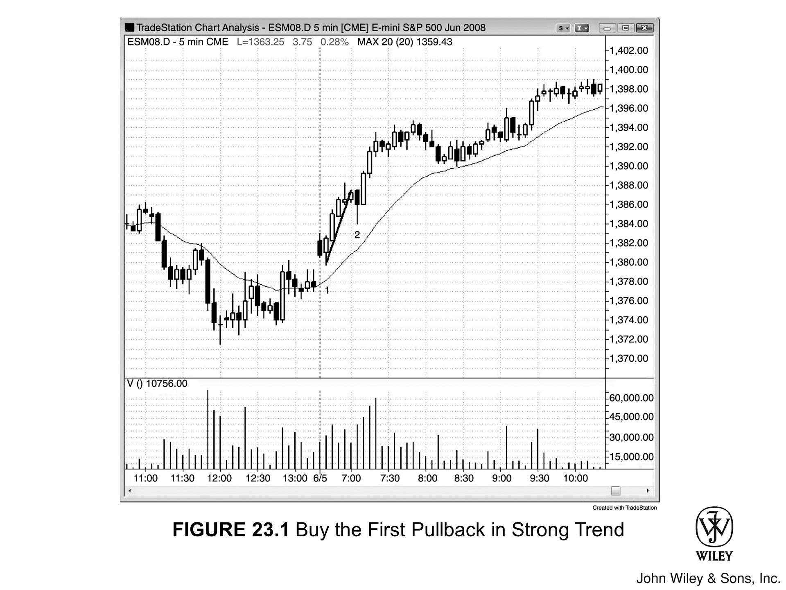
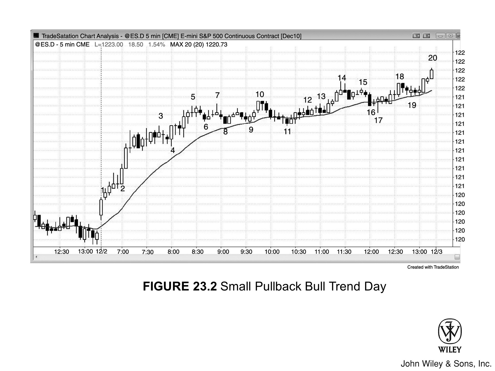
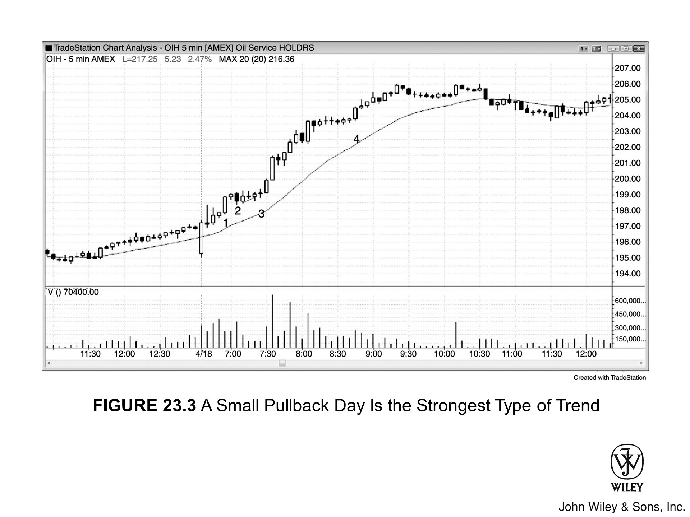
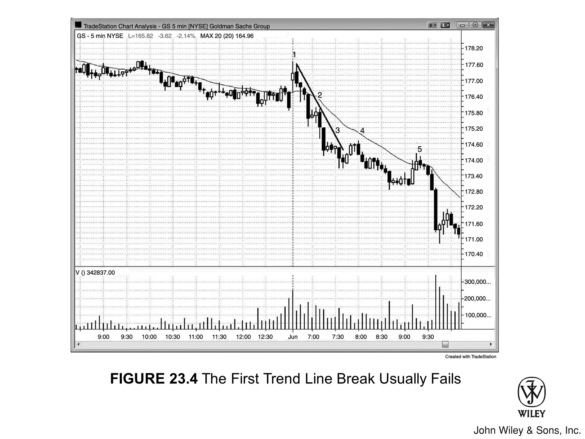
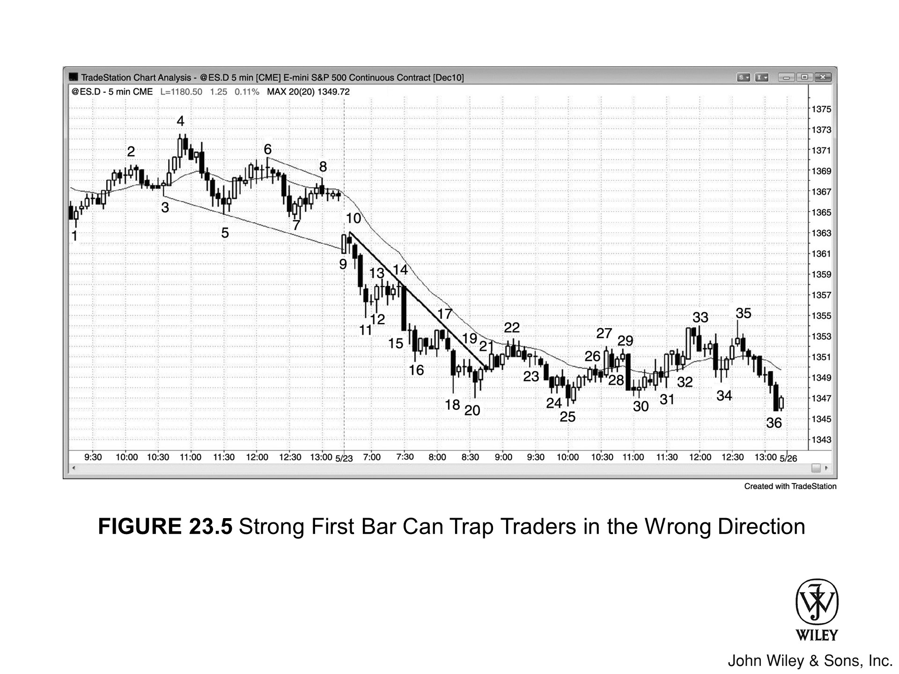
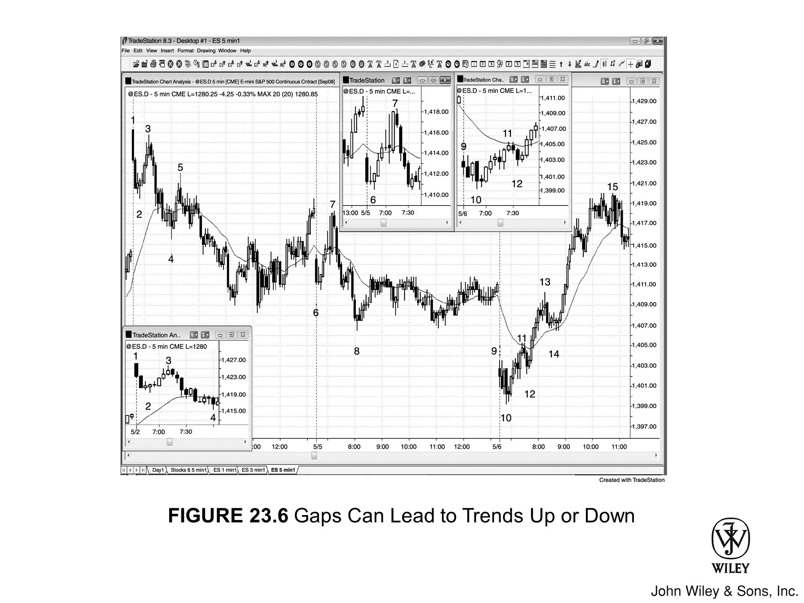
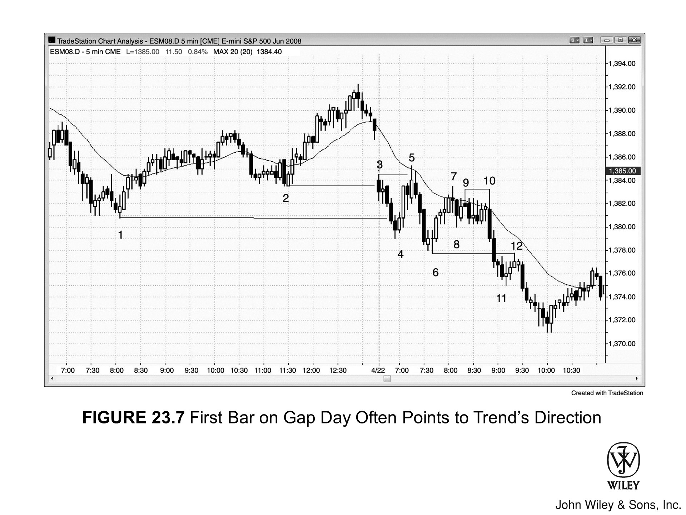
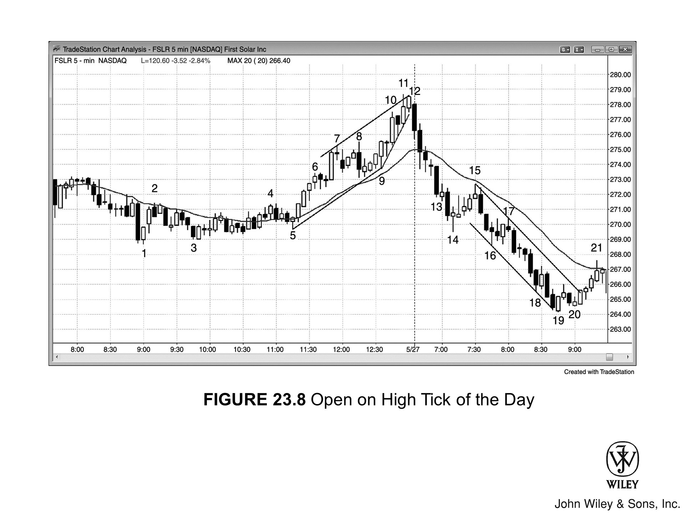
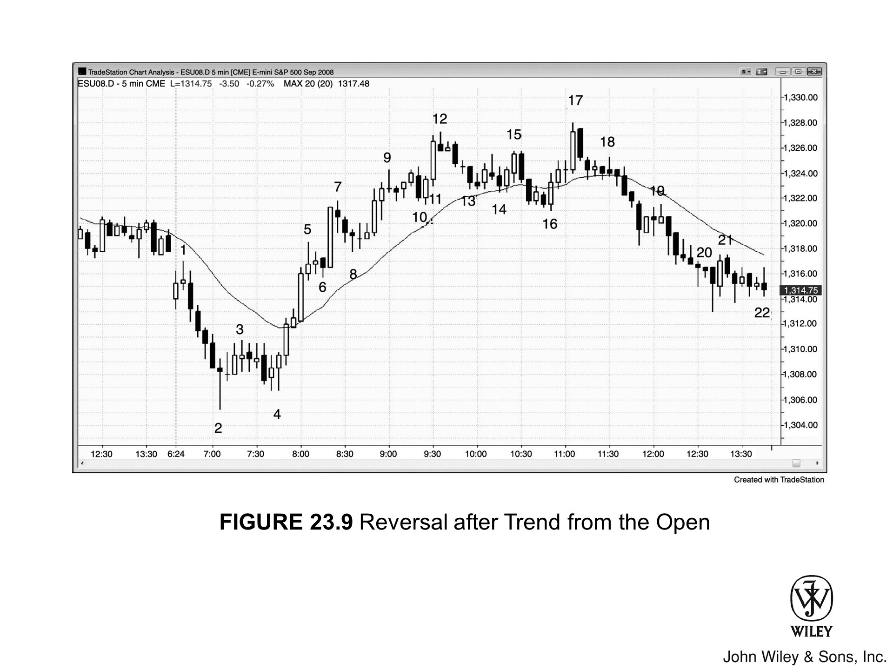
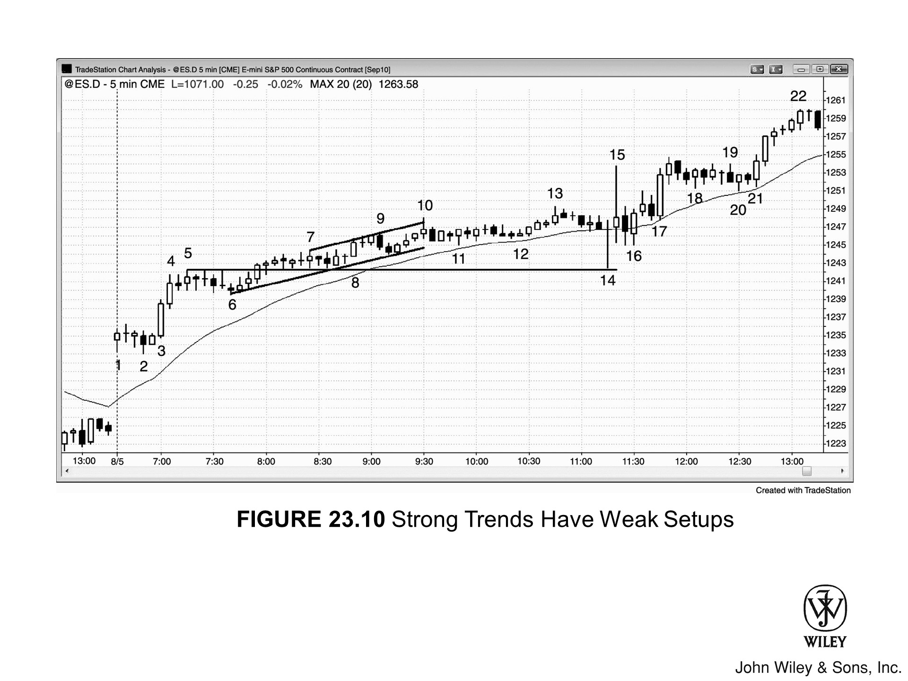

## 始于开盘的趋势日的主要特征

**始于开盘的趋势日**有以下几个关键特征：

- **多头趋势日**的低点或**空头趋势日**的高点，通常在开盘后的前几根K线内就已形成。

- 如果开盘区间小于近期平均日波幅的25%，多头趋势日可能出现**双底**，空头趋势日可能出现**双顶**。若开盘区间约为平均日波幅的50%，**突破**后更可能演变为**趋势性交易区间日**。

- 当天可以由一段持续多根K线的强力**急速**行情开场，也可以以较小的开盘区间起步。

- 如果从第一根K线前后就开始趋势行进，且初始**急速**持续3根或以上K线，那么在第一次**回调**时入场，通常至少能赚到**剥头皮**的利润。

- 如果开盘时出现强劲的**急速**行情，持续多根K线且涵盖较大的点数空间，当天通常会演变成**急速与通道**趋势日。

- 大幅**跳空开盘**常常引发**始于开盘的趋势日**，趋势朝哪个方向都有可能。跳空高开后若形成始于开盘的趋势日，大约60%的概率是**多头趋势日**，40%是**空头趋势日**；跳空低开则反过来。缺口越大，当天越可能是**趋势日**，而且趋势朝缺口方向运行的概率也越高。

- **始于开盘的趋势日**从一开始就带有紧迫感和确定性，通常是最强的趋势形态，**回调**幅度也最小。

- **EMA 20 缺口K线**和**均线缺口K线**的**建仓形态**出现在趋势后期。

- **始于开盘的趋势日**里最强的形态，同时也是所有趋势形态中最强的一种：开盘区间很小，随后全天持续以小幅**回调**向前推进——这就是**小幅回调趋势日**。以 Emini 为例，**回调**可能只有10到12个 Tick（约占平均日波幅的10%到30%）。这种情况下，最后两个小时通常会出现一次幅度约为前期**回调**1.5到2倍的**回调**，之后趋势恢复并延续到收盘。

- 对有经验的交易员来说，**波段建仓形态**成功的概率在70%或以上，尽管对新手来说这些形态从来不会显得那么确定。很多**信号K线**看起来不理想，强趋势中本就如此。大多数**建仓形态**表面上成功率只有50%甚至更低，交易员因此不敢下手，结果要么追市，要么完全错过整波趋势。

- 趋势中往往会出现很多反方向的**趋势K线**，这是**逆势**压力的体现，也让新手一直盯着**反转**而不是**顺势**交易。比如在**多头趋势**中，会出现大量**空头趋势K线**，以及大量两根或三根K线构成的空头**急速**。新手反复做空，屡屡亏损。这些**急速**演变为看起来疲软的**牛旗**，新手又因此不敢买——刚从亏损的做空中出来，情绪上很难立刻去冒险，何况形态看上去还不强。每一个看起来不好的**牛旗**都成功了，紧接着又出现一个看似很好的做空机会，然后再次失败。

- 趋势往往运行在一个相对窄的**通道**里，**回调**经常打到**盈亏平衡点**处的**保护性止损**，把交易员套在场外。交易员应该把**跟踪止损**设在**多头趋势**中**波段低点**的下方，或**空头趋势**中**波段高点**的上方。如果急着把止损移到盈亏平衡点，就容易被套在场外。

## 理解始于开盘的趋势形态

几乎所有的**小幅回调日**都是**始于开盘的趋势日**，因此可以把它视为趋势日的强化版。**始于开盘的趋势日**通常是最强的**趋势形态**，但只在大约20%的交易日里出现。这意味着，买入第一根K线高点上方或做空其低点下方、押注强趋势将从此展开，本身就是一笔低概率的交易。

**反转**在开盘第一小时内更为常见，第三册有详细讨论。如果出现大幅**跳空开盘**，且第一根K线是任意方向的强**趋势K线**，那么当日最高点或最低点就在第一根K线形成的概率可能达到50%甚至更高。大约50%的交易日里，当日最高点或最低点会在前5根K线左右形成。不过，大约90%的交易日里，最高或最低点出现在开盘区间之内——而开盘区间可能持续长达两个小时。

任何类型的**趋势日**都可以始于开盘。在**始于开盘的趋势日**中，市场在第一根或前几根K线内形成当日的一个极值，然后全天持续趋势行进，收盘时通常位于或接近另一个极值。开盘后30分钟左右也可能出现一个小的**交易区间**，随后发生**突破**，但当日开盘价通常非常靠近日内的某一极值（**多头趋势**中是低点，**空头趋势**中是高点）。

这类交易日往往以大缺口开盘，随后市场朝某个方向持续走出趋势。也就是说，大幅**跳空低开**之后，既可能走出**多头趋势**，也可能走出**始于开盘的空头趋势**。如果**建仓形态**恰好出现在强磁力位附近（例如靠近**趋势通道线**，形成**楔形反转建仓形态**），或者构成某种**反转形态**（比如在昨日收盘价附近的**最终旗形**处反转），信号的可靠性会更高。

## 多日跟随

这类趋势有时强劲到次日开盘后头一两个小时仍有**跟随**惯性，交易员在次日开盘后应重点寻找**顺势**的**回调**入场机会。这段**回调**往往力度不小，容易让人怀疑市场是不是在**反转**，但多数情况下只是高时间周期的**两段式回调**——比如回调到15分钟**均线**附近。大多数交易员只看一张图会更顺手，而5分钟图在**回调**结束处总会给出**建仓形态**。

## 小回调趋势日

**始于开盘的趋势日**在形成过程中，**回调**往往全天都很浅，出现这种情况就叫**小回调趋势日**。这是最强的一类**趋势日**，大概每月只出现一两次。其中大约三分之二的情况下，市场会在太平洋时间11点之后出现一次相对较大的**回调**，幅度通常是第一个小时趋势形成以来最大**回调**的2倍左右。

这次较大的**回调**来临前，往往会先出现一两根方向与趋势一致的、相对较大的强**趋势K线**作为预兆，但这些K线代表的是**高潮**式**衰竭**。举个例子：**小回调多头趋势日**里，此前最大的**回调**只有9个tick，市场一直在**通道**中缓慢上行。如果太平洋时间11点到12点之间突然连续出现两根较大的**多头趋势K线**并**突破**新高，这波上涨更可能是衰竭型的**买入高潮**，而不是新一**腿**行情的启动。**高潮**会在第三本书中详细讲，但大致规律是：趋势走了很长时间之后突然再度加速，通常意味着这波行情阶段性结束，接下来会走出10根K线左右的**两段式回调**。

有经验的交易员会预判3到5点的**回调**，选择平掉**多头**仓位。有些人甚至会在第二根**多头趋势K线**收盘时**做空**，或在其高点上方一两个tick处**做空**，押注**回调**的到来。他们也可能等下一根K线收盘——如果收在中间附近，就在收盘价**做空**；如果是**空头反转K线**，就在其低点下方**做空**。从**空头反转K线**低点下方入场的，**保护性止损**放在其高点上方；在**多头急速**K线收盘时直接以市价入场的，可以用3到4点的止损，并在价格再涨一两点时分批加仓。就算判断有误、市场没能下跌几点，行情也大概率会进入**交易区间**，在最后一个小时内应该还能小赚出场。

趋势启动前，第一个小时可能有一次幅度稍大的**回调**，但只有趋势启动之后的**回调**才有参考意义。观察这些**回调**的幅度——如果全都很浅，而且每次**回调**跟第一次相近甚至更小，这一天就是强**趋势日**。以Emini的**多头趋势**为例，若日内平均波动幅度约为12点，各次**回调**可能只有2到3点。

多头想等一次大一点的**回调**再低位做多，好降低风险。等来等去始终等不到，只好分批在市价或小**回调**处建小仓。这种全天细水长流式的买入把市场慢慢托高。空头一直找不到合适的**做空**机会，只好在弱一些的**建仓形态**上建小仓**做空**，但后续没有**跟随**，被迫回补，这部分买盘又进一步推高了市场。动量交易员看到趋势，也全天跟着买。

趋势通常全天只有小**回调**，正因为多头全天都在买小仓，不需要恐慌性追涨；空头整体仓位也不重，也没有大规模的回补。结果就是：虽然这天是**趋势日**，但往往涨不了多少点，多头即便站对了强趋势这边，实际赚到的钱也不算多。

## 经济报告与趋势启动

太平洋时间早上7点发布的报告，往往会催生一根**反转K线**、**突破K线**或大型**外包K线**，成为强趋势的起点，并维持全天。不过，计算机在应对报告方面有巨大的**优势**——数据一出来，它们瞬间就能接收并处理，随即生成订单，整个过程在一秒内完成，这让它们相对普通交易员占据了显著**优势**。

计算机在数据报告上有巨大优势，普通交易员处于劣势，因此报告发布的那一刻最好不要入场。计算机通常会在一两根K线内明确当前的 **Always-in** 方向，或者制造一次强势**反转**。等市场给出明确信号后，概率才站在交易员这边，届时再顺方向入场即可。触发趋势的那根强势K线不一定出现在报告发布的那一刻，可能在报告前后几根K线才形成。但这种情况发生得足够频繁，交易员应提前做好准备，一旦 **Always-in** 方向明朗，立即入场。

有时开盘后约30分钟处于小幅区间震荡，随后在太平洋时间早上7:00左右出现一次测试开盘价的动作，通常与某项报告的发布同步。虽然这会形成一段小**交易区间**，但随后突破所引发的趋势比**趋势性交易区间日**里看到的强得多——本质上与**始于开盘的趋势日**完全相同，应视为它的一个变体。

## 形态的可靠性与风险管理

即便是最好的形态，仍有约40%的概率不能如预期运行。如果市场到第三或第四根K线还没出现停顿，可能意味着涨跌过快、走过了头，**反转**而非延续**趋势**的概率就会上升。

## 交易日初期的演变

每一天在开盘头几根K线内，都是以**始于开盘的趋势日**的形态起步的。只要某根K线收于前一根K线高点之上，那个瞬间就已构成**始于开盘的多头趋势日**；反之，若跌破第一根K线的低点，则构成**始于开盘的空头趋势日**。多数时候，这种初始走势缺乏**跟随**，随即**反转**，全天演变成其他类型。但如果对前一根K线的**突破**持续扩大、发展成更大的**急速**走势，形成强势**始于开盘趋势日**的概率就会大幅提升，交易员应开始按强势**趋势日**的方式来操作。

## 急速走势与通道的动态关系

如果市场连续四根或更多K线没有**回调**，哪怕只出现两根大**趋势K线**，这段走势就应视为强势**急速**。在**急速**阶段，多空双方都认为这个价格区间几乎没有成交价值，市场因此需要迅速移动到另一个价位。当**急速**出现在开盘头几根K线时，当天就是**始于开盘的趋势日**。它可能维持全天，但有时市场会很快反向突破，可能形成反方向的趋势——比如**急速与通道**趋势或**趋势性交易区间日**，也可能只是演变成**交易区间日**。

和所有强势**急速**一样，早期买入的多头在某个时点会部分止盈，形成小幅**回调**（详见趋势部分的相关讨论）。其他没来得及参与的多头会积极买入这次**回调**，想要加仓的多头也会跟进。多头会用**限价单**在前一根K线低点或更低的位置挂单，期待当前K线跌破前一根低点后能以更低的价格买入；也有多头用**止损单**在**回调K线**高点上方挂单做多（即**高1买入信号**）。

**急速**之后通常有三种结果。第一，市场可能涨跌过快，出现衰竭性的**高潮**行为。比如随后出现暂停或**回调**——如**内包K线**或小**楔形旗形**——这可能演变为**最终旗形**，在小幅**突破**后引发**反转**，且反转可能持续数小时。第二，市场可能在窄幅**交易区间**内横盘数小时，之后趋势在收盘前恢复，演变为趋势恢复日。这种小幅横盘走势在经历连续5至10根K线的**急速**之后非常常见。第三种也是最常见的结果——当**急速**的幅度不至于引发衰竭时，市场会形成**趋势通道**，全天演变为**急速与通道趋势日**。

## 首次回调的入场策略

在强势第一段走势后等首次**回调**入场，本质上是利用强势走势倾向于测试极值的规律。多数强势走势至少有两段，因此在首次**回调**时入场，交易盈利的概率相当高。在**始于开盘的趋势日**里，如果错过了最初的入场机会，这种入场方式尤为重要。

在强趋势中，首次**回调**的边界并不总是清晰的，因为趋势中常常出现两三根横盘K线，但它们并没有明显突破**趋势线**，算不上真正意义上的"回调"。不过，即便价格没有实质性的回撤，横盘本身就是一种**横盘修正**，也是**回调**的变体。

## 在强趋势中交易弱信号K线

操作这类极强**趋势日**时，最难的部分在于：趋势在形成过程中，看起来往往并不强。通常没有那种令人印象深刻的**急速**走势，也没有干净的、高概率的**回调**到**均线**的入场机会。相反，市场每隔几根K线就出现一次**回调**，期间夹杂大量反向**趋势K线**，整体处在一个看起来疲弱的**通道**里。

初学者看不出来的是：每次**回调**幅度都很小，价格始终无法回到**均线**附近，而且一直在缓慢地远离开盘价。有经验的交易员看到这些，会把它们视为**多头趋势**极强的信号，由此建立足够的信心去做**波段交易**。他们清楚地知道：虽然K线看起来像是弱**通道**的一部分，按常规判断建仓形态的胜率会很低，但只要这种走势发生在**小回调多头趋势日**里，就会变成高胜率的**波段建仓形态**。

**始于开盘的趋势**日里，每一次**回调**都是极好的**顺势**入场机会，哪怕这些回调看起来几乎都很弱。就算**回调**最终突破了一条有意义的**趋势线**，交易员仍然可以充满信心地**顺势**入场。

强**多头趋势**中，可以在前一根K线的低点或其下方1到2个 Tick 处买入，也可以在**高1**和**高2**建仓形态的信号K线高点上方1个 Tick 处用**突破单**入场。要观察趋势启动以来各次**回调**的幅度。举个例子：如果是**小回调多头趋势**，过去几个小时最大的**回调**也只有8个 Tick，那就可以在当日高点下方5到7个 Tick 处用**限价单**买入。强**空头趋势**里则反过来操作——在前一根K线的高点或其上方1到2个 Tick 处做空，在**低1**和**低2**的**信号K线**低点下方1个 Tick 处用**突破单**入场，或者在反弹幅度大约等于平均K线大小时做空。

## 市场惯性与趋势延续

市场有**惯性**，第一次尝试终结趋势通常会失败。只有当**趋势线**被突破、并出现了显著的**回调**之后，才说明趋势的第一段腿大概率已经结束。即便如此，第一次**趋势线**被突破后，往往仍会形成高胜率的**顺势**入场机会，引发第二段趋势腿，推动趋势创出新的极值。

## 逆势压力与弱信号K线

这类行情里，**回调**往往伴随着弱**信号K线**，而且反向的**趋势K线**频繁出现。以强**多头趋势**为例：大多数买入**信号K线**可能是小**空头趋势K线**或**十字星**，不少**入场K线**则是实体很小的**外包阳线**。这些K线往往紧接在连续两三根**空头趋势K线**或**空头微型通道**之后出现。持续的**抛压**让许多交易员开始寻找**做空**信号，把自己挡在了**多头趋势**之外。

做空信号看起来总是差那么一点，但这些交易员还是选择做空——因为做空信号比买入信号看起来更顺眼，而他们又急着想交易。他们注意到，几乎每一个买入信号之后都出现了**回调**，价格回来触及**盈亏平衡点**的止损，于是认为这是**多头趋势**疲弱的标志。他们明明看出这是**多头趋势**，也想做多，却不知道该怎么入场——因为觉得每一个买入信号看起来都很糟糕。**回调**太小，建仓形态太弱。

这类行情每个月也就出现几次，交易员早已习惯了其他日子的节奏——那些日子里，**抛压**往往会带来可交易的**做空**机会。于是他们继续在那些看起来不太对劲的地方**建仓做空**。看起来不对劲，是因为那些位置其实是**多头旗形**的起点，而不是**反转**。有经验的交易员看到**多头趋势**中**回调**小、价格跌不破**均线**、**空头趋势K线**频繁出现、买入信号孱弱，就已经明白发生了什么。

他们看到有交易员被套在场外，被迫不断找顶，也知道这恰恰说明这波**多头趋势**格外强劲。有经验的交易员明白，太多人在做与正确方向完全相反的事，他们最终会被迫平掉亏损的空头仓位，追涨入市。这就形成了一种持续向上的张力：许多交易员想买却没有买，而有经验的交易员则不断买入，收获丰厚的一天。

## 止损设置与通道动态

这类行情通常处于相对窄的**通道**中。如果交易员想做**波段**，就不应该急着把止损移到**盈亏平衡点**。趋势在窄**通道**中运行时，通常会在创出新的**趋势**极值之前先回到入场价附近，缺乏经验、心理素质差的交易员很容易被误导出场，错过强趋势。

举个例子：在强**多头趋势**中，市场往往会在5到10根K线内回到**信号K线**高点处的入场价，有时还会在其下方1到2个 Tick 处短暂探底。这会让新手交易员感到不安。他们当时已经有足够的利润可以**剥头皮**离场，但因为当天是**趋势日**，想做**波段**拿到更大的利润。结果一个小时过去了，市场又回到了入场价。他们在价格迟迟没有明显上涨的煎熬中等了一个小时，现在又害怕盈利变成亏损，再也撑不住，选择以小利或小亏出场。没过几根K线，市场就创出新高，他们只能眼睁睁看着，站在场外——被套在场外，错过了一笔好交易，只能等待下一次**回调**再入场。

只有当市场回调到**信号K线**高点附近、然后再度创出新高时，才应该把**保护性止损**上移到最近**波段低点**下方。趋势往往呈现**趋势性高点**和**趋势性低点**的特征，所以**多头趋势**每次创新高后，交易员会把**保护性止损**移到最近**波段低点**的下方一点。既然预期会出现**趋势性低点**，他们自然希望下一次**回调**能守住上一个低点。一旦市场开始进入**交易区间**，**回调**就会跌破之前的**更高低点**，届时就需要切换到**交易区间**的交易方式（详见第二册）。

## 缺口开盘与第一根K线的交易

如果开盘缺口超过几个 Tick，而且第一根K线是强**趋势K线**（影线短、实体大），那么不管朝哪个方向**突破**，通常都是不错的交易机会。每天的第一根K线既是**始于开盘的多头趋势日**的**信号K线**，也是**始于开盘的空头趋势日**的**信号K线**，取决于**突破**方向。如果入场后下一根K线就打到了**保护性止损**，可以考虑**反向**做**波段交易**——因为市场走出的幅度通常会超过第一笔交易的亏损 Tick 数，而且始终有发展成**始于开盘趋势日**的可能。

就算没有缺口开盘，第一根K线如果是**趋势K线**，也是不错的建仓条件；但有缺口时成功率更高，因为市场更加过度延伸，后续走势往往更强。

---

## 图 23.1：在强趋势中买入第一次回调

市场形成了**始于开盘的多头趋势**，K线 2 跌破**趋势线**，是第一次**回调**。交易员在 K线 2 高点上方一个 Tick 处挂**突破单**买入，尽管这是一根较弱的**信号K线**（空头收盘，但收盘价至少在中点以上）。激进的多头则在 K线 2 前一根K线的低点挂**限价单**买入，押注**微型通道****突破**失败、价格将继续上行。

在第一根K线下方做空有一定合理性，但也算激进——它是**空头趋势K线**，开盘有向上**缺口**，而且向下到**均线**和昨日收盘价还有空间。不过，昨天最后一个小时连续出现多根强**多头趋势K线**，这是**买压**的信号。一旦有任何犹豫，尤其是在开盘时段，最好等待更多信息，或者等到一方被套之后再动手。这笔初始空单的问题在于：大多数交易员根本来不及迅速转换思路，在 K线 2 上方调头做多。他们会被套在场外，只能等着买第一次**回调**，而这个晚入场的代价是少赚好几个点。

---

## 图 23.2：小回调多头趋势日

**始于开盘的趋势日**是最强的**趋势日**形态，**小回调日**又是其中最强的一种。**始于开盘的趋势日**大约每周出现一两次，但**小回调日**一个月只有一两次。Emini 当时的日均波动幅度约 12 点，到 K线 9 为止，当天最大的**回调**只有 9 个 Tick，到 K线 11 的**回调**也只有 11 个 Tick。聪明的多头看到这一点后，会在距最近高点约 6 到 10 个 Tick 处挂**限价单**买入，初始止损大概放在 2 点左右。

市场在下探到 K线 17 的过程中试图走出更大的**回调**，但始终无法把价格打低超过 14 个 Tick。多头注意到 K线 14 前面那根大**多头趋势K线**可能是**买入高潮**，很多人提前平掉了多头仓位。突然的急拉很可能紧跟着一波**回调**，正好是趁短暂的好价格离场的机会。另一些有经验的交易员则在该K线收盘时、以及 K线 14 和后续K线收盘时做空，因为这几根K线顶部有影线，是**抛压**的信号。这些交易员预期会出现持续约 10 根K线的**两段式回调**，而且几乎可以确定会测试**均线**，因为 K线 9 和 K线 11 处已经测试过了。在**小回调趋势日**中，市场通常会在太平洋时间上午 11 点之后出现一次**回调**，幅度大约是当天此前最大**回调**的 2 倍。

K线 9 上方有一个 **EMA 20 缺口K线**做多机会，多头在 K线 8、9、11、13、17 和 19 处的**均线**测试中持续买入。全天都没有出现强**卖出信号**，但激进的空头可以在 K线 14 后面的**内包K线**下方尝试剥头皮做空。不过，既然是如此强劲的**多头趋势日**，大多数交易员还是会选择买**回调**，而不是去空创新高。

K线 2 形成了一波强劲的多头**急速**上涨，随后全天走**多头通道**。交易员在 K线 2 或紧随其后那根强**多头趋势K线**上确立了 **Always In** 多头方向。**通道**的大部分时间呈现为略微向上倾斜的窄**交易区间**，价格涨幅有限——这在**小回调日**中很常见。当天最高点仅比早上 8:25 的 K线 5 高点高出 4 个点。

和所有强趋势一样，这天绝大多数**买入信号K线**看起来都很差。多头因此迟疑不敢进场，被套在场外，最终只能追涨买入。空头也因此迟迟不肯平仓，结果越亏越深。全天还出现了大量**空头趋势K线**和**空头急速**走势。这种抛压让初学者不断寻找**反转**建仓形态，一次又一次错过**买入信号**。有经验、情绪稳定的交易员明白：**趋势日**中难看的**买入信号K线**和**空头趋势K线**，配合极小的**回调**，恰恰是**多头趋势**极强的标志。他们顶着这些弱建仓形态坚持买入。

K线2突破**十字星****高1信号K线**高点时，他们买入。K线4与七根K线之前的那根**多头反转K线**形成**双底**后反转向上、成为**外包K线**，他们再次买入。他们在K线8高点上方买入**高2**，也在其后那根**多头K线**高点上方买入，这两根K线构成了**两K线反转**。

K线9是**多头趋势日**中的**三角形**形态（K线6和K线8是前两次下推），因此构成**多头旗形**买入建仓形态。K线11是一根收盘于**均线**下方的**空头趋势K线**，他们在其高点上方买入——因为这是对K线8与K线9**双底**的一次失败的单Tick**突破**，同时也是**三角形****突破**至K线10之后的**回调**。此时市场处于**交易区间**，大多数多头不会因为向下**突破**就急着出场。他们清楚，多数**突破**尝试都会失败，**多头趋势**中的**交易区间**大多是**多头旗形**，最终会向上突破区间顶部。

大多数多头要么在K线10之后的**空头K线**下方退出**多头**仓位，要么将**保护性止损**设在最近一段**多头急速**的底部下方。比如，止损可能放在K线4低点下方一个Tick，或放在其后三根K线形成的那根**外包阳线**低点下方。

一般来说，出现像K线10到K线11这样的**空头微型通道**时，最好等**突破**之后的**回调**再买入。但趋势强劲时会有一种紧迫感——聪明的交易员不愿等到完美形态出现，因为他们不想错过这段行情。K线13之后那根**空头K线**虽然带有空头实体，他们也在其高点上方买入。这是一个**高2**买入建仓形态（**高1**是K线12之后那根**多头K线**），同时也是从K线10向下的**空头微型通道****突破**之后的二次入场**突破回调**买入形态（**高1**是第一次建仓形态）。

K线17变成**外包阳线**时他们再次买入，尽管前面紧跟着一根小**十字星**和一根大**空头趋势K线**。**均线**全天持续承接住了所有的下跌。他们在K线17那根**多头十字星**高点上方买入，也在其后那根**多头K线**高点上方买入。K线19之后那根**空头K线**高点上方他们也买入了，因为这又是一次**均线**附近的小型**高2**。那是根**空头K线**，第一段下跌由K线18之后的两根**空头K线**组成。还有人在K线19上方用**突破单**买入，因为它是强**多头趋势**中**回调**至**均线**的一根**多头K线**。

这一天，市场不断尝试向下**反转**，触发多头的止损，把初学者骗进亏损的**做空**仓位，却一路无情地刷出更高的高点和更高的低点，开盘接近日低，收盘接近日高。所有**买入建仓形态**看起来胜率都很低，缺乏经验的多头因此被套在场外。但有经验的交易员看透了这一切，整天逢急跌就买入。他们意识到，尽管**多头**建仓形态看起来那么差，趋势却极强，实际成功概率远比表面看上去高得多。

---

## 图 23.3：小回调日是最强的趋势类型

当出现**始于开盘的趋势**，且所有**回调**幅度都不超过近期平均日内波动幅度的20%至30%时，这一天就是**小回调日**，也是最强的**趋势日**类型。当天稍晚通常会出现一次幅度约为早盘**回调**1.5倍至2倍的**回调**，OIH这天就是如此。任何**横盘**走势都是一种暂停，属于**回调**的一种形式，构成**买入建仓形态**。

K线1的**ii突破**是一个不错的入场机会，K线3对**两段式横盘**回调的**突破**是另一次机会，最后还有K线4的窄**交易区间突破**。这些入场点都应视为第一段上涨腿的组成部分，而非第一次**回调**——第一次**回调**发生在第一腿之后，用来为第二腿做铺垫。极少数情况下，某些交易日就是拉不回来，交易员只能在短暂**横盘**暂停后的**突破**点进场。

强势行情日的现实是：你随时可以直接用市价单买入，完全相信即便出现**反转**，市场在**回调**走远之前大概率还会再创新高。很多交易员会在**多头**和**空头趋势K线**收盘时买入，或在前一根K线低点附近甚至以下买入。

---

## 图 23.4：第一次趋势线突破通常会失败

在强趋势中，往往很难判断哪一次**回调**才是第一次有意义的**回调**。正因如此，这类交易的成功概率很高——**回调**不明显，说明**逆势**交易者极弱。K线2和K线3只是幅度极小的**回调**，未能突破任何有意义的**趋势线**。真正第一次突破**趋势线**的是K线4。第一次**趋势线**突破之后，行情大概率会延续出一段新的趋势腿，因此这是绝佳的入场机会（比如在K线4那根**空头趋势K线**下方做空）。当天是典型的**小幅回调型始于开盘的趋势空头日**。

---

## 图 23.5：强势首K线可能把交易者套入错误方向

有时候，当天第一根K线会把交易者引入错误方向，随后行情反而朝相反方向走出强势**趋势日**。当天市场跳空低开，跌破昨日低点，同时向下突破昨日下半段形成的大型**交易区间**（一个头肩顶**熊旗**形态）。当天第一根K线——K线9——是一根**多头趋势K线**，通常意味着缺口可能部分回补，甚至演变为**多头趋势**。很多人在其高点上方一个tick处挂**突破单**做多。然而两根K线之后，市场跌破K线9低点，那些**多头**被套。

这根**多头趋势K线**把多头套进来、把空头挡在场外，因为大家当时判断这根K线的强势意味着市场要尝试回补缺口，甚至变成**多头日**。行情试图从昨日**交易区间**下沿突破处以及从跌破**趋势通道线**处向上**反转**，但均告失败。开盘时段必须保持极强的灵活性——上一分钟的判断，下一分钟可能完全反过来。越早看清正在发生什么，就能越早入场。

市场试图重新向上突破**趋势通道线**，但失败了。这个**两K线突破回调**形态可能引发某种**测量移动**下跌。如果当天走成**趋势日**，即使错过了最早的入场点，整天还会有很多补入机会。

K线10提供了一个绝佳的做空机会——在K线9**多头趋势K线**低点下方一个tick做空，因为大多数被套**多头**会在这里平仓离场，推动市场下行。与此同时，潜在买家会等待更多**价格行为**信号才愿意入场，市场上只剩卖家，做空的成功概率因此很高。此后，空头在每一个**熊旗**处加仓，继续把早入场的**多头**套住，让他们误以为市场正在筑底。

K线11收盘时，交易者对 Always-in 做空方向已经高度确信，这根K线确认了向下**突破**成立。实际上，K线11之前那根**空头突破K线**收盘时，很多交易者就已经对 Always-in 方向充满信心了。

尽管期间多次出现**反转**尝试，行情最终收于当日低点。这个例子很好地说明了，为什么在看到强势**始于开盘的趋势日**时，至少要对一部分仓位做**波段**持有。如果你做了**多头**交易，离场时必须强迫自己切换到**做空**方向，不能为了抓一点小**多头**行情而错过幅度大得多的**做空**机会。

### 图 23.5 深入讨论

K线12是一根强势**多头反转K线**，但它与前两根K线大幅**重叠**，实际上属于小型**交易区间**的一部分。尽管外形像**反转K线**，却并不具备反转功能。**反转K线**必须结合**背景**来判断——与前几根K线**重叠**过多时，说明它只是小型**交易区间**中的一根K线。在**空头趋势**中于**交易区间**上方做多，是亏损策略。聪明的交易者做的恰恰相反——他们挂**限价单**在前一根K线高点及其上方做空，哪怕那根K线有强势的**多头**实体也不例外。

K线13是**低2做空**的**建仓形态**，但**信号K线**是一根小**十字星**。**十字星**属于弱势**信号K线**，而弱势**建仓形态**往往意味着市场还没准备好**突破**。不过，在这种强势**空头趋势**中，任何理由都可以做空，用稍宽的止损即可。你也可以在K线12或K线11低点下方做空。在强势**空头趋势**中，在各K线低点和**波段低点**下方卖出，通常都能盈利。

K线14是在**低2**失败后尝试向上**反转**，形成第三次向上推进。K线11后那根**十字星**是第一次推进，K线12是第二次。**熊旗**中的三次向上推进构成**楔形熊旗**，在其低点下方做空是合理的选择。

K线14这个失败的**低2**做多**建仓形态**，示范了交易者最容易犯的错误之一——在**空头趋势**中的**熊旗**里，在一根弱K线上方做多，妄图赚一把剥头皮的利润。你不仅会在这笔剥头皮交易上亏损，更糟糕的是，你的思维会被锁定在做多模式里。当**熊旗**向下**突破**、成功率更高、更可能走成**波段交易**而非仅仅**剥头皮**的机会出现时，你在心态上根本没准备好去做空。

第15根K线是一根强**空头趋势K线**，也是一根**突破K线**，宣告空头掌控了市场。出现这种强力**空头突破**后，市场通常还会以**空头通道**的形式再走出至少两段下跌，而这两段下跌往往构成一个**楔形熊旗**。随后通常会出现**两段式回调**，这里也不例外——市场反弹到第22根K线处的**均线**就是如此。

第22根K线是**均线**处的**空头反转K线**，构成低2做空的**建仓形态**，同时也是**均线缺口K线**做空信号，以及**楔形熊旗**——其中上推至第19根K线是**楔形**的第一段上涨。

市场随后下跌，在第25根K线处以**两K线反转**刷新了**空头**低点。这里同时也是从单K线**最终旗形**向上的**反转**，以及发展中的**交易区间**底部的高2买入信号。

第27根K线是一根强**多头趋势K线**，试图向上**突破**，但与第22根K线形成了**双顶熊旗**。

第28根K线的**ii形态**随后演变为**最终旗形**——市场从第29根K线这个小幅**低点**（**均线缺口K线**做空**建仓形态**）向下**反转**。

第30根K线是对**空头**低点进行**两段式**测试的**较高低点**。

**空头**反弹在第35根K线处以**楔形熊旗**终结，第27和第33根K线分别是前两段上推。这一系列**HH**把多头套了进去、把空头套在场外，但警觉的交易员早已预判到**空头日**将重启——他们注意到第35根K线没能触及第11根K线下方**空头**仓位的**盈亏平衡点**止损位。这意味着最强的空头正在重新发力：他们在第15根K线强劲**急速**阶段接管市场后退到场边等待测试，随后突然现身，将市场打压至收盘。

---

## 图23.6：缺口可能引发向上或向下的趋势

这里连续出现三次**缺口开盘**，但结果各不相同——尽管每天第一根K线都是**空头趋势K线**。第1和第9根K线在日线图上同样是**缺口开盘**。

第1根K线顶部无影线、底部有小影线，是一根大幅**空头趋势K线**，在**大幅跳空高开**的行情下是不错的做空**建仓形态**，紧随其后的是一根强劲的**空头入场K线**。第一根K线如果是强**趋势K线**，通常会有**跟随**；当前两根K线都很强时，随后的反弹尝试往往只形成一个**低点**，这里正是如此。**大幅跳空高开**后遭遇强劲抛售，通常会走出**始于开盘的空头趋势日**。市场随后急速反弹至第3根K线测试开盘价，但这次失败的**开盘反转**只形成了一个**LH**或**双顶**，随后展开漫长的下行。第2根K线试图构成昨日高点**突破**后的**突破回调**，但空头力量太强，反弹在第3根K线处宣告失败。

第6根K线后两根K线是一根强**多头反转K线**，在开盘**空头趋势K线**跌破前一天最后两小时**多头通道**之后，形成了一次**开盘反转**。**多头通道**本质上是**熊旗**，第6根K线后两根出现的**多头反转K线**，是试图让**熊旗****突破**失败的尝试。在当天第一根K线下方做空其实风险较高——尽管那是一根**空头趋势K线**——因为该K线正处于昨日收盘**交易区间**的位置，而在**交易区间**底部做空通常是亏钱的做法，在方向不明的**交易区间**市场里尤其如此。

市场急速反弹至第7根K线处，测试了前一日收盘价，形成**LH**或**双顶**。这根**空头信号K线**让这里成为不错的做空时机。**回调**的出现是因为多头止盈。为什么趋势强劲时交易员还要止盈？因为再强的趋势也可能出现深幅**回调**，让交易员有机会以更好的价格再次入场，有时趋势甚至会**反转**。如果不至少部分止盈，就只能眼睁睁看着大笔浮盈蒸发，甚至转为亏损。

第9根K线**跳空**跌破前一天低点，形成一根**空头趋势K线**，但影线较大，说明交易员在K线收盘前买入。第二根K线是**空头趋势K线**，以最低价收盘，表明空头力量强劲，但随后出现一根强**多头趋势K线**，形成**反转**。虽然做多信号没有触发，但这再次说明空头缺乏迫切感。**缺口**如此之大，所有人都清楚这种走势已经过激——如果没有立即出现**跟随**，市场就会迅速**反转**，消化这一极端行情。

K线10是一根大的**空头趋势K线**，也就是一次**卖出高潮**。下一根是**内包K线**，两者构成**突破**模式——如果没有立即的跟随卖压，空头就会开始积极回补仓位，并寻机在更高位重新做空；多头则会买入，押注当天低点就在此处。市场此前已在大的**空头通道**中运行了好几天，K线10正好处于**通道**底部，向上**反转**的概率相当高，而向下突破**空头通道**底部、演变为更陡**空头趋势**的概率则较小。

图中未画出**通道线**，但**空头趋势线**在K线1和K线7高点上方，**空头趋势通道线**则是沿K线4和K线8低点画出的最佳拟合线。多头也会在**多头趋势K线**上方买入，比如K线10之前的那根**多头趋势K线**上方，以及K线10之后两根的**多头趋势K线**上方。K线12之后那根小**内包K线**的上方也是买入位置，因为那里会构成一次失败的**低2**。由于这可能是从当天低点和两日**多头旗形**底部向上**反转**的起点（**空头通道**本质上就是**多头旗形**），因此是一个不错的买入**建仓形态**。

---

## 图23.7：跳空日的第一根K线往往指向趋势方向

市场以中等幅度**跳空低开**，这种情况下开盘价可能接近当天的高点，也可能接近当天的低点。K线3是当天第一根K线，是**空头趋势K线**，可能是**始于开盘的空头趋势**的起点。市场未能**反转**昨天K线2处的**波段低点**，因此大概率会去测试昨天的下一个支撑位，也就是K线1处的低点。交易员可以在K线3低点下方1个tick挂单做空。

市场跌破昨天低点后，大概率会尝试至少短暂地**反转**向上，因此交易员应在第一根好的**信号K线**高点上方1个tick挂**突破单**做多。虽然有些交易员会在K线4上方买入，但K线4是一根收盘价低于中点的**空头趋势K线**，更稳妥的做法是等下一根K线收盘，看是否会出现更好的**建仓形态**。下一根K线有不错的**多头实体**，并与K线4构成**双K线反转**，入场价在其高点上方。一般来说，在**多头趋势K线**上方买入总是更好的选择，做**逆势**交易时尤其如此。

如果买入订单未能成交，而下一根K线出现更低的低点，交易员应尝试在其高点上方买入——因为他们在寻找昨天低点向下**突破**失败后形成**开盘反转**的机会。但如果市场在没有出现好的买入**建仓形态**的情况下继续大幅下跌，就应该只做空，等待一次反弹突破**趋势线**之后再考虑做多。

市场走出小幅**两段式**反弹，涨至**均线**附近并突破当天高点，在**均线**处形成**双顶熊旗**。突破K线4**反转**高点的那根大**多头趋势K线**之后紧跟着一根**空头K线**，跟随力度不足，表明市场可能正在形成**交易区间**而非**多头趋势**。市场一直在**交易区间**内震荡至中午。到那时为止，区间幅度大约是日均波幅的一半，这提示交易员注意可能出现的**突破**——区间大概率会扩展至两倍，进而形成**趋势性交易区间日**。**突破**从K线10开始，以强力**急速**下跌的方式启动。虽然图中未展示后续走势，但这一天最终以强烈的**反转**收场——**趋势性交易区间日**经常如此——市场收回了自K线7起形成的窄**交易区间**之内。窄**交易区间**具有磁吸效应，往往会把**突破**拉回区间内。

---

## 图23.8：当天最高点出现在开盘

**始于开盘的趋势**有时会在当天最高点开盘。K线12是当天第一根K线，开盘即在最高点，并向下突破了前一天收盘时形成的**楔形**。大多数交易员不够灵活，无法在昨天尾盘的**内包K线**下方卖出，但在第一根K线收盘时小仓位做空是合理的选择。如果错过了第一次入场，可以切换到1分钟图寻找小的**回调**（有很多）来**做空**，或者直接等一个5分钟的**建仓形态**。

**始于开盘的趋势**出现时，在第一次**回调**时**做空**是高概率交易，尽管心理上很难执行——因为这相当于在一段大幅下跌行情的低点附近卖出。K线15是首次**回调做空**的**信号K线**，同时也是一次**回调**到**均线**略下方后再度向下**反转**的形态。空头急于入场，甚至不等市场真正触及**均线**就开始在**均线**下方做空了。

有些交易员看到连续5根带**多头实体**的K线后会不敢**做空**，但这些K线的实体都很小，而且这是强**空头急速**之后的首次**回调**，因此是可靠的**低1做空**建仓形态。同时，这里也是对**均线**的测试，并与K线13高点构成**双顶熊旗**。

当天形成了**急速与通道**的空头走势，**空头通道**从第15根K线开始（也可以说从第17根K线起算），终止于第19根K线。之后市场在收盘前出现反弹，未能收在最低点。

### 图23.8 深度解析

这天还出现了其他**急速**与**通道**结构，大多数交易日都会有类似的情形。第12根K线及其后一根共同构成一段**急速**；第13根K线与第14根K线前面那根也形成**急速**；从上方跌至第14根K线的整段走势本身就是一段**急速**。第15根K线之后的两根K线又形成一段**急速**，随后进入**通道**阶段——**通道**从第17根K线的**低2**建仓形态起步，终止于第19根K线。

第16根K线同时是跌破第14根和第1根K线后的**突破回调**。它与跌破前一日低点的**突破**位置也足够接近，因此同样可以视为一次有效**突破**后的**回调**（接近即等同于触及）。空头非常急切，使得这第一次**回调**始终未能触及**均线**。他们担心价格还没到那里就掉头向下，于是在价格接近**均线**的过程中大量做空，结果价格根本没机会到达那个位置。当**回调**在**均线**下方刚一转头就重新下行，说明空头此时极为强势，带有一种紧迫感。他们急于**做空**，哪怕是在相对低位，因此价格继续下行的概率很高。

第19根K线是一根向上的**急速**K线，随后**通道**向上展开，起点是第20根K线的**HL**。第20根K线之后那根也是一段**急速**，以第21根K线（图表最后一根）为终点，收尾于一个三根K线的**通道**。

前一日同样出现了**急速**与**通道**走势：上冲至第2根K线是一段**急速**，随后从第3根或第5根K线起进入**通道**。第5根到第6根K线的走势是另一段**急速**，第7根K线前面那根也是。两段**通道**均以第8根K线的低点为起点。从第5根到第7根K线的整段上行，在高时间周期图表上大致就是一段**急速**。

前一日收盘时的**多头通道**上穿了**趋势通道线**（该线以第5根到第9根K线的**多头趋势线**为基准平行绘制）。当日第一根K线（第12根K线）反转回到**通道**内部后，市场至少应该会刺穿**通道**下轨。下一个目标是以**通道**垂直高度计算的**测量移动**，再往下则是前一日**通道**底部，即第8根K线的低点。由于上冲至第11根K线的走势呈**楔形**，且市场已测试到**楔形**起点以下，因此下方目标就是一个**测量移动**：用**楔形**的高度（第11根K线高点减去第8根K线低点），从**楔形**底部即第8根K线低点向下量出等距。这个目标在第17根K线之后的暴跌中被超越。

第19根K线是在第二次跌破**空头趋势通道线**（以第15根到第17根K线的**趋势线**为基准平行绘制）后的向上**反转**，因此大概率会出现两段上行。第18根K线曾短暂刺穿**趋势通道线**后试图向上**反转**，但市场始终未能突破那根**两K线反转**的高点，所以没有触发**多头**入场信号。

有一点必须明确：前一日虽以**楔形**顶部收盘，但收盘前仍处于一段强势**多头趋势**之中。初学者很容易因此预期今天开盘继续上涨，从而忽视正在形成的**反转**。永远要做好应对反向走势的准备，因为那种看起来不太可能发生的情形，大约有40%的概率会成真。

---

## 图23.9：始于开盘的趋势后的反转

并非所有以**始于开盘的趋势**开局的交易日，最终都会沿初始方向形成强**趋势日**。这天以**始于开盘的空头趋势**开场——价格**跳空**跌破前日低点，随后回调，几乎填补了**缺口**，第1根K线由此成为一个**突破回调做空**的建仓形态。市场下跌了5根K线，在第3根K线下方形成第一次**回调做空**信号，但随后并未立即触发**做空**，而是进入了一个窄幅**交易区间**。尽管**剥头皮**机会是存在的，但市场最终在第4根K线以**HL**的形式向上**反转**。

### 图23.9 深度解析

第1根K线是跌破前日收盘**交易区间**后的**突破回调做空**建仓形态。最初的抛售一直打到第2根K线，幅度约12点，与近期平均日内波动幅度相当。一旦市场**反转**重回开盘高点之上并向上突破，大概率会出现一次**测量移动**。有时市场会先完成一段与"开盘价到当日最低点"等距的**测量移动**上行，再跌回开盘价附近收盘，在日线图上形成一根**十字星**日K线。也有时这段**测量移动**的幅度大约等于初始下跌腿的整体高度。当日最高点出现在第17根K线，比该**测量移动**目标仅低了3个Tick。这次突破**开盘区间**的向上**反转**，在日线图上形成了一根较长的下影线。当市场在大幅**测量移动**触顶后转头向下，往往会重新下行，最终收在当日区间中部附近——这次正是如此。

从第4根K线到第5根K线的**急速**上涨也为一次**测量移动**奠定了基础，但最终并未精确实现。以第4根K线到第5根K线为第一段、第6根K线低点到当日第17根K线高点为第二段，实际走势比"第一段=第二段"的**测量移动**目标高出一个Tick。收盘前的下跌同时也是对第6根K线所形成的**多头通道**底部的一次**测试**。

第15根K线之后出现了一段**两K线急速**下跌，随后**回调**至第17根K线形成**更高高点**（**HH**），这里就是**空头通道**的起点。**急速**下跌之后的**回调**有时会创出**HH**，但一旦出现这种情况，**回调**结束后通常还会再跟一波**急速**下跌。图中，第17根K线之后那根大**空头内包K线**就构成了一次**急速**下跌，第18根K线之后的下跌又形成了另一次**急速**，其中那几根大**空头趋势K线**的推动力最强。第13根K线之前那段三K线下跌同样是一次**空头急速**，因此很可能对随后的大幅下跌也起到了一定推动作用。当市场接连出现大量**空头趋势K线**时，**抛压**就在不断累积，最终往往会压垮多头，本图正是如此。

---

## 图23.10：强趋势中的弱**建仓形态**

图23.10是一个**始于开盘的趋势**多头日，但为什么最好的趋势反而最难交易？因为大多数**顺势**入场点看起来都很弱，而且市场频繁出现小幅**回调**，不断把交易员甩出局。这些**回调**没有一次会触及两点的资金止损，而在强趋势中，两点止损通常是最合适的**保护性止损**。面对如此多的小**横盘**K线，如果把**价格行为止损**设在前几根K线低点下方，就会频繁被扫掉；此时更合理的做法是坚守最初的两点止损。趋势足够强时，要想尽一切办法维持**多头**仓位。强劲而持续的趋势往往由大量带影线、高度**重叠**的小K线构成，**回调**幅度极小，基本上只是**横盘**停顿。

开盘出现大幅**缺口**高开，意味着当天要么走**趋势**上涨，要么走**趋势**下跌，而且缺口越大，形成**多头趋势**的概率越高。由于开盘头几根K线没有明显的抛盘，存在**始于开盘的多头趋势**的可能性，交易员应当偏向**多头**。市场之所以全天缓慢上涨，是因为机构手中持有大量买单需要消化，他们选择在全天分批成交——因为他们担心**回调**可能不会出现，必须把仓位建够。正是这种持续的买入压制了任何像样的**回调**。他们不会一次性大量买入，因为那样可能引发**买入高潮**，进而触发大幅**反转**，导致价格跌破他们的买入成本。此外，随着市场上涨，投资者信心增强，机构在全天还会持续收到新的买入委托。

### 图23.10深度解析

像图23.10这种强趋势，任何时间、任何理由都可以买入。在**回调**K线上方买入是可靠的，也可以用**限价单**在前一根K线低点或低点下方买入。在K线低点下方**做空**是必输的策略。如果非要**做空**，只能在K线高点上方或强**多头趋势K线**收盘时**做空**。当一天的走势如此之强时，大多数交易员根本不应该**做空**，因为**做空**很可能分散注意力，导致错过**买入**机会——而强趋势中的买入机会是**波段交易**，盈利空间远大于**剥头皮**。

第3根K线是一段**两K线急速**上涨的第一根，之后市场在窄**交易区间**里横向整理，随后**通道**上涨开始。最强的趋势往往全天都在不断形成**反转**形态，但这些形态看起来总是差那么一点。尽管如此，它们持续把早入场的空头套住——空头以为小K线意味着小风险，但连续四五次小亏损累积下来，已经亏到几乎无法翻盘的地步。不能仅仅因为风险看起来小就去做一笔交易，还必须同时考虑成功概率和潜在盈利空间的大小。

空头把第5、第7、第9根K线看作**三连推**形态，即**楔形**变体，随后又把第7、第9、第10根K线视为另一个**楔形**。如果**楔形**回调后市场是**横盘**而非下跌，那就说明趋势极强——应该停止寻找**反转**机会，只做**顺势**交易。

第14根K线恰逢联邦公开市场委员会（FOMC）报告公布，市场急剧下跌，但随即**反转**回升，仅差一个Tick未能触及第5根K线高点。

临近收盘，市场连续出现几次**两K线多头急速**（第16、17、21根K线分别是各次**急速**的第一根）。

在这样的强趋势中，全天都会出现**反转**建仓形态，但这些形态始终不够到位，几乎每次都会失败。K线9 结束的**楔形**处于一个极度紧密的**多头通道**中，通道内几乎全是**多头趋势K线**，市场已经超过两个小时没有触碰**均线**。买盘很可能就守在那里，做空几乎毫无胜算。K线10 突破了**趋势通道线**，但收出了**多头实体**。**通道**依然非常紧密，此前也没有任何空头力量的迹象。只有在出现**第二次信号**、且之前已有明确的空头力量表现（比如回调5到10根K线触及**均线**）时，才可以考虑**做空**。缺乏这些前提条件，任何做空操作都是在赌市场会做出它一整天都没做过的事情。

全天最大的**回调**只有9个tick。在某根K线下方做空，入场点大约在低5个tick的位置，还需要市场再跌5个tick才能完成一笔一点的**剥头皮**。市场一整天反复尝试回调，却始终跌不过9个tick，指望这次做空能成功，是一笔概率极低的交易。用6到7个tick的风险去博一点的**剥头皮**，成功概率至少要达到60%才合理——因此这个市场不能做空。有人可能会说，走到bar 12时已经跌破了**多头趋势线**，在bar 13的HH位置做空是合理的。但市场还没有回调到**均线**，而**均线**就在下方仅6个tick处，那里必定有买盘。况且bar 13是连续第5根**多头实体K线**，这么强的力度根本不适合做空。

大多数强**趋势日**中，通常在太平洋时间上午11点到中午之间，会出现一次短暂而剧烈的**反转**，将持仓不稳的**多头**震出去，同时套住那些急于扳回早盘亏损的空头。这种走势事后总会被归因于某条新闻，但那其实无关紧要。真正重要的是：对于不被那波急跌吓到的人来说，这里通常会出现一个**买入**机会。

当天上午11点15分FOMC报告出炉。报告公布后，K线14一度出现大**空头实体**，看起来像一根**空头趋势K线**。如果你在这根K线收盘前就急着做空，认定市场会在报告后大幅下跌，那你正在忽略一条非常重要的规则：必须等K线收盘再做决定。因为一根K线在开盘4分钟时看起来像大**空头趋势K线**，到收盘时完全可能变成**十字星**甚至**多头反转K线**。

K线16是市场从bar 14底部反弹至bar 15顶部后的一个HL，紧接着bar 17出现了**突破回调**的**多头**入场机会。所有的**急速**走势都应视为**急速**、**高潮**和**突破**的结合体，因此从bar 16开始的这个两根K线**急速**，就是一次**突破**，而bar 17就是**回调**后的入场点。

K线19形成了**双顶熊旗**，但之前没有明显的空头**急速**作为前提，所以市场更可能只是在bar 17**急速**上涨后进入**横盘**整理。

K线20是一根**多头反转K线**，也是**高2**做多机会。K线21（即入场K线的下一根）跌破了入场K线低点，将**多头**套在了场外。但由于从bar 20出发的上涨只走了一个tick，**保护性止损**应该设在bar 20**信号K线**下方，不要过早上移。强**趋势日**总是不断地把交易员骗出**多头**仓位，又诱使他们去做空。空头必须买回**空头**仓位，这本身就增加了**买压**，同时让空头至少在一到两根K线内不敢再做空——刚输了一次，需要缓一缓。另外，刚被套在场外的多头，等市场涨上去后会追着买入，进一步推升**买压**。

---

## 图23.11： 强空头日中的双顶

**始于开盘的趋势**在强趋势真正展开之前，可能会先形成**双顶**或**双底**。K线7试图建立一个**空头始于开盘的趋势**，但高点在早上7点的报告发布时被再次测试，这种情况很常见。尽管市场在bar 9之前形成了一个小的**交易区间**，但始终要考虑另一种可能：市场只是在等报告出炉后再释放力量。

当时的**开盘区间**不到近期日K线区间的三分之一，这使市场进入了**突破模式**。第一根K线之后，市场先急速下跌又急速反弹（先向下**反转**，再向上**反转**），部分交易员开始押注**突破**，预期区间将扩大数倍。市场跌破bar 7的**两K线反转**后，K线7的向下**反转**变成了一个**波段高点**；市场涨回bar 8上方后，K线8成为**波段低点**和一次向上**反转**。这些交易员在bar 7**急速**顶部上方一个tick处设置**买入突破单**，同时在bar 8**急速**底部下方一个tick处设置**卖出突破单**。当bar 9涨过bar 7高点、**买单**被触发后，他们将bar 8下方的**卖出突破单**数量翻倍。随后市场跌破bar 8，第二笔单被触发，他们在**多头**仓位止损出场的同时转为**做空**。

这是这种**建仓形态**的传统做法，但通常更激进的方式效果更好。更好的策略是：在K线7的**两K线反转**下方**做空**，先**剥头皮**出一部分仓位，再收紧**保护性止损**；然后在K线8的**高2**处**反向做多**，入场位置在**均线**附近，同样先**剥头皮**出一部分，收紧止损；接着在K线9这根**外包阴线**下方再次**反向做空**——因为有被套的**多头突破**交易者，而且市场与K线7形成了**双顶熊旗**。之后再**剥头皮**出一部分，收紧止损，把剩余仓位**波段**持有，直到出现明确的**买入信号**；如果没有信号，就把**空单**拿到收盘。

如果在K线15、18或21的低点附近买入，止盈的同时必须**反向做空**。如果做不到，要么继续持有**空单**，要么在那些小的**买入信号**处出场，等反弹后再找机会**做空**。

虽然当天开盘是一段小**交易区间**，有些交易者可能把这天称为**趋势性交易区间日**或**空头趋势恢复日**，但**回调**幅度这么小，面对的实际上就是一段非常强劲的**空头趋势**。这种情况下最重要的一件事就是：全天大部分或全部时间都要保持**空头**仓位。把这天当成**趋势性交易区间日**，只会让你不断去**做多**，频繁错过**做空**机会。从K线15开始的**回调**幅度大约是K线9趋势启动以来其他**回调**的两倍。这天不是典型的**小回调趋势日**——典型的**小回调趋势日**通常要到后半段（比如太平洋时间上午11点之后）才会出现较大的**回调**——但今天依然是一个强势的**空头趋势日**。

### 图23.11 深入解读

K线11、13、15形成了一个**楔形**，但市场已有大约20根K线未触及**均线**，且**空头通道**非常窄，所以这个**楔形**很可能只会引发一次对**均线**的测试，空头届时会在那里积极**做空**。多头确实推动市场走出了两段上涨，直到K线17——一根**均线缺口K线**。**空头趋势**中出现的第一根**均线缺口K线**，往往还会带来最后一波下跌，之后才会出现较大幅度的向上修正。

上涨至**均线缺口K线**的这段行情几乎总会突破一条重要的**空头趋势线**，因此随后对**空头低点**的**HL**或**LL**测试，通常会引发一段持续性的向上修正甚至**反转**。市场在K线18尝试向上**反转**，在以K线21结束的小**楔形**处再次尝试。K线22出现了一根强势的**两K线多头急速**，把多头套在场内、空头套在场外。但有经验的交易者知道，**趋势日**在太平洋时间上午11点之后往往会出现一段强势的**逆势**行情，他们会提前准备好**做空**这次失败——比如K线24形成的小**双顶**。

此处的**信号K线**是一根**空头内包K线**，K线22和K线24的**双顶**又与K线17形成了一个更大的**双顶熊旗**。下探至K线25的**急速**走势之后，出现了几根强势的**多头趋势K线**，这构成了K线26的**突破回调做空**建仓形态，随后市场一路下跌直至收盘。K线25处的**反转**尝试本来是一个**扩张三角形**底部的**信号K线**——K线18、21、25构成三个低点——但底部失败了，K线26变成了**突破回调做空**的入场K线。**楔形**失败后通常会触发一段**测量移动**式的下跌，收盘前的卖盘也确实接近了这个目标位。

这使当天最终演变为一次**趋势恢复空头**形态：先是从开盘跌至K线13的初始**空头趋势**，然后是持续大约两小时直到K线24的**交易区间**，最后是收盘前的又一段**空头腿**。
