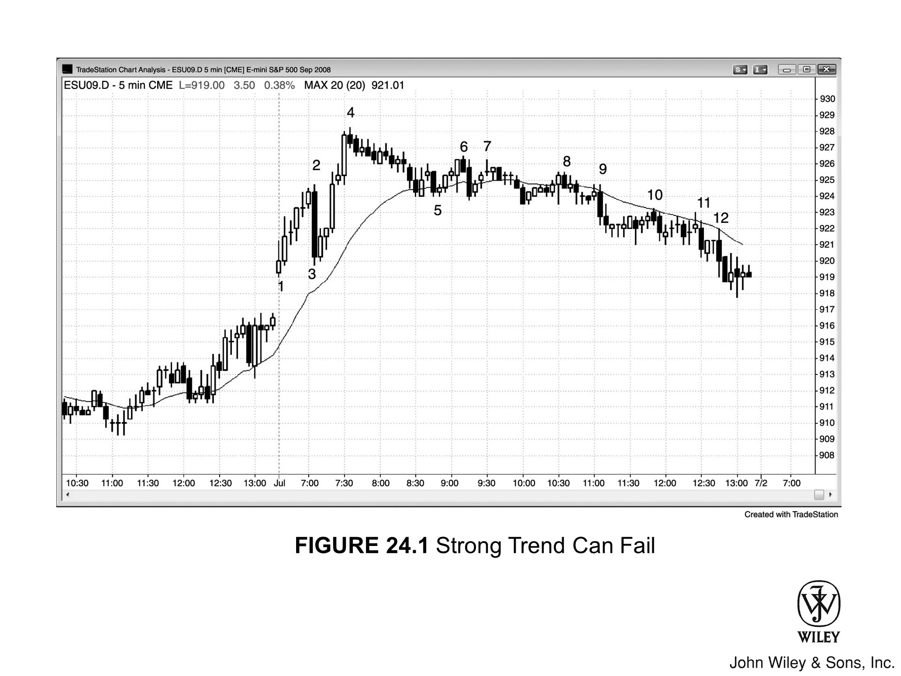
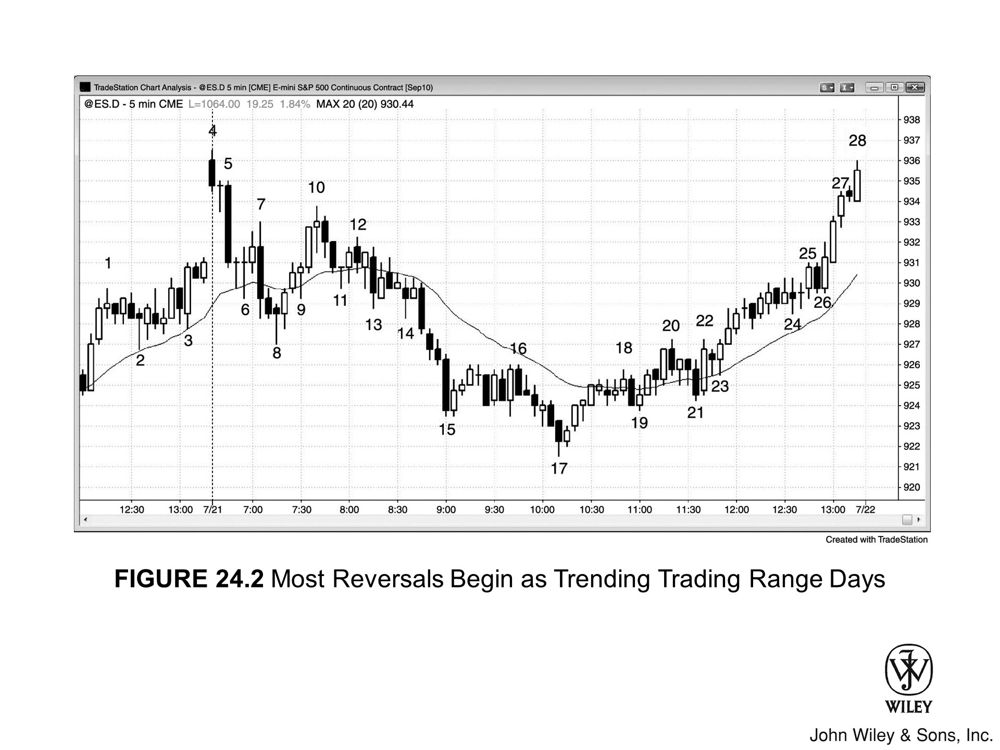
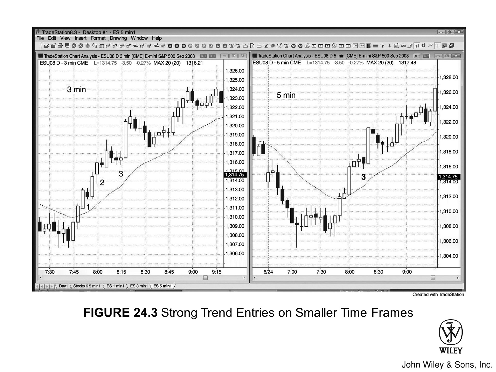

## 反转日的核心特征

- 当天先朝一个方向运行出趋势，随后反转，朝相反方向运行趋势直至收盘。
- 多数反转日起初表现为**趋势性交易区间日**。
- 若反转发生在最后几个小时且力度较强，次日通常会出现**跟随**，而且往往延续数日。

## 强趋势及其形态

有些最强劲的趋势，从盘中甚至收盘前才开始启动。它们有时源于**交易区间突破**，有时源于**高潮**式趋势反转，通常会被归因于某条新闻——但新闻本身并不重要。无论属于哪种情况，市场都可能进入一种"脱缰趋势模式"：回调极小，却持续单边运行。这类走势的特征是：大幅**趋势K线**、K线之间几乎没有重叠、影线普遍短小。这是一次明确的**突破**，也是一次清晰的 **Always-in 翻转**。你必须迅速入场——哪怕新趋势看起来已经高潮迭起、走得太远（确实如此，但很可能还会更远）——并拿着大部分仓位做波段。面对这类**突破急速**走势，要积极参与，至少保留一部分仓位，因为行情可能走出很大的空间。关于如何交易强**急速**走势，第2册突破章节有详细讨论；反转的内容则在第3册中深入展开。

还有一种情况：市场正处于趋势运行中，随后开始**回调**，但**回调**越走越深，最终演变成反方向的**趋势通道**。在通道形成之前，几乎每次都会先出现至少一根强逆势**急速**K线。因此，一旦你在**回调**中看到强力的逆势**急速**走势，就要提高警觉——趋势可能正在反转。

举个例子：开盘后一两个小时内市场出现强烈抛售，你判断可能会有**两段式回调**反弹至均线，但这个**回调**起始于一根力度不小的**多头趋势K线**。此时你必须认真考虑另一种可能：这根K线也许是一根**多头急速**K线，后面跟着的不是小幅**熊旗**，而是持续不断的**多头通道**。到收盘时，这段**回调**的幅度可能已经超过前面整段空头趋势，当日在日线图上便呈现为一根**多头反转K线**。

如果你能尽早识别出这种走势，就应该只做多、不做空——因为一旦你寄望于开盘那段空头趋势卷土重来而持有空单，结果只会不断亏损。这类交易日有很多可以归入其他**趋势日**类型，通常就是**趋势性交易区间日**。事实上，大多数**反转日**起初都是**趋势性交易区间日**。反过来，开盘时是**多头趋势**但随后反转为持续**空头通道**的情形，道理完全一样。

## 图 24.1：强趋势也可能失败

强趋势可以在盘中任何时刻启动，哪怕当天开盘时已经形成了方向相反的强趋势。如图 24.1 所示，第一个小时出现了急剧的**两段式上涨**，随后是一段窄幅**通道回调**，测试了**均线**。之后市场横盘震荡超过两个小时，最终在第9根K线处向下突破，跌入更低的区间。最后一个有效的**多头入场**是太平洋标准时间上午8:50的第5根K线。如果此后你仍然持续做多**剥头皮**，就会发现每笔交易都在亏损——这是一个明确的信号，说明市场正朝着相反方向运行趋势，而你要么没有看出来，要么不愿相信。

**回调**之所以出现，是因为多头在止盈。趋势明明很强，为什么还要止盈？因为无论趋势多强，都可能出现深度**回调**，让交易者有机会以更好的价格再次入场；有时趋势甚至会直接反转。如果不至少止盈一部分，眼睁睁看着大笔盈利蒸发、最终变成亏损，代价实在太大。

### 图 24.1 深度解析

图 24.1 中，市场向上突破了前一天最后一个小时形成的**交易区间**。第一根K线顶部的长上**影线**表明空头力量相当强，因此在这根K线上方买入属于**高风险**操作。此后市场连涨6根K线，在第2根K线期间——大概率因为早上7点的报告——急速下跌反转。在反转之前，**多头动能**一路持续，顶部既无明显见顶信号，也没有**买入高潮**的迹象，因此在这段上涨的最高K线下方做空并不是好选择。这是始于开盘的**多头趋势**中的第一次**回调**，属于**建仓形态**。不过，第2根K线的**空头急速**力度如此之强，如果当天最终演变成**多头趋势日**，这种走势就显得很不寻常。

K线3的低点（即K线2的底部）与K线1的低点构成了潜在的**双底**。跳空高开的交易日，市场通常会回调测试开盘低点，然后发展成**多头趋势日**——这是常见走法。不过，由于开盘区间超过了近期平均波幅的30%左右，这个开盘区间并不构成良好的**突破模式建仓形态**，**多头突破**后走出强势、一气呵成趋势的概率随之降低。即便当天最终演变为**多头趋势日**，大概率也是偏弱的那种，可能更接近**趋势性交易区间日**。K线3之后出现的**多头 ii 建仓形态**是不错的**多头**信号，但由于出现强势多头趋势的可能性不大，多头至少应在盈利约2到4点后减仓一半。另一种可能是：K线3的强势**空头急速**之后，经历一次回调，继而形成**空头通道**。这里的回调止步于K线4的更高高点，而K线4之前的两根K线已连续出现**买入高潮**。连续的**买入高潮**通常会引发至少10根K线的**两段式回调**。由于当天走势并非明确的**多头趋势日**，加上K线3又出现了强力抛售，这根**空头反转K线**作为**低2做空建仓形态**是可以接受的。

回调至K线5时，**多头趋势线**被跌破，K线6的更低高点为随后跌入收盘的**空头趋势日**埋下了伏笔。K线6是**两K线空头急速**的第一根，提示交易者后续可能出现**向下通道**。K线5的前一根是**空头急速**，体量极大的K线3**空头趋势K线**同样也是**空头急速**。随着**空头通道**向下推进，途中还出现了其他**空头急速**；K线8之后，市场再也无法收在**均线**上方。

对于多数强势**趋势通道**，做**波段**比**剥头皮**赚得更多——因为途中频繁的回调很容易把顺势剥头皮（比如从K线8和K线10做空）的止损打掉，导致亏损。更好的做法是将止损跟踪设在前一个**波段高点**上方。

K线9的**急速下跌**跌破了上方**交易区间**的底部，随后走出了一个完美的**测量移动**直至收盘。K线9形成了一个**突破缺口**，缺口位于上方区间底部与K线10**突破回调**之间。该缺口的中点，恰好也是从K线4到当日收盘前低点这整段下行的中点。

在日线图上，这一天会呈现为一根实体小、上影线长的**十字星**。如果它出现在图表上预期会发生**空头反转**的位置，就可以作为日线图上**做空**的良好**信号K线**。

注意，从K线5到K线9，市场持续形成**更低高点与更低低点**，暗示**空头趋势**可能已经启动。

## 图24.2：多数反转日始于趋势性交易区间日

如图24.2所示，多数**反转日**起初都是**趋势性交易区间日**。这一天同时也是一个**急速与通道空头趋势日**，以及**始于开盘的趋势空头日**。市场在三次下推（K线8、15、17）后向上反转，演变为**多头反转日**，趋势一路上行至收盘。这是**趋势性交易区间日**中的常见走法。

### 图24.2深入解析

大幅**跳空开盘**之后，市场往往会朝某个方向形成趋势。图24.2中当日第一根K线是强势**空头趋势K线**，因此走出**空头趋势**的概率更大。这是一个**失败突破建仓形态**，交易者会在其低点下方做空，押注可能出现**始于开盘的趋势空头日**。

K线4和K线5是大型**空头趋势K线**，因此既是**空头急速**，也是**卖出高潮**。连续两个**高潮**之后，通常会出现至少几根K线的暂停或回调——此处正是回调至K线7高点。K线7随后成为第三个**卖出高潮**，而连续三个**卖出高潮**之后，往往会跟随幅度更大的修正。下跌至K线8的走势属于**急速与高潮式空头趋势**，之后市场反弹至K线10，回测了从K线7处**向下通道**至K线8的起点。这里形成了**双顶熊旗**，最终走出了一个大致的**测量移动**，跌至当日低点。整段跌至K线8的走势处于一条窄通道内，因此从更大的维度看，整体也构成一段**急速**。

大型**楔形底**之后，市场通常至少有一次**两段式反弹**，回测楔形顶部（此处为K线10高点），而且修正的K线数量通常至少是楔形本身K线数量的三分之一左右。这个大型**楔形**同时也是从K线4到K线8的**空头急速**之后形成的**空头通道**，这也是回测K线10高点（通道起点通常会被回测）的另一个原因。回测时可能会突破该高点，但更常见的情况是形成**双顶熊旗**——此处正是如此。

出现**楔形反转**时，更稳妥的做法通常是等一个**更高低点**再买入，比如在 K19 处，或者在 K22 **失败的低 2** 上方入场。那里出现了一根很大的**多头急速入场K线**，说明交易员已经相信这波反弹不再只是一个**熊旗**，市场有可能走出一段**测量移动**，回到**上方交易区间**。这天走势比较复杂——那个**楔形反转**也可以理解为**趋势性交易区间**日中**下方交易区间**的底部。如果有足够多的交易员持这种判断，那么在 K17 后的**内包K线**上方买第一次入场就是合理的，目标是测试**上方交易区间**的底部。

K11、K13、K14 组成了一个**楔形牛旗**，但市场随后向下突破，没有反转向上。这种情况下，市场通常会从楔形顶部向下走出一段大致等于楔形顶部到底部距离的**测量移动**。K10 是楔形顶部，而跌至 K15 的走势已经超出了**测量移动目标**。一旦超出目标，回调之后通常还会再走一段下跌，本图中正是如此。

虽然涨至 K18 的走势分了两段，但K线数量太少，不足以充分修正那个大型**楔形底**。而且整段走势处于**窄通道**中，大概率只是两段或更多段上涨中的第一段。随后出现了涨至 K20 的第二段，问题依然存在：从 K17 到 K20 的走势K线太少，对这么大的**楔形**来说修正不够充分，整体仍处于相对窄的通道里。这种状态制造了不确定性，也提高了市场需要走出更大第二段上涨的概率——只有这样，交易员才会认为**楔形**已被充分修正。

从 K21 到 K25 的走势也许勉强够格，让交易员觉得一次完整的**两段式回调**已经完成，但市场随后向上突破，走出三根K线组成的**多头急速**，直冲 K27。由于空头在从 K17 到 K25 的通道里始终无法形成像样的向下突破，清晰的**两段式走势**从未真正出现过。第一段上涨之后迟迟没有明显回调，这本身就是多头强势的信号。

## 图 24.3：低时间级别强趋势的入场机会

在**失控式多头趋势**中，3 分钟图上的买入机会比 5 分钟图多（见图 24.3）。左侧 3 分钟图上，K1 和 K2 是小型**逆势内包K线**，构成**高 1** 做多建仓形态，但在 5 分钟图上信号不够清晰。K3 的**做多**信号在两张图上都有（在 5 分钟图上，它是强**多头急速**中的**高 1** 做多信号，尽管K线实体是空头的）。
