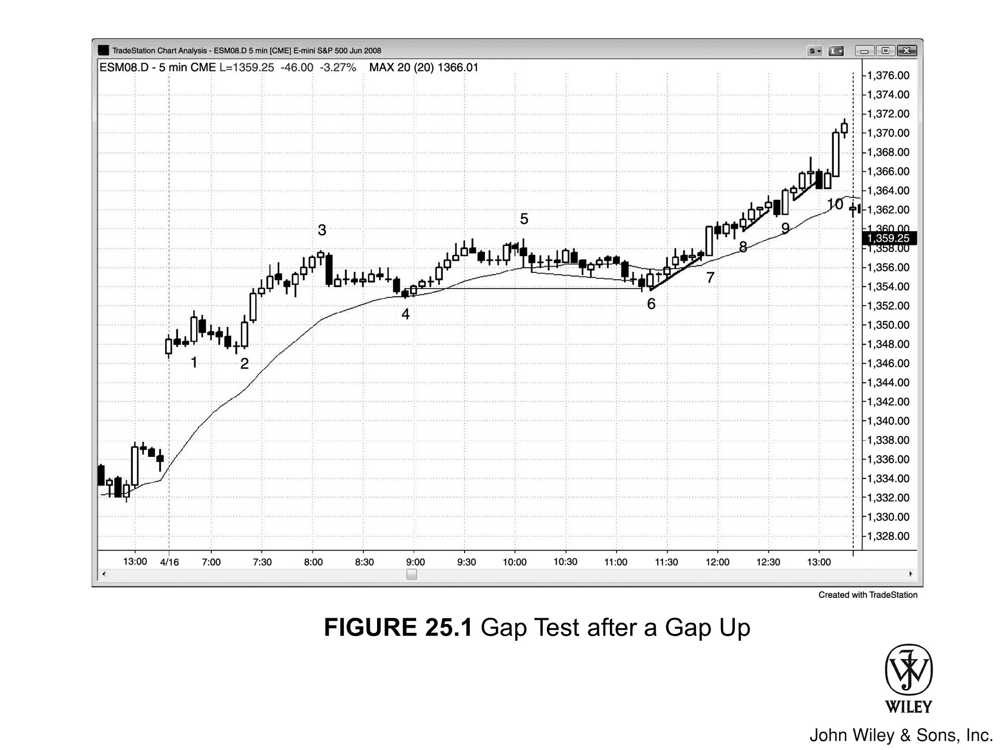
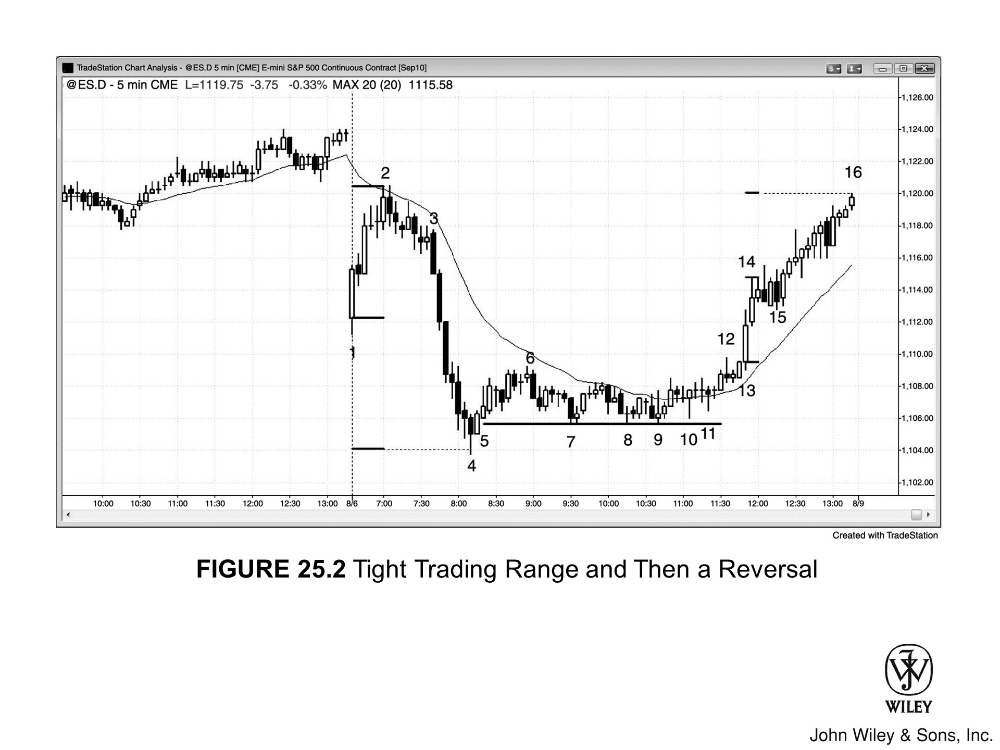
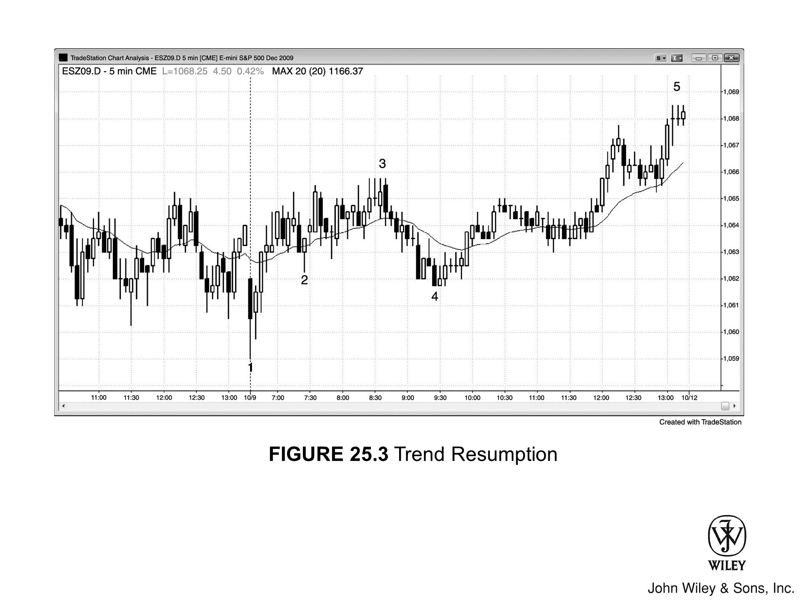
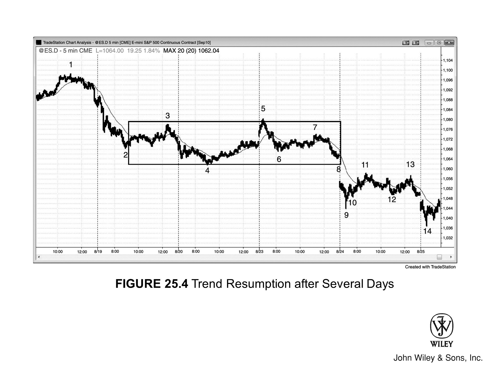

## 趋势恢复日的核心特征

- 开盘后约一小时内出现强趋势，随后进入**交易区间**。
- **交易区间**持续数小时，常让交易员误以为当天余下时间会一直平静。
- 最后一两个小时，趋势重新启动。
- 第二段行情的幅度通常与第一段大致相当。
- 漫长的**交易区间**往往是极窄的**交易区间**。
- 临近尾盘，**交易区间**常出现一次试图反转趋势的**突破**，但通常只是陷阱——市场随后反向突破，朝原来的趋势方向收盘。**交易区间**越窄，这种陷阱出现的概率越高。
- 对于未能更早入场或在**突破**时入场的交易员，通常还有一次**突破回调**的入场机会。

## 趋势恢复形态的理解

有时开盘后约一小时出现强趋势，然后市场横盘数小时。每当出现这种情况，尤其是横盘走势形成了极窄的**交易区间**时，当天很可能正在演变为**趋势恢复日**。不要因为盘中的沉闷而放弃关注，因为最后一小时左右可能出现强趋势。**突破**方向通常与早盘趋势一致，但有时也会朝反方向突破，将当天转变为**反转日**。

以开盘为**空头趋势**为例：尾盘通常从**交易区间**向下**突破**，当天往往高开低收。太平洋标准时间上午11点到中午之间，常会出现短暂的一到两根K线的强势**反转突破**，但随即失败，把交易员骗入错误方向（做多），之后市场通常转向另一方向突破。整个过程发展很快，但只要提前预判到这种走势，就有机会抓住尾盘大幅下跌的行情。当然，这次反转**突破**有时也会成功，最后一小时的趋势（如果有的话）可能回撤早盘**空头趋势**的全部或部分跌幅。

盘中横盘走势不一定是窄**交易区间**，往往两个方向都有可交易的行情腿。有时会出现三段节奏迟缓的逆势推进，形成**楔形旗形**；有时第三段无法超越第二段，形成**头肩旗形**（大多数头肩**反转形态**最终都会失败，沦为延续形态）。正因为这类形态经常有三段而非两段推进，容易让开盘建仓的交易员误以为逆势走势已经演变为新的反向趋势，从而被甩出局。不要被这种情况吓退，要做好准备，一旦出现好的**建仓形态**，立刻顺着早盘趋势入场。

盘中，多空双方都在不断加仓，最终许多人会达到自己愿意持有的最大仓位。一旦**突破**发生，亏损一方无法继续加仓，只能寄望行情反转，否则就会被**止损出场**。以早盘出现强**空头趋势**、随后横盘为例：在接下来数小时的**交易区间**里，多空双方持续加仓，很多人逐渐达到最大仓位上限。一旦市场开始向下突破，多头便无力再买入。失去了多头的托盘，空头便如入无人之境。下跌过程中往往不断加速，因为越来越多的多头放弃抵抗，抛出亏损的多头仓位，反过来又加剧了尾盘的崩跌。

这类走势最难的地方在于：盘中平静的横盘往往让交易员失去耐心，但恰恰是这种时候才应该把它视为机会。要做好随时入场的准备。这种形态中最理想的机会，一个月也只出现几次。

## 弱势趋势恢复日

有时盘中并不形成横盘**交易区间**，而是出现数小时的弱势逆势推进，让交易员难以判断当天究竟是**反转日**还是**趋势恢复日**。这可能是弱势**趋势恢复日**正在形成——走势感觉更像**交易区间**日，但收盘时却是一端开盘、另一端收盘。留意开盘时的趋势是否在最后一小时重新启动，做好入场准备。

以开盘急跌为例：如果随后出现动能较弱、带有三段上推的反弹，回撤了初始跌幅的一部分甚至全部，就要做好准备——一旦**多头通道**下方出现**突破**，**空头趋势**将延续至收盘。若**多头通道**顶部的**突破**随即反转向下，这可以作为尾盘趋势行情中一次不错的**波段**做空入场机会。也可以等待通道下方的**突破**，寻找低风险做空的**建仓形态**；或者等**空头趋势**重新启动后，在**突破回调**或回调至均线附近时入场。即使5分钟图看起来像**交易区间**，在更高时间周期图上或许呈现ABC结构，但只要收盘靠近低点，当天就会在日线图上留下一根**空头趋势K线**。

## 跨日趋势恢复形态

**趋势恢复**形态有时需要跨越两天甚至更长时间才能完成。5分钟图上看似波动剧烈的行情，放到60分钟图上可能只是一个简单的ABC结构。比如，昨天出现了一段持续数小时的强劲**多头急速**上涨，随后进入**交易区间**，今天这个交易区间继续延伸——那么昨天的趋势随时可能恢复。提前意识到这一点，你才会愿意持有更大的仓位做波段，等待一波可能相当可观的行情。

## 图 25.1：跳空高开后的缺口回测

大**缺口**开盘日，市场往往会先回测开盘价，然后趋势才真正启动。图 25.1 中，市场跳空高开，随后出现**双底**回测低点，接着大幅反弹至K线3。此后市场在窄幅区间内横盘超过三个小时，让交易员误以为当天的好行情已经结束。K线6从下方刺穿**空头趋势通道线**后反转向上，同时向下突破了K线4**信号K线**高点一个tick——这把一些空头套在了做空位置，也让不少多头错失了持仓机会。这段尾盘上涨行情的信号K线，是当天第一根**均线缺口K线**。

做多机会不止这一个，K线7、9、10处均出现了从**微型趋势线**失败**突破**后反转向上的机会。

### 图 25.1 深度解析

图 25.1 中，K线7是一个**高 2** 入场点，也是一根小型**多头趋势线**被一个tick突破后的反转做多。K线1是**高 1** 入场点。

K线8是**高 2** 的变体（**空头-多头-空头**K线组合：K线7之后的K线收阴，形成第一次下推；紧接着一根阳线向上运行；然后又出现一根阴线，形成第二次下推）。

## 图 25.2：窄交易区间后的反转

强趋势之后出现的窄**交易区间**，有时不是趋势恢复，而是**反转**。图 25.2 中，当天从K线3开始大幅下跌，随后横盘数小时形成窄交易区间。这种情况通常会引发**空头趋势**向尾盘延续，最后一段跌幅往往与最初的跌幅相当。区间顶部经常先出现一次失败**突破**，然后才开始最终的空头腿。K线12是**波段做空**的完美**建仓形态**：它是一根**空头反转K线**，在收盘前较晚时段突破了窄交易区间顶部。但下一根K线并没有成为大幅下跌的入场K线，而是一根小型**多头内包K线**，构成了一个**突破回调**做多建仓形态。K线12突破区间顶部，内包K线是一次暂停，本质上就是一种**回调**。

### 图 25.2 深度解析

图 25.2 中，当天以大幅**跳空低开**开盘，紧跟一根强劲的**多头反转K线**，构成了失败**突破**做多以及可能的**始于开盘的趋势**多头日建仓形态。

K线13和14是两根大**多头趋势K线**，形成了一次**两K线突破**。任何**突破**之后通常都会出现基于急速段的**测量移动**。一般以急速段第一根K线的开盘价或最低价，到最后一根K线的收盘价或最高价之间的高度为基准。当天的收盘高点，恰好等于从K线13开盘价到K线14最高价的测量移动目标。

大多数**趋势恢复**空头日不会在开盘出现大幅拉升，这次的大幅拉升本身就表明多头当天愿意积极买入。即便盘中走势完美地指向了尾盘大跌，也永远无法百分之百确定，相反情况始终有大约40%的概率发生。还有一个暗示市场可能反弹回测当天开盘价的线索：当天最低点与从当天开盘到初始上涨高点之间的距离，几乎构成一个完美的**测量移动**。这意味着开盘价处于当天整体区间的中点位置。如果市场能涨回那里，当天就接近于走出一根**十字星**日线K线，这种情况相当常见。

市场反复精确地在K线7低点的**支撑**线上测试，每次都找到买盘。K线8后面的内包K线、K线9后面的内包K线，以及K线9和K线11形成的更高低点，都构成了**双底回调**做多建仓形态。

这条**支撑**线位于K线5入场K线下方一个tick处，K线5是预期从**卖出高潮**出现**回调**后的入场点。K线5是在当天最低点**两K线反转**形态上方的入场K线。市场向下突破了该入场K线止损位一个tick，但尽管多次尝试，始终无法进一步下行，这是强势多头存在的明显信号。整个窄交易区间期间，买入程序和卖出程序持续交替运行，但最终买入程序压倒了卖出程序。那些空头全部需要回补，进一步推升了买压。与此同时，大量卖出程序翻转为买入程序，进一步推高了市场。K线14和15形成急速上涨，随后进入一段**通道**延伸至收盘。

## 图 25.3：趋势恢复

即使初始拉升只有几根强**趋势K线**、看起来像是要走成**交易区间**日，**趋势恢复**仍然可能相当强劲。图 25.3 中，市场从一个扩张三角形底部启动，同时对昨天低点形成失败**突破**，以**始于开盘的趋势**多头趋势开局。随后上涨了两根K线，但在昨天交易区间中点附近停滞。从任何**三连推**形态反转向上，通常至少会走出两段上涨，最终这里确实如此演绎。

K线2是一次**突破回调**，带来了小幅继续上涨，但随后市场失去动能，只是在**均线**上方缓慢上行，直到K线3。到了这个位置，明显感觉有些不对劲。**始于开盘的趋势**多头是最强势的趋势形态之一，但这里的趋势显然不强。这意味着交易员很快会意识到当天走势与预期不符，选择离场观望，转而关注交易区间日以及可能再创当天新低的机会。

K线2低点之后有可能出现**双底牛旗**，但在早盘缺乏强势多头介入的情况下，空头会积极下压争取创出当天新低，K线2低点大概率会被跌破。K线4是对K线2低点的第二次小幅下探，随后市场向尾盘展开趋势性上涨，走出了一个偏弱的**趋势恢复**多头日，同时也完成了**扩张三角形**底部预期中的第二段上涨。K线4精确地**回测**了**始于开盘趋势信号K线**的高点。

## 图 25.4：跨越数日的趋势恢复

**趋势恢复**可以跨越数日才完成。图 25.4 中，市场大幅下跌至K线2，随后进入**交易区间**横盘两天半。**交易区间**可以持续很长时间，但通常最终会沿趋势方向突破。**空头趋势**最终恢复，从K线5到K线14完成了第二段下跌，此时距第一段下跌结束已过去五天。

从K线5到K线6的**空头腿**之后出现了一段**交易区间**，第二段下跌在次日开盘时于K线9处结束。

从K线7到K线9的下跌之后，市场横盘至K线13形成**交易区间**，随后**空头趋势**恢复，下跌至K线14。这是一个历时三天的**趋势恢复**形态。
