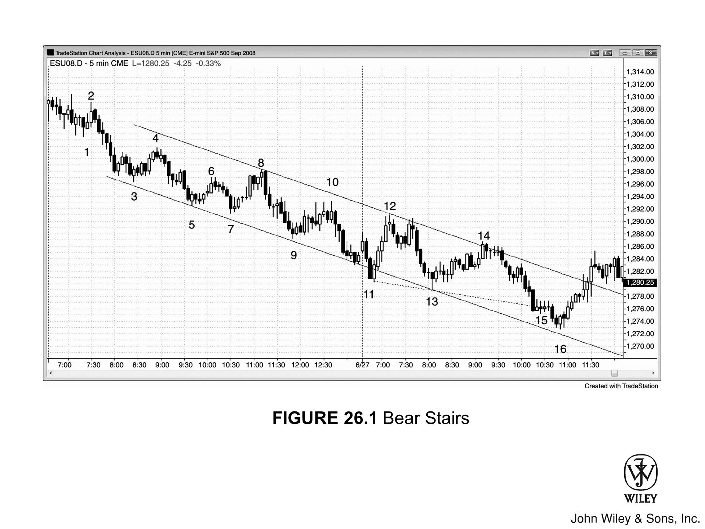
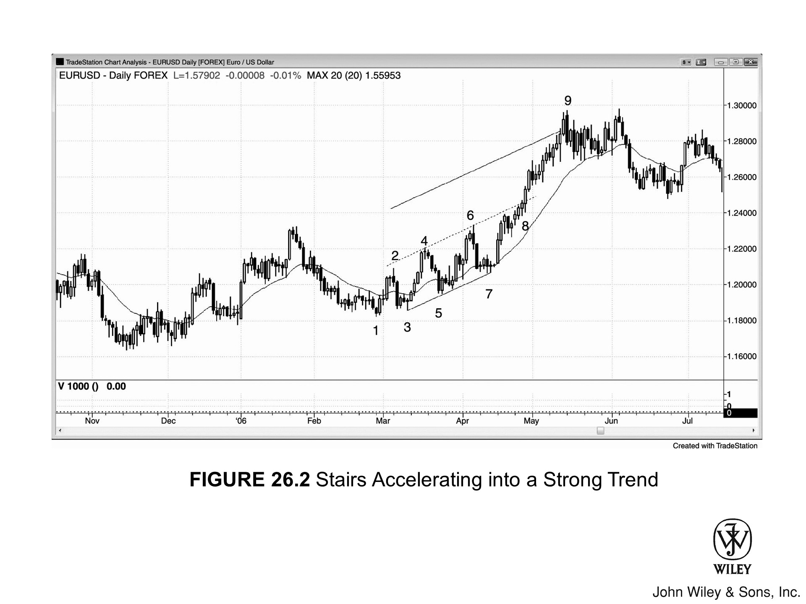
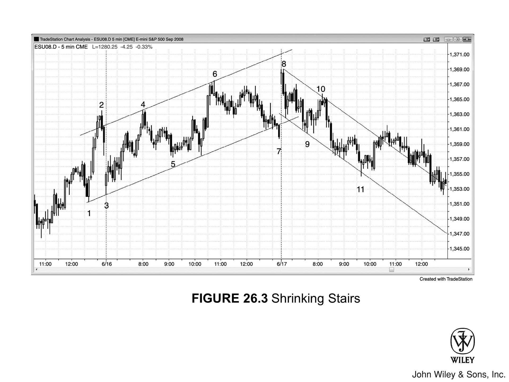

## 楼梯日的核心特征

- **楼梯日**是**趋势性交易区间日**的一种变体，全天至少包含三个交易区间。
- 整体波动幅度较宽，但高低点始终保持**趋势性递升或递降**的特征。
- 由于波动幅度较大，交易员通常可以双向入场，但应尽量将**顺势交易**做成波段，持有部分或全部仓位。
- 几乎每次**突破**之后都会跟随一次**回调**（即**突破回测**），回调会越过突破点，导致相邻两段行情之间产生重叠。以宽幅**空头通道**为例，每次下破新低之后，反弹都会回到突破点上方，但仍低于最近的**波段高点**。偶尔也会出现一两段行情略微超过前一个**波段高点**的情况，让部分交易员误以为趋势已经反转，但趋势通常会很快恢复。
- 如果每次突破的幅度都比前一次小，就形成了**缩梯形态**，说明动能正在减弱，可能引发更大幅度的回调。

## 概述

当市场出现三段或三段以上的趋势性波动，整体形态类似于一个微倾的交易区间或通道时，说明多空双方都处于活跃状态，只是其中一方的力量稍强。每次**回调**都会越过对应的**突破**点，使急冲段与随后的回调之间产生重叠。宽幅通道内存在**双向交易**机会，交易员可以寻找双向入场点。如果突破幅度逐步缩小，就形成了**缩梯形态**，表明动能衰减，往往会引发**两段式回调**并跌破**趋势线**。很多**三推反转**本质上就是楼梯或缩梯趋势最终失败并反转的结果。楼梯形态通常只是更高时间周期趋势中的一段回调或旗形，常见于当日最后一两个小时，然后在次日开盘时完成旗形突破。比如，今天的宽幅**多头通道**可能只是一面大型**空头旗**，空头趋势可能在明天爆发。

另一种情况是，某一级台阶突然加速，顺势突破**趋势通道线**。如果随后出现反转，这次**过冲**加上反转很可能带来至少**两段**的反向行情。如果没有反转，突破行情大概率会再走出至少两段，或走出约等于通道高度的**不精确测量移动**——即突破通道后的移动距离大致等于通道内部的高度。

交易员会留意每次**突破**超过最近**波段极值点**的幅度（以 Tick 计），并据此在后续突破中**押注失败**，预判**突破回测**的到来。举例来说，如果上一个**波段低点**比前一个低了 14 个 Tick，交易员就会从最近波段低点下方约 10 个 Tick 处开始分批建**多头**仓位，这个位置通常靠近**趋势通道线**。如果最近一次从突破低点反弹了约 15 个 Tick，他们会在低点上方 10 到 15 个 Tick 附近止盈，该位置通常靠近**趋势线**（即**空头通道**的上轨）。

## 图 26.1：空头楼梯

**空头楼梯**是一种向下倾斜的通道，每次下破新低之后，都会出现**回调**并回到突破点上方。以图 26.1 为例，K线 6 下方的突破一直延伸至 K线 9，随后反弹回到了 K线 7 低点上方；K线 9 再次下破后延伸至 K线 13 的那一段，反弹同样回到了 K线 9 突破点上方，与前一段区间形成重叠。

部分交易员选择在靠近**趋势通道线**时买入、靠近**趋势线**时做空。另一些交易员则关注每次**突破**在**回调**出现之前走出的幅度。比如，K线 5 的低点比 K线 3 的低点低约 4 点。激进的**多头**交易员在 K线 5 低点下方约 3 到 4 点处挂**限价买单**，但在跌至 K线 7 的过程中未能成交。随后市场跌破 K线 7，他们再次在下方 3 到 4 点处挂限价单，并在跌至 K线 9 时成功成交——K线 9 的低点恰好比 K线 7 低点低约 4 点。由于之前的反弹幅度约为 4 点，他们在入场点上方约 3 点处止盈。跌至 K线 11 和 K线 16 时，他们也采用了相同的操作。跌至 K线 13 时他们同样尝试了，但市场跌幅不够，限价单未能成交。**空头**则反向操作：过去的反弹约 4 到 6 点，因此他们在最近**波段低点**上方约 3 到 5 点处分批做空，该区域通常位于**空头趋势线**附近。这种交易方式仅适合有经验的交易员，新手应坚持用**突破单**入场，确保市场已经朝自己预期的方向运动（这部分内容在第二册中详述）。

K线 7 是第三次向下推进，也构成一个**缩梯形态**（它超过 K线 5 的幅度小于 K线 5 超过 K线 3 的幅度）。图中的**通道线**以最佳拟合线绘制，用于凸显市场正处于下降通道之中。这里显然存在**双向交易**机会，当交易员看到合适的**建仓形态**时，应在低点买入、高点做空。

### 对图表的深入分析

市场开盘位置接近图 26.1 中昨天形成的**空头通道**底部，随即向下突破通道。**突破**失败，出现**两K线反转**，随后拉出**四根K线的多头急速**上涨。市场先形成**双顶**，测试了**空头趋势线**（以最佳拟合方式画出的一条与**趋势通道线**平行的线），随后急速下探至第13根K线。多空双方都打出了**急速**行情后，接下来的通道方向成为争夺焦点。多头试图开启一段新通道，但在**趋势线**处遭遇阻力，随即反转向下，走出**空头通道**。市场随后从测试**趋势通道线**的位置反弹，第16根K线的低点未能触及通道线，这是主动性买盘介入的信号。第16根K线的**两K线反转**同时也是**最终旗形多头**建仓形态，信号源自第15根K线形成的**四K线最终旗形**。

**三连推**下跌并不能保证一定会发生**趋势反转**。从第7根K线开始的下跌过程中，几乎看不到买压——既没有出现明显的大**多头趋势K线**，也没有强力的**高潮式反转**。从第7根K线起的反弹同样力道不足，与强反转通常应有的表现相去甚远。正因如此，它未能吸引足够多的强势多头来真正扭转市场。最终，市场构成了一个**楔形熊旗**——第6根K线与从第7根K线起的两个小推高共同构成三次推进——同时也形成了**LH**（尽管反弹超过了第6根K线的高点，说明具有一定强度，但依然低于第4根K线），**空头趋势**随之恢复。

## 图 26.2：楼梯形态加速成为强趋势

**楼梯形态**可以加速演变为更强的趋势（见图 26.2）。到第7根K线时，欧元/美元外汇图表已形成三个依次抬高的高点与低点，在通道内运行，构成阶梯型**多头趋势**。

第8根K线是一根**多头趋势K线**，突破了通道上轨，随后出现一根**空头反转K线**，但始终未能触发做空。**突破**之后，价格通常会延伸至一个**测量移动**的位置——即上方的一条平行线处，该平行线与中轨的距离约等于中轨与下轨的距离（即**安德鲁斯音叉式运动**），实际走势也确实如此。这种向上加速的形态，是**楔形顶部**失败后的典型结果。到第6根K线时，市场已完成三次向上推进；不过，如果以第4根K线的强**多头急速**为新起点重新计数，第8根K线之前那个小**波段高点**也可以视作第三次推进。**楔形**失败之后，行情走出了大约一段**测量移动**的幅度，约等于楔形本身的高度（以第6根K线高点到第3根或第1根K线低点衡量）。

## 图 26.3：缩梯形态

当每次**突破**的幅度都比上一次更小时，说明趋势动能正在减弱，随后可能出现更大幅度的**回调**甚至**反转**。图 26.3 展示了一个**多头趋势楼梯形态**，其中三个或更多依次递升的高低点被包含在一个大致画出的通道内。第4、第6、第8根K线构成**缩梯形态**，反映出多头动能逐步流失，预示反转临近。该通道本身形同一个大型**熊旗**，**空头突破**发生在第9根K线。

第9根K线**突破**之后，市场**回调**至第10根K线，形成**LH突破回调**，随后走出**楼梯空头趋势**。第10根K线与下行至第9根K线过程中第一段回调的高点大致形成**双顶熊旗**。

第11根K线向下**过冲**了**空头通道**，随后触发小型**两段式反转**上行，并按预期触及通道上轨。

一旦市场开始形成阶梯式下行，通常可以在每根强**趋势K线**收盘**突破**时押注反向剥头皮。具体来说，每当一根**空头趋势K线**收盘跌破前一个**空头阶梯**低点时，可以做多**剥头皮**；反之，在**多头楼梯**中，任何**趋势K线**收盘超过前一个阶梯高点时，均可逢高**剥头皮**做空。不过，总体上更稳妥的方式还是在市场反转后用**突破单**入场——例如，当市场从通道底部反弹时，在前一根K线高点上方挂**突破单**入场。
