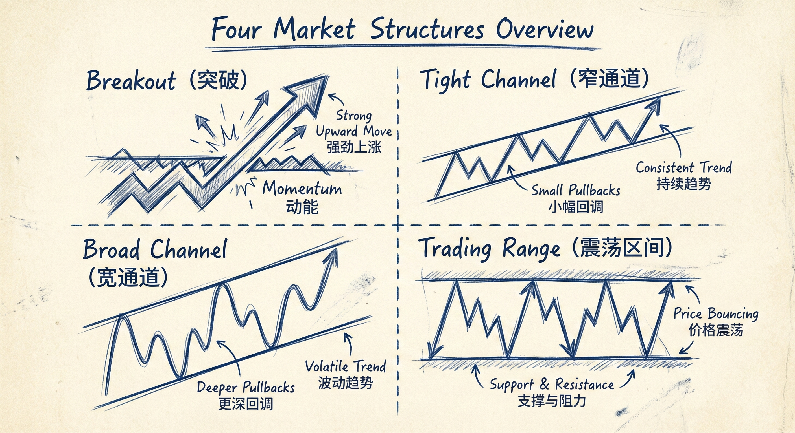
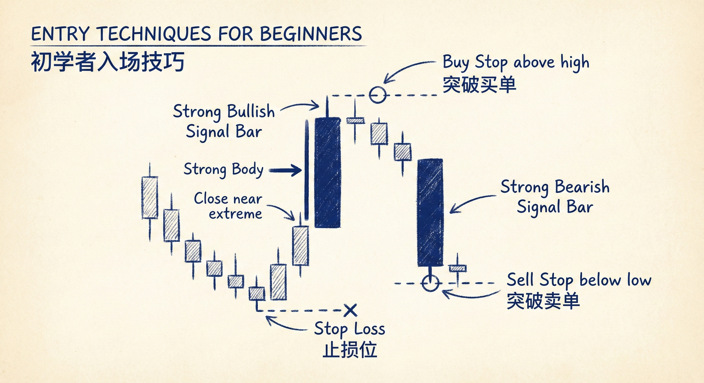

# 交易基础与市场行为（第一部分）

## 市场周期与价格真理

### 市场行为的基本分类
-   **三种基本运动**：市场可以上涨、下跌或横盘。
-   **演变过程**：
    -   **趋势阶段**：以强势突破（Breakout）开始，随后演变为通道（Channel）。
    -   **震荡阶段**：所有的通道最终都会演变为震荡区间（Trading Range）。

### “价格即真理”原则
-   **尊重市场**：如果市场正在下跌（例如连续阴线收在低位），必须承认市场在下跌并做空，无论你认为它“应该”怎么走。
-   **拒绝否认**：否认市场正在发生的小概率事件（如微通道中的反向突破失败）会导致“痛苦交易”。
-   **直觉 vs 价格**：交易者的直觉不是真理，眼前的价格行为才是真理。必须根据看到的（Price Action）交易，而不是根据希望看到的交易。

## 四种市场结构与应对策略

### 1. 突破 (Breakout) / 微通道
-   **特征**：极强趋势，无回调或回调极小，K线重叠少。
-   **策略**：
    -   **只做顺势**：只能买入（上涨中）或卖出（下跌中）。
    -   **入场方式**：市价入场、收盘价入场、或突破单入场。
    -   **风险特征**：胜率高，但止损距离远，风险较大。

### 2. 窄通道 (Tight Channel)
-   **特征**：回调幅度很小，在更高时间周期上看就是突破。
-   **策略**：
    -   **视为突破**：策略与突破阶段相同，只做顺势，不做逆势。
    -   **入场**：利用回调做顺势交易（如在K线高点上方买入）。

### 3. 宽通道 (Broad Channel)
-   **特征**：有更高的高点和更高的低点（上涨中），但回调幅度深，甚至出现短暂的单边反向运动。
-   **策略**：
    -   **双向交易**：既可以顺势做波段，也可以逆势剥头皮（但逆势需谨慎）。
    -   **顺势为主**：在回调（如50%回调）时顺势入场是主要策略。

### 4. 震荡区间 (Trading Range)
-   **特征**：基本上是水平的通道，市场对价格达成共识。
-   **策略**：
    -   **低买高卖**：在区间底部买入，顶部卖出。
    -   **关注价值**：交易基于"价值"（便宜/昂贵）而非"动能"。
    -   **剥头皮**：适合短线快进快出，不追求大趋势。

## 交易误区与核心理念

### 拒绝寻找“秘密策略”
-   **没有秘诀**：不存在能轻松赚钱的秘密公式或完美的蜡烛图形态。
-   **竞争环境**：交易是与世界上最聪明的人竞争，优势微弱。
-   **管理至上**：90%的时间里，只要懂得管理交易（止损、止盈、加仓），做多做空都能赚钱。

### 背景 (Context) 大于形态
-   **形态的局限性**：孤立的蜡烛图形态（如锤子线、吞噬形态）没有意义，必须结合左边的价格行为（背景）。
-   **错误示例**：在强劲的下跌微通道中看到多头反转K线（锤子线）而买入，通常会导致亏损。

## 新手实战指南

### 入场技术 (Entry)
-   **使用突破单 (Stop Orders)**：
    -   **做多**：等待一根收盘在最高点附近的强阳线，在其高点上方挂突破买单。
    -   **做空**：等待一根收盘在最低点附近的强阴线，在其低点下方挂突破卖单。
-   **信号K线**：选择形态良好、实体饱满的K线作为信号。

### 止损与风控 (Risk Management)
-   **止损位置**：
    -   **做多**：放在最近一个上涨波段的起涨点（主要低点）下方。
    -   **做空**：放在最近一个下跌波段的起跌点（主要高点）上方。
-   **资金管理**：
    -   **2%原则**：任何一笔交易的风险不应超过账户总资金的1%~3%（绝对不超过3%）。
    -   **调整**：如果止损距离过大导致风险超标，应放弃交易或减小仓位。

### 时间周期 (Time Frames)
-   **多周期分析**：可以在大周期（如日线、60分钟）找结构，在小周期（5分钟）找入场点以降低风险。
-   **1分钟图警告**：绝大多数交易者（尤其是新手）不应交易1分钟图，因为决策时间太短，容易犯错。

## 总结原则
-   **结构决定策略**：识别当前是突破、通道还是震荡，采取对应策略。
-   **构建交易是关键**：入场点不是最重要的，重要的是止损、止盈和风险控制的构建。
-   **专注波段**：新手应专注于每天寻找1-3个高质量的波段交易机会，避免过度交易。
